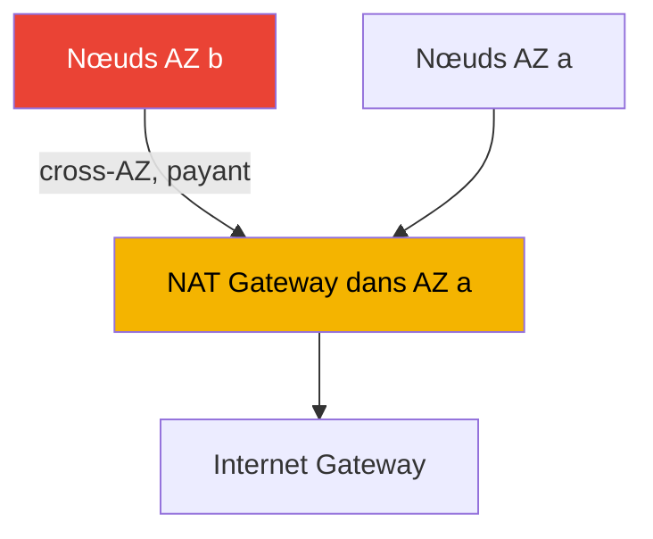
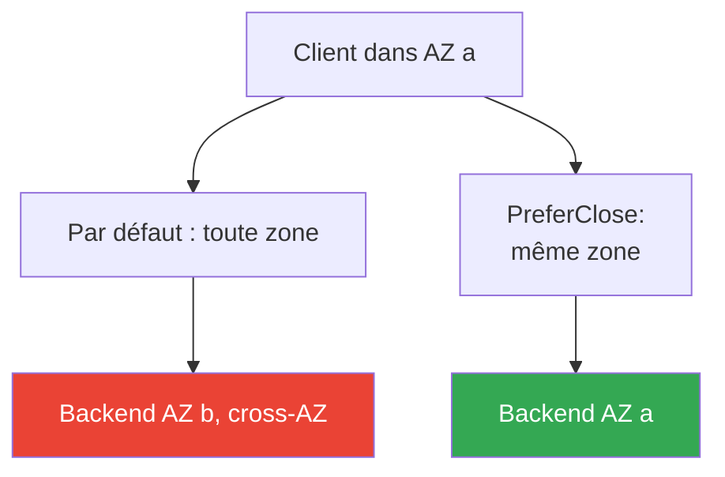

[Eng version](en.md) · [Русская версия](ru.md) · [Versión en español](es.md) · [Deutsche Version](de.md) · [ქართული ვერსია](ge.md) · [繁體中文版](tw.md) · [日本語版](jp.md)
# Chapitre 31. Egress et coût du trafic : NAT, VPC endpoints, PrivateLink

> **La suite.** Les chapitres 26 à 30 ont traité de l'entrée dans le cluster et de l'isolation : NLB (chapitre 26), ALB (chapitre 27), Gateway API (chapitre 28), DNS et certificats (chapitre 29), NetworkPolicy (chapitre 30). Ici, la direction inverse : le trafic sortant vers l'extérieur et son coût, avec NAT Gateway, VPC endpoints, PrivateLink et le trafic cross-AZ. Les fondamentaux de VPC, des sous-réseaux et du NAT figurent dans la partie 0 (chapitre 00-3), le coût global du cluster et Kubecost/OpenCost au chapitre 43, la connectivité multi-cluster et multi-compte au chapitre 32, et l'accès privé à S3 pour Mountpoint a été évoqué au chapitre 25. Une seule question ici : où part le trafic egress des pods dans EKS et pourquoi est-il facturé.

## 31.1. « Le cluster fonctionne, mais data transfer augmente comme ligne séparée sur la facture »

Le cluster est correctement construit : les nœuds sont dans des sous-réseaux privés et sortent par NAT Gateway, comme le recommande tout guide VPC. Les charges de travail tournent, il n'y a pas d'incident. Pourtant, un mois plus tard, une ligne non prévue apparaît dans Cost Explorer :

```
NatGateway-Bytes         ... montant important
DataTransfer-Regional-Bytes  ... montant comparable
NatGateway-Hours         ... montant notable
```

Ces lignes ne sont liées ni aux instances ni aux volumes, ne sont pas visibles dans `kubectl top` et ne peuvent pas être détectées par le HPA. Leur source est le trafic réseau des pods lui-même : chaque gigaoctet qui passe par NAT Gateway entraîne des frais de traitement, et le trafic entre zones de disponibilité entraîne des frais de transfert dans les deux sens. Les deux se produisent discrètement :

- les pods tirent des images depuis ECR : les couches sont stockées dans S3 et le pull sort par NAT ;
- l'application appelle S3, DynamoDB ou des API externes : tout l'egress passe par NAT ;
- un pod dans l'AZ `a` échange avec un pod ou une base de données dans l'AZ `b` : c'est du cross-AZ et il est facturé ;
- CloudWatch Logs, STS pour IRSA, les appels d'API EC2 : tous produisent des octets sortants.

Rien de cela n'est « cassé ». Dans le cloud, le trafic réseau est simplement une ressource payante, et dans EKS, il est généré automatiquement par des centaines de pods, non manuellement par les ingénieurs. Tant que le chemin egress n'est pas conçu, avec un NAT par zone et des VPC endpoints pour le trafic AWS, la facture de data transfer augmente silencieusement. Voyons de quoi elle se compose et ce qui relève de l'ingénieur.

## 31.2. NAT Gateway : son rôle et son modèle de coût

En production, les nœuds EKS résident dans des sous-réseaux privés : ils n'ont pas d'IP publique et ne sont pas accessibles depuis Internet. Les pods ont toutefois besoin d'un accès sortant : pull d'images, appels d'API externes, mises à jour. Pour qu'un sous-réseau privé puisse initier des connexions sortantes vers Internet, on place une **NAT Gateway** dans un sous-réseau public, un service AWS géré de traduction d'adresses. La route `0.0.0.0/0` depuis le sous-réseau privé mène vers le NAT, et le NAT vers l'Internet Gateway.

Le modèle de coût de NAT Gateway comprend deux éléments indépendants :

- Des **frais horaires** pour la NAT Gateway elle-même, facturés tant qu'elle existe, indépendamment du trafic.
- Des **frais pour les données traitées**, pour chaque gigaoctet qui traverse le NAT, dans un sens ou dans l'autre.

Le deuxième élément est le piège. NAT facture le traitement de chaque gigaoctet d'egress et, lorsque tout le trafic sortant du cluster y passe, pull d'images, appels d'API AWS, accès à S3, le volume augmente vite. Le trafic vers les services AWS, tels que S3, ECR et DynamoDB, est facturé comme un egress ordinaire via NAT, alors que ces services se trouvent à l'intérieur du réseau AWS et n'ont pas besoin d'un chemin par NAT vers Internet. C'est le premier trafic supprimé par l'optimisation avec les VPC endpoints, décrits en section 31.3.

### Le piège cross-AZ : un seul NAT pour tout le cluster

La principale cause des factures inattendues est un mauvais placement du NAT entre les zones. Une NAT Gateway réside dans une AZ donnée. Si vous placez un seul NAT dans l'AZ `a` et répartissez les nœuds sur trois zones, le trafic des nœuds des AZ `b` et `c` traverse d'abord **la frontière de zone** pour atteindre le NAT dans `a`, puis sort. Ce saut cross-AZ est facturé en plus du traitement par NAT : vous payez deux fois.



L'architecture correcte est **une NAT Gateway par AZ** hébergeant des nœuds, avec la route du sous-réseau privé vers le NAT de sa propre zone. Ainsi, l'egress ne traverse pas de frontière d'AZ avant de sortir et les frais cross-AZ sur ce segment disparaissent. Les frais horaires augmentent, car le NAT n'est plus unique mais présent dans chaque zone, mais les économies liées à l'élimination du cross-AZ et à la réduction des risques compensent généralement ce coût. Il y a un deuxième avantage : la défaillance d'une AZ ne prive pas les nœuds des autres zones d'egress.

| Architecture NAT | Egress cross-AZ | Tolérance aux pannes | Frais horaires |
|---|---|---|---|
| Un NAT pour le cluster | présent, pour tout trafic issu des autres AZ | une panne d'AZ coupe l'egress pour tous | minimaux |
| Un NAT dans chaque AZ | absent sur le segment jusqu'au NAT | une panne d'AZ n'affecte pas les autres | plus élevés, selon le nombre de zones |

## 31.3. VPC endpoints : les deux types et leurs différences

Un VPC endpoint permet de joindre un service AWS sans sortir sur Internet ni passer par NAT. Le trafic reste dans le réseau AWS. Il existe exactement deux types, avec des fonctionnements différents.

**Gateway endpoints.** Ils ne sont pris en charge que par **S3 et DynamoDB**. Il s'agit d'une entrée dans la table de routage du sous-réseau : le trafic vers les préfixes S3/DynamoDB de la région est envoyé vers l'endpoint plutôt que vers NAT. Les gateway endpoints sont **gratuits** : aucun coût horaire et aucun coût de données. Pour EKS, c'est une économie directe : le pull des couches d'image depuis ECR utilise S3 et, avec un gateway endpoint S3, ce volume quitte le NAT pour un chemin gratuit. Les applications qui utilisent intensivement S3 bénéficient du même avantage.

**Interface endpoints.** Ils fonctionnent grâce à **AWS PrivateLink**. Une ENI avec une IP privée est créée dans le sous-réseau, et les appels vers le service lui sont adressés. Ils prennent en charge la plupart des services AWS, pas uniquement S3 et DynamoDB. Leur coût est constitué de **frais horaires par endpoint** et de **frais pour les données traitées**. Ils sont plus coûteux qu'un gateway endpoint, mais retirent NAT du chemin vers le service et maintiennent le trafic privé. Avec le private DNS activé, les applications continuent d'appeler les noms publics des services sans modifier le code : la résolution est remplacée par l'IP privée de l'endpoint.

| Propriété | Gateway endpoint | Interface endpoint |
|---|---|---|
| Base | entrée dans la route table | PrivateLink, ENI dans le sous-réseau |
| Services | uniquement S3 et DynamoDB | la plupart des services AWS |
| Coût | gratuit | horaire + données |
| Mécanisme | route vers les préfixes du service | IP privée, private DNS |
| Le trafic évite NAT | oui | oui |

Les deux types ont un point commun : le trafic vers le service ne passe pas par NAT et ne quitte pas le réseau AWS. Ils diffèrent par leur prix et leur couverture. La règle est simple : utilisez toujours un gateway endpoint pour S3 et DynamoDB, car il est gratuit ; pour les autres services, utilisez un interface endpoint là où il faut retirer NAT ou garantir la confidentialité.

## 31.4. Les endpoints importants pour EKS

Les endpoints ne sont pas obligatoires pour un cluster ordinaire avec accès à Internet, mais ils retirent le trafic AWS du NAT payant. Ils sont indispensables à un **cluster privé** sans accès sortant, voir chapitre 19 : sans eux, les nœuds ne s'enregistrent pas et les pods ne reçoivent ni images ni credentials. Voici l'ensemble indiqué par AWS pour un cluster privé :

| Endpoint | Type | Rôle |
|---|---|---|
| com.amazonaws.`region`.s3 | gateway | couches d'image ECR et accès des applications à S3 |
| com.amazonaws.`region`.ecr.api | interface | API ECR, authentification et métadonnées |
| com.amazonaws.`region`.ecr.dkr | interface | pull des images elles-mêmes depuis ECR |
| com.amazonaws.`region`.sts | interface | STS pour IRSA (`AssumeRoleWithWebIdentity`) |
| com.amazonaws.`region`.eks-auth | interface | obtention de credentials pour EKS Pod Identity |
| com.amazonaws.`region`.ec2 | interface | API EC2, y compris le nom DNS du nœud sur une AMI optimisée EKS |
| com.amazonaws.`region`.elasticloadbalancing | interface | fonctionnement d'AWS Load Balancer Controller |
| com.amazonaws.`region`.logs | interface | envoi des journaux des nœuds et des pods vers CloudWatch Logs |

Quelques nuances sont faciles à manquer :

- **ECR tire les images depuis S3.** Les trois endpoints sont nécessaires au pull : `ecr.api`, `ecr.dkr` et le gateway vers `s3`. Sans endpoint S3, l'authentification auprès d'ECR réussit, mais le téléchargement des couches échoue.
- **IRSA contre Pod Identity.** IRSA utilise `sts`, auquel s'ajoute l'endpoint OIDC `oidc-eks` pour privatiser l'accès au JWKS du cluster ; Pod Identity utilise `eks-auth`. Le choix dépend du mécanisme d'identité retenu, chapitres 16 et 17.
- **STS est global par défaut.** De nombreux SDK appellent `sts.amazonaws.com`, en contournant l'endpoint régional. Dans un cluster privé, les SDK sont configurés pour utiliser l'endpoint STS régional.
- **Private DNS.** Pour les interface endpoints, activez private DNS afin que les charges de travail continuent d'employer les noms publics des services sans changement.

Ajoutez `ssm`, `xray`, `autoscaling`, `eks` et d'autres services selon les besoins. La liste complète des services disponibles avec PrivateLink se trouve dans la documentation. Le principe est d'activer un endpoint pour chaque service AWS réellement appelé par les pods et les composants système.

## 31.5. PrivateLink : accès privé aux services

Les interface endpoints sont un cas particulier d'**AWS PrivateLink**, un mécanisme d'accès privé aux services par une ENI dans votre sous-réseau. PrivateLink couvre deux scénarios, au-delà de l'accès aux services AWS publics :

- **Services dans un autre compte ou chez un fournisseur.** Le fournisseur, SaaS ou équipe voisine, publie son service comme **endpoint service**, et le consommateur crée un interface endpoint qui le cible. Le trafic circule de manière privée dans le réseau AWS, sans sortie Internet, sans VPC peering et sans ouvrir les réseaux l'un vers l'autre. La connexion est unidirectionnelle : le consommateur l'initie et le fournisseur l'accepte.
- **Vos propres services entre VPC et comptes.** Derrière un NLB, vous pouvez publier votre propre service comme endpoint service et donner accès à d'autres comptes, sans réunir leurs VPC dans un réseau commun.

Pour EKS, cela importe de deux façons. D'abord, les pods peuvent accéder de manière privée à des API externes de fournisseurs sans egress Internet : le trafic ne passe pas par NAT et ne quitte pas AWS. Ensuite, les services du cluster lui-même peuvent être publiés vers l'extérieur par endpoint service, un sujet de connectivité multi-compte détaillé au chapitre 32. Il suffit ici de comprendre que PrivateLink est le même interface endpoint, mais que la cible peut être un service dans un autre compte plutôt qu'un service AWS.

## 31.6. Trafic cross-AZ entre pods et comment le conserver dans la zone

La seconde source importante de data transfer après NAT est le trafic pod-à-pod qui traverse une frontière d'AZ. Par défaut, un Service répartit les requêtes entre tous les endpoints sains sans tenir compte de leur zone : un pod en AZ `a` a autant de chances d'atteindre un backend en `a`, `b` ou `c`. Chaque requête inter-zone est facturée et, sur un service chargé, cela devient une ligne notable de la facture.

Kubernetes propose un mécanisme pour conserver le trafic dans sa zone : le **topology aware routing**. Il est contrôlé par le champ `trafficDistribution` de la spécification Service avec la valeur `PreferClose` : kube-proxy cherche à diriger la requête vers un endpoint de la même zone que le client et ne sort vers une autre zone que si aucun endpoint local n'est disponible. Le champ est devenu GA dans Kubernetes `1.33` ; dans les versions antérieures, la même logique était activée par l'annotation `service.kubernetes.io/topology-mode: Auto`.

```yaml
apiVersion: v1
kind: Service
metadata:
  name: backend
spec:
  trafficDistribution: PreferClose   # conserve le trafic dans la zone du client
  selector:
    app: backend
  ports:
    - { port: 80, targetPort: 8080 }
```

Pour avoir des endpoints locaux dans chaque zone, les pods backend sont répartis entre les AZ avec `topologySpreadConstraints` et la clé `topology.kubernetes.io/zone`. L'un ne fonctionne pas sans l'autre : si toutes les répliques backend se trouvent dans une seule zone, `PreferClose` fera tout de même traverser la frontière au trafic. Les load balancers disposent de leur propre levier, le **cross-zone load balancing** : lorsqu'il est activé, le LB répartit uniformément les requêtes entre les cibles de toutes les zones, avec une charge plus homogène mais plus de cross-AZ ; lorsqu'il est désactivé, il conserve le trafic dans sa zone d'arrivée, moins cher mais avec une charge plus inégale. Le paramètre dépend du type de load balancer et a été traité aux chapitres 26 et 27.

Une nuance importante doit être formulée honnêtement. Réduire le trafic cross-AZ **entre en conflit** avec la fiabilité multi-AZ. En cas de défaillance ou de déséquilibre dans une zone, `PreferClose` maintient obstinément le trafic local tant qu'il reste un endpoint vivant, ce qui peut créer un point chaud. Multi-AZ, PDB et topology spread comme outils de fiabilité sont expliqués au chapitre 40 ; on y traite aussi du point à partir duquel il faut accepter le trafic cross-AZ au nom de la résilience. N'optimisez pas le trafic au détriment de la disponibilité.



## 31.7. Structure du coût egress : ce qu'il faut optimiser

Maintenant que le tableau est complet, décomposons le data transfer du cluster. Les chiffres ne sont pas fournis : c'est la structure et le moyen de réduire chaque élément qui comptent.

| Composante | Ce qui la génère | Comment la réduire |
|---|---|---|
| Sortie vers Internet | egress des pods vers l'extérieur, réponses aux clients externes | cache d'images, CDN, moins d'egress inutile |
| Traitement NAT | tout egress des sous-réseaux privés via NAT | VPC endpoints pour le trafic AWS |
| Cross-AZ | pod-à-pod et pod-à-base à travers la frontière de zone | trafficDistribution, topology spread |
| NAT horaire | la seule présence d'une NAT Gateway | ne pas multiplier inutilement les NAT, mais en avoir un par AZ |
| Interface endpoints horaires | chaque interface endpoint | seulement les endpoints nécessaires, gateway pour S3/DDB |

La priorité d'optimisation suit généralement cet ordre. D'abord, le **gateway endpoint pour S3**, gratuit, qui retire immédiatement du NAT les pull d'images et le trafic applicatif vers S3. Puis un **NAT par zone** au lieu d'un seul par cluster, ce qui élimine le cross-AZ sur le chemin egress. Ensuite, les **interface endpoints** pour les services très sollicités par les pods, ECR, logs, sts, là où le traitement NAT coûte plus que le tarif horaire de l'endpoint. En parallèle, `trafficDistribution` avec topology spread pour les services internes fortement chargés. Mesurez l'effet par la facture et les métriques, pas à l'œil, voir chapitre 43.

## 31.8. Application en production

- **Placez un NAT dans chaque AZ avec des nœuds.** Un NAT unique par cluster économise peu sur les frais horaires mais génère du cross-AZ pour tout l'egress des autres zones et crée un point de défaillance unique.
- **Activez toujours un gateway endpoint pour S3.** Il est gratuit et retire aussitôt du NAT payant les pull d'images ECR et le trafic applicatif vers S3. Faites de même pour DynamoDB s'il est utilisé.
- **Construisez un cluster privé à partir de la liste des endpoints.** Avant le premier pod, préparez `ecr.api`, `ecr.dkr`, `s3`, `sts` ou `eks-auth`, `ec2`, `logs`, `elasticloadbalancing` et tout ce que les charges de travail appellent.
- **Retirez consciemment de NAT l'egress vers AWS.** Créez des interface endpoints pour les services à fort trafic ; lorsque le traitement NAT est plus coûteux que le prix horaire de l'endpoint, l'économie est directe.
- **Réduisez le cross-AZ avec topology aware routing.** Sur les services internes à fort trafic east-west, ajoutez trafficDistribution PreferClose et topology spread, sans oublier le compromis avec la fiabilité.
- **Surveillez le trafic avec la facture et les métriques.** Les métriques CloudWatch de NAT, `BytesOutToDestination` et `BytesInFromDestination`, ainsi que les lignes de Cost Explorer montrent où le data transfer s'écoule réellement.

## 31.9. Mini-glossaire

- **NAT Gateway** : service AWS géré de traduction d'adresses qui donne aux sous-réseaux privés un accès sortant à Internet ; facturé à l'heure et par gigaoctet traité.
- **trafic cross-AZ** : transfert de données entre zones de disponibilité ; facturé pour le transfert, généralement dans les deux sens.
- **VPC endpoint** : point d'accès privé à un service AWS sans sortie Internet ni passage par NAT.
- **Gateway endpoint** : type de VPC endpoint pour S3 et DynamoDB via une entrée de route table ; gratuit.
- **Interface endpoint** : type de VPC endpoint basé sur PrivateLink : une ENI dans le sous-réseau, avec un coût horaire et un coût de données.
- **AWS PrivateLink** : mécanisme d'accès privé aux services AWS et aux services d'autres comptes par interface endpoint.
- **endpoint service** : publication de votre propre service, derrière un NLB, comme cible PrivateLink pour les consommateurs d'autres VPC et comptes.
- **topology aware routing** : préférence pour les endpoints dans la zone du client ; activée avec le champ `trafficDistribution: PreferClose` dans Service.
- **cross-zone load balancing** : mode de load balancer qui répartit le trafic entre les cibles de toutes les zones ; charge plus homogène, mais davantage de cross-AZ.

## 31.10. Synthèse du chapitre

- Dans le cloud, le trafic réseau est une ressource payante, et dans EKS, des centaines de pods le génèrent automatiquement ; le data transfer apparaît comme lignes séparées sur la facture, et non dans `kubectl top`.
- NAT Gateway fournit l'egress aux sous-réseaux privés et est facturée de deux manières : à l'heure et pour chaque gigaoctet traité ; le second coût augmente avec les pull d'images et les appels d'API AWS.
- Le piège principal est un NAT unique par cluster : le trafic des nœuds des autres AZ traverse la frontière de zone vers le NAT et est facturé deux fois. La bonne pratique consiste à avoir un NAT dans chaque AZ avec des nœuds.
- Les VPC endpoints maintiennent le trafic vers les services AWS dans le réseau AWS, sans NAT. Les gateway endpoints pour S3 et DynamoDB sont gratuits ; les interface endpoints, via PrivateLink, coûtent à l'heure et par donnée mais couvrent presque tous les services.
- Un cluster privé a besoin des endpoints `s3` en gateway, `ecr.api`, `ecr.dkr`, `sts` ou `eks-auth`, `ec2`, `logs`, `elasticloadbalancing` et d'autres selon les besoins ; ECR tire les couches depuis S3.
- PrivateLink fournit aussi un accès privé aux services d'autres comptes par endpoint service, sans sortie Internet ni mise en réseau commune des VPC.
- Le trafic cross-AZ pod-à-pod se réduit avec `trafficDistribution: PreferClose`, GA en `1.33`, associé à topology spread ; les load balancers sont influencés par cross-zone load balancing.
- L'économie de trafic est en conflit avec la fiabilité multi-AZ : PreferClose peut créer un point chaud lors d'un déséquilibre de zone ; le compromis est traité au chapitre 40.

## 31.11. Utilité dans le travail réel

En astreinte, l'egress apparaît rarement comme un incident, mais comme une facture. Lorsque la finance signale une augmentation de `NatGateway-Bytes` ou de `DataTransfer-Regional-Bytes`, l'analyse suit une chaîne familière : existe-t-il un gateway endpoint pour S3, faute de quoi les pull d'images et le trafic vers S3 sont sur NAT ; combien de NAT Gateway existent et dans quelles zones ; quels services internes envoient du trafic east-west à travers les frontières d'AZ. Les métriques NAT dans CloudWatch et le détail de Cost Explorer par usage type indiquent quelle composante augmente réellement : il n'est pas nécessaire de deviner.

Lors de la planification, trois décisions se prennent à l'avance. Combien de NAT et dans quelles zones : un par AZ est presque toujours le bon défaut. Quel ensemble de VPC endpoints : pour un cluster privé, c'est une condition de démarrage ; pour un cluster standard, un moyen de retirer le trafic AWS de NAT. Et où activer topology aware routing, en pesant l'économie cross-AZ contre la résistance au déséquilibre d'une zone. Ces trois sujets sont liés au coût global du cluster, récapitulé au chapitre 43, et à la fiabilité multi-AZ du chapitre 40.

## 31.12. Questions d'auto-évaluation

1. Pourquoi le data transfer dans EKS augmente-t-il alors que les ingénieurs ne déplacent pas le trafic manuellement, et où est-il visible ?
2. De quels deux éléments se compose le coût d'une NAT Gateway, et lequel est généralement inattendu ?
3. Quel est le piège d'une seule NAT Gateway par cluster, et pourquoi ce trafic est-il payé deux fois ?
4. Comment répartir correctement les NAT Gateway entre les zones, et quels avantages cela apporte-t-il au-delà de l'économie ?
5. En quoi un gateway endpoint diffère-t-il d'un interface endpoint en termes de fonctionnement, de couverture et de coût ?
6. Pourquoi un gateway endpoint S3 est-il également nécessaire au pull d'images depuis ECR ?
7. Quel ensemble de VPC endpoints nécessite un cluster EKS privé sans accès Internet ?
8. Quels endpoints sont nécessaires à IRSA, et lesquels à EKS Pod Identity ?
9. Qu'est-ce qu'un endpoint service et quel scénario PrivateLink couvre-t-il ?
10. Comment conserver le trafic pod-à-pod dans sa zone, et quel champ Service l'active ?
11. Pourquoi `trafficDistribution: PreferClose` ne fonctionne-t-il pas sans topology spread entre les zones ?
12. Comment cross-zone load balancing affecte-t-il le volume de trafic cross-AZ ?
13. Quel est le conflit entre l'économie de trafic cross-AZ et la fiabilité multi-AZ ?

## Pratique

Le lab du cours associé à ce sujet : [lab 117 - Trafic et coût : NAT par zone contre NAT unique, VPC endpoints, cross-AZ](../../labs/117/README_FR.MD). En plus de ce lab, vérifiez le chemin egress du cluster dans un compte actif. Commencez par regarder combien de NAT Gateway existent et dans quelles zones elles se trouvent :

```bash
# NAT Gateway et leurs sous-réseaux (l'AZ est déterminée par le sous-réseau)
aws ec2 describe-nat-gateways \
  --query "NatGateways[].{Id:NatGatewayId,Subnet:SubnetId,State:State}" --output table

# VPC endpoints déjà créés dans le VPC
aws ec2 describe-vpc-endpoints \
  --query "VpcEndpoints[].{Name:ServiceName,Type:VpcEndpointType,State:State}" --output table
```

Vérifiez s'il y a parmi eux un gateway endpoint S3 et des interface endpoints ecr.api/ecr.dkr : s'ils sont absents, le pull d'images passe par NAT. Évaluez ensuite combien d'octets traversent réellement le NAT grâce aux métriques CloudWatch de l'espace de noms `AWS/NATGateway` :

```bash
# somme des octets sortants par NAT sur une journée
aws cloudwatch get-metric-statistics --namespace AWS/NATGateway \
  --metric-name BytesOutToDestination --statistics Sum --period 86400 \
  --dimensions Name=NatGatewayId,Value=nat-xxxxxxxx \
  --start-time 2024-01-01T00:00:00Z --end-time 2024-01-02T00:00:00Z
```

Enfin, dans Cost Explorer, regroupez les coûts par usage type et recherchez les lignes `NatGateway-Bytes`, `NatGateway-Hours` et `DataTransfer-Regional-Bytes` : elles constituent précisément l'objet de l'optimisation de la section 31.7. Vérifiez pour les services internes si `trafficDistribution` est défini et si leurs pods sont répartis entre les zones avec `topologySpreadConstraints`.

---
[Table des matières](../README_FR.md) · [Chapitre 30](../30/fr.md) · [Chapitre 32](../32/fr.md)
