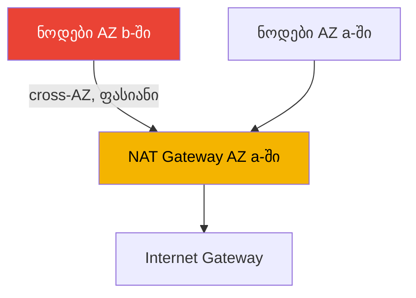
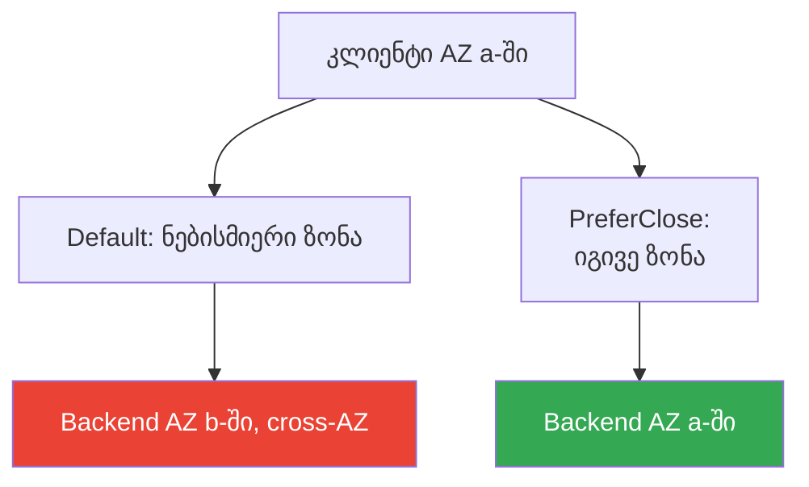

[Русская версия](ru.md) · [Eng version](en.md) · [Versión en español](es.md) · [Version française](fr.md) · [Deutsche Version](de.md) · [繁體中文版](tw.md) · [日本語版](jp.md)
# თავი 31. Egress და ტრაფიკის ღირებულება: NAT, VPC endpoints, PrivateLink

> **რა არის შემდეგ.** 26-30-ე თავებში განხილული იყო კლასტერში შესვლა და იზოლაცია: NLB (თავი 26), ALB (თავი
> 27), Gateway API (თავი 28), DNS და სერტიფიკატები (თავი 29), NetworkPolicy (თავი 30). აქ განვიხილავთ
> საპირისპირო მიმართულებას - გამავალ ტრაფიკსა და მის ღირებულებას: NAT Gateway, VPC endpoints,
> PrivateLink, cross-AZ. VPC-ის, subnet-ებისა და NAT-ის საბაზისო მოწყობა მოცემულია ნაწილ 0-ში (თავი 00-3),
> მთლიანად კლასტერის ღირებულება და Kubecost/OpenCost - 43-ე თავში, მულტიკლასტერული და მულტიაკაუნტური
> კავშირი - 32-ე თავში, ხოლო S3-თან კერძო წვდომა Mountpoint-ისთვის ნახსენები იყო 25-ე თავში. აქ
> მხოლოდ ერთი საკითხია: სად მიდის EKS-ში პოდების egress-ტრაფიკი და რატომ მოდის მასზე ანგარიში.

## 31.1. „კლასტერი მუშაობს, ანგარიშში კი data transfer ცალკე სტრიქონად იზრდება“

კლასტერი სწორადაა აწყობილი: ნოდები კერძო subnet-ებშია, გარეთ კი NAT Gateway-ის გავლით გადის, როგორც
VPC-ის ნებისმიერი სახელმძღვანელო გვასწავლის. workload-ები მუშაობს, ინციდენტები არ არის. ერთი თვის შემდეგ
კი Cost Explorer-ში ჩნდება სტრიქონი, რომელიც ბიუჯეტში არავის გაუთვალისწინებია:

```
NatGateway-Bytes         ... დიდი თანხა
DataTransfer-Regional-Bytes  ... მსგავსი თანხა
NatGateway-Hours         ... შესამჩნევი თანხა
```

ეს სტრიქონები არც instance-ებთანაა მიბმული და არც volume-ებთან, `kubectl top`-ში არ ჩანს და HPA-ც
ვერ დაიჭერს. მათი წყარო თავად პოდების ქსელური ტრაფიკია: NAT Gateway-ის გავლით გატარებული ყოველი
გიგაბაიტის დამუშავებისთვის საფასური გეკისრებათ, ხოლო ხელმისაწვდომობის ზონებს შორის ტრაფიკისთვის -
ორივე მიმართულებით მონაცემთა გადაცემის საფასური. ორივე შეუმჩნევლად წარმოიქმნება:

- პოდები image-ებს ECR-იდან ქაჩავენ - layer-ები S3-ში ინახება და pull NAT-ის გავლით გარეთ გადის;
- აპლიკაცია S3-ს, DynamoDB-სა და გარე API-ებს მიმართავს - მთელი egress NAT-ის გავლით მიდის;
- AZ `a`-ში არსებული პოდი AZ `b`-ში არსებულ პოდს ან მონაცემთა ბაზას უკავშირდება - ეს cross-AZ-ია და ფასიანია;
- CloudWatch Logs, STS IRSA-სთვის, EC2 API-ის გამოძახებები - ეს ყველაფერი გამავალი ბაიტებია.

აქედან არცერთი არ არის „გაფუჭებული“. უბრალოდ, cloud-ში ქსელური ტრაფიკი ფასიანი რესურსია, EKS-ში კი მას
არა ინჟინრები ხელით, არამედ ასობით პოდი ავტომატურად წარმოქმნის. სანამ egress-ის გზა არ არის გამართული
(NAT ზონების მიხედვით, VPC endpoints AWS-ისკენ მიმართული ტრაფიკისთვის), data transfer-ის ანგარიში
ჩუმად იზრდება. განვიხილოთ, რისგან შედგება ის და რისი მართვა შეუძლია ინჟინერს.

## 31.2. NAT Gateway: რისთვის არის საჭირო და როგორია მისი ღირებულების მოდელი

production-ში EKS-ის ნოდები კერძო subnet-ებშია - მათ საჯარო IP-მისამართები არ აქვთ და ინტერნეტიდან
ვერავინ დაუკავშირდება. თუმცა თავად პოდებს გარეთ გამავალი წვდომა სჭირდებათ: image-ების pull, გარე API-ების
გამოძახება, განახლებები. იმისათვის, რომ კერძო subnet-მა ინტერნეტისკენ გამავალი კავშირების ინიციირება
შეძლოს, საჯარო subnet-ში ათავსებენ **NAT Gateway**-ს - AWS-ის მისამართების ტრანსლაციის მართულ
სერვისს. კერძო subnet-იდან მარშრუტი `0.0.0.0/0` NAT-ზე მიდის, NAT-იდან კი - Internet Gateway-ზე.

NAT Gateway-ის ღირებულების მოდელი ორი დამოუკიდებელი ნაწილისგან შედგება:

- **საათობრივი საფასური** თავად NAT Gateway-ისთვის - ირიცხება მთელი მისი არსებობის განმავლობაში,
  ტრაფიკის მიუხედავად.
- **დამუშავებული მონაცემების საფასური** - NAT-ის გავლით ნებისმიერი მიმართულებით გატარებული ყოველი
  გიგაბაიტისთვის.

მეორე ნაწილი სწორედ ის ხაფანგია. NAT egress-ის თითოეული გიგაბაიტის დამუშავებისთვის თანხას იღებს და,
როდესაც კლასტერის მთელი გამავალი ტრაფიკი - image-ების pull, AWS API-ის გამოძახებები, S3-თან მიმართვები -
მის გავლით მიდის, მოცულობა სწრაფად გროვდება. ამასთან, AWS-ის სერვისებისკენ (S3, ECR, DynamoDB) NAT-ის
გავლით მიმავალი ტრაფიკი ჩვეულებრივი egress-ის მსგავსად ფასდება, მიუხედავად იმისა, რომ ეს სერვისები AWS-ის
ქსელშია და მათთან მისასვლელად ინტერნეტში NAT-ის გავლით გასვლა საჭირო არ არის. ოპტიმიზაციისას პირველ რიგში
სწორედ ამას აუქმებენ (VPC endpoints, განყოფილება 31.3).

### Cross-AZ-ის ხაფანგი: ერთი NAT მთელი კლასტერისთვის

მოულოდნელი ანგარიშების მთავარი წყარო NAT-ის ზონებში არასწორი განთავსებაა. NAT Gateway კონკრეტულ AZ-ში
არსებობს. თუ ერთ NAT-ს AZ `a`-ში განათავსებთ, ნოდებს კი სამ ზონაში გაანაწილებთ, AZ `b`-სა და `c`-ში
არსებული ნოდების ტრაფიკი ჯერ **ზონის საზღვარს გადაკვეთს**, რათა `a`-ში NAT-ს მიაღწიოს, და მხოლოდ შემდეგ
გავა გარეთ. ეს cross-AZ hop NAT-ზე დამუშავების საფასურთან ერთად დამატებით ფასდება - ორჯერ იხდით.



სწორი სქემაა **თითო NAT Gateway ყველა იმ AZ-ში**, სადაც ნოდებია, ხოლო კერძო subnet-ის მარშრუტი თავისივე
ზონის NAT-ზე უნდა მიდიოდეს. ამ შემთხვევაში egress გარეთ გასვლამდე AZ-ის საზღვარს არ კვეთს და ამ მონაკვეთზე
cross-AZ საფასური ქრება. საათობრივი საფასური იზრდება (ახლა NAT ერთის ნაცვლად ზონების რაოდენობის ტოლია),
მაგრამ გაუქმებულ cross-AZ ტრაფიკსა და შემცირებულ რისკებზე მიღებული ეკონომია, როგორც წესი, მეტია. არის მეორე
უპირატესობაც: ერთი AZ-ის მწყობრიდან გამოსვლა სხვა ზონების ნოდებს egress-ის გარეშე არ ტოვებს.

| NAT-ის სქემა | Cross-AZ egress | მდგრადობა მწყობრიდან გამოსვლისადმი | საათობრივი საფასური |
|---|---|---|---|
| ერთი NAT კლასტერისთვის | არის, სხვა AZ-ებიდან მთელი ტრაფიკისთვის | AZ-ის გათიშვა ყველას egress-ს უწყვეტს | მინიმალური |
| თითო NAT ყველა AZ-ში | NAT-მდე მონაკვეთზე არ არის | AZ-ის გათიშვა სხვებს არ ეხება | უფრო მაღალი, ზონების რაოდენობის მიხედვით |

## 31.3. VPC endpoints: ორი ტიპი და განსხვავება მათ შორის

VPC endpoint არის AWS-ის სერვისთან ინტერნეტში გასვლისა და NAT-ის გამოყენების გარეშე დაკავშირების გზა.
ტრაფიკი AWS-ის ქსელში რჩება. ზუსტად ორი ტიპი არსებობს და ისინი განსხვავებულადაა მოწყობილი.

**Gateway endpoints.** მხარდაჭერილია მხოლოდ **S3-ისა და DynamoDB-სთვის**. ეს არის ჩანაწერი subnet-ის
მარშრუტიზაციის ცხრილში: S3/DynamoDB region-ის პრეფიქსებისკენ ტრაფიკი NAT-ის ნაცვლად endpoint-ზე იგზავნება.
Gateway endpoints **უფასოა** - არ არის არც საათობრივი და არც მონაცემების საფასური. EKS-ისთვის ეს პირდაპირი
ეკონომიაა: ECR-იდან image-ების layer-ების pull S3-დან ხორციელდება და S3-ის gateway endpoint-ის არსებობისას
ეს მოცულობა NAT-იდან უფასო გზაზე გადადის. იგივე უპირატესობას იღებენ აპლიკაციები, რომლებიც S3-ს ინტენსიურად
იყენებენ.

**Interface endpoints.** მუშაობს **AWS PrivateLink**-ის საფუძველზე. subnet-ში იქმნება ENI კერძო IP-ით
და სერვისთან მიმართვები მასზე მიდის. მას AWS-ის სერვისების უმრავლესობა უჭერს მხარს (არა მხოლოდ
S3/DynamoDB). ღირებულება: **თითოეული endpoint-ის საათობრივი საფასური** და **დამუშავებული მონაცემების
საფასური**. Gateway-ზე ძვირია, მაგრამ სერვისისკენ მიმავალი გზიდან NAT-ს იღებს და ტრაფიკს კერძოდ ტოვებს.
ჩართული private DNS-ის პირობებში აპლიკაციები სერვისების საჯარო სახელებს კოდის შეცვლის გარეშე იყენებენ -
სახელის გადაწყვეტა endpoint-ის კერძო IP-ზე იცვლება.

| თვისება | Gateway endpoint | Interface endpoint |
|---|---|---|
| საფუძველი | ჩანაწერი route table-ში | PrivateLink, ENI subnet-ში |
| სერვისები | მხოლოდ S3 და DynamoDB | AWS-ის სერვისების უმრავლესობა |
| ღირებულება | უფასო | საათობრივი + მონაცემებისთვის |
| როგორ მიიღწევა | მარშრუტი სერვისის პრეფიქსებისკენ | კერძო IP, private DNS |
| ტრაფიკი NAT-ს გვერდს უვლის | დიახ | დიახ |

ორივე ტიპისთვის საერთოა, რომ სერვისისკენ ტრაფიკი NAT-ის გავლით არ მიდის და AWS-ის ქსელს არ ტოვებს.
განსხვავება ფასსა და დაფარვაშია. წესი მარტივია: S3-ისა და DynamoDB-სთვის ყოველთვის gateway (ის უფასოა),
დანარჩენი სერვისებისთვის კი interface იქ, სადაც NAT-ის გზიდან ამოღებაა საჭირო ან კონფიდენციალურობაა
მოთხოვნილი.

## 31.4. რომელი endpoints არის მნიშვნელოვანი EKS-ისთვის

ინტერნეტში გასვლის მქონე ჩვეულებრივი კლასტერისთვის endpoints სავალდებულო არ არის, მაგრამ ისინი AWS-ისკენ
მიმართულ ტრაფიკს ფასიანი NAT-იდან იღებენ. **კერძო კლასტერისთვის**, რომელსაც გარეთ გასვლა არ აქვს (თავი 19),
ისინი აუცილებელია: მათ გარეშე ნოდები ვერ დარეგისტრირდება, პოდები კი ვერც image-ებს და ვერც credentials-ს
მიიღებენ. AWS-ის მიერ კერძო კლასტერისთვის მითითებული ნაკრები ასეთია:

| Endpoint | ტიპი | დანიშნულება |
|---|---|---|
| com.amazonaws.`region`.s3 | gateway | ECR image-ების layer-ები და აპლიკაციების წვდომა S3-თან |
| com.amazonaws.`region`.ecr.api | interface | ECR API, ავთენტიფიკაცია და მეტამონაცემები |
| com.amazonaws.`region`.ecr.dkr | interface | თავად image-ების pull ECR-იდან |
| com.amazonaws.`region`.sts | interface | STS IRSA-სთვის (AssumeRoleWithWebIdentity) |
| com.amazonaws.`region`.eks-auth | interface | credentials-ის მიღება EKS Pod Identity-სთვის |
| com.amazonaws.`region`.ec2 | interface | EC2 API, მათ შორის ნოდის DNS-სახელი EKS-ოპტიმიზებულ AMI-ზე |
| com.amazonaws.`region`.elasticloadbalancing | interface | AWS Load Balancer Controller-ის მუშაობა |
| com.amazonaws.`region`.logs | interface | ნოდებისა და პოდების ლოგების გაგზავნა CloudWatch Logs-ში |

ნიუანსები, რომელთა გამოტოვებაც ადვილია:

- **ECR image-ებს S3-დან ქაჩავს.** Pull-ისთვის სამივე საჭიროა: `ecr.api`, `ecr.dkr` და gateway `s3`-ზე.
  S3-endpoint-ის გარეშე ECR-ში ავთენტიფიკაცია წარმატებით გაივლის, layer-ების ჩამოტვირთვა კი - ვერა.
- **IRSA და Pod Identity.** IRSA იყენებს `sts`-ს (ასევე OIDC-endpoint `oidc-eks`-ს, რათა კლასტერის
  JWKS-თან მიმართვა კერძო გახდეს); Pod Identity - `eks-auth`-ს. რომელი მათგანია საჭირო, დამოკიდებულია
  არჩეულ იდენტობის მექანიზმზე (თავები 16-17).
- **STS ნაგულისხმევად გლობალურია.** ბევრი SDK `sts.amazonaws.com`-ს მიმართავს და რეგიონულ endpoint-ს
  გვერდს უვლის. კერძო კლასტერში SDK-ს შესაბამისი რეგიონის რეგიონულ STS-endpoint-ზე გადართავენ.
- **Private DNS.** Interface endpoints-ისთვის private DNS-ს რთავენ, რის შემდეგაც workload-ები სერვისების
  საჯარო სახელების გამოყენებას ცვლილებების გარეშე აგრძელებენ.

საჭიროების მიხედვით დამატებით იყენებენ `ssm`, `xray`, `autoscaling`, `eks` და სხვა endpoint-ებს -
PrivateLink-ზე ხელმისაწვდომი სერვისების სრული სია დოკუმენტაციაშია. პრინციპი ასეთია: endpoint უნდა ჩართოთ
თითოეული იმ AWS სერვისისთვის, რომელსაც პოდები და სისტემური კომპონენტები რეალურად მიმართავენ.

## 31.5. PrivateLink: სერვისებთან კერძო წვდომა

Interface endpoints არის **AWS PrivateLink**-ის, თქვენს subnet-ში ENI-ის გავლით სერვისებთან კერძო
წვდომის მექანიზმის, კერძო შემთხვევა. AWS-ის საჯარო სერვისებთან წვდომის გარდა, PrivateLink კიდევ ორ
სცენარს ფარავს:

- **სერვისები სხვა ანგარიშში ან მომწოდებელთან.** მომწოდებელი (SaaS, მეზობელი გუნდი) თავის სერვისს
  **endpoint service**-ის სახით აქვეყნებს, მომხმარებელი კი მასზე მიმთითებელ interface endpoint-ს ქმნის.
  ტრაფიკი AWS-ის ქსელში კერძოდ, ინტერნეტში გასვლის, VPC peering-ისა და ქსელების ერთმანეთისთვის გახსნის
  გარეშე მიდის. კავშირი ცალმხრივია: მომხმარებელი იწყებს, მომწოდებელი იღებს.
- **საკუთარი სერვისები VPC-ებსა და ანგარიშებს შორის.** NLB-ის უკან არსებული საკუთარი სერვისი შეგიძლიათ
  endpoint service-ის სახით გამოაქვეყნოთ და სხვა ანგარიშებს მათ VPC-ებთან საერთო ქსელში გაერთიანების
  გარეშე მისცეთ წვდომა.

EKS-ისთვის ეს ორივე მხრიდან მნიშვნელოვანია. პირველი, პოდებს შეუძლიათ მომწოდებლების გარე API-ებთან კერძო
წვდომა ინტერნეტში egress-ის გარეშე - ტრაფიკი NAT-ის გავლით არ მიდის და AWS-ს არ ტოვებს. მეორე, თავად
კლასტერის სერვისების endpoint service-ის მეშვეობით გარეთ გამოქვეყნება მულტიაკაუნტური კავშირის თემაა და ის
დეტალურად 32-ე თავშია განხილული. აქ საკმარისია გვესმოდეს: PrivateLink იგივე interface endpoint-ია, თუმცა
სამიზნე შეიძლება არა AWS-ის სერვისი, არამედ სხვა ანგარიშში არსებული სერვისი იყოს.

## 31.6. Cross-AZ ტრაფიკი პოდებს შორის და მისი ზონაში დატოვების გზა

NAT-ის შემდეგ data transfer-ის მეორე დიდი წყარო AZ-ის საზღვრის გადამკვეთი პოდიდან პოდში ტრაფიკია.
ნაგულისხმევად Service მოთხოვნებს ყველა ჯანმრთელ endpoint-ზე ზონის გაუთვალისწინებლად ანაწილებს: AZ `a`-ში
არსებული პოდი თანაბარი ალბათობით შეიძლება `a`, `b` ან `c`-ში არსებულ backend-ს დაუკავშირდეს. ყოველი
ზონათაშორისი მოთხოვნა ფასიანია და დატვირთულ სერვისზე ეს ანგარიშში შესამჩნევ სტრიქონად იქცევა.

Kubernetes ტრაფიკის საკუთარ ზონაში დასატოვებლად **topology aware routing** მექანიზმს გვთავაზობს. ის
Service-ის სპეციფიკაციაში `trafficDistribution` ველითა და `PreferClose` მნიშვნელობით იმართება: kube-proxy
ცდილობს, მოთხოვნა კლიენტის იმავე ზონაში არსებულ endpoint-ზე მიმართოს და სხვა ზონაში მხოლოდ მაშინ გადადის,
თუ ლოკალური endpoint-ები არ არსებობს. ველი Kubernetes `1.33`-ში GA გახდა; უფრო ადრეულ ვერსიებში იმავე
ლოგიკას ანოტაცია `service.kubernetes.io/topology-mode: Auto` რთავდა.

```yaml
apiVersion: v1
kind: Service
metadata:
  name: backend
spec:
  trafficDistribution: PreferClose   # ტრაფიკი კლიენტის ზონაში დატოვეთ
  selector:
    app: backend
  ports:
    - { port: 80, targetPort: 8080 }
```

იმისათვის, რომ თითოეულ ზონაში საერთოდ არსებობდეს ლოკალური endpoint-ები, backend-პოდებს AZ-ებში
`topologySpreadConstraints`-ის მეშვეობით, `topology.kubernetes.io/zone` გასაღებით ანაწილებენ. ერთი მეორის
გარეშე არ მუშაობს: თუ backend-ის ყველა რეპლიკა ერთ ზონაში აღმოჩნდა, `PreferClose` ტრაფიკს მაინც ზონის
საზღვარზე გაატარებს. Load balancer-ების მხარეს ცალკე ბერკეტია - **cross-zone load balancing**: როდესაც ის
ჩართულია, LB ტრაფიკს ყველა ზონის target-ებზე თანაბრად ანაწილებს (დატვირთვა უფრო თანაბარია, მაგრამ cross-AZ
მეტია); როდესაც გამორთულია - ტრაფიკს შემოსვლის ზონაში ტოვებს (უფრო იაფია, თუმცა დატვირთვა არათანაბარია).
პარამეტრი load balancer-ის ტიპზეა დამოკიდებული და 26-27-ე თავებში იყო განხილული.

აქ ერთი მნიშვნელოვანი და გულწრფელი ნიუანსია. Cross-AZ ტრაფიკის ეკონომია multi-AZ საიმედოობასთან
**კონფლიქტშია**. ერთი ზონის გათიშვის ან დისბალანსის დროს `PreferClose` ტრაფიკს ჯიუტად ლოკალურად დატოვებს,
სანამ ერთი ჯანმრთელი endpoint მაინც არსებობს - ამან შეიძლება hot spot შექმნას. Multi-AZ, PDB და topology
spread, როგორც საიმედოობის ინსტრუმენტები, განხილულია მე-40 თავში; იქვეა ზღვარი, რომლის იქითაც მდგრადობის
გამო cross-AZ ტრაფიკს უნდა შეეგუოთ. ტრაფიკს ხელმისაწვდომობის ხარჯზე ნუ გააუმჯობესებთ.



## 31.7. Egress-ის ღირებულების სტრუქტურა: რა უნდა გააუმჯობესოთ

სრული სურათის მიღების შემდეგ კლასტერის data transfer შემადგენელ ნაწილებად დავშალოთ. რიცხვებს არ
მოვიყვანთ - მნიშვნელოვანია სტრუქტურა და ის, თუ როგორ მცირდება თითოეული პუნქტი.

| შემადგენელი | რა წარმოქმნის | როგორ მცირდება |
|---|---|---|
| ინტერნეტში გამავალი | პოდების გარეთ egress, პასუხები გარე კლიენტებს | image-ების cache, CDN, ნაკლები ზედმეტი egress |
| NAT-ზე დამუშავება | კერძო subnet-ების მთელი egress NAT-ის გავლით | VPC endpoints AWS-ისკენ მიმართული ტრაფიკისთვის |
| Cross-AZ | პოდიდან პოდში და პოდიდან მონაცემთა ბაზაში ზონის საზღვრის გავლით | trafficDistribution, topology spread |
| NAT-ის საათობრივი საფასური | თავად NAT Gateway-ის არსებობის ფაქტი | ზედმეტი NAT-ები არ შექმნათ, მაგრამ ყველა AZ-ში საკმარისი უნდა იყოს |
| Interface endpoints-ის საათობრივი საფასური | თითოეული interface endpoint | მხოლოდ საჭირო endpoints, S3/DDB-სთვის - gateway |

ოპტიმიზაციის პრიორიტეტი, როგორც წესი, ასეთია. ჯერ **gateway endpoint S3-ისთვის** (უფასოა და image-ების
pull-სა და აპლიკაციების S3-ტრაფიკს NAT-იდან დაუყოვნებლივ იღებს). შემდეგ **NAT ზონების მიხედვით**, კლასტერის
ერთადერთი NAT-ის ნაცვლად - ეს egress-ის გზაზე cross-AZ-ს აუქმებს. შემდეგ **interface endpoints** იმ
სერვისებისთვის, რომლებსაც პოდები აქტიურად მიმართავენ (ECR, logs, sts) - იქ, სადაც NAT-ზე დამუშავება endpoint-ის
საათობრივ საფასურზე ძვირია. პარალელურად, დატვირთულ შიდა სერვისებზე გამოიყენეთ **trafficDistribution და
topology spread**. შედეგს უნდა დააკვირდეთ ანგარიშისა და მეტრიკების მიხედვით და არა ვარაუდით (თავი 43).

## 31.8. როგორ იყენებენ ამას production-ში

- **თითოეულ AZ-ში, სადაც ნოდებია, თითო NAT-ს ათავსებენ.** ერთი NAT მთელი კლასტერისთვის საათობრივ
  საფასურზე მცირედ ეკონომიას აკეთებს, სამაგიეროდ სხვა ზონების მთელი egress-ისთვის cross-AZ-სა და მწყობრიდან
  გამოსვლის ერთიან წერტილს ქმნის.
- **S3-ის gateway endpoint-ს ყოველთვის რთავენ.** ის უფასოა და ECR image-ების pull-სა და აპლიკაციების
  S3-ტრაფიკს ფასიანი NAT-იდან დაუყოვნებლივ იღებს. თუ DynamoDB გამოიყენება, ისიც იმავე გზით ერთვება.
- **კერძო კლასტერს endpoints-ის სიიდან იწყებენ.** პირველი პოდის გაშვებამდე ამზადებენ ecr.api, ecr.dkr,
  s3, sts ან eks-auth, ec2, logs, elasticloadbalancing და ყველაფერს, რასაც workload-ები მიმართავენ.
- **AWS-ისკენ egress შეგნებულად გადააქვთ NAT-იდან.** Interface endpoints თავსდება დიდი ტრაფიკის მქონე
  სერვისებისთვის; იქ, სადაც NAT-ზე დამუშავება endpoint-ის საათობრივ საფასურზე ძვირია, ეს პირდაპირი ეკონომიაა.
- **Cross-AZ-ს topology aware routing-ით ამცირებენ.** დიდი east-west ტრაფიკის მქონე შიდა სერვისებზე
  trafficDistribution PreferClose-ს topology spread-თან ერთად იყენებენ და საიმედოობასთან ბალანსი ახსოვთ.
- **ტრაფიკს ანგარიშისა და მეტრიკების მიხედვით აკვირდებიან.** NAT-ის CloudWatch-მეტრიკები
  (`BytesOutToDestination`, `BytesInFromDestination`) და Cost Explorer-ის სტრიქონები აჩვენებს, რეალურად
  სად გაედინება data transfer.

## 31.9. მინი-ლექსიკონი

- **NAT Gateway** - AWS-ის მისამართების ტრანსლაციის მართული სერვისი, რომელიც კერძო subnet-ებს
  ინტერნეტში გამავალ წვდომას აძლევს; ფასდება საათობრივად და დამუშავებული გიგაბაიტების მიხედვით.
- **cross-AZ ტრაფიკი** - მონაცემების გადაცემა ხელმისაწვდომობის ზონებს შორის; ფასდება მონაცემთა გადაცემის
  მიხედვით, როგორც წესი, ორივე მიმართულებით.
- **VPC endpoint** - AWS-ის სერვისთან კერძო წვდომის წერტილი ინტერნეტში გასვლისა და NAT-ის გამოყენების გარეშე.
- **Gateway endpoint** - VPC endpoint-ის ტიპი S3-ისა და DynamoDB-სთვის route table-ში ჩანაწერის მეშვეობით;
  უფასოა.
- **Interface endpoint** - PrivateLink-ზე დაფუძნებული VPC endpoint-ის ტიპი: ENI subnet-ში, საათობრივი
  საფასური და დამატებით მონაცემების საფასური.
- **AWS PrivateLink** - AWS-ის სერვისებთან და სხვა ანგარიშებში არსებულ სერვისებთან interface endpoint-ის
  გავლით კერძო წვდომის მექანიზმი.
- **endpoint service** - საკუთარი სერვისის (NLB-ის უკან) გამოქვეყნება PrivateLink-ის სამიზნედ სხვა VPC-ებსა
  და ანგარიშებში არსებული მომხმარებლებისთვის.
- **topology aware routing** - კლიენტის ზონაში არსებული endpoint-ებისთვის უპირატესობის მინიჭება; Service-ში
  `trafficDistribution: PreferClose` ველით ირთვება.
- **cross-zone load balancing** - load balancer-ის რეჟიმი, რომელიც ტრაფიკს ყველა ზონის target-ებზე ანაწილებს;
  დატვირთვა უფრო თანაბარია, თუმცა cross-AZ მეტია.

## 31.10. თავის შეჯამება

- Cloud-ში ქსელური ტრაფიკი ფასიანი რესურსია და EKS-ში მას ასობით პოდი ავტომატურად წარმოქმნის; data transfer
  ანგარიშში ცალკე სტრიქონებად ჩანს და არა `kubectl top`-ში.
- NAT Gateway კერძო subnet-ებს egress-ს აძლევს და ორმაგად ფასდება: საათობრივად და თითოეული დამუშავებული
  გიგაბაიტისთვის; მეორე ნაწილი image-ების pull-ისა და AWS API-ის გამოძახებების მოცულობაზე სწრაფად გროვდება.
- მთავარი ხაფანგი კლასტერის ერთადერთი NAT-ია: სხვა AZ-ების ნოდების ტრაფიკი NAT-მდე ზონის საზღვარს კვეთს და
  ორჯერ ფასდება. სწორი მიდგომაა თითო NAT ყველა იმ AZ-ში, სადაც ნოდებია.
- VPC endpoints AWS-ის სერვისებისკენ ტრაფიკს NAT-ის გვერდის ავლით AWS-ის ქსელში ტოვებს. Gateway (S3,
  DynamoDB) უფასოა; interface (PrivateLink) საათობრივად და მონაცემების მიხედვით ფასდება, თუმცა თითქმის ყველა
  სერვისს ფარავს.
- კერძო კლასტერს endpoints-ის ნაკრები სჭირდება: s3 (gateway), ecr.api, ecr.dkr, sts ან eks-auth, ec2, logs,
  elasticloadbalancing და საჭიროებისამებრ სხვა endpoints; ECR layer-ებს S3-დან ქაჩავს.
- PrivateLink endpoint service-ის მეშვეობით სხვა ანგარიშებში არსებულ სერვისებთანაც იძლევა კერძო წვდომას,
  ინტერნეტში გასვლისა და VPC-ების საერთო ქსელში გაერთიანების გარეშე.
- პოდიდან პოდში Cross-AZ ტრაფიკს `trafficDistribution: PreferClose`-ით (GA 1.33-ში) topology spread-თან ერთად
  ამცირებენ; load balancer-ებზე გავლენას cross-zone load balancing ახდენს.
- ტრაფიკის ეკონომია multi-AZ საიმედოობასთან კონფლიქტშია: PreferClose-მა ზონის დისბალანსის დროს შეიძლება hot
  spot შექმნას; ბალანსი მე-40 თავშია განხილული.

## 31.11. როგორ გამოგადგებათ ეს რეალურ სამუშაოში

მორიგეობის დროს egress იშვიათად ვლინდება ინციდენტის სახით - ის ანგარიშის სახით ჩნდება. როდესაც ფინანსური
გუნდი გაზრდილ `NatGateway-Bytes` ან `DataTransfer-Regional-Bytes` სტრიქონს მოიტანს, ანალიზი ნაცნობი
ჯაჭვით მიმდინარეობს: არის თუ არა S3-ის gateway endpoint (მის გარეშე image-ების pull და S3-ტრაფიკი NAT-ზეა),
რამდენი NAT Gateway არსებობს და როგორაა განაწილებული ზონებში, რომელი შიდა სერვისები ატარებს east-west
ტრაფიკს AZ-ის საზღვარზე. NAT-ის მეტრიკები CloudWatch-ში და Cost Explorer-ის დაყოფა usage type-ის მიხედვით
აჩვენებს, რომელი შემადგენელი იზრდება რეალურად - გამოცნობა საჭირო არ არის.

დაგეგმვისას სამ გადაწყვეტილებას წინასწარ იღებენ. რამდენი NAT უნდა იყოს და როგორ განაწილდეს ზონებში - თითქმის
ყოველთვის სწორი ნაგულისხმევი არჩევანია თითო NAT ყველა AZ-ში. როგორი უნდა იყოს VPC endpoints-ის ნაკრები - კერძო
კლასტერისთვის ეს გაშვების პირობაა, ჩვეულებრივისთვის კი AWS-ისკენ ტრაფიკის NAT-იდან აღების გზა. ასევე, სად უნდა
ჩაირთოს topology aware routing, cross-AZ ეკონომიისა და ზონის დისბალანსისადმი მდგრადობის აწონვის შემდეგ. სამივე
მთლიანად კლასტერის ღირებულებას უკავშირდება, რომელიც 43-ე თავში ჯამდება, და მე-40 თავში განხილულ multi-AZ
საიმედოობას.

## 31.12. თვითშემოწმების კითხვები

1. რატომ იზრდება data transfer EKS-ში, მიუხედავად იმისა, რომ ინჟინრები ტრაფიკს ხელით არ ატარებენ, და სად ჩანს ის?
2. რომელი ორი ნაწილისგან შედგება NAT Gateway-ის ღირებულება და რომელია, როგორც წესი, მოულოდნელი?
3. რაში მდგომარეობს კლასტერის ერთადერთი NAT Gateway-ის ხაფანგი და რატომ იხდიან ასეთი ტრაფიკისთვის ორჯერ?
4. როგორ უნდა განაწილდეს NAT Gateway ზონებში და ეკონომიის გარდა რას გვაძლევს ეს?
5. მოწყობის, დაფარვისა და ღირებულების მიხედვით რით განსხვავდება gateway endpoint interface endpoint-ისგან?
6. რატომ არის ECR-იდან image-ების pull-ისთვის S3-ის gateway endpoint-იც საჭირო?
7. VPC endpoints-ის რომელი ნაკრები სჭირდება ინტერნეტში გასვლის არმქონე კერძო EKS კლასტერს?
8. რომელი endpoints არის საჭირო IRSA-სთვის და რომელი EKS Pod Identity-სთვის?
9. რა არის endpoint service და PrivateLink-ის რომელ სცენარს ფარავს ის?
10. როგორ დავტოვოთ პოდიდან პოდში ტრაფიკი საკუთარ ზონაში და Service-ის რომელი ველი რთავს ამას?
11. რატომ არ მუშაობს `trafficDistribution: PreferClose` ზონების მიხედვით topology spread-ის გარეშე?
12. როგორ მოქმედებს cross-zone load balancing cross-AZ ტრაფიკის მოცულობაზე?
13. რაში მდგომარეობს cross-AZ ტრაფიკის ეკონომიასა და multi-AZ საიმედოობას შორის კონფლიქტი?

## პრაქტიკა

კურსის ლაბა ამ თემისთვის: [ლაბა 117 - ტრაფიკი და ღირებულება: NAT ზონების მიხედვით ერთი NAT-ის წინააღმდეგ, VPC
endpoints, cross-AZ](../../labs/117/README_GE.MD). მის გარდა, კლასტერის egress-ის გზა მოქმედ ანგარიშზე
მოწმდება. ჯერ ნახეთ, რამდენი NAT Gateway არსებობს და რომელ ზონებშია განთავსებული:

```bash
# NAT Gateway და მათი subnet-ები (AZ subnet-ის მიხედვით განისაზღვრება)
aws ec2 describe-nat-gateways \
  --query "NatGateways[].{Id:NatGatewayId,Subnet:SubnetId,State:State}" --output table

# რომელი VPC endpoints არის უკვე შექმნილი VPC-ში
aws ec2 describe-vpc-endpoints \
  --query "VpcEndpoints[].{Name:ServiceName,Type:VpcEndpointType,State:State}" --output table
```

შეამოწმეთ, არის თუ არა მათ შორის gateway S3-ისთვის და interface ecr.api/ecr.dkr-ისთვის - თუ image-ების pull
NAT-ის გავლით მიდის, ისინი სიაში არ იქნება. შემდეგ CloudWatch-ის `AWS/NATGateway` namespace-ში არსებული
მეტრიკებით შეაფასეთ, რეალურად რამდენი ბაიტი გადის NAT-ის გავლით:

```bash
# NAT-ის გავლით დღე-ღამეში გამავალი ბაიტების ჯამი
aws cloudwatch get-metric-statistics --namespace AWS/NATGateway \
  --metric-name BytesOutToDestination --statistics Sum --period 86400 \
  --dimensions Name=NatGatewayId,Value=nat-xxxxxxxx \
  --start-time 2024-01-01T00:00:00Z --end-time 2024-01-02T00:00:00Z
```

შემდეგ Cost Explorer-ში ხარჯები usage type-ის მიხედვით დააჯგუფეთ და იპოვეთ სტრიქონები `NatGateway-Bytes`,
`NatGateway-Hours` და `DataTransfer-Regional-Bytes` - ეს არის 31.7 განყოფილებაში აღწერილი ოპტიმიზაციის
საგანი. შიდა სერვისებზე შეამოწმეთ, მითითებულია თუ არა `trafficDistribution` და განაწილებულია თუ არა მათი
პოდები ზონების მიხედვით `topologySpreadConstraints`-ის მეშვეობით.

---
[სარჩევი](../README_GE.md) · [თავი 30](../30/ge.md) · [თავი 32](../32/ge.md)