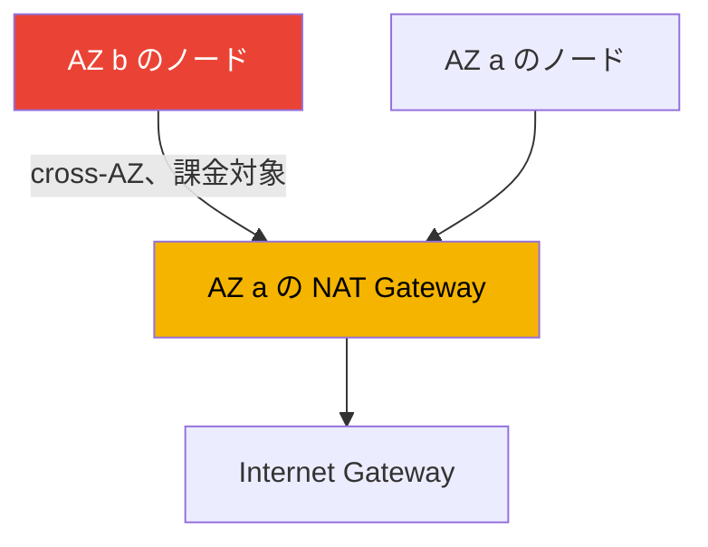
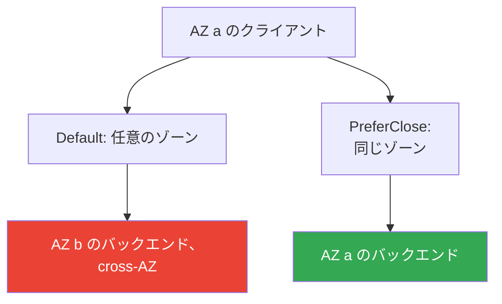

[Eng version](en.md) · [Versión en español](es.md) · [Version française](fr.md) · [Deutsche Version](de.md) · [Русская версия](ru.md) · [ქართული ვერსია](ge.md) · [繁體中文版](tw.md)
# 第31章. Egress とトラフィックコスト: NAT、VPC endpoints、PrivateLink

> **次は何か。** 第26章から第30章では、クラスターへの ingress と分離を扱いました。NLB（第26章）、ALB（第27章）、Gateway API（第28章）、DNS と証明書（第29章）、NetworkPolicy（第30章）です。ここでは逆方向、すなわち外部への egress トラフィックとそのコストを扱います。NAT Gateway、VPC endpoints、PrivateLink、cross-AZ です。VPC、サブネット、NAT の基本構成はパート0（第00-3章）、クラスター全体のコストと Kubecost/OpenCost は第43章、マルチクラスターおよびマルチアカウントの接続性は第32章、Mountpoint の S3 へのプライベートアクセスは第25章で触れています。ここで扱うのは1点です。EKS の Pod の egress トラフィックはどこへ行き、なぜその請求が来るのかです。

## 31.1. 「クラスターは動いているのに、請求書では data transfer が別行で増えている」

クラスターは正しく構築されています。ノードはプライベートサブネットにあり、一般的な VPC ガイドで教えられるとおり、外部へは NAT Gateway を経由して接続します。ワークロードは動作し、インシデントもありません。しかし1か月後、Cost Explorer に誰も予算化していなかった項目が現れます。

```
NatGateway-Bytes         ... 大きな金額
DataTransfer-Regional-Bytes  ... 同程度の金額
NatGateway-Hours         ... 無視できない金額
```

これらの項目はインスタンスやボリュームに紐付かず、`kubectl top` には現れず、HPA でも捕捉できません。原因は Pod 自体のネットワークトラフィックです。NAT Gateway を通過するギガバイトごとに処理料金が発生し、アベイラビリティーゾーン間のトラフィックには双方向の転送料金がかかります。どちらも気付かないうちに発生します。

- Pod が ECR からイメージを pull する。レイヤーは S3 にあり、pull は NAT 経由で外部へ出る。
- アプリケーションが S3、DynamoDB、外部 API にアクセスする。すべての egress は NAT を通る。
- AZ `a` の Pod が AZ `b` の Pod またはデータベースと通信する。これは cross-AZ であり、課金される。
- CloudWatch Logs、IRSA の STS、EC2 API 呼び出し。これらはすべて送信バイトである。

このどれも「壊れている」わけではありません。クラウドではネットワークトラフィックは課金対象のリソースであり、EKS ではエンジニアが手作業で生成するのではなく、数百の Pod が自動的に生成します。egress 経路（AZ ごとの NAT、AWS トラフィック向け VPC endpoints）を整備するまで、data transfer の請求は静かに増えます。何から構成され、どこをエンジニアが制御できるのかを見ていきます。

## 31.2. NAT Gateway: 必要な理由とコストモデル

本番環境の EKS ノードはプライベートサブネットに存在します。パブリック IP を持たないため、インターネットから到達できません。しかし Pod 自身には外部への送信アクセスが必要です。イメージの pull、外部 API へのアクセス、更新などです。プライベートサブネットがインターネットへの送信接続を開始できるよう、パブリックサブネットに **NAT Gateway** という AWS マネージドのアドレス変換サービスを配置します。プライベートサブネットからのルート `0.0.0.0/0` は NAT を向き、NAT は Internet Gateway を向きます。

NAT Gateway のコストモデルは、独立した2つの部分で構成されます。

- **NAT Gateway 自体の時間料金**。トラフィックの有無にかかわらず、存在する間に発生する。
- **処理データ料金**。NAT をどちらの方向に通過したかを問わず、ギガバイトごとに発生する。

罠は後者です。NAT は処理する egress のギガバイトごとに課金します。クラスターのすべての送信トラフィック、つまりイメージ pull、AWS API 呼び出し、S3 へのアクセスが通ると、量はすぐに積み上がります。さらに、AWS サービス（S3、ECR、DynamoDB）へのトラフィックも、これらのサービスが AWS ネットワーク内に存在し、インターネットへの NAT 経路を必要としないにもかかわらず、NAT 経由では通常の egress として課金されます。これが最初に最適化で取り除く対象です（VPC endpoints、第31.3節）。

### cross-AZ の罠: クラスター全体に NAT が1つ

予想外の請求の主因は、AZ をまたぐ NAT 配置の誤りです。NAT Gateway は特定の AZ に存在します。AZ `a` に NAT を1つだけ置き、ノードを3つのゾーンに分散した場合、AZ `b` と `c` のノードのトラフィックは、まず **AZ 境界を越えて** `a` の NAT へ向かい、その後に外部へ出ます。この cross-AZ ホップには NAT 処理料金に加えて追加料金がかかります。二重に支払うことになります。



正しい構成は、ノードが存在する各 AZ に **NAT Gateway を1つずつ**配置し、プライベートサブネットのルートを同じゾーン内の NAT へ向けることです。これにより、egress は外部へ出る前に AZ 境界を越えず、この区間の cross-AZ 料金はなくなります。時間料金は増加します（NAT は1つではなくゾーン数分になる）が、排除される cross-AZ コストとリスクによる節約が通常は上回ります。さらに、1つの AZ が障害になっても、他の AZ のノードが egress を失わないという利点もあります。

| NAT 構成 | Cross-AZ egress | 耐障害性 | 時間料金 |
|---|---|---|---|
| クラスターに NAT 1つ | あり、他 AZ の全トラフィックが対象 | AZ 障害で全体の egress が切れる | 最小 |
| 各 AZ に NAT | NAT までの区間ではなし | AZ 障害が他に影響しない | 高い、ゾーン数に応じる |

## 31.3. VPC endpoints: 2つのタイプと違い

VPC endpoint は、インターネットに出ず NAT を経由せずに AWS サービスへ到達する方法です。トラフィックは AWS ネットワーク内にとどまります。タイプはちょうど2つあり、仕組みが異なります。

**Gateway endpoints。** **S3 と DynamoDB** のみをサポートします。これはサブネットのルートテーブルのエントリーです。リージョンの S3/DynamoDB プレフィックス宛てトラフィックを NAT ではなく endpoint に向けます。Gateway endpoints は**無料**です。時間料金もデータ料金もありません。EKS では直接的な節約になります。ECR のイメージレイヤーの pull は S3 へ行くため、S3 用 gateway endpoint があれば、この量は NAT から無料の経路へ移ります。S3 を多用するアプリケーションでも同様の効果があります。

**Interface endpoints。** **AWS PrivateLink** を基盤とします。サブネットにプライベート IP を持つ ENI が作成され、サービスへのアクセスはその ENI に向かいます。S3/DynamoDB だけでなく、大半の AWS サービスをサポートします。コストは、**endpoint ごとの時間料金**に加え、**処理データ料金**です。gateway より高価ですが、サービスへの経路から NAT を外し、トラフィックをプライベートに保ちます。private DNS を有効にすると、アプリケーションはコードを変更せず従来どおりのサービスのパブリック名へアクセスできます。名前解決が endpoint のプライベート IP に置き換わります。

| 特性 | Gateway endpoint | Interface endpoint |
|---|---|---|
| 基盤 | route table のエントリー | PrivateLink、サブネット内の ENI |
| サービス | S3 と DynamoDB のみ | 大半の AWS サービス |
| コスト | 無料 | 時間料金 + データ料金 |
| 到達方法 | サービスプレフィックスへのルート | プライベート IP、private DNS |
| トラフィックは NAT を回避 | はい | はい |

両タイプに共通するのは、サービスへのトラフィックが NAT を通らず AWS ネットワークから出ないことです。違いは価格と対象範囲です。ルールは単純です。S3 と DynamoDB には常に gateway を使用します（無料です）。その他のサービスでは、NAT を除外する必要がある、またはプライバシーが必要なところで interface を使用します。

## 31.4. EKS に重要な endpoints

インターネットへ出られる通常のクラスターでは endpoints は必須ではありませんが、AWS へのトラフィックを有料 NAT から外せます。外部への接続を持たない**プライベートクラスター**（第19章）では必須です。これがなければノードは登録できず、Pod はイメージも credentials も取得できません。AWS がプライベートクラスター向けに示しているセットは次のとおりです。

| Endpoint | タイプ | 用途 |
|---|---|---|
| com.amazonaws.`region`.s3 | gateway | ECR のイメージレイヤーとアプリケーションの S3 アクセス |
| com.amazonaws.`region`.ecr.api | interface | ECR API、認証、メタデータ |
| com.amazonaws.`region`.ecr.dkr | interface | ECR からのイメージ本体の pull |
| com.amazonaws.`region`.sts | interface | IRSA の STS（AssumeRoleWithWebIdentity） |
| com.amazonaws.`region`.eks-auth | interface | EKS Pod Identity の credentials 取得 |
| com.amazonaws.`region`.ec2 | interface | EC2 API。EKS 最適化済み AMI 上のノード DNS 名を含む |
| com.amazonaws.`region`.elasticloadbalancing | interface | AWS Load Balancer Controller の動作 |
| com.amazonaws.`region`.logs | interface | ノードと Pod のログの CloudWatch Logs への送信 |

見落としやすい注意点があります。

- **ECR は S3 からイメージを pull する。** pull には `ecr.api`、`ecr.dkr`、`s3` の gateway の3つすべてが必要です。S3 endpoint がなければ ECR の認証は成功しても、レイヤーのダウンロードは失敗します。
- **IRSA と Pod Identity。** IRSA は `sts` を使用します（さらにクラスターの JWKS へのアクセスをプライベート化するために OIDC endpoint `oidc-eks` も使用します）。Pod Identity は `eks-auth` を使用します。必要なものは、選択したアイデンティティメカニズム（第16-17章）に依存します。
- **STS はデフォルトでグローバル。** 多くの SDK はリージョナル endpoint を通らず `sts.amazonaws.com` にアクセスします。プライベートクラスターでは、SDK をリージョンのリージョナル STS endpoint に切り替えます。
- **Private DNS。** interface endpoints では private DNS を有効にします。するとワークロードは変更なしでサービスのパブリック名を使用し続けられます。

必要に応じて `ssm`、`xray`、`autoscaling`、`eks` なども追加します。PrivateLink で利用できるサービスの全リストはドキュメントにあります。原則は、Pod とシステムコンポーネントが実際にアクセスする各 AWS サービスに対して endpoint を有効にすることです。

## 31.5. PrivateLink: サービスへのプライベートアクセス

Interface endpoints は **AWS PrivateLink** の一例です。これはサブネット内の ENI を介してサービスにプライベートにアクセスする仕組みです。PrivateLink はパブリック AWS サービスへのアクセスに加え、次の2つのシナリオを実現します。

- **別アカウントまたはベンダーのサービス。** プロバイダー（SaaS、隣接チーム）はサービスを **endpoint service** として公開し、コンシューマーはそれを指定する interface endpoint を作成します。トラフィックは AWS ネットワークをプライベートに通り、インターネットへの接続も VPC peering も、相互にネットワークを開放することも不要です。接続は一方向です。コンシューマーが開始し、プロバイダーが受け入れます。
- **VPC とアカウント間の自社サービス。** NLB の背後に独自サービスを endpoint service として公開し、VPC を共通ネットワークに統合せずに他アカウントへアクセスを提供できます。

EKS にとってこれは両面で重要です。第一に、外部ベンダー API へ Pod からプライベートにアクセスできます。トラフィックは NAT を通らず AWS から出ません。第二に、クラスター自身のサービスを endpoint service を通じて外部に公開できます。これはマルチアカウント接続性のテーマであり、第32章で詳しく扱います。ここで理解すべきなのは、PrivateLink は同じ interface endpoint であり、対象が AWS サービスではなく別アカウントのサービスにもなり得ることです。

## 31.6. Pod 間の cross-AZ トラフィックとゾーン内に保つ方法

NAT に続く data transfer の第2の大きな原因は、AZ 境界を越える Pod 間トラフィックです。デフォルトで Service はゾーンを考慮せず、正常なすべての endpoint にリクエストを分散します。AZ `a` の Pod は同じ確率で `a`、`b`、`c` のバックエンドに到達します。ゾーン間リクエストはすべて課金され、高負荷なサービスでは請求書で目立つ項目になります。

Kubernetes にはトラフィックを自ゾーンに保つ仕組み、**topology aware routing** があります。これは Service 仕様の `trafficDistribution` フィールドに `PreferClose` を指定して制御します。kube-proxy はクライアントと同じゾーンの endpoint にリクエストを送ろうとし、ローカル endpoint がない場合にのみ別のゾーンへ送ります。このフィールドは Kubernetes `1.33` で GA になりました。以前のバージョンでは、`service.kubernetes.io/topology-mode: Auto` アノテーションが同じロジックを有効にしていました。

```yaml
apiVersion: v1
kind: Service
metadata:
  name: backend
spec:
  trafficDistribution: PreferClose   # クライアントのゾーン内にトラフィックを保つ
  selector:
    app: backend
  ports:
    - { port: 80, targetPort: 8080 }
```

各ゾーンにローカル endpoint を実際に置くには、`topology.kubernetes.io/zone` キーを持つ `topologySpreadConstraints` によりバックエンド Pod を AZ に分散します。片方だけでは機能しません。バックエンドのすべてのレプリカが1つのゾーンに配置されると、`PreferClose` でもトラフィックは境界を越えます。ロードバランサー側にも **cross-zone load balancing** という制御があります。有効なら LB は全ゾーンのターゲットに均等に分散します（負荷は均等ですが cross-AZ が増えます）。無効なら流入したゾーン内にトラフィックを保ちます（安価ですが負荷は不均等です）。設定はロードバランサーのタイプに依存し、第26-27章で扱いました。

ここには重要な注意点があります。cross-AZ トラフィックの節約は multi-AZ の信頼性と**衝突**します。1つのゾーンに障害または偏りがあっても、`PreferClose` は生きているローカル endpoint が1つでもある限り、トラフィックをローカルに保とうとします。これはホットスポットを作る可能性があります。信頼性の仕組みとしての multi-AZ、PDB、topology spread は第40章で扱います。そこで、可用性のために cross-AZ トラフィックを受け入れるべき境界も説明します。可用性を犠牲にしてトラフィックを最適化しないでください。



## 31.7. egress コストの構造: 最適化対象

全体像を組み立てたので、クラスターの data transfer を要素ごとに分解します。数値ではなく、構造と各項目をどのように削減するかが重要です。

| 構成要素 | 発生要因 | 削減方法 |
|---|---|---|
| インターネットへの送信 | Pod の外部 egress、外部クライアントへの応答 | イメージキャッシュ、CDN、不要な egress の削減 |
| NAT での処理 | プライベートサブネットから NAT を通る全 egress | AWS トラフィック向け VPC endpoints |
| Cross-AZ | AZ 境界を越える Pod 間、Pod とデータベース間 | trafficDistribution、topology spread |
| NAT の時間料金 | NAT Gateway が存在すること自体 | 不要な NAT を増やさない。ただし AZ ごとに必要数を配置 |
| Interface endpoints の時間料金 | 各 interface endpoint | 必要な endpoints のみ使用。S3/DDB には gateway |

最適化の優先順位は通常次のとおりです。まず **S3 用 gateway endpoint** です。無料であり、イメージ pull とアプリケーションから S3 へのトラフィックを NAT からすぐに外します。次に、クラスター全体で1つではなく **AZ ごとの NAT** です。egress 経路の cross-AZ を排除します。続いて、Pod が頻繁にアクセスするサービス（ECR、logs、sts）向けの **interface endpoints** です。NAT の処理料金が endpoint の時間料金より高い箇所で使用します。さらに、高負荷な内部サービスには **topology spread を伴う trafficDistribution** を並行して適用します。効果は推測ではなく、請求書とメトリクスで確認します（第43章）。

## 31.8. 本番環境での適用方法

- **ノードがある各 AZ に NAT を1つずつ配置する。** クラスターに NAT を1つだけ置くと、時間料金はわずかに節約できますが、他 AZ からのすべての egress に cross-AZ が発生し、単一障害点にもなります。
- **S3 用 gateway endpoint は常に有効にする。** 無料であり、ECR のイメージ pull とアプリケーションから S3 へのトラフィックを有料 NAT からすぐに外せます。DynamoDB を使用するなら同様に追加します。
- **プライベートクラスターは endpoints のリストから構築する。** 最初の Pod の前に、ecr.api、ecr.dkr、s3、sts または eks-auth、ec2、logs、elasticloadbalancing、およびワークロードがアクセスするすべてを用意します。
- **AWS への egress を意識して NAT から外す。** トラフィック量の多いサービスに interface endpoints を配置します。NAT の処理料金が endpoint の時間料金より高いところでは直接的な節約になります。
- **topology aware routing で cross-AZ を削減する。** east-west トラフィックが多い内部サービスには、信頼性とのバランスを意識して、trafficDistribution PreferClose と topology spread を設定します。
- **請求書とメトリクスでトラフィックを監視する。** CloudWatch の NAT メトリクス（`BytesOutToDestination`、`BytesInFromDestination`）と Cost Explorer の項目により、data transfer が実際にどこで発生しているかが分かります。

## 31.9. ミニ用語集

- **NAT Gateway** - プライベートサブネットにインターネットへの送信アクセスを提供する AWS マネージドのアドレス変換サービス。時間料金と処理ギガバイト料金が課金されます。
- **cross-AZ トラフィック** - アベイラビリティーゾーン間のデータ転送。通常、双方向の転送に対して課金されます。
- **VPC endpoint** - インターネットに出ず NAT を経由せずに AWS サービスへプライベートにアクセスするための接続点。
- **Gateway endpoint** - route table のエントリーを介する S3 と DynamoDB 向けの VPC endpoint タイプ。無料です。
- **Interface endpoint** - PrivateLink ベースの VPC endpoint タイプ。サブネット内の ENI、時間料金、データ料金で構成されます。
- **AWS PrivateLink** - interface endpoint を通じて AWS サービスおよび別アカウントのサービスへプライベートにアクセスする仕組み。
- **endpoint service** - 他の VPC およびアカウントのコンシューマー向けに、自身のサービス（NLB の背後）を PrivateLink の宛先として公開すること。
- **topology aware routing** - クライアントと同じゾーンの endpoint を優先すること。Service の `trafficDistribution: PreferClose` フィールドで有効にします。
- **cross-zone load balancing** - 全ゾーンのターゲットにトラフィックを分散するロードバランサーのモード。負荷は均等になりますが cross-AZ は増えます。

## 31.10. 章のまとめ

- クラウドではネットワークトラフィックは課金対象のリソースであり、EKS では数百の Pod が自動的に生成します。data transfer は `kubectl top` ではなく請求書の別項目に現れます。
- NAT Gateway はプライベートサブネットに egress を提供し、時間料金と処理ギガバイトごとの料金の2つで課金されます。後者はイメージ pull と AWS API 呼び出しの量によって積み上がります。
- 主な罠はクラスターに NAT が1つだけあることです。他 AZ のノードトラフィックは NAT まで AZ 境界を越えるため、二重に課金されます。正しくはノードがある AZ ごとに NAT を1つです。
- VPC endpoints は AWS サービスへのトラフィックを AWS ネットワーク内に保ち、NAT を回避します。Gateway（S3、DynamoDB）は無料です。interface（PrivateLink）は時間料金とデータ料金がかかりますが、ほぼすべてのサービスを対象にできます。
- プライベートクラスターには、s3（gateway）、ecr.api、ecr.dkr、sts または eks-auth、ec2、logs、elasticloadbalancing など、用途に応じた endpoints が必要です。ECR は S3 からレイヤーを pull します。
- PrivateLink は endpoint service を通じて別アカウントのサービスにもプライベートアクセスを提供します。インターネットへ出ず、VPC を共通ネットワークに統合する必要もありません。
- Pod 間の cross-AZ トラフィックは、topology spread と組み合わせた `trafficDistribution: PreferClose`（1.33 で GA）で削減できます。ロードバランサーでは cross-zone load balancing も影響します。
- トラフィックコストの節約は multi-AZ の信頼性と衝突します。PreferClose はゾーンの偏り時にホットスポットを作る場合があります。バランスは第40章で扱います。

## 31.11. 実務での役立ち方

当番中、egress がインシデントとして表面化することはまれです。請求書として現れます。財務部門から `NatGateway-Bytes` または `DataTransfer-Regional-Bytes` の増加を指摘されたときは、おなじみの順番で調べます。S3 用 gateway endpoint があるか（なければイメージ pull と S3 トラフィックが NAT に載る）、NAT Gateway はいくつあり各ゾーンにどう配置されているか、どの内部サービスが AZ 境界を越えて east-west トラフィックを送っているかです。CloudWatch の NAT メトリクスと Cost Explorer の usage type 別内訳が、実際に増加している構成要素を示すため、推測する必要はありません。

計画時には、3つの決定を先に行います。NAT の数とゾーンごとの配置は、ほとんどの場合、AZ ごとに1つが正しいデフォルトです。VPC endpoints のセットは、プライベートクラスターでは起動条件であり、通常のクラスターでは AWS トラフィックを NAT から外す方法です。そして、ゾーン偏りへの耐性と cross-AZ 節約を比較し、どこで topology aware routing を有効にするかを決めます。この3つはいずれも、第43章でまとめるクラスター全体のコストと、第40章の multi-AZ 信頼性に関係します。

## 31.12. 自己確認の質問

1. エンジニアが手作業でトラフィックを流していないのに EKS の data transfer が増えるのはなぜで、どこで確認できますか。
2. NAT Gateway のコストはどの2つの部分で構成され、通常どちらが想定外になりますか。
3. クラスターに NAT Gateway が1つだけの場合の罠は何で、なぜそのトラフィックに二重で支払うのですか。
4. NAT Gateway をゾーンに正しく配置する方法と、節約以外に得られることは何ですか。
5. gateway endpoint と interface endpoint は、仕組み、対象範囲、コストの点でどう異なりますか。
6. ECR からイメージを pull するのに S3 用 gateway endpoint も必要なのはなぜですか。
7. インターネットへ出ないプライベート EKS クラスターには、どの VPC endpoints セットが必要ですか。
8. IRSA に必要な endpoints はどれで、EKS Pod Identity にはどれが必要ですか。
9. endpoint service とは何で、どの PrivateLink シナリオを実現しますか。
10. Pod 間トラフィックを自ゾーンに保つにはどうし、どの Service フィールドで有効にしますか。
11. `trafficDistribution: PreferClose` がゾーンごとの topology spread なしでは機能しないのはなぜですか。
12. cross-zone load balancing は cross-AZ トラフィック量にどう影響しますか。
13. cross-AZ トラフィックの節約と multi-AZ の信頼性の間には、どのような衝突がありますか。

## 実践

このトピックのコースラボ: [ラボ117 - トラフィックとコスト: AZ ごとの NAT と単一 NAT、VPC endpoints、cross-AZ](../../labs/117/README_JP.MD)。これに加え、クラスターの egress 経路を実際のアカウントで確認します。まず、NAT Gateway がいくつあり、どのゾーンにあるかを確認します。

```bash
# NAT Gateway とそのサブネット（サブネットから AZ を特定する）
aws ec2 describe-nat-gateways \
  --query "NatGateways[].{Id:NatGatewayId,Subnet:SubnetId,State:State}" --output table

# VPC にすでに作成されている VPC endpoints
aws ec2 describe-vpc-endpoints \
  --query "VpcEndpoints[].{Name:ServiceName,Type:VpcEndpointType,State:State}" --output table
```

S3 の gateway と ecr.api/ecr.dkr の interface が含まれているか確認します。イメージ pull が NAT を通っているなら、それらはリストにありません。次に、CloudWatch の namespace `AWS/NATGateway` のメトリクスで、NAT を実際に通過するバイト数を評価します。

```bash
# NAT を経由する1日分の送信バイトの合計
aws cloudwatch get-metric-statistics --namespace AWS/NATGateway \
  --metric-name BytesOutToDestination --statistics Sum --period 86400 \
  --dimensions Name=NatGatewayId,Value=nat-xxxxxxxx \
  --start-time 2024-01-01T00:00:00Z --end-time 2024-01-02T00:00:00Z
```

次に Cost Explorer でコストを usage type ごとにグループ化し、`NatGateway-Bytes`、`NatGateway-Hours`、`DataTransfer-Regional-Bytes` の項目を見つけます。これが第31.7節で扱った最適化対象です。内部サービスで `trafficDistribution` が設定されているか、また Pod が `topologySpreadConstraints` でゾーンに分散されているかも確認します。

---
[目次](../README_JP.md) · [第30章](../30/jp.md) · [第32章](../32/jp.md)
