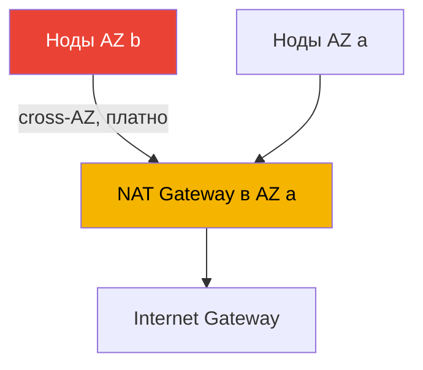
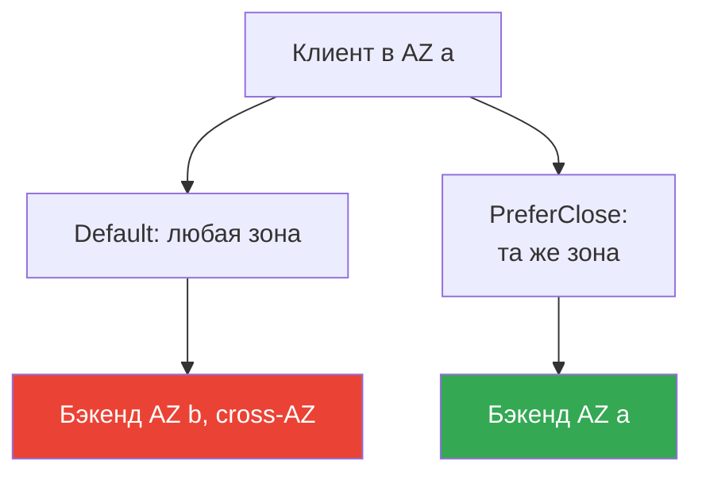

# Глава 31. Egress и стоимость трафика: NAT, VPC endpoints, PrivateLink

> **Что дальше.** Главы 26-30 разбирали вход в кластер и изоляцию: NLB (глава 26), ALB (глава
> 27), Gateway API (глава 28), DNS и сертификаты (глава 29), NetworkPolicy (глава 30). Здесь
> обратное направление - исходящий трафик наружу и его стоимость: NAT Gateway, VPC endpoints,
> PrivateLink, cross-AZ. Базовое устройство VPC, подсетей и NAT дано в Части 0 (глава 00-3),
> стоимость кластера в целом и Kubecost/OpenCost - глава 43, мультикластер и мультиаккаунт
> связность - глава 32, приватный доступ к S3 для Mountpoint упоминался в главе 25. Здесь
> одно: куда уходит egress-трафик подов в EKS и почему за него приходит счёт.

## 31.1. «Кластер работает, а в счёте отдельной строкой растёт data transfer»

Кластер собран правильно: ноды в приватных подсетях, наружу выходят через NAT Gateway, как
учит любой гайд по VPC. Нагрузки крутятся, инцидентов нет. А через месяц в Cost Explorer
всплывает строка, которую никто не закладывал:

```
NatGateway-Bytes         ... крупная сумма
DataTransfer-Regional-Bytes  ... сопоставимая сумма
NatGateway-Hours         ... заметная сумма
```

Эти строки не привязаны к инстансам или томам, их не видно в `kubectl top` и не поймать HPA.
Их источник - сам сетевой трафик подов: за каждый гигабайт, прошедший через NAT Gateway,
берётся плата за обработку, а за трафик между зонами доступности - плата за передачу в обе
стороны. И то, и другое генерируется незаметно:

- поды тянут образы из ECR - слои лежат в S3, и pull идёт через NAT наружу;
- приложение ходит в S3, DynamoDB, внешние API - весь egress через NAT;
- под в AZ `a` общается с подом или базой в AZ `b` - это cross-AZ, тарифицируется;
- CloudWatch Logs, STS для IRSA, вызовы EC2 API - всё это исходящие байты.

Ничего из этого не «сломано». Просто в облаке сетевой трафик - платный ресурс, и в EKS его
генерируют не инженеры руками, а сотни подов автоматически. Пока не выстроен egress-путь
(NAT по зонам, VPC endpoints для трафика к AWS), счёт за data transfer растёт молча. Разберём,
из чего он складывается и что тут в руках инженера.

## 31.2. NAT Gateway: зачем нужен и его модель стоимости

Ноды EKS в продакшене живут в приватных подсетях - у них нет публичных IP, из интернета к ним
не достучаться. Но самим подам исходящий доступ наружу нужен: pull образов, обращения к
внешним API, обновления. Чтобы приватная подсеть могла инициировать исходящие соединения в
интернет, в публичную подсеть ставят **NAT Gateway** - управляемый AWS сервис трансляции
адресов. Маршрут `0.0.0.0/0` из приватной подсети ведёт на NAT, NAT - на Internet Gateway.

Модель стоимости NAT Gateway состоит из двух независимых частей:

- **Почасовая плата** за сам NAT Gateway - идёт, пока он существует, независимо от трафика.
- **Плата за обработанные данные** - за каждый гигабайт, прошедший через NAT, в любую сторону.

Вторая часть и есть ловушка. NAT берёт деньги за обработку каждого гигабайта egress, и когда
через него идёт весь исходящий трафик кластера - pull образов, вызовы AWS API, обращения к
S3 - объём набегает быстро. Причём трафик к сервисам AWS (S3, ECR, DynamoDB) через NAT
оплачивается как обычный egress, хотя эти сервисы живут внутри сети AWS и путь через NAT в
интернет им не нужен. Это первое, что убирают оптимизацией (VPC endpoints, раздел 31.3).

### Ловушка cross-AZ: один NAT на весь кластер

Главный источник неожиданных счетов - неправильное размещение NAT по зонам. NAT Gateway живёт
в конкретной AZ. Если поставить один NAT в AZ `a`, а ноды раскинуть по трём зонам, то трафик
нод из AZ `b` и `c` сначала идёт **через границу зоны** до NAT в `a`, и только потом наружу.
Этот cross-AZ хоп тарифицируется дополнительно к обработке на NAT - платите дважды.



Правильная схема - **по одному NAT Gateway на каждую AZ**, где есть ноды, и маршрут приватной
подсети ведёт на NAT в своей же зоне. Тогда egress не пересекает границу AZ до выхода наружу,
cross-AZ плата на этом участке исчезает. Плата за почасовую работу растёт (NAT теперь не один,
а по числу зон), но экономия на устранённом cross-AZ и рисках обычно перевешивает. Есть и
второй бонус: отказ одной AZ не оставляет без egress ноды в других зонах.

| Схема NAT | Cross-AZ egress | Отказоустойчивость | Почасовая плата |
|---|---|---|---|
| Один NAT на кластер | есть, за весь трафик из чужих AZ | падение AZ рвёт egress всем | минимальная |
| По NAT на каждую AZ | нет на участке до NAT | падение AZ не трогает другие | выше, по числу зон |

## 31.3. VPC endpoints: два типа и в чём разница

VPC endpoint - это способ достучаться до сервиса AWS, не выходя в интернет и минуя NAT. Трафик
остаётся внутри сети AWS. Типов ровно два, и они устроены по-разному.

**Gateway endpoints.** Поддерживаются только для **S3 и DynamoDB**. Это запись в таблице
маршрутизации подсети: трафик к префиксам S3/DynamoDB region направляется в endpoint, а не на
NAT. Gateway endpoints **бесплатны** - ни почасовой платы, ни платы за данные. Для EKS это
прямая экономия: pull слоёв образов из ECR идёт в S3, и с gateway endpoint для S3 этот объём
уходит с NAT на бесплатный путь. Такой же выигрыш у приложений, активно работающих с S3.

**Interface endpoints.** Работают на базе **AWS PrivateLink**. В подсети создаётся ENI с
приватным IP, и обращения к сервису идут на него. Поддерживают большинство сервисов AWS (не
только S3/DynamoDB). Стоимость: **почасовая плата за каждый endpoint** плюс **плата за
обработанные данные**. Дороже gateway, но убирают NAT из пути к сервису и держат трафик
приватным. С включённым private DNS приложения продолжают ходить на публичные имена сервисов
без правок кода - резолвинг подменяется на приватный IP endpoint.

| Свойство | Gateway endpoint | Interface endpoint |
|---|---|---|
| Основа | запись в route table | PrivateLink, ENI в подсети |
| Сервисы | только S3 и DynamoDB | большинство сервисов AWS |
| Стоимость | бесплатно | почасовая + за данные |
| Как достигается | маршрут к префиксам сервиса | приватный IP, private DNS |
| Трафик минует NAT | да | да |

Общее у обоих типов: трафик к сервису не идёт через NAT и не покидает сеть AWS. Разница в цене
и охвате. Правило простое: для S3 и DynamoDB всегда gateway (он бесплатный), для остальных
сервисов - interface там, где нужно убрать NAT или требуется приватность.

## 31.4. Какие endpoints важны для EKS

Обычному кластеру с выходом в интернет endpoints не обязательны, но они снимают трафик к AWS с
платного NAT. **Приватному кластеру** без выхода наружу (глава 19) они необходимы: без них
ноды не зарегистрируются, а поды не получат ни образов, ни credentials. Набор, который AWS
указывает для приватного кластера, следующий:

| Endpoint | Тип | Зачем |
|---|---|---|
| com.amazonaws.`region`.s3 | gateway | слои образов ECR и доступ приложений к S3 |
| com.amazonaws.`region`.ecr.api | interface | ECR API, аутентификация и метаданные |
| com.amazonaws.`region`.ecr.dkr | interface | pull самих образов из ECR |
| com.amazonaws.`region`.sts | interface | STS для IRSA (AssumeRoleWithWebIdentity) |
| com.amazonaws.`region`.eks-auth | interface | получение credentials для EKS Pod Identity |
| com.amazonaws.`region`.ec2 | interface | EC2 API, в т.ч. DNS-имя ноды на EKS-оптимиз. AMI |
| com.amazonaws.`region`.elasticloadbalancing | interface | работа AWS Load Balancer Controller |
| com.amazonaws.`region`.logs | interface | отправка логов нод и подов в CloudWatch Logs |

Нюансы, которые легко упустить:

- **ECR тянет образы из S3.** Для pull нужны все три: `ecr.api`, `ecr.dkr` и gateway на `s3`.
  Без S3-endpoint аутентификация в ECR пройдёт, а скачивание слоёв - нет.
- **IRSA против Pod Identity.** IRSA использует `sts` (плюс OIDC-endpoint `oidc-eks`, чтобы
  приватизировать обращение к JWKS кластера); Pod Identity - `eks-auth`. Что из этого нужно,
  зависит от выбранного механизма идентичности (главы 16-17).
- **STS по умолчанию глобальный.** Многие SDK ходят на `sts.amazonaws.com`, минуя региональный
  endpoint. В приватном кластере SDK переключают на региональный STS-endpoint региона.
- **Private DNS.** Для interface endpoints включают private DNS, тогда нагрузки продолжают
  использовать публичные имена сервисов без изменений.

Дополнительно по потребности берут `ssm`, `xray`, `autoscaling`, `eks` и другие - полный
список сервисов на PrivateLink есть в документации. Принцип: включаешь endpoint под каждый
сервис AWS, к которому реально обращаются поды и системные компоненты.

## 31.5. PrivateLink: приватный доступ к сервисам

Interface endpoints - это частный случай **AWS PrivateLink**, механизма приватного доступа к
сервисам через ENI в вашей подсети. PrivateLink закрывает два сценария помимо доступа к
публичным сервисам AWS:

- **Сервисы в другом аккаунте или у вендора.** Провайдер (SaaS, соседняя команда) публикует
  свой сервис как **endpoint service**, а потребитель создаёт interface endpoint, указывающий
  на него. Трафик идёт приватно через сеть AWS, без выхода в интернет, без VPC peering и без
  открытия сетей навстречу друг другу. Связь односторонняя: потребитель инициирует, провайдер
  принимает.
- **Свои сервисы между VPC и аккаунтами.** За NLB можно опубликовать собственный сервис как
  endpoint service и дать доступ другим аккаунтам, не сводя их VPC в общую сеть.

Для EKS это важно с двух сторон. Во-первых, приватный доступ подов к внешним API вендоров без
egress в интернет - трафик не идёт через NAT и не покидает AWS. Во-вторых, публикация сервисов
самого кластера наружу через endpoint service - тема мультиаккаунтной связности, подробно она
в главе 32. Здесь достаточно понимать: PrivateLink - тот же interface endpoint, только целью
может быть не сервис AWS, а сервис в чужом аккаунте.

## 31.6. Cross-AZ трафик между подами и как его удержать в зоне

Второй крупный источник data transfer после NAT - трафик под-под через границу AZ. По
умолчанию Service раскидывает запросы по всем здоровым endpoint'ам без учёта зоны: под в AZ
`a` с равной вероятностью попадёт на бэкенд в `a`, `b` или `c`. Каждый межзональный запрос
тарифицируется, и на нагруженном сервисе это заметная строка в счёте.

Kubernetes даёт механизм держать трафик в своей зоне - **topology aware routing**. Управляется
он полем `trafficDistribution` в спецификации Service со значением `PreferClose`: kube-proxy
старается направлять запрос на endpoint в той же зоне, что и клиент, и уходит в другую зону
только если локальных endpoint'ов нет. Поле стало GA в Kubernetes `1.33`; в более ранних
версиях ту же логику включала аннотация `service.kubernetes.io/topology-mode: Auto`.

```yaml
apiVersion: v1
kind: Service
metadata:
  name: backend
spec:
  trafficDistribution: PreferClose   # держать трафик в зоне клиента
  selector:
    app: backend
  ports:
    - { port: 80, targetPort: 8080 }
```

Чтобы локальные endpoint'ы вообще были в каждой зоне, поды-бэкенды раскладывают по AZ через
`topologySpreadConstraints` с ключом `topology.kubernetes.io/zone`. Одно без другого не
работает: если все реплики бэкенда оказались в одной зоне, `PreferClose` всё равно погонит
трафик через границу. На стороне балансировщиков есть свой рычаг - **cross-zone load
balancing**: когда он включён, LB равномерно раскидывает по целям всех зон (ровнее нагрузка,
но больше cross-AZ); когда выключен - держит трафик в зоне прихода (дешевле, но нагрузка
неравномерна). Настройка зависит от типа балансировщика и разбиралась в главах 26-27.

Здесь важен честный нюанс. Экономия cross-AZ трафика **конфликтует** с надёжностью multi-AZ.
`PreferClose` при отказе или перекосе в одной зоне будет упорно держать трафик локально, пока
есть хоть один живой endpoint, - это может создать горячую точку. Multi-AZ, PDB и topology
spread как инструменты надёжности разбираются в главе 40; там же граница, за которой ради
устойчивости стоит смириться с cross-AZ трафиком. Не оптимизируйте трафик в ущерб доступности.



## 31.7. Структура стоимости egress: что оптимизировать

Собрав картину, разложим data transfer кластера на составляющие. Цифр не приводим - важна
структура и то, чем каждый пункт снижается.

| Составляющая | Что генерирует | Чем снижается |
|---|---|---|
| Исходящий в интернет | egress подов наружу, ответы внешним клиентам | кэш образов, CDN, меньше лишнего egress |
| Обработка на NAT | весь egress приватных подсетей через NAT | VPC endpoints для трафика к AWS |
| Cross-AZ | под-под и под-база через границу зоны | trafficDistribution, topology spread |
| Почасовая NAT | сам факт наличия NAT Gateway | не плодить лишние NAT, но по AZ хватает |
| Почасовая interface endpoints | каждый interface endpoint | только нужные endpoints, S3/DDB - gateway |

Приоритет оптимизации обычно такой. Сначала **gateway endpoint для S3** (бесплатно, сразу
снимает pull образов и трафик приложений к S3 с NAT). Затем **NAT по зонам** вместо одного на
кластер - убирает cross-AZ на пути egress. Дальше **interface endpoints** под сервисы, куда
поды ходят активно (ECR, logs, sts), - там, где обработка на NAT дороже почасовой платы за
endpoint. И параллельно **trafficDistribution с topology spread** на нагруженных внутренних
сервисах. Смотреть на эффект нужно по счёту и метрикам, а не на глаз (глава 43).

## 31.8. Как это применяют в продакшене

- **NAT ставят по одному на каждую AZ с нодами.** Один NAT на кластер экономит копейки на
  почасовой плате и генерирует cross-AZ на весь egress из чужих зон плюс единую точку отказа.
- **Gateway endpoint для S3 включают всегда.** Он бесплатен и сразу снимает pull образов ECR и
  трафик приложений к S3 с платного NAT. DynamoDB - туда же, если он используется.
- **Приватный кластер строят от списка endpoints.** До первого пода готовят ecr.api, ecr.dkr,
  s3, sts или eks-auth, ec2, logs, elasticloadbalancing и всё, к чему обращаются нагрузки.
- **Egress к AWS уводят с NAT осознанно.** Interface endpoints ставят под сервисы с большим
  трафиком; там, где обработка на NAT дороже почасовой платы endpoint, это прямая экономия.
- **Cross-AZ режут topology aware routing.** На внутренних сервисах с большим east-west ставят
  trafficDistribution PreferClose плюс topology spread, помня о балансе с надёжностью.
- **Трафик мониторят по счёту и метрикам.** CloudWatch-метрики NAT (`BytesOutToDestination`,
  `BytesInFromDestination`) и строки Cost Explorer показывают, где реально течёт data transfer.

## 31.9. Мини-глоссарий

- **NAT Gateway** - управляемый AWS сервис трансляции адресов, дающий приватным подсетям
  исходящий доступ в интернет; тарифицируется почасово и за обработанные гигабайты.
- **cross-AZ трафик** - передача данных между зонами доступности; тарифицируется за передачу,
  обычно в обе стороны.
- **VPC endpoint** - точка приватного доступа к сервису AWS без выхода в интернет и минуя NAT.
- **Gateway endpoint** - тип VPC endpoint для S3 и DynamoDB через запись в route table;
  бесплатен.
- **Interface endpoint** - тип VPC endpoint на базе PrivateLink: ENI в подсети, почасовая плата
  плюс плата за данные.
- **AWS PrivateLink** - механизм приватного доступа к сервисам AWS и к сервисам в других
  аккаунтах через interface endpoint.
- **endpoint service** - публикация собственного сервиса (за NLB) как цели PrivateLink для
  потребителей из других VPC и аккаунтов.
- **topology aware routing** - предпочтение endpoint'ов в зоне клиента; включается полем
  `trafficDistribution: PreferClose` в Service.
- **cross-zone load balancing** - режим балансировщика, раскидывающий трафик по целям всех зон;
  ровнее нагрузка, но больше cross-AZ.

## 31.10. Итоги главы

- В облаке сетевой трафик - платный ресурс, и в EKS его генерируют сотни подов автоматически;
  data transfer виден отдельными строками в счёте, а не в `kubectl top`.
- NAT Gateway даёт приватным подсетям egress и тарифицируется двояко: почасово плюс за каждый
  обработанный гигабайт; второе набегает на объёме pull образов и вызовов AWS API.
- Главная ловушка - один NAT на кластер: трафик нод из чужих AZ идёт через границу зоны до
  NAT и платится дважды. Правильно - по одному NAT на каждую AZ с нодами.
- VPC endpoints держат трафик к сервисам AWS внутри сети AWS, минуя NAT. Gateway (S3, DynamoDB)
  бесплатны; interface (PrivateLink) стоят почасово плюс за данные, но охватывают почти все
  сервисы.
- Приватному кластеру нужен набор endpoints: s3 (gateway), ecr.api, ecr.dkr, sts или eks-auth,
  ec2, logs, elasticloadbalancing и другие по потребности; ECR тянет слои из S3.
- PrivateLink даёт приватный доступ и к сервисам в других аккаунтах через endpoint service, без
  выхода в интернет и без сведения VPC в общую сеть.
- Cross-AZ трафик под-под режут через `trafficDistribution: PreferClose` (GA в 1.33) вместе с
  topology spread; на балансировщиках влияет cross-zone load balancing.
- Экономия трафика конфликтует с надёжностью multi-AZ: PreferClose может создать горячую точку
  при перекосе зоны; баланс разбирается в главе 40.

## 31.11. Как это пригодится в реальной работе

На дежурстве egress редко всплывает как инцидент - он всплывает как счёт. Когда финансы
приносят выросшую строку `NatGateway-Bytes` или `DataTransfer-Regional-Bytes`, разбор идёт по
знакомой цепочке: есть ли gateway endpoint для S3 (иначе pull образов и трафик к S3 висят на
NAT), сколько NAT Gateway и как они разложены по зонам, какие внутренние сервисы гонят
east-west через границу AZ. Метрики NAT в CloudWatch и разбивка Cost Explorer по usage type
показывают, какая из составляющих реально растёт, - гадать не нужно.

При планировании три решения принимают заранее. Сколько NAT и как по зонам - по одному на AZ
почти всегда правильный дефолт. Какой набор VPC endpoints - для приватного кластера это условие
запуска, для обычного - способ снять трафик к AWS с NAT. И где включать topology aware routing,
взвесив экономию cross-AZ против устойчивости к перекосу зоны. Все три завязаны на стоимость
кластера в целом, которую сводят в главе 43, и на надёжность multi-AZ из главы 40.

## 31.12. Вопросы для самопроверки

1. Почему data transfer в EKS растёт, хотя инженеры не гоняют трафик руками, и где он виден?
2. Из каких двух частей состоит стоимость NAT Gateway и какая из них обычно неожиданна?
3. В чём ловушка одного NAT Gateway на кластер и почему за такой трафик платят дважды?
4. Как правильно разложить NAT Gateway по зонам и что это даёт кроме экономии?
5. Чем gateway endpoint отличается от interface endpoint по устройству, охвату и стоимости?
6. Почему для pull образов из ECR нужен ещё и gateway endpoint для S3?
7. Какой набор VPC endpoints необходим приватному кластеру EKS без выхода в интернет?
8. Какие endpoints нужны для IRSA, а какие для EKS Pod Identity?
9. Что такое endpoint service и какой сценарий PrivateLink он закрывает?
10. Как удержать трафик под-под в своей зоне и каким полем Service это включается?
11. Почему `trafficDistribution: PreferClose` не работает без topology spread по зонам?
12. Как cross-zone load balancing влияет на объём cross-AZ трафика?
13. В чём конфликт между экономией cross-AZ трафика и надёжностью multi-AZ?

## Практика

Лаба курса к этой теме: [лаба 117 - Трафик и стоимость: NAT по зонам против одного NAT, VPC
endpoints, cross-AZ](../../labs/117/README_RU.MD). Кроме неё, egress-путь кластера
проверяется на живом аккаунте. Сначала
посмотрите, сколько NAT Gateway и в каких зонах они стоят:

```bash
# NAT Gateway и их подсети (по подсети определяется AZ)
aws ec2 describe-nat-gateways \
  --query "NatGateways[].{Id:NatGatewayId,Subnet:SubnetId,State:State}" --output table

# какие VPC endpoints уже созданы в VPC
aws ec2 describe-vpc-endpoints \
  --query "VpcEndpoints[].{Name:ServiceName,Type:VpcEndpointType,State:State}" --output table
```

Проверьте, есть ли среди них gateway на S3 и interface на ecr.api/ecr.dkr - если pull образов
идёт через NAT, в списке их не будет. Затем оцените, сколько байт реально проходит через NAT,
по метрикам CloudWatch в namespace `AWS/NATGateway`:

```bash
# сумма исходящих байт через NAT за сутки
aws cloudwatch get-metric-statistics --namespace AWS/NATGateway \
  --metric-name BytesOutToDestination --statistics Sum --period 86400 \
  --dimensions Name=NatGatewayId,Value=nat-xxxxxxxx \
  --start-time 2024-01-01T00:00:00Z --end-time 2024-01-02T00:00:00Z
```

Дальше в Cost Explorer сгруппируйте затраты по usage type и найдите строки `NatGateway-Bytes`,
`NatGateway-Hours` и `DataTransfer-Regional-Bytes` - это и есть предмет оптимизации из раздела
31.7. Проверьте на внутренних сервисах, выставлено ли `trafficDistribution`, и разложены ли их
поды по зонам через `topologySpreadConstraints`.

---
[Оглавление](../README_RU.md) · [Глава 30](../30/ru.md) · [Глава 32](../32/ru.md)
