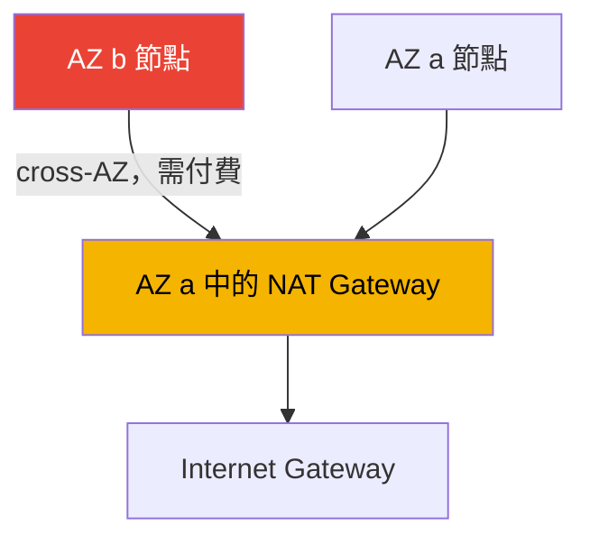
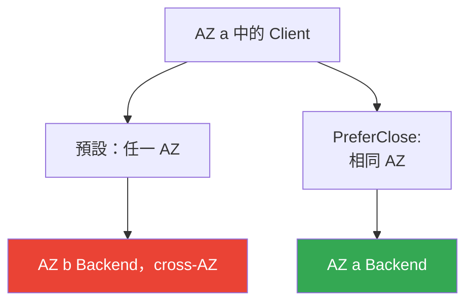

[Русская версия](ru.md) · [Eng version](en.md) · [Versión en español](es.md) · [Version française](fr.md) · [Deutsche Version](de.md) · [ქართული ვერსია](ge.md) · [日本語版](jp.md)
# 第 31 章。Egress 與流量成本：NAT、VPC endpoints、PrivateLink

> **接下來。** 第 26-30 章討論進入叢集的流量與隔離：NLB（第 26 章）、ALB（第
> 27 章）、Gateway API（第 28 章）、DNS 與憑證（第 29 章）、NetworkPolicy（第 30
> 章）。本章討論相反方向，也就是向外的 egress 流量及其成本：NAT Gateway、VPC endpoints、
> PrivateLink、cross-AZ。VPC、subnet 與 NAT 的基本架構見第 0 部分（第 00-3 章），整體
> 叢集成本以及 Kubecost/OpenCost 見第 43 章，多叢集與多帳戶連線見第 32 章，而 Mountpoint
> 存取 S3 的私有連線曾於第 25 章提及。本章只討論一件事：EKS 中 Pod 的 egress 流量會流向
> 哪裡，以及為何會因此收到帳單。

## 31.1.「叢集正常運作，但帳單中的 data transfer 獨立項目正在增加」

叢集已正確建置：節點位於私有 subnet，並依照所有 VPC 指南所教，經由 NAT Gateway 向外連線。
工作負載持續運作，沒有事故。但一個月後，Cost Explorer 出現了無人編列預算的項目：

```
NatGateway-Bytes         ... 一大筆金額
DataTransfer-Regional-Bytes  ... 相當的一筆金額
NatGateway-Hours         ... 顯著的金額
```

這些項目不會繫結到 instance 或 volume，在 `kubectl top` 中看不到，也無法由 HPA 捕捉。它們的
來源正是 Pod 自身的網路流量：每個通過 NAT Gateway 的 GB 都會收取處理費，而跨 availability zone
的流量則會在雙向傳輸時收費。這兩者都會不知不覺產生：

- Pod 從 ECR 拉取映像檔，layer 位於 S3，而 pull 會經由 NAT 向外進行；
- 應用程式存取 S3、DynamoDB、外部 API，所有 egress 都經由 NAT；
- AZ `a` 中的 Pod 與 AZ `b` 中的 Pod 或資料庫通訊，這是 cross-AZ，會計費；
- CloudWatch Logs、供 IRSA 使用的 STS、EC2 API 呼叫，全部都是外送的 bytes。

這些都沒有「壞掉」。只是在雲端中，網路流量是需付費的資源，而 EKS 中產生它的不是工程師手動操作，
而是數百個 Pod 自動進行。在建立 egress 路徑前（每個 AZ 的 NAT、AWS 流量的 VPC endpoints），
data transfer 帳單會悄悄增加。以下將說明其組成，以及工程師能掌控的部分。

## 31.2. NAT Gateway：用途與成本模型

生產環境中的 EKS 節點位於私有 subnet，沒有公有 IP，無法從網際網路直接連線至它們。但 Pod 自身
需要向外存取：拉取映像檔、存取外部 API、更新。為讓私有 subnet 能主動建立對網際網路的連線，會在
公有 subnet 中部署 **NAT Gateway**，這是 AWS 受管的位址轉譯服務。私有 subnet 的路由
`0.0.0.0/0` 指向 NAT，而 NAT 則指向 Internet Gateway。

NAT Gateway 的成本模型包含兩個獨立部分：

- **NAT Gateway 本身的每小時費用**，只要它存在就會產生，與流量無關。
- **已處理資料的費用**，每個通過 NAT、無論方向的 GB 都會收費。

第二個部分正是陷阱。NAT 對每個 egress GB 的處理收費，當所有叢集的外送流量都通過它時，例如映像檔
pull、AWS API 呼叫與 S3 存取，流量很快便會累積。而透過 NAT 存取 AWS 服務（S3、ECR、DynamoDB）
會如同一般 egress 一樣付費，即使這些服務位於 AWS 網路內部，且根本無須經由 NAT 前往網際網路。
這是最佳化首先應移除的部分（VPC endpoints，見第 31.3 節）。

### cross-AZ 陷阱：整個叢集只有一個 NAT

意外帳單的主要來源，是在各個 AZ 之間錯誤部署 NAT。NAT Gateway 存在於特定 AZ 中。若僅在 AZ `a`
放置一個 NAT，卻將節點分散於三個 AZ，則 AZ `b` 與 `c` 節點的流量會先**跨越 AZ 邊界**前往 `a` 中的
NAT，之後才向外傳送。此 cross-AZ hop 除了 NAT 處理費之外還會另行計費，等於付費兩次。



正確架構是：每個有節點的 AZ 都部署**一個 NAT Gateway**，且私有 subnet 的路由指向同一 AZ 的 NAT。
如此，egress 在向外傳送前不會跨越 AZ 邊界，該路段的 cross-AZ 費用便會消失。每小時費用會上升（NAT
不再只有一個，而是依 AZ 數量配置），但消除 cross-AZ 的節省與風險降低通常更具優勢。還有第二項好處：
單一 AZ 故障時，不會使其他 AZ 的節點失去 egress。

| NAT 架構 | Cross-AZ egress | 容錯能力 | 每小時費用 |
|---|---|---|---|
| 每個叢集一個 NAT | 有，來自其他 AZ 的全部流量 | AZ 故障會中斷所有 egress | 最低 |
| 每個 AZ 一個 NAT | 通往 NAT 的路段沒有 | AZ 故障不影響其他 AZ | 較高，依 AZ 數量而定 |

## 31.3. VPC endpoints：兩種類型及其差異

VPC endpoint 是存取 AWS 服務、無須前往網際網路且繞過 NAT 的方式。流量會留在 AWS 網路內。類型恰有
兩種，其運作方式不同。

**Gateway endpoints。** 僅支援 **S3 與 DynamoDB**。它是 subnet route table 中的一筆記錄：前往
區域 S3/DynamoDB prefix 的流量會導向 endpoint，而非 NAT。Gateway endpoints **免費**，沒有每小時
費用，也沒有資料費用。對 EKS 而言，這能直接節省成本：從 ECR 拉取映像檔 layer 時會存取 S3，有了 S3
的 gateway endpoint，這些流量就從 NAT 轉移到免費路徑。大量使用 S3 的應用程式也同樣受益。

**Interface endpoints。** 基於 **AWS PrivateLink** 運作。subnet 中會建立一個具有私有 IP 的 ENI，
對服務的請求會前往該 ENI。它們支援大多數 AWS 服務（不只 S3/DynamoDB）。成本是：**每個 endpoint
的每小時費用**加上**已處理資料費用**。其成本高於 gateway，但會從通往服務的路徑中移除 NAT，並維持流量
私有。啟用 private DNS 後，應用程式可繼續存取服務的公有名稱，無須修改程式碼，因為 DNS 解析會被置換為
endpoint 的私有 IP。

| 特性 | Gateway endpoint | Interface endpoint |
|---|---|---|
| 基礎 | route table 記錄 | PrivateLink，subnet 中的 ENI |
| 服務 | 僅 S3 與 DynamoDB | 大多數 AWS 服務 |
| 成本 | 免費 | 每小時費用 + 資料費用 |
| 運作方式 | 路由至服務 prefix | 私有 IP、private DNS |
| 流量繞過 NAT | 是 | 是 |

兩種型別的共同點是：到服務的流量不會通過 NAT，也不會離開 AWS 網路。差異在於成本與涵蓋範圍。規則很
簡單：S3 與 DynamoDB 一律使用 gateway（免費）；其他服務則在需要移除 NAT 或要求私有性時使用 interface。

## 31.4. 對 EKS 而言重要的 endpoints

具有網際網路出口的一般叢集不強制需要 endpoints，但它們可從付費 NAT 中移除前往 AWS 的流量。沒有對外
連線的**私有叢集**（第 19 章）則必須使用它們：否則節點無法註冊，Pod 也無法取得映像檔或 credentials。
AWS 為私有叢集指定的組合如下：

| Endpoint | 類型 | 用途 |
|---|---|---|
| com.amazonaws.`region`.s3 | gateway | ECR 映像檔 layer 與應用程式存取 S3 |
| com.amazonaws.`region`.ecr.api | interface | ECR API、驗證與 metadata |
| com.amazonaws.`region`.ecr.dkr | interface | 從 ECR pull 映像檔本身 |
| com.amazonaws.`region`.sts | interface | 供 IRSA 使用的 STS（AssumeRoleWithWebIdentity） |
| com.amazonaws.`region`.eks-auth | interface | 為 EKS Pod Identity 取得 credentials |
| com.amazonaws.`region`.ec2 | interface | EC2 API，包括 EKS 最佳化 AMI 上的節點 DNS 名稱 |
| com.amazonaws.`region`.elasticloadbalancing | interface | AWS Load Balancer Controller 的運作 |
| com.amazonaws.`region`.logs | interface | 將節點與 Pod 日誌傳送到 CloudWatch Logs |

容易忽略的細節：

- **ECR 從 S3 拉取映像檔。** pull 需要三者：`ecr.api`、`ecr.dkr` 與 `s3` 的 gateway。若缺少
  S3 endpoint，ECR 驗證會成功，但 layer 下載會失敗。
- **IRSA 與 Pod Identity。** IRSA 使用 `sts`（另加 OIDC endpoint `oidc-eks`，以將對叢集 JWKS 的
  存取私有化）；Pod Identity 使用 `eks-auth`。需要哪一個取決於所選擇的身分機制（第 16-17 章）。
- **STS 預設為全域服務。** 許多 SDK 會存取 `sts.amazonaws.com`，因而繞過區域 endpoint。在私有叢集中，
  SDK 應改為該區域的 STS endpoint。
- **Private DNS。** 應為 interface endpoints 啟用 private DNS，工作負載即可繼續使用服務的公有名稱，
  而無須變更。

還可視需求採用 `ssm`、`xray`、`autoscaling`、`eks` 等，完整的 PrivateLink 服務清單請見文件。原則是：
為 Pod 與系統元件實際存取的每個 AWS 服務啟用 endpoint。

## 31.5. PrivateLink：私有存取服務

Interface endpoints 是 **AWS PrivateLink** 的特例，後者是經由您的 subnet 中 ENI 私有存取服務的機制。
除了存取公有 AWS 服務之外，PrivateLink 還涵蓋兩種情境：

- **其他帳戶或供應商的服務。** 提供者（SaaS、相鄰團隊）會將其服務發佈為 **endpoint service**，而
  消費者建立指向該服務的 interface endpoint。流量會私有地通過 AWS 網路，不會前往網際網路，不需要
  VPC peering，也不必彼此開放網路。連線是單向的：消費者發起，提供者接收。
- **跨 VPC 與帳戶的自有服務。** 可將 NLB 後方的自有服務發佈為 endpoint service，並向其他帳戶提供存取，
  而無須將其 VPC 併入共同網路。

這對 EKS 有兩方面的重要性。第一，Pod 可私有存取外部供應商 API，無須 egress 至網際網路，流量不會通過
NAT 或離開 AWS。第二，可將叢集自身服務透過 endpoint service 對外發佈，這是多帳戶連線的主題，第 32 章
會詳細討論。此處只需理解：PrivateLink 就是 interface endpoint，但目標不必是 AWS 服務，也可以是其他帳戶
中的服務。

## 31.6. Pod 之間的 cross-AZ 流量及如何將它保留在同一 AZ

繼 NAT 之後，data transfer 的第二大來源是跨 AZ 邊界的 Pod 對 Pod 流量。預設情況下，Service 不考慮
AZ，而將請求分散至所有健康 endpoint：AZ `a` 的 Pod 有相同機率連至 `a`、`b` 或 `c` 中的 backend。每個
跨 AZ 請求都會收費，在高負載服務中會成為帳單上的顯著項目。

Kubernetes 提供讓流量留在本 AZ 的機制，即 **topology aware routing**。它由 Service spec 的
`trafficDistribution` 欄位控制，設為 `PreferClose` 時，kube-proxy 會盡量將請求導向與 client 位於同一 AZ 的
endpoint，僅在沒有本地 endpoint 時才前往其他 AZ。該欄位在 Kubernetes `1.33` 成為 GA；較早版本則以
annotation `service.kubernetes.io/topology-mode: Auto` 啟用相同邏輯。

```yaml
apiVersion: v1
kind: Service
metadata:
  name: backend
spec:
  trafficDistribution: PreferClose   # 將流量保留在 client 所在 AZ
  selector:
    app: backend
  ports:
    - { port: 80, targetPort: 8080 }
```

為確保每個 AZ 都確實具有本地 endpoint，需使用 `topologySpreadConstraints` 搭配
`topology.kubernetes.io/zone` key，將 backend Pod 分散至各 AZ。兩者缺一不可：若所有 backend replica 都
落在同一個 AZ，`PreferClose` 仍會將流量送過邊界。load balancer 端也有自己的控制項，即 **cross-zone load
balancing**：啟用時，LB 會平均分散至所有 AZ 的 targets（負載較均衡，但 cross-AZ 較多）；停用時，它會將
流量保留在進入的 AZ（較便宜，但負載不均）。設定取決於 load balancer 類型，已於第 26-27 章說明。

此處有一項必須坦白說明的細節。節省 cross-AZ 流量與 multi-AZ 可靠性**存在衝突**。當某個 AZ 故障或失衡時，
只要還有任何存活 endpoint，`PreferClose` 都會堅持將流量保留在本地，這可能造成 hot spot。multi-AZ、PDB
與 topology spread 作為可靠性工具，會在第 40 章討論，其中也說明何時應為了韌性接受 cross-AZ 流量。
不要為了最佳化流量而犧牲可用性。



## 31.7. Egress 成本結構：應最佳化什麼

綜合全貌後，可將叢集的 data transfer 分解為組成部分。不提供數字，重點在於結構以及每個項目的降低方法。

| 組成部分 | 產生來源 | 降低方法 |
|---|---|---|
| 向網際網路的外送流量 | Pod 向外 egress、對外部 client 的回應 | 映像檔快取、CDN、減少不必要的 egress |
| NAT 處理 | 私有 subnet 經 NAT 的所有 egress | 為 AWS 流量使用 VPC endpoints |
| Cross-AZ | 跨 AZ 邊界的 Pod 對 Pod 與 Pod 對資料庫流量 | trafficDistribution、topology spread |
| NAT 每小時費用 | NAT Gateway 本身的存在 | 不建立不必要的 NAT，但每個 AZ 都要有足夠的 NAT |
| Interface endpoints 每小時費用 | 每個 interface endpoint | 僅使用必要 endpoints，S3/DDB 使用 gateway |

最佳化優先順序通常如下。首先是 **S3 的 gateway endpoint**（免費，立即將映像檔 pull 與應用程式對 S3 的
流量從 NAT 移除）。接著，以**每個 AZ 一個 NAT**取代整個叢集一個 NAT，消除 egress 路徑上的 cross-AZ。
之後為 Pod 經常存取的服務（ECR、logs、sts）建立 **interface endpoints**，也就是 NAT 處理費高於 endpoint
每小時費用的地方。同時，對高負載內部服務採用具有 topology spread 的 **trafficDistribution**。應根據帳單與
metrics 檢視效果，而不是憑感覺判斷（第 43 章）。

## 31.8. 在生產環境中的實務做法

- **每個具有節點的 AZ 都部署一個 NAT。** 每個叢集一個 NAT 雖可節省少量每小時費用，卻會讓其他 AZ 的
  所有 egress 產生 cross-AZ 流量，並形成單一故障點。
- **一律啟用 S3 的 gateway endpoint。** 它免費，並立即將 ECR 映像檔 pull 與應用程式對 S3 的流量從
  付費 NAT 移除。若使用 DynamoDB，也應同樣處理。
- **私有叢集從 endpoint 清單開始建置。** 在第一個 Pod 之前，先準備 ecr.api、ecr.dkr、s3、sts 或
  eks-auth、ec2、logs、elasticloadbalancing，以及工作負載會存取的一切服務。
- **有意識地將前往 AWS 的 egress 從 NAT 移除。** 為大量流量服務建立 interface endpoints；在 NAT 處理費
  高於 endpoint 每小時費用的地方，這能直接節省成本。
- **透過 topology aware routing 降低 cross-AZ。** 對具有大量 east-west 流量的內部服務，設定
  trafficDistribution PreferClose 加上 topology spread，同時記住須在其與可靠性之間取得平衡。
- **依帳單與 metrics 監控流量。** NAT 的 CloudWatch metrics（`BytesOutToDestination`、
  `BytesInFromDestination`）與 Cost Explorer 項目會顯示 data transfer 的實際流向。

## 31.9. 迷你詞彙表

- **NAT Gateway**：讓私有 subnet 能向網際網路 egress 的 AWS 受管位址轉譯服務，按每小時及已處理 GB 計費。
- **cross-AZ 流量**：availability zones 之間的資料傳輸，通常在雙向傳輸時收費。
- **VPC endpoint**：私有存取 AWS 服務的端點，無須前往網際網路且繞過 NAT。
- **Gateway endpoint**：供 S3 與 DynamoDB 使用、經由 route table 記錄運作的 VPC endpoint 類型，免費。
- **Interface endpoint**：基於 PrivateLink 的 VPC endpoint 類型：subnet 中的 ENI，按每小時加資料費用收費。
- **AWS PrivateLink**：透過 interface endpoint 私有存取 AWS 服務及其他帳戶服務的機制。
- **endpoint service**：將自有服務（位於 NLB 後）發佈為 PrivateLink 目標，供其他 VPC 與帳戶的消費者使用。
- **topology aware routing**：偏好 client 所在 AZ 的 endpoint，透過 Service 中的
  `trafficDistribution: PreferClose` 欄位啟用。
- **cross-zone load balancing**：load balancer 將流量分散至所有 AZ targets 的模式，負載更均勻，但
  cross-AZ 較多。

## 31.10. 本章總結

- 在雲端中，網路流量是需付費的資源，而 EKS 中數百個 Pod 會自動產生它；data transfer 會在帳單中以獨立
  項目呈現，而非出現在 `kubectl top`。
- NAT Gateway 為私有 subnet 提供 egress，並以兩種方式計費：每小時費用加上每個已處理 GB 的費用；後者會因
  映像檔 pull 與 AWS API 呼叫的流量快速累積。
- 主要陷阱是每個叢集只有一個 NAT：其他 AZ 節點的流量會跨越 AZ 邊界前往 NAT，因而付費兩次。正確做法是每個
  有節點的 AZ 一個 NAT。
- VPC endpoints 讓前往 AWS 服務的流量留在 AWS 網路內並繞過 NAT。Gateway（S3、DynamoDB）免費；
  interface（PrivateLink）按每小時及資料計費，但涵蓋幾乎所有服務。
- 私有叢集需要一組 endpoints：s3（gateway）、ecr.api、ecr.dkr、sts 或 eks-auth、ec2、logs、
  elasticloadbalancing，以及依需求的其他服務；ECR 會從 S3 拉取 layer。
- PrivateLink 經由 endpoint service 提供私有存取其他帳戶服務的能力，無須前往網際網路，也不必將 VPC 併入共同網路。
- 可透過 `trafficDistribution: PreferClose`（在 1.33 成為 GA）搭配 topology spread，降低 Pod 對 Pod 的
  cross-AZ 流量；load balancer 上的 cross-zone load balancing 也會影響它。
- 節省流量與 multi-AZ 可靠性存在衝突：AZ 失衡時 PreferClose 可能造成 hot spot；第 40 章會討論如何取得平衡。

## 31.11. 這在實際工作中的用途

在值班時，egress 很少會以事故形式出現，通常是以帳單形式浮現。當財務部門帶來增加的
`NatGateway-Bytes` 或 `DataTransfer-Regional-Bytes` 項目時，分析會依熟悉的脈絡進行：是否有 S3 的
gateway endpoint（否則映像檔 pull 與 S3 流量都會落在 NAT 上）、有多少 NAT Gateway 以及它們如何分布於
各 AZ、哪些內部服務跨 AZ 邊界產生 east-west 流量。CloudWatch 中的 NAT metrics 與 Cost Explorer 依
usage type 的細分，會顯示實際增加的是哪一個組成部分，無須猜測。

規劃時有三項決策應預先作出。NAT 的數量與 AZ 分布，幾乎總是每個 AZ 一個的正確預設。VPC endpoints 的
組合，對私有叢集而言是啟動條件，對一般叢集而言則是將前往 AWS 的流量從 NAT 移除的方法。以及，在何處
啟用 topology aware routing，並權衡 cross-AZ 成本節省與 AZ 失衡韌性。三者都與第 43 章彙整的整體叢集
成本，以及第 40 章的 multi-AZ 可靠性相關。

## 31.12. 自我檢查問題

1. 為何 EKS 中的 data transfer 會增加，即使工程師沒有手動傳輸流量，以及在哪裡可以看見它？
2. NAT Gateway 成本由哪兩個部分組成，其中通常出乎意料的是哪一部分？
3. 每個叢集只有一個 NAT Gateway 的陷阱是什麼，為何該流量會被收費兩次？
4. 應如何在各 AZ 部署 NAT Gateway，除了節省成本之外還能帶來什麼？
5. Gateway endpoint 與 interface endpoint 在架構、涵蓋範圍與成本上有何不同？
6. 為何從 ECR pull 映像檔還需要 S3 的 gateway endpoint？
7. 沒有對外網際網路連線的私有 EKS 叢集需要哪一組 VPC endpoints？
8. IRSA 需要哪些 endpoints，而 EKS Pod Identity 需要哪些？
9. 什麼是 endpoint service，它涵蓋何種 PrivateLink 情境？
10. 如何將 Pod 對 Pod 流量保留在同一個 AZ，以及由哪個 Service 欄位啟用？
11. 為何沒有依 AZ 的 topology spread，`trafficDistribution: PreferClose` 就無法運作？
12. cross-zone load balancing 如何影響 cross-AZ 流量量？
13. 節省 cross-AZ 流量與 multi-AZ 可靠性之間有什麼衝突？

## 實作

本課程與此主題相關的 lab：[lab 117：流量與成本：每個 AZ 的 NAT 與單一 NAT、VPC
endpoints、cross-AZ](../../labs/117/README_TW.MD)。此外，也應在真實帳戶中檢查叢集的 egress
路徑。首先，檢視 NAT Gateway 的數量及所在 AZ：

```bash
# NAT Gateway 及其 subnet（可由 subnet 判斷 AZ）
aws ec2 describe-nat-gateways \
  --query "NatGateways[].{Id:NatGatewayId,Subnet:SubnetId,State:State}" --output table

# VPC 中已建立的 VPC endpoints
aws ec2 describe-vpc-endpoints \
  --query "VpcEndpoints[].{Name:ServiceName,Type:VpcEndpointType,State:State}" --output table
```

檢查其中是否有 S3 的 gateway 以及 ecr.api/ecr.dkr 的 interface。若映像檔 pull 經由 NAT，清單中便不會有它們。
接著，透過 `AWS/NATGateway` namespace 中的 CloudWatch metrics，評估實際通過 NAT 的 bytes 數量：

```bash
# NAT 每日外送 bytes 總和
aws cloudwatch get-metric-statistics --namespace AWS/NATGateway \
  --metric-name BytesOutToDestination --statistics Sum --period 86400 \
  --dimensions Name=NatGatewayId,Value=nat-xxxxxxxx \
  --start-time 2024-01-01T00:00:00Z --end-time 2024-01-02T00:00:00Z
```

接著，在 Cost Explorer 依 usage type 將成本分組，並找出 `NatGateway-Bytes`、`NatGateway-Hours` 與
`DataTransfer-Regional-Bytes` 項目，它們正是第 31.7 節的最佳化對象。檢查內部服務是否已設定
`trafficDistribution`，以及其 Pod 是否透過 `topologySpreadConstraints` 分散於各 AZ。

---
[目錄](../README_TW.md) · [第 30 章](../30/tw.md) · [第 32 章](../32/tw.md)
