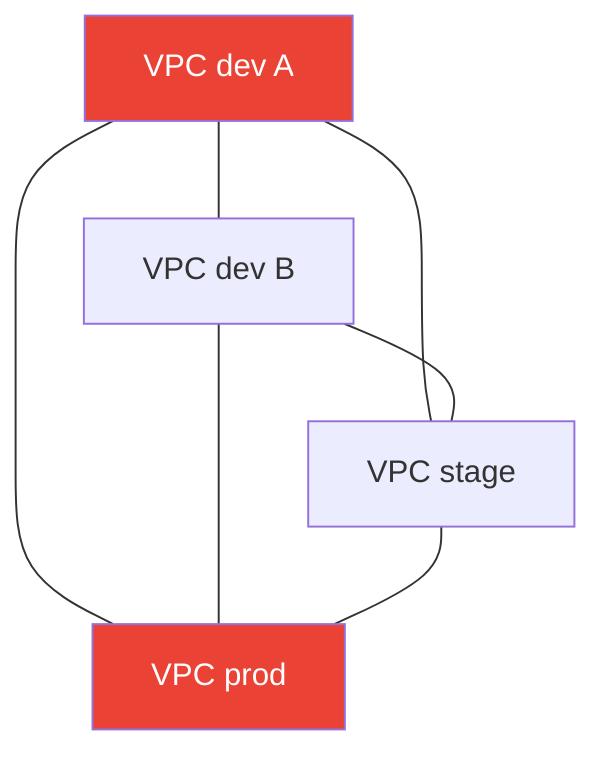
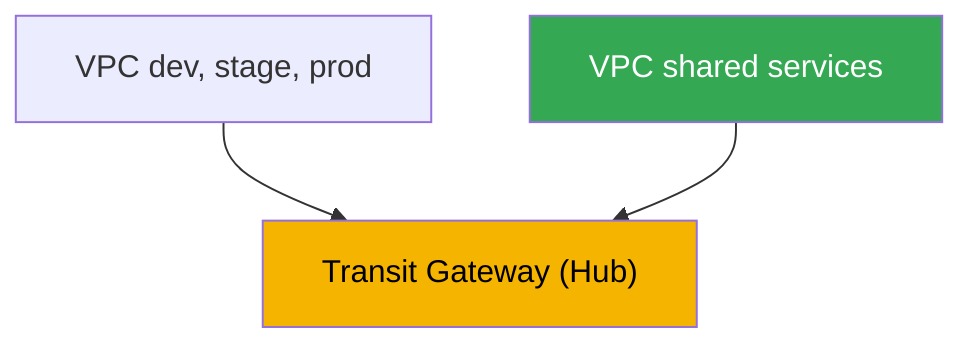
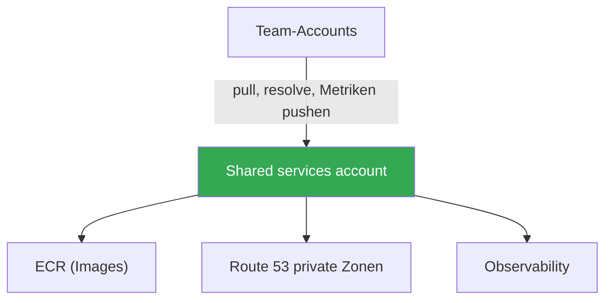

[Eng version](en.md) · [Versión en español](es.md) · [Version française](fr.md) · [Русская версия](ru.md) · [ქართული ვერსია](ge.md) · [繁體中文版](tw.md) · [日本語版](jp.md)
# Kapitel 32. Multi-Cluster und Multi-Account: Konnektivität, gemeinsame Ressourcen, Muster

> **Wie es weitergeht.** Die Kapitel 26-31 behandelten Traffic innerhalb eines einzelnen Clusters: Zugang über NLB und ALB
> (Kapitel 26-27), Gateway API (Kapitel 28), DNS und Zertifikate (Kapitel 29), NetworkPolicy (Kapitel
> 30), Egress und dessen Kosten (Kapitel 31). Hier ist der Maßstab größer - Konnektivität zwischen mehreren
> Clustern und Accounts. Die Verbindung auf Service-Ebene über VPC Lattice und
> ServiceExport/ServiceImport wird ausführlich in Kapitel 28 behandelt; Egress, VPC Endpoints und PrivateLink - in
> Kapitel 31; GitOps und die Verwaltung eines Cluster-Fuhrparks (Argo CD, Flux) - in Kapitel 44; der grundlegende
> Aufbau von VPC, Subnetzen und Routen - in Teil 0 (Kapitel 00-3). Hier geht es um eines: wie Cluster in
> unterschiedlichen VPCs und Accounts verbunden werden und was dabei zentral geteilt wird.

## 32.1. „Ein Service aus dem dev-Cluster benötigt einen Service im prod-Account, aber die Netzwerke sehen einander nicht“

Die Organisation ist gewachsen. Zuerst gab es einen Cluster, dann wurden es mehrere: ein eigener Account
für dev, einer für stage, einer für prod, dazu noch einige Accounts benachbarter Teams. Jeder Cluster liegt
in seiner eigenen VPC und seinem eigenen Account - das ist sicherer und erleichtert die Kostenrechnung. Dann
kommt die erste Konnektivitätsanforderung: Ein Service im Cluster von Team A muss einen gemeinsamen
Authentifizierungsservice aufrufen, der im Cluster des Plattformteams in einem anderen Account läuft. Oder eine
Anwendung in stage muss eine Datenbank erreichen, die in der VPC eines shared-Accounts betrieben wird.

Die naive Lösung liegt nahe: zwei VPCs per Peering verbinden. Das funktioniert - für zwei. Doch es gibt
bereits sechs Cluster und viele Verbindungen wären wünschenswert, sodass das Bild schnell unübersichtlich wird:

- **VPC peering ist nicht transitiv.** Wenn VPC A mit B und B mit C gepaart ist, sieht A C nicht über B.
  Jedes Paar, das eine Verbindung benötigt, braucht sein eigenes Peering. Für einen vollständigen Graphen aus N VPCs
  sind das ungefähr N zum Quadrat Verbindungen sowie ebenso viele Routen- und Security-Group-Regelsätze.
- **CIDRs dürfen sich nicht überschneiden.** Peering verlangt nicht überlappende Adressbereiche. Wenn jedoch
  jedes Team seine VPC aus der kopierten Vorlage `10.0.0.0/16` angelegt hat, überschneiden sich die Bereiche -
  ein direktes Peering ist dann nicht mehr möglich, weil das Routing mehrdeutig wäre.
- **Regeln vervielfachen sich.** Für jedes Peering sind Einträge in den Routing-Tabellen beider Seiten und
  erlaubende Regeln in den Security Groups nötig. Sechs VPCs als vollständiges Netz bedeuten Dutzende Einträge,
  die jemand manuell pflegen muss und bei denen Fehler leicht passieren.



Vier VPCs als vollständiges Netz ergeben bereits sechs Peerings; zehn VPCs benötigen fünfundvierzig. Weder
Transitivität noch Skalierung. Und das betrifft nur das Netzwerk - außerdem bleibt die Frage, wie Teams nicht
jeweils ihr eigenes ECR, ihre eigene DNS-Zone und ihren eigenen Observability-Stack betreiben müssen. Im
Folgenden wird erläutert, weshalb Accounts überhaupt getrennt werden, welche Konnektivitätsoptionen es außer
Peering gibt, was über AWS RAM geteilt werden kann und mit welchen Mustern dies in der Produktion aufgebaut wird.

## 32.2. Warum überhaupt Multi-Account

Bevor die Konnektivität gelöst wird, sollte klar sein, weshalb Cluster überhaupt auf verschiedene Accounts
verteilt wurden - das ist kein Zufall, sondern eine bewusste Maßnahme. AWS empfiehlt mehrere Accounts unter
Verwaltung von **AWS Organizations**: Eine Organisation legt eine Hierarchie aus Organisationseinheiten (OU)
fest, ermöglicht gemeinsame Einschränkungen (service control policies) und konsolidiertes Billing.

Gründe, Umgebungen und Teams auf Accounts zu verteilen:

- **Isolierung des blast radius.** Ein Account ist die stärkste Grenze in AWS. Fehler, Kompromittierung oder
  das Erschöpfen eines Kontingents in einem dev-Account betreffen prod nicht, weil es physisch getrennte Accounts
  mit unterschiedlichen Limits und Berechtigungen sind.
- **Sicherheitsgrenzen.** IAM-Berechtigungen überschreiten die Account-Grenze standardmäßig nicht. Zugriff auf
  einen fremden Account muss ausdrücklich über Rollen und cross-account trust gewährt werden. Das ist ein
  praktisches Least-Privilege-Modell: prod bleibt vor Teams geschützt, die es nicht benötigen.
- **Getrenntes Billing und Kostenrechnung.** Die Kosten jedes Accounts sind als eigene Zeile in der
  konsolidierten Rechnung sichtbar. Ein Account pro Team oder Umgebung liefert sofort eine Kostenaufschlüsselung,
  ohne komplexe Tagging-Schemata.
- **Quotas und Limits.** Service-Limits (Anzahl VPCs, EIPs, Instanzen) werden pro Account gezählt. Die
  Aufteilung auf Accounts beseitigt den Wettbewerb der Teams um gemeinsame Quotas.

Eine typische Struktur (die Idee einer landing zone): ein separater management-Account nur für Organizations und
Billing, ein Account für gemeinsame Services (shared services), Accounts für Umgebungen (dev, stage, prod) sowie
Accounts für Teams oder Produkte. Fertige Konzepte wie AWS Control Tower stellen eine solche Struktur mit
vorkonfigurierten OUs und Policies bereit. Die Verwaltung der Struktur selbst ist ein eigenes Thema; hier ist
wichtig, dass die EKS-Cluster in diesen Accounts leben und Konnektivität untereinander benötigen.

## 32.3. Optionen für Netzwerkkonnektivität

Peering ist nicht die einzige Option und für einen Cluster-Fuhrpark in der Regel auch nicht die beste. Sehen wir
uns vier grundlegende Ansätze an, vom einfachen bis zum skalierbaren.

**VPC peering.** Direkte Eins-zu-eins-Verbindung zweier VPCs. Einfach, günstig (Kosten nur für Traffic,
cross-AZ und cross-region), mit niedriger Latenz. Die Nachteile wurden bereits genannt: nicht transitiv,
nicht überlappende CIDRs erforderlich, Wachstum mit N zum Quadrat. Gut für einige stabile Paare, ungeeignet als
Grundlage für einen wachsenden Fuhrpark.

**Transit Gateway.** Ein regionaler virtueller Router - ein Hub, an den VPCs, VPN und Direct Connect über
Attachments angeschlossen werden. Der entscheidende Unterschied zum Peering: **Das Routing ist transitiv** - alle
an dasselbe Transit Gateway angeschlossenen VPCs können über den Hub miteinander kommunizieren (wenn die
Routing-Tabellen es erlauben), ohne paarweise Verbindungen anzulegen. Ein Attachment pro VPC statt N-1 Peerings.
Ein Transit Gateway kann über AWS RAM mit anderen Accounts geteilt werden und fasst so die VPCs der gesamten
Organisation zu einem routbaren Netzwerk zusammen. CIDRs dürfen weiterhin nicht überlappen - Routing erfolgt über
IP. Kosten: stündlich je Attachment sowie für verarbeitete Daten.

**VPC Lattice.** Verbindung nicht auf Netzwerk-, sondern auf Service-Ebene (Kapitel 28): Ein Service wird in
einem service network registriert, und ein Client aus einer assoziierten VPC ruft ihn per DNS-Namen auf,
unabhängig davon, in welcher VPC, welchem Cluster oder Account die Pods laufen. Cross-account erfolgt über AWS
RAM (das service network wird geteilt). Eine wichtige Eigenschaft: Die Verbindung erfolgt über den Service statt
über IP-Routing, daher **stört eine CIDR-Überschneidung nicht mehr** - Lattice baut keine gemeinsame L3-Domäne
auf. Geeignet für east-west zwischen Services; der Perimeter und externer Eingang bleiben bei ALB und NLB.

**PrivateLink.** Einseitiger privater Zugriff auf einen einzelnen Service (Kapitel 31): Der Provider
veröffentlicht einen endpoint service hinter einem NLB, der Consumer erstellt einen interface endpoint. Der Traffic
ist privat, CIDRs dürfen sich überschneiden (die Verbindung erfolgt über ENI, nicht über eine Route), aber die
Verbindung ist einseitig - der Consumer initiiert, der Provider nimmt an. Gut, wenn genau ein Service an einen
anderen Account bereitgestellt werden soll, statt Netzwerke zu verbinden.

| Ansatz | Modell | Transitivität | CIDR-Überschneidung | Cross-account | Wann |
|---|---|---|---|---|---|
| VPC peering | Netzwerk, 1-zu-1 | nein | verboten | direkt | einige stabile Paare |
| Transit Gateway | Netzwerk, Hub | ja | verboten | über RAM | VPC-Fuhrpark, einheitliches Netzwerk |
| VPC Lattice | Service | k. A. | wird umgangen | über RAM | east-west zwischen Services |
| PrivateLink | Service, 1 endpoint | k. A. | wird umgangen | endpoint service | einen Service bereitstellen |

Die Aufteilung nach Schichten ist einfach. Wird ein gemeinsames routbares Netzwerk für viele VPCs benötigt, ist
Transit Gateway passend. Wird eine Verbindung konkreter Services zwischen Clustern und Accounts benötigt,
besonders bei überlappenden CIDRs, ist VPC Lattice passend. Soll ein einzelner Service einseitig bereitgestellt
werden, ist PrivateLink passend. Peering bleibt für gezielte Paare.

## 32.4. Gemeinsame Ressourcen über AWS RAM

Konnektivität ist die Hälfte der Aufgabe. Die andere Hälfte besteht darin, nicht in jedem Account eine eigene Kopie
von allem zu betreiben. **AWS Resource Access Manager (RAM)** ermöglicht dem Eigentümer, eine Ressource mit
anderen Accounts, OUs oder der gesamten Organisation zu teilen, ohne sie zu kopieren. Der Consumer arbeitet mit
der Ressource, als gehöre sie ihm, aber sie wird weiterhin vom Eigentümer verwaltet. Im EKS-Kontext sind folgende
Ressourcen sinnvoll teilbar:

| Ressource | Wird geteilt mit | Zweck in EKS |
|---|---|---|
| Subnets (`ec2:Subnet`) | nur innerhalb der Organisation | shared VPC: Nodes verschiedener Accounts in gemeinsamen Subnetzen |
| Transit gateways | beliebiger Account | einheitliches Routing des VPC-Fuhrparks |
| VPC Lattice service network | beliebiger Account | Account-übergreifende Verbindung von Cluster-Services |
| Route 53 Resolver rules | beliebiger Account | gemeinsames Forwarding von DNS-Anfragen |
| Prefix lists, IPAM pools | beliebiger Account | einheitliche CIDR-Planung, gemeinsame Listen |

**Shared VPC.** Über RAM teilt der Eigentümer eines Netzwerk-Accounts Subnets, während andere Accounts der
Organisation darin ihre Ressourcen einschließlich EKS-Nodes starten. Das Netzwerk ist zentralisiert (ein Team
besitzt VPC, Routen und NAT), die Workloads liegen jedoch in den Accounts der Teams. Beachten Sie: Subnets können
nur innerhalb der eigenen Organisation geteilt werden, nicht nach außen.

Nicht alles wird über RAM geteilt - einige Ressourcen haben ihren eigenen cross-account-Mechanismus:

- **Zentralisiertes ECR.** Ein Account hält die Image-Registry, die anderen pullen daraus. Der cross-account
  pull wird über eine **repository policy** (eine resource-based Policy auf dem Repository) mit den Aktionen
  `ecr:BatchGetImage` und `ecr:GetDownloadUrlForLayer` für die erforderlichen Consumer-Accounts eingerichtet,
  zusätzlich zu IAM-Berechtigungen auf der Pull-Seite. Dadurch entfällt ein separates ECR pro Account und es gibt
  einen zentralen Ort für Image-Scanning und -Signierung (Kapitel 20).
- **Gemeinsame Route 53 private hosted zone.** Eine private Zone aus einem Account kann mit der VPC eines
  anderen Accounts assoziiert werden - nicht über RAM, sondern über zwei API-Aufrufe: Der Zoneneigentümer führt
  `CreateVPCAssociationAuthorization` aus, anschließend ruft der Account-Eigentümer der VPC
  `AssociateVPCWithHostedZone` auf. Danach werden Namen aus der Zone in beiden VPCs aufgelöst. So entsteht ein
  einheitlicher privater Namensraum für Services in verschiedenen Accounts.

Die allgemeine Logik: Netzwerk, DNS-Regeln und Adresslisten werden über RAM geteilt, Images über eine
ECR-repository policy und private Zonen über association authorization. Eigentümerschaft und Verwaltung bleiben
bei einem Account, Consumer erhalten ausdrücklich Zugriff.

## 32.5. Cluster-Konnektivität auf Service-Ebene

Netzwerke zu verbinden ist nicht dasselbe, wie einem Service in einem Cluster den Aufruf eines Service in einem
anderen Cluster zu ermöglichen. Selbst über ein gemeinsames Netzwerk bleiben Service Discovery (unter welchem
Namen wird aufgerufen) und Autorisierung (wer darf) offen. Es gibt drei Ansätze.

**VPC Lattice ServiceExport/ServiceImport.** Der integrierte EKS-Weg für Cluster-übergreifende Verbindung
(Kapitel 28). Der AWS Gateway API Controller stellt die CRDs `ServiceExport` und `ServiceImport` bereit: Ein
Service wird aus dem Quell-Cluster exportiert und im Consumer-Cluster importiert, worauf er in einer `HTTPRoute`
referenziert wird - auch mit Gewichten für blue/green zwischen Clustern. Discovery und Autorisierung (über IAM auth
policies) übernimmt Lattice, CIDR-Überschneidungen stören nicht.

**Load Balancer plus DNS.** Die klassische Variante ohne Lattice: Ein Service im Quell-Cluster wird über einen
internen NLB oder ALB (Kapitel 26-27) veröffentlicht, ein DNS-Eintrag wird dafür angelegt (external-dns,
Kapitel 29), und der Client aus dem anderen Cluster ruft ihn per Namen auf. Die Netzwerke müssen verbunden
(Transit Gateway oder Peering) und routbar sein. Einfach und verständlich, aber Discovery und Autorisierung werden
selbst aufgebaut.

**Service mesh cross-cluster.** Meshes (Istio, Cilium Cluster Mesh, Linkerd) können die Services mehrerer
Cluster mit gemeinsamer Discovery, mTLS und Policies verbinden. Das ist leistungsfähig, fügt jedoch über EKS
eine eigene control plane und betriebliche Komplexität hinzu. Für viele Teams lösen Lattice oder ein Load Balancer
mit DNS die Aufgabe einfacher; ein Mesh wird eingesetzt, wenn bereits Anforderungen an mTLS und einheitliches
Traffic-Management bestehen. Hier wird nicht weiter darauf eingegangen.

Die Wahl nach Situation: Für Cluster-übergreifende Service-Verbindung innerhalb von AWS ohne zusätzliche
Infrastruktur ist Lattice geeignet; wenn die Netzwerke bereits verbunden sind und ein einfacher Aufruf per Namen
genügt, Load Balancer und DNS; bei ausgereiften Mesh-Anforderungen sollte ein cluster mesh betrachtet werden.

## 32.6. Aufbaumuster

Aus den genannten Bausteinen entstehen wiederkehrende Architekturen. Betrachten wir die wichtigsten.

**Hub-and-spoke mit Transit Gateway.** Ein zentraler Netzwerk-Account hält das Transit Gateway und teilt es
über RAM. Die VPCs der Teams (spokes) werden über Attachments angeschlossen. Der gesamte Account-übergreifende
Traffic läuft über den Hub, das Routing ist transitiv, und das Hinzufügen einer neuen VPC bedeutet ein Attachment
statt Peerings mit allen anderen.



**Shared services account.** Ein separater Account für Gemeinsames: zentralisiertes ECR, private Route 53-Zonen,
der Observability-Stack (Metriken und Logs, Kapitel 33-34), manchmal gemeinsame Datenbanken. Teams pullen Images
über repository policy aus dessen ECR, lösen Namen aus seinen privaten Zonen auf und senden Metriken an sein
Prometheus. Dadurch werden Duplikate beseitigt und einheitliche Kontrollpunkte geschaffen.



**CIDR-Planung.** Alles, was IP-Routing nutzt (Peering, Transit Gateway, shared VPC), benötigt nicht
überlappende Bereiche. Daher werden CIDRs zentral vergeben und nicht aus einer Kopiervorlage: Jeder Account und
jede VPC erhält einen eigenen, nicht überlappenden Block, oft über einen gemeinsamen IPAM pool, der über RAM
geteilt wird. Das geschieht vor dem Erstellen der VPCs: Ein späteres Umnummerieren des Netzwerks ist teuer. Wenn
Überschneidungen bereits bestehen und nicht behoben werden können, wird die Service-Verbindung über Lattice oder
PrivateLink aufgebaut, die keine gemeinsame L3-Domäne benötigen.

**Verwaltung des Fuhrparks.** Bei vielen Clustern werden deren Konfiguration und Anwendungen nicht manuell in
jedem einzelnen ausgerollt - das geschieht deklarativ per GitOps (Argo CD, Flux) von einem Ort aus für den gesamten
Fuhrpark. Das Thema wird vollständig in Kapitel 44 behandelt; hier ist nur wichtig, dass Multi-Cluster und GitOps
zusammengehören: Konnektivität liefert das Netzwerk, GitOps die Einheitlichkeit der Konfiguration.

## 32.7. Wie dies in der Produktion eingesetzt wird

- **Accounts werden frühzeitig nach Umgebungen und Teams getrennt.** dev, stage, prod und gemeinsame Services
  liegen in unterschiedlichen Accounts unter AWS Organizations, um den blast radius zu isolieren und Kosten zu
  erfassen.
- **Der VPC-Fuhrpark wird mit Transit Gateway statt mit Peerings aufgebaut.** Ein über RAM geteiltes Hub mit
  transitivem Routing ersetzt einen Peering-Graphen, der mit N zum Quadrat wächst.
- **CIDRs werden vom ersten Tag an zentral geplant.** Nicht überlappende Blöcke pro Account und VPC, oft aus
  einem gemeinsamen IPAM pool; eine spätere Umnummerierung ist zu teuer.
- **Gemeinsames wird in einen shared services account ausgelagert.** Zentralisiertes ECR (cross-account pull
  über repository policy), private Route 53-Zonen und Observability - ein zentraler Ort statt Kopien.
- **Service-Verbindungen bei überlappenden CIDRs werden über VPC Lattice aufgebaut.** Es benötigt keine
  gemeinsame L3-Domäne, cross-account erfolgt über RAM und cross-cluster über ServiceExport/ServiceImport.
- **Der Cluster-Fuhrpark wird über GitOps verwaltet.** Konfiguration und Workloads werden deklarativ von einem
  Ort auf alle Cluster ausgerollt (Kapitel 44), statt sie jeweils manuell zu pflegen.

## 32.8. Mini-Glossar

- **AWS Organizations** - Dienst zur Verwaltung mehrerer Accounts: OU-Hierarchie, gemeinsame Policies (SCP),
  konsolidiertes Billing.
- **landing zone** - vorkonfigurierte Multi-Account-Struktur (management, shared services, Umgebungen, Teams);
  wird unter anderem über AWS Control Tower bereitgestellt.
- **VPC peering** - direkte Eins-zu-eins-Verbindung zweier VPCs; nicht transitiv, benötigt nicht überlappende
  CIDRs.
- **Transit Gateway** - regionaler Router-Hub mit transitivem Routing zwischen angeschlossenen VPCs, VPN und
  Direct Connect; wird über RAM geteilt.
- **AWS RAM (Resource Access Manager)** - Dienst zum Teilen von Ressourcen (subnets, Transit Gateway,
  VPC Lattice service network, Route 53 Resolver rules) mit anderen Accounts und der Organisation.
- **shared VPC** - Modell, bei dem der Eigentümer Subnets über RAM teilt und andere Accounts darin ihre
  Ressourcen einschließlich EKS-Nodes starten.
- **repository policy** - resource-based Policy auf einem ECR-Repository, die anderen Accounts den
  cross-account pull von Images erlaubt.
- **hub-and-spoke** - Topologie mit einem zentralen Transit Gateway (Hub) und daran angeschlossenen VPCs der
  Teams (spokes).
- **shared services account** - Account mit gemeinsamen Ressourcen (ECR, private DNS-Zonen, Observability),
  die von den übrigen Accounts verwendet werden.

## 32.9. Zusammenfassung des Kapitels

- Der Wachstum auf viele Cluster in unterschiedlichen Accounts stellt zwei Aufgaben: ihre Netzwerke oder Services
  verbinden und gemeinsame Ressourcen nicht in jedem Account duplizieren.
- VPC peering ist für Paare einfach, aber nicht transitiv, benötigt nicht überlappende CIDRs und wächst mit N zum
  Quadrat - als Grundlage für einen Fuhrpark ist es ungeeignet.
- Multi-Account unter AWS Organizations bietet Isolierung des blast radius, Sicherheitsgrenzen, getrenntes Billing
  und unabhängige Quotas; eine landing zone definiert die typische Struktur.
- Transit Gateway ist ein Hub mit transitivem Routing, der einen VPC-Fuhrpark zu einem einheitlichen Netzwerk
  zusammenfasst; es wird über RAM geteilt, CIDRs dürfen sich jedoch weiterhin nicht überschneiden.
- VPC Lattice und PrivateLink verbinden auf Service-Ebene und umgehen CIDR-Überschneidungen: Lattice für
  east-west über service network und RAM, PrivateLink für die einseitige Bereitstellung eines einzelnen Service.
- AWS RAM teilt subnets (innerhalb der Organisation), Transit Gateway, VPC Lattice service network und Route 53
  Resolver rules; ECR wird über repository policy bereitgestellt, eine private Zone über association authorization.
- Cluster-übergreifende Service-Verbindung in EKS wird standardmäßig über ServiceExport/ServiceImport aufgebaut
  (Kapitel 28); Alternativen sind Load Balancer mit DNS oder service mesh.
- Typische Muster sind hub-and-spoke mit Transit Gateway, ein shared services account, zentrale CIDR-Planung und
  die Verwaltung des Fuhrparks über GitOps (Kapitel 44).

## 32.10. Nutzen in der Praxis

Im Bereitschaftsdienst tritt Multi-Account-Konnektivität als „Service A erreicht Service B in einem anderen Account
nicht“ auf. Die Analyse erfolgt schichtweise: Gibt es überhaupt eine Route (Attachment zum Transit Gateway,
Routing-Tabellen, überlappen die CIDRs nicht), lassen Security Group und NACL durch, wird der Name aufgelöst (ist
die private Zone mit dieser VPC assoziiert), und wenn die Verbindung über Lattice erfolgt: Ist die VPC mit dem
service network assoziiert und blockiert keine IAM auth policy den Traffic? Das Wissen, über welchen Mechanismus
die Verbindung aufgebaut ist, grenzt die Fehlersuche sofort ein.

Bei der Planung werden die entscheidenden Entscheidungen früh und einmalig getroffen: Wie werden Accounts
aufgeteilt, welcher Konnektivitätsmechanismus wird für den Fuhrpark gewählt (Transit Gateway ist fast immer ein
vernünftiger Default), wie werden nicht überlappende CIDRs vergeben und was wird in shared services ausgelagert.
Einen Fehler bei CIDRs oder der Account-Struktur nachträglich zu korrigieren ist teuer, daher sollten diese
Entscheidungen mit dem Netzwerk- und Plattformteam besprochen werden, bevor die ersten Cluster in den Accounts
erscheinen. Danach sorgt GitOps für Einheitlichkeit im gesamten Fuhrpark (Kapitel 44).

## 32.11. Fragen zur Selbstkontrolle

1. Warum skaliert VPC peering schlecht für einen wachsenden Fuhrpark aus Clustern und Accounts?
2. Was bedeutet „VPC peering ist nicht transitiv“ und wie zeigt sich das bei drei VPCs?
3. Warum sollten Umgebungen und Teams auf verschiedene Accounts verteilt werden - welche vier Vorteile bietet das?
4. Was ist AWS Organizations und welche Rolle spielt eine landing zone?
5. Worin unterscheidet sich Transit Gateway von Peering beim Routing und bei der Anzahl der Verbindungen?
6. Benötigt Transit Gateway nicht überlappende CIDRs und wie wird es anderen Accounts bereitgestellt?
7. Warum umgehen VPC Lattice und PrivateLink das Problem überlappender CIDRs, Transit Gateway aber nicht?
8. Welche Ressourcen werden über AWS RAM geteilt und gibt es bei subnets eine Beschränkung an der Organisationsgrenze?
9. Wie wird der cross-account pull von Images aus zentralisiertem ECR eingerichtet?
10. Wie wird eine private Route 53-Zone in einer VPC eines anderen Accounts sichtbar, wenn nicht über RAM?
11. Auf welche Arten werden Services verschiedener Cluster verbunden und wann ist welche passend?
12. Woraus besteht das Muster hub-and-spoke und was wird in einen shared services account ausgelagert?
13. Warum werden CIDRs vor der Erstellung einer VPC zentral geplant, statt sie später zu korrigieren?

## Praktische Übung

Das Kapitel hat noch kein eigenes Lab, aber die aktuelle Konnektivitätstopologie lässt sich bequem in einem
laufenden Account ansehen. Prüfen Sie zunächst, ob ein Transit Gateway existiert und welche Peerings eingerichtet
sind:

```bash
# Transit Gateways im Account und ihr Status
aws ec2 describe-transit-gateways \
  --query "TransitGateways[].{Id:TransitGatewayId,State:State,Owner:OwnerId}" --output table

# vorhandene VPC peerings und ihr CIDR-Status
aws ec2 describe-vpc-peering-connections \
  --query "VpcPeeringConnections[].{Id:VpcPeeringConnectionId,Status:Status.Code}" \
  --output table
```

Wenn es viele Peerings, aber kein Transit Gateway gibt, ist dies ein Kandidat für den Wechsel zu einem Hub.
Sehen Sie sich anschließend an, was über AWS RAM in den Account oder aus ihm heraus geteilt wird:

```bash
# mit Ihnen und von Ihnen geteilte Ressourcen (subnets, TGW, Lattice service network)
aws ram list-resources --resource-owner OTHER-ACCOUNTS --output table
aws ram list-resources --resource-owner SELF --output table
```

Vergleichen Sie die Ausgabe mit dem Bedarf der Cluster: Ist Transit Gateway geteilt, gibt es gemeinsame subnets
oder ein VPC Lattice service network? Prüfen Sie danach die CIDRs Ihrer VPCs auf Überschneidungen
(`aws ec2 describe-vpcs --query "Vpcs[].CidrBlock"`) - gleiche Bereiche weisen darauf hin, dass eine routbare
Verbindung zwischen ihnen unmöglich ist und Lattice oder PrivateLink benötigt wird.

---
[Inhaltsverzeichnis](../README_DE.md) · [Kapitel 31](../31/de.md) · [Kapitel 33](../33/de.md)
