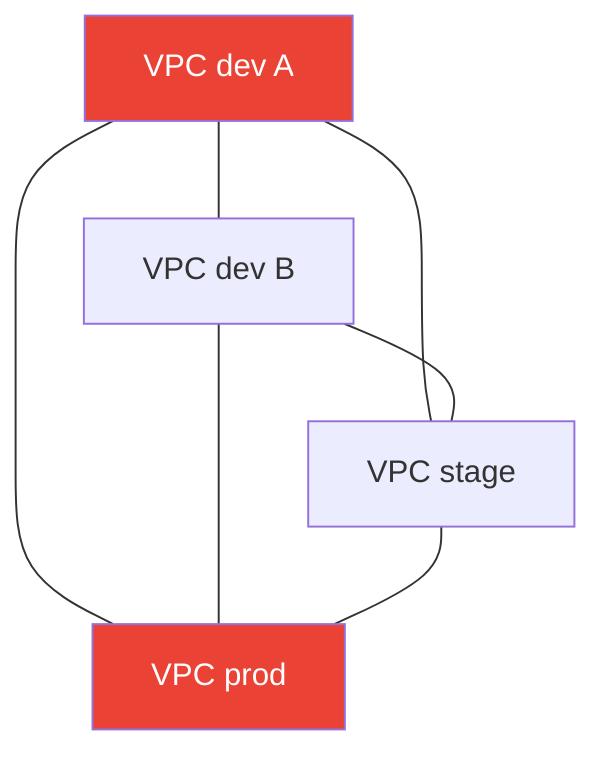
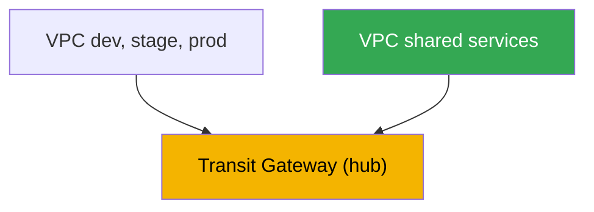
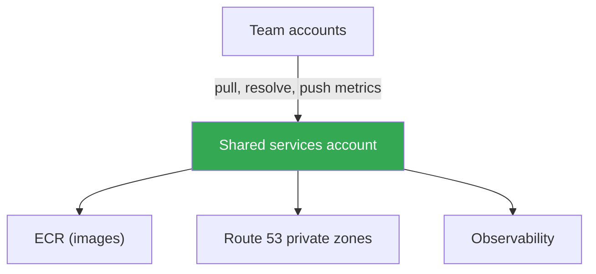

[Русская версия](ru.md) · [Versión en español](es.md) · [Version française](fr.md) · [Deutsche Version](de.md) · [ქართული ვერსია](ge.md) · [繁體中文版](tw.md) · [日本語版](jp.md)
# Chapter 32. Multi-cluster and multi-account: connectivity, shared resources, patterns

> **What comes next.** Chapters 26-31 covered traffic within a single cluster: ingress through NLB and ALB
> (Chapters 26-27), Gateway API (Chapter 28), DNS and certificates (Chapter 29), NetworkPolicy (Chapter
> 30), egress and its cost (Chapter 31). Here, the scope is larger: connectivity between multiple clusters
> and accounts. Service-level connectivity through VPC Lattice and ServiceExport/ServiceImport is covered in
> detail in Chapter 28; egress, VPC endpoints, and PrivateLink are covered in Chapter 31; GitOps and fleet
> management (Argo CD, Flux) are covered in Chapter 44; the fundamentals of VPCs, subnets, and routes are
> covered in Part 0 (Chapter 00-3). This chapter focuses on one thing: how to connect clusters in different
> VPCs and accounts, and which resources to share centrally.

## 32.1. "A service in the dev cluster needs a service in the prod account, but the networks cannot see each other"

The organization has grown. It started with one cluster, then there were several: a separate account for dev,
stage, and prod, plus a couple more accounts owned by adjacent teams. Each cluster has its own VPC and account,
which is safer and makes costs easier to track. Then comes the first connectivity requirement: a service in team
A's cluster needs to call a shared authentication service that runs in the platform team's cluster in another
account. Or an application in stage needs to reach a database running in the VPC of the shared account.

The naive solution is obvious: peer the two VPCs. It works for two. But there are already six clusters, many
connections are desired between them, and the situation quickly becomes messy:

- **VPC peering is not transitive.** If VPC A is peered with B, and B with C, then A cannot see C through B.
  Every pair that needs connectivity requires its own peering. For a complete graph of N VPCs, this means
  roughly N squared connections and the same number of route sets and security group rules.
- **CIDRs must not overlap.** Peering requires non-overlapping address ranges. But when every team created its
  VPC by copying `10.0.0.0/16`, the ranges overlapped, and they can no longer be peered directly because
  routing would be ambiguous.
- **Rules proliferate.** Every peering requires route-table entries on both sides and allowing rules in security
  groups. Six VPCs in a full mesh mean dozens of entries that someone must maintain manually and can easily
  get wrong.



Four VPCs in a full mesh already require six peerings; ten VPCs require forty-five. There is neither
transitivity nor scale. And this concerns only the network. There is still the question of how to keep teams
from maintaining their own ECR, DNS zone, and observability stack. Next, we will cover why organizations split
into accounts at all, which connectivity options exist besides peering, what and how to share through AWS RAM,
and which patterns are used in production.

## 32.2. Why use multiple accounts at all

Before solving connectivity, it is worth understanding why clusters have already been split across accounts.
This is not an accident but a deliberate technique. AWS recommends using multiple accounts managed by **AWS
Organizations**: an organization defines a hierarchy of organizational units (OUs), lets you apply shared
restrictions to them (service control policies), and provides consolidated billing.

Reasons to separate environments and teams into accounts:

- **Blast-radius isolation.** An account is the strongest boundary in AWS. An error, compromise, or quota
  exhaustion in a dev account does not affect prod, because they are physically separate accounts with different
  limits and permissions.
- **Security boundaries.** IAM permissions do not cross an account boundary by default. Access to another
  account must be granted explicitly through roles and cross-account trust. This is a convenient least-privilege
  model: prod is closed to teams that do not need it.
- **Separate billing and accounting.** The costs of every account are visible as a separate line in the
  consolidated bill. An account per team or environment immediately provides a cost breakdown without complex
  tagging schemes.
- **Quotas and limits.** Service limits, such as the number of VPCs, EIPs, and instances, are accounted for per
  account. Splitting across accounts removes competition for shared quotas between teams.

A typical structure, known as a landing zone, consists of a separate management account only for Organizations
and billing, an account for shared services, accounts for environments (dev, stage, prod), and accounts for
teams or products. Ready-made solutions such as AWS Control Tower deploy this structure with preconfigured OUs
and policies. Managing the structure itself is a separate topic. What matters here is that EKS clusters live in
these accounts and need connectivity between them.

## 32.3. Network connectivity options

Peering is not the only option, and it is usually not the best one for a cluster fleet. Let us break down four
main approaches, from simple to scalable.

**VPC peering.** A direct one-to-one connection between two VPCs. It is simple, inexpensive (you pay only for
traffic, cross-AZ, and cross-region), and has low latency. Its drawbacks have already been listed: it is not
transitive, requires non-overlapping CIDRs, and grows as N squared. It is suitable for a few stable pairs but
poor as a foundation for a growing fleet.

**Transit Gateway.** A regional virtual router, or hub, to which VPCs, VPNs, and Direct Connect attach through
attachments. The key difference from peering is that **routing is transitive**: all VPCs attached to the same
Transit Gateway can communicate with each other through the hub, if permitted by route tables, without creating
pairwise connections. There is one attachment per VPC rather than N-1 peerings. A Transit Gateway can be shared
to other accounts through AWS RAM, so it brings the VPCs of the entire organization into one routable network.
CIDRs still must not overlap because routing is based on IP. Pricing includes an hourly charge for each attachment
plus processed data.

**VPC Lattice.** Connectivity is at the service level rather than the network level (Chapter 28): a service is
registered in a service network, and a client from an associated VPC accesses it by DNS name regardless of the
VPC, cluster, or account in which the pods run. Cross-account connectivity uses AWS RAM, which shares the
service network. An important property is that connectivity goes through the service, not IP routing, so **CIDR
overlap is no longer a problem**: Lattice does not build a shared L3 domain. It is suited to east-west traffic
between services; the perimeter and outside ingress remain behind ALB and NLB.

**PrivateLink.** One-way private access to one service (Chapter 31): the provider publishes an endpoint service
behind an NLB, and the consumer creates an interface endpoint. Traffic is private, CIDRs can overlap because the
connection uses an ENI rather than a route, but the connection is one-way: the consumer initiates and the
provider accepts. It is useful when you need to expose exactly one service to another account rather than connect
networks.

| Approach | Model | Transitivity | CIDR overlap | Cross-account | When |
|---|---|---|---|---|---|
| VPC peering | network, one-to-one | no | prohibited | directly | a few stable pairs |
| Transit Gateway | network, hub | yes | prohibited | through RAM | VPC fleet, unified network |
| VPC Lattice | service | n/a | avoided | through RAM | east-west between services |
| PrivateLink | service, one endpoint | n/a | avoided | endpoint service | expose one service |

The layer split is straightforward. If you need a shared routable network for many VPCs, use Transit Gateway. If
you need connectivity between specific services across clusters and accounts, especially when CIDRs overlap, use
VPC Lattice. If you need to expose one service externally in one direction, use PrivateLink. Peering remains for
specific pairs.

## 32.4. Shared resources through AWS RAM

Connectivity is half the task. The other half is avoiding a separate copy of everything in every account. **AWS
Resource Access Manager (RAM)** lets an owner share a resource with other accounts, OUs, or the entire
organization without copying it. The consumer works with the resource as if it belonged to them, but the owner
continues to manage it. The following resources are useful to share in an EKS context:

| Resource | Shared with | Why in EKS |
|---|---|---|
| Subnets (`ec2:Subnet`) | only within the organization | shared VPC: nodes from different accounts in shared subnets |
| Transit gateways | any account | unified routing for the VPC fleet |
| VPC Lattice service network | any account | cross-account connectivity between cluster services |
| Route 53 Resolver rules | any account | shared forwarding of DNS queries |
| Prefix lists, IPAM pools | any account | unified CIDR planning, shared lists |

**Shared VPC.** Through RAM, the owner of the network account shares subnets, while other accounts in the
organization run their resources in them, including EKS nodes. The network is centralized, with one team owning
the VPC, routes, and NAT, while workloads reside in the team accounts. Note that subnets can be shared only
within the organization, not externally.

Not everything is shared through RAM. Some resources have their own cross-account mechanism:

- **Centralized ECR.** One account holds the image registry, and the others pull from it. Cross-account pulls
  are configured with a **repository policy** (a resource-based policy on the repository) granting
  `ecr:BatchGetImage` and `ecr:GetDownloadUrlForLayer` to the required consumer accounts, plus IAM permissions
  on the pulling side. This eliminates a separate ECR in every account and provides a single point for image
  scanning and signing (Chapter 20).
- **Shared Route 53 private hosted zone.** A private zone from one account can be associated with a VPC in
  another account, but not through RAM. This uses two API calls: the zone owner calls
  `CreateVPCAssociationAuthorization`, then the VPC-owning account calls `AssociateVPCWithHostedZone`. The zone's
  names then resolve in both VPCs. This creates a unified private namespace for services across accounts.

The overall logic is as follows: networks, DNS rules, and address lists are shared through RAM; images are shared
through an ECR repository policy; private zones are shared through association authorization. Ownership and
management remain with one account, while consumers receive explicit access.

## 32.5. Cluster connectivity at the service level

Connecting networks is not the same as letting a service in one cluster call a service in another. Even over a
shared network, discovery, meaning which name to call, and authorization, meaning who is allowed, remain open
questions. There are three approaches.

**VPC Lattice ServiceExport/ServiceImport.** This is the native EKS method for cross-cluster connectivity
(Chapter 28). AWS Gateway API Controller provides the `ServiceExport` and `ServiceImport` CRDs: export a
service from the source cluster, import it into the consumer cluster, then reference it in an `HTTPRoute`,
including with weights for blue/green between clusters. Lattice handles discovery and authorization through IAM
auth policies, and CIDR overlap does not interfere.

**Load balancer plus DNS.** The traditional approach without Lattice: a service in the source cluster is
published through an internal NLB or ALB (Chapters 26-27), a DNS record is created for it (external-dns,
Chapter 29), and a client from another cluster accesses it by name. The networks must be connected and routable
through Transit Gateway or peering. It is simple and understandable, but you build discovery and authorization
yourself.

**Service mesh cross-cluster.** Meshes such as Istio, Cilium Cluster Mesh, and Linkerd can connect services in
multiple clusters with shared discovery, mTLS, and policies. This is powerful, but adds its own control plane and
operational complexity on top of EKS. For many teams, Lattice or a load balancer with DNS solves the task more
simply. Choose a mesh when you already have requirements for mTLS and unified traffic management. We will not go
deeper here.

Choose according to the situation: for cross-cluster service connectivity inside AWS without extra
infrastructure, use Lattice; if networks are already connected and a simple call by name is enough, use a load
balancer and DNS; if there are mature mesh requirements, consider a cluster mesh.

## 32.6. Assembly patterns

The components described above form recurring patterns. Let us examine the main ones.

**Hub-and-spoke on Transit Gateway.** A central network account owns the Transit Gateway and shares it through
RAM. Team VPCs, the spokes, connect through attachments. All cross-account traffic goes through the hub, routing
is transitive, and adding a new VPC requires one attachment rather than peerings to every other VPC.



**Shared services account.** A separate account holds shared resources: centralized ECR, Route 53 private zones,
an observability stack (metrics and logs, Chapters 33-34), and sometimes shared databases. Teams pull images from
its ECR through a repository policy, resolve names from its private zones, and send metrics to its Prometheus.
This eliminates duplication and provides unified control points.



**CIDR planning.** Everything that uses IP routing, including peering, Transit Gateway, and a shared VPC,
requires non-overlapping ranges. Therefore, allocate CIDRs centrally rather than through copy-paste: give every
account and VPC its own non-overlapping block, often through a shared IPAM pool distributed through RAM. Do this
before creating VPCs because readdressing a network later is expensive. If overlap has already occurred and
cannot be fixed, build service connectivity through Lattice or PrivateLink, which do not require a shared L3
domain.

**Fleet management.** When there are many clusters, do not deploy their configuration and applications manually
to each one. Manage them declaratively through GitOps, such as Argo CD or Flux, from one place for the entire
fleet. This topic is covered fully in Chapter 44. Here, it is only important that multi-cluster operation and
GitOps go together: connectivity provides the network, while GitOps provides configuration consistency.

## 32.7. How this is used in production

- **Separate accounts by environments and teams in advance.** Put dev, stage, prod, and shared services in
  different accounts under AWS Organizations to isolate the blast radius and track costs.
- **Build the VPC fleet on Transit Gateway rather than peerings.** Use a hub with transitive routing, shared
  through RAM, instead of a peering graph that grows as N squared.
- **Plan CIDRs centrally from day one.** Use non-overlapping blocks per account and VPC, often from a shared IPAM
  pool. Readdressing later is too expensive.
- **Move shared resources into a shared services account.** Centralized ECR with cross-account pulls through a
  repository policy, Route 53 private zones, and observability provide one point instead of copies.
- **Build service connectivity with overlapping CIDRs through VPC Lattice.** It does not require a shared L3
  domain, cross-account connectivity uses RAM, and cross-cluster connectivity uses ServiceExport/ServiceImport.
- **Manage the cluster fleet through GitOps.** Deploy configuration and workloads declaratively to all clusters
  from one place (Chapter 44), rather than manually to each one.

## 32.8. Mini-glossary

- **AWS Organizations** - a service for managing multiple accounts: an OU hierarchy, shared policies (SCPs),
  and consolidated billing.
- **landing zone** - a preconfigured multi-account structure (management, shared services, environments,
  teams), deployed among other ways through AWS Control Tower.
- **VPC peering** - a direct one-to-one connection between two VPCs; it is not transitive and requires
  non-overlapping CIDRs.
- **Transit Gateway** - a regional hub router with transitive routing between attached VPCs, VPNs, and Direct
  Connect; it is shared through RAM.
- **AWS RAM (Resource Access Manager)** - a service for sharing resources, including subnets, Transit Gateway,
  VPC Lattice service networks, and Route 53 Resolver rules, with other accounts and the organization.
- **shared VPC** - a model in which the owner shares subnets through RAM and other accounts run their resources,
  including EKS nodes, in them.
- **repository policy** - a resource-based policy on an ECR repository that permits cross-account image pulls by
  other accounts.
- **hub-and-spoke** - a topology with a central Transit Gateway, the hub, and attached team VPCs, the spokes.
- **shared services account** - an account with common resources, such as ECR, private DNS zones, and
  observability, used by the other accounts.

## 32.9. Chapter summary

- Growth to many clusters in different accounts creates two tasks: connect their networks or services and avoid
  duplicating shared resources in every account.
- VPC peering is simple for pairs, but is not transitive, requires non-overlapping CIDRs, and grows as N squared,
  so it is unsuitable as a foundation for a fleet.
- Multi-account operation under AWS Organizations provides blast-radius isolation, security boundaries, separate
  billing, and independent quotas. A landing zone defines the typical structure.
- Transit Gateway is a hub with transitive routing that brings a VPC fleet into a unified network. It is shared
  through RAM, but CIDRs still must not overlap.
- VPC Lattice and PrivateLink connect at the service level and avoid CIDR overlap: Lattice provides east-west
  connectivity through a service network and RAM, while PrivateLink exposes one service in one direction.
- AWS RAM shares subnets, within the organization, Transit Gateway, VPC Lattice service networks, and Route 53
  Resolver rules. ECR is shared through a repository policy, and a private zone through association
  authorization.
- Cross-cluster service connectivity in EKS is built natively through ServiceExport/ServiceImport (Chapter 28).
  Alternatives are a load balancer with DNS or a service mesh.
- Typical patterns are hub-and-spoke on Transit Gateway, a shared services account, centralized CIDR planning,
  and fleet management through GitOps (Chapter 44).

## 32.10. How this helps in real work

During on-call work, multi-account connectivity appears as "service A could not reach service B in another
account." Investigate it by layers: is there a route at all, including a Transit Gateway attachment, route
tables, and non-overlapping CIDRs; do the security groups and NACLs allow traffic; does the name resolve, meaning
is the private zone associated with this VPC; and, if connectivity uses Lattice, is the VPC associated with the
service network and does an IAM auth policy block traffic? Knowing which mechanism built the connection
immediately narrows the search.

During planning, the key decisions are made in advance and only once: how to divide accounts, which connectivity
mechanism to choose for the fleet, for which Transit Gateway is almost always a sensible default, how to allocate
non-overlapping CIDRs, and what to move into shared services. Fixing a mistake in CIDRs or account structure
later is expensive, so discuss these decisions with networking and platform teams before the first clusters appear
in the accounts. GitOps (Chapter 44) then maintains consistency across the fleet.

## 32.11. Self-check questions

1. Why does VPC peering scale poorly for a growing fleet of clusters and accounts?
2. What does "VPC peering is not transitive" mean, and how does it manifest with three VPCs?
3. Why separate environments and teams into different accounts, and which four benefits does this provide?
4. What are AWS Organizations, and what role does a landing zone play?
5. How does Transit Gateway differ from peering in routing and in the number of connections?
6. Does Transit Gateway require non-overlapping CIDRs, and how is it shared to other accounts?
7. Why do VPC Lattice and PrivateLink avoid the CIDR-overlap problem, while Transit Gateway does not?
8. Which resources are shared through AWS RAM, and do subnets have an organization-boundary limitation?
9. How is a cross-account image pull from a centralized ECR configured?
10. How do you make a Route 53 private zone visible in a VPC in another account if not through RAM?
11. Which methods connect services in different clusters, and when is each appropriate?
12. What does the hub-and-spoke pattern consist of, and what is moved into a shared services account?
13. Why are CIDRs planned centrally before creating VPCs rather than fixed later?

## Practice

This chapter does not yet have a dedicated lab, but you can inspect the current connectivity topology in a live
account. First, check whether there is a Transit Gateway and which peerings exist:

```bash
# Transit Gateways in the account and their state
aws ec2 describe-transit-gateways \
  --query "TransitGateways[].{Id:TransitGatewayId,State:State,Owner:OwnerId}" --output table

# existing VPC peerings and their CIDR sides
aws ec2 describe-vpc-peering-connections \
  --query "VpcPeeringConnections[].{Id:VpcPeeringConnectionId,Status:Status.Code}" \
  --output table
```

If there are many peerings and no Transit Gateway, this is a candidate for moving to a hub. Next, inspect what is
shared to or from the account through AWS RAM:

```bash
# resources shared with you and by you (subnets, TGW, Lattice service network)
aws ram list-resources --resource-owner OTHER-ACCOUNTS --output table
aws ram list-resources --resource-owner SELF --output table
```

Compare the output with what the clusters need: is the Transit Gateway shared, and are there shared subnets or a
VPC Lattice service network? Then check your VPC CIDRs for overlap
(`aws ec2 describe-vpcs --query "Vpcs[].CidrBlock"`). Matching ranges indicate that routable connectivity between
them is impossible and Lattice or PrivateLink is needed.

---
[Table of contents](../README.md) · [Chapter 31](../31/en.md) · [Chapter 33](../33/en.md)
