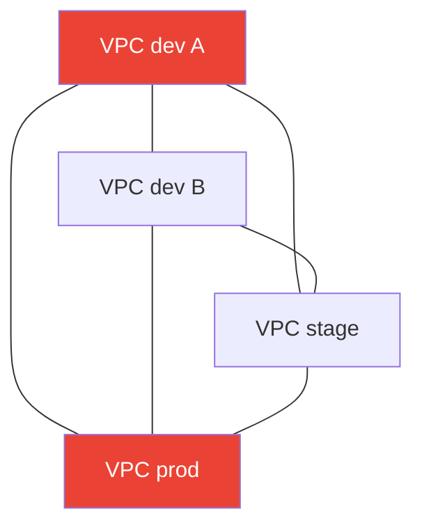
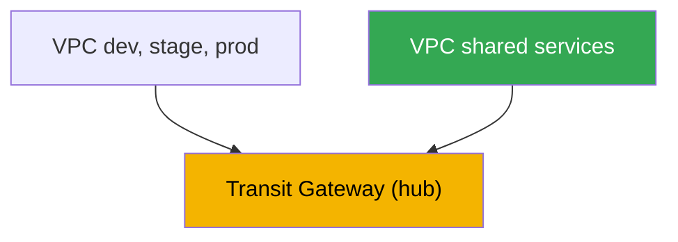
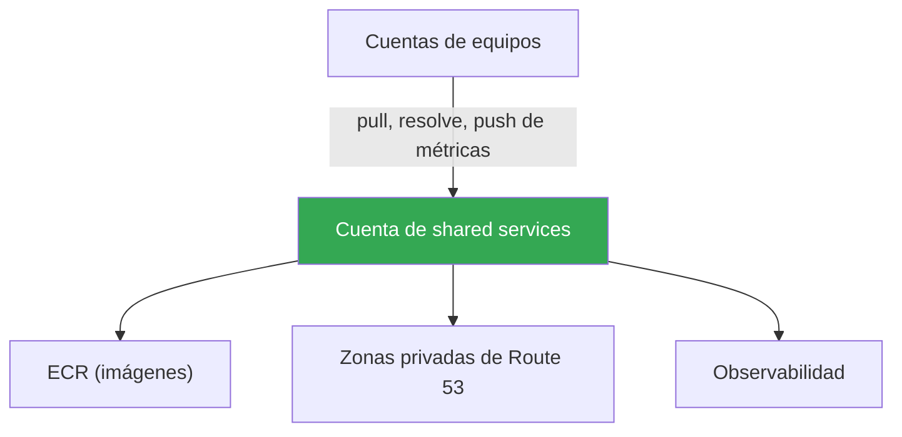

[Eng version](en.md) · [Русская версия](ru.md) · [Version française](fr.md) · [Deutsche Version](de.md) · [ქართული ვერსია](ge.md) · [繁體中文版](tw.md) · [日本語版](jp.md)
# Capítulo 32. Multiclúster y multicuenta: conectividad, recursos compartidos, patrones

> **Qué sigue.** Los capítulos 26-31 analizaron el tráfico dentro de un clúster: entrada mediante NLB y ALB
> (capítulos 26-27), Gateway API (capítulo 28), DNS y certificados (capítulo 29), NetworkPolicy (capítulo
> 30), egress y su coste (capítulo 31). Aquí la escala es mayor: conectividad entre varios clústeres y
> cuentas. La conexión a nivel de servicios mediante VPC Lattice y ServiceExport/ServiceImport se trata
> en detalle en el capítulo 28; egress, VPC endpoints y PrivateLink, en el capítulo 31; GitOps y la gestión
> de una flota de clústeres (Argo CD, Flux), en el capítulo 44; la estructura básica de VPC, subredes y rutas,
> en la Parte 0 (capítulo 00-3). Aquí hay una sola cuestión: cómo conectar clústeres en diferentes VPC y
> cuentas, y qué compartir de forma centralizada.

## 32.1. «Un servicio del clúster dev necesita un servicio de la cuenta prod, pero las redes no se ven entre sí»

La organización creció. Al principio había un clúster; después pasaron a ser varios: una cuenta independiente
para dev, otra para stage, otra para prod, y algunas cuentas más de equipos vecinos. Cada clúster está en su
propia VPC y en su propia cuenta: así es más seguro y resulta más cómodo calcular costes. Entonces llega la
primera necesidad de conectividad: un servicio del clúster del equipo A debe acceder a un servicio común de
autenticación que reside en el clúster del equipo de plataforma en otra cuenta. O una aplicación en stage debe
llegar a una base de datos que se ejecuta en la VPC de una cuenta shared.

La solución ingenua parece evidente: conectar las dos VPC mediante peering. Funciona, para dos. Pero ya hay
seis clústeres, se desean muchas conexiones entre ellos y el panorama se deteriora pronto:

- **VPC peering no es transitivo.** Si la VPC A está emparejada con B y B con C, A no ve C a través de B.
  Cada par que necesita conectividad requiere su propio peering. Para un grafo completo de N VPC, son del
  orden de N al cuadrado conexiones e igual número de conjuntos de rutas y reglas de security group.
- **Los CIDR no deben solaparse.** El peering exige rangos de direcciones no solapados. Pero cuando cada
  equipo creó su VPC copiando `10.0.0.0/16`, los rangos coincidieron y ya no se pueden emparejar directamente:
  el enrutamiento es ambiguo.
- **Las reglas se multiplican.** Para cada peering, entradas en las tablas de rutas de ambos lados y reglas
  de permiso en los security group. Seis VPC en malla completa son decenas de entradas que alguien debe
  mantener manualmente y en las que es fácil equivocarse.



Cuatro VPC en malla completa ya son seis peerings; diez VPC requerirán cuarenta y cinco. No hay
transitividad ni escala. Y esto es solo sobre la red: queda además la cuestión de cómo evitar que los equipos
mantengan cada uno su propio ECR, su propia zona DNS y su propia pila de observabilidad. A continuación veremos
por qué se distribuyen las cargas entre cuentas, qué opciones de conectividad existen además del peering, qué y
cómo compartir mediante AWS RAM, y con qué patrones se ensambla esto en producción.

## 32.2. Por qué usar multicuenta

Antes de resolver la conectividad, conviene entender por qué los clústeres ya están distribuidos entre cuentas:
no es casualidad, sino una técnica deliberada. AWS recomienda utilizar varias cuentas gestionadas mediante
**AWS Organizations**: una organización define una jerarquía de unidades organizativas (OU) y permite aplicarles
restricciones comunes (service control policies) y mantener una facturación consolidada.

Motivos para separar entornos y equipos por cuentas:

- **Aislamiento del blast radius.** Una cuenta es el límite más estricto en AWS. Un error, una vulneración o
  el agotamiento de una cuota en la cuenta dev no afecta a prod, porque son cuentas físicamente distintas con
  diferentes límites y permisos.
- **Límites de seguridad.** De forma predeterminada, los permisos IAM no cruzan el límite de una cuenta. El
  acceso a una cuenta ajena debe otorgarse explícitamente mediante roles y cross-account trust. Es un modelo
  práctico de mínimo privilegio: prod queda cerrado para los equipos que no lo necesitan.
- **Facturación y contabilidad independientes.** Los costes de cada cuenta aparecen en una línea separada de
  la factura consolidada. Una cuenta por equipo o entorno proporciona de inmediato un desglose de gastos sin
  esquemas complejos de etiquetado.
- **Cuotas y límites.** Los límites de servicio (número de VPC, EIP, instancias) se calculan por cuenta.
  Separar las cargas por cuentas elimina la competencia entre equipos por cuotas compartidas.

La estructura típica, la idea de una landing zone, tiene una cuenta management dedicada solo a Organizations y
facturación, una cuenta para servicios comunes (shared services), cuentas para entornos (dev, stage, prod), y
cuentas para equipos o productos. Esquemas listos como AWS Control Tower despliegan esta estructura con OU y
políticas preconfiguradas. La gestión de la propia estructura es un tema aparte; para nosotros, lo importante es
que los clústeres EKS viven en estas cuentas y necesitan conectividad entre sí.

## 32.3. Opciones de conectividad de red

El peering no es la única opción y, normalmente, tampoco la mejor para una flota de clústeres. Desglosemos los
cuatro enfoques principales, de los simples a los escalables.

**VPC peering.** Conexión directa entre dos VPC, uno a uno. Es sencillo, económico (se paga solo el tráfico,
cross-AZ y cross-region) y de baja latencia. Sus inconvenientes ya se han enumerado: no es transitivo, exige
CIDR no solapados y crece como N al cuadrado. Es bueno para unos pocos pares estables, malo como base de una
flota en crecimiento.

**Transit Gateway.** Un enrutador virtual regional, un hub al que se conectan VPC, VPN y Direct Connect mediante
attachments. La diferencia clave con el peering es que el **enrutamiento es transitivo**: todas las VPC conectadas
a un mismo Transit Gateway pueden, si las tablas de rutas lo permiten, comunicarse entre sí mediante el hub sin
crear conexiones por pares. Un attachment por VPC en lugar de N-1 peerings. Transit Gateway se puede compartir
con otras cuentas mediante AWS RAM, por lo que reúne las VPC de toda la organización en una red enrutable. Los
CIDR siguen sin poder solaparse: el enrutamiento se realiza por IP. Coste: una tarifa por hora para cada
attachment más los datos procesados.

**VPC Lattice.** Conexión no a nivel de red, sino de servicios (capítulo 28): un servicio se registra en una
service network y un cliente de una VPC asociada accede a él mediante un nombre DNS, independientemente de la
VPC, clúster o cuenta en que residan los pods. El acceso cross-account se hace mediante AWS RAM, compartiendo la
service network. Una propiedad importante: la conexión se realiza a través del servicio, no mediante enrutamiento
IP, por lo que el **solapamiento de CIDR deja de ser un problema**: Lattice no construye un dominio L3 común.
Es adecuado para tráfico east-west entre servicios; el perímetro y la entrada desde fuera siguen detrás de ALB y
NLB.

**PrivateLink.** Acceso privado unidireccional a un solo servicio (capítulo 31): el proveedor publica un endpoint
service detrás de un NLB y el consumidor crea un interface endpoint. El tráfico es privado, los CIDR pueden
solaparse (la conexión es mediante ENI, no una ruta), pero la conexión es unidireccional: el consumidor inicia y
el proveedor acepta. Es adecuado cuando se necesita entregar exactamente un servicio a otra cuenta, no conectar
redes.

| Enfoque | Modelo | Transitividad | Solapamiento de CIDR | Cross-account | Cuándo |
|---|---|---|---|---|---|
| VPC peering | red, 1 a 1 | no | prohibido | directamente | unos pocos pares estables |
| Transit Gateway | red, hub | sí | prohibido | mediante RAM | flota de VPC, red unificada |
| VPC Lattice | servicio | n/a | se evita | mediante RAM | east-west entre servicios |
| PrivateLink | servicio, 1 endpoint | n/a | se evita | endpoint service | entregar un servicio |

La separación por capas es sencilla. Si se necesita una red enrutable común para muchas VPC, Transit Gateway.
Si se necesita conectar servicios concretos entre clústeres y cuentas, especialmente con CIDR solapados, VPC
Lattice. Si se necesita entregar un solo servicio de forma unidireccional, PrivateLink. El peering se mantiene
para pares específicos.

## 32.4. Recursos compartidos mediante AWS RAM

La conectividad es la mitad de la tarea. La otra mitad es no mantener una copia de todo en cada cuenta.
**AWS Resource Access Manager (RAM)** permite que el propietario comparta un recurso con otras cuentas, OU o toda
la organización sin copiarlo. El consumidor trabaja con el recurso como si fuera suyo, pero el propietario sigue
gestionándolo. Lo que resulta útil compartir en el contexto de EKS:

| Recurso | Con quién se comparte | Para qué en EKS |
|---|---|---|
| Subnets (`ec2:Subnet`) | solo dentro de la organización | shared VPC: nodos de distintas cuentas en subredes comunes |
| Transit gateways | cualquier cuenta | enrutamiento unificado de la flota de VPC |
| VPC Lattice service network | cualquier cuenta | conexión de servicios de clústeres entre cuentas |
| Route 53 Resolver rules | cualquier cuenta | forwarding común de consultas DNS |
| Prefix lists, IPAM pools | cualquier cuenta | planificación CIDR unificada, listas compartidas |

**Shared VPC.** Mediante RAM, el propietario de la cuenta de red comparte subnets y las demás cuentas de la
organización ejecutan en ellas sus recursos, incluidos nodos EKS. La red se centraliza, un equipo posee la VPC,
las rutas y NAT, mientras que las cargas de trabajo permanecen en las cuentas de los equipos. Tenga en cuenta
que las subnets solo se comparten dentro de la propia organización, no hacia fuera.

No todo se comparte mediante RAM: algunos recursos tienen su propio mecanismo cross-account:

- **ECR centralizado.** Una cuenta aloja el registro de imágenes y las demás hacen pull desde él. El pull
  cross-account se configura con una **repository policy**, una política resource-based del repositorio, con
  las acciones `ecr:BatchGetImage` y `ecr:GetDownloadUrlForLayer` para las cuentas consumidoras necesarias,
  además de permisos IAM del lado que hace pull. Esto elimina la necesidad de tener un ECR en cada cuenta y
  proporciona un único punto para escanear y firmar imágenes (capítulo 20).
- **Route 53 private hosted zone compartida.** Una zona privada de una cuenta puede asociarse a la VPC de otra
  cuenta, pero no mediante RAM, sino mediante dos llamadas API: el propietario de la zona ejecuta
  `CreateVPCAssociationAuthorization` y después el propietario de la cuenta de la VPC llama a
  `AssociateVPCWithHostedZone`. Tras ello, los nombres de la zona se resuelven en ambas VPC. Así se crea un
  espacio de nombres privado unificado para los servicios de distintas cuentas.

La lógica común es esta: la red, las reglas DNS y las listas de direcciones se comparten mediante RAM; las
imágenes, mediante la política de repositorio de ECR; las zonas privadas, mediante association authorization.
La propiedad y la gestión permanecen en una cuenta y los consumidores reciben acceso explícitamente.

## 32.5. Conectividad de clústeres a nivel de servicios

Conectar redes no es lo mismo que permitir que un servicio de un clúster acceda a un servicio de otro. Incluso
sobre una red común, siguen existiendo la cuestión del descubrimiento, por qué nombre llamar, y la autorización,
quién puede hacerlo. Hay tres enfoques.

**VPC Lattice ServiceExport/ServiceImport.** El modo nativo de EKS para conexión entre clústeres (capítulo 28).
AWS Gateway API Controller proporciona los CRD `ServiceExport` y `ServiceImport`: el servicio se exporta desde
el clúster de origen, se importa en el clúster consumidor y después se hace referencia a él en `HTTPRoute`, incluso
con pesos para blue/green entre clústeres. Lattice se encarga del descubrimiento y la autorización, mediante IAM
auth policies, y el solapamiento de CIDR no es un obstáculo.

**Balanceador de carga más DNS.** El enfoque clásico sin Lattice: un servicio del clúster de origen se publica
mediante un NLB o ALB interno (capítulos 26-27), se le crea un registro DNS (external-dns, capítulo 29) y un
cliente de otro clúster accede por nombre. Las redes deben estar conectadas y ser enrutables, mediante Transit
Gateway o peering. Es simple y claro, pero usted construye el descubrimiento y la autorización por su cuenta.

**Service mesh cross-cluster.** Los meshes, Istio, Cilium Cluster Mesh, Linkerd, pueden conectar servicios de
varios clústeres con descubrimiento común, mTLS y políticas. Es potente, pero añade su propio control plane y
complejidad operativa sobre EKS. Para muchos equipos, Lattice o un balanceador con DNS resuelven la tarea de
forma más sencilla; se adopta un mesh cuando ya existen requisitos de mTLS y gestión de tráfico unificada. No
profundizaremos aquí.

La elección depende de la situación: para conexión de servicios entre clústeres dentro de AWS sin infraestructura
adicional, Lattice; si las redes ya están conectadas y basta una llamada simple por nombre, balanceador y DNS; si
hay requisitos maduros de mesh, mirar hacia cluster mesh.

## 32.6. Patrones de implementación

Con los componentes enumerados se forman esquemas recurrentes. Veamos los principales.

**Hub-and-spoke con Transit Gateway.** Una cuenta de red central aloja Transit Gateway y lo comparte mediante
RAM. Las VPC de los equipos, los spokes, se conectan mediante attachments. Todo el tráfico entre cuentas pasa
por el hub, el enrutamiento es transitivo y añadir una VPC nueva supone un attachment, no peerings con todas las
demás.



**Cuenta de shared services.** Una cuenta independiente para lo común: ECR centralizado, zonas privadas de
Route 53, pila de observabilidad, métricas y logs, capítulos 33-34, y a veces bases de datos compartidas. Los
equipos hacen pull de imágenes desde su ECR mediante repository policy, resuelven nombres de sus zonas privadas
y envían métricas a su Prometheus. Así se elimina la duplicación y se obtienen puntos de control unificados.



**Planificación de CIDR.** Todo lo que utiliza enrutamiento IP, peering, Transit Gateway, shared VPC, requiere
rangos no solapados. Por ello, los CIDR se asignan de forma centralizada, no copiando y pegando: cada cuenta y
VPC recibe su propio bloque no solapado, a menudo mediante un IPAM pool común compartido por RAM. Se hace antes
de crear las VPC: rediseñar la red posteriormente es caro. Si ya se produjeron solapamientos y no pueden
corregirse, la conexión entre servicios se construye mediante Lattice o PrivateLink, que no necesitan un dominio
L3 común.

**Gestión de la flota.** Cuando hay muchos clústeres, su configuración y aplicaciones no se despliegan a mano en
cada uno: se hace de forma declarativa mediante GitOps, Argo CD o Flux, desde un único lugar para toda la flota.
El tema se trata íntegramente en el capítulo 44; aquí solo importa que multiclúster y GitOps van juntos: la
conectividad proporciona la red y GitOps aporta uniformidad a la configuración.

## 32.7. Cómo se aplica en producción

- **Las cuentas se separan por entornos y equipos desde el principio.** dev, stage, prod y los servicios comunes
  van en distintas cuentas bajo AWS Organizations para aislar el blast radius y calcular costes.
- **La flota de VPC se construye con Transit Gateway, no con peerings.** Un hub con enrutamiento transitivo,
  compartido mediante RAM, en lugar de un grafo de peerings que crece como N al cuadrado.
- **Los CIDR se planifican centralmente desde el primer día.** Bloques no solapados por cuenta y VPC, a menudo
  desde un IPAM pool común; rediseñarlos posteriormente es demasiado caro.
- **Los recursos comunes se trasladan a una cuenta de shared services.** ECR centralizado, pull cross-account
  mediante repository policy, zonas privadas de Route 53 y observabilidad: un punto en lugar de copias.
- **La conexión entre servicios con CIDR solapados se construye mediante VPC Lattice.** No requiere un dominio
  L3 común, el cross-account se realiza por RAM y el multiclúster mediante ServiceExport/ServiceImport.
- **La flota de clústeres se gestiona mediante GitOps.** La configuración y las cargas se despliegan de forma
  declarativa a todos los clústeres desde un único lugar (capítulo 44), no manualmente en cada uno.

## 32.8. Miniglosario

- **AWS Organizations**: servicio para gestionar varias cuentas: jerarquía de OU, políticas comunes (SCP) y
  facturación consolidada.
- **landing zone**: estructura multicuenta preconfigurada, management, shared services, entornos y equipos;
  se despliega, entre otros medios, mediante AWS Control Tower.
- **VPC peering**: conexión directa uno a uno entre dos VPC; no es transitiva y exige CIDR no solapados.
- **Transit Gateway**: enrutador-hub regional con enrutamiento transitivo entre VPC, VPN y Direct Connect
  conectados; se comparte mediante RAM.
- **AWS RAM (Resource Access Manager)**: servicio para compartir recursos, subnets, Transit Gateway, VPC
  Lattice service network y Route 53 Resolver rules, con otras cuentas y con la organización.
- **shared VPC**: modelo en el que el propietario comparte subnets mediante RAM y otras cuentas ejecutan sus
  recursos en ellas, incluidos nodos EKS.
- **repository policy**: política resource-based de un repositorio ECR que permite a otras cuentas hacer pull
  cross-account de imágenes.
- **hub-and-spoke**: topología con un Transit Gateway central, hub, y VPC de equipos conectadas a él, spokes.
- **cuenta de shared services**: cuenta con recursos comunes, ECR, zonas DNS privadas y observabilidad, que
  utilizan las demás cuentas.

## 32.9. Resumen del capítulo

- El crecimiento a muchos clústeres en distintas cuentas plantea dos tareas: conectar sus redes o servicios y no
  duplicar recursos comunes en cada cuenta.
- VPC peering es simple para pares, pero no es transitivo, exige CIDR no solapados y crece como N al cuadrado:
  no sirve como base para una flota.
- La multicuenta bajo AWS Organizations ofrece aislamiento de blast radius, límites de seguridad, facturación
  independiente y cuotas autónomas; una landing zone define la estructura típica.
- Transit Gateway es un hub con enrutamiento transitivo que reúne una flota de VPC en una única red; se comparte
  mediante RAM, pero los CIDR aún no deben solaparse.
- VPC Lattice y PrivateLink conectan a nivel de servicios y evitan el solapamiento de CIDR: Lattice ofrece
  east-west mediante service network y RAM; PrivateLink entrega un servicio de forma unidireccional.
- AWS RAM comparte subnets, dentro de la organización, Transit Gateway, VPC Lattice service network y Route 53
  Resolver rules; ECR se entrega mediante repository policy y una zona privada mediante association authorization.
- La conexión entre servicios de clústeres en EKS se construye de forma nativa mediante ServiceExport/ServiceImport
  (capítulo 28); las alternativas son un balanceador con DNS o un service mesh.
- Los patrones habituales son hub-and-spoke con Transit Gateway, una cuenta de shared services, planificación
  CIDR centralizada y gestión de la flota mediante GitOps (capítulo 44).

## 32.10. Cómo resulta útil en el trabajo real

Durante una guardia, la conectividad multicuenta suele aparecer como «el servicio A no logra llegar al servicio B
en otra cuenta». El análisis va por capas: si existe una ruta, attachment a Transit Gateway, tablas de rutas, si
los CIDR no se solapan; si lo permiten los security group y NACL; si el nombre se resuelve, si la zona privada
está asociada a esa VPC; y, si la conexión usa Lattice, si la VPC está asociada a la service network y si una IAM
auth policy no bloquea el tráfico. Saber mediante cuál de los mecanismos se construyó la conexión reduce de
inmediato el ámbito de búsqueda.

En la planificación, las decisiones clave se toman de antemano y una sola vez: cómo dividir las cuentas, qué
mecanismo de conectividad elegir para la flota, Transit Gateway es casi siempre un valor predeterminado razonable,
cómo asignar CIDR no solapados y qué trasladar a shared services. Corregir posteriormente un error en los CIDR o
en la estructura de cuentas es costoso, por lo que conviene debatir estas decisiones con los equipos de red y de
plataforma antes de que aparezcan los primeros clústeres en las cuentas. Después, GitOps mantiene la uniformidad
en toda la flota (capítulo 44).

## 32.11. Preguntas de autoevaluación

1. ¿Por qué VPC peering escala mal para una flota creciente de clústeres y cuentas?
2. ¿Qué significa que «VPC peering no es transitivo» y cómo se manifiesta con tres VPC?
3. ¿Por qué separar entornos y equipos en distintas cuentas? ¿Qué cuatro beneficios proporciona?
4. ¿Qué son AWS Organizations y qué papel desempeña una landing zone?
5. ¿En qué se diferencia Transit Gateway del peering en enrutamiento y en número de conexiones?
6. ¿Exige Transit Gateway CIDR no solapados y cómo se entrega a otras cuentas?
7. ¿Por qué VPC Lattice y PrivateLink evitan el problema de CIDR solapados y Transit Gateway no?
8. ¿Qué recursos se comparten mediante AWS RAM y las subnets tienen alguna restricción respecto al límite de la organización?
9. ¿Cómo se configura el pull cross-account de imágenes desde un ECR centralizado?
10. ¿Cómo se hace visible una zona privada de Route 53 en la VPC de otra cuenta si no es mediante RAM?
11. ¿De qué formas se conectan servicios de distintos clústeres y cuándo es apropiada cada una?
12. ¿De qué consta el patrón hub-and-spoke y qué se traslada a una cuenta de shared services?
13. ¿Por qué los CIDR se planifican centralmente antes de crear las VPC, en lugar de corregirlos después?

## Práctica

Este capítulo todavía no tiene laboratorio propio, pero es práctico revisar la topología de conectividad actual en
una cuenta activa. Primero compruebe si hay Transit Gateway y qué peerings están configurados:

```bash
# Transit Gateway de la cuenta y su estado
aws ec2 describe-transit-gateways \
  --query "TransitGateways[].{Id:TransitGatewayId,State:State,Owner:OwnerId}" --output table

# VPC peering existentes y sus lados CIDR
aws ec2 describe-vpc-peering-connections \
  --query "VpcPeeringConnections[].{Id:VpcPeeringConnectionId,Status:Status.Code}" \
  --output table
```

Si hay muchos peerings y no hay Transit Gateway, es un candidato para migrar a un hub. A continuación, revise
qué se ha compartido con la cuenta o desde la cuenta mediante AWS RAM:

```bash
# recursos compartidos con usted y por usted (subnets, TGW, Lattice service network)
aws ram list-resources --resource-owner OTHER-ACCOUNTS --output table
aws ram list-resources --resource-owner SELF --output table
```

Compare la salida con lo que necesitan los clústeres: si Transit Gateway está compartido y si existen subnets
comunes o una service network de VPC Lattice. Después, compruebe si los CIDR de sus VPC se solapan
(`aws ec2 describe-vpcs --query "Vpcs[].CidrBlock"`): los rangos coincidentes indican que la conectividad
mediante enrutamiento entre ellas es imposible y se necesita Lattice o PrivateLink.

---
[Índice](../README_ES.md) · [Capítulo 31](../31/es.md) · [Capítulo 33](../33/es.md)
