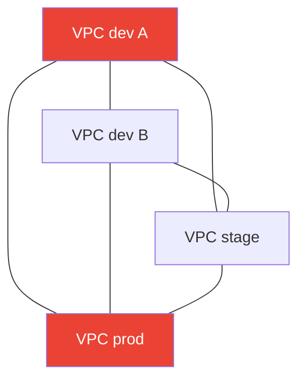
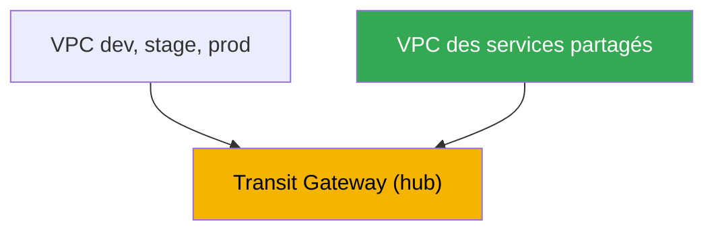
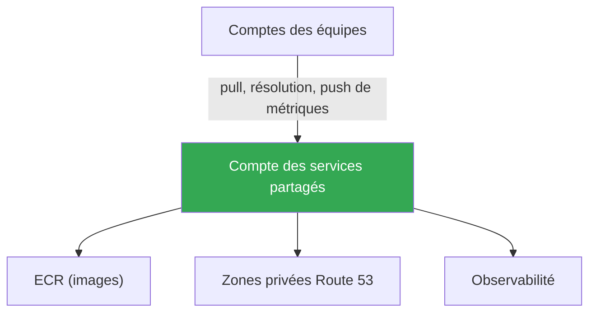

[Eng version](en.md) · [Русская версия](ru.md) · [Versión en español](es.md) · [Deutsche Version](de.md) · [ქართული ვერსია](ge.md) · [繁體中文版](tw.md) · [日本語版](jp.md)
# Chapitre 32. Multi-cluster et multi-compte : connectivité, ressources partagées, modèles

> **La suite.** Les chapitres 26 à 31 ont traité du trafic dans un même cluster : entrée via NLB et ALB
> (chapitres 26-27), Gateway API (chapitre 28), DNS et certificats (chapitre 29), NetworkPolicy (chapitre
> 30), egress et son coût (chapitre 31). Ici, l'échelle est plus grande : la connectivité entre plusieurs
> clusters et comptes. La communication au niveau des services via VPC Lattice et
> ServiceExport/ServiceImport est détaillée au chapitre 28 ; egress, VPC endpoints et PrivateLink, au
> chapitre 31 ; GitOps et la gestion d'un parc de clusters (Argo CD, Flux), au chapitre 44 ; le fonctionnement
> de base des VPC, sous-réseaux et routes, dans la partie 0 (chapitre 00-3). Une seule question ici : comment
> relier des clusters dans différents VPC et comptes, et quels éléments partager de manière centralisée.

## 32.1. « Un service du cluster dev a besoin d'un service dans le compte prod, mais les réseaux ne se voient pas »

L'organisation a grandi. Au début, il y avait un cluster, puis plusieurs : un compte distinct
pour dev, stage et prod, ainsi qu'une paire de comptes d'équipes voisines. Chaque cluster se
trouve dans son propre VPC et compte, ce qui est plus sûr et facilite le suivi des coûts. Puis
arrive le premier besoin de connectivité : un service du cluster de l'équipe A doit appeler un
service d'authentification commun, qui vit dans le cluster de l'équipe plateforme d'un autre
compte. Ou une application dans stage doit joindre une base de données exécutée dans le VPC du
compte shared.

La solution naïve semble évidente : appairer les deux VPC. Cela fonctionne pour deux. Mais il y
a déjà six clusters, de nombreuses connexions sont souhaitées entre eux, et le tableau se
dégrade rapidement :

- **Le VPC peering n'est pas transitif.** Si le VPC A est appairé à B et B à C, alors A ne voit
  pas C via B. Chaque paire ayant besoin de communiquer exige son propre peering. Pour un graphe
  complet de N VPC, cela représente environ N au carré connexions, et autant d'ensembles de
  routes et de règles de security group.
- **Les CIDR ne doivent pas se chevaucher.** Le peering exige des plages d'adresses sans
  chevauchement. Or, lorsque chaque équipe a créé son VPC par copier-coller à partir de
  `10.0.0.0/16`, les plages ont coïncidé et il n'est déjà plus possible de les appairer
  directement, car le routage est ambigu.
- **Les règles se multiplient.** Pour chaque peering, il faut des entrées dans les tables de
  routage des deux côtés et des règles autorisantes dans les security groups. Six VPC en maillage
  complet, ce sont des dizaines d'entrées que quelqu'un maintient manuellement et dans lesquelles
  il est facile de se tromper.



Quatre VPC en maillage complet représentent déjà six peerings ; dix VPC en exigeront quarante-cinq.
Ni transitivité ni passage à l'échelle. Et cela ne concerne que le réseau : il reste la question de
la manière d'éviter que les équipes conservent chacune leur propre ECR, leur zone DNS et leur pile
d'observabilité. Nous verrons ensuite pourquoi les comptes sont séparés, quelles options de
connectivité existent au-delà du peering, quoi et comment partager via AWS RAM, et quels modèles
sont utilisés en production.

## 32.2. Pourquoi utiliser plusieurs comptes

Avant de résoudre la connectivité, il faut comprendre pourquoi les clusters sont déjà répartis
entre plusieurs comptes. Ce n'est pas un hasard, mais une pratique délibérée. AWS recommande
d'utiliser plusieurs comptes gérés par **AWS Organizations** : une organisation définit une
hiérarchie d'unités organisationnelles (OU), permet de leur appliquer des restrictions communes
(service control policies) et fournit une facturation consolidée.

Raisons de répartir les environnements et les équipes entre comptes :

- **Isolation du blast radius.** Un compte est la frontière la plus stricte dans AWS. Une erreur,
  une compromission ou l'épuisement d'un quota dans un compte dev n'affecte pas prod, car ce sont
  des comptes physiquement distincts, avec des limites et droits différents.
- **Frontières de sécurité.** Par défaut, les autorisations IAM ne traversent pas la frontière
  d'un compte. L'accès à un autre compte doit être accordé explicitement via des rôles et une
  relation de confiance cross-account. C'est un modèle pratique de moindre privilège : prod est
  fermé aux équipes qui n'en ont pas besoin.
- **Facturation et suivi distincts.** Les coûts de chaque compte sont visibles sur leur propre
  ligne de la facture consolidée. Un compte par équipe ou environnement fournit immédiatement une
  ventilation des dépenses sans schémas complexes de tags.
- **Quotas et limites.** Les limites des services (nombre de VPC, EIP, instances) sont comptées
  par compte. La répartition entre comptes évite aux équipes de se disputer les quotas communs.

Une structure typique, l'idée d'une landing zone, comprend un compte management réservé à
Organizations et à la facturation, un compte pour les services partagés (shared services), des
comptes d'environnement (dev, stage, prod), et des comptes d'équipe ou de produit. Des solutions
prêtes à l'emploi comme AWS Control Tower déploient cette structure avec des OU et politiques
préconfigurées. La gestion de cette structure est un sujet à part ; pour nous, l'important est que
les clusters EKS vivent dans ces comptes et ont besoin de communiquer entre eux.

## 32.3. Options de connectivité réseau

Le peering n'est pas la seule option et ce n'est généralement pas la meilleure pour un parc de
clusters. Examinons les quatre approches principales, de la plus simple à la plus évolutive.

**VPC peering.** Une connexion directe un-à-un entre deux VPC. Simple, économique, avec un coût
uniquement pour le trafic cross-AZ et cross-region, et une faible latence. Les inconvénients ont
déjà été énumérés : il n'est pas transitif, exige des CIDR sans chevauchement et croît comme N au
carré. Il convient à quelques paires stables, mais pas comme fondation d'un parc en croissance.

**Transit Gateway.** Un routeur virtuel régional, un hub auquel les VPC, VPN et Direct Connect se
connectent à l'aide d'attachments. La différence clé avec le peering : **le routage est
transitif**. Tous les VPC connectés à un même Transit Gateway peuvent, si les tables de routage
l'autorisent, communiquer entre eux via le hub, sans créer de liaisons par paires. Un attachment
par VPC au lieu de N-1 peerings. Transit Gateway peut être partagé avec d'autres comptes via AWS
RAM et réunit donc les VPC de toute l'organisation en un réseau routable. Les CIDR ne doivent
toujours pas se chevaucher, car le routage se fait par IP. Coût : un tarif horaire par attachment,
plus les données traitées.

**VPC Lattice.** La communication ne se fait pas au niveau réseau, mais au niveau des services
(chapitre 28) : un service s'enregistre dans un service network et un client d'un VPC associé y
accède par son nom DNS, quel que soit le VPC, cluster ou compte dans lequel vivent les pods.
Cross-account passe par AWS RAM, qui partage le service network. Propriété importante : la
communication passe par le service, et non par le routage IP, donc **le chevauchement des CIDR ne
pose plus problème**. Lattice ne crée pas de domaine L3 commun. Il convient au trafic east-west
entre services ; le périmètre et l'entrée depuis l'extérieur restent assurés par ALB et NLB.

**PrivateLink.** Un accès privé unidirectionnel à un seul service (chapitre 31) : le fournisseur
publie un endpoint service derrière un NLB et le consommateur crée un interface endpoint. Le
trafic est privé, les CIDR peuvent se chevaucher, car la connexion passe par une ENI et non par
une route, mais la communication est unidirectionnelle : le consommateur initie, le fournisseur
accepte. C'est un bon choix pour exposer exactement un service à un autre compte sans relier les
réseaux.

| Approche | Modèle | Transitivité | Chevauchement CIDR | Cross-account | Quand |
|---|---|---|---|---|---|
| VPC peering | réseau, un-à-un | non | interdit | directement | quelques paires stables |
| Transit Gateway | réseau, hub | oui | interdit | via RAM | parc de VPC, réseau unique |
| VPC Lattice | service | n/a | contourné | via RAM | east-west entre services |
| PrivateLink | service, 1 endpoint | n/a | contourné | endpoint service | exposer un service |

La répartition par couche est simple. Une infrastructure réseau routable commune pour de nombreux
VPC nécessite Transit Gateway. Une communication entre services spécifiques, situés dans des
clusters et comptes différents, particulièrement avec des CIDR qui se chevauchent, nécessite VPC
Lattice. Pour exposer un service unique de manière unidirectionnelle, utilisez PrivateLink. Le
peering reste adapté à des paires ponctuelles.

## 32.4. Ressources partagées via AWS RAM

La connectivité ne représente que la moitié du problème. L'autre moitié consiste à ne pas
conserver une copie de tout dans chaque compte. **AWS Resource Access Manager (RAM)** permet au
propriétaire de partager une ressource avec d'autres comptes, OU ou toute l'organisation, sans la
copier. Le consommateur utilise la ressource comme si elle lui appartenait, mais son propriétaire
continue de la gérer. Éléments utiles à partager dans le contexte d'EKS :

| Ressource | Partagée avec | Utilité dans EKS |
|---|---|---|
| Subnets (`ec2:Subnet`) | uniquement au sein de l'organisation | shared VPC : nœuds de différents comptes dans des sous-réseaux communs |
| Transit gateways | tout compte | routage unique du parc de VPC |
| VPC Lattice service network | tout compte | communication inter-comptes des services des clusters |
| Route 53 Resolver rules | tout compte | forwarding commun des requêtes DNS |
| Prefix lists, IPAM pools | tout compte | planification CIDR unique, listes communes |

**Shared VPC.** Via RAM, le propriétaire du compte réseau partage des subnets et d'autres comptes
de l'organisation y lancent leurs ressources, notamment des nœuds EKS. Le réseau est centralisé,
une équipe possède le VPC, les routes et le NAT, tandis que les charges de travail se trouvent dans
les comptes des équipes. Notez que les subnets ne peuvent être partagés qu'au sein de la même
organisation, jamais à l'extérieur.

Tout ne se partage pas via RAM ; certaines ressources possèdent leur propre mécanisme
cross-account :

- **ECR centralisé.** Un compte héberge le registre d'images, les autres y tirent leurs images.
  Le cross-account pull se configure avec une **repository policy**, une politique resource-based
  sur le dépôt, incluant les actions `ecr:BatchGetImage` et `ecr:GetDownloadUrlForLayer` pour les
  comptes consommateurs requis, ainsi que des droits IAM du côté qui tire les images. Cela évite
  d'avoir un ECR par compte et fournit un point unique pour le scan et la signature des images
  (chapitre 20).
- **Route 53 private hosted zone commune.** Une zone privée d'un compte peut être associée au VPC
  d'un autre compte, mais pas via RAM : par une paire d'appels API. Le propriétaire de la zone
  appelle `CreateVPCAssociationAuthorization`, puis le propriétaire du VPC appelle
  `AssociateVPCWithHostedZone`. Les noms de la zone sont ensuite résolus dans les deux VPC. Cela
  permet de créer un espace de noms privé unique pour les services de différents comptes.

La logique générale est la suivante : réseau, règles DNS et listes d'adresses sont partagés via
RAM, images via une repository policy ECR, zones privées via association authorization. La
propriété et la gestion restent dans un seul compte ; les consommateurs obtiennent un accès
explicite.

## 32.5. Connectivité des clusters au niveau des services

Relier les réseaux ne revient pas à permettre à un service d'un cluster d'appeler un service d'un
autre. Même au-dessus d'un réseau commun, les questions de découverte, quel nom appeler, et
d'autorisation, qui est autorisé, demeurent. Il existe trois approches.

**VPC Lattice ServiceExport/ServiceImport.** L'approche EKS native pour la communication
cross-cluster (chapitre 28). AWS Gateway API Controller fournit les CRD `ServiceExport` et
`ServiceImport` : le service est exporté depuis le cluster source, importé dans le cluster
consommateur, puis référencé dans `HTTPRoute`, notamment avec des poids pour du blue/green entre
clusters. Lattice assure la découverte et l'autorisation, via IAM auth policies, et le
chevauchement des CIDR ne gêne pas.

**Load balancer et DNS.** L'approche classique sans Lattice : un service du cluster source est
publié via un NLB ou ALB interne (chapitres 26-27), reçoit un enregistrement DNS (external-dns,
chapitre 29), puis un client d'un autre cluster l'appelle par son nom. Les réseaux doivent être
connectés, Transit Gateway ou peering, et routables. C'est simple et clair, mais vous construisez
vous-même la découverte et l'autorisation.

**Service mesh cross-cluster.** Les meshes, Istio, Cilium Cluster Mesh et Linkerd, peuvent relier
les services de plusieurs clusters avec découverte commune, mTLS et politiques. C'est puissant,
mais ajoute son propre control plane et une complexité opérationnelle au-dessus d'EKS. Pour de
nombreuses équipes, Lattice ou un load balancer avec DNS résolvent plus simplement le besoin ; un
mesh est choisi lorsqu'il existe déjà des exigences de mTLS et de gestion unifiée du trafic. Nous
n'irons pas plus loin ici.

Le choix dépend de la situation : pour une communication cross-cluster entre services dans AWS
sans infrastructure superflue, Lattice ; si les réseaux sont déjà connectés et qu'un simple appel
par nom suffit, load balancer et DNS ; s'il existe des exigences de mesh matures, examinez un
cluster mesh.

## 32.6. Modèles d'assemblage

Les briques présentées se combinent en schémas récurrents. Examinons les principaux.

**Hub-and-spoke sur Transit Gateway.** Un compte réseau central héberge Transit Gateway et le
partage via RAM. Les VPC des équipes, les spokes, se connectent par des attachments. Tout le
trafic inter-comptes passe par le hub, le routage est transitif, et l'ajout d'un nouveau VPC exige
un attachment unique, non des peerings avec tous les autres.



**Shared services account.** Un compte distinct pour les éléments communs : ECR centralisé,
zones privées Route 53, pile d'observabilité, métriques et logs, chapitres 33-34, et parfois des
bases de données communes. Les équipes tirent les images depuis son ECR par repository policy,
résolvent les noms de ses zones privées et envoient les métriques vers son Prometheus. Cela
supprime la duplication et fournit des points de contrôle uniques.



**Planification CIDR.** Tout ce qui utilise le routage IP, peering, Transit Gateway, shared VPC,
exige des plages sans chevauchement. Les CIDR sont donc distribués de manière centralisée plutôt
que par copier-coller : à chaque compte et VPC son propre bloc non chevauchant, souvent via un
IPAM pool commun partagé par RAM. Cela se fait avant de créer les VPC, car renuméroter le réseau
a posteriori coûte cher. Si des chevauchements existent déjà et qu'il est impossible de les
corriger, la communication des services se construit via Lattice ou PrivateLink, qui n'ont pas
besoin d'un domaine L3 commun.

**Gestion du parc.** Lorsqu'il existe de nombreux clusters, leur configuration et leurs
applications ne sont pas déployées manuellement dans chacun. Elles le sont déclarativement par
GitOps, Argo CD ou Flux, depuis un seul emplacement vers l'ensemble du parc. Le sujet est traité
entièrement au chapitre 44 ; ici, l'important est que multi-cluster et GitOps vont de pair : la
connectivité fournit le réseau, GitOps l'uniformité de la configuration.

## 32.7. Mise en œuvre en production

- **Les comptes sont séparés par environnement et équipe dès le départ.** dev, stage, prod et les
  services partagés sont dans des comptes distincts sous AWS Organizations, afin d'isoler le blast
  radius et de suivre les coûts.
- **Le parc de VPC est assemblé sur Transit Gateway, et non par peerings.** Un hub avec routage
  transitif, partagé via RAM, remplace un graphe de peerings qui croît comme N au carré.
- **Les CIDR sont planifiés centralement dès le premier jour.** Blocs sans chevauchement par
  compte et VPC, souvent depuis un IPAM pool commun ; renuméroter a posteriori coûte trop cher.
- **Les éléments communs sont placés dans un shared services account.** ECR centralisé,
  cross-account pull par repository policy, zones privées Route 53 et observabilité : un point
  unique plutôt que des copies.
- **La communication des services avec des CIDR qui se chevauchent passe par VPC Lattice.** Il
  n'exige pas de domaine L3 commun, cross-account passe par RAM et cross-cluster par
  ServiceExport/ServiceImport.
- **Le parc de clusters est géré avec GitOps.** La configuration et les charges de travail sont
  déployées déclarativement sur tous les clusters depuis un emplacement unique, chapitre 44, et
  non manuellement dans chacun.

## 32.8. Mini-glossaire

- **AWS Organizations** : service de gestion de plusieurs comptes : hiérarchie d'OU, politiques
  communes (SCP), facturation consolidée.
- **landing zone** : structure multi-comptes préconfigurée, management, shared services,
  environnements, équipes ; notamment déployée via AWS Control Tower.
- **VPC peering** : connexion directe un-à-un entre deux VPC ; non transitive, exige des CIDR
  sans chevauchement.
- **Transit Gateway** : routeur-hub régional avec routage transitif entre les VPC, VPN et Direct
  Connect connectés ; partagé via RAM.
- **AWS RAM (Resource Access Manager)** : service de partage de ressources, subnets, Transit
  Gateway, VPC Lattice service network et Route 53 Resolver rules, avec d'autres comptes et
  l'organisation.
- **shared VPC** : modèle où le propriétaire partage des subnets via RAM et d'autres comptes y
  exécutent leurs ressources, y compris les nœuds EKS.
- **repository policy** : politique resource-based d'un dépôt ECR qui autorise le cross-account
  pull d'images par d'autres comptes.
- **hub-and-spoke** : topologie avec un Transit Gateway central, le hub, et les VPC d'équipe, les
  spokes, qui y sont connectés.
- **shared services account** : compte contenant les ressources communes, ECR, zones DNS privées,
  observabilité, utilisées par les autres comptes.

## 32.9. Bilan du chapitre

- Passer à de nombreux clusters dans différents comptes pose deux problèmes : relier leurs
  réseaux ou services et éviter de dupliquer les ressources communes dans chaque compte.
- VPC peering est simple pour des paires, mais n'est pas transitif, exige des CIDR sans
  chevauchement et croît comme N au carré. Il ne convient pas comme fondation d'un parc.
- Une approche multi-compte sous AWS Organizations apporte l'isolation du blast radius, des
  frontières de sécurité, une facturation distincte et des quotas indépendants ; une landing zone
  définit une structure typique.
- Transit Gateway est un hub de routage transitif qui réunit un parc de VPC en un réseau unique ;
  il est partagé par RAM, mais les CIDR ne doivent toujours pas se chevaucher.
- VPC Lattice et PrivateLink connectent au niveau des services et contournent le chevauchement des
  CIDR : Lattice assure le trafic east-west par service network et RAM, PrivateLink expose un
  service unique de manière unidirectionnelle.
- AWS RAM partage les subnets, au sein de l'organisation, Transit Gateway, VPC Lattice service
  network et Route 53 Resolver rules ; ECR est exposé par repository policy, une zone privée par
  association authorization.
- La communication cross-cluster entre services dans EKS se construit nativement avec
  ServiceExport/ServiceImport, chapitre 28 ; les alternatives sont un load balancer avec DNS ou
  un service mesh.
- Les modèles courants sont hub-and-spoke sur Transit Gateway, shared services account,
  planification CIDR centralisée et gestion du parc avec GitOps, chapitre 44.

## 32.10. Utilité dans le travail réel

En astreinte, la connectivité multi-compte apparaît sous la forme « le service A ne parvient pas à
joindre le service B dans un autre compte ». L'analyse se fait par couches : existe-t-il une route,
attachment au Transit Gateway, tables de routage, CIDR sans chevauchement ; le security group et
le NACL autorisent-ils le trafic ; le nom est-il résolu, la zone privée est-elle associée à ce VPC ;
et, si la communication passe par Lattice, le VPC est-il associé au service network et une IAM auth
policy bloque-t-elle le trafic ? Savoir quel mécanisme construit la connexion réduit immédiatement
le périmètre de recherche.

Lors de la planification, les décisions essentielles sont prises une fois et à l'avance : comment
découper les comptes, quel mécanisme de connectivité choisir pour le parc, Transit Gateway est
presque toujours un défaut raisonnable, comment attribuer des CIDR sans chevauchement et quoi
placer dans shared services. Corriger ultérieurement une erreur de CIDR ou de structure de comptes
est coûteux ; ces décisions doivent donc être discutées avec les équipes réseau et plateforme avant
que les premiers clusters n'apparaissent dans les comptes. GitOps, chapitre 44, maintient ensuite
l'uniformité sur tout le parc.

## 32.11. Questions d'auto-évaluation

1. Pourquoi VPC peering passe-t-il mal à l'échelle pour un parc croissant de clusters et de comptes ?
2. Que signifie « VPC peering n'est pas transitif » et comment cela se manifeste-t-il avec trois VPC ?
3. Pourquoi répartir les environnements et les équipes dans des comptes différents, et quels quatre avantages cela apporte-t-il ?
4. Qu'est-ce qu'AWS Organizations et quel rôle joue une landing zone ?
5. En quoi Transit Gateway diffère-t-il du peering pour le routage et le nombre de connexions ?
6. Transit Gateway exige-t-il des CIDR sans chevauchement et comment est-il exposé à d'autres comptes ?
7. Pourquoi VPC Lattice et PrivateLink contournent-ils le problème de chevauchement des CIDR, contrairement à Transit Gateway ?
8. Quelles ressources sont partagées via AWS RAM et existe-t-il une limite liée à la frontière de l'organisation pour les subnets ?
9. Comment configurer le cross-account pull d'images depuis un ECR centralisé ?
10. Comment rendre une zone privée Route 53 visible dans le VPC d'un autre compte, si ce n'est pas via RAM ?
11. Quelles méthodes permettent de relier les services de différents clusters et dans quels cas chacune est-elle appropriée ?
12. De quoi se compose le modèle hub-and-spoke et que place-t-on dans un shared services account ?
13. Pourquoi planifier les CIDR centralement avant de créer les VPC, plutôt que les corriger ensuite ?

## Pratique

Ce chapitre ne possède pas encore son propre lab, mais il est pratique d'observer la topologie de
connectivité actuelle sur un compte actif. Vérifiez d'abord s'il existe un Transit Gateway et quels
peerings sont configurés :

```bash
# Transit Gateway dans le compte et leur état
aws ec2 describe-transit-gateways \
  --query "TransitGateways[].{Id:TransitGatewayId,State:State,Owner:OwnerId}" --output table

# VPC peering existants et leurs côtés CIDR
aws ec2 describe-vpc-peering-connections \
  --query "VpcPeeringConnections[].{Id:VpcPeeringConnectionId,Status:Status.Code}" \
  --output table
```

S'il existe de nombreux peerings sans Transit Gateway, c'est un candidat à une migration vers un
hub. Examinez ensuite ce qui est partagé vers le compte ou depuis celui-ci via AWS RAM :

```bash
# ressources partagées avec vous et par vous (subnets, TGW, Lattice service network)
aws ram list-resources --resource-owner OTHER-ACCOUNTS --output table
aws ram list-resources --resource-owner SELF --output table
```

Comparez la sortie avec ce dont les clusters ont besoin : Transit Gateway est-il partagé, existe-t-il
des subnets communs ou un service network VPC Lattice ? Vérifiez ensuite si les CIDR de vos VPC se
chevauchent (`aws ec2 describe-vpcs --query "Vpcs[].CidrBlock"`) : des plages identiques indiquent
qu'une communication routable est impossible entre elles et que Lattice ou PrivateLink est requis.

---
[Table des matières](../README_FR.md) · [Chapitre 31](../31/fr.md) · [Chapitre 33](../33/fr.md)
