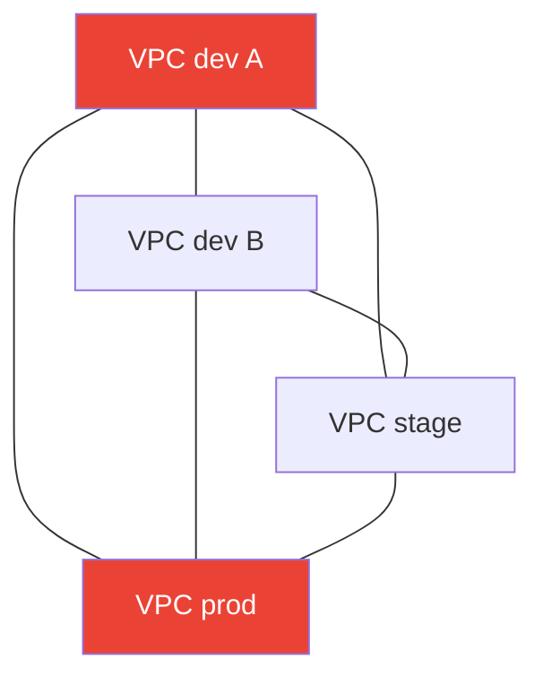
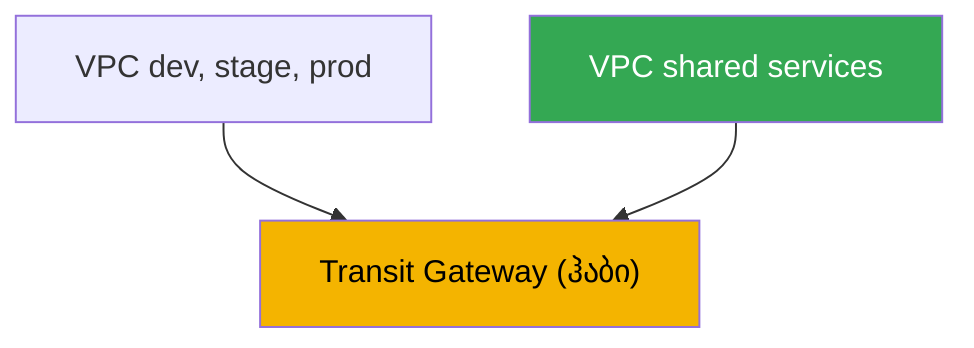
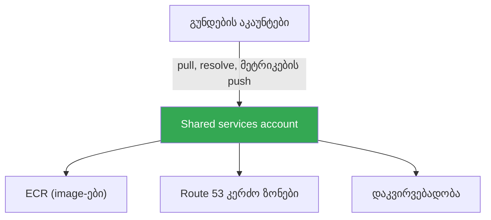

[Русская версия](ru.md) · [Eng version](en.md) · [Versión en español](es.md) · [Version française](fr.md) · [Deutsche Version](de.md) · [繁體中文版](tw.md) · [日本語版](jp.md)
# თავი 32. მულტიკლასტერი და მულტიაკაუნტი: კავშირი, საერთო რესურსები, შაბლონები

> **რა არის შემდეგ.** 26-31-ე თავებში განხილული იყო ტრაფიკი ერთი კლასტერის შიგნით: შემომავალი
> ტრაფიკი NLB-ისა და ALB-ის გავლით (თავები 26-27), Gateway API (თავი 28), DNS და სერტიფიკატები
> (თავი 29), NetworkPolicy (თავი 30), egress და მისი ღირებულება (თავი 31). აქ მასშტაბი უფრო დიდია:
> კავშირი რამდენიმე კლასტერსა და აკაუნტს შორის. სერვისების დონეზე კავშირი VPC Lattice-ისა და
> ServiceExport/ServiceImport-ის მეშვეობით დეტალურად განხილულია 28-ე თავში; egress, VPC endpoints
> და PrivateLink - 31-ე თავში; GitOps და კლასტერების პარკის მართვა (Argo CD, Flux) - 44-ე თავში;
> VPC-ის, subnet-ებისა და მარშრუტების საბაზისო მოწყობა - ნაწილ 0-ში (თავი 00-3). აქ მხოლოდ ერთ
> საკითხს განვიხილავთ: როგორ დავაკავშიროთ კლასტერები სხვადასხვა VPC-სა და აკაუნტში და რა უნდა
> გავაზიაროთ ცენტრალიზებულად.

## 32.1. „dev-კლასტერის სერვისს prod-აკაუნტის სერვისი სჭირდება, მაგრამ ქსელები ერთმანეთს ვერ ხედავენ“

ორგანიზაცია გაიზარდა. თავიდან ერთი კლასტერი იყო, შემდეგ რამდენიმე გახდა: ცალკე აკაუნტი dev-ისთვის,
stage-ისთვის, prod-ისთვის და კიდევ რამდენიმე აკაუნტი მეზობელი გუნდებისთვის. თითოეული კლასტერი საკუთარ
VPC-სა და აკაუნტშია: ასე უფრო უსაფრთხოა და ხარჯების დათვლაც უფრო მოსახერხებელია. შემდეგ ჩნდება კავშირის
პირველი ამოცანა: A გუნდის კლასტერში არსებულ სერვისს საერთო ავთენტიფიკაციის სერვისთან წვდომა სჭირდება,
რომელიც პლატფორმული გუნდის კლასტერში, სხვა აკაუნტში მუშაობს. ან stage-ში არსებულ აპლიკაციას shared-აკაუნტის
VPC-ში გაშვებულ მონაცემთა ბაზასთან დაკავშირება სჭირდება.

გულუბრყვილო გადაწყვეტა თავისთავად ჩნდება: ორი VPC peering-ით დავაკავშიროთ. ორისთვის მუშაობს. მაგრამ
კლასტერი უკვე ექვსია, მათ შორის ბევრი კავშირია საჭირო და სურათი სწრაფად რთულდება:

- **VPC peering არატრანზიტულია.** თუ VPC A დაწყვილებულია B-სთან, ხოლო B - C-სთან, A ვერ ხედავს C-ს
  B-ის გავლით. თითოეულ წყვილს, რომელსაც კავშირი სჭირდება, საკუთარი peering სჭირდება. N VPC-ის სრული
  გრაფისთვის საჭიროა დაახლოებით N კვადრატის რიგის კავშირები და ამდენივე მარშრუტებისა და security group-ის
  წესების ნაკრები.
- **CIDR-ები არ უნდა იკვეთებოდეს.** Peering მოითხოვს მისამართების არაგადამკვეთ დიაპაზონებს. თუ თითოეულმა
  გუნდმა საკუთარი VPC `10.0.0.0/16`-ის კოპირებით შექმნა, დიაპაზონები დაემთხვა და მათი პირდაპირ დაწყვილება
  უკვე შეუძლებელია, რადგან მარშრუტიზაცია არაერთმნიშვნელოვანი იქნება.
- **წესები მრავლდება.** თითოეული peering-ისთვის ორივე მხარის მარშრუტიზაციის ცხრილებში ჩანაწერები და
  security group-ში ნებართვის წესებია საჭირო. ექვსი VPC-ის სრული ქსელი ათობით ჩანაწერს ნიშნავს, რომლებიც
  ვიღაცამ ხელით უნდა მართოს და რომლებშიც შეცდომის დაშვება ადვილია.



ოთხი VPC-ის სრული ქსელი უკვე ექვს peering-ს ნიშნავს; ათ VPC-ს ორმოცდახუთი დასჭირდება. არც
ტრანზიტულობაა და არც მასშტაბი. ეს მხოლოდ ქსელს ეხება. ამას ემატება კითხვა, როგორ ავიცილოთ თავიდან,
რომ თითოეულ გუნდს საკუთარი ECR, DNS-ზონა და დაკვირვებადობის სტეკი ჰქონდეს. შემდეგ განვიხილავთ,
რატომ ნაწილდებიან საერთოდ სხვადასხვა აკაუნტში, peering-ის გარდა კავშირის რა ვარიანტები არსებობს, რა და
როგორ უნდა გაზიარდეს AWS RAM-ის მეშვეობით და რა შაბლონებით აწყობენ ამას production-ში.

## 32.2. საერთოდ რატომ არის საჭირო მულტიაკაუნტი

კავშირის გადაწყვეტამდე უნდა გავიგოთ, რატომ განაწილდა კლასტერები სხვადასხვა აკაუნტში. ეს შემთხვევითობა
კი არა, გააზრებული მიდგომაა. AWS რეკომენდაციას უწევს **AWS Organizations**-ის მართვის ქვეშ რამდენიმე
აკაუნტის გამოყენებას: ორგანიზაცია ქმნის ორგანიზაციული ერთეულებისგან (OU) შემდგარ იერარქიას, მათზე საერთო
შეზღუდვების (service control policies) გამოყენებისა და კონსოლიდირებული ბილინგის წარმოების საშუალებას
იძლევა.

გარემოებისა და გუნდების სხვადასხვა აკაუნტში განაწილების მიზეზებია:

- **Blast radius-ის იზოლაცია.** აკაუნტი AWS-ში ყველაზე მკაცრი საზღვარია. dev-აკაუნტში დაშვებული შეცდომა,
  კომპრომეტაცია ან კვოტის ამოწურვა prod-ს არ ეხება, რადგან ეს ფიზიკურად სხვადასხვა აკაუნტია განსხვავებული
  ლიმიტებითა და უფლებებით.
- **უსაფრთხოების საზღვრები.** IAM-ის უფლებები ნაგულისხმევად აკაუნტის საზღვარს არ კვეთს. სხვა აკაუნტზე
  წვდომა ცხადად უნდა გაიცეს როლებისა და cross-account trust-ის მეშვეობით. ეს მინიმალური პრივილეგიების
  მოსახერხებელი მოდელია: prod დახურულია იმ გუნდებისთვის, რომლებსაც ის არ სჭირდებათ.
- **ცალკე ბილინგი და აღრიცხვა.** თითოეული აკაუნტის ხარჯები კონსოლიდირებულ ანგარიშში ცალკე სტრიქონად
  ჩანს. თითოეული გუნდის ან გარემოსთვის ცალკე აკაუნტი ხარჯების დაყოფას რთული tagging-სქემების გარეშე
  უზრუნველყოფს.
- **კვოტები და ლიმიტები.** სერვისების ლიმიტები (VPC-ების, EIP-ების, instance-ების რაოდენობა) თითოეული
  აკაუნტისთვის ცალ-ცალკე ითვლება. სხვადასხვა აკაუნტში განაწილება გუნდებს შორის საერთო კვოტებისთვის
  კონკურენციას ხსნის.

ტიპური სტრუქტურა (landing zone-ის იდეა) ასეთია: ცალკე management-აკაუნტი მხოლოდ Organizations-ისა და
ბილინგისთვის, აკაუნტი საერთო სერვისებისთვის (shared services), აკაუნტები გარემოებისთვის (dev, stage, prod),
აკაუნტები გუნდებისა თუ პროდუქტებისთვის. AWS Control Tower-ის მსგავსი მზა სქემები ასეთ სტრუქტურას წინასწარ
გამართული OU-ებითა და პოლიტიკებით შლის. თავად სტრუქტურის მართვა ცალკე თემაა; ჩვენთვის მნიშვნელოვანია,
რომ EKS კლასტერები ამ აკაუნტებში მუშაობს და მათ შორის კავშირია საჭირო.

## 32.3. ქსელების დაკავშირების ვარიანტები

Peering ერთადერთი ვარიანტი არ არის და კლასტერების პარკისთვის, როგორც წესი, არც საუკეთესოა. განვიხილოთ
ოთხი ძირითადი მიდგომა, მარტივიდან მასშტაბირებადისკენ.

**VPC peering.** ორი VPC-ის პირდაპირი, ერთი-ერთთან კავშირი. მარტივია, იაფია (საფასური მხოლოდ ტრაფიკისთვის,
cross-AZ-ისა და cross-region-ისთვის) და დაბალი დაყოვნება აქვს. ნაკლოვანებები უკვე ჩამოვთვალეთ:
არატრანზიტულია, მოითხოვს არაგადამკვეთ CIDR-ებს და იზრდება როგორც N კვადრატში. კარგია რამდენიმე სტაბილური
წყვილისთვის, მაგრამ ცუდია მზარდი პარკის საფუძვლად.

**Transit Gateway.** რეგიონული ვირტუალური მარშრუტიზატორი, ანუ ჰაბი, რომელსაც VPC, VPN და Direct Connect
attachment-ებით უკავშირდება. Peering-ისგან მთავარი განსხვავება ისაა, რომ **მარშრუტიზაცია ტრანზიტულია**:
ერთ Transit Gateway-სთან დაკავშირებულ ყველა VPC-ს შეუძლია (თუ მარშრუტიზაციის ცხრილებით ნებადართულია)
ერთმანეთთან ჰაბის გავლით ურთიერთობა, წყვილ-წყვილად კავშირების შექმნის გარეშე. თითოეული VPC-სთვის ერთი
attachment, N-1 peering-ის ნაცვლად. Transit Gateway შეიძლება AWS RAM-ის მეშვეობით სხვა აკაუნტებს
გაუზიარდეს, ამიტომ ის მთელი ორგანიზაციის VPC-ებს ერთ მარშრუტიზებად ქსელში აერთიანებს. CIDR-ები კვლავ
არ უნდა იკვეთებოდეს, რადგან მარშრუტიზაცია IP-ის მიხედვით ხდება. საფასური: საათობრივი თითოეული
attachment-ისთვის და დამატებით დამუშავებული მონაცემებისთვის.

**VPC Lattice.** კავშირი არა ქსელის, არამედ სერვისების დონეზეა (თავი 28): სერვისი რეგისტრირდება service
network-ში, ხოლო ასოცირებული VPC-ის კლიენტი მას DNS-სახელით მიმართავს, მიუხედავად იმისა, რომელ VPC-ში,
კლასტერში ან აკაუნტში მუშაობს პოდი. Cross-account კავშირი AWS RAM-ის მეშვეობით იქმნება (ზიარდება
service network). მნიშვნელოვანი თვისება: კავშირი სერვისის გავლით ხდება და არა IP-მარშრუტიზაციით, ამიტომ
**CIDR-ების გადაკვეთა დაბრკოლება აღარ არის**: Lattice საერთო L3-დომენს არ ქმნის. შესაფერისია სერვისებს
შორის east-west ტრაფიკისთვის; პერიმეტრი და გარედან შემოსვლა კვლავ ALB-სა და NLB-ს ეკისრება.

**PrivateLink.** ერთ სერვისზე ცალმხრივი კერძო წვდომა (თავი 31): პროვაიდერი NLB-ის უკან endpoint service-ს
აქვეყნებს, მომხმარებელი კი interface endpoint-ს ქმნის. ტრაფიკი კერძოა, CIDR-ები შეიძლება იკვეთებოდეს
(კავშირი ENI-ის გავლით ხდება და არა მარშრუტით), მაგრამ კავშირი ცალმხრივია: ინიციატორი მომხმარებელია,
პროვაიდერი კი იღებს. კარგია, როდესაც სხვა აკაუნტისთვის ზუსტად ერთი სერვისის მიწოდებაა საჭირო და არა
ქსელების დაკავშირება.

| მიდგომა | მოდელი | ტრანზიტულობა | CIDR-ების გადაკვეთა | Cross-account | როდის |
|---|---|---|---|---|---|
| VPC peering | ქსელი, 1-ერთთან | არა | აკრძალულია | პირდაპირ | რამდენიმე სტაბილური წყვილი |
| Transit Gateway | ქსელი, ჰაბი | კი | აკრძალულია | RAM-ის მეშვეობით | VPC-ების პარკი, ერთიანი ქსელი |
| VPC Lattice | სერვისი | არ გამოიყენება | გვერდს უვლის | RAM-ის მეშვეობით | east-west სერვისებს შორის |
| PrivateLink | სერვისი, 1 endpoint | არ გამოიყენება | გვერდს უვლის | endpoint service | ერთი სერვისის მიწოდება |

ფენების მიხედვით დაყოფა მარტივია. თუ მრავალი VPC-სთვის საერთო მარშრუტიზებადი ქსელია საჭირო, გამოიყენეთ
Transit Gateway. თუ საჭიროა კონკრეტული სერვისების კავშირი კლასტერებსა და აკაუნტებს შორის, განსაკუთრებით
გადამკვეთი CIDR-ების შემთხვევაში, გამოიყენეთ VPC Lattice. თუ ერთი სერვისის ცალმხრივად მიწოდებაა საჭირო,
გამოიყენეთ PrivateLink. Peering წერტილოვანი წყვილებისთვის რჩება.

## 32.4. საერთო რესურსები AWS RAM-ის მეშვეობით

კავშირი ამოცანის ნახევარია. მეორე ნახევარია, რომ ყველა აკაუნტში ყველაფრის საკუთარი ასლი არ გვქონდეს.
**AWS Resource Access Manager (RAM)** მფლობელს საშუალებას აძლევს, რესურსი სხვა აკაუნტებს, OU-ს ან მთელ
ორგანიზაციას კოპირების გარეშე გაუზიაროს. მომხმარებელი რესურსთან ისე მუშაობს, თითქოს ის მის აკაუნტში იყოს,
მაგრამ მას კვლავ მფლობელი მართავს. EKS-ის კონტექსტში გასაზიარებლად სასარგებლოა:

| რესურსი | ვის უზიარდება | რისთვისაა საჭირო EKS-ში |
|---|---|---|
| Subnets (`ec2:Subnet`) | მხოლოდ ორგანიზაციის შიგნით | shared VPC: სხვადასხვა აკაუნტის ნოდები საერთო subnet-ებში |
| Transit gateways | ნებისმიერ აკაუნტს | VPC-ების პარკის ერთიანი მარშრუტიზაცია |
| VPC Lattice service network | ნებისმიერ აკაუნტს | კლასტერების სერვისების აკაუნტებს შორის კავშირი |
| Route 53 Resolver rules | ნებისმიერ აკაუნტს | DNS-მოთხოვნების საერთო forwarding |
| Prefix lists, IPAM pools | ნებისმიერ აკაუნტს | CIDR-ის ერთიანი დაგეგმვა, საერთო სიები |

**Shared VPC.** RAM-ის მეშვეობით ქსელური აკაუნტის მფლობელი subnets-ს აზიარებს, ორგანიზაციის სხვა
აკაუნტები კი მათში საკუთარ რესურსებს, მათ შორის EKS-ის ნოდებს უშვებენ. ქსელი ცენტრალიზებულია (VPC-ს,
მარშრუტებსა და NAT-ს ერთი გუნდი ფლობს), workload-ები კი გუნდების აკაუნტებში რჩება. გაითვალისწინეთ:
subnets მხოლოდ საკუთარი ორგანიზაციის შიგნით ზიარდება და არა მის გარეთ.

ყველაფერი RAM-ის მეშვეობით არ ზიარდება. ზოგ რესურსს საკუთარი cross-account მექანიზმი აქვს:

- **ცენტრალიზებული ECR.** ერთი აკაუნტი ინახავს image-ების registry-ს, დანარჩენები კი image-ებს იქიდან
  ქაჩავენ. Cross-account pull **repository policy**-ით იმართება (resource-based პოლიტიკა repository-ზე),
  რომელიც საჭირო მომხმარებელი აკაუნტებისთვის `ecr:BatchGetImage` და `ecr:GetDownloadUrlForLayer`
  მოქმედებებს რთავს, რასაც pulling მხარეს IAM-ის უფლებებიც ემატება. ეს თითოეულ აკაუნტში ცალკე ECR-ის
  საჭიროებას ხსნის და image-ების სკანირებისა და ხელმოწერის ერთიან წერტილს ქმნის (თავი 20).
- **საერთო Route 53 private hosted zone.** ერთი აკაუნტის კერძო ზონა შეიძლება სხვა აკაუნტის VPC-სთან
  ასოცირდეს, თუმცა არა RAM-ის, არამედ ორი API-გამოძახების მეშვეობით: ზონის მფლობელი ასრულებს
  `CreateVPCAssociationAuthorization`-ს, შემდეგ კი VPC-ის მფლობელი აკაუნტი იძახებს
  `AssociateVPCWithHostedZone`-ს. ამის შემდეგ ზონის სახელები ორივე VPC-ში resolve-დება. ასე ქმნიან
  ერთიან კერძო სახელთა სივრცეს სხვადასხვა აკაუნტის სერვისებისთვის.

საერთო ლოგიკა ასეთია: ქსელი, DNS-ის წესები და მისამართების სიები RAM-ის მეშვეობით ზიარდება, image-ები
ECR-ის repository policy-ით, კერძო ზონები კი association authorization-ის მეშვეობით. მფლობელობა და
მართვა ერთ აკაუნტთან რჩება, მომხმარებლები კი წვდომას ცხადად იღებენ.

## 32.5. კლასტერების კავშირი სერვისების დონეზე

ქსელების დაკავშირება იგივე არ არის, რაც ერთი კლასტერის სერვისისთვის მეორე კლასტერის სერვისზე წვდომის
მიცემა. საერთო ქსელის შემთხვევაშიც კი რჩება აღმოჩენის (რა სახელით უნდა მივმართოთ) და ავტორიზაციის
(ვის აქვს უფლება) საკითხები. არსებობს სამი მიდგომა.

**VPC Lattice ServiceExport/ServiceImport.** EKS-ში კლასტერებს შორის კავშირის სტანდარტული გზა (თავი 28).
AWS Gateway API Controller გვაძლევს `ServiceExport` და `ServiceImport` CRD-ებს: სერვისი წყარო კლასტერიდან
ექსპორტდება, მომხმარებელ კლასტერში იმპორტდება, რის შემდეგაც მას `HTTPRoute`-ში უთითებენ, მათ შორის
კლასტერებს შორის blue/green-ისთვის წონებით. აღმოჩენასა და ავტორიზაციას (IAM auth policies-ის მეშვეობით)
Lattice იღებს საკუთარ თავზე, CIDR-ების გადაკვეთა კი ხელს არ უშლის.

**Load balancer და DNS.** კლასიკური მიდგომა Lattice-ის გარეშე: წყარო კლასტერში სერვისი შიდა NLB-ის ან
ALB-ის გავლით ქვეყნდება (თავები 26-27), მისთვის DNS-ჩანაწერი იქმნება (external-dns, თავი 29), ხოლო სხვა
კლასტერის კლიენტი სახელით მიმართავს. ქსელები დაკავშირებული (Transit Gateway ან peering) და მარშრუტიზებადი
უნდა იყოს. მიდგომა მარტივი და გასაგებია, მაგრამ აღმოჩენასა და ავტორიზაციას თავად ქმნით.

**Service mesh cross-cluster.** Mesh-ებს (Istio, Cilium Cluster Mesh, Linkerd) რამდენიმე კლასტერის
სერვისების საერთო აღმოჩენით, mTLS-ითა და პოლიტიკებით დაკავშირება შეუძლია. ეს მძლავრი მიდგომაა, მაგრამ
EKS-ს საკუთარ control plane-სა და საოპერაციო სირთულეს ამატებს. ბევრი გუნდისთვის Lattice ან load balancer
DNS-თან ერთად ამოცანას უფრო მარტივად წყვეტს; mesh-ს მაშინ ირჩევენ, როდესაც უკვე არსებობს mTLS-ისა და
ტრაფიკის ერთიანი მართვის მოთხოვნები. აქ ამ საკითხს არ ჩავუღრმავდებით.

არჩევანი სიტუაციაზეა დამოკიდებული: თუ AWS-ის შიგნით კლასტერებს შორის სერვისების კავშირი ზედმეტი
ინფრასტრუქტურის გარეშე გჭირდებათ, გამოიყენეთ Lattice; თუ ქსელები უკვე დაკავშირებულია და სახელით მარტივი
მიმართვა საკმარისია, გამოიყენეთ load balancer და DNS; თუ mesh-ის მიმართ ჩამოყალიბებული მოთხოვნები გაქვთ,
განიხილეთ cluster mesh.

## 32.6. აწყობის შაბლონები

ჩამოთვლილი აგურებისგან განმეორებადი სქემები იქმნება. განვიხილოთ ძირითადი ვარიანტები.

**Hub-and-spoke Transit Gateway-ზე.** ცენტრალური ქსელური აკაუნტი Transit Gateway-ს ფლობს და მას RAM-ის
მეშვეობით აზიარებს. გუნდების VPC-ები (spokes) attachment-ებით უკავშირდება. აკაუნტებს შორის მთელი ტრაფიკი
ჰაბის გავლით გადის, მარშრუტიზაცია ტრანზიტულია, ხოლო ახალი VPC-ის დამატება ერთ attachment-ს ნიშნავს და
არა ყველა VPC-სთან peering-ის შექმნას.



**Shared services account.** საერთო რესურსებისთვის ცალკე აკაუნტი გამოიყენება: ცენტრალიზებული ECR,
Route 53-ის კერძო ზონები, დაკვირვებადობის სტეკი (მეტრიკები და ლოგები, თავები 33-34), ზოგჯერ საერთო
მონაცემთა ბაზები. გუნდები image-ებს მისი ECR-იდან repository policy-ის საფუძველზე ქაჩავენ, სახელებს მისი
კერძო ზონებიდან resolve-ებენ და მეტრიკებს მის Prometheus-ში აგზავნიან. ამგვარად დუბლირება ქრება და
კონტროლის ერთიანი წერტილები იქმნება.



**CIDR-ის დაგეგმვა.** ყველაფერი, რაც IP-მარშრუტიზაციას იყენებს (peering, Transit Gateway, shared VPC),
არაგადამკვეთ დიაპაზონებს მოითხოვს. ამიტომ CIDR-ები ცენტრალიზებულად ნაწილდება და არა კოპირებით: თითოეულ
აკაუნტსა და VPC-ს საკუთარი არაგადამკვეთი ბლოკი ეძლევა, ხშირად RAM-ის მეშვეობით გაზიარებული საერთო IPAM
pool-იდან. ეს VPC-ის შექმნამდე კეთდება, რადგან ქსელის მოგვიანებით გადანაწილება ძვირია. თუ გადაკვეთა უკვე
არსებობს და მისი გამოსწორება შეუძლებელია, სერვისების კავშირი Lattice-ით ან PrivateLink-ით იქმნება,
რომლებსაც საერთო L3-დომენი არ სჭირდება.

**პარკის მართვა.** როდესაც კლასტერი ბევრია, მათი კონფიგურაცია და აპლიკაციები თითოეულზე ხელით არ იშლება.
ამის ნაცვლად მთელი პარკისთვის ერთი ადგილიდან დეკლარაციულ GitOps-ს (Argo CD, Flux) იყენებენ. თემა სრულად
44-ე თავშია განხილული; აქ მხოლოდ ისაა მნიშვნელოვანი, რომ მულტიკლასტერი და GitOps ერთად გამოიყენება:
კავშირს ქსელი უზრუნველყოფს, კონფიგურაციის ერთგვაროვნებას კი GitOps.

## 32.7. როგორ იყენებენ ამას production-ში

- **აკაუნტებს გარემოებისა და გუნდების მიხედვით წინასწარ ანაწილებენ.** dev, stage, prod და საერთო სერვისები
  AWS Organizations-ის ქვეშ სხვადასხვა აკაუნტში თავსდება, რათა blast radius იზოლირებული იყოს და ხარჯების
  დათვლა გამარტივდეს.
- **VPC-ების პარკს Transit Gateway-ზე აწყობენ და არა peering-ებით.** RAM-ის მეშვეობით გაზიარებული ჰაბი
  ტრანზიტული მარშრუტიზაციით ცვლის peering-ების გრაფს, რომელიც N კვადრატის მსგავსად იზრდება.
- **CIDR-ებს პირველივე დღიდან ცენტრალიზებულად გეგმავენ.** თითოეული აკაუნტისა და VPC-სთვის არაგადამკვეთი
  ბლოკები გამოიყოფა, ხშირად საერთო IPAM pool-იდან; მოგვიანებით გადანაწილება მეტისმეტად ძვირია.
- **საერთო რესურსები shared services account-ში გააქვთ.** ცენტრალიზებული ECR (cross-account pull
  repository policy-ის საფუძველზე), Route 53-ის კერძო ზონები და დაკვირვებადობა ერთ წერტილშია, ასლების
  ნაცვლად.
- **გადამკვეთი CIDR-ების დროს სერვისების კავშირს VPC Lattice-ით ქმნიან.** მას საერთო L3-დომენი არ სჭირდება,
  cross-account კავშირი RAM-ის, ხოლო კლასტერებს შორის კავშირი ServiceExport/ServiceImport-ის მეშვეობით
  მუშაობს.
- **კლასტერების პარკს GitOps-ით მართავენ.** კონფიგურაცია და workload-ები ერთი ადგილიდან ყველა კლასტერზე
  დეკლარაციულად იშლება (თავი 44) და არა თითოეულზე ხელით.

## 32.8. მინი-ლექსიკონი

- **AWS Organizations** - რამდენიმე აკაუნტის მართვის სერვისი: OU-ების იერარქია, საერთო პოლიტიკები (SCP),
  კონსოლიდირებული ბილინგი.
- **landing zone** - წინასწარ გამართული მულტიაკაუნტური სტრუქტურა (management, shared services, გარემოები,
  გუნდები); მისი გაშლა AWS Control Tower-ის მეშვეობითაც შეიძლება.
- **VPC peering** - ორი VPC-ის პირდაპირი, ერთი-ერთთან კავშირი; არატრანზიტულია და არაგადამკვეთ CIDR-ებს
  მოითხოვს.
- **Transit Gateway** - რეგიონული მარშრუტიზატორი-ჰაბი, რომელიც დაკავშირებულ VPC-ებს, VPN-სა და Direct
  Connect-ს შორის ტრანზიტულ მარშრუტიზაციას უზრუნველყოფს; ზიარდება RAM-ის მეშვეობით.
- **AWS RAM (Resource Access Manager)** - რესურსების (subnets, Transit Gateway, VPC Lattice service
  network, Route 53 Resolver rules) სხვა აკაუნტებსა და ორგანიზაციასთან გაზიარების სერვისი.
- **shared VPC** - მოდელი, რომელშიც მფლობელი subnets-ს RAM-ის მეშვეობით აზიარებს, ხოლო სხვა აკაუნტები
  მათში საკუთარ რესურსებს, მათ შორის EKS-ის ნოდებს უშვებენ.
- **repository policy** - resource-based პოლიტიკა ECR-ის repository-ზე, რომელიც სხვა აკაუნტებს image-ების
  cross-account pull-ის უფლებას აძლევს.
- **hub-and-spoke** - ტოპოლოგია ცენტრალური Transit Gateway-ით (ჰაბი) და მასთან დაკავშირებული გუნდების
  VPC-ებით (spokes).
- **shared services account** - საერთო რესურსების (ECR, კერძო DNS-ზონები, დაკვირვებადობა) შემცველი აკაუნტი,
  რომლითაც დანარჩენი აკაუნტები სარგებლობენ.

## 32.9. თავის შეჯამება

- სხვადასხვა აკაუნტში მრავალი კლასტერის არსებობა ორ ამოცანას წარმოშობს: მათი ქსელების ან სერვისების
  დაკავშირებას და თითოეულ აკაუნტში საერთო რესურსების დუბლირების თავიდან აცილებას.
- VPC peering წყვილებისთვის მარტივია, მაგრამ არატრანზიტულია, არაგადამკვეთ CIDR-ებს მოითხოვს და N
  კვადრატის მსგავსად იზრდება, ამიტომ პარკის საფუძვლად არ გამოდგება.
- AWS Organizations-ის ქვეშ მულტიაკაუნტი blast radius-ის იზოლაციას, უსაფრთხოების საზღვრებს, ცალკე ბილინგსა
  და დამოუკიდებელ კვოტებს უზრუნველყოფს; ტიპურ სტრუქტურას landing zone განსაზღვრავს.
- Transit Gateway ტრანზიტული მარშრუტიზაციის მქონე ჰაბია, რომელიც VPC-ების პარკს ერთიან ქსელში აერთიანებს;
  RAM-ის მეშვეობით ზიარდება, თუმცა CIDR-ები კვლავ არ უნდა იკვეთებოდეს.
- VPC Lattice და PrivateLink სერვისების დონეზე აკავშირებს და CIDR-ების გადაკვეთის პრობლემას გვერდს უვლის:
  Lattice service network-ისა და RAM-ის მეშვეობით east-west კავშირს ქმნის, PrivateLink კი ერთი სერვისის
  ცალმხრივ მიწოდებას უზრუნველყოფს.
- AWS RAM აზიარებს subnets-ს (ორგანიზაციის შიგნით), Transit Gateway-ს, VPC Lattice service network-სა და
  Route 53 Resolver rules-ს; ECR repository policy-ით ზიარდება, კერძო ზონა კი association authorization-ით.
- EKS-ში სერვისების კლასტერებს შორის სტანდარტული კავშირი ServiceExport/ServiceImport-ის მეშვეობით იქმნება
  (თავი 28); ალტერნატივებია load balancer DNS-თან ერთად ან service mesh.
- ტიპური შაბლონებია: hub-and-spoke Transit Gateway-ზე, shared services account, CIDR-ის ცენტრალიზებული
  დაგეგმვა და პარკის GitOps-ით მართვა (თავი 44).

## 32.10. როგორ გამოგადგებათ ეს რეალურ სამუშაოში

მორიგეობისას მულტიაკაუნტური კავშირის პრობლემა ასე ვლინდება: „A სერვისი სხვა აკაუნტის B სერვისს ვერ
უკავშირდება“. დიაგნოსტიკა ფენების მიხედვით მიმდინარეობს: საერთოდ არსებობს თუ არა მარშრუტი (Transit
Gateway-სთან attachment, მარშრუტიზაციის ცხრილები, ხომ არ იკვეთება CIDR-ები), ატარებს თუ არა security group
და NACL, resolve-დება თუ არა სახელი (ასოცირებულია თუ არა კერძო ზონა ამ VPC-სთან), ხოლო თუ კავშირი
Lattice-ის მეშვეობითაა, ასოცირებულია თუ არა VPC service network-თან და ხომ არ ბლოკავს ტრაფიკს IAM auth
policy. იმის ცოდნა, თუ რომელი მექანიზმითაა კავშირი შექმნილი, საძიებო არეალს მაშინვე ავიწროებს.

დაგეგმვისას ძირითადი გადაწყვეტილებები წინასწარ და ერთხელ მიიღება: როგორ დაიყოს აკაუნტები, კავშირის რომელი
მექანიზმი შეირჩეს პარკისთვის (Transit Gateway თითქმის ყოველთვის გონივრული ნაგულისხმევი არჩევანია), როგორ
განაწილდეს არაგადამკვეთი CIDR-ები და რა გადავიდეს shared services-ში. CIDR-ში ან აკაუნტების სტრუქტურაში
დაშვებული შეცდომის მოგვიანებით გამოსწორება ძვირია, ამიტომ ეს გადაწყვეტილებები ქსელურ და პლატფორმულ
გუნდებთან აკაუნტებში პირველი კლასტერების გაჩენამდე უნდა განიხილოთ. შემდეგ მთელ პარკში ერთგვაროვნებას
GitOps ინარჩუნებს (თავი 44).

## 32.11. კითხვები თვითშემოწმებისთვის

1. რატომ მასშტაბირდება VPC peering ცუდად კლასტერებისა და აკაუნტების მზარდ პარკში?
2. რას ნიშნავს „VPC peering არატრანზიტულია“ და როგორ ვლინდება ეს სამ VPC-ზე?
3. რატომ უნდა განაწილდეს გარემოები და გუნდები სხვადასხვა აკაუნტში და რა ოთხ უპირატესობას იძლევა ეს?
4. რა არის AWS Organizations და რა როლს ასრულებს landing zone?
5. რით განსხვავდება Transit Gateway peering-ისგან მარშრუტიზაციისა და კავშირების რაოდენობის მხრივ?
6. მოითხოვს თუ არა Transit Gateway არაგადამკვეთ CIDR-ებს და როგორ უზიარებენ მას სხვა აკაუნტებს?
7. რატომ უვლის VPC Lattice და PrivateLink გვერდს CIDR-ების გადაკვეთის პრობლემას, Transit Gateway კი არა?
8. რომელი რესურსები ზიარდება AWS RAM-ის მეშვეობით და არსებობს თუ არა subnets-ისთვის ორგანიზაციის საზღვრის
   შეზღუდვა?
9. როგორ იმართება image-ების cross-account pull ცენტრალიზებული ECR-იდან?
10. როგორ გავხადოთ Route 53-ის კერძო ზონა სხვა აკაუნტის VPC-ში ხილული, თუ არა RAM-ის მეშვეობით?
11. რა გზებით აკავშირებენ სხვადასხვა კლასტერის სერვისებს და როდის რომელი მიდგომაა შესაფერისი?
12. რისგან შედგება hub-and-spoke შაბლონი და რა გააქვთ shared services account-ში?
13. რატომ გეგმავენ CIDR-ებს ცენტრალიზებულად VPC-ის შექმნამდე და არ ასწორებენ მოგვიანებით?

## პრაქტიკა

ამ თავს საკუთარი ლაბორატორია ჯერ არ აქვს, მაგრამ კავშირის მიმდინარე ტოპოლოგიის ნახვა რეალურ აკაუნტშია
მოსახერხებელი. ჯერ შეამოწმეთ, არსებობს თუ არა Transit Gateway და რომელი peering-ებია შექმნილი:

```bash
# აკაუნტში არსებული Transit Gateway და მათი მდგომარეობა
aws ec2 describe-transit-gateways \
  --query "TransitGateways[].{Id:TransitGatewayId,State:State,Owner:OwnerId}" --output table

# არსებული VPC peering და მათი CIDR-მხარეები
aws ec2 describe-vpc-peering-connections \
  --query "VpcPeeringConnections[].{Id:VpcPeeringConnectionId,Status:Status.Code}" \
  --output table
```

თუ peering ბევრი, Transit Gateway კი არ არის, ეს ჰაბზე გადასვლის კანდიდატია. შემდეგ ნახეთ, რა არის
გაზიარებული თქვენს აკაუნტთან ან თქვენი აკაუნტიდან AWS RAM-ის მეშვეობით:

```bash
# თქვენთვის და თქვენ მიერ გაზიარებული რესურსები (subnets, TGW, Lattice service network)
aws ram list-resources --resource-owner OTHER-ACCOUNTS --output table
aws ram list-resources --resource-owner SELF --output table
```

შეადარეთ შედეგი იმას, რაც კლასტერებს სჭირდება: გაზიარებულია თუ არა Transit Gateway, არსებობს თუ არა
საერთო subnets ან VPC Lattice service network. შემდეგ შეამოწმეთ თქვენი VPC-ების CIDR-ები გადაკვეთაზე
(`aws ec2 describe-vpcs --query "Vpcs[].CidrBlock"`): დამთხვევა მიუთითებს, რომ მათ შორის მარშრუტიზებადი
კავშირი შეუძლებელია და საჭიროა Lattice ან PrivateLink.

---
[სარჩევი](../README_GE.md) · [თავი 31](../31/ge.md) · [თავი 33](../33/ge.md)
