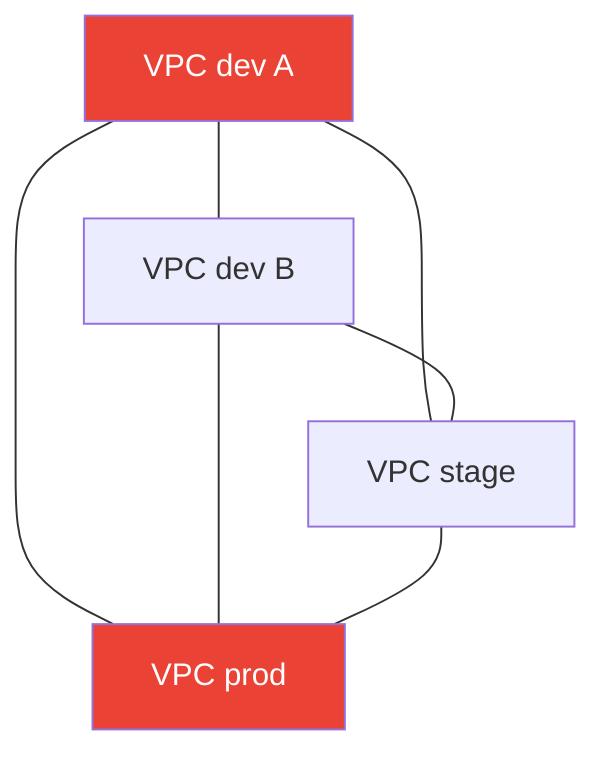
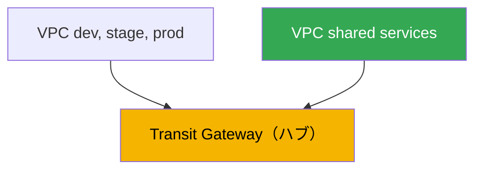
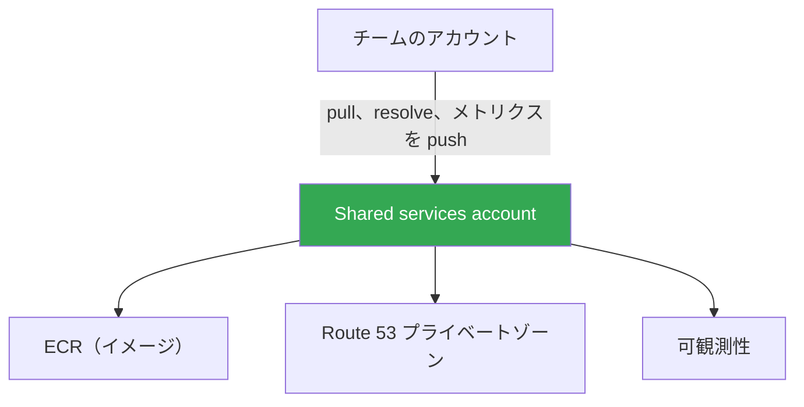

[Русская версия](ru.md) · [Eng version](en.md) · [Versión en español](es.md) · [Version française](fr.md) · [Deutsche Version](de.md) · [ქართული ვერსია](ge.md) · [繁體中文版](tw.md)
# 第32章. マルチクラスターとマルチアカウント: 接続性、共有リソース、パターン

> **次は何か。** 第26章から第31章では、単一クラスター内のトラフィックを扱いました。NLB と ALB による入口（第26-27章）、Gateway API（第28章）、DNS と証明書（第29章）、NetworkPolicy（第30章）、egress とそのコスト（第31章）です。ここでは規模を広げます。複数のクラスターとアカウントの間の接続性です。VPC Lattice および ServiceExport/ServiceImport によるサービスレベルの接続は第28章で、egress、VPC endpoints、PrivateLink は第31章で、GitOps とクラスター群の管理（Argo CD、Flux）は第44章で、VPC、サブネット、ルートの基本構成はパート0（第00-3章）で詳しく扱います。ここで扱うのは1点です。異なる VPC とアカウントにあるクラスターをどう接続し、何を中央で共有するかです。

## 32.1. 「dev クラスターのサービスが prod アカウントのサービスを必要としているが、ネットワーク同士が見えていない」

組織は成長しました。最初はクラスターが1つでしたが、その後いくつかに増えました。dev 用の別アカウント、stage 用、prod 用、さらに隣接チーム用のアカウントも数個あります。各クラスターは自身の VPC、自身のアカウントにあります。この方が安全で、コストも把握しやすいためです。そして最初の接続性の課題が発生します。チーム A のクラスター内のサービスが、別アカウントのプラットフォームチームのクラスターにある共通認証サービスを呼び出す必要があります。あるいは stage のアプリケーションが、shared アカウントの VPC で動作するデータベースに接続する必要があります。

素朴な解決策は明らかです。2つの VPC を peering で接続します。2つなら動作します。しかしクラスターはすでに6つあり、必要な接続は多く、状況はすぐに悪化します。

- **VPC peering は推移的ではない。** VPC A が B と、B が C と peering されていても、A は B 経由で C を見ることはできません。接続を必要とする各ペアには自身の peering が必要です。N 個の VPC からなる完全グラフでは、およそ N の2乗の接続と、同数のルートおよび security group ルールのセットが必要になります。
- **CIDR は重複してはならない。** Peering には重複しないアドレス範囲が必要です。ところが、各チームが `10.0.0.0/16` をコピー＆ペーストして VPC を作成すると、範囲が重複し、直接 peering できなくなります。ルーティングが曖昧になるためです。
- **ルールが増殖する。** 各 peering ごとに、両側のルートテーブルのエントリーと、許可する security group ルールが必要です。6つの VPC を完全メッシュにすると数十のエントリーになり、誰かが手作業で維持する必要があり、間違えやすくなります。



4つの VPC を完全メッシュにすると、すでに6つの peering が必要です。10の VPC では45必要になります。推移性もスケールもありません。しかもこれはネットワークの話だけです。各チームがそれぞれの ECR、DNS ゾーン、可観測性スタックを持たないようにする方法も残っています。ここから、なぜアカウントを分けるのか、peering 以外にどのような接続性の選択肢があるのか、AWS RAM を介して何をどう共有するのか、そして本番でどのようなパターンで構成するのかを扱います。

## 32.2. なぜマルチアカウントなのか

接続性を解決する前に、なぜクラスターがすでにアカウントに分かれているのかを理解する価値があります。これは偶然ではなく、意図的な手法です。AWS は **AWS Organizations** により管理された複数アカウントの使用を推奨しています。組織は organizational units（OU）の階層を定義し、共通の制限（service control policies）を適用し、統合請求を行えます。

環境とチームをアカウントに分ける理由:

- **blast radius の分離。** アカウントは AWS における最も強い境界です。dev アカウントのミス、侵害、クォータ枯渇は、異なる上限と権限を持つ物理的に別のアカウントであるため prod に影響しません。
- **セキュリティ境界。** IAM 権限はデフォルトではアカウント境界を越えません。別アカウントへのアクセスは、ロールと cross-account trust により明示的に付与する必要があります。これは最小権限の便利なモデルです。必要としないチームから prod を閉じられます。
- **個別の請求とコスト把握。** 各アカウントのコストは統合請求書で別々の行として表示されます。チームまたは環境ごとのアカウントにより、複雑なタグ付けの仕組みなしにコストをすぐ分類できます。
- **クォータと上限。** サービス上限（VPC、EIP、インスタンス数）はアカウントごとに計算されます。アカウント分離により、チーム間で共通クォータを奪い合うことがなくなります。

典型的な構造、すなわち landing zone の考え方では、Organizations と請求専用の management アカウント、共通サービス用のアカウント（shared services）、環境用アカウント（dev、stage、prod）、チームまたはプロダクト用アカウントを分けます。AWS Control Tower のような完成された仕組みは、事前設定済みの OU とポリシーを備えたこの構造を展開します。構造自体の管理は別のテーマです。ここで重要なのは、EKS クラスターがこれらのアカウントに存在し、相互の接続性を必要とすることです。

## 32.3. ネットワーク接続性の選択肢

Peering だけが選択肢ではなく、クラスター群にとっては通常最適でもありません。単純なものからスケーラブルなものまで、主な4つのアプローチを見ていきます。

**VPC peering。** 2つの VPC を1対1で直接接続します。シンプルで安価（料金はトラフィック、cross-AZ、cross-region のみ）、低レイテンシです。欠点はすでに挙げたとおりです。推移的ではなく、重複しない CIDR が必要で、N の2乗で増えます。安定した少数のペアには適していますが、成長するクラスター群の基盤には向きません。

**Transit Gateway。** VPC、VPN、Direct Connect が attachment で接続する、リージョンの仮想ルーター、すなわちハブです。Peering との重要な違いは、**ルーティングが推移的である**ことです。1つの Transit Gateway に接続されたすべての VPC は、ルートテーブルで許可されていれば、ペアごとの接続を作らずにハブを介して相互通信できます。VPC ごとに N-1 個の peering ではなく1つの attachment です。Transit Gateway は AWS RAM 経由で他のアカウントに共有できるため、組織全体の VPC を1つのルーティング可能なネットワークにまとめます。CIDR は依然として重複してはなりません。ルーティングは IP に基づくためです。料金は各 attachment の時間料金に加え、処理データ量です。

**VPC Lattice。** ネットワークレベルではなくサービスレベルの接続です（第28章）。サービスを service network に登録すると、関連付けられた VPC のクライアントは、Pod がどの VPC、クラスター、アカウントに存在するかにかかわらず DNS 名でアクセスします。Cross-account は AWS RAM を通じて行います（service network を共有します）。重要な特徴は、接続が IP のルーティングではなくサービスを経由することです。したがって、**CIDR の重複は問題ではなくなります**。Lattice は共通の L3 ドメインを構築しません。サービス間の east-west に適しており、境界と外部からの入口は ALB と NLB の役割です。

**PrivateLink。** 1つのサービスへの一方向のプライベートアクセスです（第31章）。プロバイダーは NLB の背後で endpoint service を公開し、コンシューマーは interface endpoint を作成します。トラフィックはプライベートで、CIDR は重複可能です（ルートではなく ENI 経由の接続）。ただし接続は一方向です。コンシューマーが開始し、プロバイダーが受け入れます。ネットワークを接続するのではなく、別アカウントにちょうど1つのサービスを公開する場合に適しています。

| アプローチ | モデル | 推移性 | CIDR の重複 | Cross-account | 用途 |
|---|---|---|---|---|---|
| VPC peering | ネットワーク、1対1 | なし | 不可 | 直接 | 安定した少数のペア |
| Transit Gateway | ネットワーク、ハブ | あり | 不可 | RAM 経由 | VPC 群、単一ネットワーク |
| VPC Lattice | サービス | 該当なし | 回避可能 | RAM 経由 | サービス間 east-west |
| PrivateLink | サービス、1 endpoint | 該当なし | 回避可能 | endpoint service | 1つのサービスを公開 |

レイヤーごとの分け方は単純です。多くの VPC に共通のルーティング可能なネットワークが必要なら Transit Gateway です。特に CIDR が重複する場合に、クラスターとアカウント間の特定サービスを接続するなら VPC Lattice です。1つのサービスを外部へ一方向に公開するなら PrivateLink です。Peering は限定的なペアに残ります。

## 32.4. AWS RAM による共有リソース

接続性は課題の半分です。残り半分は、各アカウントにすべてのコピーを持たないことです。**AWS Resource Access Manager（RAM）** により、所有者はリソースをコピーせずに他のアカウント、OU、または組織全体に共有できます。コンシューマーはそのリソースを自身のもののように利用しますが、引き続き所有者が管理します。EKS の文脈で共有に役立つものは次のとおりです。

| リソース | 共有先 | EKS での用途 |
|---|---|---|
| Subnets (`ec2:Subnet`) | 組織内のみ | shared VPC: 異なるアカウントのノードを共通サブネットに配置 |
| Transit gateways | 任意のアカウント | VPC 群の統一ルーティング |
| VPC Lattice service network | 任意のアカウント | クラスターサービスのアカウント間接続 |
| Route 53 Resolver rules | 任意のアカウント | DNS クエリ転送の共有 |
| Prefix lists, IPAM pools | 任意のアカウント | 統一した CIDR 計画、共有リスト |

**Shared VPC。** ネットワークアカウントの所有者は RAM を介して subnets を共有し、組織内の他のアカウントはそこに EKS ノードを含む自身のリソースを起動します。ネットワークは中央管理されます（1つのチームが VPC、ルート、NAT を所有します）が、ワークロードはチームのアカウントにあります。注意してください。subnets は自身の組織内にのみ共有でき、外部には共有できません。

すべてが RAM 経由で共有されるわけではありません。一部のリソースには独自の cross-account の仕組みがあります。

- **中央集約 ECR。** 1つのアカウントがイメージレジストリを保持し、他のアカウントはそこから pull します。Cross-account pull は、必要なコンシューマーアカウントに対し `ecr:BatchGetImage` と `ecr:GetDownloadUrlForLayer` アクションを指定した **repository policy**、および pull 側の IAM 権限によって設定します。これにより各アカウントごとの ECR をなくし、イメージスキャンと署名の単一の制御点を得られます（第20章）。
- **共有 Route 53 private hosted zone。** 1つのアカウントのプライベートゾーンは、別アカウントの VPC と関連付けられます。ただし RAM ではなく、一対の API 呼び出しを使います。ゾーンの所有者が `CreateVPCAssociationAuthorization` を実行し、VPC の所有アカウントが `AssociateVPCWithHostedZone` を実行します。この後、ゾーンの名前は両方の VPC で解決されます。この方法で、異なるアカウントのサービスに対する統一されたプライベート名前空間を作ります。

共通する考え方は次のとおりです。ネットワーク、DNS ルール、アドレスリストは RAM を介して共有し、イメージは ECR repository policy を介して、プライベートゾーンは association authorization を介して共有します。所有権と管理は1つのアカウントに残り、コンシューマーには明示的にアクセスが与えられます。

## 32.5. サービスレベルでのクラスター接続性

ネットワークを接続することと、一方のクラスターのサービスが他方のクラスターのサービスにアクセスできるようにすることは同じではありません。共通ネットワークの上でも、検出（どの名前で呼ぶか）と認可（誰に許可するか）の問題が残ります。3つのアプローチがあります。

**VPC Lattice ServiceExport/ServiceImport。** EKS における標準のクロスクラスター接続方法です（第28章）。AWS Gateway API Controller は `ServiceExport` と `ServiceImport` CRD を提供します。ソースクラスターからサービスを export し、コンシューマークラスターに import すると、`HTTPRoute` から参照できます。クラスター間の blue/green における重み付けも含まれます。検出と認可（IAM auth policies 経由）は Lattice が担い、CIDR の重複は妨げになりません。

**ロードバランサーと DNS。** Lattice を使わない古典的な方法です。ソースクラスターのサービスを内部 NLB または ALB（第26-27章）で公開し、DNS レコードを設定し（external-dns、第29章）、別クラスターのクライアントが名前でアクセスします。ネットワークは接続され、ルーティング可能である必要があります（Transit Gateway または peering）。シンプルで理解しやすい一方、検出と認可は自分で構築します。

**Service mesh cross-cluster。** Mesh（Istio、Cilium Cluster Mesh、Linkerd）は、共通の検出、mTLS、ポリシーを用いて複数クラスターのサービスを接続できます。強力ですが、EKS に加えて自身の control plane と運用上の複雑さが増します。多くのチームでは Lattice または DNS を伴うロードバランサーでより単純に要件を満たせます。すでに mTLS と統一トラフィック管理が求められているときに mesh を選びます。ここではこれ以上掘り下げません。

状況に応じた選択は次のとおりです。余計なインフラなしに AWS 内でサービスのクロスクラスター接続が必要なら Lattice、ネットワークがすでに接続され名前での単純なアクセスで十分ならロードバランサーと DNS、成熟した mesh の要件があるなら cluster mesh を検討します。

## 32.6. 構成パターン

挙げた部品から、繰り返し現れる構成が作られます。主なものを見ていきます。

**Transit Gateway の hub-and-spoke。** 中央のネットワークアカウントが Transit Gateway を保持し、RAM 経由で共有します。チームの VPC（spokes）は attachment で接続します。すべてのアカウント間トラフィックはハブを通り、ルーティングは推移的です。新しい VPC の追加は、すべてに peering を作るのではなく1つの attachment です。



**Shared services account。** 共通のための専用アカウントです。中央集約 ECR、Route 53 プライベートゾーン、可観測性スタック（メトリクスとログ、第33-34章）、場合によっては共通データベースを置きます。チームは repository policy によりその ECR からイメージを pull し、そのプライベートゾーンから名前を解決し、その Prometheus にメトリクスを送信します。これにより重複をなくし、統一された制御点を得ます。



**CIDR 計画。** IP ルーティングを使用するすべてのもの（peering、Transit Gateway、shared VPC）には、重複しない範囲が必要です。そのため CIDR はコピー＆ペーストではなく中央で割り当てます。各アカウントと VPC に自身の重複しないブロックを割り当て、多くの場合 RAM で共有した共通 IPAM pool を通じて行います。これは VPC を作成する前に行います。後からネットワークを再分割するのは高コストです。すでに重複があり修正できない場合は、共通の L3 ドメインを必要としない Lattice または PrivateLink を通じてサービス接続を構築します。

**クラスター群の管理。** クラスターが多い場合、設定とアプリケーションを各クラスターに手作業で展開しません。GitOps（Argo CD、Flux）を通じて1か所からクラスター群全体へ宣言的に行います。これは第44章で完全に扱います。ここで重要なのは、マルチクラスターと GitOps が対になることです。接続性がネットワークを提供し、GitOps が設定の一貫性を提供します。

## 32.7. 本番での適用方法

- **環境とチームは事前にアカウントへ分離する。** dev、stage、prod、共通サービスを AWS Organizations 配下の別アカウントに置き、blast radius を分離してコストを把握します。
- **VPC 群は peering ではなく Transit Gateway で構成する。** N の2乗で増える peering グラフの代わりに、RAM で共有した推移的ルーティングのハブを使います。
- **CIDR は初日から中央で計画する。** アカウントと VPC ごとに重複しないブロックを、しばしば共通 IPAM pool から割り当てます。後からの再分割は高コストです。
- **共通のものは shared services account に置く。** 中央集約 ECR（repository policy による cross-account pull）、Route 53 プライベートゾーン、可観測性を置き、コピーではなく単一の制御点にします。
- **CIDR が重複する場合のサービス接続は VPC Lattice で構築する。** 共通の L3 ドメインを必要とせず、cross-account は RAM を通じて、クロスクラスターは ServiceExport/ServiceImport を通じて行います。
- **クラスター群は GitOps で管理する。** 設定とワークロードを各クラスターに手作業で行うのではなく、1か所からすべてのクラスターへ宣言的に展開します（第44章）。

## 32.8. ミニ用語集

- **AWS Organizations**: 複数アカウントを管理するサービス。OU の階層、共通ポリシー（SCP）、統合請求を提供します。
- **landing zone**: 事前設定済みのマルチアカウント構造（management、shared services、環境、チーム）。AWS Control Tower などを通じても展開されます。
- **VPC peering**: 2つの VPC を1対1で直接接続するもの。推移的ではなく、重複しない CIDR が必要です。
- **Transit Gateway**: 接続された VPC、VPN、Direct Connect 間を推移的にルーティングするリージョンのルーターハブ。RAM 経由で共有できます。
- **AWS RAM（Resource Access Manager）**: リソース（subnets、Transit Gateway、VPC Lattice service network、Route 53 Resolver rules）を他のアカウントおよび組織に共有するサービスです。
- **shared VPC**: 所有者が RAM 経由で subnets を共有し、他アカウントが EKS ノードを含む自身のリソースをそこで起動するモデルです。
- **repository policy**: 他のアカウントによるイメージの cross-account pull を許可する、ECR リポジトリ上の resource-based ポリシーです。
- **hub-and-spoke**: 中央の Transit Gateway（ハブ）と、そこに接続されたチーム VPC（spokes）によるトポロジーです。
- **shared services account**: 他のアカウントが使用する共通リソース（ECR、DNS プライベートゾーン、可観測性）を持つアカウントです。

## 32.9. 章のまとめ

- 異なるアカウントに多数のクラスターが増えると、ネットワークまたはサービスを接続することと、各アカウントで共通リソースを重複させないことの2つが課題になります。
- VPC peering はペアには簡単ですが、推移的ではなく、重複しない CIDR が必要で、N の2乗で増えるため、クラスター群の基盤には向きません。
- AWS Organizations 配下のマルチアカウントは blast radius の分離、セキュリティ境界、個別請求、独立したクォータを提供します。典型的な構造は landing zone が定めます。
- Transit Gateway は推移的ルーティングを持つハブで、VPC 群を単一ネットワークにまとめます。RAM 経由で共有できますが、CIDR は引き続き重複してはなりません。
- VPC Lattice と PrivateLink はサービスレベルで接続し、CIDR の重複を回避します。Lattice は service network と RAM を介した east-west、PrivateLink は1つのサービスの一方向の公開です。
- AWS RAM は subnets（組織内）、Transit Gateway、VPC Lattice service network、Route 53 Resolver rules を共有します。ECR は repository policy で、プライベートゾーンは association authorization で公開します。
- EKS のクロスクラスターサービス接続は、標準では ServiceExport/ServiceImport（第28章）で構築します。代替は DNS を伴うロードバランサーまたは service mesh です。
- 典型的なパターンは、Transit Gateway の hub-and-spoke、shared services account、中央集約した CIDR 計画、GitOps によるクラスター群の管理（第44章）です。

## 32.10. 実務での役立ち方

オンコールでは、マルチアカウントの接続性は「サービス A が別アカウントのサービス B に到達できない」として現れます。調査はレイヤーごとに進めます。ルートがそもそも存在するか（Transit Gateway への attachment、ルートテーブル、CIDR が重複していないか）、security group と NACL が通しているか、名前が解決されるか（プライベートゾーンがその VPC に関連付けられているか）、Lattice 経由なら VPC が service network に関連付けられているか、IAM auth policy がトラフィックを拒否していないかを確認します。どの仕組みで接続されているかを知っていれば、調査範囲をすぐに狭められます。

計画時には、重要な決定を事前に一度だけ行います。アカウントをどう分けるか、クラスター群にどの接続方式を使うか（Transit Gateway はほとんどの場合で妥当なデフォルトです）、重複しない CIDR をどう配布するか、何を shared services に移すかです。CIDR やアカウント構造の間違いを後から修正するのは高コストであるため、最初のクラスターがアカウントに現れる前に、ネットワークチームおよびプラットフォームチームとこれらの決定を話し合うべきです。その後、クラスター群全体の一貫性を GitOps（第44章）が維持します。

## 32.11. 自己確認の質問

1. VPC peering が成長するクラスターおよびアカウント群でスケールしにくいのはなぜですか。
2. 「VPC peering は推移的ではない」とは何を意味し、3つの VPC ではどのように現れますか。
3. 環境とチームを別々のアカウントに分ける理由と、それによる4つの利点は何ですか。
4. AWS Organizations とは何であり、landing zone はどのような役割を果たしますか。
5. Transit Gateway はルーティングと接続数において peering とどう異なりますか。
6. Transit Gateway には重複しない CIDR が必要ですか。また他アカウントにはどう提供しますか。
7. VPC Lattice と PrivateLink は CIDR 重複の問題を回避できるのに、Transit Gateway はできないのはなぜですか。
8. AWS RAM を介してどのリソースを共有しますか。subnets に組織境界の制限はありますか。
9. 中央集約 ECR からのイメージの cross-account pull はどのように設定しますか。
10. RAM を使わずに、Route 53 のプライベートゾーンを別アカウントの VPC で見えるようにするにはどうしますか。
11. 異なるクラスターのサービスはどのような方法で接続し、どのような場合に各方法が適していますか。
12. hub-and-spoke パターンは何から構成され、何を shared services account に置きますか。
13. CIDR を後から修正せず、VPC 作成前に中央で計画するのはなぜですか。

## 実践

この章にはまだ専用のラボはありませんが、現在の接続トポロジーは稼働中のアカウントで確認できます。まず、Transit Gateway が存在するか、どの peering が設定されているかを確認します。

```bash
# アカウント内の Transit Gateway とその状態
aws ec2 describe-transit-gateways \
  --query "TransitGateways[].{Id:TransitGatewayId,State:State,Owner:OwnerId}" --output table

# 既存の VPC peering とその CIDR 側
aws ec2 describe-vpc-peering-connections \
  --query "VpcPeeringConnections[].{Id:VpcPeeringConnectionId,Status:Status.Code}" \
  --output table
```

Peering が多く Transit Gateway がない場合は、ハブへの移行候補です。次に、AWS RAM によってアカウントに共有されている、またはアカウントから共有しているものを確認します。

```bash
# 自分に共有されたリソースと自分が共有したリソース（subnets、TGW、Lattice service network）
aws ram list-resources --resource-owner OTHER-ACCOUNTS --output table
aws ram list-resources --resource-owner SELF --output table
```

出力をクラスターに必要なものと照合します。Transit Gateway は共有されているか、共通 subnets または VPC Lattice の service network はあるかを確認します。次に自身の VPC の CIDR に重複がないか確認します（`aws ec2 describe-vpcs --query "Vpcs[].CidrBlock"`）。重複した範囲は、それらの間でルーティング可能な接続が不可能であり、Lattice または PrivateLink が必要であることを示します。

---
[目次](../README_JP.md) · [第31章](../31/jp.md) · [第33章](../33/jp.md)
