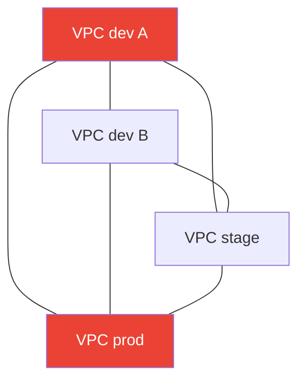
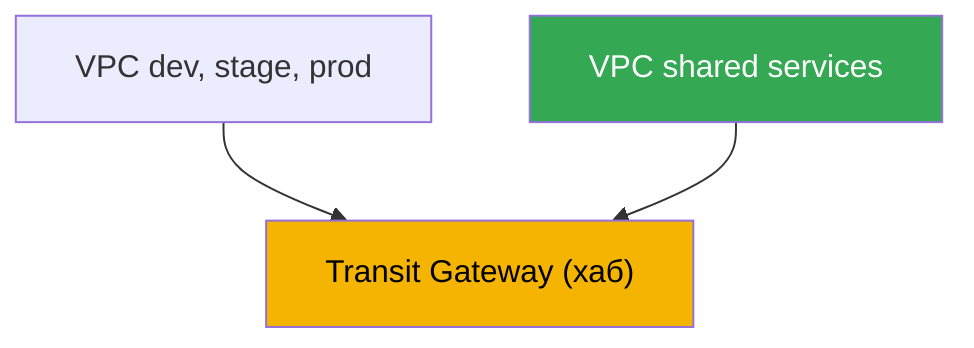
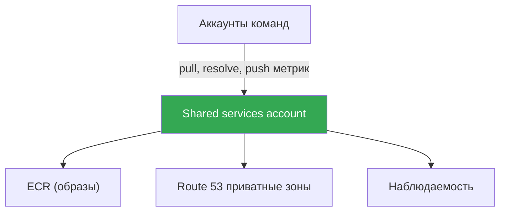

[Eng version](en.md) · [Versión en español](es.md) · [Version française](fr.md) · [Deutsche Version](de.md) · [ქართული ვერსია](ge.md) · [繁體中文版](tw.md) · [日本語版](jp.md)
# Глава 32. Мультикластер и мультиаккаунт: связность, общие ресурсы, шаблоны

> **Что дальше.** Главы 26-31 разбирали трафик внутри одного кластера: вход через NLB и ALB
> (главы 26-27), Gateway API (глава 28), DNS и сертификаты (глава 29), NetworkPolicy (глава
> 30), egress и его стоимость (глава 31). Здесь масштаб больше - связность между несколькими
> кластерами и аккаунтами. Связь на уровне сервисов через VPC Lattice и
> ServiceExport/ServiceImport подробно в главе 28; egress, VPC endpoints и PrivateLink - в
> главе 31; GitOps и управление парком кластеров (Argo CD, Flux) - в главе 44; базовое
> устройство VPC, подсетей и маршрутов - в Части 0 (глава 00-3). Здесь одно: как соединить
> кластеры в разных VPC и аккаунтах и что при этом делить централизованно.

## 32.1. «Сервису из dev-кластера нужен сервис в prod-аккаунте, а сети не видят друг друга»

Организация выросла. Сначала был один кластер, потом их стало несколько: отдельный аккаунт
под dev, под stage, под prod, ещё пара аккаунтов у соседних команд. Каждый кластер в своём
VPC, в своём аккаунте - так безопаснее и удобнее считать деньги. И вот приходит первая задача
на связность: сервису в кластере команды A нужно ходить в общий сервис аутентификации,
который живёт в кластере платформенной команды в другом аккаунте. Или приложению в stage надо
достучаться до базы, которая крутится в VPC shared-аккаунта.

Наивное решение напрашивается само: свести два VPC пирингом. Работает - для двух. Но кластеров
уже шесть, а связей между ними хочется много, и картина портится быстро:

- **VPC peering не транзитивен.** Если VPC A спарен с B, а B с C, то A не видит C через B.
  Каждая пара, которой нужна связь, требует своего пиринга. Для полного графа из N VPC это
  порядка N в квадрате соединений и столько же наборов маршрутов и правил security group.
- **CIDR не должны пересекаться.** Пиринг требует непересекающихся диапазонов адресов. А когда
  каждая команда заводила свой VPC из копипасты `10.0.0.0/16`, диапазоны совпали - и спарить
  их напрямую уже нельзя, маршрутизация неоднозначна.
- **Правила плодятся.** На каждый пиринг - записи в таблицах маршрутизации обеих сторон и
  разрешающие правила в security group. Шесть VPC полной сеткой - это десятки записей, которые
  кто-то поддерживает руками и в которых легко ошибиться.



Четыре VPC полной сеткой - это уже шесть пирингов; десять VPC потребуют сорок пять. Ни
транзитивности, ни масштаба. И это только про сеть - остаётся ещё вопрос, как командам не
держать по своему ECR, своей зоне DNS и своему стеку наблюдаемости. Дальше разберём, зачем
вообще расходятся по аккаунтам, какие есть варианты связности кроме пиринга, что и как делить
через AWS RAM и какими шаблонами это собирают в продакшене.

## 32.2. Зачем вообще мультиаккаунт

Прежде чем решать связность, стоит понять, почему кластеры и так разъехались по аккаунтам -
это не случайность, а осознанный приём. AWS рекомендует использовать несколько аккаунтов под
управлением **AWS Organizations**: организация задаёт иерархию из организационных единиц (OU)
и позволяет применять к ним общие ограничения (service control policies) и вести
консолидированный биллинг.

Причины разносить среды и команды по аккаунтам:

- **Изоляция blast radius.** Аккаунт - самая жёсткая граница в AWS. Ошибка, компрометация или
  исчерпание квоты в dev-аккаунте не задевают prod, потому что это физически разные аккаунты
  с разными лимитами и правами.
- **Границы безопасности.** IAM-права по умолчанию не пересекают границу аккаунта. Доступ в
  чужой аккаунт нужно выдавать явно - через роли и cross-account trust. Это удобная модель
  наименьших привилегий: prod закрыт от команд, которым он не нужен.
- **Отдельный биллинг и учёт.** Затраты каждого аккаунта видны отдельной строкой в
  консолидированном счёте. Аккаунт на команду или среду сразу даёт разбивку расходов без
  сложных схем тегирования.
- **Квоты и лимиты.** Лимиты сервисов (число VPC, EIP, инстансов) считаются на аккаунт.
  Разъезд по аккаунтам снимает конкуренцию за общие квоты между командами.

Типовая структура (идея landing zone): отдельный management-аккаунт только под Organizations и
биллинг, аккаунт под общие сервисы (shared services), аккаунты под среды (dev, stage, prod),
аккаунты под команды или продукты. Готовые схемы вроде AWS Control Tower разворачивают такую
структуру с преднастроенными OU и политиками. Управление самой структурой - тема отдельная;
для нас важно, что кластеры EKS живут в этих аккаунтах, и им нужна связность между собой.

## 32.3. Варианты связности сетей

Пиринг - не единственный вариант, и для парка кластеров обычно не лучший. Разложим четыре
основных подхода, от простого к масштабируемому.

**VPC peering.** Прямое соединение двух VPC один-к-одному. Простое, дешёвое (плата только за
трафик, cross-AZ и cross-region), низкая задержка. Минусы уже перечислены: не транзитивен,
требует непересекающихся CIDR, растёт как N в квадрате. Хорош для нескольких стабильных пар,
плох как основа для растущего парка.

**Transit Gateway.** Региональный виртуальный маршрутизатор - хаб, к которому VPC, VPN и
Direct Connect подключаются attachment'ами. Ключевое отличие от пиринга: **маршрутизация
транзитивна** - все подключённые к одному Transit Gateway VPC могут (если разрешено таблицами
маршрутизации) общаться между собой через хаб, не заводя связи попарно. Один attachment на VPC
вместо N-1 пирингов. Transit Gateway можно расшарить в другие аккаунты через AWS RAM, поэтому
он собирает VPC всей организации в одну маршрутизируемую сеть. CIDR по-прежнему не должны
пересекаться - маршрутизация идёт по IP. Плата: почасовая за каждый attachment плюс за
обработанные данные.

**VPC Lattice.** Связь не на уровне сети, а на уровне сервисов (глава 28): сервис
регистрируется в service network, клиент из ассоциированного VPC обращается к нему по DNS-имени
независимо от того, в каком VPC, кластере или аккаунте живут поды. Cross-account - через AWS
RAM (шарят service network). Важное свойство: связь идёт через сервис, а не через
маршрутизацию IP, поэтому **пересечение CIDR перестаёт мешать** - Lattice не строит общий
L3-домен. Подходит для east-west между сервисами; периметр и вход снаружи остаются за ALB и
NLB.

**PrivateLink.** Односторонний приватный доступ к одному сервису (глава 31): провайдер
публикует endpoint service за NLB, потребитель создаёт interface endpoint. Трафик приватный,
CIDR могут пересекаться (связь через ENI, не маршрут), но связь однонаправленная - потребитель
инициирует, провайдер принимает. Хорош, когда нужно отдать ровно один сервис в другой аккаунт,
а не связывать сети.

| Подход | Модель | Транзитивность | Пересечение CIDR | Cross-account | Когда |
|---|---|---|---|---|---|
| VPC peering | сеть, 1-к-1 | нет | запрещено | напрямую | несколько стабильных пар |
| Transit Gateway | сеть, хаб | да | запрещено | через RAM | парк VPC, единая сеть |
| VPC Lattice | сервис | н/д | обходится | через RAM | east-west между сервисами |
| PrivateLink | сервис, 1 endpoint | н/д | обходится | endpoint service | отдать один сервис |

Разбивка по слоям простая. Нужна общая маршрутизируемая сеть для многих VPC - Transit Gateway.
Нужна связь конкретных сервисов между кластерами и аккаунтами, особенно при пересекающихся
CIDR - VPC Lattice. Нужно отдать один сервис наружу односторонне - PrivateLink. Пиринг остаётся
для точечных пар.

## 32.4. Общие ресурсы через AWS RAM

Связность - половина задачи. Вторая половина: не держать в каждом аккаунте свою копию всего.
**AWS Resource Access Manager (RAM)** позволяет владельцу расшарить ресурс другим аккаунтам,
OU или всей организации, не копируя его. Потребитель работает с ресурсом так, будто он у него,
но управляет им по-прежнему владелец. Что полезно делить в контексте EKS:

| Ресурс | Кому шарится | Зачем в EKS |
|---|---|---|
| Subnets (`ec2:Subnet`) | только внутри организации | shared VPC: ноды разных аккаунтов в общих подсетях |
| Transit gateways | любой аккаунт | единая маршрутизация парка VPC |
| VPC Lattice service network | любой аккаунт | межаккаунтная связь сервисов кластеров |
| Route 53 Resolver rules | любой аккаунт | общий forwarding DNS-запросов |
| Prefix lists, IPAM pools | любой аккаунт | единое CIDR-планирование, общие списки |

**Shared VPC.** Через RAM владелец сетевого аккаунта шарит subnets, а другие аккаунты
организации запускают в них свои ресурсы, включая ноды EKS. Сеть централизована (одна команда
владеет VPC, маршрутами, NAT), а рабочие нагрузки - в аккаунтах команд. Обратите внимание:
subnets шарятся только внутри своей организации, не наружу.

Не всё делится через RAM - у некоторых ресурсов свой механизм cross-account:

- **Централизованный ECR.** Один аккаунт держит реестр образов, остальные тянут из него.
  Cross-account pull настраивается **repository policy** (resource-based политика на
  репозитории) с действиями `ecr:BatchGetImage` и `ecr:GetDownloadUrlForLayer` для нужных
  аккаунтов-потребителей, плюс IAM-права на стороне тянущего. Это убирает по своему ECR в
  каждом аккаунте и даёт единую точку сканирования и подписи образов (глава 20).
- **Общий Route 53 private hosted zone.** Приватную зону из одного аккаунта можно
  ассоциировать с VPC другого аккаунта - но не через RAM, а парой API-вызовов: владелец зоны
  делает `CreateVPCAssociationAuthorization`, затем аккаунт-владелец VPC вызывает
  `AssociateVPCWithHostedZone`. После этого имена из зоны резолвятся в обоих VPC. Так делают
  единое приватное пространство имён для сервисов разных аккаунтов.

Общая логика: сеть, DNS-правила и списки адресов делят через RAM, образы - через политику
репозитория ECR, приватные зоны - через association authorization. Владение и управление
остаются у одного аккаунта, потребители получают доступ явно.

## 32.5. Связность кластеров на уровне сервисов

Соединить сети - не то же самое, что дать сервису в одном кластере ходить к сервису в другом.
Даже поверх общей сети остаётся вопрос обнаружения (по какому имени звать) и авторизации (кому
можно). Есть три подхода.

**VPC Lattice ServiceExport/ServiceImport.** Штатный для EKS способ кросс-кластерной связи
(глава 28). AWS Gateway API Controller даёт CRD `ServiceExport` и `ServiceImport`: сервис
экспортируют из кластера-источника, импортируют в кластере-потребителе, после чего на него
ссылаются в `HTTPRoute` - в том числе с весами для blue/green между кластерами. Обнаружение и
авторизация (через IAM auth policies) берёт на себя Lattice, пересечение CIDR не мешает.

**Балансировщик плюс DNS.** Классика без Lattice: сервис в кластере-источнике публикуется через
внутренний NLB или ALB (глава 26-27), на него заводится DNS-запись (external-dns, глава 29), а
клиент из другого кластера ходит по имени. Сети должны быть связаны (Transit Gateway или
пиринг) и маршрутизируемы. Просто и понятно, но обнаружение и авторизацию вы строите сами.

**Service mesh cross-cluster.** Меши (Istio, Cilium Cluster Mesh, Linkerd) умеют связывать
сервисы нескольких кластеров с общим обнаружением, mTLS и политиками. Это мощно, но добавляет
свой control plane и эксплуатационную сложность поверх EKS. Для многих команд Lattice или
балансировщик с DNS закрывают задачу проще; меш берут, когда уже есть требования по mTLS и
единому управлению трафиком. Углубляться здесь не будем.

Выбор по ситуации: нужна кросс-кластерная связь сервисов внутри AWS без лишней инфраструктуры -
Lattice; сети уже связаны и хватает простого обращения по имени - балансировщик и DNS; есть
зрелые требования к mesh - смотреть в сторону cluster mesh.

## 32.6. Шаблоны сборки

Из перечисленных кирпичей складываются повторяющиеся схемы. Разберём основные.

**Hub-and-spoke на Transit Gateway.** Центральный сетевой аккаунт держит Transit Gateway и
шарит его через RAM. VPC команд (spokes) подключаются attachment'ами. Весь межаккаунтный
трафик идёт через хаб, маршрутизация транзитивна, добавление нового VPC - это один attachment,
а не пиринги ко всем.



**Shared services account.** Отдельный аккаунт под общее: централизованный ECR, приватные зоны
Route 53, стек наблюдаемости (метрики и логи, главы 33-34), иногда общие базы. Команды тянут
образы из его ECR по repository policy, резолвят имена из его приватных зон, шлют
метрики в его Prometheus. Так убирают дублирование и получают единые точки контроля.



**CIDR-планирование.** Всё, что использует маршрутизацию IP (пиринг, Transit Gateway, shared
VPC), требует непересекающихся диапазонов. Поэтому CIDR раздают централизованно, а не по
копипасте: каждому аккаунту и VPC - свой непересекающийся блок, часто через общий IPAM pool,
расшаренный по RAM. Это делают до создания VPC: переразметить сеть задним числом дорого. Если
пересечения уже случились и исправить нельзя, связь сервисов строят через Lattice или
PrivateLink, которым общий L3-домен не нужен.

**Управление парком.** Когда кластеров много, их конфигурацию и приложения не раскатывают
руками по каждому - это делают декларативно через GitOps (Argo CD, Flux) с одного места на весь
парк. Тема целиком в главе 44; здесь важно лишь, что мультикластер и GitOps идут в паре:
связность даёт сеть, единообразие конфигурации - GitOps.

## 32.7. Как это применяют в продакшене

- **Аккаунты разносят по средам и командам заранее.** dev, stage, prod и общие сервисы - в
  разных аккаунтах под AWS Organizations, чтобы изолировать blast radius и считать деньги.
- **Парк VPC собирают на Transit Gateway, а не пирингами.** Хаб с транзитивной маршрутизацией,
  расшаренный через RAM, вместо графа пирингов, растущего как N в квадрате.
- **CIDR планируют централизованно с первого дня.** Непересекающиеся блоки на аккаунт и VPC,
  часто из общего IPAM pool; переразметка задним числом слишком дорога.
- **Общее выносят в shared services account.** Централизованный ECR (cross-account pull по
  repository policy), приватные зоны Route 53, наблюдаемость - одна точка вместо копий.
- **Связь сервисов при пересекающихся CIDR строят через VPC Lattice.** Он не требует общего
  L3-домена, cross-account идёт через RAM, кросс-кластер - через ServiceExport/ServiceImport.
- **Парком кластеров управляют через GitOps.** Конфигурацию и нагрузки раскатывают декларативно
  на все кластеры из одного места (глава 44), а не руками по каждому.

## 32.8. Мини-глоссарий

- **AWS Organizations** - сервис управления несколькими аккаунтами: иерархия OU, общие политики
  (SCP), консолидированный биллинг.
- **landing zone** - преднастроенная многоаккаунтная структура (management, shared services,
  среды, команды); разворачивается в том числе через AWS Control Tower.
- **VPC peering** - прямое соединение двух VPC один-к-одному; не транзитивно, требует
  непересекающихся CIDR.
- **Transit Gateway** - региональный маршрутизатор-хаб с транзитивной маршрутизацией между
  подключёнными VPC, VPN и Direct Connect; шарится через RAM.
- **AWS RAM (Resource Access Manager)** - сервис шаринга ресурсов (subnets, Transit Gateway,
  VPC Lattice service network, Route 53 Resolver rules) с другими аккаунтами и организацией.
- **shared VPC** - модель, где владелец шарит subnets через RAM, а другие аккаунты запускают в
  них свои ресурсы, включая ноды EKS.
- **repository policy** - resource-based политика на репозитории ECR, разрешающая cross-account
  pull образов другим аккаунтам.
- **hub-and-spoke** - топология с центральным Transit Gateway (хаб) и подключёнными к нему VPC
  команд (spokes).
- **shared services account** - аккаунт с общими ресурсами (ECR, приватные зоны DNS,
  наблюдаемость), которыми пользуются остальные аккаунты.

## 32.9. Итоги главы

- Рост до многих кластеров в разных аккаунтах ставит две задачи: связать их сети или сервисы и
  не дублировать общие ресурсы в каждом аккаунте.
- VPC peering прост для пар, но не транзитивен, требует непересекающихся CIDR и растёт как N в
  квадрате - как основа для парка не годится.
- Мультиаккаунт под AWS Organizations даёт изоляцию blast radius, границы безопасности,
  отдельный биллинг и независимые квоты; типовую структуру задаёт landing zone.
- Transit Gateway - хаб с транзитивной маршрутизацией, собирающий парк VPC в единую сеть;
  шарится через RAM, но CIDR по-прежнему не должны пересекаться.
- VPC Lattice и PrivateLink связывают на уровне сервисов и обходят пересечение CIDR: Lattice -
  east-west через service network и RAM, PrivateLink - односторонняя отдача одного сервиса.
- AWS RAM делит subnets (внутри организации), Transit Gateway, VPC Lattice service network и
  Route 53 Resolver rules; ECR отдаётся repository policy, приватная зона - association
  authorization.
- Кросс-кластерная связь сервисов в EKS штатно строится через ServiceExport/ServiceImport
  (глава 28); альтернативы - балансировщик с DNS или service mesh.
- Типовые шаблоны: hub-and-spoke на Transit Gateway, shared services account, централизованное
  CIDR-планирование и управление парком через GitOps (глава 44).

## 32.10. Как это пригодится в реальной работе

На дежурстве мультиаккаунтная связность всплывает как «сервис A не достучался до сервиса B в
другом аккаунте». Разбор идёт по слоям: есть ли вообще маршрут (attachment к Transit Gateway,
таблицы маршрутизации, не пересекаются ли CIDR), пропускают ли security group и NACL, резолвит
ли имя (ассоциирована ли приватная зона с этим VPC), а если связь через Lattice - ассоциирован
ли VPC с service network и не режет ли трафик IAM auth policy. Знание, каким из механизмов
построена связь, сразу сужает круг поиска.

При планировании ключевые решения принимают заранее и один раз: как нарезать аккаунты, какой
механизм связности взять под парк (Transit Gateway почти всегда разумный дефолт), как раздать
непересекающиеся CIDR и что вынести в shared services. Ошибку в CIDR или в структуре аккаунтов
исправлять задним числом дорого, поэтому эти решения стоит проговорить с сетевой и
платформенной командами до того, как в аккаунтах появятся первые кластеры. Дальше единообразие
на всём парке держит GitOps (глава 44).

## 32.11. Вопросы для самопроверки

1. Почему VPC peering плохо масштабируется на растущий парк кластеров и аккаунтов?
2. Что значит «VPC peering не транзитивен» и как это проявляется на трёх VPC?
3. Зачем разносить среды и команды по разным аккаунтам - какие четыре выгоды это даёт?
4. Что такое AWS Organizations и какую роль играет landing zone?
5. Чем Transit Gateway отличается от пиринга по маршрутизации и по числу соединений?
6. Требует ли Transit Gateway непересекающихся CIDR и как его отдают в другие аккаунты?
7. Почему VPC Lattice и PrivateLink обходят проблему пересечения CIDR, а Transit Gateway нет?
8. Какие ресурсы делят через AWS RAM и есть ли ограничение по границе организации у subnets?
9. Как настраивается cross-account pull образов из централизованного ECR?
10. Как приватную зону Route 53 сделать видимой в VPC другого аккаунта, если не через RAM?
11. Какими способами связывают сервисы разных кластеров и когда какой уместен?
12. Из чего состоит шаблон hub-and-spoke и что выносят в shared services account?
13. Почему CIDR планируют централизованно до создания VPC, а не исправляют потом?

## Практика

Своей лабы у главы пока нет, но текущую топологию связности удобно посмотреть на живом
аккаунте. Сначала проверьте, есть ли Transit Gateway и какие пиринги заведены:

```bash
# Transit Gateway в аккаунте и их состояние
aws ec2 describe-transit-gateways \
  --query "TransitGateways[].{Id:TransitGatewayId,State:State,Owner:OwnerId}" --output table

# существующие VPC peering и их CIDR-стороны
aws ec2 describe-vpc-peering-connections \
  --query "VpcPeeringConnections[].{Id:VpcPeeringConnectionId,Status:Status.Code}" \
  --output table
```

Если пирингов много, а Transit Gateway нет - это кандидат на переход к хабу. Дальше посмотрите,
что расшарено в аккаунт или из аккаунта через AWS RAM:

```bash
# ресурсы, расшаренные вам и вами (subnets, TGW, Lattice service network)
aws ram list-resources --resource-owner OTHER-ACCOUNTS --output table
aws ram list-resources --resource-owner SELF --output table
```

Сопоставьте вывод с тем, что нужно кластерам: расшарен ли Transit Gateway, есть ли общие
subnets или service network VPC Lattice. Затем проверьте CIDR своих VPC на пересечения
(`aws ec2 describe-vpcs --query "Vpcs[].CidrBlock"`) - совпадающие диапазоны подсказывают,
что маршрутизируемая связь между ними невозможна и нужен Lattice или PrivateLink.

---
[Оглавление](../README_RU.md) · [Глава 31](../31/ru.md) · [Глава 33](../33/ru.md)
