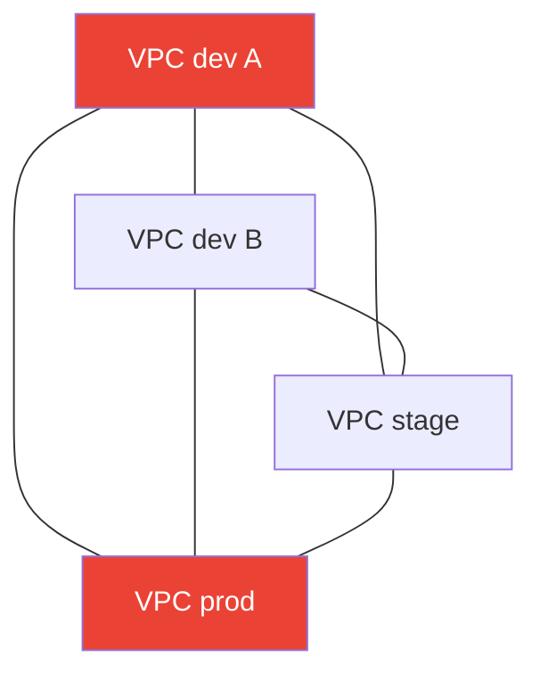
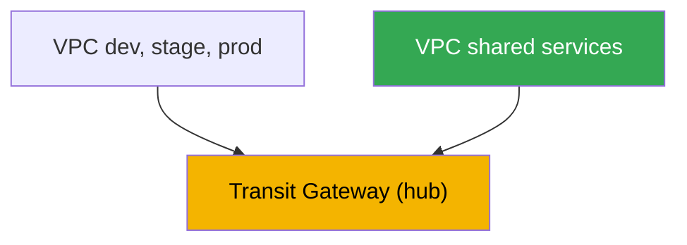
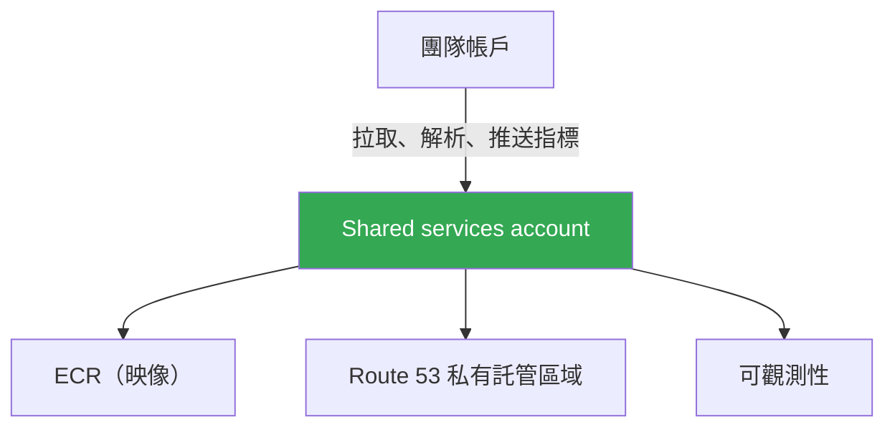

[Русская версия](ru.md) · [Eng version](en.md) · [Versión en español](es.md) · [Version française](fr.md) · [Deutsche Version](de.md) · [ქართული ვერსია](ge.md) · [日本語版](jp.md)
# 第 32 章。多叢集與多帳戶：連線、共用資源、模式

> **接下來。** 第 26-31 章討論單一叢集內的流量：透過 NLB 與 ALB 的進入流量（第 26-27
> 章）、Gateway API（第 28 章）、DNS 與憑證（第 29 章）、NetworkPolicy（第 30
> 章）、egress 及其成本（第 31 章）。本章的規模更大 - 多個叢集與帳戶之間的連線。透過
> VPC Lattice 和 ServiceExport/ServiceImport 的服務層級連線將在第 28 章詳述；egress、VPC
> endpoints 與 PrivateLink 見第 31 章；GitOps 與叢集艦隊管理（Argo CD、Flux）見第 44
> 章；VPC、subnet 與路由的基本架構見第 0 部分（第 00-3 章）。本章只討論一件事：如何連接
> 不同 VPC 與帳戶中的叢集，以及應集中共用哪些項目。

## 32.1.「dev 叢集中的服務需要 prod 帳戶中的服務，但網路彼此看不見」

組織成長了。起初只有一個叢集，後來變成數個：dev 有獨立帳戶、stage 有獨立帳戶、prod
也有獨立帳戶，鄰近團隊還有幾個帳戶。每個叢集都在自己的 VPC 與帳戶中 - 這樣更安全，也
更方便計算成本。接著出現第一個連線需求：團隊 A 叢集中的服務需要存取位於另一帳戶、
平台團隊叢集中的共用驗證服務。或者 stage 中的應用程式需要連上執行於 shared 帳戶 VPC 中的
資料庫。

直覺的解決方案是透過 peering 連接兩個 VPC。兩個 VPC 時可行，但叢集已經有六個，而且想要
許多連線，局面很快就會惡化：

- **VPC peering 不具傳遞性。** 若 VPC A 與 B peering，B 又與 C peering，則 A 不會經由 B
  看見 C。每一對需要連線的 VPC 都需要各自的 peering。N 個 VPC 的完全圖大約需要 N 平方個
  連線，以及同樣數量的路由與 security group 規則集合。
- **CIDR 不得重疊。** Peering 要求位址範圍互不重疊。若每個團隊都從 `10.0.0.0/16` 的
  複製貼上建立自己的 VPC，範圍就會重複，因而無法直接 peering，路由也會產生歧義。
- **規則大量增加。** 每個 peering 都需要在兩端的路由表加入項目，以及在 security group
  中加入允許規則。六個 VPC 完全互連時，就有數十筆必須人工維護且容易出錯的項目。



四個 VPC 完全互連就已有六個 peering；十個 VPC 需要四十五個。既沒有傳遞性，也無法擴展。
而且這只是網路問題 - 還有如何讓團隊不必各自維護 ECR、DNS zone 與 observability 堆疊的問題。
接下來將說明為何要分散至不同帳戶、除 peering 外還有哪些連線方案、能透過 AWS RAM 共用什麼
與如何共用，以及在 production 中使用哪些模式。

## 32.2. 為什麼需要多帳戶

在解決連線前，值得理解為什麼叢集原本就分散在不同帳戶中。這不是偶然，而是一項刻意的作法。
AWS 建議使用由 **AWS Organizations** 管理的多個帳戶：organization 定義 organizational units
(OU) 的階層，並允許對其套用共同限制（service control policies）及進行 consolidated billing。

將環境與團隊分散至不同帳戶的原因：

- **blast radius 隔離。** 帳戶是 AWS 中最嚴格的邊界。dev 帳戶中的錯誤、遭入侵或 quota 耗盡
  不會影響 prod，因為它們是實體上不同的帳戶，具有不同限制與權限。
- **安全邊界。** IAM 權限預設不會跨越帳戶邊界。必須透過 roles 與 cross-account trust 明確
  授予對其他帳戶的存取權。這是便利的 least-privilege 模型：不需要 prod 的團隊無法存取它。
- **獨立計費與核算。** 每個帳戶的成本會在 consolidated bill 中以獨立項目顯示。每個團隊或
  環境一個帳戶，可立即取得成本明細，不需要複雜的 tagging 機制。
- **Quotas 與限制。** 服務限制（VPC、EIP、instances 的數量）按帳戶計算。分散帳戶可消除
  團隊之間對共用 quotas 的競爭。

典型結構（landing zone 的概念）包含：僅用於 Organizations 與 billing 的獨立 management 帳戶、
共用服務帳戶（shared services）、環境帳戶（dev、stage、prod），以及團隊或產品帳戶。AWS
Control Tower 等現成方案會使用預先設定的 OU 與 policies 部署此結構。結構本身的管理是另一個
主題；對本章而言，重要的是 EKS 叢集位於這些帳戶中，而且彼此需要連線。

## 32.3. 網路連線方案

Peering 並非唯一選項，對叢集艦隊而言通常也不是最佳選項。以下由簡單到可擴展說明四種主要方法。

**VPC peering。** 兩個 VPC 之間的一對一直接連線。簡單、便宜（僅收取流量、cross-AZ 與
cross-region 費用），延遲低。缺點如前所述：不具傳遞性、需要不重疊 CIDR，並以 N 平方規模
成長。適合少數穩定配對，不適合作為成長中艦隊的基礎。

**Transit Gateway。** 區域虛擬路由器 - 一個 hub，VPC、VPN 與 Direct Connect 可透過
attachments 連接至它。與 peering 的關鍵差異是：**路由具有傳遞性** - 連接到同一 Transit
Gateway 的所有 VPC 都可以（若路由表允許）透過 hub 彼此通訊，而無須成對建立連線。每個 VPC
只需一個 attachment，而不是 N-1 個 peerings。Transit Gateway 可透過 AWS RAM 分享至其他帳戶，
因此可將整個 organization 的 VPC 集合成單一可路由的網路。CIDR 仍不得重疊 - 路由以 IP 為依據。
費用為每個 attachment 的每小時計費，加上處理資料的費用。

**VPC Lattice。** 不是網路層級，而是服務層級的連線（第 28 章）：服務註冊至 service network，
來自已關聯 VPC 的用戶端可透過 DNS 名稱存取它，而無須關心 Pods 位於哪個 VPC、叢集或帳戶。
Cross-account 透過 AWS RAM 實現（分享 service network）。重要特性是：連線經由服務，而不是
IP 路由，因此 **CIDR 重疊不再造成問題** - Lattice 不會建立共用 L3 domain。適用於服務之間的
東西向流量；外部周邊與入口仍由 ALB 和 NLB 負責。

**PrivateLink。** 對單一服務的單向私有存取（第 31 章）：provider 在 NLB 後方發布 endpoint
service，consumer 建立 interface endpoint。流量是私有的，CIDR 可重疊（透過 ENI 連線而不是
路由），但連線是單向的 - consumer 發起連線，provider 接收。適合只需向另一帳戶提供一項服務，
而不是連接整個網路的情境。

| 方法 | 模型 | 傳遞性 | CIDR 重疊 | Cross-account | 何時使用 |
|---|---|---|---|---|---|
| VPC peering | 網路，1 對 1 | 否 | 禁止 | 直接 | 少數穩定配對 |
| Transit Gateway | 網路，hub | 是 | 禁止 | 透過 RAM | VPC 艦隊、統一網路 |
| VPC Lattice | 服務 | 不適用 | 可避開 | 透過 RAM | 服務間 east-west |
| PrivateLink | 服務，1 個 endpoint | 不適用 | 可避開 | endpoint service | 提供一項服務 |

按層級區分很簡單。若許多 VPC 需要一個共用且可路由的網路，使用 Transit Gateway。若特定服務
需要跨叢集與帳戶連線，尤其是 CIDR 重疊時，使用 VPC Lattice。若要單向對外提供一項服務，使用
PrivateLink。Peering 保留給特定配對。

## 32.4. 透過 AWS RAM 共用資源

連線只完成一半。另一半是不要讓每個帳戶都保留所有項目的副本。**AWS Resource Access Manager
(RAM)** 允許擁有者將資源分享給其他帳戶、OU 或整個 organization，而不必複製資源。consumer
可如同資源位於自己帳戶中般使用它，但仍由擁有者管理。在 EKS 情境中適合共用的項目：

| 資源 | 分享給誰 | 對 EKS 的用途 |
|---|---|---|
| Subnets (`ec2:Subnet`) | 僅限 organization 內 | shared VPC：不同帳戶的 nodes 位於共用 subnets |
| Transit gateways | 任何帳戶 | VPC 艦隊的統一路由 |
| VPC Lattice service network | 任何帳戶 | 叢集服務的跨帳戶連線 |
| Route 53 Resolver rules | 任何帳戶 | DNS 查詢的共用 forwarding |
| Prefix lists、IPAM pools | 任何帳戶 | 統一 CIDR 規劃、共用清單 |

**Shared VPC。** 網路帳戶擁有者透過 RAM 分享 subnets，organization 中的其他帳戶可在其中啟動
自己的資源，包括 EKS nodes。網路集中管理（一個團隊擁有 VPC、routes、NAT），而 workloads
則位於團隊帳戶中。請注意：subnets 僅能在自身 organization 內分享，不能對外分享。

並非所有項目都透過 RAM 分享 - 某些資源有自己的 cross-account 機制：

- **集中式 ECR。** 一個帳戶保有 image registry，其他帳戶從中 pull。Cross-account pull 由
  **repository policy** 設定（repository 上的 resource-based policy），其中針對所需 consumer
  帳戶使用 `ecr:BatchGetImage` 與 `ecr:GetDownloadUrlForLayer` actions，另外也需要 pull
  端的 IAM permissions。這可免除每個帳戶各自維護 ECR，並提供 image scanning 與 signing 的
  統一控制點（第 20 章）。
- **共用 Route 53 private hosted zone。** 一個帳戶的 private zone 可與另一帳戶的 VPC 關聯，
  但不透過 RAM，而是透過一對 API calls：zone 擁有者執行 `CreateVPCAssociationAuthorization`，
  接著 VPC 擁有帳戶執行 `AssociateVPCWithHostedZone`。之後，該 zone 的名稱可在兩個 VPC 中
  解析。這可為不同帳戶的服務建立統一的私有名稱空間。

整體邏輯是：網路、DNS rules 與 address lists 透過 RAM 分享，images 透過 ECR repository policy
分享，private zones 透過 association authorization 分享。擁有權與管理維持在一個帳戶中，
consumers 則獲得明確授權的存取權。

## 32.5. 服務層級的叢集連線

連接網路不等於讓一個叢集的服務能存取另一個叢集的服務。即使在共用網路之上，仍有 discovery
（應呼叫哪個名稱）與 authorization（允許誰呼叫）的問題。有三種方法。

**VPC Lattice ServiceExport/ServiceImport。** EKS 的原生跨叢集連線方式（第 28 章）。AWS
Gateway API Controller 提供 `ServiceExport` 與 `ServiceImport` CRD：從 source 叢集 export
服務，在 consumer 叢集 import 服務，然後在 `HTTPRoute` 中參照它 - 包括跨叢集 blue/green 的
weighted routing。discovery 與 authorization（透過 IAM auth policies）由 Lattice 處理，CIDR
重疊不會造成問題。

**Load balancer 加 DNS。** 不使用 Lattice 的經典方案：source 叢集的服務透過 internal NLB 或
ALB（第 26-27 章）發布，為其建立 DNS record（external-dns，第 29 章），其他叢集中的 client
再透過名稱存取。網路必須已連線（Transit Gateway 或 peering）並可路由。這很簡單易懂，但
需要自行建置 discovery 與 authorization。

**Service mesh cross-cluster。** Mesh（Istio、Cilium Cluster Mesh、Linkerd）可連接多個叢集的
服務，提供共用 discovery、mTLS 與 policies。功能強大，但在 EKS 之上又增加自己的 control
plane 與操作複雜性。對許多團隊而言，Lattice 或 load balancer 搭配 DNS 能更簡單地解決問題；
只有在已有 mTLS 與統一流量管理需求時才會使用 mesh。此處不深入探討。

依情況選擇：在 AWS 內需要不增加額外基礎設施的跨叢集服務連線，使用 Lattice；網路已經連通且
只需透過名稱簡單存取，使用 load balancer 與 DNS；若有成熟的 mesh 需求，考慮 cluster mesh。

## 32.6. 建置模式

上述元件可組成反覆出現的架構。以下說明主要模式。

**Transit Gateway 上的 hub-and-spoke。** 中央網路帳戶擁有 Transit Gateway，並透過 RAM 分享。
團隊的 VPC（spokes）透過 attachments 連線。所有跨帳戶流量經由 hub，路由具有傳遞性；加入新的
VPC 只需要一個 attachment，而不是與所有 VPC 建立 peerings。



**共用服務帳戶。** 獨立帳戶放置共用項目：集中式 ECR、Route 53 私有託管區域、
可觀測性堆疊（指標與日誌，第 33-34 章），有時還有共用資料庫。團隊依 repository
政策從其 ECR 拉取映像、解析其私有託管區域的名稱，並將指標推送至其 Prometheus。
如此可消除重複並取得統一控制點。



**CIDR 規劃。** 所有使用 IP routing 的項目（peering、Transit Gateway、shared VPC）都需要不重疊
的 ranges。因此 CIDR 應集中分配，而不是透過複製貼上：每個帳戶與 VPC 都有自己的不重疊 block，
通常來自經 RAM 分享的共用 IPAM pool。這應在建立 VPC 之前完成：事後重新編址網路成本很高。若
已經發生重疊且無法修正，應透過不需要共用 L3 domain 的 Lattice 或 PrivateLink 建置服務連線。

**艦隊管理。** 當叢集很多時，不會手動將其 configuration 與 applications 發布至每一個叢集，
而是從一個位置透過 GitOps（Argo CD、Flux）以 declarative 方式部署至整個艦隊。完整主題在第
44 章；此處只要了解多叢集與 GitOps 相輔相成：連線提供網路，GitOps 提供 configuration 的
一致性。

## 32.7. Production 中的應用方式

- **預先按環境與團隊劃分帳戶。** dev、stage、prod 與共用服務位於 AWS Organizations 下的不同
  帳戶，以隔離 blast radius 並核算成本。
- **在 Transit Gateway 上組建 VPC 艦隊，而不是使用 peerings。** 使用透過 RAM 分享、具有傳遞
  路由的 hub，取代按 N 平方成長的 peering graph。
- **從第一天起集中規劃 CIDR。** 為每個帳戶與 VPC 配置不重疊 blocks，通常來自共用 IPAM pool；
  事後重新編址成本過高。
- **將共用項目移至共用服務帳戶。** 集中式 ECR（透過 repository 政策進行
  跨帳戶拉取）、Route 53 私有託管區域與可觀測性，使用一個控制點而不是多份副本。
- **CIDR 重疊時，透過 VPC Lattice 建置服務連線。** 它不需要共用 L3 domain，cross-account 透過
  RAM，跨叢集透過 ServiceExport/ServiceImport。
- **透過 GitOps 管理叢集艦隊。** 從一個位置以 declarative 方式將 configuration 與 workloads
  發布至所有叢集（第 44 章），而不是逐一手動處理。

## 32.8. 小型詞彙表

- **AWS Organizations** - 多帳戶管理服務：OU 階層、共用 policies（SCP）與 consolidated billing。
- **landing zone** - 預先設定的多帳戶結構（management、shared services、環境、團隊）；也可
  透過 AWS Control Tower 部署。
- **VPC peering** - 兩個 VPC 之間的一對一直接連線；不具傳遞性，要求不重疊 CIDR。
- **Transit Gateway** - 具備已連接 VPC、VPN 與 Direct Connect 間傳遞路由的區域 hub router；
  可透過 RAM 分享。
- **AWS RAM (Resource Access Manager)** - 與其他帳戶及 organization 分享資源（subnets、
  Transit Gateway、VPC Lattice service network、Route 53 Resolver rules）的服務。
- **shared VPC** - 擁有者透過 RAM 分享 subnets，而其他帳戶在其中執行自身資源（包括 EKS nodes）
  的模型。
- **repository policy** - ECR repository 上的 resource-based policy，允許其他帳戶 cross-account
  pull images。
- **hub-and-spoke** - 具有中央 Transit Gateway（hub）及連接至它的團隊 VPC（spokes）的 topology。
- **shared services account** - 具有共用資源（ECR、private DNS zones、observability）並由其他
  帳戶使用的帳戶。

## 32.9. 本章總結

- 成長為位於不同帳戶的眾多叢集，會帶來兩項任務：連接其網路或服務，以及不在每個帳戶重複
  建置共用資源。
- VPC peering 對配對而言很簡單，但不具傳遞性、需要不重疊 CIDR，且以 N 平方成長 - 不適合作為
  艦隊的基礎。
- AWS Organizations 下的多帳戶提供 blast radius 隔離、安全邊界、獨立 billing 與獨立 quotas；
  landing zone 定義典型結構。
- Transit Gateway 是具有傳遞路由的 hub，可將 VPC 艦隊集合為單一網路；可透過 RAM 分享，但 CIDR
  仍不得重疊。
- VPC Lattice 與 PrivateLink 在服務層級連線並避開 CIDR 重疊：Lattice 經由 service network 與
  RAM 處理 east-west，PrivateLink 單向提供一項服務。
- AWS RAM 可分享 subnets（在 organization 內）、Transit Gateway、VPC Lattice service network
  與 Route 53 Resolver rules；ECR 透過 repository policy 提供，private zone 透過 association
  authorization 提供。
- EKS 中的跨叢集服務連線原生地透過 ServiceExport/ServiceImport（第 28 章）建立；替代方案是
  load balancer 搭配 DNS 或 service mesh。
- 典型模式包括：Transit Gateway 上的 hub-and-spoke、shared services account、集中式 CIDR 規劃，
  以及透過 GitOps（第 44 章）管理艦隊。

## 32.10. 這在實務工作上的用途

輪值時，多帳戶連線問題通常表現為「服務 A 無法連上另一帳戶中的服務 B」。應按層檢查：是否有
路由（Transit Gateway attachment、route tables、CIDR 是否重疊）、security group 與 NACL 是否
允許、名稱能否解析（private zone 是否已與此 VPC 關聯）；若連線透過 Lattice，則檢查 VPC 是否
已與 service network 關聯，以及 IAM auth policy 是否阻擋流量。了解使用哪一種機制建立連線，
可立刻縮小排查範圍。

規劃時，關鍵決策要預先且一次完成：如何劃分帳戶、艦隊要選擇哪種連線機制（Transit Gateway
幾乎總是合理的預設選項）、如何分配不重疊 CIDR，以及哪些項目移至 shared services。事後修正
CIDR 或帳戶結構的錯誤成本很高，因此在帳戶中出現第一個叢集之前，應與網路及平台團隊先討論
這些決策。之後，GitOps（第 44 章）會維持整個艦隊的一致性。

## 32.11. 自我檢查問題

1. 為什麼 VPC peering 無法良好地擴展至成長中的叢集與帳戶艦隊？
2. 「VPC peering 不具傳遞性」是什麼意思？在三個 VPC 時會如何表現？
3. 為何要將環境與團隊分散至不同帳戶？這帶來哪四項好處？
4. AWS Organizations 是什麼？landing zone 扮演什麼角色？
5. Transit Gateway 與 peering 在路由及連線數量上有何不同？
6. Transit Gateway 是否需要不重疊 CIDR？如何將它提供給其他帳戶？
7. 為什麼 VPC Lattice 與 PrivateLink 可避開 CIDR 重疊問題，而 Transit Gateway 不行？
8. 哪些資源可透過 AWS RAM 分享？subnets 在 organization 邊界方面是否有限制？
9. 如何設定從集中式 ECR cross-account pull images？
10. 若不透過 RAM，如何讓 Route 53 private zone 在另一帳戶的 VPC 中可見？
11. 可用哪些方法連接不同叢集的服務？各自適用於何時？
12. hub-and-spoke 模式由哪些部分組成？哪些項目放在 shared services account？
13. 為什麼要在建立 VPC 前集中規劃 CIDR，而不是之後才修正？

## 練習

本章目前沒有專屬 lab，但可在實際帳戶上檢視目前的連線 topology。先確認是否有 Transit Gateway
以及設定了哪些 peerings：

```bash
# 帳戶中的 Transit Gateway 及其狀態
aws ec2 describe-transit-gateways \
  --query "TransitGateways[].{Id:TransitGatewayId,State:State,Owner:OwnerId}" --output table

# 現有 VPC peering 及其 CIDR 兩端
aws ec2 describe-vpc-peering-connections \
  --query "VpcPeeringConnections[].{Id:VpcPeeringConnectionId,Status:Status.Code}" \
  --output table
```

若有許多 peerings 卻沒有 Transit Gateway，這就是轉移至 hub 的候選情況。接著檢查哪些資源透過
AWS RAM 分享到帳戶或從帳戶分享出去：

```bash
# 分享給您及由您分享的資源（subnets、TGW、Lattice service network）
aws ram list-resources --resource-owner OTHER-ACCOUNTS --output table
aws ram list-resources --resource-owner SELF --output table
```

將輸出與叢集所需項目比對：Transit Gateway 是否已分享、是否存在共用 subnets 或 VPC Lattice
service network。然後檢查 VPC 的 CIDR 是否重疊（`aws ec2 describe-vpcs --query "Vpcs[].CidrBlock"`）
- 重複範圍表示它們之間無法建立可路由連線，必須使用 Lattice 或 PrivateLink。

---
[目錄](../README_TW.md) · [第 31 章](../31/tw.md) · [第 33 章](../33/tw.md)
