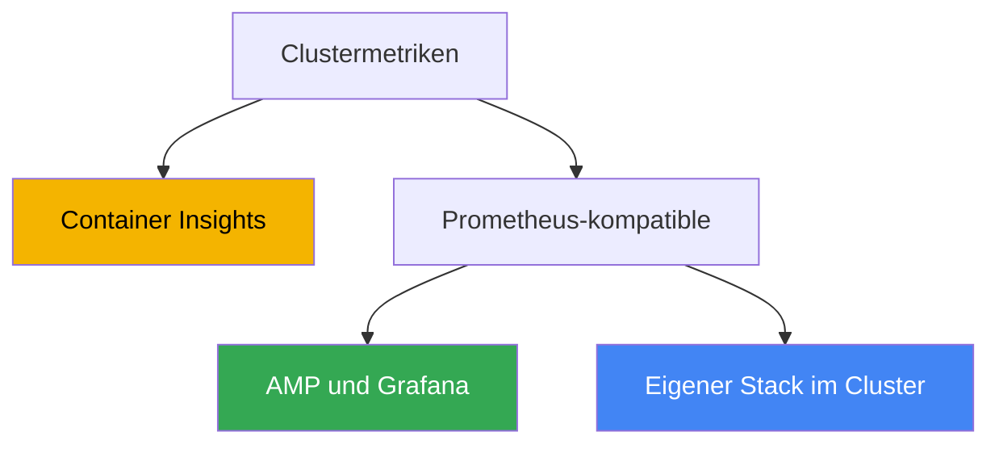
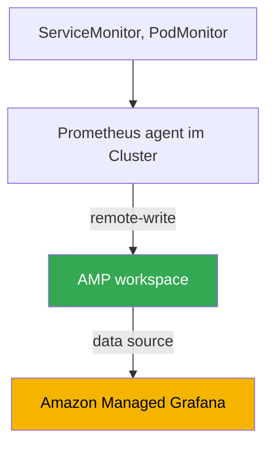

[Eng version](en.md) · [Versión en español](es.md) · [Version française](fr.md) · [Русская версия](ru.md) · [ქართული ვერსია](ge.md) · [繁體中文版](tw.md) · [日本語版](jp.md)
# Kapitel 33. Metriken: Container Insights, Managed Prometheus und Grafana, kube-prometheus-stack

> **Wie es weitergeht.** Teil 6 handelt von Observability: wie Sie verstehen, was innerhalb des Clusters und
> der Workloads geschieht. Wir beginnen mit Metriken, numerischen Zeitreihen über die Auslastung von Nodes,
> Pods und der Control Plane. Logs (Fluent Bit, CloudWatch Logs, OpenSearch) folgen in Kapitel 34;
> die automatische Skalierung von Anwendungen anhand von Metriken (HPA, externe Metriken, KEDA) in Kapitel
> 35; Distributed Tracing über ADOT und X-Ray in Kapitel 36; Kostenrechnung und -optimierung mit Kubecost
> und OpenCost in Kapitel 43. Hier geht es um eines: woher Metriken in EKS kommen, wo sie gespeichert
> werden und womit sie angezeigt werden.

## 33.1. „kubectl top schlägt fehl, HPA funktioniert nicht, die Clusterauslastung ist nicht sichtbar“

Der Cluster wurde gerade bereitgestellt, Workloads werden ausgerollt, alles scheint zu funktionieren. Die
erste Frage eines Engineers im Bereitschaftsdienst lautet: „Wie viel CPU und Speicher verbrauchen die Nodes
und Pods gerade?“ Die vertraute Abfrage führt jedoch direkt gegen eine Wand:

```bash
kubectl top nodes
# error: Metrics API not available

kubectl top pods -A
# error: Metrics API not available
```

Es gibt überhaupt keine Metriken. `kubectl top` liefert weder Nodes noch Pods. Ein auf CPU basierender HPA
hängt im Status `<unknown>/50%` und skaliert nichts, weil er die aktuelle Auslastung nirgends abrufen kann.
Die Frage „Ist der Cluster ausgelastet, müssen Nodes hinzugefügt werden?“ lässt sich nicht beantworten:
Es gibt keine Grundlage für die Kapazitätsplanung, und eine Degradation unter Last wird erst durch Beschwerden
von Benutzerinnen und Benutzern sichtbar.

Der Grund ist, dass EKS eine verwaltete Control Plane ist und Anwendungen nicht selbstständig mit Metriken
versorgt. Anders als in vielen selbstverwalteten Clustern, in denen jemand bereits metrics-server und einen
Monitoring-Stack installiert hat, fehlen sie in einem frischen EKS: AWS verantwortet den Betrieb von API
server, scheduler und controller manager, doch das Sammeln, Speichern und Anzeigen der Node- und Pod-Metriken
ist Ihre Aufgabe. Die Control Plane gibt nach außen nur einen grundlegenden Satz ihrer eigenen Metriken aus
(dazu später mehr); alles Weitere müssen Sie aufbauen.

Als Nächstes behandeln wir drei Dinge: die Basisschicht metrics-server, die `kubectl top` und HPA repariert;
drei Wege, auf denen in EKS vollständige Metriken gesammelt und gespeichert werden (Container Insights, Amazon
Managed Prometheus, selbstverwalteter kube-prometheus-stack); und was im Cluster überwacht werden sollte.

## 33.2. metrics-server: die Basisschicht für kubectl top und HPA

Das Erste, was in einem neuen Cluster installiert wird, ist **metrics-server**. Diese Kubernetes-Komponente
sammelt Ressourcennutzungsmetriken (CPU und Speicher) vom kubelet jeder Node und stellt sie über die Kubernetes
Metrics API (`metrics.k8s.io`) bereit. Genau diese API lesen `kubectl top` und der Horizontal Pod Autoscaler,
wenn sie nach resource metrics skalieren.

Es ist wichtig, die Grenzen zu verstehen. metrics-server ist **kein Speicher**: Er hält nur die letzten Werte im
Speicher, ohne Historie, ohne retention, ohne Abfragen für die vergangene Woche und ohne Alerting. Seine Aufgabe
ist ein „hier und jetzt“ für zwei Verbraucher: `kubectl top` und HPA (die Verbindung von HPA zu Metriken wird
in Kapitel 35 behandelt). Für Dashboards, Trends und Benachrichtigungen ist ein vollständiger Metrik-Stack
nötig, der weiter unten behandelt wird.

In EKS ist metrics-server nicht standardmäßig installiert, sondern wird separat eingerichtet. Dafür gibt es
mehrere Wege:

```bash
# als Community-Add-on über EKS Add-ons
aws eks create-addon --cluster-name my-cluster --addon-name metrics-server

# oder mit dem Upstream-Manifest
kubectl apply -f https://github.com/kubernetes-sigs/metrics-server/releases/latest/download/components.yaml
```

Nach der Installation liefert `kubectl top nodes` die Auslastung, und ein HPA für CPU und Speicher wird aktiv.
Das ist jedoch nur das Fundament: metrics-server beantwortet die unmittelbare Frage, während die folgenden drei
Ansätze Historie, Dashboards und Alerts liefern.

## 33.3. Drei Metrikwege in EKS

Eine vollständige Metriksammlung in EKS wird üblicherweise auf eine von drei Arten aufgebaut. Sie unterscheiden
sich darin, wer Speicher und Sammlung verwaltet und wie AWS-native beziehungsweise Kubernetes-native sie sind.



Kurz zu jedem Ansatz, ausführlich in den folgenden Abschnitten:

- **CloudWatch Container Insights** ist der AWS-native Weg. Ein Agent im Cluster sammelt Metriken und
  sendet sie an CloudWatch; Dashboards und Alarme befinden sich ebenfalls dort. Alles wird von AWS verwaltet.
- **Amazon Managed Service for Prometheus (AMP)** ist ein verwaltetes Prometheus-kompatibles
  Backend. Sie sammeln Metriken (managed collector oder ADOT), schreiben sie per remote-write in einen
  workspace, fragen mit PromQL ab und erstellen Dashboards in Amazon Managed Grafana.
- **kube-prometheus-stack** ist selbstverwaltet: Prometheus, Grafana und Alertmanager laufen per Helm im
  Cluster. Vollständige Kontrolle, aber Speicherung und Betrieb liegen bei Ihnen.

Diese Wege schließen einander nicht aus: Oft wird ein Hybrid eingesetzt, der im Vergleichsabschnitt behandelt
wird. Sehen wir sie uns der Reihe nach an.

## 33.4. CloudWatch Container Insights

**Container Insights** ist die Möglichkeit, EKS mit CloudWatch zu überwachen. Metriken von Nodes, Pods,
Namespaces und dem Cluster werden durch einen Agent im Cluster gesammelt, an CloudWatch gesendet und auf
fertigen Dashboards angezeigt; darauf aufbauend werden CloudWatch alarms erstellt.

Eingerichtet wird dies mit einem einzigen EKS-Add-on: **amazon-cloudwatch-observability**. Es stellt den
CloudWatch Observability Operator bereit, der den CloudWatch agent installiert und Container Insights **with
enhanced observability** aktiviert. Enhanced observability liefert detailliertere Metriken, einschließlich einer
Aufschlüsselung nach Pods und Containern, und hilft bei verwalteten Nodes sowie Fargate, das Gesamtbild ohne
manuelle Agent-Konfiguration zu sehen. Dasselbe Add-on aktiviert CloudWatch Application Signals für die
APM-Ebene der Anwendungen.

```bash
# Container Insights über das verwaltete EKS-Add-on aktivieren
aws eks create-addon \
  --cluster-name my-cluster \
  --addon-name amazon-cloudwatch-observability
```

Das ist sofort enthalten:

- **Metriken für Nodes, Pods, Namespaces und Cluster**: CPU, Speicher, Netzwerk und Datenträger befinden
  sich im CloudWatch-Namespace `ContainerInsights`, einschließlich fertiger Dashboards.
- **Grundlegende Metriken der Control Plane kostenlos.** Unabhängig vom Add-on stellt CloudWatch für
  Cluster ab Version `1.28` einen Satz vended-Metriken im Namespace `AWS/EKS` bereit (Metriken von API
  server, scheduler und anderen), ohne dass etwas installiert werden muss.
- **AWS-Integration.** Alarms, zusammengesetzte alarms, Versand an SNS und die Verbindung mit weiteren
  AWS-Metriken befinden sich in einer Konsole, ohne separaten Stack.

Das Kostenmodell basiert auf Volumen: Sie zahlen für angenommene (ingested) und gespeicherte Metriken sowie für
Abfragen, zusätzlich für Logs, falls ihre Sammlung aktiviert ist (Logs: Kapitel 34). Container Insights ist gut,
wenn Sie bereits in CloudWatch arbeiten und kein eigenes Prometheus betreiben möchten: minimaler Betriebsaufwand,
alles ist managed. Dafür bezahlen Sie mit der Bindung an CloudWatch als Datenmodell und Abfragesprache: PromQL
gibt es hier nicht.

## 33.5. Amazon Managed Prometheus und Managed Grafana

Wenn ein Team in Prometheus und PromQL denkt, aber kein eigenes Prometheus betreiben und skalieren möchte, gibt
es **Amazon Managed Service for Prometheus (AMP)**, ein verwaltetes Prometheus-kompatibles Backend. Sie starten
keinen Server: AMP stellt einen **workspace** bereit, einen isolierten Metrikspeicher mit Prometheus-kompatibler
API, in den Daten per **remote-write** gelangen und der mit PromQL abgefragt wird. Skalierung und retention
liegen bei AWS.

Metriken können auf zwei Wegen in den workspace gesammelt werden:

- **AWS managed collector (scraper)** ist ein vollständig verwalteter agentenloser Sammler. Er erkennt und
  zieht Prometheus-kompatible Metriken selbstständig aus dem EKS-Cluster und schreibt sie per `remote_write`
in den workspace. Im Cluster muss nichts installiert oder gepatcht werden; der scraper erstellt ENIs in den
  angegebenen Subnetzen und verwendet einen VPC endpoint, der Datenverkehr geht nicht ins Internet.
- **Customer managed collector** ist ein eigener Sammler im Cluster, meist der ADOT collector (AWS
  Distribution for OpenTelemetry) oder Prometheus im agent-Modus, konfiguriert für remote-write in den
  workspace. Dies bietet mehr Kontrolle darüber, was und wie gescrapt wird, doch der Betrieb des Sammlers
  liegt bei Ihnen.

Schreibrechte gewährt die AWS managed policy `AmazonPrometheusRemoteWriteAccess` (über IRSA oder Pod Identity,
Kapitel 16-17). Den Schreib-Endpoint und die workspace-ID können Sie so anzeigen:

```bash
# Liste der workspaces und ihres Status
aws amp list-workspaces --output table

# remote-write-Endpoint eines bestimmten workspace
aws amp describe-workspace --workspace-id ws-xxxxxxxx \
  --query "workspace.prometheusEndpoint" --output text
```

AMP ist Speicher und Abfrage-Engine, aber kein Dashboard. Zur Visualisierung wird **Amazon Managed Grafana
(AMG)** verwendet, ein verwaltetes Grafana. AMG fügt AMP als data source hinzu (in neueren Versionen über AWS
data source configuration mit einer service-managed IAM-Rolle, sodass Berechtigungen automatisch vergeben
werden), und der Benutzerzugang zum workspace wird über **IAM Identity Center** (SSO) eingerichtet. Das Ergebnis
ist die Kette: Der managed collector sammelt, AMP speichert und beantwortet PromQL, AMG zeichnet Dashboards, und
Sie betreiben keine dieser Komponenten selbst.

## 33.6. Selbstverwalteter kube-prometheus-stack

Der dritte Weg ist, den vollständigen Prometheus-Stack selbst im Cluster zu installieren. Der De-facto-Standard
ist hierfür das Helm-Chart **kube-prometheus-stack**, das in einem Schritt Prometheus Operator, Prometheus,
Grafana, Alertmanager, node-exporter und kube-state-metrics bereitstellt.

Eine Schlüsselrolle spielt der **Prometheus Operator**: Er führt CRDs ein, mit denen die scrape-Konfiguration
deklarativ und Kubernetes-typisch beschrieben wird, ohne eine monolithische `prometheus.yml` bearbeiten zu
müssen:

- **ServiceMonitor**: „Scrape Endpoints hinter diesem Service“; der übliche Weg, Anwendungsmetriken über
  einen Label-Selektor anzubinden.
- **PodMonitor**: dasselbe, aber direkt für Pods, ohne Service.
- **PrometheusRule**: Alerting-Regeln und recording rules für Alertmanager.

```bash
# Stack im Cluster installieren
helm repo add prometheus-community https://prometheus-community.github.io/helm-charts
helm install kube-prometheus-stack prometheus-community/kube-prometheus-stack \
  -n monitoring --create-namespace
```

Das Metrikvolumen bedeutet Kosten und Backend-Last; deshalb werden Metriken und Labels mit hoher Kardinalität
bereits beim Scrape verworfen, vor dem Schreiben und vor remote-write an AMP. Dies geschieht über
`metric_relabel_configs` in der scrape config von Prometheus; in ServiceMonitor und PodMonitor heißt dieses Feld
`metricRelabelings`:

```yaml
metric_relabel_configs:
  # Eine Metrik mit hoher Kardinalität vollständig anhand ihres Namens verwerfen
  - source_labels: [__name__]
    regex: apiserver_request_duration_seconds_bucket
    action: drop
  # Ein überflüssiges Label mit hoher Kardinalität entfernen, das die Anzahl der Reihen aufbläht
  - action: labeldrop
    regex: (pod_uid|container_id)
```

Ohne diese Bereinigung wächst die Zahl der Zeitreihen unkontrolliert, ebenso wie die Kosten für Aufnahme und
Speicherung im managed Backend und die Last auf dem lokalen Prometheus.

Der Vorteil dieses Ansatzes sind vollständige Kontrolle und Portabilität: Dasselbe Chart und dieselben
ServiceMonitor funktionieren in jedem Kubernetes, nicht nur in EKS, ohne Bindung an AWS. Der Nachteil: Der
vollständige Betrieb liegt bei Ihnen. Speicherung und retention benötigen PVs, deren Größe und Aufbewahrungszeit
Sie selbst berechnen; bei Wachstum kommen Hochverfügbarkeit und Föderation hinzu, außerdem Aktualisierungen und
Ressourcen für Prometheus selbst, das in großen Clustern viel Speicher verbraucht. Genau diese Sorgen nimmt AMP
Ihnen ab.

## 33.7. Vergleich der drei Ansätze und Hybrid

Die Wahl läuft darauf hinaus, wie viel Betrieb Sie übernehmen möchten und wie wichtig PromQL und Portabilität
sind.

| Kriterium | Container Insights | Managed Prometheus (AMP) | kube-prometheus-stack |
|---|---|---|---|
| Wer verwaltet | AWS | AWS (Speicher) | Sie |
| Abfragesprache | CloudWatch, ohne PromQL | PromQL | PromQL |
| Dashboards | CloudWatch | Amazon Managed Grafana | Grafana im Cluster |
| Sammlung | CloudWatch agent (Add-on) | managed collector oder ADOT | Prometheus im Cluster |
| Speicherung und retention | CloudWatch, managed | workspace, managed | Ihre PVs, Ihre Verantwortung |
| Betriebsaufwand | minimal | niedrig | hoch |
| Bindung | an CloudWatch | Prometheus-kompatibel | portabel |
| Wann verwenden | Sie arbeiten in CloudWatch | PromQL ohne eigenen Server ist nötig | vollständige Kontrolle ist nötig |

Die Ansätze lassen sich kombinieren. Ein häufiger Hybrid lautet: **AMP als Speicher + kube-prometheus-stack für
das Scraping + AMG für Dashboards**. Prometheus Operator und ServiceMonitor bleiben die vertraute Art, die
Sammlung zu beschreiben; der lokale Prometheus arbeitet im agent-Modus und liefert Daten per remote-write an AMP,
während der managed workspace langfristige Speicherung, HA und Skalierung übernimmt. Damit behalten Sie ein
Kubernetes-native Konfigurationsmodell, geben aber den aufwendigsten Teil ab: das Speichern der Metriken.



Eine weitere Variante verwendet einen managed collector statt eines eigenen Prometheus: Dann läuft im Cluster
überhaupt nichts aus dem Stack, während Sammlung, Speicherung und Abfragen vollständig auf AWS-Seite erfolgen.
Dies ist der am stärksten verwaltete Weg zu PromQL.

### Gesamtbetriebskosten: Wofür Sie in jedem Fall bezahlen

„Eigenes Prometheus ist kostenlos“ ist das wichtigste Missverständnis dieses Kapitels. In beiden Fällen wird
bezahlt, nur die Kostenpositionen unterscheiden sich; verglichen werden sollten diese, nicht das Vorhandensein
einer AWS-Rechnung.

| Position | Eigener Stack (Prometheus, Grafana) | AMP plus AMG |
|---|---|---|
| Metrikaufnahme | Node-Ressourcen für Scraping | Volumen angenommener Samples wird berechnet |
| Speicherung | EBS-Volumes: Volumen für retention plus Reserve | Metrikvolumen wird elastisch berechnet |
| Abfragen | CPU und Speicher von Prometheus, schweres PromQL kann es überlasten | verarbeitete Samples werden berechnet |
| Ausfallsicherheit | zwei Replikate plus Deduplizierung, also doppelter Verbrauch | innerhalb des Dienstes |
| Dashboards | Grafana ist kostenlos, aber Updates und Backups liegen bei Ihnen | Gebühr für aktive Benutzer |
| Arbeit | Upgrades, Sharding bei Wachstum, Bereitschaft | minimal |

Drei Punkte widersprechen der Intuition bei der Kalkulation. Erstens: Bei AMP ist **Datenaufnahme** der wichtigste
Kostentreiber, nicht Speicherung. Deshalb spart eine Verringerung von retention kaum Geld; wirksame Hebel sind
selteneres Scraping (`scrape_interval`) und weniger Sammlung durch das Filtern unnötiger Serien über
`relabel_config`. Zweitens: **Auch Abfragen sind kostenpflichtig**, und Alerts sind ebenfalls Abfragen. Daher ist
natives AMP-Alerting günstiger als externes: Hochverfügbares Alerting in Grafana fragt Daten aus mehreren Zonen ab
und vervielfacht die Abfragekosten. Drittens, für beide Varianten: **Kardinalität**. Ein Label mit einem eindeutigen
Wert pro Anfrage oder Pod verwandelt Dutzende Serien in Millionen. Bei managed Lösungen zeigt sich das in der
Rechnung, im eigenen Stack als OOMKilled bei Prometheus. Beide Probleme werden nicht durch die Wahl eines Vendors,
sondern durch Disziplin bei Labels behoben (Sizing: Kapitel 14, Kosten insgesamt: Kapitel 43).

### Langfristige retention: Thanos, Mimir, VictoriaMetrics

Eine eigene Aufgabe, wegen der ein selbstverwalteter Stack zu etwas Größerem anwächst: Lokales Prometheus ist
nicht für ein Jahr Historie ausgelegt. retention stößt an die Grenzen des Datenträgers, und das vertikale Wachstum
einer Instanz endet irgendwann. Die Antwort der Branche ist, Historie in Objektspeicher auszulagern.

**Thanos** ist dafür die bekannteste Sammlung und tatsächlich eine Sammlung von Komponenten, nicht ein einzelner
Dienst:

- Ein **sidecar** neben Prometheus lädt fertige TSDB-Blöcke nach S3 hoch.
- Das **store gateway** liefert historische Daten, indem es Blöcke aus dem Bucket liest und den Index cached.
- Der **compactor** führt kleine Blöcke zusammen, führt downsampling aus und wendet retention an.
- Der **querier** beantwortet PromQL über alle Quellen gleichzeitig und dedupliziert Daten aus HA-Paaren.
- Der **ruler** berechnet Regeln und Alerts über historische Daten.

Der Vorteil: Lokal hält Prometheus Stunden oder Tage statt Wochen vor. Teure EBS-Volumes und Speicher werden
gespart, während die Historie in S3 lebt. Der Preis sind vier bis sechs neue Komponenten, die aktualisiert und
überwacht werden müssen, sowie Abfragen an den Objektspeicher und die davorliegenden Caches. Dieselbe Aufgabenklasse
löst **Grafana Mimir** (eine Weiterentwicklung der Cortex-Ideen), wenn ein System statt einer Vielzahl von
Komponenten gewünscht ist.

**VictoriaMetrics** verfolgt einen anderen Ansatz für dieselbe Aufgabe: keine Erweiterung von Prometheus, sondern
ein Ersatz für dessen Speicher. Daten werden von `vmagent` angenommen (oder von Ihrem Prometheus im
remote-write-Modus), in `vmsingle` auf einer Node oder in einem Cluster aus `vminsert`, `vmstorage` und `vmselect`
gespeichert; `vmalert` berechnet Alerts, und die Aufbewahrungszeit wird durch das Flag `-retentionPeriod` gesetzt.
Die Abfragesprache MetricsQL ist mit PromQL kompatibel und ergänzt eigene Funktionen; Grafana-Dashboards funktionieren
unverändert. Es gibt weniger Komponenten als bei Thanos, aber die Historie liegt auf Datenträgern statt in S3,
sodass Datenträger und deren Wachstum weiterhin Ihre Verantwortung bleiben. Ein üblicher Grund für den Wechsel ist
geringerer CPU- und Speicherverbrauch bei denselben Daten; dies sollte mit der eigenen Last geprüft und nicht einfach
geglaubt werden.

In Bezug auf AWS löst AMP dieselbe Aufgabe ohne Komponenten; Thanos, Mimir und VictoriaMetrics werden eingesetzt,
wenn Kontrolle über den Speicher, Multi-Cloud oder eine eigene Kostenstruktur bei sehr großen Volumina erforderlich
ist.

## 33.8. Was in EKS überwacht werden sollte

Das Werkzeug ist die Hälfte der Arbeit; die andere Hälfte ist, welche Metriken gesammelt werden. Anhaltspunkte für
den Cluster:

- **Node-Metriken.** CPU, Speicher, Datenträger, einschließlich der Auslastung des Dateisystems für
  `/var/lib/kubelet` und des Root-Dateisystems, sowie Netzwerk. Sie werden durch node-exporter (in
  kube-prometheus-stack) oder den CloudWatch agent bereitgestellt. Hier werden Ressourcenengpässe erkannt, die zu
  Pod Evictions und `Node Pressure` führen.
- **Pod- und Container-Metriken.** CPU- und Speicherverbrauch im Verhältnis zu requests und limits, Restarts,
  OOMKilled. Sie zeigen falsches Sizing (Kapitel 14) und Leaks.
- **Metriken der Control Plane.** API server (Latenz, Fehlerrate, throttling), scheduler und controller
  manager. Ein Teil wird im Namespace `AWS/EKS` kostenlos bereitgestellt (Version `1.28` und höher), und der AMP
  managed collector kann Metriken von API server, kube-scheduler und kube-controller-manager direkt scrapen.
- **kube-state-metrics.** Eine separate Komponente, die den Zustand von Kubernetes-Objekten bereitstellt:
  wie viele Pods in `Pending` sind, ob ein Deployment bereit ist, ob ein Job festhängt, ob die Replikazahl dem
  Sollwert entspricht. Dies ist keine Ressourcenauslastung, sondern der Zustand von API-Objekten; ohne ihn ist das
  Bild unvollständig.

Zwei Methoden helfen, aus dem Metriksatz sinnvolles Monitoring zu machen. **USE** (für Ressourcen: Utilization,
Saturation, Errors) betrachtet jede Ressource über Auslastung, Sättigung und Fehler und eignet sich für Nodes sowie
Infrastruktur. **RED** (für Dienste: Rate, Errors, Duration) steht für Anfragerate, Fehleranteil und Antwortzeit
und eignet sich für Anwendungen. In der Praxis werden sie kombiniert: USE für Hardware und Nodes, RED für die
Workloads darüber.

## 33.9. Anwendung in der Produktion

- **metrics-server wird sofort installiert.** Er ist die erste Komponente eines neuen Clusters: Ohne ihn
  funktionieren `kubectl top` und HPA nicht, und das ist grundlegende Betriebshygiene.
- **Wählen Sie ein primäres Metrik-Backend und vermeiden Sie mehrere Stacks.** Entweder CloudWatch Container
  Insights (wenn Sie in der AWS-Konsole arbeiten) oder ein Prometheus-kompatibler Weg (AMP oder selbstverwaltet);
  zwei parallele Stacks bedeuten doppelte Kosten und doppelten Betrieb.
- **Managed wird self-managed vorgezogen, wenn es keinen gegenteiligen Grund gibt.** AMP und AMG übernehmen
  Speicherung, HA und Skalierung; ein eigener kube-prometheus-stack wird für vollständige Kontrolle, Air Gap oder
  Portabilität zwischen Clouds verwendet.
- **Der Hybrid AMP + Prometheus agent + AMG ist ein häufiger Kompromiss.** Kubernetes-native Konfiguration
  der Sammlung durch ServiceMonitor, jedoch ohne Aufwand für Metrikspeicherung.
- **kube-state-metrics muss installiert werden.** Ohne den Zustand der Objekte (Pending, Restarts) sieht das
  Monitoring die Auslastung, aber nicht, dass „etwas nicht bereitgestellt wird“.
- **Das Metrikvolumen wird über `metric_relabel_configs` kontrolliert.** Metriken und Labels mit hoher
  Kardinalität werden vor Schreiben und remote-write verworfen, andernfalls steigen Kosten und Backend-Last.
- **Metriken werden sofort mit Alerts verbunden.** Ein Dashboard, das niemand betrachtet, ist nutzlos;
  wichtige Signale (Node unter Druck, zunehmende API-server-Fehler, OOMKilled) werden als CloudWatch alarms oder
  in Alertmanager eingerichtet.

## 33.10. Mini-Glossar

- **metrics-server**: Komponente, die CPU und Speicher vom kubelet sammelt und über die Metrics API für
  `kubectl top` und HPA bereitstellt; ohne Historie und Speicherung.
- **Metrics API (`metrics.k8s.io`)**: Kubernetes-API für aktuelle Ressourcenmetriken, Quelle für `kubectl top`
  und HPA nach resource metrics.
- **Container Insights**: EKS-Monitoring mit CloudWatch: Ein Agent sammelt Node- und Pod-Metriken, Dashboards
  und alarms befinden sich in CloudWatch.
- **amazon-cloudwatch-observability**: Verwaltetes EKS-Add-on, das den CloudWatch agent installiert und
  Container Insights with enhanced observability aktiviert.
- **Amazon Managed Service for Prometheus (AMP)**: verwaltetes Prometheus-kompatibles Backend; workspace,
  remote-write, PromQL und retention liegen bei AWS.
- **workspace**: isolierter Metrikspeicher in AMP mit eigenem remote-write endpoint und Prometheus-kompatibler
  API.
- **managed collector (scraper)**: verwalteter agentenloser AMP-Sammler, der EKS-Metriken scrapt und per
  remote-write in einen workspace schreibt.
- **Amazon Managed Grafana (AMG)**: verwaltetes Grafana; bindet AMP als data source an, Benutzerzugang über
  IAM Identity Center.
- **kube-prometheus-stack**: Helm-Chart mit Prometheus Operator, Prometheus, Grafana, Alertmanager,
  node-exporter und kube-state-metrics.
- **ServiceMonitor, PodMonitor**: CRDs des Prometheus Operator, die deklarativ beschreiben, welche Endpoints
  gescrapt werden.
- **kube-state-metrics**: Komponente, die den Zustand von Kubernetes-Objekten (Pending, Replikate, Restarts)
  als Metriken bereitstellt.
- **Thanos**: Komponentensammlung, die Prometheus langfristige Speicherung in Objektspeicher hinzufügt:
  `sidecar` lädt Blöcke nach S3 hoch, `store gateway` liest sie zurück, `compactor` verdichtet sie, führt
  downsampling aus und wendet retention an, `querier` bietet einheitliches PromQL und Deduplizierung von
  HA-Paaren, `ruler` berechnet Regeln über die Historie. Dieselbe Aufgabenklasse löst **Grafana Mimir**.
- **VictoriaMetrics**: Ersatz für den Metrikspeicher, keine Erweiterung: `vmagent` für die Sammlung,
  `vmsingle` oder ein Cluster aus `vminsert`/`vmstorage`/`vmselect`, `vmalert` für Regeln, Aufbewahrungszeit
  per Flag `-retentionPeriod`, MetricsQL als PromQL-Erweiterung. Es gibt weniger Komponenten als bei Thanos,
  aber die Historie liegt auf Datenträgern statt in Objektspeicher.
- **metric_relabel_configs**: Abschnitt der scrape config (in ServiceMonitor: `metricRelabelings`), der
  Metriken hoher Kardinalität (`drop` nach `__name__`) und Labels (`labeldrop`) vor Schreiben und remote-write
  verwirft; ein Werkzeug zur Kontrolle von Volumen und Kosten.

## 33.11. Zusammenfassung des Kapitels

- In einem frischen EKS gibt es keine Metriken: `kubectl top` schlägt mit „Metrics API not available“ fehl,
  HPA skaliert nicht, die Clusterauslastung ist nicht sichtbar. Die Control Plane wird von AWS verwaltet und
  stellt Anwendungen keine Metriken selbst bereit.
- metrics-server ist die Basisschicht: Er stellt aktuelle CPU- und Speicherwerte über die Metrics API für
  `kubectl top` und HPA bereit. Er ist kein Speicher, liefert keine Historie und keine Alerts und wird separat
  installiert.
- Vollständige Metriken werden über einen von drei Wegen aufgebaut: CloudWatch Container Insights, Amazon Managed
  Prometheus oder selbstverwalteter kube-prometheus-stack.
- Container Insights ist AWS-native, wird mit dem Add-on amazon-cloudwatch-observability (with enhanced
  observability) installiert, Dashboards und alarms liegen in CloudWatch, die Kosten richten sich nach Volumen,
  und PromQL ist nicht verfügbar.
- AMP ist ein verwaltetes Prometheus-kompatibles Backend: workspace, remote-write und PromQL; Sammlung durch
  managed collector oder ADOT; Dashboards in Amazon Managed Grafana mit Zugang über IAM Identity Center.
- kube-prometheus-stack bietet vollständige Kontrolle und Portabilität (Prometheus Operator, ServiceMonitor,
  PodMonitor), doch Speicherung, retention, HA und Skalierung liegen bei Ihnen.
- Ein häufiger Hybrid: AMP als Speicher, kube-prometheus-stack zum Scraping, AMG für Dashboards. Dies ist eine
  Kubernetes-native Konfiguration ohne Aufwand für Speicherung.
- Überwacht werden sollten Nodes, Pods, Control Plane und der Objektzustand über kube-state-metrics; USE (für
  Ressourcen) und RED (für Dienste) helfen bei der Strukturierung.

## 33.12. Wie dies in der Praxis hilft

Im Bereitschaftsdienst sind Metriken das Erste, wonach bei einem Incident gegriffen wird: Ist die Node ausgelastet,
stößt der Pod an ein limit, steigt die Latenz des API server? Wenn `kubectl top` schweigt und keine Dashboards
vorhanden sind, wird die Incident-Analyse zum Rätselraten. Deshalb sollten die Basisschicht (metrics-server) und
mindestens ein Metrik-Backend vor dem ersten ernsten Incident vorhanden sein, nicht danach. Das Wissen, auf welchem
Weg die Metriken in Ihrem Cluster gesammelt werden, zeigt sofort, wo sie zu finden sind: in CloudWatch, in Grafana
über AMP oder in lokalem Grafana.

Bei der Planung ist die zentrale Entscheidung, welches Backend als Grundlage dienen soll und parallele Ansätze zu
vermeiden. Ein managed Weg (Container Insights oder AMP plus AMG) ist sinnvoll, wenn kein Team für den Betrieb von
Prometheus vorgehalten werden soll; self-managed eignet sich, wenn vollständige Kontrolle oder Portabilität nötig
sind. Die Kosten aller Wege wachsen mit dem Metrikvolumen. Daher wird vorab entschieden, was und mit welcher
Detailtiefe gesammelt wird: Alles wahllos zu sammeln ist sowohl bei managed Backends als auch auf eigenen PVs teuer.
Auf Metriken bauen anschließend die automatische Skalierung (Kapitel 35) und die Kostenrechnung (Kapitel 43) auf.

## 33.13. Fragen zur Selbstkontrolle

1. Warum schlägt `kubectl top nodes` in einem frischen EKS mit „Metrics API not available“ fehl?
2. Was macht metrics-server, und warum wird es als Basisschicht statt als Monitoring bezeichnet?
3. Wer liest die Metrics API außer `kubectl top`, und wie hängt dies mit HPA zusammen?
4. Welche drei Wege zur Sammlung und Speicherung von Metriken gibt es in EKS, und worin unterscheiden sie sich
   grundsätzlich?
5. Mit welchem Add-on wird Container Insights aktiviert, und was bietet enhanced observability?
6. Was sind die grundlegenden Metriken im Namespace `AWS/EKS`, und ab welcher Clusterversion sind sie kostenlos?
7. Was ist ein workspace in AMP, und wie gelangen Metriken dorthin?
8. Worin unterscheidet sich ein managed collector (scraper) von einem customer managed collector auf ADOT?
9. Wie ist AMP mit Amazon Managed Grafana verbunden, und worüber wird der Benutzerzugang eingerichtet?
10. Was stellt kube-prometheus-stack bereit, und wofür ist der Prometheus Operator zuständig?
11. Wozu dienen ServiceMonitor und PodMonitor, und warum sind sie praktischer als eine manuelle
    Konfigurationsänderung?
12. Wie funktioniert der Hybrid aus AMP, kube-prometheus-stack und AMG, und was bietet er?
13. Was sollte in EKS überwacht werden, und worin liegt der Unterschied zwischen USE und RED?
14. Aus welchen Positionen setzen sich die Kosten eines eigenen Metrik-Stacks und die Kosten von AMP mit AMG
    zusammen? Warum senkt eine Verringerung von retention in AMP die Rechnung kaum, und welche Hebel funktionieren
    stattdessen?
15. Warum benötigt Prometheus Thanos, was macht jede seiner Komponenten, und womit wird dafür bezahlt?
16. Worin unterscheidet sich VictoriaMetrics von der Kombination Prometheus plus Thanos hinsichtlich Aufbau und
    Speicherung?

## Praxis

Das Kurslab zu diesem Thema: [Lab 114: Observability: Container Insights und Managed Prometheus mit
Grafana](../../labs/114/README_DE.MD). Darüber hinaus lässt sich der aktuelle Zustand der Metriken leicht in einem
laufenden Cluster prüfen. Prüfen Sie zuerst, ob die Basisschicht vorhanden ist und ob die Metrics API antwortet:

```bash
# Funktioniert kubectl top (dann ist metrics-server installiert)?
kubectl top nodes
kubectl top pods -A

# Sind metrics-server und Metrics API vorhanden?
kubectl get deploy -n kube-system metrics-server
kubectl get apiservice v1beta1.metrics.k8s.io
```

Wenn `kubectl top` fehlschlägt, ist metrics-server nicht installiert und der erste Installationskandidat. Prüfen
Sie anschließend, welches Metrik-Backend bereits verbunden ist. Sehen Sie sich die EKS-Add-ons und
Monitoring-Workloads im Cluster an:

```bash
# Ist das Add-on Container Insights und/oder metrics-server aktiviert?
aws eks list-addons --cluster-name my-cluster --output table

# Prometheus-Stack im Cluster, falls vorhanden
kubectl get pods -n monitoring
kubectl get servicemonitors,podmonitors -A
```

Prüfen Sie, ob auf AWS-Seite ein Prometheus-kompatibles Backend vorhanden ist: AMP-workspaces in der Region:

```bash
# Amazon-Managed-Prometheus-workspaces und ihr Status
aws amp list-workspaces --output table
```

Abschließend können Sie über die Kubernetes API die rohe Ausgabe des Metrik-Endpoints abrufen, den metrics-server
bereitstellt:

```bash
# Rohe Metriken von metrics-server über die API
kubectl get --raw "/apis/metrics.k8s.io/v1beta1/nodes" | head -c 400
```

Gleichen Sie das Bild ab: Gibt es die Basisschicht (metrics-server), gibt es langfristige Speicherung (Container
Insights, AMP oder eigenes Prometheus), und sind Alerts eingerichtet? Lücken in dieser Kette sollten vor dem ersten
ernsten Incident geschlossen werden.

---
[Inhaltsverzeichnis](../README_DE.md) · [Kapitel 32](../32/de.md) · [Kapitel 34](../34/de.md)
