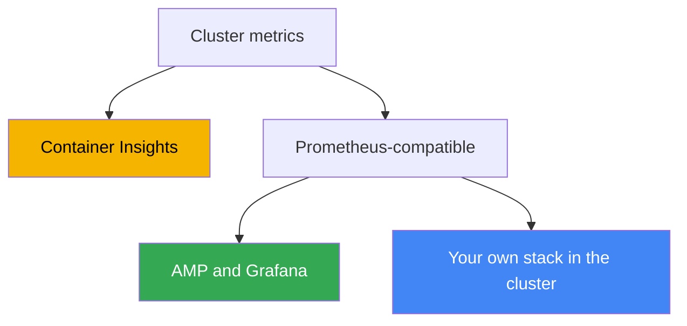
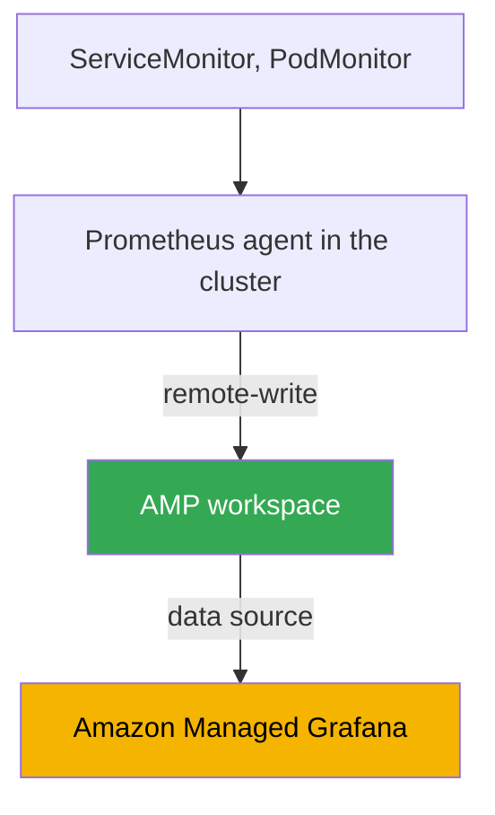

[Русская версия](ru.md) · [Versión en español](es.md) · [Version française](fr.md) · [Deutsche Version](de.md) · [ქართული ვერსია](ge.md) · [繁體中文版](tw.md) · [日本語版](jp.md)
# Chapter 33. Metrics: Container Insights, Managed Prometheus and Grafana, kube-prometheus-stack

> **What comes next.** Part 6 is about observability: how to understand what is happening inside the cluster and
> workloads. We start with metrics: numerical time series about node, pod, and control plane utilization. Logs
> (Fluent Bit, CloudWatch Logs, OpenSearch) are in Chapter 34; application autoscaling by metrics (HPA, external
> metrics, KEDA) is in Chapter 35; distributed tracing through ADOT and X-Ray is in Chapter 36; cost accounting
> and optimization with Kubecost and OpenCost are in Chapter 43. This chapter has one focus: where metrics come
> from in EKS, where they are stored, and how to view them.

## 33.1. "kubectl top fails, HPA does not work, and cluster utilization is invisible"

The cluster has just been deployed, workloads are rolling out, and everything appears to work. The first question
from the on-call engineer is: "how much CPU and memory are nodes and pods consuming right now?" We check with the
usual command and hit a wall:

```bash
kubectl top nodes
# error: Metrics API not available

kubectl top pods -A
# error: Metrics API not available
```

There are no metrics at all. `kubectl top` returns neither nodes nor pods. An HPA configured for CPU stays at
`<unknown>/50%` and does not scale anything because it has nowhere to obtain current utilization. There is no way
to answer the question "is the cluster loaded, is it time to add nodes?": there is nothing to plan capacity from,
and degradation under load is visible only through user complaints.

The reason is that EKS is a managed control plane and does not provide application metrics by itself. Unlike many
self-managed clusters, where someone installed metrics-server and a monitoring stack in advance, a fresh EKS
cluster has neither: AWS is responsible for operating the API server, scheduler, and controller manager, but
collecting, storing, and displaying node and pod metrics is your task. The control plane exposes only a basic set
of its own metrics (covered below); everything else must be built.

Next, we will cover three things: the basic metrics-server layer that fixes `kubectl top` and HPA; three ways
full metrics are collected and stored in EKS (Container Insights, Amazon Managed Prometheus, and self-managed
kube-prometheus-stack); and what is worth monitoring in the cluster.

## 33.2. metrics-server: the basic layer for kubectl top and HPA

The first component installed in a new cluster is **metrics-server**. This Kubernetes component collects resource
utilization metrics (CPU and memory) from every node's kubelet and exposes them through the Kubernetes Metrics API
(`metrics.k8s.io`). `kubectl top` and Horizontal Pod Autoscaler read this API when scaling on resource metrics.

It is important to understand its boundaries. metrics-server is **not a storage system**: it keeps only the latest
values in memory, with no history, retention, queries for last week, or alerting. Its job is to provide "here and
now" data for two consumers: `kubectl top` and HPA (the connection between HPA and metrics is covered in Chapter
35). Dashboards, trends, and alerts require a full metrics stack, discussed below.

metrics-server is not installed in EKS by default; install it separately. There are several methods:

```bash
# as a community add-on through EKS Add-ons
aws eks create-addon --cluster-name my-cluster --addon-name metrics-server

# or with the upstream manifest
kubectl apply -f https://github.com/kubernetes-sigs/metrics-server/releases/latest/download/components.yaml
```

After installation, `kubectl top nodes` starts reporting utilization, and HPA based on CPU and memory comes to
life. But this is only the foundation: metrics-server answers the immediate question, while the three approaches
below provide history, dashboards, and alerts.

## 33.3. Three metrics paths in EKS

Full metrics collection in EKS is usually built in one of three ways. They differ in who manages storage and
collection, and in how AWS-native or Kubernetes-native they are.



A short overview of each, followed by details in the next sections:

- **CloudWatch Container Insights**: the AWS-native path. An agent in the cluster collects metrics and sends them
  to CloudWatch, where the dashboards and alarms also live. AWS manages everything.
- **Amazon Managed Service for Prometheus (AMP)**: a managed Prometheus-compatible backend. You collect metrics
  (with a managed collector or ADOT), write them to a workspace through remote-write, query with PromQL, and use
  Amazon Managed Grafana for dashboards.
- **kube-prometheus-stack**: self-managed Prometheus, Grafana, and Alertmanager inside the cluster through Helm.
  You have full control, but storage and operations are your responsibility.

These paths are not mutually exclusive: a hybrid is common, as described in the comparison section. Let us cover
them in order.

## 33.4. CloudWatch Container Insights

**Container Insights** is a way to monitor EKS using CloudWatch. An agent inside the cluster collects node, pod,
namespace, and cluster metrics, sends them to CloudWatch, and displays them on ready-made dashboards; CloudWatch
alarms are built on top of them.

It is installed with a single EKS add-on: **amazon-cloudwatch-observability**. It deploys the CloudWatch
Observability Operator, which installs the CloudWatch agent and enables Container Insights **with enhanced
observability**. Enhanced observability provides more detailed metrics, including a breakdown by pod and
container, and helps show the full picture on managed nodes and Fargate without manual agent configuration. The
same add-on enables CloudWatch Application Signals for application-level APM.

```bash
# enable Container Insights with the managed EKS add-on
aws eks create-addon \
  --cluster-name my-cluster \
  --addon-name amazon-cloudwatch-observability
```

What it provides out of the box:

- **Node, pod, namespace, and cluster metrics**: CPU, memory, network, and disk in the `ContainerInsights`
  CloudWatch namespace, with ready-made dashboards.
- **Free basic control plane metrics.** Separate from the add-on, CloudWatch provides a set of vended metrics in
  the `AWS/EKS` namespace (API server, scheduler, and other metrics) for clusters version `1.28` and later,
  without installing anything.
- **AWS integration.** Alarms, composite alarms, delivery to SNS, and integration with other AWS metrics all live
  in a single console, with no separate stack.

The pricing model is volume-based: you pay for ingested and stored metrics and for queries, plus logs if their
collection is enabled (logs are covered in Chapter 34). Container Insights is a good choice when you already live
in CloudWatch and do not want to operate your own Prometheus: minimal operations and everything is managed. The
trade-off is being tied to CloudWatch's data model and query language: there is no PromQL here.

## 33.5. Amazon Managed Prometheus and Managed Grafana

If the team thinks in Prometheus and PromQL terms but does not want to operate and scale its own Prometheus, use
**Amazon Managed Service for Prometheus (AMP)**, a managed Prometheus-compatible backend. You do not run a
server: AMP provides a **workspace**, an isolated metrics store with a Prometheus-compatible API. Data arrives
through **remote-write**, and queries use PromQL. AWS handles scaling and retention.

Metrics can be collected into a workspace in two ways:

- **AWS managed collector (scraper)**: a fully managed agentless collector. It discovers and pulls
  Prometheus-compatible metrics from the EKS cluster and writes them to the workspace through `remote_write`.
  There is nothing to install or patch in the cluster; the scraper creates ENIs in the specified subnets and uses
  a VPC endpoint, so traffic does not traverse the internet.
- **Customer managed collector**: your own collector in the cluster, most often an ADOT collector (AWS
  Distribution for OpenTelemetry) or Prometheus in agent mode configured to remote-write to the workspace. This
  provides more control over what is scraped and how, but you operate the collector.

The AWS managed policy `AmazonPrometheusRemoteWriteAccess` grants write permissions (through IRSA or Pod Identity,
Chapters 16-17). View the write endpoint and workspace ID as follows:

```bash
# workspaces and their state
aws amp list-workspaces --output table

# remote-write endpoint of a specific workspace
aws amp describe-workspace --workspace-id ws-xxxxxxxx \
  --query "workspace.prometheusEndpoint" --output text
```

AMP is storage and a query engine, not dashboards. For visualization, use **Amazon Managed Grafana (AMG)**, a
managed Grafana. AMG adds AMP as a data source (in new versions, through AWS data source configuration with a
service-managed IAM role, so permissions are granted automatically), while user access to the workspace is
configured through **IAM Identity Center** (SSO). The resulting chain is: a managed collector collects, AMP stores
and responds to PromQL, AMG draws dashboards, and you operate none of the components yourself.

## 33.6. Self-managed kube-prometheus-stack

The third path is to install the entire Prometheus stack inside the cluster yourself. The de facto standard is the
**kube-prometheus-stack** Helm chart, which deploys Prometheus Operator, Prometheus, Grafana, Alertmanager,
node-exporter, and kube-state-metrics together.

The **Prometheus Operator** plays the key role: it introduces CRDs that describe scrape configuration
declaratively, in the Kubernetes style, without editing a monolithic `prometheus.yml`:

- **ServiceMonitor**: "scrape endpoints behind this Service"; the usual way to connect application metrics by
  label selector.
- **PodMonitor**: the same, but directly by pods without a Service.
- **PrometheusRule**: alerting rules and recording rules for Alertmanager.

```bash
# install the stack in the cluster
helm repo add prometheus-community https://prometheus-community.github.io/helm-charts
helm install kube-prometheus-stack prometheus-community/kube-prometheus-stack \
  -n monitoring --create-namespace
```

Metric volume is both cost and backend load, so high-cardinality metrics and labels are discarded at scrape time,
before ingestion and remote-write to AMP. This is done through `metric_relabel_configs` in the Prometheus scrape
config; in ServiceMonitor and PodMonitor, the field is `metricRelabelings`:

```yaml
metric_relabel_configs:
  # drop an entire high-cardinality metric by name
  - source_labels: [__name__]
    regex: apiserver_request_duration_seconds_bucket
    action: drop
  # remove an unnecessary high-cardinality label that inflates the series count
  - action: labeldrop
    regex: (pod_uid|container_id)
```

Without this cleanup, the number of time series grows without control, along with the cost of ingestion and
storage in a managed backend and the load on local Prometheus.

The advantage of this approach is full control and portability: the same chart and the same ServiceMonitor work in
any Kubernetes, not just EKS, without AWS lock-in. The drawback is that all operations are your responsibility:
storage and retention (you need PVs, and must calculate their size and retention period), high availability and
federation as you grow, upgrades, and resources for Prometheus itself, which consumes considerable memory in a
large cluster. AMP removes exactly these concerns.

## 33.7. Comparison of the three approaches and the hybrid

The choice comes down to how much operations work you are ready to take on and how much you need PromQL and
portability.

| Criterion | Container Insights | Managed Prometheus (AMP) | kube-prometheus-stack |
|---|---|---|---|
| Who manages it | AWS | AWS (storage) | you |
| Query language | CloudWatch, no PromQL | PromQL | PromQL |
| Dashboards | CloudWatch | Amazon Managed Grafana | Grafana in the cluster |
| Collection | CloudWatch agent (add-on) | managed collector or ADOT | Prometheus in the cluster |
| Storage and retention | CloudWatch, managed | workspace, managed | your PVs, your responsibility |
| Operations | minimal | low | high |
| Lock-in | to CloudWatch | Prometheus-compatible | portable |
| When to use it | you live in CloudWatch | you need PromQL without your own server | you need full control |

The approaches can be combined. A common hybrid is **AMP as storage + kube-prometheus-stack for scraping + AMG
for dashboards**. Prometheus Operator and ServiceMonitor remain the familiar way to describe collection, local
Prometheus runs in agent mode and sends data to AMP through remote-write, while the managed workspace takes over
long-term storage, HA, and scale. This retains the Kubernetes-native configuration model while removing the
heaviest part, metric storage, from your responsibilities.



Another option is a managed collector instead of your own Prometheus: then none of the stack runs in the cluster,
and collection, storage, and queries are entirely on the AWS side. This is the most managed route to PromQL.

### Total cost of ownership: what you pay for in each case

"Your own Prometheus is free" is this chapter's main misconception. You pay in both cases; the cost items are
simply different, and those should be compared rather than the presence of an AWS bill.

| Cost item | Your own stack (Prometheus, Grafana) | AMP plus AMG |
|---|---|---|
| Metrics ingestion | node resources for scraping | charged by ingested sample volume |
| Storage | EBS volumes: retention volume plus headroom | charged by metric volume, elastic |
| Queries | Prometheus CPU and memory; heavy PromQL can overwhelm it | processed samples are charged |
| High availability | two replicas plus deduplication, therefore double spending | inside the service |
| Dashboards | Grafana is free, but upgrades and backups are yours | charged for active users |
| Labor | upgrades, sharding as you grow, on-call work | minimal |

Three more points break intuition when estimating cost. First: AMP's main billing driver is **data ingestion**, not
storage; therefore reducing retention to save money is almost pointless, while the effective levers are scraping
less often (`scrape_interval`) and collecting less by filtering unnecessary series with `relabel_config`. Second:
**queries are also billable**, and alerts are queries too, so native AMP alerting is more economical than external
alerting: highly available alerting in Grafana queries data across multiple Availability Zones and multiplies query
cost. Third, common to both options: **cardinality**. A label with a unique value per request or per pod turns a
dozen series into millions, and in a managed service this appears on the bill, while in your own stack it appears
as Prometheus being OOMKilled. Neither problem is solved by choosing a vendor; both are addressed by label
discipline (sizing is covered in Chapter 14; full cost is covered in Chapter 43).

### Long retention: Thanos, Mimir, VictoriaMetrics

A separate problem is why a self-managed stack grows into something larger: local Prometheus is not designed for a
year of history. Retention runs into disk limits, and vertical instance growth eventually ends. The industry's
answer is to move history into object storage.

**Thanos** is the best-known set for this, and it is a set of components rather than a single service:

- **sidecar** next to Prometheus uploads completed TSDB blocks to S3;
- **store gateway** serves historical data by reading blocks from the bucket and caching the index;
- **compactor** merges small blocks, performs downsampling, and applies retention;
- **querier** serves PromQL over all sources at once and deduplicates data from HA pairs;
- **ruler** evaluates rules and alerts over historical data.

The benefit is that local Prometheus keeps hours or days rather than weeks: expensive EBS volumes and memory are
saved, while history lives in S3. The trade-off is four to six new components to upgrade and operate, plus object
storage queries and caches in front of it. **Grafana Mimir** (an evolution of Cortex ideas) solves the same class
of problems if you want a single system rather than a collection of components.

**VictoriaMetrics** is another approach to the same task: it is not an extension to Prometheus but a storage
replacement. Data is accepted by `vmagent` (or your Prometheus in remote-write mode), stored by `vmsingle` on one
node or by a cluster of `vminsert`, `vmstorage`, and `vmselect`; `vmalert` evaluates alerts; and retention is set
with a single `-retentionPeriod` flag. The MetricsQL query language is compatible with PromQL and adds its own
functions, and Grafana dashboards work unchanged. There are fewer components than with Thanos, but history is on
disks rather than S3, so disks and their growth remain your responsibility. The usual reason to move is lower CPU
and memory use for the same data; verify this with your own workload rather than taking it on faith.

In AWS terms, AMP solves the same problem without any components at all. Use Thanos, Mimir, and VictoriaMetrics
when you need control of storage, multicloud, or your own economics at very large volumes.

## 33.8. What to monitor in EKS

The tool is half the task; the other half is which metrics to collect. Guidelines for a cluster:

- **Node metrics.** CPU, memory, disk (including filesystem saturation under `/var/lib/kubelet` and the root
  filesystem), and network. These are exposed by node-exporter (in kube-prometheus-stack) or the CloudWatch
  agent. They reveal resource shortages that lead to pod eviction and `Node Pressure`.
- **Pod and container metrics.** CPU and memory consumption against requests and limits, restarts, and OOMKilled.
  They reveal incorrect sizing (Chapter 14) and leaks.
- **Control plane metrics.** API server (latency, error rate, throttling), scheduler, and controller manager. Some
  are provided free in the `AWS/EKS` namespace (version `1.28` and later), while the AMP managed collector can
  scrape API server, kube-scheduler, and kube-controller-manager metrics directly.
- **kube-state-metrics.** A separate component that exposes Kubernetes object state: how many pods are `Pending`,
  whether a Deployment is ready, whether a Job is stuck, and whether the number of replicas matches the desired
  count. This is not resource utilization but API object state; without it, the picture is incomplete.

Two methods help turn a set of metrics into meaningful monitoring. **USE** (for resources: Utilization, Saturation,
Errors) examines every resource through utilization, saturation, and errors; it is suitable for nodes and
infrastructure. **RED** (for services: Rate, Errors, Duration) covers request rate, error ratio, and response
time; it is suitable for applications. In practice, combine them: USE for hardware and nodes, RED for workloads
on top.

## 33.9. How this is used in production

- **Install metrics-server immediately.** It is the first component of a new cluster: without it, `kubectl top`
  and HPA do not work, and these are basic operational hygiene.
- **Choose one primary metrics backend and do not multiply stacks.** Use either CloudWatch Container Insights (if
  you live in the AWS console) or a Prometheus-compatible path (AMP or self-managed); two parallel stacks mean
  double the cost and double the operations.
- **Prefer managed to self-managed unless there is a reason not to.** AMP and AMG remove storage, HA, and scale;
  use your own kube-prometheus-stack for full control, air-gapped environments, or portability across clouds.
- **The AMP + Prometheus agent + AMG hybrid is a common compromise.** Kubernetes-native collection configuration
  through ServiceMonitor, without the concerns of metric storage.
- **Always install kube-state-metrics.** Without object state (`Pending`, restarts), monitoring sees utilization
  but does not see that "something is not deploying."
- **Control metric volume through `metric_relabel_configs`.** Drop high-cardinality metrics and labels before
  ingestion and remote-write; otherwise backend cost and load grow.
- **Connect metrics to alerts immediately.** A dashboard that no one watches is useless; route key signals (a node
  under pressure, rising API server errors, OOMKilled) to CloudWatch alarms or Alertmanager.

## 33.10. Mini-glossary

- **metrics-server**: a component that collects CPU and memory from kubelet and exposes them through the Metrics
  API for `kubectl top` and HPA; it has no history or storage.
- **Metrics API (`metrics.k8s.io`)**: the Kubernetes API for current resource metrics, the source for `kubectl
  top` and HPA based on resource metrics.
- **Container Insights**: EKS monitoring through CloudWatch: an agent collects node and pod metrics, while
  dashboards and alarms are in CloudWatch.
- **amazon-cloudwatch-observability**: a managed EKS add-on that installs the CloudWatch agent and enables
  Container Insights with enhanced observability.
- **Amazon Managed Service for Prometheus (AMP)**: a managed Prometheus-compatible backend; workspace,
  remote-write, PromQL, and retention are handled by AWS.
- **workspace**: an isolated AMP metrics store with its own remote-write endpoint and Prometheus-compatible API.
- **managed collector (scraper)**: AMP's managed agentless collector, which scrapes EKS metrics and writes them to
  a workspace through remote-write.
- **Amazon Managed Grafana (AMG)**: managed Grafana; connects AMP as a data source, with user access through IAM
  Identity Center.
- **kube-prometheus-stack**: a Helm chart containing Prometheus Operator, Prometheus, Grafana, Alertmanager,
  node-exporter, and kube-state-metrics.
- **ServiceMonitor, PodMonitor**: Prometheus Operator CRDs that declaratively describe which endpoints to scrape.
- **kube-state-metrics**: a component that exposes Kubernetes object state (`Pending`, replicas, restarts) as
  metrics.
- **Thanos**: a collection of components that adds long-term object-storage retention to Prometheus: `sidecar`
  uploads blocks to S3, `store gateway` reads them back, `compactor` compacts, downsampling, and applies retention,
  `querier` provides unified PromQL and HA-pair deduplication, and `ruler` evaluates rules over history. **Grafana
  Mimir** solves the same class of problems.
- **VictoriaMetrics**: a metric storage replacement rather than an extension: `vmagent` for collection,
  `vmsingle` or a `vminsert`/`vmstorage`/`vmselect` cluster, `vmalert` for rules, retention through
  `-retentionPeriod`, and MetricsQL as a PromQL extension. It has fewer components than Thanos, but history lives
  on disks rather than in object storage.
- **metric_relabel_configs**: a scrape-config section (`metricRelabelings` in ServiceMonitor) that drops
  high-cardinality metrics (`drop` by `__name__`) and labels (`labeldrop`) before ingestion and remote-write; a
  tool for controlling volume and cost.

## 33.11. Chapter summary

- A fresh EKS cluster has no metrics: `kubectl top` fails with "Metrics API not available," HPA does not scale,
  and cluster utilization is invisible. AWS manages the control plane and does not itself provide application
  metrics.
- metrics-server is the basic layer: it exposes current CPU and memory through the Metrics API for `kubectl top`
  and HPA. It is not storage, provides neither history nor alerts, and is installed separately.
- Full metrics are built through one of three paths: CloudWatch Container Insights, Amazon Managed Prometheus, or
  self-managed kube-prometheus-stack.
- Container Insights is AWS-native, installed with the amazon-cloudwatch-observability add-on (with enhanced
  observability), with dashboards and alarms in CloudWatch, volume-based pricing, and no PromQL.
- AMP is a managed Prometheus-compatible backend: workspace, remote-write, PromQL; collection through a managed
  collector or ADOT; dashboards in Amazon Managed Grafana with access through IAM Identity Center.
- kube-prometheus-stack provides full control and portability (Prometheus Operator, ServiceMonitor, PodMonitor),
  but storage, retention, HA, and scale become your responsibility.
- A common hybrid is AMP as storage, kube-prometheus-stack for scraping, and AMG for dashboards: Kubernetes-native
  configuration without storage concerns.
- Monitor nodes, pods, the control plane, and object state through kube-state-metrics; USE (for resources) and RED
  (for services) help provide structure.

## 33.12. How this helps in real work

During an incident, metrics are the first thing an on-call engineer reaches for: is the node loaded, is the pod
hitting its limit, is API server latency rising? If `kubectl top` is silent and there are no dashboards, incident
analysis becomes guesswork. Therefore, the basic layer (metrics-server) and at least one metrics backend should be
in place before the first serious incident, not after it. Knowing how metrics are collected in your cluster tells
you immediately where to look: CloudWatch, Grafana over AMP, or local Grafana.

When planning, the key decision is which backend to use as the foundation and how not to spread across several
parallel ones. The managed path (Container Insights or AMP plus AMG) makes sense when you do not want a team
dedicated to operating Prometheus; self-managed makes sense when full control or portability is required. Cost for
all paths grows with metric volume, so decide in advance what to collect and at what granularity: collecting
everything is expensive both in managed backends and on your own PVs. Metrics then support autoscaling (Chapter
35) and cost accounting (Chapter 43).

## 33.13. Self-check questions

1. Why does `kubectl top nodes` fail with "Metrics API not available" in a fresh EKS cluster?
2. What does metrics-server do, and why is it called a basic layer rather than monitoring?
3. Who reads the Metrics API besides `kubectl top`, and how does this relate to HPA?
4. What three paths exist for collecting and storing metrics in EKS, and how do they fundamentally differ?
5. Which add-on enables Container Insights, and what does enhanced observability provide?
6. What are the basic metrics in the `AWS/EKS` namespace, and from which cluster version are they free?
7. What is a workspace in AMP, and how do metrics get into it?
8. How does a managed collector (scraper) differ from a customer managed collector using ADOT?
9. How is AMP connected to Amazon Managed Grafana, and how is user access configured?
10. What does kube-prometheus-stack deploy, and what is Prometheus Operator responsible for?
11. Why are ServiceMonitor and PodMonitor needed, and why are they more convenient than editing configuration
    manually?
12. How does the AMP plus kube-prometheus-stack plus AMG hybrid work, and what does it provide?
13. What should be monitored in EKS, and what is the difference between the USE and RED methods?
14. Which cost items make up the price of your own metrics stack and of AMP with AMG? Why does reducing retention
    in AMP barely reduce the bill, and which levers work instead?
15. Why does Prometheus need Thanos, what does each of its components do, and what do you pay for it?
16. How does VictoriaMetrics differ from Prometheus plus Thanos in composition and storage?

## Practice

The course lab for this topic is [Lab 114: Observability: Container Insights and Managed Prometheus with
Grafana](../../labs/114/README.MD). Besides it, you can easily inspect the current state of metrics in a live
cluster. First, check whether the basic layer is present and whether the Metrics API responds:

```bash
# does kubectl top work (meaning metrics-server is installed)?
kubectl top nodes
kubectl top pods -A

# are metrics-server and Metrics API present?
kubectl get deploy -n kube-system metrics-server
kubectl get apiservice v1beta1.metrics.k8s.io
```

If `kubectl top` fails, metrics-server is not installed, and it is the first installation candidate. Then check
which metrics backend is already connected. Inspect EKS add-ons and monitoring workloads in the cluster:

```bash
# is the Container Insights and/or metrics-server add-on enabled?
aws eks list-addons --cluster-name my-cluster --output table

# the Prometheus stack in the cluster, if present
kubectl get pods -n monitoring
kubectl get servicemonitors,podmonitors -A
```

Check whether a Prometheus-compatible backend exists on the AWS side: AMP workspaces in the Region:

```bash
# Amazon Managed Prometheus workspaces and their state
aws amp list-workspaces --output table
```

Finally, use the Kubernetes API to get the raw output of the metrics endpoint exposed by metrics-server:

```bash
# raw metrics from metrics-server through the API
kubectl get --raw "/apis/metrics.k8s.io/v1beta1/nodes" | head -c 400
```

Compare the picture: is the basic layer (metrics-server) present, is there long-term storage (Container Insights,
AMP, or your own Prometheus), and are alerts configured? Close gaps in this chain before the first serious
incident.

---
[Table of contents](../README.md) · [Chapter 32](../32/en.md) · [Chapter 34](../34/en.md)
