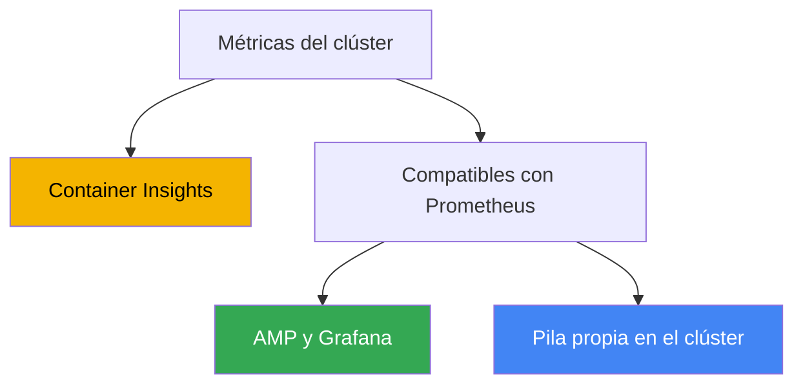
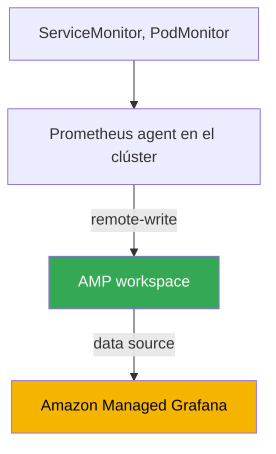

[Eng version](en.md) · [Русская версия](ru.md) · [Version française](fr.md) · [Deutsche Version](de.md) · [ქართული ვერსია](ge.md) · [繁體中文版](tw.md) · [日本語版](jp.md)
# Capítulo 33. Métricas: Container Insights, Managed Prometheus y Grafana, kube-prometheus-stack

> **Qué sigue.** La parte 6 trata de observabilidad: cómo entender lo que ocurre dentro del clúster y las
> cargas de trabajo. Empezamos por las métricas: series temporales numéricas sobre la utilización de nodos,
> pods y el control plane. Los logs (Fluent Bit, CloudWatch Logs, OpenSearch) se tratan en el capítulo 34;
> el autoescalado de aplicaciones por métricas (HPA, métricas externas, KEDA), en el capítulo 35; el tracing
> distribuido mediante ADOT y X-Ray, en el capítulo 36; y la contabilidad y optimización de costes con
> Kubecost y OpenCost, en el capítulo 43. Este capítulo tiene un único enfoque: de dónde salen las métricas
> en EKS, dónde se almacenan y con qué verlas.

## 33.1. «kubectl top falla, HPA no funciona y la utilización del clúster no es visible»

El clúster acaba de desplegarse, las cargas de trabajo están lanzándose y parece que todo funciona. La primera
pregunta del ingeniero de guardia es: «¿cuánta CPU y memoria consumen ahora mismo los nodos y pods?». Lo
comprobamos con el comando habitual y nos topamos con una pared:

```bash
kubectl top nodes
# error: Metrics API not available

kubectl top pods -A
# error: Metrics API not available
```

No hay métricas en absoluto. `kubectl top` no devuelve ni nodos ni pods. Un HPA configurado para CPU se queda
en estado `<unknown>/50%` y no escala nada porque no tiene de dónde obtener la utilización actual. No hay forma
de responder a «¿está cargado el clúster, es hora de añadir nodos?»: no hay base para planificar la capacidad y
la degradación bajo carga solo se ve por las quejas de los usuarios.

La razón es que EKS es un control plane gestionado y no proporciona por sí mismo métricas de las aplicaciones.
A diferencia de muchos clústeres self-managed, donde alguien instaló previamente metrics-server y una pila de
monitorización, un EKS recién creado no tiene ninguno de los dos: AWS se responsabiliza de operar el API server,
el scheduler y el controller manager, pero recopilar, almacenar y mostrar las métricas de nodos y pods es tarea
tuya. El control plane solo expone un conjunto básico de sus propias métricas (se trata más abajo); todo lo
demás hay que construirlo.

A continuación veremos tres cosas: la capa básica metrics-server, que arregla `kubectl top` y HPA; tres formas
de recopilar y almacenar métricas completas en EKS (Container Insights, Amazon Managed Prometheus y
kube-prometheus-stack self-managed); y qué merece la pena monitorizar en el clúster.

## 33.2. metrics-server: la capa básica para kubectl top y HPA

Lo primero que se instala en un clúster nuevo es **metrics-server**. Es un componente de Kubernetes que recopila
métricas de utilización de recursos (CPU y memoria) del kubelet de cada nodo y las expone mediante Kubernetes
Metrics API (`metrics.k8s.io`). De esta API leen `kubectl top` y Horizontal Pod Autoscaler cuando escalan por
resource metrics.

Es importante entender sus límites. metrics-server **no es un almacenamiento**: solo conserva en memoria los
valores más recientes, sin historial, sin retention, sin consultas de la semana pasada ni alertas. Su función es
dar datos «aquí y ahora» a dos consumidores: `kubectl top` y HPA (la relación entre HPA y las métricas se trata
en el capítulo 35). Para dashboards, tendencias y alertas se necesita una pila completa de métricas, que veremos
más adelante.

metrics-server no se instala por defecto en EKS; hay que instalarlo aparte. Hay varias formas:

```bash
# como community add-on mediante EKS Add-ons
aws eks create-addon --cluster-name my-cluster --addon-name metrics-server

# o con el manifiesto upstream
kubectl apply -f https://github.com/kubernetes-sigs/metrics-server/releases/latest/download/components.yaml
```

Tras instalarlo, `kubectl top nodes` empieza a informar de la utilización y el HPA basado en CPU y memoria cobra
vida. Pero esto es solo el fundamento: metrics-server responde a la necesidad inmediata, mientras que los tres
enfoques siguientes proporcionan historial, dashboards y alertas.

## 33.3. Tres caminos para las métricas en EKS

La recopilación completa de métricas en EKS suele construirse de una de tres formas. Se diferencian por quién
administra el almacenamiento y la recopilación, y por cuánto tienen de AWS-native o Kubernetes-native.



Un resumen de cada uno, seguido de los detalles en las secciones siguientes:

- **CloudWatch Container Insights**: el camino AWS-native. Un agente en el clúster recopila métricas y las envía
  a CloudWatch, donde también están los dashboards y las alarmas. AWS administra todo.
- **Amazon Managed Service for Prometheus (AMP)**: un backend gestionado compatible con Prometheus. Recopilas
  métricas (con un managed collector o ADOT), las escribes en un workspace mediante remote-write, consultas con
  PromQL y usas Amazon Managed Grafana para los dashboards.
- **kube-prometheus-stack**: Prometheus, Grafana y Alertmanager self-managed dentro del clúster mediante Helm.
  Tienes control total, pero el almacenamiento y la operación son tu responsabilidad.

Estos caminos no se excluyen mutuamente: es frecuente un híbrido, que se describe en la sección de comparación.
Veámoslos en orden.

## 33.4. CloudWatch Container Insights

**Container Insights** es una forma de monitorizar EKS mediante CloudWatch. Un agente dentro del clúster recopila
métricas de nodos, pods, namespace y clúster, las envía a CloudWatch y las muestra en dashboards preparados; por
encima se construyen CloudWatch alarms.

Se instala con un único add-on de EKS: **amazon-cloudwatch-observability**. Despliega CloudWatch Observability
Operator, que instala CloudWatch agent y habilita Container Insights **with enhanced observability**. Enhanced
observability proporciona métricas más detalladas, incluida la desagregación por pods y contenedores, y en nodos
gestionados y Fargate ayuda a ver la situación sin configurar manualmente el agente. El mismo add-on habilita
CloudWatch Application Signals para el nivel APM de las aplicaciones.

```bash
# habilitar Container Insights mediante el add-on gestionado de EKS
aws eks create-addon \
  --cluster-name my-cluster \
  --addon-name amazon-cloudwatch-observability
```

Lo que proporciona de fábrica:

- **Métricas de nodos, pods, namespace y clúster**: CPU, memoria, red y disco, en el namespace
  `ContainerInsights` de CloudWatch, con dashboards preparados.
- **Métricas básicas de control plane gratuitas.** Aparte del add-on: en clústeres de versión `1.28` o superior,
  CloudWatch expone un conjunto de métricas vended en el namespace `AWS/EKS` (métricas del API server, scheduler
  y otros), sin instalar nada.
- **Integración con AWS.** Alarmas, alarmas compuestas, envío a SNS y conexión con otras métricas de AWS: todo
  en una sola consola, sin una pila independiente.

El modelo de coste es por volumen: se paga por las métricas ingeridas (ingested) y almacenadas, y por las
consultas, además de los logs si se habilita su recopilación (los logs se tratan en el capítulo 34). Container
Insights es adecuado cuando ya vives en CloudWatch y no quieres mantener tu propio Prometheus: operación mínima
y todo gestionado. A cambio, quedas ligado a CloudWatch como modelo de datos y lenguaje de consultas: aquí no hay
PromQL.

## 33.5. Amazon Managed Prometheus y Managed Grafana

Si el equipo piensa en términos de Prometheus y PromQL, pero no quiere mantener ni escalar su propio Prometheus,
existe **Amazon Managed Service for Prometheus (AMP)**, un backend gestionado compatible con Prometheus. No
levantas un servidor: AMP proporciona un **workspace**, un almacenamiento aislado de métricas con una API
compatible con Prometheus, al que los datos llegan mediante **remote-write** y que se consulta con PromQL. El
escalado y la retention corren a cargo de AWS.

Las métricas se pueden recopilar en el workspace de dos formas:

- **AWS managed collector (scraper)**: un recopilador totalmente gestionado y sin agentes. Descubre y extrae por
  sí mismo métricas compatibles con Prometheus del clúster EKS y las escribe en el workspace mediante
  `remote_write`. No hay que instalar ni parchear nada en el clúster; el scraper crea una ENI en las subredes
  indicadas y se conecta a través de VPC endpoint, por lo que el tráfico no sale a Internet.
- **Customer managed collector**: un recopilador propio en el clúster, normalmente ADOT collector (AWS
  Distribution for OpenTelemetry) o Prometheus en modo agent, configurado para hacer remote-write al workspace.
  Hay más control sobre qué se scrapea y cómo, pero la operación del recopilador es responsabilidad tuya.

Los permisos de escritura los proporciona la policy gestionada de AWS `AmazonPrometheusRemoteWriteAccess` (mediante
IRSA o Pod Identity, capítulos 16-17). El endpoint de escritura y el ID del workspace se consultan así:

```bash
# lista de workspaces y su estado
aws amp list-workspaces --output table

# endpoint remote-write de un workspace concreto
aws amp describe-workspace --workspace-id ws-xxxxxxxx \
  --query "workspace.prometheusEndpoint" --output text
```

AMP es el almacenamiento y el motor de consultas, pero no los dashboards. Para visualizar se usa **Amazon Managed
Grafana (AMG)**, un Grafana gestionado. AMG añade AMP como data source (en versiones nuevas, mediante AWS data
source configuration con un rol IAM service-managed, de modo que los permisos se conceden automáticamente), y el
acceso de los usuarios al workspace se configura mediante **IAM Identity Center** (SSO). El resultado es una
cadena: managed collector recopila, AMP almacena y responde a PromQL, AMG dibuja los dashboards, y no operas tú
ninguno de los componentes.

## 33.6. Self-managed kube-prometheus-stack

El tercer camino consiste en instalar por cuenta propia toda la pila Prometheus dentro del clúster. El estándar de
facto es el chart de Helm **kube-prometheus-stack**, que despliega de una vez Prometheus Operator, Prometheus,
Grafana, Alertmanager, node-exporter y kube-state-metrics.

El papel clave lo desempeña **Prometheus Operator**: introduce CRD con los que la configuración de scrape se
describe de forma declarativa, al estilo Kubernetes, sin modificar un `prometheus.yml` monolítico:

- **ServiceMonitor**: «scrapear endpoints detrás de tal Service»; la forma típica de conectar métricas de una
  aplicación mediante un selector de labels.
- **PodMonitor**: lo mismo, pero directamente por pods, sin Service.
- **PrometheusRule**: reglas de alertas y recording rules para Alertmanager.

```bash
# instalar la pila en el clúster
helm repo add prometheus-community https://prometheus-community.github.io/helm-charts
helm install kube-prometheus-stack prometheus-community/kube-prometheus-stack \
  -n monitoring --create-namespace
```

El volumen de métricas implica coste y carga para el backend, por lo que las métricas y labels de alta cardinalidad
se descartan ya durante el scrape, antes de escribir y antes de hacer remote-write a AMP. Esto se hace con
`metric_relabel_configs` en la scrape config de Prometheus; en ServiceMonitor y PodMonitor el campo es
`metricRelabelings`:

```yaml
metric_relabel_configs:
  # descartar por completo una métrica de alta cardinalidad por nombre
  - source_labels: [__name__]
    regex: apiserver_request_duration_seconds_bucket
    action: drop
  # eliminar un label adicional de alta cardinalidad que infla el número de series
  - action: labeldrop
    regex: (pod_uid|container_id)
```

Sin esta limpieza, el número de series temporales crece sin control y, con él, el coste de ingesta y almacenamiento
en un backend gestionado y la carga del Prometheus local.

La ventaja de este enfoque es el control total y la portabilidad: el mismo chart y los mismos ServiceMonitor
funcionan en cualquier Kubernetes, no solo en EKS, sin dependencia de AWS. La desventaja es que toda la operación
recae sobre ti: almacenamiento y retention (se necesitan PV, y tú calculas su tamaño y periodo de conservación),
alta disponibilidad y federación al crecer, actualizaciones, y recursos para el propio Prometheus, que en un
clúster grande consume bastante memoria. Precisamente AMP elimina estas preocupaciones.

## 33.7. Comparación de los tres enfoques e híbrido

La elección se reduce a cuánta operación estás dispuesto a asumir y cuánto necesitas PromQL y portabilidad.

| Criterio | Container Insights | Managed Prometheus (AMP) | kube-prometheus-stack |
|---|---|---|---|
| Quién administra | AWS | AWS (almacenamiento) | tú |
| Lenguaje de consultas | CloudWatch, sin PromQL | PromQL | PromQL |
| Dashboards | CloudWatch | Amazon Managed Grafana | Grafana en el clúster |
| Recopilación | CloudWatch agent (add-on) | managed collector o ADOT | Prometheus en el clúster |
| Almacenamiento y retention | CloudWatch, gestionado | workspace, gestionado | tus PV, responsabilidad tuya |
| Operación | mínima | baja | alta |
| Dependencia | de CloudWatch | compatible con Prometheus | portable |
| Cuándo elegirlo | vives en CloudWatch | necesitas PromQL sin servidor propio | necesitas control total |

Los enfoques se combinan. Un híbrido frecuente es **AMP como almacenamiento + kube-prometheus-stack para el
scraping + AMG para los dashboards**. Prometheus Operator y ServiceMonitor siguen siendo la forma habitual de
describir la recopilación, el Prometheus local funciona en modo agent y envía los datos mediante remote-write a
AMP, mientras que el workspace gestionado se encarga del almacenamiento a largo plazo, HA y escala. Así conservas
el modelo Kubernetes-native de configuración, pero te quitas de encima la parte más pesada: almacenar métricas.



Otra opción es un managed collector en lugar de tu propio Prometheus: entonces no se ejecuta absolutamente nada
de la pila en el clúster y la recopilación, el almacenamiento y las consultas quedan por completo del lado de AWS.
Es el camino más gestionado hacia PromQL.

### Coste de propiedad: qué se paga en cada caso

«Mi propio Prometheus es gratis» es el principal error de esta lección. En ambos casos se paga; simplemente las
partidas son distintas y hay que compararlas, no la existencia de una factura de AWS.

| Partida | Pila propia (Prometheus, Grafana) | AMP más AMG |
|---|---|---|
| Ingesta de métricas | recursos de nodos para scraping | se paga el volumen de samples ingeridos |
| Almacenamiento | volúmenes EBS: capacidad para retention más margen | se paga el volumen de métricas, elástico |
| Consultas | CPU y memoria de Prometheus; PromQL pesado lo tumba | se pagan los samples procesados |
| Tolerancia a fallos | dos réplicas más deduplicación, es decir, gasto doble | dentro del servicio |
| Dashboards | Grafana es gratuito, pero actualizaciones y backup son tuyos | pago por usuarios activos |
| Trabajo | upgrades, sharding al crecer, guardias | mínimo |

Hay tres aspectos que rompen la intuición al calcular. Primero: en AMP, el principal factor de coste es la
**ingesta de datos**, no el almacenamiento; por eso reducir retention para ahorrar casi no tiene sentido, y las
palancas que funcionan son scrapear con menos frecuencia (`scrape_interval`) y recopilar menos, filtrando las
series innecesarias mediante `relabel_config`. Segundo: **las consultas también se pagan**, y las alertas también
son consultas, por lo que el alerting nativo de AMP resulta más rentable que uno externo: el alerting de alta
disponibilidad en Grafana consulta los datos desde varias zonas y multiplica el coste de las consultas. Tercero,
común a ambas opciones: la **cardinalidad**. Un label con un valor único por solicitud o por pod convierte decenas
de series en millones y, en un servicio gestionado, se ve en la factura; en una pila propia, en un OOMKilled de
Prometheus. Ambos problemas se resuelven no eligiendo proveedor, sino con disciplina en los labels (sizing en el
capítulo 14; coste completo en el capítulo 43).

### Retention prolongada: Thanos, Mimir, VictoriaMetrics

Hay otra tarea por la que la pila self-managed acaba convirtiéndose en algo mayor: el Prometheus local no está
pensado para un año de historial. La retention choca con el disco, y el crecimiento vertical de la instancia se
agota. La respuesta de la industria es mover el historial a almacenamiento de objetos.

**Thanos** es el conjunto más conocido para ello, y precisamente es un conjunto de componentes, no un único
servicio:

- **sidecar** junto a Prometheus sube bloques TSDB terminados a S3;
- **store gateway** sirve datos históricos, leyendo bloques del bucket y almacenando en caché el índice;
- **compactor** fusiona bloques pequeños, hace downsampling y aplica retention;
- **querier** responde a PromQL sobre todas las fuentes a la vez y deduplica los datos de pares HA;
- **ruler** calcula reglas y alertas sobre datos históricos.

La ventaja es que Prometheus conserva localmente horas o días en vez de semanas: se ahorran costosos volúmenes
EBS y memoria, mientras que el historial vive en S3. El precio son cuatro a seis componentes nuevos que hay que
actualizar y vigilar, además de consultas al almacenamiento de objetos y las cachés delante de él. **Grafana
Mimir** (una evolución de las ideas de Cortex) resuelve la misma clase de problemas si se prefiere un sistema en
lugar de una dispersión de componentes.

**VictoriaMetrics** es otra aproximación a la misma tarea: no una capa sobre Prometheus, sino un sustituto del
almacenamiento. Los datos los recibe `vmagent` (o tu Prometheus en modo remote-write), los almacena `vmsingle` en
un nodo o un clúster de `vminsert`, `vmstorage` y `vmselect`; `vmalert` calcula las alertas y la retention se
configura con un único flag, `-retentionPeriod`. El lenguaje de consultas MetricsQL es compatible con PromQL y
agrega sus propias funciones; los dashboards de Grafana funcionan sin cambios. Hay menos componentes que en
Thanos, pero el historial está en discos, no en S3, de modo que los discos y su crecimiento siguen siendo tu
responsabilidad. La razón habitual para migrar es un menor consumo de CPU y memoria para los mismos datos; debe
verificarse con tu propia carga, no aceptarse sin más.

En relación con AWS: AMP resuelve la misma tarea sin componentes en absoluto; Thanos, Mimir y VictoriaMetrics se
eligen cuando se necesita control sobre el almacenamiento, multicloud o una economía propia a volúmenes muy altos.

## 33.8. Qué monitorizar en EKS

La herramienta es la mitad del trabajo; la otra mitad es qué métricas recopilar. Referencias para el clúster:

- **Métricas de nodos.** CPU, memoria, disco (incluido el llenado del sistema de archivos de `/var/lib/kubelet` y
  el raíz) y red. Las proporcionan node-exporter (en kube-prometheus-stack) o CloudWatch agent. Aquí se detecta
  la escasez de recursos que provoca la expulsión de pods y `Node Pressure`.
- **Métricas de pods y contenedores.** Consumo de CPU y memoria frente a requests y limits, reinicios y OOMKilled.
  Muestran sizing incorrecto (capítulo 14) y fugas.
- **Métricas de control plane.** API server (latencia, frecuencia de errores, throttling), scheduler y controller
  manager. Una parte se proporciona gratuitamente en el namespace `AWS/EKS` (versión `1.28` o superior), y AMP
  managed collector puede scrapear directamente las métricas de API server, kube-scheduler y
  kube-controller-manager.
- **kube-state-metrics.** Un componente independiente que expone el estado de objetos de Kubernetes: cuántos pods
  están en `Pending`, si los Deployment están preparados, si un Job se ha quedado bloqueado, si el número de
  réplicas coincide con el deseado. No es utilización de recursos, sino el estado de los objetos de la API; sin
  ello la imagen está incompleta.

Dos metodologías ayudan a construir una monitorización con sentido a partir del conjunto de métricas. **USE**
(para recursos: Utilization, Saturation, Errors) analiza cada recurso mediante utilización, saturación y errores;
es adecuada para nodos e infraestructura. **RED** (para servicios: Rate, Errors, Duration) analiza frecuencia de
solicitudes, proporción de errores y tiempo de respuesta; es adecuada para aplicaciones. En la práctica se
combinan: USE para hardware y nodos, RED para las cargas de trabajo que se ejecutan encima.

## 33.9. Cómo se aplica en producción

- **metrics-server se instala de inmediato.** Es el primer componente de un clúster nuevo: sin él no funcionan
  `kubectl top` ni HPA, y eso es higiene operativa básica.
- **Se elige un backend principal de métricas y no se multiplican las pilas.** O bien CloudWatch Container
  Insights (si se vive en la consola de AWS), o bien un camino compatible con Prometheus (AMP o self-managed);
  dos pilas paralelas implican doble coste y doble operación.
- **Se prefiere managed a self-managed cuando no hay razones en contra.** AMP y AMG eliminan almacenamiento, HA y
  escala; kube-prometheus-stack propio se elige por control total, air gap o portabilidad entre nubes.
- **El híbrido AMP + Prometheus agent + AMG es un compromiso frecuente.** Configuración de recopilación
  Kubernetes-native mediante ServiceMonitor, pero sin preocupaciones por almacenar métricas.
- **Es obligatorio instalar kube-state-metrics.** Sin el estado de los objetos (Pending, reinicios), la
  monitorización ve la utilización, pero no ve que «algo no se está desplegando».
- **El volumen de métricas se controla con `metric_relabel_configs`.** Las métricas y labels de alta cardinalidad
  se descartan antes de escribir y de hacer remote-write; de lo contrario, el coste y la carga sobre el backend
  crecen.
- **Las métricas se vinculan de inmediato a alertas.** Un dashboard que nadie consulta es inútil; las señales
  clave (nodo bajo presión, aumento de errores del API server, OOMKilled) se configuran en CloudWatch alarms o
  Alertmanager.

## 33.10. Mini glosario

- **metrics-server**: componente que recopila CPU y memoria de kubelet y las expone mediante Metrics API para
  `kubectl top` y HPA; sin historial ni almacenamiento.
- **Metrics API (`metrics.k8s.io`)**: API de Kubernetes de las métricas actuales de recursos, fuente para
  `kubectl top` y HPA con resource metrics.
- **Container Insights**: monitorización de EKS con CloudWatch: un agente recopila métricas de nodos y pods, con
  dashboards y alarmas en CloudWatch.
- **amazon-cloudwatch-observability**: add-on gestionado de EKS que instala CloudWatch agent y habilita Container
  Insights with enhanced observability.
- **Amazon Managed Service for Prometheus (AMP)**: backend gestionado compatible con Prometheus; workspace,
  remote-write, PromQL y retention del lado de AWS.
- **workspace**: almacenamiento aislado de métricas en AMP con su propio endpoint remote-write y API compatible
  con Prometheus.
- **managed collector (scraper)**: recopilador gestionado y sin agentes de AMP; scrapea métricas de EKS y las
  escribe en el workspace mediante remote-write.
- **Amazon Managed Grafana (AMG)**: Grafana gestionado; conecta AMP como data source y ofrece acceso de usuarios
  mediante IAM Identity Center.
- **kube-prometheus-stack**: chart de Helm con Prometheus Operator, Prometheus, Grafana, Alertmanager,
  node-exporter y kube-state-metrics.
- **ServiceMonitor, PodMonitor**: CRD de Prometheus Operator que describen declarativamente qué endpoints
  scrapear.
- **kube-state-metrics**: componente que expone como métricas el estado de objetos de Kubernetes (Pending,
  réplicas, reinicios).
- **Thanos**: conjunto de componentes que añade almacenamiento prolongado de Prometheus en almacenamiento de
  objetos: `sidecar` sube bloques a S3, `store gateway` los lee de vuelta, `compactor` compacta, hace downsampling
  y aplica retention, `querier` proporciona PromQL unificado y deduplicación de pares HA, y `ruler` calcula reglas
  sobre el historial. La misma clase de tareas la cubre **Grafana Mimir**.
- **VictoriaMetrics**: sustituto del almacenamiento de métricas, no una capa adicional: `vmagent` para recopilar,
  `vmsingle` o el clúster `vminsert`/`vmstorage`/`vmselect`, `vmalert` para las reglas, retention con el flag
  `-retentionPeriod`, y MetricsQL como extensión de PromQL. Tiene menos componentes que Thanos, pero el historial
  se guarda en discos, no en almacenamiento de objetos.
- **metric_relabel_configs**: sección de scrape config (en ServiceMonitor, `metricRelabelings`) que descarta
  métricas de alta cardinalidad (`drop` por `__name__`) y labels (`labeldrop`) antes de escribir y de remote-write;
  es una herramienta para controlar volumen y coste.

## 33.11. Resumen del capítulo

- En un EKS nuevo no hay métricas: `kubectl top` falla con «Metrics API not available», HPA no escala y la
  utilización del clúster no se ve. AWS administra el control plane y no distribuye por sí mismo métricas de las
  aplicaciones.
- metrics-server es la capa básica: proporciona CPU y memoria actuales mediante Metrics API para `kubectl top` y
  HPA. No es un almacenamiento, no ofrece historial ni alertas, y se instala aparte.
- Las métricas completas se construyen mediante uno de tres caminos: CloudWatch Container Insights, Amazon
  Managed Prometheus o kube-prometheus-stack self-managed.
- Container Insights es AWS-native, se instala con el add-on amazon-cloudwatch-observability (with enhanced
  observability), ofrece dashboards y alarmas en CloudWatch, tiene coste por volumen y no incluye PromQL.
- AMP es un backend gestionado compatible con Prometheus: workspace, remote-write y PromQL; recopilación mediante
  managed collector o ADOT; dashboards en Amazon Managed Grafana, con acceso mediante IAM Identity Center.
- kube-prometheus-stack proporciona control total y portabilidad (Prometheus Operator, ServiceMonitor,
  PodMonitor), pero el almacenamiento, retention, HA y escala recaen sobre ti.
- Un híbrido frecuente es AMP como almacenamiento, kube-prometheus-stack para scraping y AMG para dashboards:
  configuración Kubernetes-native sin preocupaciones por el almacenamiento.
- Conviene monitorizar nodos, pods, control plane y el estado de los objetos mediante kube-state-metrics; USE
  (para recursos) y RED (para servicios) ayudan a estructurarlo.

## 33.12. Cómo resultará útil en el trabajo real

Durante una guardia, las métricas son lo primero a lo que se recurre en un incidente: si el nodo está cargado, si
el pod ha alcanzado un limit, si aumenta la latencia del API server. Si `kubectl top` no responde y no hay
dashboards, investigar el incidente se convierte en adivinar; por eso la capa básica (metrics-server) y al menos
un backend de métricas deben estar instalados antes del primer incidente grave, no después. Saber por qué camino
se recopilan las métricas en tu clúster indica de inmediato dónde verlas: en CloudWatch, en Grafana sobre AMP o en
la Grafana local.

Al planificar, la decisión clave es qué backend tomar como base y no dispersarse en varios paralelos. El camino
managed (Container Insights o AMP más AMG) es razonable cuando no se quiere mantener un equipo dedicado a operar
Prometheus; self-managed lo es cuando se necesita control total o portabilidad. El coste de todos los caminos
crece con el volumen de métricas, por lo que se decide de antemano qué recopilar y con qué detalle: recopilar todo
sin criterio es caro tanto en backends gestionados como en PV propios. Después, sobre las métricas se construyen
autoescalado (capítulo 35) y contabilidad de costes (capítulo 43).

## 33.13. Preguntas de autoevaluación

1. ¿Por qué `kubectl top nodes` falla con «Metrics API not available» en un EKS nuevo?
2. ¿Qué hace metrics-server y por qué se considera una capa básica y no monitorización?
3. ¿Quién lee Metrics API además de `kubectl top` y cómo se relaciona con HPA?
4. ¿Qué tres caminos de recopilación y almacenamiento de métricas existen en EKS y en qué se diferencian
   fundamentalmente?
5. ¿Con qué add-on se habilita Container Insights y qué proporciona enhanced observability?
6. ¿Qué son las métricas básicas en el namespace `AWS/EKS` y desde qué versión del clúster son gratuitas?
7. ¿Qué es un workspace en AMP y cómo llegan las métricas a él?
8. ¿En qué se diferencia managed collector (scraper) de customer managed collector con ADOT?
9. ¿Cómo se relaciona AMP con Amazon Managed Grafana y mediante qué se configura el acceso de usuarios?
10. ¿Qué despliega kube-prometheus-stack y de qué se encarga Prometheus Operator?
11. ¿Para qué sirven ServiceMonitor y PodMonitor y por qué son más cómodos que editar la configuración a mano?
12. ¿Cómo funciona el híbrido AMP más kube-prometheus-stack más AMG y qué proporciona?
13. ¿Qué conviene monitorizar en EKS y cuál es la diferencia entre las metodologías USE y RED?
14. ¿Qué partidas componen el precio de una pila propia de métricas y el de AMP con AMG? ¿Por qué reducir
    retention en AMP apenas reduce la factura y qué palancas funcionan en su lugar?
15. ¿Para qué necesita Prometheus Thanos, qué hace cada uno de sus componentes y cuál es el precio de ello?
16. ¿En qué se diferencia VictoriaMetrics de la combinación Prometheus más Thanos en composición y almacenamiento?

## Práctica

El laboratorio del curso para este tema: [laboratorio 114: Observabilidad: Container Insights y Managed Prometheus
con Grafana](../../labs/114/README_ES.MD). Además, es fácil comprobar el estado actual de las métricas en un
clúster activo. Primero, comprueba si existe la capa básica y si Metrics API responde:

```bash
# ¿funciona kubectl top? Entonces metrics-server está instalado
kubectl top nodes
kubectl top pods -A

# ¿existen metrics-server y Metrics API?
kubectl get deploy -n kube-system metrics-server
kubectl get apiservice v1beta1.metrics.k8s.io
```

Si `kubectl top` falla, metrics-server no está instalado y es el primer candidato que se debe instalar. Después,
comprueba qué backend de métricas ya está conectado. Consulta los add-ons de EKS y las cargas de trabajo de
monitorización en el clúster:

```bash
# ¿está habilitado el add-on de Container Insights y/o metrics-server?
aws eks list-addons --cluster-name my-cluster --output table

# pila Prometheus en el clúster, si existe
kubectl get pods -n monitoring
kubectl get servicemonitors,podmonitors -A
```

Comprueba si existe un backend compatible con Prometheus del lado de AWS: los workspaces de AMP de la región:

```bash
# workspaces de Amazon Managed Prometheus y su estado
aws amp list-workspaces --output table
```

Por último, mediante Kubernetes API se puede obtener la salida sin procesar del endpoint de métricas que expone
metrics-server:

```bash
# métricas sin procesar de metrics-server mediante la API
kubectl get --raw "/apis/metrics.k8s.io/v1beta1/nodes" | head -c 400
```

Compara la situación: ¿existe la capa básica (metrics-server), hay almacenamiento a largo plazo (Container
Insights, AMP o tu propio Prometheus) y hay alertas configuradas? Conviene cerrar las brechas de esta cadena antes
del primer incidente grave.

---
[Índice](../README_ES.md) · [Capítulo 32](../32/es.md) · [Capítulo 34](../34/es.md)
