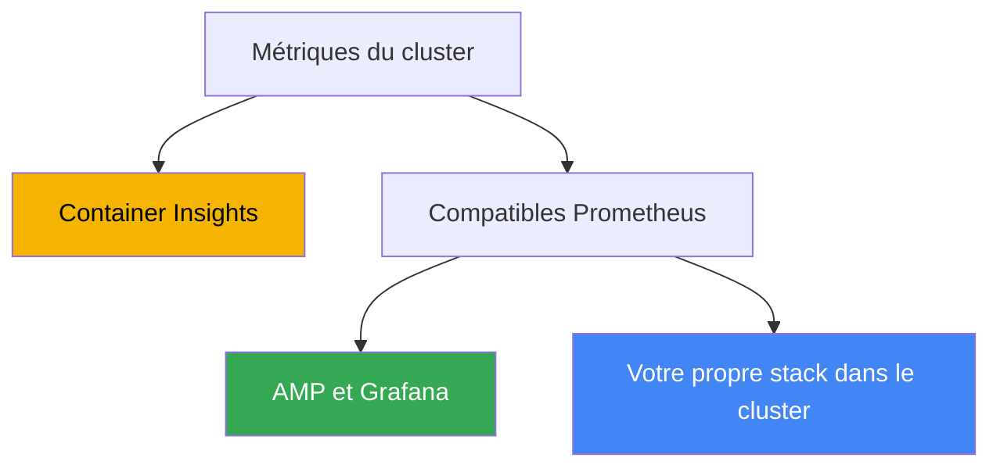
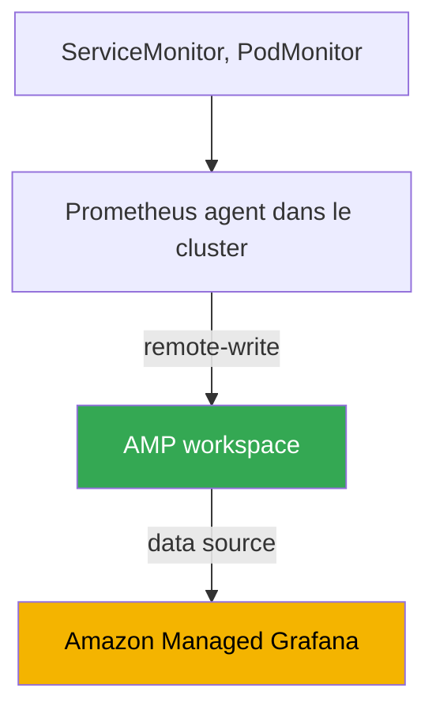

[Русская версия](ru.md) · [Eng version](en.md) · [Versión en español](es.md) · [Deutsche Version](de.md) · [ქართული ვერსია](ge.md) · [繁體中文版](tw.md) · [日本語版](jp.md)

# Chapitre 33. Métriques : Container Insights, Managed Prometheus et Grafana, kube-prometheus-stack

> **La suite.** La partie 6 porte sur l'observabilité : comment comprendre ce qui se passe à l'intérieur du cluster et des charges de travail. Nous commençons par les métriques : des séries temporelles numériques sur l'utilisation des nœuds, des pods et du control plane. Les logs (Fluent Bit, CloudWatch Logs, OpenSearch) sont traités au chapitre 34 ; l'autoscaling des applications par métriques (HPA, métriques externes, KEDA), au chapitre 35 ; le traçage distribué via ADOT et X-Ray, au chapitre 36 ; et la comptabilisation et l'optimisation des coûts avec Kubecost et OpenCost, au chapitre 43. Ce chapitre traite d'une seule chose : d'où viennent les métriques dans EKS, où elles sont stockées et comment les consulter.

## 33.1. « kubectl top échoue, HPA ne fonctionne pas, la charge du cluster est invisible »

Le cluster vient tout juste d'être déployé, les charges de travail arrivent, tout semble fonctionner. La première question de l'ingénieur d'astreinte est : « combien de CPU et de mémoire les nœuds et les pods consomment-ils maintenant ? ». On vérifie avec la commande habituelle et on se heurte à un mur :

```bash
kubectl top nodes
# error: Metrics API not available

kubectl top pods -A
# error: Metrics API not available
```

Il n'y a aucune métrique. `kubectl top` ne retourne ni les nœuds ni les pods. Le HPA, configuré sur le CPU, reste à l'état `<unknown>/50%` et ne met rien à l'échelle, car il n'a aucune source pour connaître la charge actuelle. Impossible de répondre à la question « le cluster est-il chargé, faut-il ajouter des nœuds ? » : on ne peut pas planifier la capacité et la dégradation sous charge n'est visible qu'à travers les plaintes des utilisateurs.

La raison est qu'EKS est un control plane managé et qu'il ne distribue pas lui-même des métriques aux applications. À la différence de nombreux clusters self-managed, où quelqu'un a déjà installé metrics-server et une stack de monitoring, un EKS fraîchement créé ne les contient pas : AWS est responsable du fonctionnement de l'API server, du scheduler et du controller manager, mais collecter, stocker et afficher les métriques des nœuds et des pods est votre responsabilité. Le control plane n'expose à l'extérieur qu'un ensemble de base de ses propres métriques (voir plus bas), et tout le reste doit être construit.

Nous allons examiner trois éléments : la couche de base metrics-server, qui corrige `kubectl top` et HPA ; trois approches pour collecter et stocker des métriques complètes dans EKS (Container Insights, Amazon Managed Prometheus, kube-prometheus-stack self-managed) ; et ce qu'il faut réellement surveiller dans le cluster.

## 33.2. metrics-server : couche de base pour kubectl top et HPA

La première chose installée dans un nouveau cluster est **metrics-server**. Il s'agit d'un composant Kubernetes qui collecte les métriques d'utilisation des ressources (CPU et mémoire) depuis le kubelet de chaque nœud et les expose via Kubernetes Metrics API (`metrics.k8s.io`). C'est précisément cette API que lisent `kubectl top` et Horizontal Pod Autoscaler lorsqu'ils effectuent un autoscaling selon les resource metrics.

Il est important d'en comprendre les limites. metrics-server n'est **pas un stockage** : il ne conserve que les dernières valeurs en mémoire, sans historique, sans retention, sans requêtes sur la semaine précédente et sans alerting. Son rôle est de fournir l'information « ici et maintenant » à deux consommateurs : `kubectl top` et HPA (le lien entre HPA et les métriques est abordé au chapitre 35). Pour les tableaux de bord, les tendances et les alertes, une stack complète de métriques est nécessaire, comme nous le verrons plus bas.

Dans EKS, metrics-server n'est pas installé par défaut : il faut l'installer séparément. Plusieurs méthodes existent :

```bash
# comme add-on communautaire via EKS Add-ons
aws eks create-addon --cluster-name my-cluster --addon-name metrics-server

# ou avec le manifeste upstream
kubectl apply -f https://github.com/kubernetes-sigs/metrics-server/releases/latest/download/components.yaml
```

Après l'installation, `kubectl top nodes` commence à retourner la charge, et HPA fondé sur le CPU et la mémoire se met à fonctionner. Mais ce n'est que la fondation : metrics-server répond au besoin immédiat, tandis que les historiques, les tableaux de bord et les alertes sont fournis par les trois approches suivantes.

## 33.3. Trois approches pour les métriques dans EKS

La collecte complète de métriques dans EKS est généralement mise en place de l'une de ces trois façons. Elles diffèrent par l'entité qui gère le stockage et la collecte, et par leur caractère AWS-native ou Kubernetes-native.



Voici un résumé de chacune, avant de les détailler dans les sections suivantes :

- **CloudWatch Container Insights** : l'approche AWS-native. Un agent dans le cluster collecte les métriques et les envoie dans CloudWatch, où se trouvent également les tableaux de bord et les alarmes. Tout est géré par AWS.
- **Amazon Managed Service for Prometheus (AMP)** : un backend managé compatible Prometheus. Vous collectez les métriques (managed collector ou ADOT), les écrivez dans un workspace via remote-write, effectuez les requêtes en PromQL et utilisez Amazon Managed Grafana pour les tableaux de bord.
- **kube-prometheus-stack** : une approche self-managed : Prometheus, Grafana et Alertmanager dans le cluster via Helm. Contrôle complet, mais le stockage et l'exploitation sont à votre charge.

Ces approches ne s'excluent pas mutuellement : on adopte souvent un hybride, présenté dans la section de comparaison. Examinons-les dans l'ordre.

## 33.4. CloudWatch Container Insights

**Container Insights** est une solution de monitoring EKS à l'aide de CloudWatch. Les métriques des nœuds, pods, namespaces et du cluster sont collectées par un agent dans le cluster, envoyées vers CloudWatch et affichées dans des tableaux de bord prédéfinis ; des CloudWatch alarms sont ensuite construites sur cette base.

Elle s'installe via un seul add-on EKS : **amazon-cloudwatch-observability**. Il déploie CloudWatch Observability Operator, qui installe CloudWatch agent et active Container Insights **with enhanced observability**. Enhanced observability fournit des métriques plus détaillées, notamment une ventilation par pod et par conteneur ; sur les nœuds managés et Fargate, elle aide aussi à voir l'ensemble sans configuration manuelle de l'agent. Le même add-on active CloudWatch Application Signals pour le niveau APM des applications.

```bash
# activer Container Insights via l'add-on EKS managé
aws eks create-addon \
  --cluster-name my-cluster \
  --addon-name amazon-cloudwatch-observability
```

Voici ce qu'il fournit immédiatement :

- **Métriques des nœuds, pods, namespaces et du cluster** : CPU, mémoire, réseau, disque, dans le namespace `ContainerInsights` de CloudWatch, avec des tableaux de bord prédéfinis.
- **Métriques de base du control plane gratuites.** Indépendamment de l'add-on, pour les clusters en version `1.28` et ultérieure, CloudWatch expose un ensemble de métriques vended dans le namespace `AWS/EKS` (métriques de l'API server, du scheduler et d'autres composants), sans aucune installation.
- **Intégration à AWS.** Alarmes, alarmes composites, envoi vers SNS, intégration avec les autres métriques AWS : tout se trouve dans une seule console, sans stack distincte.

Le modèle de coût est fondé sur le volume : vous payez les métriques ingérées et stockées ainsi que les requêtes, et les logs si leur collecte est activée (les logs sont traités au chapitre 34). Container Insights convient bien si vous vivez déjà dans CloudWatch et ne souhaitez pas exploiter votre propre Prometheus : l'exploitation est minimale et tout est managé. En contrepartie, vous êtes lié à CloudWatch comme modèle de données et langage de requête : PromQL n'est pas disponible ici.

## 33.5. Amazon Managed Prometheus et Managed Grafana

Si l'équipe raisonne en termes de Prometheus et PromQL, mais ne veut pas exploiter ni mettre à l'échelle son propre Prometheus, **Amazon Managed Service for Prometheus (AMP)** propose un backend managé compatible Prometheus. Vous ne déployez aucun serveur : AMP fournit un **workspace**, un stockage de métriques isolé avec une API compatible Prometheus. Les données y arrivent via **remote-write** et les requêtes sont faites avec PromQL. La mise à l'échelle et la retention sont gérées par AWS.

Les métriques peuvent être collectées dans le workspace de deux manières :

- **AWS managed collector (scraper)** : un collecteur entièrement managé et sans agent. Il découvre lui-même les métriques compatibles Prometheus du cluster EKS, les collecte et les écrit dans le workspace par `remote_write`. Il n'y a rien à installer ni à patcher dans le cluster ; le scraper crée une ENI dans les sous-réseaux indiqués et passe par un VPC endpoint, le trafic ne va pas sur Internet.
- **Customer managed collector** : votre propre collecteur dans le cluster, le plus souvent ADOT collector (AWS Distribution for OpenTelemetry) ou Prometheus en mode agent, configuré pour effectuer le remote-write vers le workspace. Vous avez davantage de contrôle sur les éléments collectés et leur mode de collecte, mais l'exploitation du collecteur vous incombe.

Les droits d'écriture sont accordés par la managed policy AWS `AmazonPrometheusRemoteWriteAccess` (via IRSA ou Pod Identity, chapitres 16-17). L'endpoint d'écriture et l'ID du workspace s'obtiennent ainsi :

```bash
# liste des workspaces et de leur état
aws amp list-workspaces --output table

# endpoint remote-write d'un workspace particulier
aws amp describe-workspace --workspace-id ws-xxxxxxxx \
  --query "workspace.prometheusEndpoint" --output text
```

AMP est un stockage et un moteur de requêtes, mais pas un outil de tableaux de bord. Pour la visualisation, on utilise **Amazon Managed Grafana (AMG)**, un Grafana managé. AMG ajoute AMP comme data source (dans les nouvelles versions, via AWS data source configuration avec un rôle IAM service-managed, afin que les droits soient attribués automatiquement), tandis que l'accès des utilisateurs au workspace se configure avec **IAM Identity Center** (SSO). On obtient ainsi l'enchaînement suivant : managed collector collecte, AMP stocke et répond aux requêtes PromQL, AMG dessine les tableaux de bord, et vous n'exploitez vous-même aucun composant.

## 33.6. kube-prometheus-stack self-managed

La troisième voie consiste à installer soi-même toute la stack Prometheus dans le cluster. Le standard de facto est le Helm chart **kube-prometheus-stack**, qui déploie en une fois Prometheus Operator, Prometheus, Grafana, Alertmanager, node-exporter et kube-state-metrics.

**Prometheus Operator** joue un rôle essentiel : il introduit des CRD avec lesquels la configuration de scrape est décrite de façon déclarative, à la manière Kubernetes, sans modifier un `prometheus.yml` monolithique :

- **ServiceMonitor** : « collecter les endpoints derrière un Service donné » ; c'est la méthode habituelle pour connecter les métriques d'une application via un label selector.
- **PodMonitor** : identique, mais directement par les pods, sans Service.
- **PrometheusRule** : les règles d'alerte et les recording rules pour Alertmanager.

```bash
# installation de la stack dans le cluster
helm repo add prometheus-community https://prometheus-community.github.io/helm-charts
helm install kube-prometheus-stack prometheus-community/kube-prometheus-stack \
  -n monitoring --create-namespace
```

Le volume de métriques représente un coût et une charge pour le backend. Les métriques et labels à forte cardinalité sont donc éliminés dès le scrape, avant l'écriture et avant le remote-write vers AMP. Cela se fait avec `metric_relabel_configs` dans la scrape config Prometheus ; dans ServiceMonitor et PodMonitor, ce champ s'appelle `metricRelabelings` :

```yaml
metric_relabel_configs:
  # supprimer entièrement une métrique à forte cardinalité par son nom
  - source_labels: [__name__]
    regex: apiserver_request_duration_seconds_bucket
    action: drop
  # supprimer un label superflu à forte cardinalité qui gonfle le nombre de séries
  - action: labeldrop
    regex: (pod_uid|container_id)
```

Sans ce nettoyage, le nombre de séries temporelles croît sans contrôle, tout comme le coût d'ingestion et de stockage dans un backend managé et la charge sur Prometheus local.

L'avantage de cette approche est le contrôle total et la portabilité : le même chart et les mêmes ServiceMonitor fonctionnent dans tout Kubernetes, pas uniquement dans EKS, sans dépendance à AWS. L'inconvénient est que toute l'exploitation repose sur vous : stockage et retention (il faut des PV dont vous calculez vous-même la taille et la durée de conservation), haute disponibilité et fédération à mesure de la croissance, mises à jour, ressources pour Prometheus lui-même, qui consomme beaucoup de mémoire dans un grand cluster. Ce sont précisément ces préoccupations qu'AMP élimine.

## 33.7. Comparaison des trois approches et hybride

Le choix revient à déterminer quelle quantité d'exploitation vous êtes prêts à assumer et dans quelle mesure PromQL et la portabilité sont nécessaires.

| Critère | Container Insights | Managed Prometheus (AMP) | kube-prometheus-stack |
|---|---|---|---|
| Qui gère | AWS | AWS (stockage) | vous |
| Langage de requête | CloudWatch, sans PromQL | PromQL | PromQL |
| Tableaux de bord | CloudWatch | Amazon Managed Grafana | Grafana dans le cluster |
| Collecte | CloudWatch agent (add-on) | managed collector ou ADOT | Prometheus dans le cluster |
| Stockage et retention | CloudWatch, managé | workspace, managé | vos PV, votre responsabilité |
| Exploitation | minimale | faible | élevée |
| Dépendance | à CloudWatch | compatible Prometheus | portable |
| Quand le choisir | vous vivez dans CloudWatch | PromQL nécessaire sans votre propre serveur | contrôle total nécessaire |

Les approches peuvent être combinées. Un hybride courant est : **AMP comme stockage + kube-prometheus-stack pour le scraping + AMG pour les tableaux de bord**. Prometheus Operator et ServiceMonitor restent la façon habituelle de décrire la collecte, Prometheus local fonctionne en mode agent et envoie les données à AMP via remote-write, tandis que le stockage de longue durée, la HA et la mise à l'échelle sont assurés par le workspace managé. Vous conservez ainsi le modèle de configuration Kubernetes-native, sans assumer la partie la plus lourde : le stockage des métriques.



Une autre possibilité consiste à utiliser un managed collector à la place de votre propre Prometheus : dans ce cas, aucune partie de la stack ne fonctionne dans le cluster, et la collecte, le stockage et les requêtes sont entièrement gérés par AWS. C'est l'approche la plus managée pour accéder à PromQL.

### Coût de possession : ce que vous payez dans chaque cas

« Son propre Prometheus est gratuit » est l'idée fausse principale de ce chapitre. Vous payez dans les deux cas, mais les postes sont différents. Il faut les comparer, plutôt que de comparer la présence ou non d'une facture AWS.

| Poste | Votre stack (Prometheus, Grafana) | AMP plus AMG |
|---|---|---|
| Ingestion des métriques | ressources des nœuds pour le scraping | volume des échantillons ingérés facturé |
| Stockage | volumes EBS : volume pour la retention plus marge | volume de métriques facturé, élastique |
| Requêtes | CPU et mémoire de Prometheus, un PromQL lourd peut le bloquer | échantillons traités facturés |
| Tolérance aux pannes | deux répliques plus déduplication, donc consommation doublée | interne au service |
| Tableaux de bord | Grafana est gratuit, mais mises à jour et sauvegarde sont à votre charge | paiement par utilisateur actif |
| Travail | mises à niveau, sharding à mesure de la croissance, astreinte | minimal |

Trois éléments déjouent ensuite l'intuition lors du calcul. Premièrement, pour AMP, le principal moteur de coût est **l'ingestion des données**, et non le stockage ; réduire la retention pour économiser n'a donc presque aucun effet. Les leviers efficaces sont un scrape moins fréquent (`scrape_interval`) et une collecte plus limitée, en filtrant les séries inutiles via `relabel_config`. Deuxièmement, **les requêtes sont également payantes**, et les alertes sont aussi des requêtes. C'est pourquoi l'alerting natif AMP est plus avantageux que l'externe : l'alerting hautement disponible dans Grafana interroge les données depuis plusieurs zones et multiplie le coût des requêtes. Troisièmement, ce qui est commun aux deux options : la **cardinalité**. Un label ayant une valeur unique par requête ou par pod transforme une dizaine de séries en millions ; dans le managé, cela se voit sur la facture, tandis que dans votre propre stack, cela se traduit par un OOMKilled de Prometheus. Ces deux problèmes ne se résolvent pas par le choix d'un fournisseur, mais par une discipline sur les labels (le dimensionnement est traité au chapitre 14, et les coûts dans leur ensemble au chapitre 43).

### Retention longue durée : Thanos, Mimir, VictoriaMetrics

Une tâche distincte, qui fait grandir une stack self-managed au-delà de sa forme initiale : Prometheus local n'est pas conçu pour conserver un an d'historique. La retention se heurte au disque, et la croissance verticale de l'instance finit par atteindre ses limites. La réponse de l'industrie consiste à déplacer l'historique dans un stockage objet.

**Thanos** est l'ensemble le plus connu pour cela, et il s'agit bien d'un ensemble de composants, non d'un seul service :

- **sidecar** à côté de Prometheus téléverse les blocs TSDB terminés dans S3 ;
- **store gateway** retourne les données historiques en lisant les blocs du bucket et en mettant l'index en cache ;
- **compactor** fusionne les petits blocs, effectue le downsampling et applique la retention ;
- **querier** répond aux requêtes PromQL sur toutes les sources à la fois et déduplique les données des paires HA ;
- **ruler** calcule les règles et les alertes sur les données historiques.

L'intérêt est que Prometheus conserve localement des heures ou des jours au lieu de semaines : les volumes EBS coûteux et la mémoire sont économisés, tandis que l'historique vit dans S3. Le prix à payer est l'ajout de quatre à six nouveaux composants à mettre à jour et à surveiller, ainsi que les requêtes vers le stockage objet et les caches placés devant lui. **Grafana Mimir** (qui développe les idées de Cortex) résout la même classe de problèmes si vous préférez un seul système à une multitude de composants.

**VictoriaMetrics** adopte une autre approche du même problème : ce n'est pas une surcouche de Prometheus, mais un remplacement du stockage. Les données sont reçues par `vmagent` (ou par votre Prometheus en mode remote-write), stockées dans `vmsingle` sur un nœud unique, ou dans un cluster composé de `vminsert`, `vmstorage` et `vmselect`. `vmalert` calcule les alertes et la retention est définie par un seul indicateur `-retentionPeriod`. Le langage de requête MetricsQL est compatible avec PromQL et ajoute ses propres fonctions ; les tableaux de bord Grafana fonctionnent tels quels. Il y a moins de composants qu'avec Thanos, mais l'historique réside sur des disques et non dans S3 : les disques et leur croissance restent donc votre responsabilité. La raison habituelle de migrer est une consommation de CPU et de mémoire moindre à données égales ; il faut le vérifier sur sa propre charge, plutôt que de le croire sur parole.

Par rapport à AWS, AMP résout la même tâche sans aucun composant. Thanos, Mimir et VictoriaMetrics sont adoptés lorsqu'il faut contrôler le stockage, faire du multicloud ou disposer de sa propre économie à très grands volumes.

## 33.8. Ce qu'il faut surveiller dans EKS

L'outil n'est que la moitié du travail ; l'autre moitié consiste à déterminer quelles métriques collecter. Voici des repères pour un cluster :

- **Métriques des nœuds.** CPU, mémoire, disque (y compris le remplissage du système de fichiers pour `/var/lib/kubelet` et la racine), réseau. Elles sont fournies par node-exporter (dans kube-prometheus-stack) ou CloudWatch agent. Elles permettent de détecter le manque de ressources qui conduit à l'éviction de pods et à `Node Pressure`.
- **Métriques des pods et conteneurs.** Consommation de CPU et mémoire par rapport aux requests et limits, redémarrages, OOMKilled. Elles révèlent un dimensionnement incorrect (chapitre 14) et les fuites.
- **Métriques du control plane.** API server (latence, taux d'erreurs, throttling), scheduler, controller manager. Une partie est exposée gratuitement dans le namespace `AWS/EKS` (version `1.28` et ultérieure), tandis qu'AMP managed collector peut scraper directement les métriques d'API server, kube-scheduler et kube-controller-manager.
- **kube-state-metrics.** Un composant distinct qui expose l'état des objets Kubernetes : nombre de pods en `Pending`, état de préparation des Deployment, Job bloqué ou non, nombre de répliques égal ou non à la valeur souhaitée. Il ne s'agit pas de charge de ressources, mais de l'état des objets de l'API : sans lui, la vue est incomplète.

Deux méthodes aident à construire un monitoring significatif à partir de cet ensemble de métriques. **USE** (pour les ressources : Utilization, Saturation, Errors) consiste à examiner chaque ressource à travers son utilisation, sa saturation et ses erreurs ; elle convient aux nœuds et à l'infrastructure. **RED** (pour les services : Rate, Errors, Duration) couvre le taux de requêtes, la part d'erreurs et le temps de réponse ; elle convient aux applications. En pratique, elles sont combinées : USE pour le matériel et les nœuds, RED pour les charges de travail au-dessus.

## 33.9. Application en production

- **Installez metrics-server immédiatement.** C'est le premier composant d'un nouveau cluster : sans lui, `kubectl top` et HPA ne fonctionnent pas, alors qu'il s'agit de l'hygiène d'exploitation élémentaire.
- **Choisissez un backend principal de métriques et ne multipliez pas les stacks.** Soit CloudWatch Container Insights (si vous vivez dans la console AWS), soit une voie compatible Prometheus (AMP ou self-managed) ; deux stacks parallèles impliquent un double coût et une double exploitation.
- **Préférez le managé au self-managed lorsqu'il n'y a pas de raison contraire.** AMP et AMG prennent en charge le stockage, la HA et la mise à l'échelle ; votre propre kube-prometheus-stack est justifié par un contrôle total, l'air gap ou la portabilité entre clouds.
- **L'hybride AMP + Prometheus agent + AMG est un compromis courant.** Il offre une configuration de collecte Kubernetes-native via ServiceMonitor, sans les préoccupations du stockage de métriques.
- **Installez impérativement kube-state-metrics.** Sans l'état des objets (Pending, redémarrages), le monitoring voit la charge mais ne voit pas que « quelque chose ne se déploie pas ».
- **Contrôlez le volume de métriques avec `metric_relabel_configs`.** Les métriques et labels à forte cardinalité sont éliminés avant l'écriture et remote-write, sinon le coût et la charge du backend augmentent.
- **Liez immédiatement les métriques aux alertes.** Un tableau de bord que personne ne regarde est inutile ; les signaux clés (nœud sous pression, hausse des erreurs API server, OOMKilled) sont configurés dans CloudWatch alarms ou Alertmanager.

## 33.10. Mini-glossaire

- **metrics-server** : composant qui collecte CPU et mémoire depuis kubelet et les expose par Metrics API pour `kubectl top` et HPA ; sans historique ni stockage.
- **Metrics API (`metrics.k8s.io`)** : API Kubernetes des métriques courantes de ressources, source de `kubectl top` et de HPA avec resource metrics.
- **Container Insights** : monitoring EKS avec CloudWatch : un agent collecte les métriques des nœuds et pods, les tableaux de bord et les alarmes sont dans CloudWatch.
- **amazon-cloudwatch-observability** : add-on EKS managé qui installe CloudWatch agent et active Container Insights with enhanced observability.
- **Amazon Managed Service for Prometheus (AMP)** : backend managé compatible Prometheus ; workspace, remote-write, PromQL et retention côté AWS.
- **workspace** : stockage de métriques isolé dans AMP, avec son propre endpoint remote-write et une API compatible Prometheus.
- **managed collector (scraper)** : collecteur AMP managé sans agent, qui scrape les métriques EKS et les écrit dans le workspace via remote-write.
- **Amazon Managed Grafana (AMG)** : Grafana managé ; connecte AMP comme data source, avec un accès utilisateur via IAM Identity Center.
- **kube-prometheus-stack** : Helm chart contenant Prometheus Operator, Prometheus, Grafana, Alertmanager, node-exporter et kube-state-metrics.
- **ServiceMonitor, PodMonitor** : CRD Prometheus Operator qui décrivent déclarativement les endpoints à scraper.
- **kube-state-metrics** : composant qui expose l'état des objets Kubernetes (Pending, répliques, redémarrages) sous forme de métriques.
- **Thanos** : ensemble de composants qui ajoute à Prometheus une conservation longue durée dans un stockage objet : `sidecar` téléverse les blocs dans S3, `store gateway` les relit, `compactor` compacte, effectue le downsampling et applique la retention, `querier` fournit un PromQL unifié et la déduplication des paires HA, et `ruler` calcule les règles sur l'historique. **Grafana Mimir** répond à la même classe de besoins.
- **VictoriaMetrics** : remplacement du stockage de métriques plutôt que surcouche : `vmagent` pour la collecte, `vmsingle` ou le cluster `vminsert`/`vmstorage`/`vmselect`, `vmalert` pour les règles, retention définie avec l'indicateur `-retentionPeriod`, langage MetricsQL comme extension de PromQL. Il comporte moins de composants que Thanos, mais l'historique vit sur des disques et non dans un stockage objet.
- **metric_relabel_configs** : section de scrape config (dans ServiceMonitor : `metricRelabelings`) qui élimine les métriques à forte cardinalité (`drop` sur `__name__`) et les labels (`labeldrop`) avant l'écriture et remote-write ; c'est un outil de contrôle du volume et des coûts.

## 33.11. Bilan du chapitre

- Dans un EKS récent, il n'y a pas de métriques : `kubectl top` échoue avec « Metrics API not available », HPA ne met pas à l'échelle et la charge du cluster est invisible. Le control plane est géré par AWS et ne distribue pas lui-même des métriques aux applications.
- metrics-server est la couche de base : il expose le CPU et la mémoire courants via Metrics API pour `kubectl top` et HPA. Ce n'est pas un stockage, il ne fournit ni historique ni alertes, et s'installe séparément.
- Les métriques complètes se construisent selon l'une des trois approches : CloudWatch Container Insights, Amazon Managed Prometheus ou kube-prometheus-stack self-managed.
- Container Insights est AWS-native, s'installe avec l'add-on amazon-cloudwatch-observability (with enhanced observability), fournit tableaux de bord et alarmes dans CloudWatch, est facturé au volume et n'offre pas PromQL.
- AMP est un backend managé compatible Prometheus : workspace, remote-write, PromQL ; collecte via managed collector ou ADOT ; tableaux de bord dans Amazon Managed Grafana avec accès via IAM Identity Center.
- kube-prometheus-stack offre contrôle total et portabilité (Prometheus Operator, ServiceMonitor, PodMonitor), mais le stockage, la retention, la HA et la mise à l'échelle reposent sur vous.
- Un hybride fréquent consiste à utiliser AMP pour le stockage, kube-prometheus-stack pour le scraping et AMG pour les tableaux de bord : une configuration Kubernetes-native sans les préoccupations liées au stockage.
- Il faut surveiller les nœuds, pods, control plane et l'état des objets avec kube-state-metrics ; USE (pour les ressources) et RED (pour les services) aident à structurer cette surveillance.

## 33.12. Utilité dans le travail réel

En astreinte, les métriques sont la première chose que l'on consulte lors d'un incident : le nœud est-il chargé, un pod atteint-il sa limit, la latence de l'API server augmente-t-elle ? Si `kubectl top` ne répond pas et qu'il n'y a pas de tableaux de bord, l'analyse de l'incident devient une devinette. La couche de base (metrics-server) et au moins un backend de métriques doivent donc être en place avant le premier incident sérieux, et non après. Savoir par quelle voie les métriques sont collectées dans votre cluster indique immédiatement où les consulter : dans CloudWatch, dans Grafana au-dessus d'AMP ou dans Grafana local.

Pendant la planification, la décision clé est de choisir un backend de référence et de ne pas se disperser dans plusieurs solutions parallèles. La voie managée (Container Insights ou AMP plus AMG) est pertinente lorsque l'on ne souhaite pas maintenir une équipe dédiée à l'exploitation de Prometheus ; le self-managed l'est lorsqu'un contrôle total ou la portabilité sont nécessaires. Le coût de toutes les approches augmente avec le volume de métriques. Il faut donc décider à l'avance quoi collecter et avec quel niveau de détail : tout collecter sans distinction est coûteux, autant sur les backends managés que sur vos propres PV. L'autoscaling (chapitre 35) et le suivi des coûts (chapitre 43) s'appuient ensuite sur les métriques.

## 33.13. Questions d'auto-évaluation

1. Pourquoi `kubectl top nodes` échoue-t-il avec « Metrics API not available » dans un EKS récent ?
2. Que fait metrics-server et pourquoi l'appelle-t-on une couche de base plutôt qu'un système de monitoring ?
3. Qui lit Metrics API en plus de `kubectl top` et quel lien cela a-t-il avec HPA ?
4. Quelles sont les trois voies de collecte et de stockage des métriques dans EKS et en quoi diffèrent-elles fondamentalement ?
5. Quel add-on active Container Insights et qu'apporte enhanced observability ?
6. Que sont les métriques de base dans le namespace `AWS/EKS` et à partir de quelle version de cluster sont-elles gratuites ?
7. Qu'est-ce qu'un workspace dans AMP et comment les métriques y arrivent-elles ?
8. En quoi managed collector (scraper) diffère-t-il d'un customer managed collector basé sur ADOT ?
9. Quel lien existe entre AMP et Amazon Managed Grafana, et par quel moyen l'accès des utilisateurs est-il configuré ?
10. Que déploie kube-prometheus-stack et de quoi Prometheus Operator est-il responsable ?
11. Pourquoi ServiceMonitor et PodMonitor sont-ils nécessaires et en quoi sont-ils plus pratiques qu'une modification manuelle de la configuration ?
12. Comment fonctionne l'hybride AMP plus kube-prometheus-stack plus AMG, et qu'apporte-t-il ?
13. Que faut-il surveiller dans EKS et quelle différence y a-t-il entre les méthodes USE et RED ?
14. De quels postes se composent le prix de votre propre stack de métriques et celui d'AMP avec AMG ? Pourquoi réduire la retention dans AMP ne diminue-t-il presque pas la facture et quels leviers fonctionnent à la place ?
15. Pourquoi Prometheus a-t-il besoin de Thanos, que fait chacun de ses composants et quel en est le coût ?
16. En quoi VictoriaMetrics diffère-t-il de l'association Prometheus plus Thanos, au regard de la composition et du stockage ?

## Pratique

Le laboratoire du cours sur ce thème est [laboratoire 114 : Observabilité : Container Insights et Managed Prometheus avec Grafana](../../labs/114/README_FR.MD). Au-delà de ce laboratoire, il est facile de vérifier l'état actuel des métriques sur un cluster en fonctionnement. Commencez par vérifier si la couche de base existe et si Metrics API répond :

```bash
# kubectl top fonctionne-t-il (ce qui signifie que metrics-server est installé) ?
kubectl top nodes
kubectl top pods -A

# metrics-server et Metrics API existent-ils ?
kubectl get deploy -n kube-system metrics-server
kubectl get apiservice v1beta1.metrics.k8s.io
```

Si `kubectl top` échoue, metrics-server n'est pas installé et c'est le premier candidat à installer. Vérifiez ensuite quel backend de métriques est déjà connecté. Consultez les add-ons EKS et les charges de monitoring dans le cluster :

```bash
# l'add-on Container Insights et/ou metrics-server sont-ils activés ?
aws eks list-addons --cluster-name my-cluster --output table

# stack Prometheus dans le cluster, si elle existe
kubectl get pods -n monitoring
kubectl get servicemonitors,podmonitors -A
```

Vérifiez s'il existe un backend compatible Prometheus côté AWS : un workspace AMP dans la région :

```bash
# workspaces Amazon Managed Prometheus et leur état
aws amp list-workspaces --output table
```

Enfin, Kubernetes API permet d'obtenir la sortie brute de l'endpoint de métriques exposé par metrics-server :

```bash
# métriques brutes de metrics-server via l'API
kubectl get --raw "/apis/metrics.k8s.io/v1beta1/nodes" | head -c 400
```

Comparez la situation : y a-t-il la couche de base (metrics-server), un stockage de longue durée (Container Insights, AMP ou votre propre Prometheus), et des alertes configurées ? Les lacunes de cette chaîne doivent être corrigées avant le premier incident sérieux.

---
[Table des matières](../README_FR.md) · [Chapitre 32](../32/fr.md) · [Chapitre 34](../34/fr.md)
