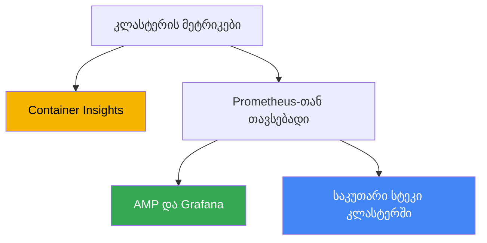
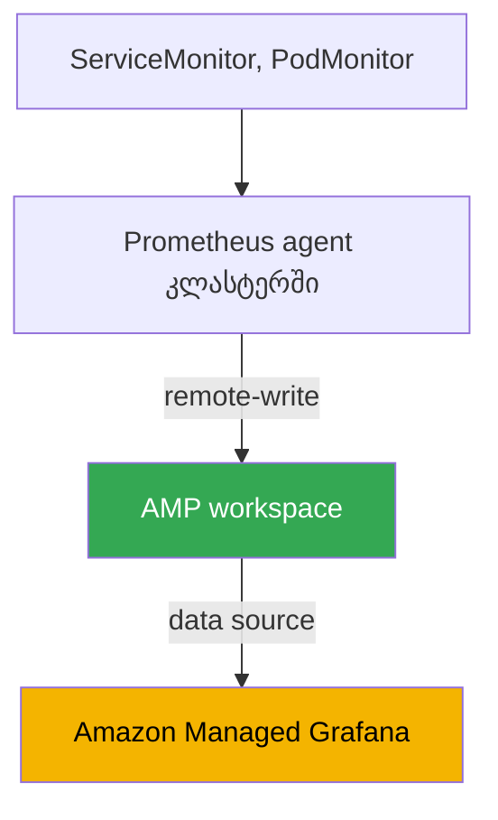

[რუსული ვერსია](ru.md) · [Eng version](en.md) · [Versión en español](es.md) · [Version française](fr.md) · [Deutsche Version](de.md) · [繁體中文版](tw.md) · [日本語版](jp.md)
# თავი 33. მეტრიკები: Container Insights, Managed Prometheus და Grafana, kube-prometheus-stack

> **რა არის შემდეგ.** ნაწილი 6 ეხება დაკვირვებადობას: როგორ გავიგოთ, რა ხდება კლასტერისა და
> დატვირთვების შიგნით. ვიწყებთ მეტრიკებით - ნოდების, პოდებისა და control plane-ის დატვირთვის
> რიცხვითი დროითი მწკრივებით. ლოგები (Fluent Bit, CloudWatch Logs, OpenSearch) განხილულია 34-ე
> თავში; აპლიკაციების ავტომასშტაბირება მეტრიკების მიხედვით (HPA, გარე მეტრიკები, KEDA) - 35-ე
> თავში; განაწილებული ტრეისინგი ADOT-ისა და X-Ray-ის მეშვეობით - 36-ე თავში; ხარჯების აღრიცხვა და
> ოპტიმიზაცია Kubecost-ისა და OpenCost-ის გამოყენებით - 43-ე თავში. აქ მხოლოდ ერთ საკითხს
> განვიხილავთ: საიდან ჩნდება მეტრიკები EKS-ში, სად ინახება და რით შეიძლება მათი ნახვა.

## 33.1. „kubectl top ვერ მუშაობს, HPA არ მუშაობს, კლასტერის დატვირთვა არ ჩანს“

კლასტერი ახლახან გაიშალა, დატვირთვები ეშვება და თითქოს ყველაფერი მუშაობს. მორიგე ინჟინრის
პირველივე კითხვაა: „ამჟამად რამდენ CPU-სა და მეხსიერებას მოიხმარენ ნოდები და პოდები?“. ვამოწმებთ
ჩვეული ბრძანებით და კედელს ვაწყდებით:

```bash
kubectl top nodes
# error: Metrics API not available

kubectl top pods -A
# error: Metrics API not available
```

მეტრიკები საერთოდ არ არის. `kubectl top` არც ნოდებს აჩვენებს და არც პოდებს. CPU-ზე
დაყენებული HPA `<unknown>/50%` სტატუსშია გაჩერებული და არაფერს მასშტაბირებს, რადგან მიმდინარე
დატვირთვის მონაცემები არსაიდან აქვს მისაღები. კითხვაზე „დატვირთულია თუ არა კლასტერი და დროა თუ
არა ნოდების დამატება“ პასუხი არ არსებობს: capacity-ის დასაგეგმად მონაცემები არ გვაქვს, ხოლო
დატვირთვის ქვეშ დეგრადაცია მხოლოდ მომხმარებლების საჩივრებიდან ჩანს.

მიზეზი ისაა, რომ EKS მართული control plane-ია და აპლიკაციებს მეტრიკებს თავად არ აწვდის. ბევრი
self-managed კლასტერისგან განსხვავებით, სადაც ვიღაცამ წინასწარ დააყენა metrics-server და
მონიტორინგის სტეკი, ახალ EKS-ში ისინი არ არის: AWS პასუხისმგებელია API server-ის, scheduler-ისა
და controller manager-ის მუშაობაზე, მაგრამ ნოდებისა და პოდების მეტრიკების შეგროვება, შენახვა და
ჩვენება თქვენი ამოცანაა. Control plane გარეთ მხოლოდ საკუთარი მეტრიკების საბაზისო ნაკრებს გასცემს
(ამის შესახებ ქვემოთ), დანარჩენი კი თავად უნდა ააწყოთ.

შემდეგ სამ საკითხს განვიხილავთ: metrics-server-ის საბაზისო ფენას, რომელიც `kubectl top`-სა და
HPA-ს ამუშავებს; სამ გზას, რომლითაც EKS-ში სრულფასოვანი მეტრიკები გროვდება და ინახება (Container
Insights, Amazon Managed Prometheus, self-managed kube-prometheus-stack); და იმას, კონკრეტულად
რისი მონიტორინგია საჭირო კლასტერში.

## 33.2. metrics-server: საბაზისო ფენა kubectl top-ისა და HPA-სთვის

პირველი, რასაც ახალ კლასტერში აყენებენ, არის **metrics-server**. ეს Kubernetes-ის კომპონენტია,
რომელიც თითოეული ნოდის kubelet-იდან რესურსების გამოყენების მეტრიკებს (CPU-სა და მეხსიერებას)
აგროვებს და Kubernetes Metrics API-ის (`metrics.k8s.io`) მეშვეობით გასცემს. სწორედ ამ API-დან
კითხულობენ მონაცემებს `kubectl top` და Horizontal Pod Autoscaler, როდესაც resource metrics-ის
მიხედვით მასშტაბირებენ.

მნიშვნელოვანია საზღვრების გაგება. metrics-server **საცავი არ არის**: მეხსიერებაში მხოლოდ ბოლო
მნიშვნელობებს ინახავს, ისტორიის, retention-ის, გასული კვირის მონაცემების მოთხოვნისა და
ალერტინგის გარეშე. მისი ამოცანაა „აქ და ახლა“ მონაცემების მიწოდება ორი მომხმარებლისთვის:
`kubectl top`-ისა და HPA-სთვის (HPA-ს კავშირი მეტრიკებთან განხილულია 35-ე თავში). დეშბორდებისთვის,
ტრენდებისა და შეტყობინებებისთვის საჭიროა მეტრიკების სრულფასოვანი სტეკი, რომელსაც ქვემოთ
განვიხილავთ.

EKS-ში metrics-server ნაგულისხმევად არ არის დაყენებული - ის ცალკე უნდა დააყენოთ. ამის რამდენიმე
გზა არსებობს:

```bash
# როგორც community add-on EKS Add-ons-ის მეშვეობით
aws eks create-addon --cluster-name my-cluster --addon-name metrics-server

# ან upstream-ის მანიფესტით
kubectl apply -f https://github.com/kubernetes-sigs/metrics-server/releases/latest/download/components.yaml
```

დაყენების შემდეგ `kubectl top nodes` დატვირთვის მონაცემებს აჩვენებს, ხოლო CPU-სა და მეხსიერებაზე
მომუშავე HPA ცოცხლდება. თუმცა ეს მხოლოდ საძირკველია: metrics-server ოპერატიულ კითხვას პასუხობს,
ხოლო ისტორიას, დეშბორდებსა და ალერტებს მომდევნო სამი მიდგომა უზრუნველყოფს.

## 33.3. მეტრიკების სამი გზა EKS-ში

EKS-ში მეტრიკების სრულფასოვან შეგროვებას, ჩვეულებრივ, სამი გზიდან ერთ-ერთით აწყობენ. ისინი
ერთმანეთისგან განსხვავდება იმით, თუ ვინ მართავს საცავსა და შეგროვებას და რამდენად AWS-native ან
Kubernetes-native არის მიდგომა.



მოკლედ თითოეულის შესახებ, უფრო დეტალურად კი მომდევნო სექციებში:

- **CloudWatch Container Insights** - AWS-native გზა. კლასტერში არსებული აგენტი მეტრიკებს აგროვებს
  და CloudWatch-ში აგზავნის, დეშბორდები და alarms-იც იქვეა. ყველაფერს AWS მართავს.
- **Amazon Managed Service for Prometheus (AMP)** - მართული, Prometheus-თან თავსებადი ბეკენდი.
  თქვენ აგროვებთ მეტრიკებს (managed collector-ით ან ADOT-ით), remote-write-ის მეშვეობით workspace-ში
  წერთ, მოთხოვნები PromQL-ზე სრულდება, დეშბორდები კი Amazon Managed Grafana-შია.
- **kube-prometheus-stack** - self-managed: Prometheus, Grafana და Alertmanager კლასტერში Helm-ის
  მეშვეობით. სრული კონტროლი გაქვთ, მაგრამ შენახვა და ექსპლუატაცია თქვენი პასუხისმგებლობაა.

ეს გზები ურთიერთგამომრიცხავი არ არის: ხშირად იყენებენ ჰიბრიდს, რომელსაც შედარების სექციაში
განვიხილავთ. მივყვეთ თანმიმდევრობით.

## 33.4. CloudWatch Container Insights

**Container Insights** CloudWatch-ის საშუალებებით EKS-ის მონიტორინგის გზაა. ნოდების, პოდების,
namespace-ებისა და კლასტერის მეტრიკები კლასტერში არსებული აგენტით გროვდება, CloudWatch-ში იგზავნება
და მზა დეშბორდებზე ჩანს, მათ საფუძველზე კი CloudWatch alarms იქმნება.

ის EKS-ის ერთი ადონით, **amazon-cloudwatch-observability**-ით ყენდება. ადონი განათავსებს CloudWatch
Observability Operator-ს, რომელიც CloudWatch agent-ს აყენებს და Container Insights-ს **with enhanced
observability** რეჟიმში რთავს. Enhanced observability უფრო დეტალურ მეტრიკებს იძლევა, მათ შორის
პოდებისა და კონტეინერების მიხედვით დაყოფას, ხოლო მართულ ნოდებსა და Fargate-ზე სურათის აგენტის
ხელით გამართვის გარეშე დანახვაში გეხმარებათ. იმავე ადონით ირთვება CloudWatch Application Signals
აპლიკაციების APM-დონისთვის.

```bash
# Container Insights-ის ჩართვა EKS-ის მართული ადონით
aws eks create-addon \
  --cluster-name my-cluster \
  --addon-name amazon-cloudwatch-observability
```

რას იღებთ მზა სახით:

- **ნოდების, პოდების, namespace-ებისა და კლასტერის მეტრიკები** - CPU, მეხსიერება, ქსელი, დისკი -
  CloudWatch-ის `ContainerInsights` namespace-ში, მზა დეშბორდებით.
- **control plane-ის საბაზისო მეტრიკები უფასოდ.** ადონისგან დამოუკიდებლად: `1.28` და უფრო ახალი
  ვერსიის კლასტერებისთვის CloudWatch `AWS/EKS` namespace-ში vended-მეტრიკების ნაკრებს გასცემს
  (API server-ის, scheduler-ისა და სხვა კომპონენტების მეტრიკებს), არაფრის დაყენების გარეშე.
- **AWS-თან ინტეგრაცია.** alarms, composite alarms, SNS-ში გაგზავნა და AWS-ის სხვა მეტრიკებთან
  დაკავშირება ერთ კონსოლშია, ცალკე სტეკის გარეშე.

ღირებულების მოდელი მოცულობაზეა დამოკიდებული: იხდით მიღებულ (ingested) და შენახულ მეტრიკებში,
მოთხოვნებში და ასევე ლოგებში, თუ მათი შეგროვება ჩართულია (ლოგები განხილულია 34-ე თავში). Container
Insights კარგია, როდესაც უკვე CloudWatch-ში მუშაობთ და საკუთარი Prometheus-ის შენახვა არ გსურთ:
მინიმალური ექსპლუატაცია და ყველაფერი managed. ამის საფასურია CloudWatch-ის მონაცემთა მოდელსა და
მოთხოვნების ენაზე მიბმა - PromQL აქ არ არის.

## 33.5. Amazon Managed Prometheus და Managed Grafana

თუ გუნდი Prometheus-ისა და PromQL-ის ტერმინებით აზროვნებს, მაგრამ საკუთარი Prometheus-ის მართვა
და მასშტაბირება არ სურს, არსებობს **Amazon Managed Service for Prometheus (AMP)** - მართული,
Prometheus-თან თავსებადი ბეკენდი. სერვერს არ ქმნით: AMP გაძლევთ **workspace**-ს, მეტრიკების
იზოლირებულ საცავს Prometheus-თან თავსებადი API-ით, რომელშიც მონაცემები **remote-write**-ის
მეშვეობით ხვდება, მოთხოვნები კი PromQL-ზე სრულდება. მასშტაბირებასა და retention-ზე AWS ზრუნავს.

workspace-ში მეტრიკების შეგროვება ორი გზით შეიძლება:

- **AWS managed collector (scraper)** - სრულად მართული, agentless შემგროვებელი. ის თავად აღმოაჩენს
  და იღებს Prometheus-თან თავსებად მეტრიკებს EKS კლასტერიდან და `remote_write`-ის მეშვეობით
  workspace-ში წერს. კლასტერში არაფრის დაყენება და განახლება არ არის საჭირო; scraper მითითებულ
  subnet-ებში ENI-ს ქმნის და VPC endpoint-ის მეშვეობით უკავშირდება, ამიტომ ტრაფიკი ინტერნეტში არ გადის.
- **Customer managed collector** - საკუთარი შემგროვებელი კლასტერში, ყველაზე ხშირად ADOT collector
  (AWS Distribution for OpenTelemetry) ან agent რეჟიმში მომუშავე Prometheus, რომელიც workspace-ში
  remote-write-ზეა გამართული. მეტი კონტროლი გაქვთ იმაზე, თუ რა და როგორ იკრიფება, მაგრამ
  შემგროვებლის ექსპლუატაცია თქვენზეა.

ჩაწერის უფლებას AWS managed policy `AmazonPrometheusRemoteWriteAccess` იძლევა (IRSA-ს ან Pod
Identity-ის მეშვეობით, თავები 16-17). ჩაწერის endpoint-სა და workspace-ის ID-ს ასე ნახავთ:

```bash
# workspace-ების სია და მათი მდგომარეობა
aws amp list-workspaces --output table

# კონკრეტული workspace-ის remote-write endpoint
aws amp describe-workspace --workspace-id ws-xxxxxxxx \
  --query "workspace.prometheusEndpoint" --output text
```

AMP საცავი და მოთხოვნების ძრავაა, მაგრამ არა დეშბორდები. ვიზუალიზაციისთვის იყენებენ **Amazon
Managed Grafana (AMG)**-ს, მართულ Grafana-ს. AMG AMP-ს data source-ის სახით ამატებს (ახალ ვერსიებში
AWS data source configuration-ის მეშვეობით service-managed IAM-როლით, ამიტომ უფლებები ავტომატურად
გაიცემა), ხოლო workspace-ზე მომხმარებლების წვდომა **IAM Identity Center**-ის (SSO) მეშვეობით
იმართება. შედეგად ვიღებთ კავშირს: managed collector აგროვებს, AMP ინახავს და PromQL მოთხოვნებს
პასუხობს, AMG დეშბორდებს ხატავს, თქვენ კი არც ერთ კომპონენტს თავად არ უწევთ ექსპლუატაციას.

## 33.6. Self-managed kube-prometheus-stack

მესამე გზა Prometheus-ის მთელი სტეკის კლასტერში დამოუკიდებლად დაყენებაა. აქ დე ფაქტო სტანდარტია
Helm chart **kube-prometheus-stack**, რომელიც ერთდროულად განათავსებს Prometheus Operator-ს, Prometheus-ს,
Grafana-ს, Alertmanager-ს, node-exporter-სა და kube-state-metrics-ს.

საკვანძო როლს **Prometheus Operator** ასრულებს: ის ამატებს CRD-ებს, რომელთა მეშვეობითაც scrape-ის
კონფიგურაცია დეკლარაციულად, Kubernetes-ის სტილში აღიწერება, მონოლითური `prometheus.yml`-ის
რედაქტირების გარეშე:

- **ServiceMonitor** - „დაასკრეიპე ამ Service-ის უკან არსებული endpoint-ები“; აპლიკაციის
  მეტრიკების label selector-ით დაკავშირების ტიპური გზა.
- **PodMonitor** - იგივე, მაგრამ პირდაპირ პოდების მიხედვით, Service-ის გარეშე.
- **PrometheusRule** - ალერტებისა და recording rules-ის წესები Alertmanager-ისთვის.

```bash
# სტეკის კლასტერში დაყენება
helm repo add prometheus-community https://prometheus-community.github.io/helm-charts
helm install kube-prometheus-stack prometheus-community/kube-prometheus-stack \
  -n monitoring --create-namespace
```

მეტრიკების მოცულობა ბეკენდის ხარჯსა და დატვირთვას განსაზღვრავს, ამიტომ მაღალკარდინალურ მეტრიკებსა
და label-ებს ჯერ კიდევ scrape-ის დროს, ჩაწერამდე და AMP-ში remote-write-მდე ფილტრავენ. ამას
Prometheus-ის scrape config-ში `metric_relabel_configs` აკეთებს; ServiceMonitor-სა და PodMonitor-ში
შესაბამისი ველია `metricRelabelings`:

```yaml
metric_relabel_configs:
  # მაღალკარდინალური მეტრიკის მთლიანად მოცილება სახელის მიხედვით
  - source_labels: [__name__]
    regex: apiserver_request_duration_seconds_bucket
    action: drop
  # ზედმეტი მაღალკარდინალური label-ის მოცილება, რომელიც მწკრივების რაოდენობას ზრდის
  - action: labeldrop
    regex: (pod_uid|container_id)
```

ასეთი გასუფთავების გარეშე დროითი მწკრივების რაოდენობა უკონტროლოდ იზრდება, მასთან ერთად კი
managed-ბეკენდში მიღებისა და შენახვის ღირებულება და ლოკალურ Prometheus-ზე დატვირთვაც იზრდება.

მიდგომის უპირატესობა სრული კონტროლი და პორტაბელურობაა: იგივე chart და იგივე ServiceMonitor ნებისმიერ
Kubernetes-ში მუშაობს, არა მხოლოდ EKS-ში, AWS-ზე მიბმის გარეშე. ნაკლი ისაა, რომ მთელი ექსპლუატაცია
თქვენზეა: შენახვა და retention (საჭიროა PV, რომლის ზომასა და შენახვის პერიოდსაც თავად ითვლით),
ზრდისას მაღალი ხელმისაწვდომობა და ფედერაცია, განახლებები, თავად Prometheus-ის რესურსები, რადგან დიდ
კლასტერში ის საკმაოდ ბევრ მეხსიერებას მოიხმარს. AMP სწორედ ამ საზრუნავს გიხსნით.

## 33.7. სამი მიდგომის შედარება და ჰიბრიდი

არჩევანი დამოკიდებულია იმაზე, თუ რამდენი საექსპლუატაციო პასუხისმგებლობის აღება გსურთ და რამდენად
გჭირდებათ PromQL და პორტაბელურობა.

| კრიტერიუმი | Container Insights | Managed Prometheus (AMP) | kube-prometheus-stack |
|---|---|---|---|
| ვინ მართავს | AWS | AWS (საცავი) | თქვენ |
| მოთხოვნების ენა | CloudWatch, PromQL-ის გარეშე | PromQL | PromQL |
| დეშბორდები | CloudWatch | Amazon Managed Grafana | Grafana კლასტერში |
| შეგროვება | CloudWatch agent (ადონი) | managed collector ან ADOT | Prometheus კლასტერში |
| შენახვა და retention | CloudWatch, managed | workspace, managed | თქვენი PV, თქვენი საზრუნავი |
| ექსპლუატაცია | მინიმალური | დაბალი | მაღალი |
| მიბმა | CloudWatch-ზე | Prometheus-თან თავსებადი | პორტაბელური |
| როდის ავირჩიოთ | მუშაობთ CloudWatch-ში | საჭიროა PromQL საკუთარი სერვერის გარეშე | საჭიროა სრული კონტროლი |

მიდგომების გაერთიანებაც შეიძლება. ხშირი ჰიბრიდია: **AMP საცავად + kube-prometheus-stack
scrape-ისთვის + AMG დეშბორდებისთვის**. Prometheus Operator და ServiceMonitor შეგროვების აღწერის
ჩვეულ გზად რჩება, ლოკალური Prometheus agent რეჟიმში მუშაობს და remote-write-ის მეშვეობით AMP-ში
ტვირთავს მონაცემებს, ხოლო გრძელვადიან შენახვას, HA-სა და მასშტაბს managed workspace უზრუნველყოფს.
ასე ინარჩუნებთ კონფიგურაციის Kubernetes-native მოდელს, მაგრამ მეტრიკების შენახვის ყველაზე რთულ
ნაწილს აღარ მართავთ.



კიდევ ერთი ვარიანტია managed collector საკუთარი Prometheus-ის ნაცვლად: ამ შემთხვევაში კლასტერში
სტეკიდან საერთოდ არაფერი მუშაობს, ხოლო შეგროვება, შენახვა და მოთხოვნები მთლიანად AWS-ის მხარესაა.
ეს PromQL-მდე მისასვლელი ყველაზე მეტად managed გზაა.

### ფლობის ღირებულება: რაში იხდით თითოეულ შემთხვევაში

„საკუთარი Prometheus უფასოა“ ამ თავის მთავარი მცდარი წარმოდგენაა. ორივე შემთხვევაში იხდით, უბრალოდ
ხარჯის მუხლები განსხვავდება და სწორედ ისინი უნდა შეადაროთ და არა AWS-ის ანგარიშის არსებობა.

| მუხლი | საკუთარი სტეკი (Prometheus, Grafana) | AMP პლუს AMG |
|---|---|---|
| მეტრიკების მიღება | ნოდების რესურსები scrape-ისთვის | მიღებული sample-ების მოცულობა ფასიანია |
| შენახვა | EBS ტომები: მოცულობა retention-ისთვის პლუს მარაგი | მეტრიკების მოცულობა ფასიანია, ელასტიკურია |
| მოთხოვნები | Prometheus-ის CPU და მეხსიერება, მძიმე PromQL მას აჩერებს | დამუშავებული sample-ები ფასიანია |
| მდგრადობა გაუმართაობისადმი | ორი რეპლიკა პლუს დედუპლიკაცია, ანუ ორმაგი ხარჯი | სერვისის შიგნითაა |
| დეშბორდები | Grafana უფასოა, მაგრამ განახლება და backup თქვენზეა | აქტიური მომხმარებლების საფასური |
| შრომა | upgrade-ები, ზრდისას sharding, მორიგეობა | მინიმალური |

შემდეგი სამი საკითხი ხარჯის დათვლისას ინტუიციას არღვევს. პირველი: AMP-ში ანგარიშის მთავარი
განმსაზღვრელი **მონაცემების მიღებაა** და არა შენახვა; ამიტომ ეკონომიისთვის retention-ის შემცირება
თითქმის უაზროა, მოქმედი ბერკეტებია უფრო იშვიათი scrape (`scrape_interval`) და ნაკლები მონაცემის
შეგროვება, არასაჭირო სერიების `relabel_config`-ის მეშვეობით გაფილტვრით. მეორე: **მოთხოვნებიც
ფასიანია**, ალერტებიც მოთხოვნებია, ამიტომ AMP-ის native alerting გარე ალერტინგზე მომგებიანია:
Grafana-ში მაღალხელმისაწვდომი ალერტინგი რამდენიმე ზონიდან ითხოვს მონაცემებს და მოთხოვნების ხარჯს
ამრავლებს. მესამე, ორივე ვარიანტისთვის საერთო საკითხია **კარდინალურობა**. თითოეული მოთხოვნისთვის ან
პოდისთვის უნიკალური მნიშვნელობის მქონე label ათეულ სერიას მილიონებად აქცევს და managed ვარიანტში
ეს ანგარიშზე ჩანს, საკუთარ სტეკში კი Prometheus-ის OOMKilled-ში. ორივე პრობლემა არა ვენდორის
არჩევით, არამედ label-ების დისციპლინით გვარდება (საიზინგი განხილულია 14-ე თავში, სრული ღირებულება -
43-ე თავში).

### ხანგრძლივი retention: Thanos, Mimir, VictoriaMetrics

ცალკე ამოცანა, რომლის გამოც self-managed სტეკი უფრო დიდ სისტემად იზრდება: ლოკალური Prometheus
ერთწლიანი ისტორიისთვის არ არის გათვლილი. retention დისკის ზღვარს ეჯახება, ხოლო ინსტანსის
ვერტიკალური ზრდა ბოლოს ჩერდება. ინდუსტრიის პასუხია ისტორიის ობიექტურ საცავში გატანა.

**Thanos** ამისთვის ყველაზე ცნობილი ნაკრებია და ის სწორედ კომპონენტების ნაკრებია და არა ერთი სერვისი:

- **sidecar** Prometheus-ის გვერდით მზა TSDB ბლოკებს S3-ში ტვირთავს;
- **store gateway** ისტორიულ მონაცემებს გასცემს, ბაკეტიდან ბლოკებს კითხულობს და ინდექსს კეშავს;
- **compactor** მცირე ბლოკებს აერთიანებს, downsampling-ს ასრულებს და retention-ს იყენებს;
- **querier** ყველა წყაროზე ერთდროულად პასუხობს PromQL მოთხოვნებს და HA-წყვილების მონაცემების
  დედუპლიკაციას ასრულებს;
- **ruler** ისტორიულ მონაცემებზე წესებსა და ალერტებს ითვლის.

უპირატესობა ისაა, რომ ლოკალურად Prometheus კვირების ნაცვლად საათებს ან დღეებს ინახავს: ძვირადღირებული
EBS ტომები და მეხსიერება იზოგება, ისტორია კი S3-ში რჩება. ამის საფასურია ოთხიდან ექვსამდე ახალი
კომპონენტი, რომლებიც უნდა განაახლოთ და აკონტროლოთ, ასევე მოთხოვნები ობიექტურ საცავთან და მის წინ
არსებული კეშები. იმავე კლასის ამოცანებს **Grafana Mimir** (Cortex-ის იდეების განვითარება) წყვეტს,
თუ დაყოფილი კომპონენტების ნაცვლად ერთი სისტემა გსურთ.

**VictoriaMetrics** იმავე ამოცანისადმი სხვა მიდგომაა: არა Prometheus-ის დანამატი, არამედ საცავის
ჩანაცვლება. მონაცემებს იღებს `vmagent` (ან თქვენი Prometheus remote-write რეჟიმში), ინახავს
`vmsingle` ერთ ნოდზე ან `vminsert`, `vmstorage` და `vmselect` კომპონენტებისგან შემდგარ კლასტერში,
ალერტებს `vmalert` ითვლის, შენახვის პერიოდი კი ერთი `-retentionPeriod` პარამეტრით განისაზღვრება.
MetricsQL მოთხოვნების ენა PromQL-თან თავსებადია და საკუთარ ფუნქციებს ამატებს, Grafana-ს დეშბორდები
უცვლელად მუშაობს. კომპონენტები Thanos-ზე ნაკლებია, მაგრამ ისტორია S3-ის ნაცვლად დისკებზე ინახება,
ამიტომ დისკები და მათი ზრდა კვლავ თქვენი საზრუნავია. გადასვლის ჩვეულებრივი მიზეზია იმავე მონაცემებზე
CPU-სა და მეხსიერების ნაკლები ხარჯი; ეს საკუთარ დატვირთვაზე უნდა შეამოწმოთ და არა უპირობოდ დაიჯეროთ.

AWS-თან მიმართებით AMP იმავე ამოცანას საერთოდ კომპონენტების გარეშე წყვეტს, ხოლო Thanos-ს, Mimir-სა
და VictoriaMetrics-ს ირჩევენ, როდესაც საჭიროა საცავის კონტროლი, მრავალღრუბლიანი გარემო ან ძალიან დიდ
მოცულობებზე საკუთარი ეკონომიკური მოდელი.

## 33.8. რისი მონიტორინგია საჭირო EKS-ში

ინსტრუმენტი საქმის ნახევარია; მეორე ნახევარია, რომელი მეტრიკები უნდა შეაგროვოთ. კლასტერისთვის
ორიენტირებია:

- **ნოდების მეტრიკები.** CPU, მეხსიერება, დისკი (მათ შორის `/var/lib/kubelet`-ის ქვეშ არსებული და
  root ფაილური სისტემის შევსება), ქსელი. მათ node-exporter (kube-prometheus-stack-ში) ან CloudWatch
  agent გასცემს. აქ აღმოაჩენთ რესურსების დეფიციტს, რომელიც პოდების გამოდევნასა და `Node Pressure`-ს
  იწვევს.
- **პოდებისა და კონტეინერების მეტრიკები.** CPU-სა და მეხსიერების მოხმარება requests-სა და limits-თან
  შედარებით, restart-ები, OOMKilled. მათი საშუალებით ჩანს არასწორი საიზინგი (თავი 14) და გაჟონვები.
- **control plane-ის მეტრიკები.** API server (დაყოვნება, შეცდომების სიხშირე, throttling), scheduler,
  controller manager. ნაწილი უფასოდ გაიცემა `AWS/EKS` namespace-ში (`1.28` და უფრო ახალი ვერსია),
  ხოლო AMP managed collector-ს API server-ის, kube-scheduler-ისა და kube-controller-manager-ის
  მეტრიკების პირდაპირ scrape შეუძლია.
- **kube-state-metrics.** ცალკე კომპონენტი, რომელიც Kubernetes ობიექტების მდგომარეობას გასცემს:
  რამდენი პოდია `Pending` მდგომარეობაში, მზად არის თუ არა Deployment, ხომ არ გაიჭედა Job, ემთხვევა
  თუ არა რეპლიკების რაოდენობა სასურველს. ეს რესურსების დატვირთვა კი არა, API ობიექტების
  მდგომარეობაა, რომლის გარეშეც სურათი არასრულია.

მეტრიკების ნაკრებიდან გააზრებული მონიტორინგის აწყობაში ორი მეთოდიკა გვეხმარება. **USE**
(რესურსებისთვის: Utilization, Saturation, Errors) თითოეული რესურსის დატვირთვის, გაჯერებისა და
შეცდომების კუთხით განხილვას გულისხმობს; ის ნოდებისა და ინფრასტრუქტურისთვის გამოდგება. **RED**
(სერვისებისთვის: Rate, Errors, Duration) მოთხოვნების სიხშირეს, შეცდომების წილსა და პასუხის დროს
აკვირდება; ის აპლიკაციებისთვის გამოდგება. პრაქტიკაში მათ აერთიანებენ: USE ინფრასტრუქტურისა და
ნოდებისთვის, RED კი მათზე გაშვებული დატვირთვებისთვის.

## 33.9. როგორ იყენებენ ამას production-ში

- **metrics-server-ს დაუყოვნებლივ აყენებენ.** ეს ახალი კლასტერის პირველი კომპონენტია: მის გარეშე
  `kubectl top` და HPA არ მუშაობს, ეს კი ექსპლუატაციის საბაზისო ჰიგიენაა.
- **ირჩევენ მეტრიკების ერთ ძირითად ბეკენდს და სტეკებს არ ამრავლებენ.** ან CloudWatch Container
  Insights (თუ AWS-ის კონსოლში მუშაობენ), ან Prometheus-თან თავსებადი გზა (AMP ან self-managed);
  ორი პარალელური სტეკი ორმაგ ღირებულებასა და ორმაგ ექსპლუატაციას ნიშნავს.
- **თუ საპირისპიროს მიზეზი არ არსებობს, self-managed-ს managed ურჩევნიათ.** AMP და AMG შენახვის,
  HA-სა და მასშტაბის საზრუნავს ხსნის; საკუთარ kube-prometheus-stack-ს სრული კონტროლის, air gap-ის ან
  ღრუბლებს შორის პორტაბელურობისთვის ირჩევენ.
- **ჰიბრიდი AMP + Prometheus agent + AMG ხშირი კომპრომისია.** შეგროვების Kubernetes-native
  კონფიგურაცია ServiceMonitor-ის მეშვეობით, მაგრამ მეტრიკების შენახვის საზრუნავის გარეშე.
- **აუცილებლად აყენებენ kube-state-metrics-ს.** ობიექტების მდგომარეობის გარეშე (Pending, restart-ები)
  მონიტორინგი დატვირთვას ხედავს, მაგრამ ვერ ხედავს, რომ „რაღაც არ იშლება“.
- **მეტრიკების მოცულობას `metric_relabel_configs`-ით აკონტროლებენ.** მაღალკარდინალურ მეტრიკებსა და
  label-ებს ჩაწერამდე და remote-write-მდე ფილტრავენ, წინააღმდეგ შემთხვევაში ბეკენდის ღირებულება და
  დატვირთვა იზრდება.
- **მეტრიკებს მაშინვე ალერტებს უკავშირებენ.** დეშბორდი, რომელსაც არავინ უყურებს, უსარგებლოა;
  საკვანძო სიგნალებისთვის (ზეწოლის ქვეშ მყოფი ნოდი, API server-ის შეცდომების ზრდა, OOMKilled)
  CloudWatch alarms ან Alertmanager უნდა გამართოთ.

## 33.10. მინი-ლექსიკონი

- **metrics-server** - კომპონენტი, რომელიც kubelet-იდან CPU-სა და მეხსიერებას აგროვებს და მათ
  Metrics API-ის მეშვეობით `kubectl top`-სა და HPA-ს გადასცემს; ისტორიისა და შენახვის გარეშე.
- **Metrics API (`metrics.k8s.io`)** - მიმდინარე რესურსების მეტრიკების Kubernetes API, `kubectl top`-ისა
  და resource metrics-ზე მომუშავე HPA-ს მონაცემთა წყარო.
- **Container Insights** - EKS-ის მონიტორინგი CloudWatch-ის საშუალებებით: აგენტი ნოდებისა და პოდების
  მეტრიკებს აგროვებს, დეშბორდები და alarms კი CloudWatch-შია.
- **amazon-cloudwatch-observability** - EKS-ის მართული ადონი, რომელიც CloudWatch agent-ს აყენებს და
  Container Insights with enhanced observability-ს რთავს.
- **Amazon Managed Service for Prometheus (AMP)** - მართული, Prometheus-თან თავსებადი ბეკენდი;
  workspace, remote-write, PromQL, retention AWS-ის მხარეს.
- **workspace** - AMP-ში მეტრიკების იზოლირებული საცავი საკუთარი remote-write endpoint-ითა და
  Prometheus-თან თავსებადი API-ით.
- **managed collector (scraper)** - AMP-ის მართული agentless შემგროვებელი, რომელიც EKS-ის მეტრიკებს
  scrape-ს უკეთებს და remote-write-ის მეშვეობით workspace-ში წერს.
- **Amazon Managed Grafana (AMG)** - მართული Grafana; AMP-ს data source-ის სახით უკავშირდება,
  მომხმარებელთა წვდომა კი IAM Identity Center-ის მეშვეობით იმართება.
- **kube-prometheus-stack** - Helm chart Prometheus Operator-ით, Prometheus-ით, Grafana-თი,
  Alertmanager-ით, node-exporter-ითა და kube-state-metrics-ით.
- **ServiceMonitor, PodMonitor** - Prometheus Operator-ის CRD-ები, რომლებიც დეკლარაციულად აღწერს,
  რომელ endpoint-ებს უნდა ჩაუტარდეს scrape.
- **kube-state-metrics** - კომპონენტი, რომელიც Kubernetes ობიექტების მდგომარეობას (Pending,
  რეპლიკები, restart-ები) მეტრიკების სახით გასცემს.
- **Thanos** - კომპონენტების ნაკრები, რომელიც Prometheus-ს ობიექტურ საცავში ხანგრძლივ შენახვას
  უმატებს: `sidecar` ბლოკებს S3-ში ტვირთავს, `store gateway` მათ უკან კითხულობს, `compactor`
  კომპაქტირებასა და downsampling-ს ასრულებს და retention-ს იყენებს, `querier` ერთიან PromQL-სა და
  HA-წყვილების დედუპლიკაციას უზრუნველყოფს, `ruler` კი ისტორიის მიხედვით წესებს ითვლის. იმავე კლასის
  ამოცანას **Grafana Mimir** წყვეტს.
- **VictoriaMetrics** - მეტრიკების საცავის ჩანაცვლება და არა დანამატი: `vmagent` შეგროვებისთვის,
  `vmsingle` ან `vminsert`/`vmstorage`/`vmselect` კლასტერი, `vmalert` წესებისთვის, შენახვის პერიოდი
  `-retentionPeriod` პარამეტრით, MetricsQL ენა როგორც PromQL-ის გაფართოება. კომპონენტები Thanos-ზე ნაკლებია,
  მაგრამ ისტორია ობიექტური საცავის ნაცვლად დისკებზე ინახება.
- **metric_relabel_configs** - scrape config-ის სექცია (ServiceMonitor-ში `metricRelabelings`), რომელიც
  მაღალკარდინალურ მეტრიკებს (`drop` მოქმედება `__name__`-ის მიხედვით) და label-ებს (`labeldrop`)
  ჩაწერამდე და remote-write-მდე ფილტრავს; მოცულობისა და ღირებულების მართვის ინსტრუმენტი.

## 33.11. თავის შეჯამება

- ახალ EKS-ში მეტრიკები არ არის: `kubectl top` სრულდება შეცდომით „Metrics API not available“, HPA არ
  მასშტაბირებს და კლასტერის დატვირთვა არ ჩანს. Control plane-ს AWS მართავს და ის აპლიკაციებს
  მეტრიკებს თავად არ აწვდის.
- metrics-server საბაზისო ფენაა: Metrics API-ის მეშვეობით მიმდინარე CPU-სა და მეხსიერებას `kubectl
  top`-სა და HPA-ს აწვდის. ის საცავი არ არის, ისტორიასა და ალერტებს არ იძლევა და ცალკე ყენდება.
- სრულფასოვანი მეტრიკები სამი გზიდან ერთ-ერთით იგება: CloudWatch Container Insights, Amazon Managed
  Prometheus ან self-managed kube-prometheus-stack.
- Container Insights AWS-native მიდგომაა, ყენდება amazon-cloudwatch-observability ადონით (with
  enhanced observability), დეშბორდები და alarms CloudWatch-შია, ღირებულება მოცულობაზეა დამოკიდებული,
  PromQL კი არ არის.
- AMP მართული, Prometheus-თან თავსებადი ბეკენდია: workspace, remote-write, PromQL; შეგროვება managed
  collector-ის ან ADOT-ის მეშვეობით; დეშბორდები Amazon Managed Grafana-ში, წვდომა IAM Identity
  Center-ის მეშვეობით.
- kube-prometheus-stack სრულ კონტროლსა და პორტაბელურობას იძლევა (Prometheus Operator,
  ServiceMonitor, PodMonitor), მაგრამ შენახვა, retention, HA და მასშტაბი თქვენზეა.
- ხშირი ჰიბრიდია: AMP საცავად, kube-prometheus-stack scrape-ისთვის, AMG დეშბორდებისთვის -
  Kubernetes-native კონფიგურაცია შენახვაზე ზრუნვის გარეშე.
- საჭიროა ნოდების, პოდების, control plane-ისა და kube-state-metrics-ის მეშვეობით ობიექტების
  მდგომარეობის მონიტორინგი; სტრუქტურირებაში გვეხმარება USE (რესურსებისთვის) და RED (სერვისებისთვის).

## 33.12. როგორ გამოგადგებათ ეს რეალურ სამუშაოში

მორიგეობისას ინციდენტის დროს პირველ რიგში მეტრიკებს ამოწმებენ: დატვირთულია თუ არა ნოდი, ხომ არ
ეჯახება პოდი limit-ს, ხომ არ იზრდება API server-ის დაყოვნება. თუ `kubectl top` დუმს და დეშბორდები
არ არსებობს, ინციდენტის გარჩევა მკითხაობას ემსგავსება, ამიტომ საბაზისო ფენა (metrics-server) და
მეტრიკების სულ მცირე ერთი ბეკენდი პირველი სერიოზული ინციდენტის დადგომამდე უნდა გქონდეთ და არა
მის შემდეგ. იმის ცოდნა, თუ რომელი გზით გროვდება მეტრიკები თქვენს კლასტერში, მაშინვე გეუბნებათ,
სად მოძებნოთ ისინი: CloudWatch-ში, AMP-ზე აგებულ Grafana-ში თუ ლოკალურ Grafana-ში.

დაგეგმვისას საკვანძო გადაწყვეტილებაა, რომელი ბეკენდი აიღოთ საფუძვლად და რამდენიმე პარალელურ
ვარიანტად არ დაიშალოთ. Managed გზა (Container Insights ან AMP პლუს AMG) გონივრულია, როცა
Prometheus-ის საექსპლუატაციო გუნდის შენახვა არ გსურთ; self-managed კი მაშინ, როდესაც სრული კონტროლი
ან პორტაბელურობა გჭირდებათ. ყველა გზის ღირებულება მეტრიკების მოცულობასთან ერთად იზრდება, ამიტომ
წინასწარ უნდა გადაწყვიტოთ, რა და რა დეტალიზაციით შეაგროვოთ: ყველაფრის შეგროვება ძვირია როგორც
managed-ბეკენდებში, ისე საკუთარ PV-ებზე. შემდეგ მეტრიკების საფუძველზე ავტომასშტაბირება (თავი 35)
და ხარჯების აღრიცხვა (თავი 43) იგება.

## 33.13. კითხვები თვითშემოწმებისთვის

1. რატომ სრულდება ახალ EKS-ში `kubectl top nodes` შეცდომით „Metrics API not available“?
2. რას აკეთებს metrics-server და რატომ უწოდებენ მას საბაზისო ფენას და არა მონიტორინგს?
3. `kubectl top`-ის გარდა ვინ კითხულობს Metrics API-ს და როგორ უკავშირდება ეს HPA-ს?
4. მეტრიკების შეგროვებისა და შენახვის რომელი სამი გზა არსებობს EKS-ში და რით განსხვავდება ისინი
   პრინციპულად?
5. რომელი ადონით ირთვება Container Insights და რას იძლევა enhanced observability?
6. რა არის `AWS/EKS` namespace-ის საბაზისო მეტრიკები და კლასტერის რომელი ვერსიიდანაა ისინი უფასო?
7. რა არის workspace AMP-ში და როგორ ხვდება მასში მეტრიკები?
8. რით განსხვავდება managed collector (scraper) ADOT-ზე აგებული customer managed collector-ისგან?
9. როგორ უკავშირდება AMP Amazon Managed Grafana-ს და რით იმართება მომხმარებელთა წვდომა?
10. რას განათავსებს kube-prometheus-stack და რაზეა პასუხისმგებელი Prometheus Operator?
11. რისთვისაა საჭირო ServiceMonitor და PodMonitor და რატომ არის ისინი კონფიგურაციის ხელით
    რედაქტირებაზე მოსახერხებელი?
12. როგორაა მოწყობილი AMP პლუს kube-prometheus-stack პლუს AMG ჰიბრიდი და რას იძლევა ის?
13. რისი მონიტორინგია საჭირო EKS-ში და რა განსხვავებაა USE და RED მეთოდიკებს შორის?
14. რომელი მუხლებისგან შედგება მეტრიკების საკუთარი სტეკისა და AMP-სა და AMG-ს ღირებულება? რატომ
    თითქმის არ ამცირებს AMP-ში retention-ის შემცირება ანგარიშს და რომელი ბერკეტები მუშაობს მის ნაცვლად?
15. რისთვის სჭირდება Prometheus-ს Thanos, რას აკეთებს მისი თითოეული კომპონენტი და რა არის ამის ფასი?
16. რით განსხვავდება VictoriaMetrics Prometheus პლუს Thanos კავშირისგან შემადგენლობითა და შენახვით?

## პრაქტიკა

კურსის ლაბა ამ თემისთვის: [ლაბა 114 - დაკვირვებადობა: Container Insights და Managed Prometheus
Grafana-სთან ერთად](../../labs/114/README_GE.MD). გარდა ამისა, მეტრიკების მიმდინარე მდგომარეობა
ცოცხალ კლასტერზე მარტივად შეგიძლიათ შეამოწმოთ. ჯერ ნახეთ, არის თუ არა საბაზისო ფენა და პასუხობს თუ
არა Metrics API:

```bash
# მუშაობს თუ არა kubectl top (ანუ დაყენებულია metrics-server)
kubectl top nodes
kubectl top pods -A

# არსებობს თუ არა metrics-server და Metrics API
kubectl get deploy -n kube-system metrics-server
kubectl get apiservice v1beta1.metrics.k8s.io
```

თუ `kubectl top` ვერ მუშაობს, metrics-server დაყენებული არ არის და პირველ რიგში სწორედ ის უნდა
დააყენოთ. შემდეგ შეამოწმეთ, მეტრიკების რომელი ბეკენდია უკვე დაკავშირებული. ნახეთ EKS-ის ადონები და
კლასტერში მონიტორინგის workload-ები:

```bash
# ჩართულია თუ არა Container Insights ადონი და/ან metrics-server
aws eks list-addons --cluster-name my-cluster --output table

# Prometheus-ის სტეკი კლასტერში, თუ არსებობს
kubectl get pods -n monitoring
kubectl get servicemonitors,podmonitors -A
```

შეამოწმეთ, არის თუ არა AWS-ის მხარეს Prometheus-თან თავსებადი ბეკენდი, AMP workspace რეგიონში:

```bash
# Amazon Managed Prometheus workspace-ები და მათი მდგომარეობა
aws amp list-workspaces --output table
```

ბოლოს Kubernetes API-ის მეშვეობით შეგიძლიათ metrics-server-ის მიერ გაცემული მეტრიკების endpoint-ის
დაუმუშავებელი პასუხი მიიღოთ:

```bash
# metrics-server-ის დაუმუშავებელი მეტრიკები API-ის მეშვეობით
kubectl get --raw "/apis/metrics.k8s.io/v1beta1/nodes" | head -c 400
```

შეადარეთ სურათი: არსებობს თუ არა საბაზისო ფენა (metrics-server), არის თუ არა გრძელვადიანი საცავი
(Container Insights, AMP ან საკუთარი Prometheus) და გამართულია თუ არა ალერტები. ამ ჯაჭვში არსებული
ხარვეზები პირველ სერიოზულ ინციდენტამდე უნდა აღმოფხვრათ.

---
[სარჩევი](../README_GE.md) · [თავი 32](../32/ge.md) · [თავი 34](../34/ge.md)
