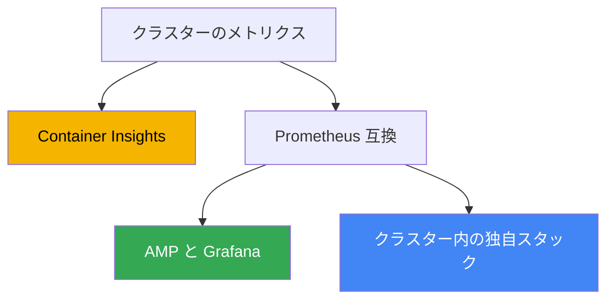
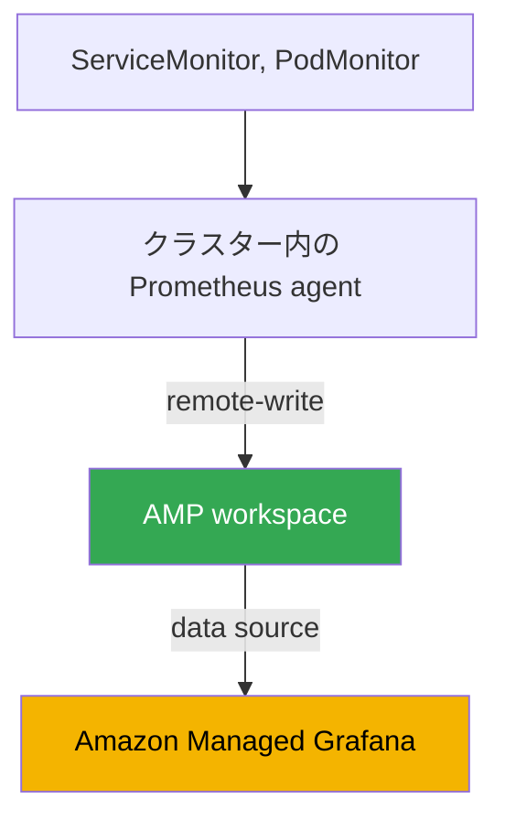

[Русская версия](ru.md) · [Eng version](en.md) · [Versión en español](es.md) · [Version française](fr.md) · [Deutsche Version](de.md) · [ქართული ვერსია](ge.md) · [繁體中文版](tw.md)
# 第33章. メトリクス: Container Insights、Managed Prometheus と Grafana、kube-prometheus-stack

> **次は何か。** パート6はオブザーバビリティについてです。クラスターとワークロードの内部で何が起きているかを把握する方法を扱います。まず、ノード、Pod、control plane の使用状況を表す数値時系列であるメトリクスから始めます。ログ（Fluent Bit、CloudWatch Logs、OpenSearch）は第34章、メトリクスによるアプリケーションのオートスケーリング（HPA、外部メトリクス、KEDA）は第35章、ADOT と X-Ray による分散トレーシングは第36章、Kubecost と OpenCost によるコストの把握と最適化は第43章で扱います。この章で扱うのは1点です。EKS のメトリクスはどこから来て、どこに保存され、何で見るのかです。

## 33.1. 「kubectl top が失敗し、HPA が動かず、クラスターの使用状況が見えない」

クラスターを展開したばかりで、ワークロードもデプロイされ、すべて問題なく動いているように見えます。オンコールのエンジニアが最初に問うのは、「今ノードと Pod はどれだけの CPU とメモリを使っているのか」です。慣れたコマンドで確認しますが、行き止まりになります。

```bash
kubectl top nodes
# error: Metrics API not available

kubectl top pods -A
# error: Metrics API not available
```

メトリクスがまったくありません。`kubectl top` はノードも Pod も返しません。CPU を対象に設定した HPA は、現在の使用量を取得する場所がないため `<unknown>/50%` の状態のままで、何もスケールしません。「クラスターは負荷が高いか、ノードを追加する時期か」という問いにも答えられません。capacity を計画する根拠がなく、負荷時の劣化もユーザーからの苦情でしかわかりません。

原因は、EKS が managed control plane であり、アプリケーション向けメトリクスを自動では提供しないことです。誰かがあらかじめ metrics-server と監視スタックを導入している多くの self-managed クラスターとは異なり、新しい EKS にはそれらがありません。AWS は API server、scheduler、controller manager の稼働に責任を持ちますが、ノードと Pod のメトリクスを収集、保存、表示するのはあなたの仕事です。control plane が外部に出すのは、自身の基本メトリクス一式だけです（後述）。それ以外は自分で構築する必要があります。

以降では3つを扱います。`kubectl top` と HPA を動かす基本レイヤーである metrics-server、EKS で完全なメトリクスを収集・保存する3つの方法（Container Insights、Amazon Managed Prometheus、self-managed kube-prometheus-stack）、そしてクラスターで監視すべき対象です。

## 33.2. metrics-server: kubectl top と HPA のための基本レイヤー

新しいクラスターで最初に導入するのが **metrics-server** です。これは各ノードの kubelet からリソース使用量（CPU とメモリ）を収集し、Kubernetes Metrics API（`metrics.k8s.io`）を通じて提供する Kubernetes コンポーネントです。`kubectl top` と、resource metrics に基づいてスケールする Horizontal Pod Autoscaler は、この API を読み取ります。

境界を理解することが重要です。metrics-server は**ストレージではありません**。最新の値だけをメモリに保持し、履歴、retention、先週のクエリ、アラートはありません。その役割は、`kubectl top` と HPA という2つの利用者に「今この瞬間」の情報を渡すことです（HPA とメトリクスの関係は第35章）。ダッシュボード、トレンド、通知には、後で扱う完全なメトリクススタックが必要です。

EKS では metrics-server はデフォルトでインストールされません。個別に導入します。方法はいくつかあります。

```bash
# EKS Add-ons 経由の community add-on として
aws eks create-addon --cluster-name my-cluster --addon-name metrics-server

# または upstream のマニフェストで
kubectl apply -f https://github.com/kubernetes-sigs/metrics-server/releases/latest/download/components.yaml
```

導入後、`kubectl top nodes` は使用量を返すようになり、CPU とメモリを対象とする HPA も動き始めます。ただし、これは基盤にすぎません。metrics-server は即時の問いを解決し、履歴、ダッシュボード、アラートは次の3つのアプローチで提供されます。

## 33.3. EKS におけるメトリクスの3つの経路

EKS での完全なメトリクス収集は、通常3つの方法のいずれかで構築します。ストレージと収集を誰が管理するか、そして AWS-native か Kubernetes-native かが異なります。



それぞれの概要を述べ、以降の節で詳しく扱います。

- **CloudWatch Container Insights**: AWS-native の経路です。クラスター内のエージェントがメトリクスを収集して CloudWatch に送り、ダッシュボードとアラームも同じ場所にあります。すべて AWS が管理します。
- **Amazon Managed Service for Prometheus (AMP)**: managed な Prometheus 互換バックエンドです。メトリクスを収集し（managed collector または ADOT）、remote-write により workspace へ書き込みます。クエリは PromQL、ダッシュボードは Amazon Managed Grafana です。
- **kube-prometheus-stack**: self-managed の方法です。Helm により Prometheus、Grafana、Alertmanager をクラスター内に導入します。完全な制御を得られますが、ストレージと運用は自分で担います。

これらは相互排他的ではありません。比較の節で説明するように、ハイブリッドを採用することもよくあります。順に見ていきます。

## 33.4. CloudWatch Container Insights

**Container Insights** は、CloudWatch を使って EKS を監視する方法です。ノード、Pod、namespace、クラスターのメトリクスはクラスター内のエージェントが収集し、CloudWatch に送信して既成のダッシュボードに表示します。その上に CloudWatch alarms を構築します。

これは **amazon-cloudwatch-observability** という単一の EKS add-on で導入します。この add-on は CloudWatch Observability Operator をデプロイし、CloudWatch agent を導入して、Container Insights **with enhanced observability** を有効にします。Enhanced observability では、Pod とコンテナごとの内訳を含むより詳細なメトリクスが得られます。managed ノードと Fargate では、エージェントを手動設定せずに状況を把握できます。同じ add-on により、アプリケーションの APM レベル用の CloudWatch Application Signals も有効になります。

```bash
# managed EKS add-on により Container Insights を有効化する
aws eks create-addon \
  --cluster-name my-cluster \
  --addon-name amazon-cloudwatch-observability
```

標準で得られるものは次のとおりです。

- **ノード、Pod、namespace、クラスターのメトリクス**: CPU、メモリ、ネットワーク、ディスクが CloudWatch の `ContainerInsights` namespace に入り、既成のダッシュボードを利用できます。
- **無料の基本 control plane メトリクス**: add-on とは別に、バージョン `1.28` 以降のクラスターでは、CloudWatch が API server、scheduler などの vended メトリクス一式を `AWS/EKS` namespace で提供します。何かをインストールする必要はありません。
- **AWS との統合**: alarms、composite alarms、SNS への送信、他の AWS メトリクスとの連携がすべて同じコンソールで行え、別のスタックは不要です。

料金モデルは量に基づきます。取り込んだ（ingested）メトリクス、保存メトリクス、クエリに対して課金されます。ログ収集を有効化した場合はログにも料金がかかります（ログは第34章）。CloudWatch をすでに利用しており、独自の Prometheus を運用したくない場合、Container Insights は適しています。運用を最小限に抑え、すべて managed です。その代わり、CloudWatch のデータモデルとクエリ言語に結び付けられます。PromQL は利用できません。

## 33.5. Amazon Managed Prometheus と Managed Grafana

チームが Prometheus と PromQL の考え方を使いたい一方で、独自の Prometheus を保持、スケールしたくない場合には、**Amazon Managed Service for Prometheus (AMP)** があります。これは managed な Prometheus 互換バックエンドです。サーバーを立ち上げる必要はありません。AMP は **workspace**、すなわち Prometheus 互換 API を持つ分離されたメトリクスストレージを提供します。データは **remote-write** で送信され、クエリは PromQL で実行します。スケーリングと retention は AWS 側で行われます。

workspace にメトリクスを収集する方法は2つあります。

- **AWS managed collector (scraper)**: 完全 managed な agentless collector です。EKS クラスターから Prometheus 互換メトリクスを自動的に検出して取得し、`remote_write` によって workspace に書き込みます。クラスターに何かをインストールまたはパッチする必要はありません。scraper は指定した subnet に ENI を作成し、VPC endpoint 経由で接続するため、トラフィックはインターネットに出ません。
- **Customer managed collector**: クラスター内の独自 collector です。多くの場合は ADOT collector（AWS Distribution for OpenTelemetry）、または workspace への remote-write を設定した agent モードの Prometheus です。何をどのように scrape するかをより細かく制御できますが、collector の運用は自分で行います。

書き込み権限は AWS managed policy の `AmazonPrometheusRemoteWriteAccess` で付与します（IRSA または Pod Identity。第16-17章）。書き込み endpoint と workspace ID は次のように確認します。

```bash
# workspace の一覧と状態
aws amp list-workspaces --output table

# 特定 workspace の remote-write endpoint
aws amp describe-workspace --workspace-id ws-xxxxxxxx \
  --query "workspace.prometheusEndpoint" --output text
```

AMP はストレージとクエリエンジンであり、ダッシュボードではありません。可視化には managed Grafana である **Amazon Managed Grafana (AMG)** を使用します。AMG は AMP を data source として追加します。新しいバージョンでは、service-managed IAM role を使用する AWS data source configuration により、権限が自動的に付与されます。workspace へのユーザーアクセスは **IAM Identity Center**（SSO）で設定します。つまり、managed collector が収集し、AMP が保存して PromQL に応答し、AMG がダッシュボードを描画する構成になり、どのコンポーネントも自分で運用しません。

## 33.6. Self-managed kube-prometheus-stack

3つ目の経路は、Prometheus スタック全体をクラスター内に自分で導入することです。ここでの事実上の標準は Helm chart の **kube-prometheus-stack** であり、Prometheus Operator、Prometheus、Grafana、Alertmanager、node-exporter、kube-state-metrics をまとめてデプロイします。

重要な役割を担うのが **Prometheus Operator** です。これは CRD を導入し、モノリシックな `prometheus.yml` を編集せずに、Kubernetes らしい宣言的な方法で scrape 設定を記述できます。

- **ServiceMonitor**: 「この Service の背後にある endpoint を scrape する」というものです。label selector でアプリケーションメトリクスを接続する典型的な方法です。
- **PodMonitor**: Service を介さず、Pod を直接対象にする点以外は同じです。
- **PrometheusRule**: Alertmanager 向けのアラートルールと recording rules です。

```bash
# スタックをクラスターにインストールする
helm repo add prometheus-community https://prometheus-community.github.io/helm-charts
helm install kube-prometheus-stack prometheus-community/kube-prometheus-stack \
  -n monitoring --create-namespace
```

メトリクス量はバックエンドのコストと負荷になるため、高カーディナリティのメトリクスと label は、書き込み前かつ AMP への remote-write 前の scrape 時点で除外します。Prometheus の scrape config では `metric_relabel_configs`、ServiceMonitor と PodMonitor では `metricRelabelings` フィールドでこれを行います。

```yaml
metric_relabel_configs:
  # 名前で高カーディナリティのメトリクス全体を除外する
  - source_labels: [__name__]
    regex: apiserver_request_duration_seconds_bucket
    action: drop
  # series 数を増大させる不要な高カーディナリティ label を除去する
  - action: labeldrop
    regex: (pod_uid|container_id)
```

このような整理をしなければ、時系列の数は制御不能に増加します。それに伴い、managed バックエンドへの取り込みと保存のコスト、およびローカル Prometheus の負荷も増えます。

このアプローチの長所は完全な制御とポータビリティです。同じ chart と同じ ServiceMonitor は、AWS に縛られず EKS だけでなくあらゆる Kubernetes で動作します。短所は運用をすべて自分で担うことです。ストレージと retention（PV が必要であり、サイズと保存期間を自分で計算します）、規模増加時の高可用性と federation、アップデート、Prometheus 自体に必要なリソースが該当します。大きなクラスターでは Prometheus はかなりのメモリを消費します。AMP はまさにこの負担を取り除きます。

## 33.7. 3つのアプローチの比較とハイブリッド

選択は、どの程度の運用を引き受けられるか、PromQL とポータビリティがどれほど必要かに集約されます。

| 基準 | Container Insights | Managed Prometheus (AMP) | kube-prometheus-stack |
|---|---|---|---|
| 管理者 | AWS | AWS（ストレージ） | 自分たち |
| クエリ言語 | CloudWatch、PromQL なし | PromQL | PromQL |
| ダッシュボード | CloudWatch | Amazon Managed Grafana | クラスター内の Grafana |
| 収集 | CloudWatch agent（add-on） | managed collector または ADOT | クラスター内の Prometheus |
| ストレージと retention | CloudWatch、managed | workspace、managed | 自分たちの PV、自分たちの責任 |
| 運用 | 最小 | 低い | 高い |
| 依存性 | CloudWatch に依存 | Prometheus 互換 | ポータブル |
| 選ぶ場面 | CloudWatch を利用している | 独自サーバーなしで PromQL が必要 | 完全な制御が必要 |

アプローチは組み合わせることもできます。よくあるハイブリッドは、**AMP をストレージ、kube-prometheus-stack を scraping、AMG をダッシュボードに使う**構成です。Prometheus Operator と ServiceMonitor は収集を記述する慣れた方法として残し、ローカル Prometheus は agent モードで動作して remote-write によりデータを AMP に送ります。長期保存、高可用性、スケールは managed workspace が担います。このため、Kubernetes-native な設定モデルを維持しつつ、最も重い部分であるメトリクスストレージを自分で管理せずに済みます。



別の選択肢は、独自の Prometheus ではなく managed collector を使うことです。この場合、クラスター内ではスタックの何も実行されず、収集、保存、クエリのすべてを AWS が担います。これは PromQL への最も managed な経路です。

### 所有コスト: 各ケースで何に支払うか

「自分の Prometheus は無料だ」というのが、この章で最も大きな誤解です。どちらの場合でも支払いは発生します。項目が異なるだけで、AWS からの請求書があるかどうかではなく、それらを比較する必要があります。

| 項目 | 自前スタック（Prometheus、Grafana） | AMP と AMG |
|---|---|---|
| メトリクス取り込み | scraping 用のノードリソース | 取り込んだ sample 量に応じて課金 |
| ストレージ | retention 分と余裕のための EBS volume | メトリクス量に応じて課金、elastic |
| クエリ | Prometheus の CPU とメモリ、重い PromQL は停止要因になる | 処理した sample に対して課金 |
| 耐障害性 | 2 replica と deduplication、つまり2倍の消費 | サービス内部 |
| ダッシュボード | Grafana は無料だが、更新とバックアップは自分で行う | アクティブユーザーに対する料金 |
| 作業 | 成長時の upgrade、sharding、オンコール対応 | 最小限 |

計算時の直感を崩す点が3つあります。第1に、AMP の請求額を左右する主因はストレージではなく**データ取り込み**です。したがって、節約のために retention を減らしてもほとんど意味がありません。有効な手段は、scrape 頻度を下げる（`scrape_interval`）ことと、`relabel_config` で不要な series をフィルタリングして収集量を減らすことです。第2に、**クエリにも料金がかかり**、アラートもクエリです。このため、AMP のネイティブアラートは外部アラートより有利です。Grafana の高可用アラートは複数の zone からデータを問い合わせ、クエリコストを増やします。第3に、どちらにも共通するのが**カーディナリティ**です。リクエストごと、または Pod ごとに一意な値を持つ label は、数十の series を数百万に変えます。managed では請求額に、独自スタックでは Prometheus の OOMKilled に表れます。どちらの問題もベンダー選択ではなく label の規律で解決します（サイジングは第14章、コスト全体は第43章）。

### 長期 retention: Thanos、Mimir、VictoriaMetrics

self-managed スタックがより大きなものへ発展する理由となる別の課題があります。ローカル Prometheus は1年分の履歴を想定していません。retention はディスクで制限され、インスタンスを垂直に拡張する方法も限界に達します。業界の答えは、履歴を object storage に移すことです。

**Thanos** はこのための最もよく知られた仕組みであり、単一サービスではなくコンポーネント群です。

- Prometheus の横にある **sidecar** が、完成した TSDB block を S3 にアップロードします。
- **store gateway** は bucket から block を読み、index をキャッシュして履歴データを提供します。
- **compactor** は小さな block を統合し、downsampling を実行して retention を適用します。
- **querier** はすべてのソースにまたがる PromQL に応答し、HA pair のデータを deduplicate します。
- **ruler** は履歴データに対して rule と alert を評価します。

利点は、ローカルの Prometheus が数週間ではなく数時間または数日だけを保持すればよいことです。高価な EBS volume とメモリを節約し、履歴は S3 に保持できます。その対価は、更新しオンコール対応する必要がある4から6個の新しいコンポーネントと、object storage へのクエリおよびその前段の cache です。同じ種類の課題は、コンポーネントの寄せ集めではなく1つのシステムが必要な場合に **Grafana Mimir**（Cortex の考え方を発展させたもの）でも解決できます。

**VictoriaMetrics** は同じ課題への別のアプローチです。Prometheus の拡張ではなく、ストレージの置き換えです。`vmagent`（または remote-write モードの Prometheus）がデータを受け取り、単一ノードでは `vmsingle`、クラスターでは `vminsert`、`vmstorage`、`vmselect` が保存します。`vmalert` がアラートを評価し、保存期間は `-retentionPeriod` という1つの flag で設定します。クエリ言語 MetricsQL は PromQL と互換で独自の関数を追加し、Grafana のダッシュボードはそのまま動作します。Thanos よりコンポーネントは少ないですが、履歴は S3 ではなくディスクに保存されるため、ディスクとその拡張は引き続き自分の責任です。移行の一般的な理由は、同じデータに対する CPU とメモリ消費が小さいことです。ただし、これは鵜呑みにせず自分の負荷で検証すべきです。

AWS との関係では、AMP はコンポーネントなしで同じ課題を解決します。Thanos、Mimir、VictoriaMetrics は、ストレージの制御、マルチクラウド、または非常に大規模な量における独自の経済性が必要なときに採用します。

## 33.8. EKS で監視するもの

ツールは半分にすぎず、残り半分はどのメトリクスを収集するかです。クラスターの指針は次のとおりです。

- **ノードメトリクス**: CPU、メモリ、ディスク（`/var/lib/kubelet` と root filesystem の使用率を含む）、ネットワークです。kube-prometheus-stack では node-exporter、または CloudWatch agent がこれを提供します。ここでは、Pod の退避や `Node Pressure` につながるリソース不足を検出します。
- **Pod とコンテナのメトリクス**: requests と limits に対する CPU とメモリ消費、restart、OOMKilled です。これにより、誤ったサイジング（第14章）とメモリリークを見つけられます。
- **control plane メトリクス**: API server（latency、error rate、throttling）、scheduler、controller manager です。一部はバージョン `1.28` 以降で `AWS/EKS` namespace から無料で提供され、AMP managed collector は API server、kube-scheduler、kube-controller-manager のメトリクスを直接 scrape できます。
- **kube-state-metrics**: Kubernetes object の状態を提供する独立したコンポーネントです。`Pending` の Pod 数、Deployment の ready 状態、Job の停止、replica 数が希望数と一致するかを示します。これはリソース使用量ではなく API object の状態であり、これなしでは状況が不完全です。

メトリクスの集合から意味のある監視を組み立てるには、2つの方法論が役立ちます。**USE**（リソース向け: Utilization、Saturation、Errors）は、各リソースを使用率、飽和、エラーで見るもので、ノードとインフラストラクチャに適します。**RED**（サービス向け: Rate、Errors、Duration）は、リクエスト頻度、エラー率、応答時間であり、アプリケーションに適します。実際には両者を組み合わせます。ハードウェアとノードには USE、上位のワークロードには RED です。

## 33.9. 本番環境での適用方法

- **metrics-server はすぐ導入します。** 新しいクラスターの最初のコンポーネントです。これがないと `kubectl top` と HPA が動かず、基本的な運用衛生を満たせません。
- **主となるメトリクスバックエンドを1つ選び、スタックを乱立させません。** CloudWatch Container Insights（AWS console を主に使う場合）か、Prometheus 互換の経路（AMP または self-managed）のいずれかにします。並行する2つのスタックは、コストも運用も2倍です。
- **反対の理由がなければ managed を self-managed より優先します。** AMP と AMG はストレージ、HA、スケールの負担を取り除きます。独自の kube-prometheus-stack は、完全な制御、air gap、クラウド間ポータビリティのために選びます。
- **AMP + Prometheus agent + AMG のハイブリッドはよくある妥協点です。** ServiceMonitor による Kubernetes-native な収集設定を維持しつつ、メトリクスストレージの管理を不要にします。
- **kube-state-metrics は必ず導入します。** object の状態（Pending、restart）がなければ、監視は使用量を見ても「何かがデプロイされない」ことを把握できません。
- **`metric_relabel_configs` でメトリクス量を制御します。** 高カーディナリティのメトリクスと label は、書き込みと remote-write の前に除外します。そうしなければコストとバックエンド負荷が増加します。
- **メトリクスは最初からアラートに結び付けます。** 誰も見ないダッシュボードは役に立ちません。主要な signal（圧迫されたノード、増加する API server error、OOMKilled）を CloudWatch alarms または Alertmanager に設定します。

## 33.10. ミニ用語集

- **metrics-server**: kubelet から CPU とメモリを収集し、`kubectl top` と HPA のため Metrics API で提供するコンポーネントです。履歴とストレージはありません。
- **Metrics API (`metrics.k8s.io`)**: 現在のリソースメトリクスの Kubernetes API です。`kubectl top` と resource metrics に基づく HPA のデータソースです。
- **Container Insights**: CloudWatch による EKS 監視です。agent がノードと Pod のメトリクスを収集し、ダッシュボードと alarms は CloudWatch にあります。
- **amazon-cloudwatch-observability**: CloudWatch agent を導入し、Container Insights with enhanced observability を有効化する managed EKS add-on です。
- **Amazon Managed Service for Prometheus (AMP)**: managed な Prometheus 互換バックエンドです。workspace、remote-write、PromQL があり、retention は AWS 側で管理されます。
- **workspace**: AMP の分離されたメトリクスストレージです。固有の remote-write endpoint と Prometheus 互換 API を持ちます。
- **managed collector (scraper)**: EKS メトリクスを scrape し、remote-write により workspace へ書き込む AMP の managed な agentless collector です。
- **Amazon Managed Grafana (AMG)**: managed Grafana です。AMP を data source として接続し、ユーザーアクセスは IAM Identity Center で管理します。
- **kube-prometheus-stack**: Prometheus Operator、Prometheus、Grafana、Alertmanager、node-exporter、kube-state-metrics を含む Helm chart です。
- **ServiceMonitor、PodMonitor**: scrape する endpoint を宣言的に記述する Prometheus Operator の CRD です。
- **kube-state-metrics**: Kubernetes object の状態（Pending、replica、restart）をメトリクスとして提供するコンポーネントです。
- **Thanos**: Prometheus に object storage での長期保存を追加するコンポーネント群です。`sidecar` が block を S3 にアップロードし、`store gateway` が読み戻し、`compactor` が compaction、downsampling、retention 適用を行い、`querier` が統一 PromQL と HA pair の deduplication を提供し、`ruler` が履歴に対して rule を評価します。同じ種類の課題を扱うものに **Grafana Mimir** があります。
- **VictoriaMetrics**: 拡張ではなくメトリクスストレージの置き換えです。収集には `vmagent`、保存には `vmsingle` または `vminsert`/`vmstorage`/`vmselect` のクラスター、rule には `vmalert` を使用します。保存期間は `-retentionPeriod` flag、MetricsQL は PromQL の拡張です。Thanos よりコンポーネントは少ないですが、履歴は object storage ではなくディスクに保存されます。
- **metric_relabel_configs**: scrape config の節です（ServiceMonitor では `metricRelabelings`）。書き込みと remote-write の前に、高カーディナリティのメトリクス（`__name__` による `drop`）と label（`labeldrop`）を除外します。量とコストを制御する手段です。

## 33.11. 章のまとめ

- 新しい EKS にはメトリクスがありません。`kubectl top` は「Metrics API not available」で失敗し、HPA はスケールせず、クラスターの使用状況も見えません。control plane は AWS が管理しますが、アプリケーションにメトリクスを自動提供しません。
- metrics-server は基本レイヤーです。`kubectl top` と HPA のため、現在の CPU とメモリを Metrics API で提供します。ストレージではなく、履歴もアラートも提供せず、別途導入します。
- 完全なメトリクスは、CloudWatch Container Insights、Amazon Managed Prometheus、self-managed kube-prometheus-stack の3つの経路のいずれかで構築します。
- Container Insights は AWS-native です。amazon-cloudwatch-observability add-on（with enhanced observability）で導入し、ダッシュボードと alarms は CloudWatch にあります。料金は量に基づき、PromQL はありません。
- AMP は managed な Prometheus 互換バックエンドです。workspace、remote-write、PromQL を提供します。収集は managed collector または ADOT、ダッシュボードは Amazon Managed Grafana、アクセスは IAM Identity Center を使います。
- kube-prometheus-stack は完全な制御とポータビリティ（Prometheus Operator、ServiceMonitor、PodMonitor）を提供しますが、ストレージ、retention、HA、スケールは自分で担います。
- よくあるハイブリッドは、AMP をストレージ、kube-prometheus-stack を scraping、AMG をダッシュボードに使う構成です。ストレージの負担なしに Kubernetes-native な設定を維持できます。
- ノード、Pod、control plane、kube-state-metrics による object の状態を監視するべきです。構成には USE（リソース向け）と RED（サービス向け）が役立ちます。

## 33.12. 実務でどう役立つか

オンコール時、メトリクスはインシデントで最初に確認するものです。ノードに負荷がかかっているか、Pod が limit に達していないか、API server の latency が増えていないかを調べます。`kubectl top` が応答せずダッシュボードもなければ、インシデント解析は推測に変わります。そのため、最初の重大インシデントの後ではなく前に、基本レイヤー（metrics-server）と少なくとも1つのメトリクスバックエンドを導入しておく必要があります。クラスターでどの経路によりメトリクスを集めているかを知れば、CloudWatch、AMP 上の Grafana、ローカル Grafana のどこを見ればよいかがすぐわかります。

計画時の重要な判断は、基盤とするバックエンドを選び、複数の並行システムに拡散させないことです。Prometheus の運用専任チームを置きたくない場合は、managed の経路（Container Insights または AMP + AMG）が合理的です。完全な制御またはポータビリティが必要な場合は self-managed を選びます。すべての経路で、コストはメトリクス量とともに増加します。そのため、何をどの粒度で収集するかをあらかじめ決めます。何でも無差別に収集することは、managed バックエンドでも独自 PV でも高価です。この後、メトリクスの上にオートスケーリング（第35章）とコスト把握（第43章）を構築します。

## 33.13. 自己確認の質問

1. 新しい EKS で `kubectl top nodes` が「Metrics API not available」で失敗するのはなぜですか。
2. metrics-server は何をし、なぜ監視ではなく基本レイヤーと呼ばれますか。
3. `kubectl top` 以外に誰が Metrics API を読み取り、それは HPA とどう関係しますか。
4. EKS におけるメトリクスの収集と保存にはどの3つの経路があり、根本的にどう異なりますか。
5. Container Insights はどの add-on で有効化し、enhanced observability は何を提供しますか。
6. `AWS/EKS` namespace の基本メトリクスとは何で、どのクラスター version から無料ですか。
7. AMP の workspace とは何で、メトリクスはどのようにそこへ到達しますか。
8. managed collector (scraper) は、ADOT を使う customer managed collector とどう違いますか。
9. AMP は Amazon Managed Grafana とどのように連携し、ユーザーアクセスは何を通じて設定しますか。
10. kube-prometheus-stack は何をデプロイし、Prometheus Operator は何を担いますか。
11. ServiceMonitor と PodMonitor はなぜ必要で、手作業の設定編集より何が便利ですか。
12. AMP + kube-prometheus-stack + AMG のハイブリッドはどう構成され、何を提供しますか。
13. EKS では何を監視すべきで、USE と RED の方法論はどう異なりますか。
14. 独自メトリクススタックの料金と AMP + AMG の料金はどの項目で構成されますか。AMP で retention を減らしても請求額がほとんど減らないのはなぜで、代わりにどの手段が有効ですか。
15. Prometheus に Thanos が必要なのはなぜですか。各コンポーネントは何をし、その対価は何ですか。
16. VictoriaMetrics は、コンポーネント構成とストレージの面で Prometheus + Thanos とどう異なりますか。

## 実践

このテーマのコースラボは、[ラボ114: オブザーバビリティ: Container Insights と Grafana を使う Managed Prometheus](../../labs/114/README_JP.MD)です。加えて、メトリクスの現在の状態は稼働中のクラスターで容易に確認できます。まず、基本レイヤーが存在し、Metrics API が応答するかを確認します。

```bash
# kubectl top が動くか（metrics-server が導入済みであることを意味する）
kubectl top nodes
kubectl top pods -A

# metrics-server と Metrics API が存在するか
kubectl get deploy -n kube-system metrics-server
kubectl get apiservice v1beta1.metrics.k8s.io
```

`kubectl top` が失敗する場合、metrics-server は導入されておらず、最初に導入すべき候補です。次に、どのメトリクスバックエンドがすでに接続されているかを確認します。EKS add-on とクラスター内の監視ワークロードを確認してください。

```bash
# Container Insights と metrics-server の add-on が有効か
aws eks list-addons --cluster-name my-cluster --output table

# 存在する場合のクラスター内 Prometheus スタック
kubectl get pods -n monitoring
kubectl get servicemonitors,podmonitors -A
```

AWS 側に Prometheus 互換バックエンドがあるか、リージョン内の AMP workspace を確認します。

```bash
# Amazon Managed Prometheus の workspace と状態
aws amp list-workspaces --output table
```

最後に、Kubernetes API を通じて metrics-server が提供するメトリクス endpoint の生出力を取得できます。

```bash
# API 経由の metrics-server からの生メトリクス
kubectl get --raw "/apis/metrics.k8s.io/v1beta1/nodes" | head -c 400
```

状況を照合してください。基本レイヤー（metrics-server）があるか、長期ストレージ（Container Insights、AMP、または独自 Prometheus）があるか、アラートが設定されているかを確認します。この連鎖の隙間は、最初の重大インシデントが起きる前に埋めるべきです。

---
[目次](../README_JP.md) · [第32章](../32/jp.md) · [第34章](../34/jp.md)
