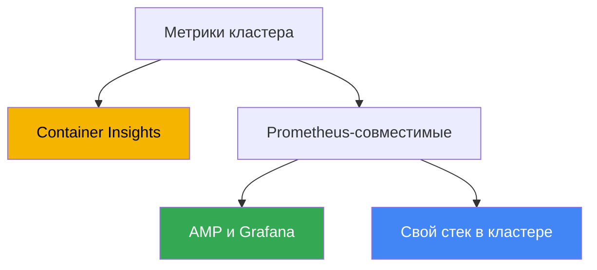
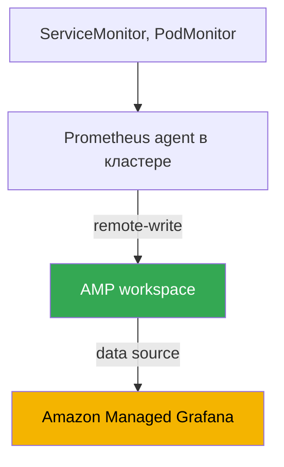

[Eng version](en.md) · [Versión en español](es.md) · [Version française](fr.md) · [Deutsche Version](de.md) · [ქართული ვერსია](ge.md) · [繁體中文版](tw.md) · [日本語版](jp.md)
# Глава 33. Метрики: Container Insights, Managed Prometheus и Grafana, kube-prometheus-stack

> **Что дальше.** Часть 6 - про наблюдаемость: как понять, что происходит внутри кластера и
> нагрузок. Начинаем с метрик - числовых временных рядов о загрузке нод, подов и control
> plane. Логи (Fluent Bit, CloudWatch Logs, OpenSearch) - в главе 34; автомасштабирование
> приложений по метрикам (HPA, внешние метрики, KEDA) - в главе 35; распределённый трейсинг
> через ADOT и X-Ray - в главе 36; учёт и оптимизация стоимости с Kubecost и OpenCost - в
> главе 43. Здесь одно: откуда в EKS берутся метрики, где они хранятся и чем их смотреть.

## 33.1. «kubectl top падает, HPA не работает, загрузку кластера не видно»

Кластер только что развёрнут, нагрузки катятся, всё вроде работает. Первый же вопрос от
инженера на дежурстве - «а сколько CPU и памяти сейчас едят ноды и поды?». Проверяем
привычной командой и упираемся в стену:

```bash
kubectl top nodes
# error: Metrics API not available

kubectl top pods -A
# error: Metrics API not available
```

Метрик нет вообще. `kubectl top` не отдаёт ни ноды, ни поды. HPA, заведённый на CPU, висит в
статусе `<unknown>/50%` и не масштабирует ничего, потому что ему неоткуда взять текущую
загрузку. На вопрос «загружен ли кластер, пора ли добавлять ноды» ответить нечем: capacity
планировать не на чем, а деградацию под нагрузкой видно только по жалобам пользователей.

Причина в том, что EKS - это управляемый control plane, и метрик приложениям он сам не
раздаёт. В отличие от многих self-managed кластеров, где кто-то заранее поставил
metrics-server и стек мониторинга, в свежем EKS их нет: AWS отвечает за работу API server,
scheduler и controller manager, но собирать, хранить и показывать метрики нод и подов - ваша
задача. Control plane отдаёт наружу лишь базовый набор своих метрик (об этом ниже), а всё
остальное надо построить.

Дальше разберём три вещи: базовый слой metrics-server, который чинит `kubectl top` и HPA; три
пути, которыми в EKS собирают и хранят полноценные метрики (Container Insights, Amazon Managed
Prometheus, self-managed kube-prometheus-stack); и что именно в кластере стоит мониторить.

## 33.2. metrics-server: базовый слой для kubectl top и HPA

Первое, что ставят в новый кластер, - **metrics-server**. Это компонент Kubernetes, который
собирает метрики использования ресурсов (CPU и память) с kubelet каждой ноды и отдаёт их через
Kubernetes Metrics API (`metrics.k8s.io`). Именно из этого API читают `kubectl top` и
Horizontal Pod Autoscaler, когда масштабируют по resource metrics.

Важно понимать границы. metrics-server - это **не хранилище**: он держит только последние
значения в памяти, без истории, без retention, без запросов за прошлую неделю и без алертинга.
Его задача - дать «здесь и сейчас» для двух потребителей: `kubectl top` и HPA (связь HPA с
метриками - глава 35). Для дашбордов, трендов и оповещений нужен полноценный стек метрик,
который разбираем ниже.

В EKS metrics-server не установлен по умолчанию - его ставят отдельно. Способов несколько:

```bash
# как community add-on через EKS Add-ons
aws eks create-addon --cluster-name my-cluster --addon-name metrics-server

# или манифестом апстрима
kubectl apply -f https://github.com/kubernetes-sigs/metrics-server/releases/latest/download/components.yaml
```

После установки `kubectl top nodes` начинает отдавать загрузку, а HPA на CPU и память
оживает. Но это только фундамент: metrics-server закрывает оперативный вопрос, а историю,
дашборды и алерты дают три подхода дальше.

## 33.3. Три пути метрик в EKS

Полноценный сбор метрик в EKS обычно строят одним из трёх способов. Они различаются тем, кто
управляет хранилищем и сбором, и насколько это AWS-native или Kubernetes-native.



Коротко о каждом, подробно - в следующих разделах:

- **CloudWatch Container Insights** - AWS-native путь. Агент в кластере собирает метрики и
  шлёт в CloudWatch, дашборды и алармы там же. Всё управляется AWS.
- **Amazon Managed Service for Prometheus (AMP)** - управляемый Prometheus-совместимый
  бэкенд. Вы собираете метрики (managed collector или ADOT), пишете их в workspace через
  remote-write, запросы на PromQL, дашборды - в Amazon Managed Grafana.
- **kube-prometheus-stack** - self-managed: Prometheus, Grafana и Alertmanager внутри
  кластера через Helm. Полный контроль, но хранение и эксплуатация на вас.

Эти пути не взаимоисключающие: часто берут гибрид, о котором в разделе сравнения. Разберём по
порядку.

## 33.4. CloudWatch Container Insights

**Container Insights** - способ мониторинга EKS средствами CloudWatch. Метрики нод, подов,
namespace и кластера собираются агентом внутри кластера, отправляются в CloudWatch и
показываются на готовых дашбордах, а поверх них строятся CloudWatch alarms.

Ставится это одним аддоном EKS - **amazon-cloudwatch-observability**. Он разворачивает
CloudWatch Observability Operator, который устанавливает CloudWatch agent и включает Container
Insights **with enhanced observability**. Enhanced observability даёт более детальные метрики -
в том числе разбивку по подам и контейнерам, а на управляемых нодах и Fargate помогает видеть
картину без ручной настройки агента. Тем же аддоном включается CloudWatch Application Signals
для APM-уровня приложений.

```bash
# включить Container Insights через управляемый аддон EKS
aws eks create-addon \
  --cluster-name my-cluster \
  --addon-name amazon-cloudwatch-observability
```

Что даёт из коробки:

- **Метрики нод, подов, namespace, кластера** - CPU, память, сеть, диск - в namespace
  `ContainerInsights` в CloudWatch, с готовыми дашбордами.
- **Базовые метрики control plane бесплатно.** Отдельно от аддона: для кластеров версии `1.28`
  и выше CloudWatch отдаёт набор vended-метрик в namespace `AWS/EKS` (метрики API server,
  scheduler и других), без установки чего-либо.
- **Интеграция с AWS.** Алармы, композитные алармы, отправка в SNS, связка с другими метриками
  AWS - всё в одной консоли, без отдельного стека.

Модель стоимости - по объёму: платите за принятые (ingested) и хранимые метрики и за запросы,
плюс за логи, если включён их сбор (логи - глава 34). Container Insights хорош, когда вы уже
живёте в CloudWatch и не хотите держать свой Prometheus: минимум эксплуатации, всё managed. За
это платите привязкой к CloudWatch как модели данных и языку запросов - PromQL здесь нет.

## 33.5. Amazon Managed Prometheus и Managed Grafana

Если команда мыслит в терминах Prometheus и PromQL, но не хочет держать и масштабировать свой
Prometheus, есть **Amazon Managed Service for Prometheus (AMP)** - управляемый
Prometheus-совместимый бэкенд. Вы не поднимаете сервер: AMP даёт **workspace** - изолированное
хранилище метрик с Prometheus-совместимым API, куда данные попадают через **remote-write**, а
запросы делаются на PromQL. Масштабирование и retention - на стороне AWS.

Собирать метрики в workspace можно двумя способами:

- **AWS managed collector (scraper)** - полностью управляемый агентless-сборщик. Он сам
  обнаруживает и вытягивает Prometheus-совместимые метрики из кластера EKS и через
  `remote_write` пишет их в workspace. Ничего не надо ставить и патчить в кластере; scraper
  создаёт ENI в указанных подсетях и ходит через VPC endpoint, трафик не идёт в интернет.
- **Customer managed collector** - свой сборщик в кластере, чаще всего ADOT collector
  (AWS Distribution for OpenTelemetry) или Prometheus в режиме agent, настроенный на
  remote-write в workspace. Больше контроля над тем, что и как скрейпится, но эксплуатация
  сборщика на вас.

Права на запись даёт AWS managed policy `AmazonPrometheusRemoteWriteAccess` (через IRSA или
Pod Identity, главы 16-17). Endpoint для записи и ID workspace смотрят так:

```bash
# список workspace и их состояние
aws amp list-workspaces --output table

# remote-write endpoint конкретного workspace
aws amp describe-workspace --workspace-id ws-xxxxxxxx \
  --query "workspace.prometheusEndpoint" --output text
```

AMP - это хранилище и движок запросов, но не дашборды. Для визуализации берут **Amazon Managed
Grafana (AMG)** - управляемый Grafana. AMG добавляет AMP как data source (в новых версиях -
через AWS data source configuration с service-managed IAM-ролью, так что права выдаются
автоматически), а доступ пользователей в workspace настраивается через **IAM Identity Center**
(SSO). Получается связка: managed collector собирает - AMP хранит и отвечает на PromQL - AMG
рисует дашборды, и ни один компонент вы не эксплуатируете сами.

## 33.6. Self-managed kube-prometheus-stack

Третий путь - поставить весь стек Prometheus внутрь кластера самому. Стандарт де-факто здесь -
Helm-чарт **kube-prometheus-stack**, который разом разворачивает Prometheus Operator,
Prometheus, Grafana, Alertmanager, node-exporter и kube-state-metrics.

Ключевую роль играет **Prometheus Operator**: он вводит CRD, которыми настройка scrape
описывается декларативно, по-кубернетовски, без правки монолитного `prometheus.yml`:

- **ServiceMonitor** - «скрейпить эндпоинты за таким Service»; типовой способ подключить
  метрики приложения по label-селектору.
- **PodMonitor** - то же, но напрямую по подам, без Service.
- **PrometheusRule** - правила алертов и recording rules для Alertmanager.

```bash
# установка стека в кластер
helm repo add prometheus-community https://prometheus-community.github.io/helm-charts
helm install kube-prometheus-stack prometheus-community/kube-prometheus-stack \
  -n monitoring --create-namespace
```

Объём метрик - это стоимость и нагрузка на бэкенд, поэтому высококардинальные метрики и лейблы
отбрасывают ещё на скрейпе, до записи и до remote-write в AMP. Делает это
`metric_relabel_configs` в scrape config Prometheus; в ServiceMonitor и PodMonitor это поле
`metricRelabelings`:

```yaml
metric_relabel_configs:
  # отбросить высококардинальную метрику целиком по имени
  - source_labels: [__name__]
    regex: apiserver_request_duration_seconds_bucket
    action: drop
  # снять лишний высококардинальный лейбл, раздувающий число рядов
  - action: labeldrop
    regex: (pod_uid|container_id)
```

Без такой чистки число временных рядов растёт неконтролируемо, а с ним - стоимость приёма и
хранения на managed-бэкенде и нагрузка на локальный Prometheus.

Плюс подхода - полный контроль и переносимость: тот же чарт и те же ServiceMonitor работают в
любом Kubernetes, не только в EKS, без привязки к AWS. Минус - вся эксплуатация на вас:
хранение и retention (нужны PV, а их размер и срок хранения вы считаете сами), высокая
доступность и федерация при росте, обновления, ресурсы под сам Prometheus, который на большом
кластере ест немало памяти. Именно эти заботы AMP и снимает.

## 33.7. Сравнение трёх подходов и гибрид

Выбор сводится к тому, сколько эксплуатации вы готовы взять и насколько нужен PromQL и
переносимость.

| Критерий | Container Insights | Managed Prometheus (AMP) | kube-prometheus-stack |
|---|---|---|---|
| Кто управляет | AWS | AWS (хранилище) | вы |
| Язык запросов | CloudWatch, без PromQL | PromQL | PromQL |
| Дашборды | CloudWatch | Amazon Managed Grafana | Grafana в кластере |
| Сбор | CloudWatch agent (аддон) | managed collector или ADOT | Prometheus в кластере |
| Хранение и retention | CloudWatch, managed | workspace, managed | ваши PV, ваша забота |
| Эксплуатация | минимум | низкая | высокая |
| Привязка | к CloudWatch | Prometheus-совместимо | переносимо |
| Когда брать | живёте в CloudWatch | нужен PromQL без своего сервера | нужен полный контроль |

Подходы комбинируют. Частый гибрид: **AMP как хранилище + kube-prometheus-stack для скрейпинга
+ AMG для дашбордов**. Prometheus Operator и ServiceMonitor остаются привычным способом
описывать сбор, локальный Prometheus работает в режиме agent и через remote-write отгружает
данные в AMP, а долговременное хранение, HA и масштаб берёт на себя managed workspace. Так вы
сохраняете Kubernetes-native модель настройки, но снимаете с себя самую тяжёлую часть -
хранение метрик.



Ещё вариант - managed collector вместо своего Prometheus: тогда в кластере не работает вообще
ничего из стека, а сбор, хранение и запросы полностью на стороне AWS. Это самый managed путь к
PromQL.

### Цена владения: за что платите в каждом случае

«Свой Prometheus бесплатный» - главное заблуждение этой главы. Платят в обоих случаях, просто
статьи разные, и сравнивать надо их, а не наличие счёта от AWS.

| Статья | Свой стек (Prometheus, Grafana) | AMP плюс AMG |
|---|---|---|
| Приём метрик | ресурсы нод под скрейпинг | оплачивается объём принятых сэмплов |
| Хранение | тома EBS: объём на retention плюс запас | оплачивается объём метрик, эластично |
| Запросы | CPU и память Prometheus, тяжёлый PromQL кладёт его | оплачиваются обработанные сэмплы |
| Отказоустойчивость | две реплики плюс дедупликация, то есть двойной расход | внутри сервиса |
| Дашборды | Grafana бесплатна, но обновления и бэкап на вас | плата за активных пользователей |
| Труд | апгрейды, шардирование при росте, дежурство | минимальный |

Дальше три вещи, которые ломают интуицию при подсчёте. Первое: у AMP основной драйвер счёта -
**приём данных**, а не хранение; поэтому уменьшать retention ради экономии почти бессмысленно,
а работающие рычаги - реже скрейпить (`scrape_interval`) и меньше собирать, отфильтровав
ненужные серии через `relabel_config`. Второе: **запросы тоже платные**, и алерты - это тоже
запросы, поэтому нативный алертинг AMP выгоднее внешнего: высокодоступный алертинг в Grafana
опрашивает данные из нескольких зон и множит стоимость запросов. Третье, общее для обоих
вариантов: **кардинальность**. Метка с уникальным значением на запрос или на под превращает
десяток серий в миллионы, и в managed это видно в счёте, а в своём стеке - в OOMKilled у
Prometheus. Обе беды лечатся не выбором вендора, а дисциплиной в метках (сайзинг - глава 14,
стоимость целиком - глава 43).

### Долгий retention: Thanos, Mimir, VictoriaMetrics

Отдельная задача, из-за которой self-managed стек и вырастает во что-то большее: локальный
Prometheus не рассчитан на год истории. Retention упирается в диск, а вертикальный рост
инстанса заканчивается. Ответ индустрии - вынести историю в объектное хранилище.

**Thanos** - самый известный набор для этого, и он именно набор компонентов, а не один сервис:

- **sidecar** рядом с Prometheus выгружает готовые блоки TSDB в S3;
- **store gateway** отдаёт исторические данные, читая блоки из бакета и кэшируя индекс;
- **compactor** склеивает мелкие блоки, делает downsampling и применяет retention;
- **querier** отвечает на PromQL поверх всех источников сразу и дедуплицирует данные HA-пар;
- **ruler** считает правила и алерты по историческим данным.

Выгода в том, что локально Prometheus держит часы или дни вместо недель: дорогие EBS-тома и
память экономятся, а история живёт в S3. Плата за это - четыре-шесть новых компонентов, которые
надо обновлять и дежурить за ними, плюс запросы к объектному хранилищу и кэши перед ним. Тот же
класс задач решает **Grafana Mimir** (развитие идей Cortex), если хочется одну систему вместо
россыпи компонентов.

**VictoriaMetrics** - другой подход к той же задаче: не надстройка над Prometheus, а замена
хранилища. Данные принимает `vmagent` (или ваш Prometheus в режиме remote-write), хранит
`vmsingle` на одной ноде либо кластер из `vminsert`, `vmstorage` и `vmselect`, алерты считает
`vmalert`, а срок хранения задаётся одним флагом `-retentionPeriod`. Язык запросов MetricsQL
совместим с PromQL и добавляет свои функции, дашборды Grafana работают как есть. Компонентов
меньше, чем в Thanos, но история лежит на дисках, а не в S3, поэтому диски и их рост остаются
вашей заботой. Обычная причина перехода - меньший расход CPU и памяти на тех же данных; это
стоит проверять на своей нагрузке, а не принимать на веру.

Как это соотносится с AWS: AMP закрывает ту же задачу без компонентов вообще, а Thanos,
Mimir и VictoriaMetrics берут, когда нужен контроль над хранилищем, мультиоблако или своя
экономика на очень больших объёмах.

## 33.8. Что мониторить в EKS

Инструмент - половина дела; вторая - какие метрики собирать. Ориентиры для кластера:

- **Метрики нод.** CPU, память, диск (в том числе заполнение файловой системы под
  `/var/lib/kubelet` и корневого), сеть. Их отдаёт node-exporter (в kube-prometheus-stack) или
  CloudWatch agent. Здесь ловят нехватку ресурсов, приводящую к вытеснению подов и `Node
  Pressure`.
- **Метрики подов и контейнеров.** Потребление CPU и памяти против requests и limits, рестарты,
  OOMKilled. По ним видно неверный сайзинг (глава 14) и утечки.
- **Метрики control plane.** API server (латентность, частота ошибок, throttling),
  scheduler, controller manager. Часть отдаётся бесплатно в namespace `AWS/EKS` (версия `1.28`
  и выше), а AMP managed collector умеет скрейпить метрики API server, kube-scheduler и
  kube-controller-manager напрямую.
- **kube-state-metrics.** Отдельный компонент, который отдаёт состояние объектов Kubernetes:
  сколько подов в `Pending`, готовы ли Deployment, не залип ли Job, соответствует ли число
  реплик желаемому. Это не загрузка ресурсов, а состояние API-объектов - без него картина
  неполна.

Как из набора метрик собрать осмысленный мониторинг, помогают две методики. **USE** (для
ресурсов: Utilization, Saturation, Errors) - смотреть на каждый ресурс через загрузку,
насыщение и ошибки; подходит для нод и инфраструктуры. **RED** (для сервисов: Rate, Errors,
Duration) - частота запросов, доля ошибок, время ответа; подходит для приложений. На практике
их сочетают: USE - для железа и нод, RED - для нагрузок поверх.

## 33.9. Как это применяют в продакшене

- **metrics-server ставят сразу.** Это первый компонент нового кластера: без него не работают
  `kubectl top` и HPA, а это базовая гигиена эксплуатации.
- **Выбирают один основной бэкенд метрик и не плодят стеки.** Либо CloudWatch Container
  Insights (если живут в AWS-консоли), либо Prometheus-совместимый путь (AMP или self-managed);
  два параллельных стека - это двойная стоимость и двойная эксплуатация.
- **Managed предпочитают self-managed, когда нет причин обратного.** AMP и AMG снимают
  хранение, HA и масштаб; свой kube-prometheus-stack берут ради полного контроля, эйр-гэпа или
  переносимости между облаками.
- **Гибрид AMP + Prometheus agent + AMG - частый компромисс.** Kubernetes-native настройка
  сбора через ServiceMonitor, но без забот о хранении метрик.
- **Обязательно ставят kube-state-metrics.** Без состояния объектов (Pending, рестарты)
  мониторинг видит загрузку, но не видит «что-то не разворачивается».
- **Объём метрик контролируют через `metric_relabel_configs`.** Высококардинальные метрики и
  лейблы отбрасывают до записи и remote-write, иначе стоимость и нагрузка на бэкенд растут.
- **Метрики сразу привязывают к алертам.** Дашборд, на который никто не смотрит, бесполезен;
  ключевые сигналы (нода под давлением, рост ошибок API server, OOMKilled) заводят в
  CloudWatch alarms или Alertmanager.

## 33.10. Мини-глоссарий

- **metrics-server** - компонент, собирающий CPU и память с kubelet и отдающий их через
  Metrics API для `kubectl top` и HPA; без истории и хранения.
- **Metrics API (`metrics.k8s.io`)** - Kubernetes API текущих метрик ресурсов, источник для
  `kubectl top` и HPA по resource metrics.
- **Container Insights** - мониторинг EKS средствами CloudWatch: агент собирает метрики нод и
  подов, дашборды и алармы в CloudWatch.
- **amazon-cloudwatch-observability** - управляемый аддон EKS, ставящий CloudWatch agent и
  включающий Container Insights with enhanced observability.
- **Amazon Managed Service for Prometheus (AMP)** - управляемый Prometheus-совместимый бэкенд;
  workspace, remote-write, PromQL, retention на стороне AWS.
- **workspace** - изолированное хранилище метрик в AMP с собственным remote-write endpoint и
  Prometheus-совместимым API.
- **managed collector (scraper)** - управляемый агентless-сборщик AMP, скрейпит метрики EKS и
  пишет в workspace через remote-write.
- **Amazon Managed Grafana (AMG)** - управляемый Grafana; подключает AMP как data source,
  доступ пользователей через IAM Identity Center.
- **kube-prometheus-stack** - Helm-чарт с Prometheus Operator, Prometheus, Grafana,
  Alertmanager, node-exporter и kube-state-metrics.
- **ServiceMonitor, PodMonitor** - CRD Prometheus Operator, декларативно описывающие, какие
  эндпоинты скрейпить.
- **kube-state-metrics** - компонент, отдающий состояние объектов Kubernetes (Pending,
  реплики, рестарты) в виде метрик.
- **Thanos** - набор компонентов, добавляющий Prometheus долгое хранение в объектном хранилище:
  `sidecar` выгружает блоки в S3, `store gateway` читает их обратно, `compactor` компактит,
  делает downsampling и применяет retention, `querier` даёт единый PromQL и дедупликацию
  HA-пар, `ruler` считает правила по истории. Тот же класс задач - **Grafana Mimir**.
- **VictoriaMetrics** - замена хранилища метрик, а не надстройка: `vmagent` для сбора,
  `vmsingle` или кластер `vminsert`/`vmstorage`/`vmselect`, `vmalert` для правил, срок хранения
  флагом `-retentionPeriod`, язык MetricsQL как расширение PromQL. Компонентов меньше, чем в
  Thanos, но история лежит на дисках, а не в объектном хранилище.
- **metric_relabel_configs** - секция scrape config (в ServiceMonitor - `metricRelabelings`),
  отбрасывающая высококардинальные метрики (`drop` по `__name__`) и лейблы (`labeldrop`) до
  записи и remote-write; инструмент контроля объёма и стоимости.

## 33.11. Итоги главы

- В свежем EKS метрик нет: `kubectl top` падает с «Metrics API not available», HPA не
  масштабирует, загрузку кластера не видно. Control plane управляется AWS и метрик приложениям
  сам не раздаёт.
- metrics-server - базовый слой: отдаёт текущие CPU и память через Metrics API для `kubectl
  top` и HPA. Это не хранилище, истории и алертов не даёт, ставится отдельно.
- Полноценные метрики строят одним из трёх путей: CloudWatch Container Insights, Amazon Managed
  Prometheus или self-managed kube-prometheus-stack.
- Container Insights - AWS-native, ставится аддоном amazon-cloudwatch-observability (with
  enhanced observability), дашборды и алармы в CloudWatch, стоимость по объёму, без PromQL.
- AMP - управляемый Prometheus-совместимый бэкенд: workspace, remote-write, PromQL; сбор через
  managed collector или ADOT; дашборды в Amazon Managed Grafana с доступом через IAM Identity
  Center.
- kube-prometheus-stack даёт полный контроль и переносимость (Prometheus Operator,
  ServiceMonitor, PodMonitor), но хранение, retention, HA и масштаб ложатся на вас.
- Частый гибрид: AMP как хранилище, kube-prometheus-stack для скрейпинга, AMG для дашбордов -
  Kubernetes-native настройка без забот о хранении.
- Мониторить стоит ноды, поды, control plane и состояние объектов через kube-state-metrics;
  структурировать помогают USE (для ресурсов) и RED (для сервисов).

## 33.12. Как это пригодится в реальной работе

На дежурстве метрики - первое, к чему тянется рука при инциденте: загружена ли нода, не
упирается ли под в limit, не растёт ли латентность API server. Если `kubectl top` молчит, а
дашбордов нет, разбор инцидента превращается в гадание, поэтому базовый слой (metrics-server) и
хотя бы один бэкенд метрик должны стоять до того, как случится первый серьёзный инцидент, а не
после. Знание, каким путём в вашем кластере собраны метрики, сразу говорит, где их смотреть - в
CloudWatch, в Grafana поверх AMP или в локальной Grafana.

При планировании ключевое решение - какой бэкенд взять за основу и не расползтись на несколько
параллельных. Managed-путь (Container Insights или AMP плюс AMG) разумен, когда не хочется
держать команду под эксплуатацию Prometheus; self-managed - когда нужен полный контроль или
переносимость. Стоимость у всех путей растёт с объёмом метрик, поэтому заранее решают, что
собирать и с какой детализацией: собирать всё подряд дорого и на managed-бэкендах, и на своих
PV. Дальше поверх метрик строят автомасштабирование (глава 35) и учёт стоимости (глава 43).

## 33.13. Вопросы для самопроверки

1. Почему в свежем EKS `kubectl top nodes` падает с «Metrics API not available»?
2. Что делает metrics-server и почему его называют базовым слоем, а не мониторингом?
3. Кто читает Metrics API кроме `kubectl top` и как это связано с HPA?
4. Какие три пути сбора и хранения метрик есть в EKS и чем они принципиально различаются?
5. Каким аддоном включается Container Insights и что даёт enhanced observability?
6. Что такое базовые метрики в namespace `AWS/EKS` и с какой версии кластера они бесплатны?
7. Что такое workspace в AMP и как в него попадают метрики?
8. Чем managed collector (scraper) отличается от customer managed collector на ADOT?
9. Как AMP связан с Amazon Managed Grafana и через что настраивается доступ пользователей?
10. Что разворачивает kube-prometheus-stack и за что отвечает Prometheus Operator?
11. Зачем нужны ServiceMonitor и PodMonitor и чем они удобнее правки конфигурации вручную?
12. Как устроен гибрид AMP плюс kube-prometheus-stack плюс AMG и что он даёт?
13. Что стоит мониторить в EKS и в чём разница между методиками USE и RED?
14. Из каких статей складывается цена своего стека метрик и цена AMP с AMG? Почему уменьшение
    retention в AMP почти не снижает счёт и какие рычаги работают вместо этого?
15. Зачем Prometheus нужен Thanos, что делает каждый его компонент и чем за это платят?
16. Чем VictoriaMetrics отличается от связки Prometheus плюс Thanos по составу и по хранению?

## Практика

Лаба курса к этой теме: [лаба 114 - Наблюдаемость: Container Insights и Managed Prometheus с
Grafana](../../labs/114/README_RU.MD). Кроме неё, текущее состояние метрик легко проверить на
живом кластере. Сначала посмотрите, есть ли базовый слой и отвечает ли Metrics API:

```bash
# работает ли kubectl top (значит, стоит metrics-server)
kubectl top nodes
kubectl top pods -A

# есть ли metrics-server и Metrics API
kubectl get deploy -n kube-system metrics-server
kubectl get apiservice v1beta1.metrics.k8s.io
```

Если `kubectl top` падает - metrics-server не установлен, и это первый кандидат на установку.
Дальше проверьте, какой бэкенд метрик уже подключён. Посмотрите аддоны EKS и рабочие нагрузки
мониторинга в кластере:

```bash
# включён ли аддон Container Insights и/или metrics-server
aws eks list-addons --cluster-name my-cluster --output table

# стек Prometheus в кластере, если он есть
kubectl get pods -n monitoring
kubectl get servicemonitors,podmonitors -A
```

Проверьте, есть ли Prometheus-совместимый бэкенд на стороне AWS - workspace AMP в регионе:

```bash
# workspace Amazon Managed Prometheus и их состояние
aws amp list-workspaces --output table
```

Наконец, через Kubernetes API можно снять сырой вывод эндпоинта метрик, который отдаёт
metrics-server:

```bash
# сырые метрики от metrics-server через API
kubectl get --raw "/apis/metrics.k8s.io/v1beta1/nodes" | head -c 400
```

Сопоставьте картину: есть ли базовый слой (metrics-server), есть ли долговременное хранилище
(Container Insights, AMP или свой Prometheus) и заведены ли алерты. Пробелы в этой цепочке
стоит закрыть до первого серьёзного инцидента.

---
[Оглавление](../README_RU.md) · [Глава 32](../32/ru.md) · [Глава 34](../34/ru.md)
