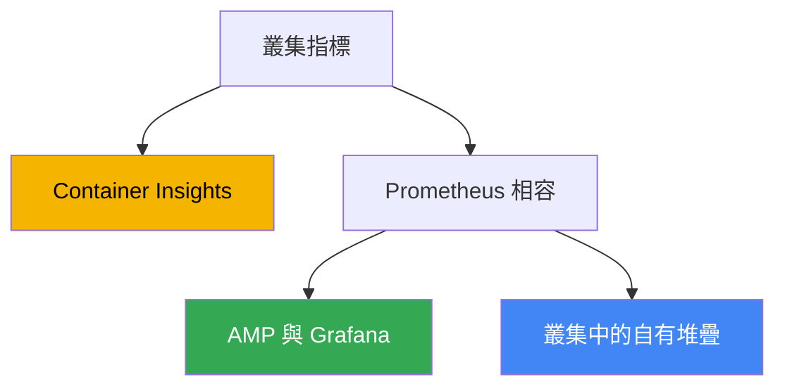
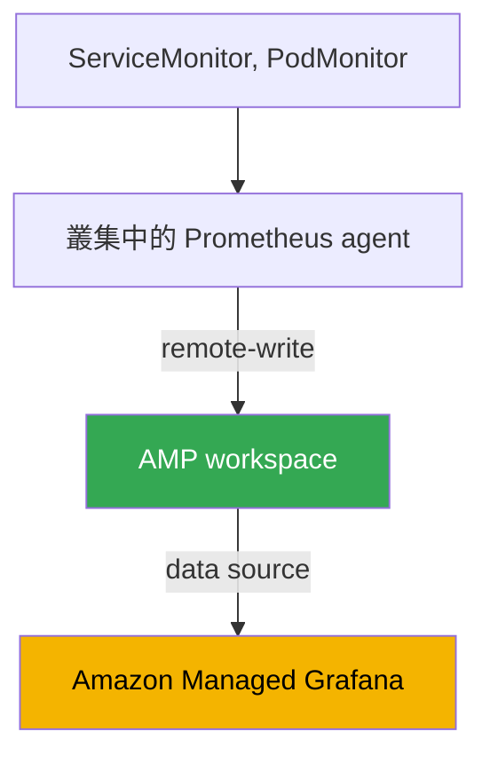

[Русская версия](ru.md) · [Eng version](en.md) · [Versión en español](es.md) · [Version française](fr.md) · [Deutsche Version](de.md) · [ქართული ვერსია](ge.md) · [日本語版](jp.md)
# 第 33 章。指標：Container Insights、Managed Prometheus 與 Grafana、kube-prometheus-stack

> **接下來。** 第 6 部分關於可觀測性：如何了解叢集和工作負載內部發生的狀況。我們從指標開始，也就是關於節點、Pod 和 control plane 使用量的數值時間序列。日誌（Fluent Bit、CloudWatch Logs、OpenSearch）見第 34 章；依指標進行應用程式自動擴展（HPA、外部指標、KEDA）見第 35 章；透過 ADOT 和 X-Ray 的分散式追蹤見第 36 章；使用 Kubecost 和 OpenCost 進行成本核算與最佳化見第 43 章。本章只討論：EKS 中的指標來自何處、儲存在哪裡，以及用什麼工具檢視。

## 33.1.「kubectl top 失敗、HPA 無法運作，且看不到叢集使用量」

叢集剛部署完成，工作負載正在推出，看似一切正常。值班工程師的第一個問題是：「節點和 Pod 現在用了多少 CPU 和記憶體？」。我們執行熟悉的指令，卻碰壁了：

```bash
kubectl top nodes
# error: Metrics API not available

kubectl top pods -A
# error: Metrics API not available
```

完全沒有指標。`kubectl top` 不會傳回節點或 Pod。依 CPU 設定的 HPA 卡在 `<unknown>/50%` 狀態，完全不會擴展，因為它無法取得目前使用量。對於「叢集是否已滿載、是否該新增節點」這個問題無從回答：沒有依據可進行 capacity 規劃，只有使用者抱怨時，才能發現負載下的劣化。

原因是 EKS 是 managed control plane，它不會自行向應用程式提供指標。不同於許多已有人預先安裝 metrics-server 與監控堆疊的 self-managed 叢集，全新的 EKS 不含這些元件：AWS 負責 API server、scheduler 與 controller manager 的運作，但收集、儲存和顯示節點與 Pod 指標是你的工作。Control plane 只向外提供一組基本指標（如下所述），其他一切都必須自行建置。

接下來會討論三件事：修復 `kubectl top` 與 HPA 的基礎層 metrics-server；在 EKS 中收集和儲存完整指標的三種途徑（Container Insights、Amazon Managed Prometheus、self-managed kube-prometheus-stack）；以及叢集中應監控的項目。

## 33.2. metrics-server：kubectl top 和 HPA 的基礎層

在新叢集中最先安裝的元件是 **metrics-server**。它是一個 Kubernetes 元件，從每個節點的 kubelet 收集資源使用量指標（CPU 和記憶體），並透過 Kubernetes Metrics API（`metrics.k8s.io`）提供它們。`kubectl top` 和依 resource metrics 擴展的 Horizontal Pod Autoscaler 正是讀取此 API。

務必了解它的界限。metrics-server **不是儲存庫**：它只在記憶體中保留最近的值，沒有歷史記錄、沒有 retention、無法查詢上週資料，也沒有告警。它的工作是為兩個使用者提供「現在」的資料：`kubectl top` 和 HPA（HPA 與指標的關聯見第 35 章）。儀表板、趨勢和通知需要完整的指標堆疊，將在下文說明。

EKS 預設不會安裝 metrics-server，必須另行安裝。方法有數種：

```bash
# 透過 EKS Add-ons 作為 community add-on
aws eks create-addon --cluster-name my-cluster --addon-name metrics-server

# 或使用 upstream manifest
kubectl apply -f https://github.com/kubernetes-sigs/metrics-server/releases/latest/download/components.yaml
```

安裝後，`kubectl top nodes` 開始傳回使用量，而依 CPU 與記憶體設定的 HPA 也會恢復運作。但這只是基礎：metrics-server 解決即時需求，歷史、儀表板與告警則由後面的三種方法提供。

## 33.3. EKS 中的三種指標途徑

EKS 的完整指標收集通常以三種方法之一建置。它們的差異在於誰管理儲存與收集，以及有多大程度是 AWS-native 或 Kubernetes-native。



各項簡述如下，後續章節會詳細說明：

- **CloudWatch Container Insights**：AWS-native 途徑。叢集中的 agent 收集指標並傳送至 CloudWatch，儀表板和 alarms 也在其中。一切由 AWS 管理。
- **Amazon Managed Service for Prometheus (AMP)**：managed Prometheus 相容後端。你收集指標（managed collector 或 ADOT），透過 remote-write 將其寫入 workspace，以 PromQL 查詢，並在 Amazon Managed Grafana 製作儀表板。
- **kube-prometheus-stack**：self-managed 方法，使用 Helm 在叢集中部署 Prometheus、Grafana 和 Alertmanager。完全掌控，但儲存與維運由你負責。

這些方法並非互斥：通常會採用比較章節中說明的混合方式。我們依序探討。

## 33.4. CloudWatch Container Insights

**Container Insights** 是使用 CloudWatch 監控 EKS 的方式。節點、Pod、namespace 和叢集的指標由叢集內的 agent 收集，傳送至 CloudWatch、顯示於現成儀表板，並可在其上建立 CloudWatch alarms。

透過單一 EKS add-on **amazon-cloudwatch-observability** 即可安裝。它會部署 CloudWatch Observability Operator，後者安裝 CloudWatch agent 並啟用 Container Insights **with enhanced observability**。Enhanced observability 提供更細緻的指標，包括依 Pod 和 container 的分類，在 managed nodes 與 Fargate 上也有助於無須手動設定 agent 即可掌握狀況。此 add-on 也會為應用程式 APM 層級啟用 CloudWatch Application Signals。

```bash
# 透過 managed EKS add-on 啟用 Container Insights
aws eks create-addon \
  --cluster-name my-cluster \
  --addon-name amazon-cloudwatch-observability
```

開箱即有的功能：

- **節點、Pod、namespace、叢集指標**：CPU、記憶體、網路、磁碟，位於 CloudWatch 的 `ContainerInsights` namespace，並附有現成儀表板。
- **免費的基本 control plane 指標。** 獨立於 add-on：對於版本 `1.28` 以上的叢集，CloudWatch 在 `AWS/EKS` namespace 提供一組 vended 指標（API server、scheduler 及其他項目的指標），無須安裝任何元件。
- **AWS 整合。** Alarms、composite alarms、傳送至 SNS，以及與其他 AWS 指標的整合，全都在同一個主控台中完成，不需要獨立堆疊。

成本模型依用量計費：你需為擷取（ingested）和儲存的指標及查詢付費；若啟用日誌收集，還要支付日誌費用（日誌見第 34 章）。當你已經使用 CloudWatch 且不想維護自己的 Prometheus 時，Container Insights 很適合：維運最少，一切都是 managed。代價是綁定 CloudWatch 的資料模型與查詢語言，這裡沒有 PromQL。

## 33.5. Amazon Managed Prometheus 和 Managed Grafana

若團隊以 Prometheus 和 PromQL 思考，但不想自行維護及擴展 Prometheus，可以使用 **Amazon Managed Service for Prometheus (AMP)**，這是一個 managed Prometheus 相容後端。你不需啟動伺服器：AMP 提供 **workspace**，也就是具備 Prometheus 相容 API 的隔離指標儲存庫，資料透過 **remote-write** 寫入，查詢則以 PromQL 進行。擴展和 retention 均由 AWS 負責。

可用兩種方式將指標收集到 workspace：

- **AWS managed collector (scraper)**：完全 managed、無 agent 的收集器。它會自行探索並擷取 EKS 叢集中的 Prometheus 相容指標，再透過 `remote_write` 寫入 workspace。不必在叢集中安裝或修補任何內容；scraper 會在指定 subnet 建立 ENI，並透過 VPC endpoint 存取，流量不會進入網際網路。
- **Customer managed collector**：叢集中自有的收集器，通常是 ADOT collector（AWS Distribution for OpenTelemetry）或設定為寫入 workspace 的 Prometheus agent 模式。可更精確控制擷取哪些內容及如何擷取，但收集器的維運由你負責。

寫入權限由 AWS managed policy `AmazonPrometheusRemoteWriteAccess` 提供（透過 IRSA 或 Pod Identity，見第 16-17 章）。可如下檢視寫入 endpoint 和 workspace ID：

```bash
# workspace 清單及其狀態
aws amp list-workspaces --output table

# 特定 workspace 的 remote-write endpoint
aws amp describe-workspace --workspace-id ws-xxxxxxxx \
  --query "workspace.prometheusEndpoint" --output text
```

AMP 是儲存庫和查詢引擎，但不是儀表板。視覺化可使用 **Amazon Managed Grafana (AMG)**，也就是 managed Grafana。AMG 將 AMP 新增為 data source（在新版本中，透過具 service-managed IAM role 的 AWS data source configuration，因此權限會自動授予），而 workspace 中的使用者存取則透過 **IAM Identity Center** (SSO) 設定。結果是：managed collector 收集資料，AMP 儲存並回應 PromQL，AMG 繪製儀表板，且你不需自行維運任何元件。

## 33.6. Self-managed kube-prometheus-stack

第三種方式是在叢集中自行安裝整套 Prometheus 堆疊。事實上的標準是 Helm chart **kube-prometheus-stack**，它一次部署 Prometheus Operator、Prometheus、Grafana、Alertmanager、node-exporter 和 kube-state-metrics。

關鍵角色是 **Prometheus Operator**：它引入 CRD，使 scrape 設定能以宣告式、Kubernetes-native 的方式描述，而不必修改單一龐大的 `prometheus.yml`：

- **ServiceMonitor**：擷取「由這個 Service 暴露的 endpoints」；典型用法是透過 label selector 連接應用程式指標。
- **PodMonitor**：功能相同，但直接針對 Pod，不經由 Service。
- **PrometheusRule**：供 Alertmanager 使用的 alert rules 和 recording rules。

```bash
# 在叢集中安裝堆疊
helm repo add prometheus-community https://prometheus-community.github.io/helm-charts
helm install kube-prometheus-stack prometheus-community/kube-prometheus-stack \
  -n monitoring --create-namespace
```

指標量代表成本和後端負載，因此應在 scrape 階段、寫入及 remote-write 到 AMP 之前，捨棄高 cardinality 指標與 labels。這由 Prometheus scrape config 中的 `metric_relabel_configs` 完成；在 ServiceMonitor 和 PodMonitor 中，此欄位為 `metricRelabelings`：

```yaml
metric_relabel_configs:
  # 依名稱完全捨棄高 cardinality 指標
  - source_labels: [__name__]
    regex: apiserver_request_duration_seconds_bucket
    action: drop
  # 移除會膨脹 series 數量的非必要高 cardinality label
  - action: labeldrop
    regex: (pod_uid|container_id)
```

若沒有這種清理，時間序列數量會失控成長，進而提高 managed 後端的擷取與儲存成本，以及本機 Prometheus 的負載。

此方法的優點是完全掌控與可攜性：同一個 chart 和相同的 ServiceMonitor 可在任何 Kubernetes 中運作，而不限於 EKS，也不會綁定 AWS。缺點是所有維運都由你負責：儲存與 retention（需要 PV，且其大小和保存期間都要自行計算）、隨成長所需的高可用性和 federation、更新，以及 Prometheus 本身的資源需求，它在大型叢集中會消耗不少記憶體。AMP 正是消除了這些負擔。

## 33.7. 三種方法的比較與混合

選擇歸結為：你願意承擔多少維運工作，以及對 PromQL 與可攜性的需求有多高。

| 準則 | Container Insights | Managed Prometheus (AMP) | kube-prometheus-stack |
|---|---|---|---|
| 管理者 | AWS | AWS（儲存） | 你 |
| 查詢語言 | CloudWatch，沒有 PromQL | PromQL | PromQL |
| 儀表板 | CloudWatch | Amazon Managed Grafana | 叢集中的 Grafana |
| 收集 | CloudWatch agent（add-on） | managed collector 或 ADOT | 叢集中的 Prometheus |
| 儲存與 retention | CloudWatch，managed | workspace，managed | 你的 PV，由你負責 |
| 維運 | 最少 | 低 | 高 |
| 綁定 | CloudWatch | Prometheus 相容 | 可攜 |
| 何時選用 | 使用 CloudWatch | 想要 PromQL 但不想管理伺服器 | 需要完全掌控 |

可將這些方法組合使用。常見的混合方式是：**AMP 作為儲存庫 + kube-prometheus-stack 負責 scraping + AMG 製作儀表板**。Prometheus Operator 和 ServiceMonitor 仍是描述收集的熟悉方法，本機 Prometheus 以 agent 模式運作，並透過 remote-write 將資料傳送至 AMP，而長期儲存、HA 和規模則交由 managed workspace。如此保留 Kubernetes-native 的設定模型，但卸下最沉重的部分，也就是指標儲存。



另一種選項是使用 managed collector 而非自有 Prometheus：這樣叢集中完全不會執行此堆疊中的任何元件，收集、儲存和查詢全都在 AWS 端完成。這是取得 PromQL 最 managed 的途徑。

### 擁有成本：各種方式支付什麼

「自有 Prometheus 是免費的」是本章最大的誤解。兩種情況都需要付出成本，只是項目不同；應比較這些項目，而不是是否收到 AWS 帳單。

| 項目 | 自有堆疊（Prometheus、Grafana） | AMP 加 AMG |
|---|---|---|
| 指標擷取 | scraping 使用的節點資源 | 依擷取 sample 的量付費 |
| 儲存 | EBS volumes：retention 的容量加上預留空間 | 依指標量付費，可彈性擴展 |
| 查詢 | Prometheus CPU 和記憶體，繁重的 PromQL 會壓垮它 | 依處理的 samples 付費 |
| 容錯 | 兩個 replicas 加去重，意味著雙倍消耗 | 服務內部處理 |
| 儀表板 | Grafana 免費，但更新與備份由你負責 | 依活躍使用者付費 |
| 人力 | 升級、隨成長 sharding、值班 | 最少 |

接下來有三件事會顛覆成本估算的直覺。第一，AMP 帳單的主要驅動因素是 **資料擷取**，不是儲存；因此為了省錢而縮短 retention 幾乎沒有意義，真正有效的槓桿是降低 scraping 頻率（`scrape_interval`），並透過 `relabel_config` 過濾不必要的 series 以減少收集。第二，**查詢同樣要付費**，而 alerts 也是查詢，因此 AMP 的原生 alerting 比外部方式更划算：Grafana 中的高可用 alerting 從多個 availability zones 輪詢資料，會倍增查詢成本。第三，兩者共同的問題是 **cardinality**。每個 request 或 Pod 都有唯一值的 label，會將十幾個 series 變成數百萬個；在 managed 服務上，這反映在帳單上，在自有堆疊上則是 Prometheus 的 OOMKilled。兩種問題都不能靠選擇 vendor 解決，而要靠 labels 的紀律（sizing 見第 14 章，完整成本見第 43 章）。

### 長期 retention：Thanos、Mimir、VictoriaMetrics

有一項獨立需求會讓 self-managed 堆疊發展成更複雜的架構：本機 Prometheus 並非為一整年的歷史資料而設計。Retention 受限於磁碟，vertical scaling instance 最終也會到達極限。業界的答案是將歷史資料移至 object storage。

**Thanos** 是最著名的解決方案，它是一組元件而非單一服務：

- **sidecar** 與 Prometheus 並列，將已完成的 TSDB blocks 上傳至 S3；
- **store gateway** 讀取 bucket 中的 blocks 並快取索引，以提供歷史資料；
- **compactor** 合併較小的 blocks、執行 downsampling 並套用 retention；
- **querier** 跨所有來源回應 PromQL，並對 HA pairs 的資料去重；
- **ruler** 根據歷史資料計算 rules 與 alerts。

好處是本機 Prometheus 只需保存數小時或數天，而非數週：可節省昂貴的 EBS volumes 和記憶體，同時歷史保留於 S3。代價是新增四到六個必須升級和維護的元件，還有對 object storage 的查詢與其前方的快取。**Grafana Mimir**（Cortex 思想的演進）也解決相同類型的問題，適合想要單一系統而非零散元件時使用。

**VictoriaMetrics** 對同一問題採用不同方式：它不是 Prometheus 的附加層，而是儲存替代方案。資料由 `vmagent`（或以 remote-write 模式運作的 Prometheus）接收，儲存在單節點 `vmsingle`，或由 `vminsert`、`vmstorage` 和 `vmselect` 組成的叢集；`vmalert` 負責 alerts，保存期以單一 `-retentionPeriod` flag 設定。查詢語言 MetricsQL 相容於 PromQL 並加入自有函式，Grafana 儀表板可直接使用。元件比 Thanos 少，但歷史儲存在 disks 而非 S3，因此 disks 及其擴展仍由你負責。常見的遷移理由是以相同資料量消耗更少 CPU 和記憶體，但應在自己的工作負載上驗證，而不是直接相信。

這與 AWS 的關係是：AMP 完全不需任何元件即可解決相同需求；當需要掌控儲存、多雲，或在極大規模下有自己的成本模型時，才會選用 Thanos、Mimir 和 VictoriaMetrics。

## 33.8. EKS 中應監控什麼

工具只完成一半工作，另一半是決定收集哪些指標。叢集的參考方向如下：

- **節點指標。** CPU、記憶體、磁碟（包括 `/var/lib/kubelet` 和 root filesystem 的使用率）、網路。這些由 node-exporter（在 kube-prometheus-stack 中）或 CloudWatch agent 提供。可在此發現導致 Pod eviction 與 `Node Pressure` 的資源不足。
- **Pod 與 container 指標。** 相對於 requests 和 limits 的 CPU 及記憶體消耗、restarts、OOMKilled。可藉此看出不正確的 sizing（第 14 章）和 memory leaks。
- **control plane 指標。** API server（latency、error rate、throttling）、scheduler、controller manager。其中一部分在 `AWS/EKS` namespace（版本 `1.28` 以上）免費提供，AMP managed collector 也能直接擷取 API server、kube-scheduler 和 kube-controller-manager 的指標。
- **kube-state-metrics。** 一個獨立元件，提供 Kubernetes objects 的狀態：有多少 Pods 處於 `Pending`、Deployment 是否 ready、Job 是否卡住、replica 數是否符合期望。這不是資源使用量，而是 API objects 的狀態，沒有它畫面就不完整。

兩種方法有助於從一組指標建立有意義的監控。**USE**（用於資源：Utilization、Saturation、Errors）透過使用率、飽和度和錯誤來觀察每項資源，適用於節點和基礎設施。**RED**（用於服務：Rate、Errors、Duration）指請求速率、錯誤比例與回應時間，適用於應用程式。實務上會結合兩者：USE 用於硬體和節點，RED 用於其上的工作負載。

## 33.9. 在 production 中如何應用

- **立即安裝 metrics-server。** 它是新叢集的第一個元件：沒有它，`kubectl top` 和 HPA 無法運作，這是基本的維運衛生。
- **選擇一個主要指標後端，不要堆疊多套系統。** 選擇 CloudWatch Container Insights（若主要使用 AWS 主控台），或 Prometheus 相容途徑（AMP 或 self-managed）；兩套平行堆疊代表雙倍成本和雙倍維運。
- **除非有相反理由，否則優先選用 managed 而非 self-managed。** AMP 和 AMG 免除儲存、HA 與規模的負擔；只有需要完全掌控、air gap 或跨雲可攜性時，才選自有 kube-prometheus-stack。
- **AMP + Prometheus agent + AMG 的混合是常見折衷方案。** 透過 ServiceMonitor 進行 Kubernetes-native 的收集設定，但不必操心指標儲存。
- **務必安裝 kube-state-metrics。** 若沒有 object 狀態（Pending、restarts），監控雖可看到使用量，卻無法看到「某些內容沒有部署成功」。
- **透過 `metric_relabel_configs` 控制指標量。** 在寫入與 remote-write 前捨棄高 cardinality 指標和 labels，否則成本和後端負載都會成長。
- **立即將指標連結至 alerts。** 沒有人看的儀表板毫無用處；為關鍵訊號（node under pressure、API server errors 增加、OOMKilled）設定 CloudWatch alarms 或 Alertmanager。

## 33.10. 小型詞彙表

- **metrics-server**：從 kubelet 收集 CPU 和記憶體，並透過 Metrics API 為 `kubectl top` 和 HPA 提供資料的元件；沒有歷史和儲存。
- **Metrics API (`metrics.k8s.io`)**：目前資源指標的 Kubernetes API，是 `kubectl top` 與依 resource metrics 運作 HPA 的來源。
- **Container Insights**：以 CloudWatch 監控 EKS：agent 收集節點和 Pod 指標，儀表板與 alarms 位於 CloudWatch。
- **amazon-cloudwatch-observability**：安裝 CloudWatch agent 並啟用 Container Insights with enhanced observability 的 managed EKS add-on。
- **Amazon Managed Service for Prometheus (AMP)**：managed Prometheus 相容後端；workspace、remote-write、PromQL，retention 由 AWS 負責。
- **workspace**：AMP 中的隔離指標儲存庫，具有自己的 remote-write endpoint 和 Prometheus 相容 API。
- **managed collector (scraper)**：AMP 的 managed、無 agent 收集器，擷取 EKS 指標並透過 remote-write 寫入 workspace。
- **Amazon Managed Grafana (AMG)**：managed Grafana；將 AMP 連結為 data source，使用者存取透過 IAM Identity Center。
- **kube-prometheus-stack**：包含 Prometheus Operator、Prometheus、Grafana、Alertmanager、node-exporter 和 kube-state-metrics 的 Helm chart。
- **ServiceMonitor、PodMonitor**：Prometheus Operator CRD，以宣告式方式描述要擷取哪些 endpoints。
- **kube-state-metrics**：以指標形式提供 Kubernetes objects 狀態（Pending、replicas、restarts）的元件。
- **Thanos**：為 Prometheus 新增 object storage 長期儲存的一組元件：`sidecar` 將 blocks 上傳到 S3，`store gateway` 讀回它們，`compactor` 進行 compact、downsampling 並套用 retention，`querier` 提供統一 PromQL 與 HA pairs 去重，`ruler` 根據歷史計算 rules。同類問題的另一方案是 **Grafana Mimir**。
- **VictoriaMetrics**：指標儲存替代方案，而非附加層：`vmagent` 用於收集，`vmsingle` 或由 `vminsert`/`vmstorage`/`vmselect` 組成的叢集，`vmalert` 負責 rules，保存期由 `-retentionPeriod` flag 設定，MetricsQL 是 PromQL 的擴展。元件比 Thanos 少，但歷史位於 disks 而非 object storage。
- **metric_relabel_configs**：scrape config 中的區段（在 ServiceMonitor 中是 `metricRelabelings`），在寫入與 remote-write 前捨棄高 cardinality 指標（依 `__name__` 執行 `drop`）和 labels（`labeldrop`）；用於控制資料量與成本。

## 33.11. 本章總結

- 全新的 EKS 沒有指標：`kubectl top` 以「Metrics API not available」失敗，HPA 不會擴展，且無法看見叢集使用量。Control plane 由 AWS 管理，並不會自行為應用程式提供指標。
- metrics-server 是基礎層：透過 Metrics API 為 `kubectl top` 和 HPA 提供目前 CPU 與記憶體。它不是儲存庫，不提供歷史與 alerts，必須另行安裝。
- 完整指標可透過三種方法之一建置：CloudWatch Container Insights、Amazon Managed Prometheus 或 self-managed kube-prometheus-stack。
- Container Insights 是 AWS-native，透過 amazon-cloudwatch-observability add-on 安裝（with enhanced observability），儀表板與 alarms 位於 CloudWatch，依用量計費，沒有 PromQL。
- AMP 是 managed Prometheus 相容後端：workspace、remote-write、PromQL；透過 managed collector 或 ADOT 收集；儀表板在 Amazon Managed Grafana，存取權由 IAM Identity Center 管理。
- kube-prometheus-stack 提供完全掌控與可攜性（Prometheus Operator、ServiceMonitor、PodMonitor），但儲存、retention、HA 和規模均由你負責。
- 常見混合方式：AMP 作為儲存庫，kube-prometheus-stack 用於 scraping，AMG 用於儀表板，在 Kubernetes-native 設定下免除儲存負擔。
- 應監控節點、Pods、control plane，以及透過 kube-state-metrics 取得的 object 狀態；可使用 USE（資源）和 RED（服務）來組織監控。

## 33.12. 這在實際工作中有何用處

值班時，指標是事件發生時第一個會查看的內容：節點是否滿載、Pod 是否碰到 limit、API server latency 是否增加。若 `kubectl top` 沒有回應且沒有儀表板，事件分析便淪為猜測；因此基礎層（metrics-server）以及至少一個指標後端，應在第一次重大事件發生之前而非之後就緒。了解叢集的指標透過哪種途徑收集，能立即告訴你該在哪裡查看：CloudWatch、AMP 上的 Grafana，或本機 Grafana。

規劃時的關鍵決策是選定一個核心後端，且不要擴散成數個平行系統。不想維護 Prometheus 營運團隊時，managed 途徑（Container Insights 或 AMP 加 AMG）較合理；需要完全掌控或可攜性時，才使用 self-managed。所有途徑的成本都隨指標量成長，因此必須預先決定收集什麼和所需細節：無差別地收集所有資料，無論是 managed 後端或自有 PV 都很昂貴。在此之上，才會建置自動擴展（第 35 章）與成本核算（第 43 章）。

## 33.13. 自我檢查問題

1. 為什麼全新的 EKS 中，`kubectl top nodes` 會以「Metrics API not available」失敗？
2. metrics-server 做什麼，為什麼它被稱為基礎層而非監控？
3. 除了 `kubectl top`，還有誰讀取 Metrics API，這與 HPA 有何關係？
4. EKS 有哪三種收集與儲存指標的途徑，它們原則上有何差異？
5. 使用哪個 add-on 啟用 Container Insights，enhanced observability 提供什麼？
6. `AWS/EKS` namespace 中的基本指標是什麼，從哪個叢集版本起免費？
7. AMP 中的 workspace 是什麼，指標如何進入其中？
8. managed collector (scraper) 與基於 ADOT 的 customer managed collector 有何不同？
9. AMP 如何與 Amazon Managed Grafana 關聯，使用者存取權透過什麼設定？
10. kube-prometheus-stack 部署什麼，Prometheus Operator 負責什麼？
11. 為什麼需要 ServiceMonitor 和 PodMonitor，為何比手動修改設定方便？
12. AMP 加 kube-prometheus-stack 加 AMG 的混合如何運作，又帶來什麼？
13. EKS 中應監控什麼，USE 和 RED 方法有何差異？
14. 自有指標堆疊以及 AMP 加 AMG 的成本由哪些項目組成？為何縮短 AMP 的 retention 幾乎不會降低帳單，又有哪些有效槓桿？
15. 為什麼 Prometheus 需要 Thanos，各元件做什麼，又付出了什麼代價？
16. VictoriaMetrics 與 Prometheus 加 Thanos 的組成和儲存方式有何不同？

## 實作

本課程與此主題相關的實驗：[lab 114 - 可觀測性：使用 Grafana 的 Container Insights 和 Managed Prometheus](../../labs/114/README_TW.MD)。除此之外，也能在執行中的叢集中輕鬆檢查目前的指標狀況。先確認基礎層是否存在，以及 Metrics API 是否回應：

```bash
# kubectl top 是否可運作（代表已安裝 metrics-server）
kubectl top nodes
kubectl top pods -A

# 是否存在 metrics-server 和 Metrics API
kubectl get deploy -n kube-system metrics-server
kubectl get apiservice v1beta1.metrics.k8s.io
```

如果 `kubectl top` 失敗，表示未安裝 metrics-server，這是第一個應安裝的候選元件。接著檢查已連接哪一個指標後端。查看 EKS add-ons 和叢集中的監控工作負載：

```bash
# 是否已啟用 Container Insights add-on 和/或 metrics-server
aws eks list-addons --cluster-name my-cluster --output table

# 若存在，叢集中的 Prometheus 堆疊
kubectl get pods -n monitoring
kubectl get servicemonitors,podmonitors -A
```

檢查 AWS 端是否存在 Prometheus 相容後端，也就是該區域的 AMP workspaces：

```bash
# Amazon Managed Prometheus workspaces 及其狀態
aws amp list-workspaces --output table
```

最後，透過 Kubernetes API 可取得 metrics-server 提供的原始指標 endpoint 輸出：

```bash
# 透過 API 取得 metrics-server 的原始指標
kubectl get --raw "/apis/metrics.k8s.io/v1beta1/nodes" | head -c 400
```

比對全貌：是否有基礎層（metrics-server）、是否有長期儲存庫（Container Insights、AMP 或自有 Prometheus），以及是否已設定 alerts。應在第一次重大事件前填補這條鏈中的缺口。

---
[目錄](../README_TW.md) · [第 32 章](../32/tw.md) · [第 34 章](../34/tw.md)
