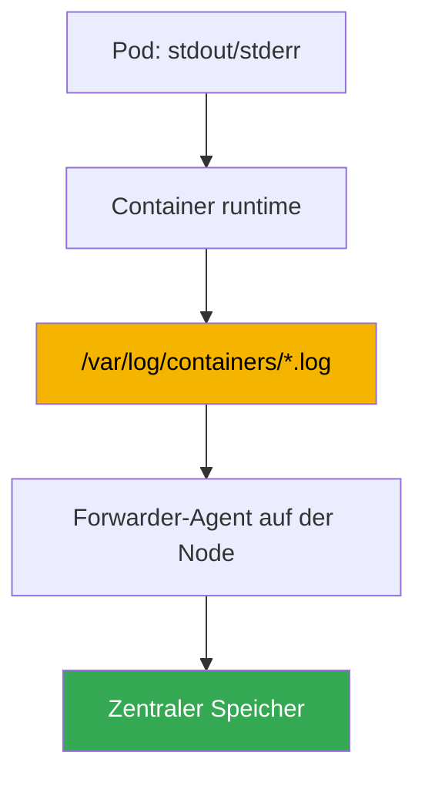
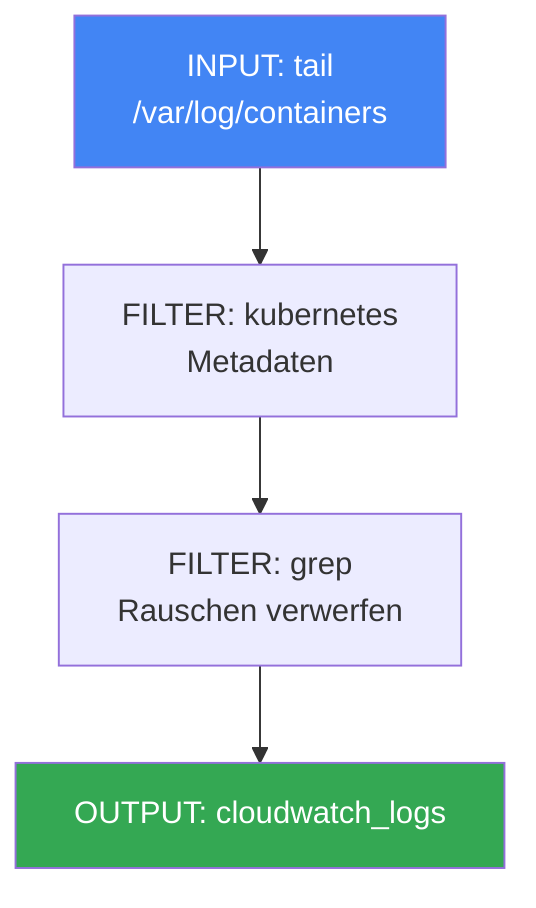

[Русская версия](ru.md) · [Eng version](en.md) · [Versión en español](es.md) · [Version française](fr.md) · [ქართული ვერსია](ge.md) · [繁體中文版](tw.md) · [日本語版](jp.md)
# Kapitel 34. Logs: Fluent Bit, CloudWatch Logs, OpenSearch, Kostenkontrolle

> **Wie es weitergeht.** Kapitel 33 behandelte Metriken, also numerische Zeitreihen zur Auslastung von Nodes und Pods. Hier folgt die zweite Säule der Observability: Logs, also Texteinträge darüber, was eine Anwendung getan hat und warum sie abgestürzt ist. Metriken beantworten „wie viel“, Logs „was genau passiert ist“. Verwandte Themen liegen in anderen Kapiteln: Metriken in Kapitel 33; automatische Skalierung anhand von Metriken (HPA, KEDA) in Kapitel 35; Distributed Tracing über ADOT und X-Ray in Kapitel 36; das Audit der Control Plane (audit log) als Sicherheitswerkzeug in Kapitel 21; Kostenrechnung und Kostenoptimierung insgesamt in Kapitel 43. Hier geht es um eines: wie Logs von ephemeren Nodes und Pods abtransportiert werden, wo sie abgelegt werden und wie die Kosten beherrschbar bleiben.

## 34.1. „Pod wurde neu erstellt, Logs sind verschwunden“

Nachts ist ein Pod abgestürzt. Der Bereitschaftsdienst untersucht den Vorfall und greift mit dem gewohnten Befehl nach den Logs:

```bash
kubectl logs my-app-7d9f8c6b5-x2k4p
# Error from server (NotFound): pods "my-app-7d9f8c6b5-x2k4p" not found
```

Der Pod existiert nicht mehr. Das Deployment hat die Replik unter einem neuen Namen neu erstellt, und der alte Pod mit den Absturzlogs wurde gelöscht. Versuchen wir, den vorherigen Lauf eines noch laufenden Pods abzurufen:

```bash
kubectl logs my-app-7d9f8c6b5-abcde --previous
# Error from server (BadRequest): previous terminated container not found
```

`kubectl logs` zeigt nur die Logs eines lebenden Pods und höchstens zwei Containerläufe: den aktuellen und den vorherigen. Sobald ein Pod gelöscht ist, sind seine Logs vollständig weg. In EKS sind Pods per Definition ephemer: Ein Deployment erstellt sie bei Updates neu, und Karpenter (Kapitel 12) konsolidiert wenig ausgelastete Nodes und verschiebt Workloads. Mit der Node verschwinden alle Logs, die auf ihrem Datenträger liegen. Das Entfernen einer Node während der consolidation ist normales Verhalten und kein Fehler, nimmt jedoch unbemerkt die Log-Historie mit.

Das Ergebnis: Es gibt nichts, womit sich der Vorfall analysieren lässt. In einem neuen EKS gibt es keinen zentralen Ort, an dem Logs den Tod eines Pods oder einer Node überleben. Wie die Metriken müssen Sie ihn selbst aufbauen. Als Nächstes sehen wir der Reihe nach, wo Logs auf einer Node liegen und warum sie vorher abtransportiert werden müssen; wie Fluent Bit dies übernimmt; wohin sie abgelegt werden; die Logs der Control Plane separat; und wie sich die Kosten begrenzen lassen, denn Logs wachsen am schnellsten.

## 34.2. Wo Logs auf der Node liegen und warum sie abtransportiert werden müssen

Eine Anwendung in Kubernetes schreibt Logs konventionsgemäß in stdout und stderr, nicht in Dateien innerhalb des Containers. Danach greift der Mechanismus der Node: Die container runtime fängt diese Streams ab und legt sie in Dateien auf dem Datenträger der Node ab. Die Ablage ist vorhersehbar:

- `/var/log/pods/<namespace>_<pod>_<uid>/<container>/` - Log-Dateien für jeden Container.
- `/var/log/containers/*.log` - symbolische Links auf Dateien aus `/var/log/pods`, mit Namen, in denen Pod, Namespace und Container kodiert sind. Hier holt der Collector die Logs ab.

Die Dateien wachsen nicht unbegrenzt: kubelet rotiert sie nach Größe, und alte Segmente werden mit der Zeit gelöscht, damit der Datenträger der Node nicht voll läuft. Hier liegt die Wurzel des Problems aus Abschnitt 34.1. Logs auf der Node sind ein temporärer Puffer, kein Speicher. Drei Gefahren können sie verschwinden lassen:

- **Pod gelöscht** - sein Verzeichnis in `/var/log/pods` wird bereinigt;
- **Rotation** - alte Einträge werden durch neue überschrieben, die Historie von gestern verschwindet;
- **Node konsolidiert** - Karpenter oder scale-down nimmt den gesamten Datenträger mit.

Die Schlussfolgerung ist einfach: Logs müssen kontinuierlich von der Node in einen zentralen Speicher abtransportiert werden, **bevor** der Pod oder die Node verschwindet. Nachträglich lassen sie sich nirgendwo mehr abholen. Genau diese Aufgabe erfüllt ein Agent, der auf jeder Node läuft und neue Zeilen in Echtzeit nach außen streamt.



## 34.3. Fluent Bit als DaemonSet

Der Forwarder-Agent in EKS ist fast immer **Fluent Bit**, ausgeführt als DaemonSet: ein Pod pro Node, um deren lokale Log-Dateien zu lesen. Er mountet `/var/log` von der Node, überwacht Dateien in `/var/log/containers`, liest neue Zeilen und sendet sie an die festgelegten Ziele.

Fluent Bit ist ein schlanker Log-Forwarder in C: Er benötigt wenig CPU und Speicher, was für einen Agent wichtig ist, der auf jeder Node läuft und Workloads keine Ressourcen wegnehmen soll. Sein älterer Verwandter **Fluentd** ist in Ruby geschrieben, bietet mehr Plugins, benötigt aber deutlich mehr Speicher und ist für die Rolle eines Node-Collectors meist überdimensioniert. In der Praxis wird für EKS standardmäßig Fluent Bit eingesetzt, während Fluentd für komplexe Aggregation auf einer dedizierten Ebene bleibt, falls es überhaupt benötigt wird.

AWS erstellt ein fertiges Image: **aws-for-fluent-bit**. Dabei handelt es sich um Fluent Bit mit bereits integrierten Output-Plugins für AWS-Services (CloudWatch Logs, Amazon Data Firehose und andere) sowie einer Version, die AWS testet und aktualisiert. Die Verwendung ist bequem: Sie müssen kein Image mit den benötigten Plugins selbst bauen.

Eine Schlüsselfunktion des Collectors ist die **Anreicherung mit Kubernetes-Metadaten**. Eine rohe Log-Zeile verrät für sich genommen nicht, wessen Log sie ist. Der Filter `kubernetes` in Fluent Bit fügt anhand des Dateinamens und einer Abfrage der Cluster-API jeder Aufzeichnung Namespace, Pod-Name, Container-Name, labels und annotations hinzu. Ohne diese Informationen lassen sich die Logs eines bestimmten Deployments im allgemeinen Stream nicht finden.

Fluent Bit wird auf zwei Wegen installiert:

- Mit dem **Addon amazon-cloudwatch-observability** (dasselbe, das Container Insights einschaltet, Kapitel 33). Es installiert den CloudWatch agent für Metriken und Fluent Bit für Logs, vollständig managed. Das ist der einfachste Weg, wenn Sie bereits CloudWatch verwenden.
- **Separat, mit einem eigenen Helm-Chart oder Manifest**, wenn Sie die Konfiguration von Fluent Bit kontrollieren möchten oder das Ziel nicht CloudWatch ist (OpenSearch, eigenes Backend).

Die Berechtigung zum Schreiben in das Ziel erhält der Agent über eine IAM-Rolle, die mittels IRSA oder Pod Identity (Kapitel 16-17) an seinen ServiceAccount gebunden ist. Ohne Berechtigungen für CloudWatch Logs oder OpenSearch wird der Versand stillschweigend nicht funktionieren, und Logs sammeln sich auf der Node an und gehen verloren.

## 34.4. Wohin Logs abgelegt werden: Ziele

Fluent Bit kann über OUTPUT-Plugins in verschiedene Ziele schreiben. Im AWS-Ökosystem besteht die Wahl gewöhnlich zwischen vier Optionen.

- **CloudWatch Logs** - AWS-nativer Log-Speicher. Logs werden in **log groups** organisiert, üblicherweise eine Gruppe pro Anwendung oder Namespace, und darin in **log streams**, üblicherweise ein Stream pro Pod oder Container. Abfragen laufen über **CloudWatch Logs Insights** mit eigener Abfragesprache, Alarme und die übrigen AWS-Services sind direkt integriert. Plugin: `cloudwatch_logs`.
- **Amazon OpenSearch Service** - managed OpenSearch, ein Fork von Elasticsearch: Volltextsuche, flexible Dashboards (OpenSearch Dashboards), komplexe Analysen. Leistungsfähiger für die Suche, aber ein separater Cluster, der dimensioniert und nach Nodes bezahlt werden muss, also aufwendiger und teurer. Plugin: `opensearch`.
- **Amazon S3** - günstiges Archiv. Logs werden als Objekte in einen Bucket geschrieben; die Suche ist nicht interaktiv, sondern erfolgt über Athena oder einmalige Exporte. Dafür ist die Speicherung am günstigsten und lifecycle-Übergänge in kalte Speicherklassen sind möglich. Gut für langfristige Aufbewahrung und compliance. Plugin: `s3`.
- **Amazon Data Firehose** - kein Speicher, sondern Puffer und Router: Er nimmt den Stream entgegen, puffert ihn und liefert ihn an Ziele aus (S3, OpenSearch, Drittanbieterempfänger); unterwegs kann er komprimieren. Er wird verwendet, wenn eine managed Pipeline zu mehreren Zielen benötigt wird. Plugin: `kinesis_firehose`.

| Ziel | Stärke | Schwäche | Wann einsetzen |
|---|---|---|---|
| CloudWatch Logs | AWS-nativ, Logs Insights, Alarme | Suche schwächer als OpenSearch | grundlegende Speicherung und Analyse in AWS |
| OpenSearch Service | Volltextsuche, Dashboards | separater Cluster, teurer | umfangreiche Analyse und Log-Suche |
| S3 | günstigste Speicherung, Archiv | keine interaktive Suche | Langzeitarchiv, compliance |
| Data Firehose | Puffer und Routing an verschiedene Ziele | speichert selbst nicht | eine Pipeline für mehrere Ziele |

Ziele werden kombiniert: Heiße Logs der letzten Tage liegen für die schnelle Analyse in CloudWatch oder OpenSearch, während eine vollständige Kopie parallel für eine langfristige, günstige Aufbewahrung nach S3 geschrieben wird.

### Eigener Log-Stack: Loki und VictoriaLogs

Außerhalb der AWS-Services gibt es zwei Lösungen, die oft zusammen mit Grafana im Cluster installiert werden, besonders wenn Metriken bereits dort betrachtet werden (Kapitel 33).

**Grafana Loki** folgt einer Idee: Es indexiert nicht den Text selbst, sondern nur die **Labels** des Streams, wie Prometheus. Logs werden komprimiert in Chunks abgelegt, also in S3 als Objektspeicher, und der Index bleibt klein. Daraus ergibt sich eine günstige Speicherung. Abfragen erfolgen in **LogQL**, dessen Syntax von Metriken bekannt ist. Daraus folgt auch die wichtigste Falle, symmetrisch zur Kardinalität aus Kapitel 33: Labels müssen eine niedrige Kardinalität haben (Namespace, Anwendung, Container), während `pod`, `request_id` oder `trace_id` in Labels den Index und die Performance sprengen. Für sie gibt es structured metadata. Logs können mit demselben Fluent Bit gesammelt werden; der native Loki-Agent ist jetzt Grafana Alloy, in den Promtail integriert wurde und dessen Support eingestellt ist.

**VictoriaLogs** stammt aus demselben Ökosystem wie VictoriaMetrics: eine unabhängige Log-Datenbank ohne Abhängigkeiten, die weder ein vorab definiertes Schema noch die Konfiguration von Indizes benötigt. Sie speichert Daten spaltenorientiert auf Datenträgern, verwendet **LogsQL** mit Volltextsuche für Abfragen und nimmt Daten über viele Protokolle entgegen, einschließlich Elasticsearch bulk, Loki push, OTLP und syslog. Daher müssen Agents bei einem Umzug üblicherweise nicht ersetzt werden. Es gibt eine Cluster-Version (`vlinsert`, `vlstorage`, `vlselect`) und einen Operator für Kubernetes.

| Lösung | Was wird indexiert | Abfragen | Wo liegen die Logs | Betrieb |
|---|---|---|---|---|
| CloudWatch Logs | alles, managed | Logs Insights | bei AWS | keiner |
| OpenSearch Service | Volltextindex | DSL, Dashboards | OpenSearch-Cluster | Dimensionierung und Upgrades des Clusters |
| Loki | nur Stream-Labels | LogQL | Objektspeicher (S3) | Loki-Komponenten und Label-Disziplin |
| VictoriaLogs | kein Schema erforderlich | LogsQL | Datenträger Ihrer Nodes | minimale Komponenten, Datenträger liegen bei Ihnen |

Die Auswahl lässt sich gewöhnlich auf drei Fragen reduzieren. Alles liegt in AWS und Sie möchten minimalen Betriebsaufwand: CloudWatch, mit Archiv in S3. Sie benötigen schwere Volltextsuche und fertige Dashboards: OpenSearch, unter Berücksichtigung der Kosten eines separaten Clusters. Dashboards sind bereits in Grafana und Sie möchten günstigen Speicher in S3: Loki, mit Blick auf die Label-Kardinalität. Sie möchten dasselbe, aber einfacher im Betrieb und ohne Objektspeicher: VictoriaLogs. Wie bei Metriken ist ein eigener Stack nicht kostenlos: Statt einer AWS-Rechnung zahlen Sie mit Datenträgern, Nodes und Bereitschaftsdienst (Kostenstruktur in Abschnitt 34.6 und Kapitel 43).

## 34.5. EKS-Control-Plane-Logs sind separat

Alles oben betrifft die Logs Ihrer Workloads, die auf Nodes leben. Die von AWS betriebene Steuerungsebene des Clusters hat eigene Logs, die separat aktiviert werden. **EKS control plane logging** liefert Diagnose- und Audit-Logs direkt aus der Control Plane in CloudWatch Logs Ihres Accounts. Nodes und Fluent Bit sind daran nicht beteiligt: Die Quelle ist die managed Control Plane selbst.

Es gibt fünf Log-Typen, jeweils entsprechend einer Komponente der Control Plane:

| Typ | Was wird protokolliert |
|---|---|
| `api` | Zugriffe auf den Kubernetes API server, dessen Start-Flags |
| `audit` | wer im Cluster was und woran getan hat, Grundlage des Audits (Kapitel 21) |
| `authenticator` | IAM-Authentifizierung für RBAC, spezifisch für EKS |
| `controllerManager` | Arbeit der Steuerungsregelkreise (controller manager) |
| `scheduler` | Entscheidungen des Schedulers zur Platzierung von Pods |

Sie werden pro Cluster einzeln über Konsole, CLI oder API aktiviert. Die Logs kommen als log streams in einer gemeinsamen Cluster-Gruppe in CloudWatch an. Der Typ `audit` ist genau die Quelle, um zu untersuchen, „wer das Deployment gelöscht hat“, und um verdächtige Aktivitäten zu erkennen. Kapitel 21 behandelt die Anwendung ausführlich. Wichtig ist hier nur: Dies sind Logs der Steuerungsebene, nicht von Pods, und auch für ihre ingestion und Speicherung in CloudWatch zahlen Sie. Aktivieren Sie sie bewusst.

```bash
# benötigte Log-Typen der Control Plane in einem bestehenden Cluster aktivieren
aws eks update-cluster-config --name my-cluster \
  --logging '{"clusterLogging":[{"types":["api","audit","authenticator"],"enabled":true}]}'
```

## 34.6. Kostenkontrolle für Logs

Logs sind der am schnellsten wachsende und am leichtesten außer Kontrolle geratende Teil der Observability. Ein einzelner gesprächiger Service auf DEBUG-Level kann mehr Daten erzeugen als sämtliche Cluster-Metriken zusammen. Die Kosten entstehen auf zwei Seiten, die unterschieden werden müssen:

- Für **CloudWatch Logs** wird für **ingestion** bezahlt, also das Volumen angenommener Daten, und für **storage**, also das gespeicherte Volumen. Ingestion ist üblicherweise der größte Posten: Jeder angenommene Gigabyte wird bezahlt, unabhängig davon, wie lange er danach gespeichert wird.
- Für **OpenSearch Service** wird anders bezahlt, nämlich für den **Cluster**: Daten-Nodes, ihren Typ und ihre Anzahl, Datenträger und Master-Nodes. Die Kosten hängen fast nicht vom Abfragevolumen ab und laufen weiter, solange der Cluster existiert.

| Ziel | Wofür bezahlt wird | Wichtigster Sparhebel |
|---|---|---|
| CloudWatch Logs | ingestion + storage | Volumen an der Quelle reduzieren, retention |
| OpenSearch Service | Cluster-Nodes, Datenträger | Cluster-Dimensionierung, kurze Aufbewahrungszeit |
| S3 | Speicherung nach Volumen | lifecycle in kalte Klassen |

Daraus ergeben sich praktische Maßnahmen, von der wirksamsten zu den ergänzenden:

- **Rauschen vor dem Senden reduzieren.** Am wenigsten kostet ein Log, das nicht gesendet wird. Der Filter `grep` in Fluent Bit verwirft offensichtlich Unnötiges, etwa health checks und debug-Zeilen, bereits auf der Node vor der ingestion. Das trifft den teuersten Posten, das angenommene Volumen.
- **Log-Level der Anwendungen konfigurieren.** Das Standard-Level von Fluent Bit und vielen Anwendungen ist INFO und erzeugt großzügig Volumen. In Produktion reichen häufig WARN oder ERROR. Eine Senkung des Levels in der Anwendung reduziert den Stream um ein Vielfaches kostenlos.
- **retention für log groups festlegen.** Standardmäßig bleiben Logs in CloudWatch für immer erhalten (Never Expire), sodass sich storage unbegrenzt ansammelt. Setzen Sie eine Aufbewahrungsdauer (retention policy) gemäß den Anforderungen: operative Logs für Wochen, Audit-Logs länger gemäß compliance.
- **Hochfrequentes Sampling.** Für sehr gesprächige Streams wird ein Anteil der Einträge statt aller gespeichert: Für Trends reicht eine Stichprobe, während das Volumen deutlich sinkt.
- **Heiße und kalte Logs trennen.** Heiße Logs, bei denen schnelle Suche erforderlich ist, liegen kurzzeitig in CloudWatch oder OpenSearch; eine vollständige Kopie liegt langfristig in S3 als günstigem Archiv. Bewahren Sie nicht alles in teurem heißem Speicher auf.

```bash
# Aufbewahrung der Log-Gruppe statt „für immer“ auf 14 Tage begrenzen
aws logs put-retention-policy \
  --log-group-name /aws/containerinsights/my-cluster/application \
  --retention-in-days 14
```

Der wichtigste Gedanke: Das Volumen lässt sich am günstigsten an der Quelle steuern, auf Anwendungsniveau und in Fluent Bit, nicht durch nachträgliche Speicherung. Ein herausgefilterter Gigabyte kostet nichts; retention begrenzt nur die bereits bezahlte ingestion.

## 34.7. Aufbau einer Fluent-Bit-Konfiguration

Die Fluent-Bit-Konfiguration ist eine Pipeline aus drei Arten von Sektionen. Sie zu verstehen ist auch bei einer Installation per Addon nützlich, um das Verhalten des Collectors lesen und ändern zu können. Der Datenfluss verläuft von links nach rechts: INPUT liest, FILTER verarbeitet, OUTPUT sendet.



- **INPUT** - die Quelle. Das Plugin `tail` überwacht Dateien in `/var/log/containers/*.log` und liest neue Zeilen, wobei es die Position speichert, um sie nicht erneut zu senden.
- **FILTER** - Verarbeitung des Streams. `kubernetes` reichert Aufzeichnungen mit Metadaten an (Namespace, Pod, labels); `grep` lässt Aufzeichnungen anhand eines regulären Ausdrucks durch oder verwirft sie. Damit wird Rauschen vor dem Senden reduziert (Abschnitt 34.6).
- **OUTPUT** - das Ziel. `cloudwatch_logs` schreibt nach CloudWatch Logs, `opensearch` nach OpenSearch, `s3` und `kinesis_firehose` ins Archiv und in die Pipeline. Jedes hat eigene Felder: Region, Name der log group, automatisches Erstellen von Gruppen und so weiter.

Strukturell sieht ein Stream so aus (die Werte dienen nur als Beispiel):

```text
[INPUT]
    Name              tail
    Path              /var/log/containers/*.log
    multiline.parser  cri, go
    Mem_Buf_Limit     50MB
    storage.type      filesystem
[FILTER]
    Name              kubernetes
    Match             kube.*
    Merge_Log         On
[FILTER]
    Name              grep
    Match             kube.*
    Exclude           log /healthz
[OUTPUT]
    Name              cloudwatch_logs
    Match             kube.*
    region            eu-central-1
    log_group_name    /aws/eks/my-cluster/application
```

Das Feld `Match` verbindet die Sektionen über ein Tag: FILTER und OUTPUT werden auf Aufzeichnungen angewendet, deren Tag mit dem Muster übereinstimmt. So verteilt eine Pipeline verschiedene Logs an verschiedene Ziele.

Zwei weitere INPUT-Optionen bewahren den Collector selbst bei backpressure, wenn das Ziel nicht erreichbar ist oder throttling anwendet, etwa wenn die CloudWatch API langsam antwortet oder ein Anfrage-Limit zurückgibt. Ohne sie sammelt Fluent Bit nicht angenommene Aufzeichnungen im Speicher, wächst an und wird OOMKilled. Damit gehen sämtliche Logs der Node verloren, genau wovor er schützen soll. Die Option `Mem_Buf_Limit` im INPUT `tail` begrenzt den Speicher für den Puffer: Beim Erreichen des Limits liest das Plugin keine neuen Dateien, bis die Warteschlange abgebaut ist, statt bis zu OOM zu wachsen. Die Option `storage.type filesystem` verlagert den überlaufenden Puffer auf den Datenträger der Node, wofür `storage.path` in der Sektion `SERVICE` benötigt wird, statt alles im RAM zu halten. Ein kurzfristiger Stau wird ohne Verluste und ohne OOM überstanden. Zusammen verwandeln sie einen Versandfehler in eine Verlangsamung statt in einen Agent-Absturz und Log-Verlust.

Zwei Optionen der Pipeline beeinflussen direkt, wie gut Logs analysiert werden können. `multiline.parser` im INPUT `tail` fügt mehrzeilige Aufzeichnungen zu einer zusammen: Ein Java- oder Python-Stacktrace würde sonst als Dutzend separater Zeilen eintreffen und könnte im Speicher nicht wieder zusammengesetzt werden. Die integrierten Parser (`cri`, `docker`, `go`, `java`, `python`) decken typische Fälle ab; `cri` fügt Zeilen zusammen, die von der container runtime selbst geteilt wurden, die Anwendungsparser folgen danach. Die Option `Merge_Log On` im Filter `kubernetes` zerlegt eine JSON-Zeile aus dem Feld `log` in separate Felder der Aufzeichnung: Eine Anwendung, die Logs als JSON schreibt, wird strukturiert. Dadurch kann nach ihren Feldern statt nur im gesamten Text gefiltert und gesucht werden.

## 34.8. Anwendung in Produktion

- **Den Log-Collector zusammen mit Metriken installieren.** Fluent Bit wird als DaemonSet sofort in den Cluster aufgenommen, damit Logs ab dem ersten Tag abtransportiert werden. Meist geschieht das mit dem Addon amazon-cloudwatch-observability zusammen mit Container Insights.
- **Volumen an der Quelle reduzieren.** Die Log-Level der Anwendungen und `grep`-Filter in Fluent Bit sind der erste Kostenhebel. Filterung im Speicher nachträglich ist bereits bezahlt.
- **retention für jede log group bewusst setzen.** „Für immer speichern“ als Standardwert ist eine typische Ursache wachsender Rechnungen. Operative Logs erhalten Wochen, Audit-Logs die für compliance erforderliche Dauer.
- **Heiß und kalt trennen.** Schnelle Suche erfolgt kurzfristig in CloudWatch oder OpenSearch, die vollständige Kopie liegt als günstiges Archiv in S3. Alles in heißem Speicher zu behalten ist selten sinnvoll.
- **OpenSearch einsetzen, wenn die Suche es rechtfertigt.** Es ist ein separater Cluster, der betrieben und bezahlt werden muss. Für grundlegende Analysen reicht CloudWatch Logs Insights.
- **Logs der Control Plane selektiv aktivieren.** `audit` und `authenticator` dienen Sicherheit und Zugriffsanalyse (Kapitel 21), nicht „vorsorglich alle fünf“: Jeder Typ erhöht die ingestion.

## 34.9. Mini-Glossar

- **stdout/stderr** - Standard-Ausgabestreams eines Containers. Konventionsgemäß schreibt eine Kubernetes-Anwendung Logs dorthin und nicht in Dateien innerhalb des Containers.
- **/var/log/containers** - Verzeichnis auf der Node mit Links auf Log-Dateien von Containern; hier holt der Collector die Logs ab.
- **Fluent Bit** - schlanker Log-Forwarder in C, der als DaemonSet auf jeder Node läuft; liest Log-Dateien, reichert sie an und sendet sie an Ziele.
- **aws-for-fluent-bit** - von AWS erstelltes Fluent-Bit-Image mit integrierten Output-Plugins für AWS-Services.
- **Filter kubernetes** - Fluent-Bit-FILTER, der Aufzeichnungen Namespace, Pod, Container, labels und annotations hinzufügt.
- **CloudWatch Logs** - AWS-Log-Speicher; log groups und log streams, Abfragen über Logs Insights, Abrechnung nach ingestion und storage.
- **log group / log stream** - Gruppe, üblicherweise pro Anwendung, und Stream innerhalb davon, üblicherweise pro Pod, in CloudWatch Logs.
- **OpenSearch Service** - managed OpenSearch für Volltextsuche und Dashboards; Abrechnung für den Cluster (Nodes).
- **Data Firehose** - managed Puffer und Router für Streams zu S3, OpenSearch und anderen Zielen.
- **control plane logging** - Übermittlung der Logs der EKS-Steuerungsebene (`api`, `audit`, `authenticator`, `controllerManager`, `scheduler`) an CloudWatch Logs.
- **retention policy** - Aufbewahrungsdauer von Logs in einer log group, nach deren Ablauf Aufzeichnungen gelöscht werden; standardmäßig verfallen Logs nicht.
- **INPUT / FILTER / OUTPUT** - die drei Arten von Sektionen in einer Fluent-Bit-Pipeline: Lesen, Verarbeitung, Versand.
- **Grafana Loki** - Log-Speicher, der nur Stream-Labels indexiert; Logs liegen komprimiert in Chunks im Objektspeicher, Abfragen erfolgen über LogQL. Labels müssen eine niedrige Kardinalität haben; für hohe Kardinalität gibt es structured metadata. Der native Agent ist Grafana Alloy, in den Promtail integriert wurde.
- **VictoriaLogs** - unabhängige Log-Datenbank ohne Schema und Indexkonfiguration; spaltenorientierte Speicherung auf Datenträgern, Abfragen über LogsQL, Annahme über die Protokolle Elasticsearch bulk, Loki push, OTLP und syslog; eine Cluster-Variante ist verfügbar (`vlinsert`, `vlstorage`, `vlselect`).

## 34.10. Zusammenfassung des Kapitels

- `kubectl logs` funktioniert nur für einen lebenden Pod und höchstens für den aktuellen und vorherigen Lauf. Nach Löschen des Pods oder Konsolidieren der Node verschwinden die Logs mit ihnen.
- Container-Logs liegen auf der Node in `/var/log/pods` und `/var/log/containers`, werden von kubelet rotiert und gelöscht. Dies ist ein temporärer Puffer, kein Speicher, deshalb müssen Logs kontinuierlich abtransportiert werden.
- Fluent Bit transportiert Logs ab: ein schlanker Forwarder als DaemonSet auf jeder Node; das Image aws-for-fluent-bit enthält AWS-Plugins, der Filter `kubernetes` reichert Kubernetes-Metadaten an, Berechtigungen kommen über IRSA oder Pod Identity.
- Fluent Bit wird mit dem Addon amazon-cloudwatch-observability zusammen mit Container Insights oder separat mit einem Helm-Chart installiert, wenn Kontrolle oder ein anderes Ziel benötigt wird.
- Ziele: CloudWatch Logs (AWS-nativ, Logs Insights), OpenSearch Service (Suche und Dashboards, teurer), S3 (günstiges Archiv), Data Firehose (Puffer und Routing).
- Logs der Control Plane (`api`, `audit`, `authenticator`, `controllerManager`, `scheduler`) werden separat aktiviert und gehen nach CloudWatch. Es sind Logs der Steuerungsebene, nicht von Pods; `audit` ist die Grundlage für Audits (Kapitel 21).
- Kostenkontrolle: Rauschen mit `grep` vor dem Senden reduzieren, Log-Level senken, retention für log groups setzen, Sampling einsetzen, heiße und kalte Logs trennen. Das Volumen wird am günstigsten an der Quelle gesteuert.
- Die Fluent-Bit-Konfiguration ist eine Pipeline aus INPUT (tail), FILTER (kubernetes, grep) und OUTPUT (cloudwatch_logs, opensearch und weitere); die Sektionen werden durch `Match` über ein Tag verbunden.

## 34.11. Nutzen in der täglichen Arbeit

Im Bereitschaftsdienst sind Logs nach Metriken die zweite Wahrheitsquelle bei einem Vorfall: Eine Metrik zeigt, dass ein Pod OOMKilled erhalten hat, während das Log zeigt, bei welchem Vorgang dies geschah. Der Unterschied ist, dass das Log eines abgestürzten Pods nur gefunden wird, wenn es vorher abtransportiert wurde. Deshalb müssen Fluent Bit und mindestens ein Ziel vor dem ersten ernsthaften Vorfall vorhanden sein: Es gibt keine Möglichkeit, Logs aus einem gelöschten Pod zu holen. Das Wissen, wohin die Cluster-Logs geschrieben werden, nach CloudWatch, OpenSearch oder S3, zeigt sofort, wo sie um drei Uhr nachts zu suchen sind; die Filterung nach Namespace und Pod spart Minuten.

Bei der Planung sind Logs vor allem eine Frage von Geld und Volumen. Alles auf DEBUG-Level zu sammeln und für immer zu speichern, ist ein schneller Weg zu einer Rechnung, auf der Logs teurer sind als der Cluster selbst. Deshalb wird im Voraus entschieden, was gesammelt wird, auf welchem Level, wohin und wie lange: Heiße Daten kommen für Wochen in teuren Speicher, das Archiv nach S3, Rauschen wird bereits auf der Node verworfen. Diese Entscheidung wird bei der Einführung des Loggings einmal getroffen und zusammen mit der Kostenanalyse überprüft (Kapitel 43).

## 34.12. Fragen zur Selbstkontrolle

1. Warum zeigt `kubectl logs` die Logs eines abgestürzten und neu erstellten Pods nicht an?
2. Wie hängt das Konsolidieren einer Node durch Karpenter mit Log-Verlust zusammen und warum ist dies normales Verhalten?
3. Wo legt die container runtime stdout/stderr von Containern auf der Node ab und was rotiert sie?
4. Warum müssen Logs kontinuierlich von der Node abtransportiert werden, statt sie erst bei der Vorfallsanalyse abzuholen?
5. Warum wird Fluent Bit als DaemonSet ausgeführt und was mountet es von der Node?
6. Worin unterscheidet sich Fluent Bit von Fluentd und warum wird in EKS standardmäßig ersteres verwendet?
7. Was bietet das Image aws-for-fluent-bit und was macht der Filter `kubernetes`?
8. Auf welchen zwei Wegen wird Fluent Bit installiert und wie erhält es die Berechtigung, in ein Ziel zu schreiben?
9. Wie unterscheiden sich CloudWatch Logs, OpenSearch Service, S3 und Data Firehose als Ziele?
10. Wie unterscheiden sich Logs der Control Plane von Pod-Logs und welche fünf Typen sind verfügbar?
11. Woraus setzen sich die Kosten für CloudWatch Logs zusammen und wie unterscheidet sich das Modell von OpenSearch?
12. Welche Maßnahmen senken Log-Kosten und warum ist die Reduzierung des Volumens an der Quelle am günstigsten?
13. Aus welchen Sektionen besteht eine Fluent-Bit-Pipeline und wie verbindet das Feld `Match` sie?
14. Was indexiert Loki und warum sind `pod` oder `request_id` in Labels eine schlechte Idee?
15. Worin unterscheidet sich VictoriaLogs von Loki hinsichtlich Speicherung und Konfigurationsanforderungen?
16. Logs werden in Grafana betrachtet und müssen günstig und langfristig gespeichert werden. Welche zwei Optionen gibt es und womit bezahlen Sie?

## Praxis

Das Kurs-Lab zu diesem Thema: [Lab 115 - Logging: Fluent Bit in CloudWatch Logs, Filterung und retention](../../labs/115/README_DE.MD). Darüber hinaus lässt sich der Zustand des Loggings leicht auf einem laufenden Cluster erfassen. Reproduzieren Sie zunächst das Ausgangsproblem und sehen Sie nach, was `kubectl logs` überhaupt liefert:

```bash
# Logs eines lebenden Pods und des vorherigen Containerlaufs
kubectl logs deploy/my-app
kubectl logs deploy/my-app --previous
```

Prüfen Sie, ob ein Log-Collector im Cluster vorhanden ist, Fluent Bit als DaemonSet:

```bash
# Fluent-Bit-DaemonSet und CloudWatch agent (Addon amazon-cloudwatch-observability)
kubectl get ds -n amazon-cloudwatch
kubectl get pods -n amazon-cloudwatch -o wide
```

Sehen Sie nach, welche log groups bereits erstellt wurden und welche Aufbewahrungsfristen sie haben. Dies ist ein direkter Indikator für Volumen und Kosten:

```bash
# Log-Gruppen und ihre retention (Spalte retentionInDays; leer = für immer speichern)
aws logs describe-log-groups \
  --query "logGroups[].[logGroupName,retentionInDays]" --output table
```

Prüfen Sie abschließend, ob Logs der Control Plane aktiviert sind und welche Typen genau:

```bash
# Konfiguration des Control-Plane-Loggings des Clusters
aws eks describe-cluster --name my-cluster \
  --query "cluster.logging.clusterLogging" --output json
```

Vergleichen Sie das Bild: Werden Pod-Logs abtransportiert, ist Fluent Bit vorhanden, wohin gehen sie, ist retention für die Gruppen gesetzt, und sind nicht unnötige Log-Typen der Control Plane aktiviert? Lücken bedeuten verlorene Logs, und „ewige“ Speicherung ohne retention bedeutet eine wachsende Rechnung. Beides wird vor einem Vorfall und vor der nächsten Kostenanalyse behoben.

---
[Inhaltsverzeichnis](../README_DE.md) · [Kapitel 33](../33/de.md) · [Kapitel 35](../35/de.md)
