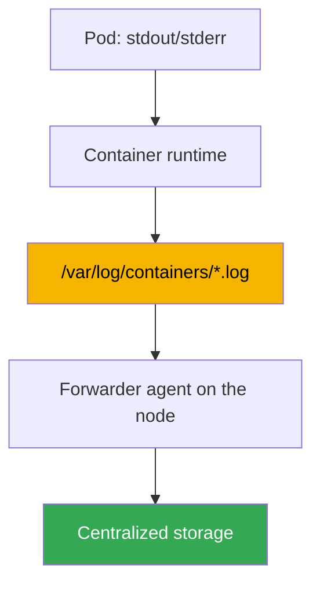
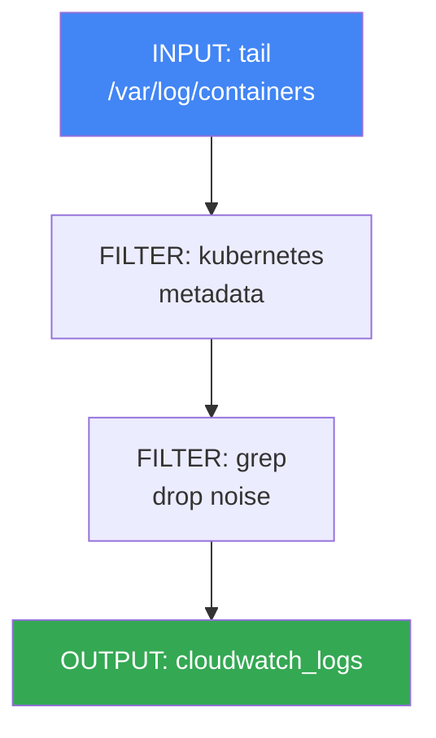

[Русская версия](ru.md) · [Versión en español](es.md) · [Version française](fr.md) · [Deutsche Version](de.md) · [ქართული ვერსია](ge.md) · [繁體中文版](tw.md) · [日本語版](jp.md)
# Chapter 34. Logs: Fluent Bit, CloudWatch Logs, OpenSearch, cost control

> **What comes next.** Chapter 33 covered metrics: numerical series about node and pod utilization. Here is the second pillar of observability: logs, textual records of what an application did and why it failed. Metrics answer "how much," logs answer "what exactly happened." Related topics belong to other chapters: metrics, Chapter 33; metrics-based autoscaling (HPA, KEDA), Chapter 35; distributed tracing through ADOT and X-Ray, Chapter 36; control plane auditing (audit log) as a security tool, Chapter 21; and overall cost accounting and optimization, Chapter 43. This chapter has one focus: how to export logs from ephemeral nodes and pods, where to store them, and how not to go bankrupt doing it.

## 34.1. "The pod was recreated, and the logs disappeared"

A pod failed overnight. The on-call engineer checks what happened and reaches for the usual command:

```bash
kubectl logs my-app-7d9f8c6b5-x2k4p
# Error from server (NotFound): pods "my-app-7d9f8c6b5-x2k4p" not found
```

The pod is already gone. The Deployment recreated the replica under a new name, and the old pod with its failure logs was deleted. We try to access the previous run of a running pod:

```bash
kubectl logs my-app-7d9f8c6b5-abcde --previous
# Error from server (BadRequest): previous terminated container not found
```

`kubectl logs` shows logs only for a live pod and at most two container runs: the current and previous ones. Once the pod is deleted, there are no logs at all. In EKS, pods are ephemeral by definition: a Deployment recreates them during updates, while Karpenter (Chapter 12) consolidates underutilized nodes and moves workloads. Together with a node, all logs on its disk disappear. Removing a node during consolidation is normal behavior, not a failure, and it silently takes the log history with it.

The result is that there is nothing to investigate an incident with. A fresh EKS cluster has no centralized place where logs survive pod and node death: like metrics, you build it yourself. Next, in order: where logs live on a node and why they must be exported early; how Fluent Bit does it; where to store them; control plane logs separately; and how to keep costs under control, because logs grow fastest.

## 34.2. Where logs live on a node and why they must be exported

By Kubernetes convention, an application writes logs to stdout and stderr, rather than files inside its container. The node mechanics then take over: the container runtime captures these streams and puts them into files on the node disk. Their layout is predictable:

- `/var/log/pods/<namespace>_<pod>_<uid>/<container>/`: log files for each container.
- `/var/log/containers/*.log`: symbolic links to files in `/var/log/pods`, whose names encode the pod, namespace, and container. This is where a collector retrieves logs.

Files do not grow forever: kubelet rotates them by size, and eventually removes old segments so they do not fill the node disk. This is where the problem from Section 34.1 originates. Node logs are a temporary buffer, not storage. Three threats can make them disappear:

- **the pod is deleted**: its directory in `/var/log/pods` is cleaned up;
- **rotation**: old records are overwritten by new ones, so yesterday's history disappears;
- **the node is consolidated**: Karpenter or scale-down takes the entire disk with it.

The conclusion is simple: logs must be continuously exported from the node to centralized storage **before** the pod or node disappears. There is nowhere to retrieve them after the fact. This is exactly what an agent running on every node does: it streams fresh lines out in real time.



## 34.3. Fluent Bit as a DaemonSet

The forwarding agent in EKS is almost always **Fluent Bit**, run as a DaemonSet: one pod on every node to read its local log files. It mounts `/var/log` from the node, watches files in `/var/log/containers`, reads new lines, and sends them to configured destinations.

Fluent Bit is a lightweight C log forwarder with low CPU and memory usage, which matters for an agent that runs on every node and must not take resources from workloads. Its older relative, **Fluentd**, is written in Ruby and has more plugins, but uses noticeably more memory and is usually excessive as a node collector. In practice, Fluent Bit is the EKS default, while Fluentd remains for complex aggregation on a dedicated layer, if it is needed at all.

AWS builds a ready-made image, **aws-for-fluent-bit**. It is Fluent Bit with output plugins for AWS services already included (CloudWatch Logs, Amazon Data Firehose, and others), with a version AWS tests and updates. Using it is convenient because you do not need to build an image with the required plugins yourself.

The collector's key capability is **Kubernetes metadata enrichment**. A raw log line alone does not identify whose log it is. By file name and API requests to the cluster, Fluent Bit's `kubernetes` filter adds the namespace, pod name, container name, labels, and annotations to every record. Without this, searching the common stream for logs from a particular Deployment is impossible.

Fluent Bit is installed in two ways:

- Via the **amazon-cloudwatch-observability add-on** (the same one that enables Container Insights, Chapter 33). It deploys the CloudWatch agent for metrics and Fluent Bit for logs, all managed. This is the easiest route if you already use CloudWatch.
- **Separately, with your own Helm chart or manifest**: when you need control over the Fluent Bit configuration or a destination other than CloudWatch (OpenSearch, your own backend).

The agent receives permission to write to its destination through an IAM role bound to its ServiceAccount using IRSA or Pod Identity (Chapters 16-17). Without permissions in CloudWatch Logs or OpenSearch, sending silently fails, and logs accumulate and are lost on the node.

## 34.4. Where to store logs: destinations

Fluent Bit can write to different destinations through OUTPUT plugins. In the AWS ecosystem, the choice is usually between four.

- **CloudWatch Logs**: AWS-native log storage. Logs are organized into **log groups** (usually one group per application or namespace), then into **log streams** (usually one stream per pod or container). Queries use **CloudWatch Logs Insights** (its own query language), with out-of-the-box integration with alarms and other AWS services. The plugin is `cloudwatch_logs`.
- **Amazon OpenSearch Service**: managed OpenSearch (an Elasticsearch fork), with full-text search, flexible dashboards (OpenSearch Dashboards), and complex analytics. It is more powerful for search, but is a separate cluster that must be sized and paid for by nodes, making it heavier and more expensive. The plugin is `opensearch`.
- **Amazon S3**: an inexpensive archive. Logs are written as objects to a bucket; search is not interactive (through Athena or occasional exports), but storage is the cheapest and lifecycle transitions to cold classes are available. It is good for long-term retention and compliance. The plugin is `s3`.
- **Amazon Data Firehose**: not storage but a buffer and router. It receives a stream, buffers it, and delivers it to destinations (S3, OpenSearch, third-party receivers); it can compress and transform data along the way. Use it when a single managed pipeline to several places is needed. The plugin is `kinesis_firehose`.

| Destination | Strength | Weakness | When to use it |
|---|---|---|---|
| CloudWatch Logs | AWS-native, Logs Insights, alarms | search is weaker than OpenSearch | basic storage and investigation in AWS |
| OpenSearch Service | full-text search, dashboards | separate cluster, more expensive | intensive analysis and log search |
| S3 | cheapest storage, archive | no interactive search | long-term archive, compliance |
| Data Firehose | buffering and routing to different locations | does not store data itself | one pipeline to several locations |

Destinations can be combined: hot logs from the last few days go to CloudWatch or OpenSearch for fast investigation, while a full copy is simultaneously written to S3 for inexpensive long-term retention.

### Your own log stack: Loki and VictoriaLogs

Outside AWS services, two solutions are often deployed in the cluster alongside Grafana, especially when metrics are already viewed there too (Chapter 33).

**Grafana Loki** is built around one idea: index not the text itself, but only the stream's **labels**, like Prometheus. Logs are compressed into chunks and stored in object storage, such as S3, while the index stays small, resulting in inexpensive storage. Queries use **LogQL**, whose syntax is familiar from metrics. This also creates the main pitfall, symmetric to the cardinality issue in Chapter 33: labels must be low-cardinality (namespace, application, container), while `pod`, `request_id`, or `trace_id` in labels explode the index and harm performance; structured metadata is provided for them. The same Fluent Bit can collect logs, while Loki's native agent is now Grafana Alloy: Promtail was merged into it and is no longer supported.

**VictoriaLogs** is from the same ecosystem as VictoriaMetrics: a single-dependency-free log database that requires neither a predefined schema nor index configuration. It stores data column-wise on disk, queries use **LogsQL** with full-text search, and it accepts many protocols, including Elasticsearch bulk, Loki push, OTLP, and syslog, so changing agents during a migration is usually unnecessary. There is a clustered version (`vlinsert`, `vlstorage`, `vlselect`) and an operator for Kubernetes.

| Solution | What it indexes | Queries | Where logs live | Operations |
|---|---|---|---|---|
| CloudWatch Logs | everything, managed | Logs Insights | at AWS | none |
| OpenSearch Service | full-text index | DSL, Dashboards | OpenSearch cluster | cluster sizing and upgrades |
| Loki | only stream labels | LogQL | object storage (S3) | Loki components and label discipline |
| VictoriaLogs | no schema required | LogsQL | disks of your nodes | minimal components, disks are your responsibility |

The choice usually comes down to three questions. If everything is in AWS and minimum operations are needed, use CloudWatch with an S3 archive. If you need intensive full-text search and ready-made dashboards, use OpenSearch, understanding the cost of a separate cluster. If dashboards are already in Grafana and you want inexpensive S3 storage, use Loki, keeping label cardinality in mind. If you want the same but simpler operations and no object storage, use VictoriaLogs. As with metrics, your own stack is not free: you pay with disks, nodes, and on-call duty rather than an AWS bill (cost structure in Section 34.6 and Chapter 43).

## 34.5. EKS control plane logs are separate

Everything above concerns workload logs living on nodes. The cluster's AWS-operated management layer has its own logs, enabled separately. **EKS control plane logging** delivers diagnostic and audit logs directly from the control plane to CloudWatch Logs in your account. Nodes and Fluent Bit are not involved: the source is the managed control plane itself.

Five log types are available, each corresponding to a control plane component:

| Type | What it logs |
|---|---|
| `api` | requests to the Kubernetes API server and its startup flags |
| `audit` | who did what to which resource in the cluster: the basis of auditing (Chapter 21) |
| `authenticator` | IAM authentication for RBAC, specific to EKS |
| `controllerManager` | operation of control loops (controller manager) |
| `scheduler` | scheduler decisions about pod placement |

Enable them individually for each cluster through the console, CLI, or API. Logs arrive in CloudWatch as log streams in the cluster's common group. The `audit` type is the source for investigating "who deleted the Deployment" and detecting suspicious activity; Chapter 21 covers its use in detail. Remember one thing here: these are management-layer logs, not pod logs, and you also pay for their CloudWatch ingestion and storage, so enable them deliberately.

```bash
# enable the required control plane log types on an existing cluster
aws eks update-cluster-config --name my-cluster \
  --logging '{"clusterLogging":[{"types":["api","audit","authenticator"],"enabled":true}]}'
```

## 34.6. Controlling log costs

Logs are the fastest-growing and easiest-to-lose-control-of observability expense. One chatty service at DEBUG level can generate more data than all cluster metrics combined. Costs arise from two sides, which must be distinguished:

- **CloudWatch Logs** charges for **ingestion** (the volume of accepted data) and **storage** (the volume retained). Ingestion is usually the main cost: you pay for every accepted gigabyte, regardless of how long it is retained afterward.
- **OpenSearch Service** charges differently: for the **cluster**, its data nodes, their type and count, disks, and master nodes. The cost is almost independent of query volume and continues while the cluster exists.

| Destination | What you pay for | Main cost-saving lever |
|---|---|---|
| CloudWatch Logs | ingestion + storage | reduce volume at the source, retention |
| OpenSearch Service | cluster nodes, disks | cluster sizing, short retention |
| S3 | storage by volume | lifecycle to cold classes |

From this follow practical techniques, ordered from the most effective to supporting ones:

- **Remove noise before sending.** The least expensive log is the one that is never sent. Fluent Bit's `grep` filter drops known-unneeded data (health checks, debug lines) on the node before ingestion. This reduces the most expensive item: accepted volume.
- **Configure application log levels.** The default level for Fluent Bit and many applications is INFO, and it generously generates volume; WARN or ERROR is often sufficient in production. Reducing the level in the application cuts the stream many times over for free.
- **Set retention on log groups.** By default, CloudWatch logs are retained forever (Never Expire), and storage grows without end. Set a retention policy appropriate to requirements: operational logs for weeks, audit logs longer for compliance.
- **Sample high-frequency data.** For very chatty streams, retain a fraction of records rather than all of them: a sample is enough for trends, while volume falls proportionally.
- **Separate hot and cold logs.** Put hot logs that need fast search in CloudWatch or OpenSearch for a short period; put a full copy in S3 as an inexpensive long-term archive. Do not retain everything in expensive hot storage.

```bash
# limit a log group's retention to 14 days instead of "forever"
aws logs put-retention-policy \
  --log-group-name /aws/containerinsights/my-cluster/application \
  --retention-in-days 14
```

The main point: it is cheapest to control volume at the source, in the application and Fluent Bit, rather than storage afterward. A filtered gigabyte costs nothing; retention only limits ingestion that has already been paid for.

## 34.7. How a Fluent Bit configuration works

A Fluent Bit configuration is a pipeline of three section types. Understanding it is useful even when installing with the add-on, so you can read and modify collector behavior. The flow goes left to right: INPUT reads, FILTER processes, OUTPUT sends.



- **INPUT**: the source. The `tail` plugin watches `/var/log/containers/*.log` files and reads new lines, remembering its position so it does not send duplicates.
- **FILTER**: stream processing. `kubernetes` enriches records with metadata (namespace, pod, labels); `grep` passes or drops records by regular expression, and is used to remove noise before sending (Section 34.6).
- **OUTPUT**: the destination. `cloudwatch_logs` writes to CloudWatch Logs, `opensearch` to OpenSearch, and `s3` and `kinesis_firehose` to the archive and pipeline. Each has its own set of fields: region, log group name, automatic group creation, and so on.

Structurally, one pipeline looks like this (values are examples):

```text
[INPUT]
    Name              tail
    Path              /var/log/containers/*.log
    multiline.parser  cri, go
    Mem_Buf_Limit     50MB
    storage.type      filesystem
[FILTER]
    Name              kubernetes
    Match             kube.*
    Merge_Log         On
[FILTER]
    Name              grep
    Match             kube.*
    Exclude           log /healthz
[OUTPUT]
    Name              cloudwatch_logs
    Match             kube.*
    region            eu-central-1
    log_group_name    /aws/eks/my-cluster/application
```

The `Match` field binds sections by tag: FILTER and OUTPUT apply to records whose tag matches the pattern. This lets one pipeline route different logs to different destinations.

Two more INPUT options protect the collector itself under backpressure, when a destination is unavailable or throttles requests (for example, the CloudWatch API responds slowly or returns a request limit). Without them, Fluent Bit accumulates unaccepted records in memory, grows, and is OOMKilled, taking every log from the node with it: exactly what it should prevent. `Mem_Buf_Limit` in the `tail` INPUT limits buffer memory. Once the limit is reached, the plugin stops reading new files until the queue drains, instead of growing until OOM. `storage.type filesystem` moves buffer overflow to the node disk (requiring `storage.path` in the `SERVICE` section) instead of holding everything in RAM: a peak blockage is handled without loss or OOM. Together, they turn a sending failure into a slowdown, rather than an agent crash and lost logs.

Two pipeline options directly affect how useful logs are for investigation. `multiline.parser` in the `tail` INPUT joins multiline records into one: otherwise, a Java or Python stack trace arrives as a dozen separate lines that cannot be reassembled in storage. Built-in parsers (`cri`, `docker`, `go`, `java`, `python`) cover common cases; `cri` joins lines split by the container runtime itself, and application parsers follow it. `Merge_Log On` in the `kubernetes` filter parses a JSON string from the `log` field into separate record fields: an application that writes JSON logs becomes structured, so its fields can be filtered and searched rather than searching the entire text.

## 34.8. How this is used in production

- **Install the log collector with metrics.** Introduce Fluent Bit as a DaemonSet into the cluster immediately so logs are exported from day one, most often through the amazon-cloudwatch-observability add-on alongside Container Insights.
- **Start reducing volume at the source.** Application logging levels and `grep` filters in Fluent Bit are the first cost lever; post-factum filtering in storage has already been paid for.
- **Set retention deliberately on every log group.** The default of "retain forever" is a typical cause of a growing bill; operational logs get weeks, audit logs get a compliance-based period.
- **Separate hot and cold data.** Use CloudWatch or OpenSearch for short-term fast search, and S3 for a full inexpensive archive; retaining everything in hot storage is rare.
- **Use OpenSearch when the search justifies it.** It is a separate cluster to operate and pay for; CloudWatch Logs Insights is sufficient for basic investigation.
- **Enable control plane logs selectively.** `audit` and `authenticator` are for security and access investigation (Chapter 21), not "all five just in case": every type adds ingestion.

## 34.9. Mini glossary

- **stdout/stderr**: standard container output streams. By Kubernetes convention, an application writes logs there rather than files inside its container.
- **/var/log/containers**: a node directory containing links to container log files, where the collector retrieves logs.
- **Fluent Bit**: a lightweight C log forwarder, run as a DaemonSet on every node; it reads, enriches, and sends log files to destinations.
- **aws-for-fluent-bit**: an AWS-built Fluent Bit image with output plugins for AWS services included.
- **kubernetes filter**: the Fluent Bit FILTER that adds namespace, pod, container, labels, and annotations to records.
- **CloudWatch Logs**: AWS log storage; log groups and log streams, queries through Logs Insights, charges for ingestion and storage.
- **log group / log stream**: a group, usually per application, and a stream within it, usually per pod, in CloudWatch Logs.
- **OpenSearch Service**: managed OpenSearch for full-text search and dashboards, paid for by cluster nodes.
- **Data Firehose**: a managed stream buffer and router to S3, OpenSearch, and other destinations.
- **control plane logging**: delivery of EKS management-layer logs (`api`, `audit`, `authenticator`, `controllerManager`, `scheduler`) to CloudWatch Logs.
- **retention policy**: how long logs are retained in a log group before records are deleted; logs do not expire by default.
- **INPUT / FILTER / OUTPUT**: the three Fluent Bit pipeline section types: reading, processing, sending.
- **Grafana Loki**: log storage that indexes only stream labels; logs are compressed into chunks in object storage, and queries use LogQL. Labels must be low-cardinality; structured metadata is available for high cardinality. The native agent is Grafana Alloy (Promtail was merged into it).
- **VictoriaLogs**: a dependency-free log database with no schema or index configuration; columnar disk storage, LogsQL queries, and ingestion through Elasticsearch bulk, Loki push, OTLP, and syslog. A clustered option exists (`vlinsert`, `vlstorage`, `vlselect`).

## 34.10. Chapter summary

- `kubectl logs` works only for a live pod and at most its current and previous run; after a pod is deleted or a node is consolidated, its logs disappear with it.
- Container logs live on the node in `/var/log/pods` and `/var/log/containers`, are rotated and deleted by kubelet. This is a temporary buffer, not storage, so logs must be continuously exported.
- Fluent Bit exports logs: it is a lightweight forwarder, a DaemonSet on every node; use the aws-for-fluent-bit image with built-in AWS plugins, enrich Kubernetes metadata with the `kubernetes` filter, and grant permissions through IRSA or Pod Identity.
- Install Fluent Bit with the amazon-cloudwatch-observability add-on alongside Container Insights, or separately through a Helm chart when you need control or a different destination.
- Destinations are CloudWatch Logs (AWS-native, Logs Insights), OpenSearch Service (search and dashboards, more expensive), S3 (inexpensive archive), and Data Firehose (buffering and routing).
- Control plane logs (`api`, `audit`, `authenticator`, `controllerManager`, `scheduler`) are enabled separately and sent to CloudWatch. They are management-layer rather than pod logs; `audit` is the basis of auditing (Chapter 21).
- Control costs by dropping noise with `grep` before sending, reducing log levels, setting log group retention, sampling, and separating hot from cold logs. Managing volume at the source is the cheapest approach.
- A Fluent Bit configuration is a pipeline of INPUT (`tail`), FILTER (`kubernetes`, `grep`), and OUTPUT (`cloudwatch_logs`, `opensearch`, and others). Sections are bound by tag through `Match`.

## 34.11. How this helps in real work

When on call, logs are the second source of truth after metrics during an incident: a metric shows that a pod was OOMKilled, while a log tells you which operation it was performing. The difference is that a failed pod's log can be found only if it was exported in advance. Therefore, Fluent Bit and at least one destination must be in place before the first serious incident: there is nowhere to retrieve logs from a deleted pod. Knowing where cluster logs flow, into CloudWatch, OpenSearch, or S3, immediately tells you where to look at 3 AM, while filtering by namespace and pod saves minutes.

When planning, logs are primarily a question of money and volume. Collecting everything at DEBUG level and retaining it forever is a fast way to receive a bill where logs cost more than the cluster itself. Decide in advance what to collect, at which level, where, and for how long: hot data in expensive storage for weeks, archives in S3, and noise dropped on the node. Make this decision once when introducing logging, then revisit it with cost analysis (Chapter 43).

## 34.12. Self-check questions

1. Why will `kubectl logs` not show logs from a failed and recreated pod?
2. How does Karpenter node consolidation relate to log loss, and why is it normal behavior?
3. Where does the container runtime put container stdout/stderr on a node, and what rotates it?
4. Why must logs be continuously exported from the node instead of retrieved during incident investigation?
5. Why is Fluent Bit run as a DaemonSet, and what does it mount from the node?
6. How does Fluent Bit differ from Fluentd, and why is the former the EKS default?
7. What does the aws-for-fluent-bit image provide, and what does the `kubernetes` filter do?
8. What are the two ways to install Fluent Bit, and how does it obtain permission to write to a destination?
9. How do CloudWatch Logs, OpenSearch Service, S3, and Data Firehose differ as destinations?
10. How do control plane logs differ from pod logs, and which five types are available?
11. What makes up CloudWatch Logs costs, and how is the OpenSearch cost model different?
12. Which techniques reduce log costs, and why is reducing volume at the source most effective?
13. Which sections make up a Fluent Bit pipeline, and how does the `Match` field bind them?
14. What does Loki index, and why are `pod` or `request_id` in labels a bad idea?
15. How does VictoriaLogs differ from Loki in storage and configuration requirements?
16. Logs are viewed in Grafana and must be retained inexpensively for a long time. Which two options are available, and what do you pay with?

## Practice

The course lab for this topic: [Lab 115: Logging: Fluent Bit in CloudWatch Logs, filtering, and retention](../../labs/115/README.MD). In addition, you can easily inspect the logging state on a live cluster. First, reproduce the original pain point and see what `kubectl logs` returns at all:

```bash
# logs of a live pod and the previous container run
kubectl logs deploy/my-app
kubectl logs deploy/my-app --previous
```

Check whether the cluster has a log collector: Fluent Bit as a DaemonSet:

```bash
# Fluent Bit DaemonSet and CloudWatch agent (amazon-cloudwatch-observability add-on)
kubectl get ds -n amazon-cloudwatch
kubectl get pods -n amazon-cloudwatch -o wide
```

See which log groups already exist and their retention periods. This is a direct indicator of volume and costs:

```bash
# log groups and their retention (retentionInDays column; empty = retain forever)
aws logs describe-log-groups \
  --query "logGroups[].[logGroupName,retentionInDays]" --output table
```

Finally, check whether control plane logs are enabled and which types are enabled:

```bash
# cluster control plane logging configuration
aws eks describe-cluster --name my-cluster \
  --query "cluster.logging.clusterLogging" --output json
```

Compare the picture: are pod logs exported (is Fluent Bit present), where do they go, do groups have retention, and are unnecessary control plane log types enabled? Gaps mean lost logs, while "forever" storage without retention means a growing bill. Fix both before an incident and before the next cost review.

---
[Table of contents](../README.md) · [Chapter 33](../33/en.md) · [Chapter 35](../35/en.md)
