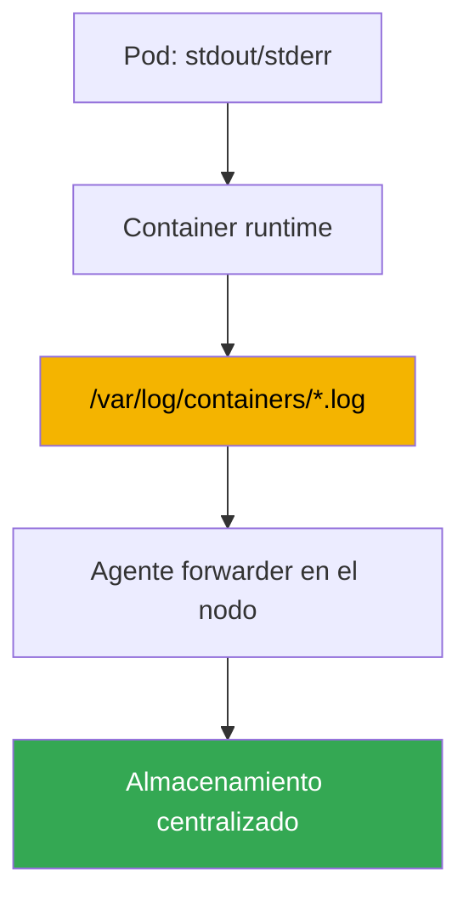
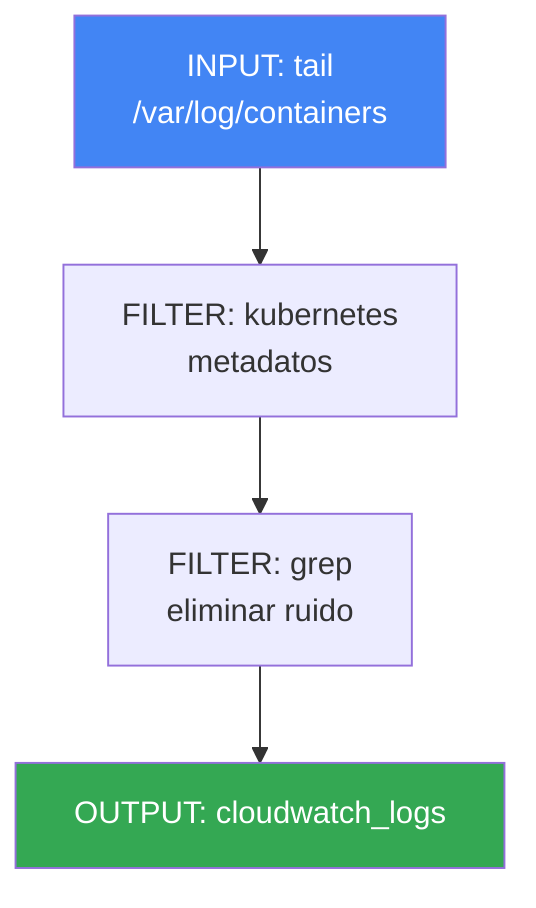

[Русская версия](ru.md) · [Eng version](en.md) · [Version française](fr.md) · [Deutsche Version](de.md) · [ქართული ვერსია](ge.md) · [繁體中文版](tw.md) · [日本語版](jp.md)
# Capítulo 34. Logs: Fluent Bit, CloudWatch Logs, OpenSearch, control de costes

> **Qué sigue.** El capítulo 33 cubrió las métricas: series numéricas sobre la utilización de nodos y pods. Aquí está el segundo pilar de la observabilidad: los logs, registros textuales de lo que hizo una aplicación y por qué falló. Las métricas responden «cuánto»; los logs, «qué ocurrió exactamente». Los temas relacionados se tratan en otros capítulos: métricas, capítulo 33; autoescalado por métricas (HPA, KEDA), capítulo 35; tracing distribuido mediante ADOT y X-Ray, capítulo 36; auditoría del control plane (`audit log`) como herramienta de seguridad, capítulo 21; y contabilidad y optimización general de costes, capítulo 43. Este capítulo se centra en una cosa: cómo exportar logs de nodos y pods efímeros, dónde almacenarlos y cómo no arruinarse con ello.

## 34.1. «El pod se recreó y los logs desaparecieron»

Un pod falló por la noche. La persona de guardia revisa qué ocurrió y usa el comando habitual:

```bash
kubectl logs my-app-7d9f8c6b5-x2k4p
# Error from server (NotFound): pods "my-app-7d9f8c6b5-x2k4p" not found
```

El pod ya no existe. El Deployment recreó la réplica con otro nombre y eliminó el pod antiguo junto con sus logs del fallo. Intentamos acceder a la ejecución anterior de un pod en funcionamiento:

```bash
kubectl logs my-app-7d9f8c6b5-abcde --previous
# Error from server (BadRequest): previous terminated container not found
```

`kubectl logs` muestra logs solo de un pod vivo y, como máximo, de dos ejecuciones del contenedor: la actual y la anterior. En cuanto se elimina el pod, los logs desaparecen por completo. En EKS, los pods son efímeros por definición: un Deployment los recrea durante actualizaciones y Karpenter (capítulo 12) consolida nodos infrautilizados y mueve cargas de trabajo. Junto al nodo desaparecen todos los logs de su disco. Retirar un nodo durante la consolidación es comportamiento normal, no un fallo, y se lleva silenciosamente el historial de logs.

El resultado es que no hay con qué investigar un incidente. Un clúster EKS recién creado no dispone de un lugar centralizado donde los logs sobrevivan a la desaparición de pods y nodos: igual que las métricas, debes construirlo tú. A continuación veremos, en orden, dónde viven los logs en un nodo y por qué hay que exportarlos pronto; cómo lo hace Fluent Bit; dónde almacenarlos; los logs del control plane por separado; y cómo controlar los costes, porque los logs son los que más rápido crecen.

## 34.2. Dónde viven los logs en un nodo y por qué hay que exportarlos

Por convención de Kubernetes, una aplicación escribe los logs en stdout y stderr, no en archivos dentro de su contenedor. Después entra en juego la mecánica del nodo: el container runtime captura esos flujos y los guarda en archivos del disco del nodo. Su disposición es predecible:

- `/var/log/pods/<namespace>_<pod>_<uid>/<container>/`: archivos de logs de cada contenedor.
- `/var/log/containers/*.log`: enlaces simbólicos a archivos en `/var/log/pods`, cuyos nombres codifican el pod, el namespace y el contenedor. Es el punto desde el que un recopilador obtiene los logs.

Los archivos no crecen indefinidamente: kubelet los rota por tamaño y, con el tiempo, elimina los segmentos antiguos para que no llenen el disco del nodo. Aquí está la raíz del problema de la sección 34.1. Los logs del nodo son un búfer temporal, no almacenamiento. Tres amenazas pueden hacer que desaparezcan:

- **se elimina el pod**: se limpia su directorio en `/var/log/pods`;
- **rotación**: los registros antiguos se sobrescriben con nuevos y desaparece el historial de ayer;
- **se consolida el nodo**: Karpenter o scale-down se lleva el disco completo.

La conclusión es sencilla: los logs deben exportarse continuamente desde el nodo a almacenamiento centralizado **antes de que** desaparezca el pod o el nodo. No hay de dónde recuperarlos después. Esa es exactamente la tarea de un agente que se ejecuta en cada nodo y transmite líneas nuevas hacia fuera en tiempo real.



## 34.3. Fluent Bit como DaemonSet

El agente forwarder en EKS es casi siempre **Fluent Bit**, ejecutado como DaemonSet: un pod en cada nodo para leer sus archivos de logs locales. Monta `/var/log` desde el nodo, vigila los archivos de `/var/log/containers`, lee las líneas nuevas y las envía a los destinos configurados.

Fluent Bit es un forwarder de logs ligero escrito en C, con bajo consumo de CPU y memoria. Esto es importante para un agente que se ejecuta en cada nodo y no debe quitar recursos a las cargas de trabajo. Su pariente mayor, **Fluentd**, está escrito en Ruby y cuenta con más plugins, pero consume bastante más memoria y normalmente es excesivo como recopilador de nodo. En la práctica, Fluent Bit es la opción predeterminada en EKS, mientras que Fluentd queda para agregación compleja en una capa dedicada, si llega a necesitarse.

AWS publica una imagen lista para usar, **aws-for-fluent-bit**. Es Fluent Bit con plugins de salida hacia servicios de AWS ya incluidos, como CloudWatch Logs, Amazon Data Firehose y otros, y con una versión que AWS prueba y actualiza. Usarla resulta cómodo porque no necesitas construir tú mismo una imagen con los plugins necesarios.

La capacidad clave del recopilador es el **enriquecimiento con metadatos de Kubernetes**. Una línea de log sin procesar no identifica por sí sola a quién pertenece. Por el nombre de archivo y mediante solicitudes a la API del clúster, el filtro `kubernetes` de Fluent Bit añade a cada registro el namespace, el nombre del pod, el nombre del contenedor, labels y annotations. Sin esto, es imposible buscar en el flujo común los logs de un Deployment concreto.

Fluent Bit se instala de dos maneras:

- Mediante el **add-on amazon-cloudwatch-observability** (el mismo que habilita Container Insights, capítulo 33). Despliega el agente CloudWatch para métricas y Fluent Bit para logs, todo gestionado. Es la ruta más sencilla si ya utilizas CloudWatch.
- **Por separado, con tu propio Helm chart o manifiesto**: cuando necesitas controlar la configuración de Fluent Bit o un destino que no sea CloudWatch, como OpenSearch o un backend propio.

El agente recibe permisos para escribir en su destino mediante un rol IAM asociado a su ServiceAccount con IRSA o Pod Identity (capítulos 16-17). Sin permisos en CloudWatch Logs u OpenSearch, el envío falla silenciosamente y los logs se acumulan y se pierden en el nodo.

## 34.4. Dónde almacenar los logs: destinos

Fluent Bit puede escribir en distintos destinos mediante plugins OUTPUT. En el ecosistema AWS, la elección suele estar entre cuatro.

- **CloudWatch Logs**: almacenamiento de logs nativo de AWS. Los logs se organizan en **log groups** (normalmente un grupo por aplicación o namespace) y, dentro de ellos, en **log streams** (normalmente un flujo por pod o contenedor). Las consultas se realizan con **CloudWatch Logs Insights** (su propio lenguaje de consulta), con integración lista para usar con alarmas y otros servicios de AWS. El plugin es `cloudwatch_logs`.
- **Amazon OpenSearch Service**: OpenSearch gestionado, un fork de Elasticsearch, con búsqueda de texto completo, dashboards flexibles mediante OpenSearch Dashboards y analítica compleja. Es más potente para búsquedas, pero constituye un clúster separado que hay que dimensionar y pagar por nodos, por lo que es más pesado y caro. El plugin es `opensearch`.
- **Amazon S3**: un archivo económico. Los logs se escriben como objetos en un bucket; la búsqueda no es interactiva, se hace con Athena o exportaciones ocasionales, pero el almacenamiento es el más barato y dispone de transiciones de lifecycle a clases frías. Es adecuado para retención a largo plazo y compliance. El plugin es `s3`.
- **Amazon Data Firehose**: no es almacenamiento sino un búfer y enrutador. Recibe un flujo, lo almacena temporalmente y lo entrega a destinos como S3, OpenSearch o receptores de terceros; durante el proceso puede comprimir y transformar los datos. Se usa cuando se necesita un único pipeline gestionado hacia varios lugares. El plugin es `kinesis_firehose`.

| Destino | Punto fuerte | Punto débil | Cuándo usarlo |
|---|---|---|---|
| CloudWatch Logs | nativo de AWS, Logs Insights, alarmas | búsqueda más débil que OpenSearch | almacenamiento e investigación básicos en AWS |
| OpenSearch Service | búsqueda de texto completo, dashboards | clúster separado, más caro | análisis intenso y búsqueda de logs |
| S3 | almacenamiento más barato, archivo | sin búsqueda interactiva | archivo a largo plazo, compliance |
| Data Firehose | búfer y enrutamiento a varios lugares | no almacena datos por sí mismo | un pipeline a varios destinos |

Los destinos pueden combinarse: los logs calientes de los últimos días van a CloudWatch u OpenSearch para investigación rápida, mientras que una copia completa se escribe en paralelo en S3 para retención económica a largo plazo.

### Tu propia pila de logs: Loki y VictoriaLogs

Fuera de los servicios de AWS, hay dos soluciones que se despliegan con frecuencia en el clúster junto a Grafana, especialmente si las métricas ya se visualizan allí también (capítulo 33).

**Grafana Loki** se basa en una idea: indexar no el texto en sí, sino únicamente las **labels** del flujo, como Prometheus. Los logs se comprimen en chunks y se almacenan en object storage, como S3, mientras que el índice se mantiene pequeño, lo que resulta en almacenamiento barato. Las consultas utilizan **LogQL**, cuya sintaxis es familiar para quien usa métricas. Esto también crea la principal trampa, simétrica al problema de cardinalidad del capítulo 33: las labels deben tener baja cardinalidad, como namespace, aplicación y contenedor, mientras que incluir `pod`, `request_id` o `trace_id` en labels dispara el índice y perjudica el rendimiento; para ellos existe structured metadata. El mismo Fluent Bit puede recopilar logs, mientras que el agente nativo de Loki ahora es Grafana Alloy: Promtail se integró en él y ya no tiene soporte.

**VictoriaLogs** pertenece al mismo ecosistema que VictoriaMetrics: una base de datos de logs sin dependencias que no necesita ni un esquema predefinido ni configuración de índices. Almacena datos de forma columnar en disco, las consultas usan **LogsQL** con búsqueda de texto completo y acepta múltiples protocolos, entre ellos Elasticsearch bulk, Loki push, OTLP y syslog, por lo que normalmente no es necesario cambiar de agente durante una migración. Existe una versión en clúster (`vlinsert`, `vlstorage`, `vlselect`) y un operador para Kubernetes.

| Solución | Qué indexa | Consultas | Dónde viven los logs | Operación |
|---|---|---|---|---|
| CloudWatch Logs | todo, gestionado | Logs Insights | en AWS | ninguna |
| OpenSearch Service | índice de texto completo | DSL, Dashboards | clúster OpenSearch | dimensionado y actualizaciones del clúster |
| Loki | solo labels de flujo | LogQL | object storage (S3) | componentes Loki y disciplina de labels |
| VictoriaLogs | no requiere esquema | LogsQL | discos de tus nodos | componentes mínimos, los discos son tu responsabilidad |

La elección suele reducirse a tres preguntas. Si todo está en AWS y se necesita un mínimo de operación, usa CloudWatch con un archivo en S3. Si se necesita búsqueda intensa de texto completo y dashboards listos, usa OpenSearch, teniendo en cuenta el coste de un clúster separado. Si los dashboards ya están en Grafana y se desea almacenamiento económico en S3, usa Loki vigilando la cardinalidad de las labels. Si se desea lo mismo pero con operación más sencilla y sin object storage, usa VictoriaLogs. Igual que con las métricas, una pila propia no es gratuita: pagas con discos, nodos y guardias en vez de con una factura de AWS (la estructura de costes se explica en la sección 34.6 y el capítulo 43).

## 34.5. Los logs del control plane de EKS son independientes

Todo lo anterior trata de los logs de tus cargas de trabajo, que viven en nodos. La capa de gestión del clúster operada por AWS tiene sus propios logs y se habilitan por separado. **EKS control plane logging** entrega logs de diagnóstico y auditoría directamente desde el control plane a CloudWatch Logs de tu cuenta. Los nodos y Fluent Bit no intervienen: el origen es el propio control plane gestionado.

Hay cinco tipos de logs disponibles, cada uno correspondiente a un componente del control plane:

| Tipo | Qué registra |
|---|---|
| `api` | solicitudes al Kubernetes API server y sus flags de arranque |
| `audit` | quién hizo qué y sobre qué recurso del clúster: la base de la auditoría (capítulo 21) |
| `authenticator` | autenticación IAM para RBAC, específica de EKS |
| `controllerManager` | funcionamiento de los bucles de control (controller manager) |
| `scheduler` | decisiones del scheduler sobre la colocación de pods |

Se habilitan individualmente para cada clúster mediante la consola, CLI o API. Los logs llegan a CloudWatch como log streams en el grupo común del clúster. El tipo `audit` es la fuente para investigar «quién eliminó el Deployment» y detectar actividad sospechosa; el capítulo 21 explica su uso en detalle. Aquí recuerda una cosa: son logs de la capa de gestión, no logs de pods, y también pagas su ingestion y almacenamiento en CloudWatch, así que debes habilitarlos de forma consciente.

```bash
# habilitar los tipos de logs necesarios del control plane en un clúster existente
aws eks update-cluster-config --name my-cluster \
  --logging '{"clusterLogging":[{"types":["api","audit","authenticator"],"enabled":true}]}'
```

## 34.6. Control de costes de logs

Los logs son el gasto de observabilidad que crece más rápido y es más fácil perder de vista. Un único servicio verboso con nivel DEBUG puede generar más datos que todas las métricas del clúster juntas. Los costes proceden de dos lados, que deben distinguirse:

- **CloudWatch Logs** cobra por **ingestion**, el volumen de datos aceptados, y por **storage**, el volumen retenido. La ingestion suele ser el coste principal: se paga por cada gigabyte aceptado, sin importar cuánto tiempo se retenga después.
- **OpenSearch Service** cobra de otra manera: por el **clúster**, sus nodos de datos, tipo y número, discos y nodos maestros. El coste apenas depende del volumen de consultas y continúa mientras exista el clúster.

| Destino | Por qué se paga | Principal palanca de ahorro |
|---|---|---|
| CloudWatch Logs | ingestion + storage | reducir volumen en el origen, retention |
| OpenSearch Service | nodos del clúster, discos | dimensionado del clúster, retención corta |
| S3 | almacenamiento por volumen | lifecycle a clases frías |

De ello se derivan técnicas prácticas, ordenadas de la más eficaz a las complementarias:

- **Eliminar ruido antes de enviarlo.** El log más barato es el que nunca se envía. El filtro `grep` de Fluent Bit descarta en el nodo datos que se sabe que no son necesarios, como health checks o líneas de debug, antes de la ingestion. Así se reduce la partida más cara: el volumen aceptado.
- **Configurar los niveles de logs de las aplicaciones.** El nivel predeterminado de Fluent Bit y muchas aplicaciones es INFO, que genera bastante volumen; WARN o ERROR suele ser suficiente en producción. Reducir el nivel en la aplicación recorta el flujo varias veces sin coste.
- **Establecer retention en los log groups.** De forma predeterminada, los logs de CloudWatch se retienen para siempre, Never Expire, y el almacenamiento crece sin límite. Define una retention policy adecuada a los requisitos: logs operativos durante semanas y logs de auditoría durante más tiempo por compliance.
- **Muestrear datos de alta frecuencia.** Para flujos muy verbosos, conserva una fracción de los registros en vez de todos: una muestra basta para tendencias, mientras que el volumen baja proporcionalmente.
- **Separar logs calientes y fríos.** Coloca los logs calientes que requieren búsqueda rápida en CloudWatch u OpenSearch durante poco tiempo; conserva una copia completa en S3 como archivo económico a largo plazo. No mantengas todo en almacenamiento caliente caro.

```bash
# limitar la retención de un log group a 14 días en vez de «para siempre»
aws logs put-retention-policy \
  --log-group-name /aws/containerinsights/my-cluster/application \
  --retention-in-days 14
```

La idea principal es que resulta más barato controlar el volumen en el origen, en la aplicación y Fluent Bit, que el almacenamiento después. Un gigabyte filtrado no cuesta nada; la retention solo limita una ingestion que ya se ha pagado.

## 34.7. Cómo funciona una configuración de Fluent Bit

Una configuración de Fluent Bit es un pipeline de tres tipos de secciones. Entenderla es útil incluso al instalar mediante el add-on, para que puedas leer y modificar el comportamiento del recopilador. El flujo va de izquierda a derecha: INPUT lee, FILTER procesa y OUTPUT envía.



- **INPUT**: el origen. El plugin `tail` vigila los archivos `/var/log/containers/*.log` y lee las líneas nuevas, recordando su posición para no enviarlas de nuevo.
- **FILTER**: procesamiento del flujo. `kubernetes` enriquece los registros con metadatos, como namespace, pod y labels; `grep` deja pasar o descarta registros por expresión regular y se usa para eliminar ruido antes del envío (sección 34.6).
- **OUTPUT**: el destino. `cloudwatch_logs` escribe en CloudWatch Logs, `opensearch` en OpenSearch y `s3` y `kinesis_firehose` en el archivo y el pipeline. Cada uno tiene su propio conjunto de campos: región, nombre de log group, creación automática de grupos, etcétera.

Estructuralmente, un pipeline tiene este aspecto, con valores de ejemplo:

```text
[INPUT]
    Name              tail
    Path              /var/log/containers/*.log
    multiline.parser  cri, go
    Mem_Buf_Limit     50MB
    storage.type      filesystem
[FILTER]
    Name              kubernetes
    Match             kube.*
    Merge_Log         On
[FILTER]
    Name              grep
    Match             kube.*
    Exclude           log /healthz
[OUTPUT]
    Name              cloudwatch_logs
    Match             kube.*
    region            eu-central-1
    log_group_name    /aws/eks/my-cluster/application
```

El campo `Match` vincula las secciones mediante la etiqueta: FILTER y OUTPUT se aplican a registros cuya etiqueta coincide con el patrón. Así, un pipeline puede enrutar distintos logs a distintos destinos.

Otras dos opciones de INPUT protegen al propio recopilador ante backpressure, cuando un destino no está disponible o limita solicitudes, por ejemplo, si la API de CloudWatch responde lentamente o devuelve un límite de solicitudes. Sin ellas, Fluent Bit acumula registros no aceptados en memoria, crece y termina OOMKilled, llevándose consigo todos los logs del nodo, justo lo que debería impedir. `Mem_Buf_Limit` en el INPUT `tail` limita la memoria del búfer. Al alcanzar el límite, el plugin deja de leer archivos nuevos hasta que se vacíe la cola, en lugar de crecer hasta OOM. `storage.type filesystem` mueve el desbordamiento del búfer al disco del nodo, lo que requiere `storage.path` en la sección `SERVICE`, en lugar de mantenerlo todo en RAM: un bloqueo puntual se supera sin pérdidas ni OOM. Juntas, convierten un fallo de envío en una ralentización, no en la caída del agente y la pérdida de logs.

Dos opciones del pipeline afectan directamente a la utilidad de los logs durante una investigación. `multiline.parser` en el INPUT `tail` une los registros multilínea en uno solo: de otro modo, un stack trace de Java o Python llega como una docena de líneas separadas imposibles de reconstruir en el almacenamiento. Los parsers incorporados, `cri`, `docker`, `go`, `java` y `python`, cubren casos habituales; `cri` une las líneas divididas por el propio container runtime y los parsers de aplicación van después. `Merge_Log On` en el filtro `kubernetes` analiza una cadena JSON del campo `log` en campos de registro separados: una aplicación que escribe logs JSON pasa a estar estructurada, de modo que se puede filtrar y buscar por sus campos en vez de por el texto completo.

## 34.8. Cómo se aplica en producción

- **Instala el recopilador de logs junto con las métricas.** Introduce Fluent Bit como DaemonSet en el clúster desde el primer día para que los logs se exporten desde el comienzo; normalmente mediante el add-on amazon-cloudwatch-observability junto a Container Insights.
- **Empieza a reducir volumen en el origen.** Los niveles de logging de las aplicaciones y los filtros `grep` de Fluent Bit son la primera palanca de coste; el filtrado posterior en el almacenamiento ya se ha pagado.
- **Establece retention conscientemente en cada log group.** El valor predeterminado de «retener para siempre» es una causa típica de una factura creciente; a los logs operativos se les asignan semanas y a los de auditoría un plazo basado en compliance.
- **Separa datos calientes y fríos.** Utiliza CloudWatch u OpenSearch para búsquedas rápidas durante poco tiempo y S3 para un archivo completo y económico; rara vez se conserva todo en almacenamiento caliente.
- **Usa OpenSearch cuando la búsqueda lo justifique.** Es un clúster separado que hay que operar y pagar; CloudWatch Logs Insights es suficiente para investigación básica.
- **Habilita selectivamente los logs del control plane.** `audit` y `authenticator` son para seguridad e investigación de accesos, capítulo 21, no para activar «los cinco por si acaso»: cada tipo añade ingestion.

## 34.9. Mini glosario

- **stdout/stderr**: flujos estándar de salida del contenedor. Por convención de Kubernetes, una aplicación escribe logs allí en vez de en archivos dentro de su contenedor.
- **/var/log/containers**: directorio de un nodo con enlaces a los archivos de logs de contenedores; es el punto desde el que el recopilador obtiene los logs.
- **Fluent Bit**: forwarder de logs ligero escrito en C, ejecutado como DaemonSet en cada nodo; lee, enriquece y envía archivos de logs a destinos.
- **aws-for-fluent-bit**: imagen de Fluent Bit creada por AWS con plugins de salida a servicios de AWS incluidos.
- **filtro kubernetes**: FILTER de Fluent Bit que añade namespace, pod, contenedor, labels y annotations a los registros.
- **CloudWatch Logs**: almacenamiento de logs de AWS; log groups y log streams, consultas mediante Logs Insights y cobro por ingestion y storage.
- **log group / log stream**: un grupo, normalmente por aplicación, y un flujo dentro de él, normalmente por pod, en CloudWatch Logs.
- **OpenSearch Service**: OpenSearch gestionado para búsqueda de texto completo y dashboards, pagado por nodos del clúster.
- **Data Firehose**: búfer y enrutador de flujos gestionado hacia S3, OpenSearch y otros destinos.
- **control plane logging**: entrega de logs de la capa de gestión de EKS, `api`, `audit`, `authenticator`, `controllerManager` y `scheduler`, a CloudWatch Logs.
- **retention policy**: periodo durante el cual los logs se retienen en un log group antes de eliminarse; por defecto no caducan.
- **INPUT / FILTER / OUTPUT**: los tres tipos de secciones de un pipeline Fluent Bit: lectura, procesamiento y envío.
- **Grafana Loki**: almacenamiento de logs que solo indexa labels de flujo; los logs se comprimen en chunks en object storage y las consultas usan LogQL. Las labels deben tener baja cardinalidad; para cardinalidad alta existe structured metadata. El agente nativo es Grafana Alloy, donde se integró Promtail.
- **VictoriaLogs**: base de datos de logs sin dependencias, sin esquema ni configuración de índices; almacenamiento columnar en disco, consultas LogsQL e ingestion mediante Elasticsearch bulk, Loki push, OTLP y syslog. Existe una opción en clúster con `vlinsert`, `vlstorage` y `vlselect`.

## 34.10. Resumen del capítulo

- `kubectl logs` funciona solo para un pod vivo y, como máximo, su ejecución actual y anterior; después de eliminar un pod o consolidar un nodo, sus logs desaparecen con él.
- Los logs de contenedor viven en el nodo, en `/var/log/pods` y `/var/log/containers`; kubelet los rota y elimina. Son un búfer temporal, no almacenamiento, por lo que deben exportarse continuamente.
- Fluent Bit exporta logs: es un forwarder ligero y un DaemonSet en cada nodo; usa la imagen aws-for-fluent-bit con plugins de AWS integrados, enriquece los metadatos de Kubernetes mediante el filtro `kubernetes` y recibe permisos con IRSA o Pod Identity.
- Instala Fluent Bit mediante el add-on amazon-cloudwatch-observability junto a Container Insights, o por separado con un Helm chart cuando necesites control u otro destino.
- Los destinos son CloudWatch Logs, nativo de AWS con Logs Insights; OpenSearch Service, para búsqueda y dashboards pero más caro; S3, un archivo económico; y Data Firehose, para búfer y enrutamiento.
- Los logs del control plane, `api`, `audit`, `authenticator`, `controllerManager` y `scheduler`, se habilitan aparte y se envían a CloudWatch. Son logs de la capa de gestión, no de pods; `audit` es la base de la auditoría, capítulo 21.
- Controla los costes descartando ruido con `grep` antes del envío, reduciendo niveles de log, estableciendo retention en log groups, muestreando y separando logs calientes de fríos. Gestionar el volumen en el origen es lo más barato.
- Una configuración Fluent Bit es un pipeline de INPUT, `tail`; FILTER, `kubernetes`, `grep`; y OUTPUT, `cloudwatch_logs`, `opensearch` y otros. Las secciones se vinculan por etiqueta mediante `Match`.

## 34.11. Cómo ayuda esto en el trabajo real

En una guardia, los logs son la segunda fuente de verdad tras las métricas durante un incidente: una métrica muestra que un pod recibió OOMKilled, mientras que un log indica qué operación estaba realizando. La diferencia es que el log de un pod que falló solo se puede encontrar si se exportó de antemano. Por ello, Fluent Bit y al menos un destino deben estar listos antes del primer incidente grave: no hay de dónde obtener los logs de un pod eliminado. Saber dónde fluyen los logs del clúster, a CloudWatch, OpenSearch o S3, indica de inmediato dónde buscar a las tres de la mañana, mientras que filtrar por namespace y pod ahorra minutos.

Al planificar, los logs son ante todo una cuestión de dinero y volumen. Recopilar todo con nivel DEBUG y retenerlo para siempre es una forma rápida de recibir una factura en la que los logs cuestan más que el propio clúster. Decide por adelantado qué recopilar, con qué nivel, dónde y durante cuánto tiempo: datos calientes en almacenamiento caro durante semanas, archivos en S3 y ruido descartado en el nodo. Esta decisión se toma una vez al implantar el logging y se revisa junto al análisis de costes, capítulo 43.

## 34.12. Preguntas de autoevaluación

1. ¿Por qué `kubectl logs` no mostrará los logs de un pod que falló y fue recreado?
2. ¿Cómo se relaciona la consolidación de nodos de Karpenter con la pérdida de logs y por qué es comportamiento normal?
3. ¿Dónde guarda el container runtime stdout/stderr del contenedor en un nodo y qué lo rota?
4. ¿Por qué los logs deben exportarse continuamente desde el nodo en vez de recuperarse durante la investigación de un incidente?
5. ¿Por qué Fluent Bit se ejecuta como DaemonSet y qué monta desde el nodo?
6. ¿En qué se diferencia Fluent Bit de Fluentd y por qué el primero es la opción predeterminada en EKS?
7. ¿Qué ofrece la imagen aws-for-fluent-bit y qué hace el filtro `kubernetes`?
8. ¿Cuáles son las dos formas de instalar Fluent Bit y cómo obtiene permisos para escribir en un destino?
9. ¿En qué se diferencian CloudWatch Logs, OpenSearch Service, S3 y Data Firehose como destinos?
10. ¿En qué se diferencian los logs del control plane de los logs de pods y qué cinco tipos están disponibles?
11. ¿Qué compone el coste de CloudWatch Logs y cómo se diferencia el modelo de coste de OpenSearch?
12. ¿Qué técnicas reducen el coste de logs y por qué reducir volumen en el origen es lo más eficaz?
13. ¿Qué secciones componen un pipeline Fluent Bit y cómo las vincula el campo `Match`?
14. ¿Qué indexa Loki y por qué `pod` o `request_id` en labels son una mala idea?
15. ¿En qué se diferencia VictoriaLogs de Loki en almacenamiento y requisitos de configuración?
16. Los logs se visualizan en Grafana y deben retenerse de forma económica durante mucho tiempo. ¿Qué dos opciones existen y con qué se paga?

## Práctica

Laboratorio del curso para este tema: [laboratorio 115: Logging: Fluent Bit en CloudWatch Logs, filtrado y retention](../../labs/115/README_ES.MD). Además, puedes inspeccionar fácilmente el estado del logging en un clúster activo. Primero, reproduce el problema original y observa qué devuelve `kubectl logs`:

```bash
# logs de un pod vivo y de la ejecución anterior del contenedor
kubectl logs deploy/my-app
kubectl logs deploy/my-app --previous
```

Comprueba si el clúster tiene un recopilador de logs: Fluent Bit como DaemonSet:

```bash
# DaemonSet Fluent Bit y agente CloudWatch (add-on amazon-cloudwatch-observability)
kubectl get ds -n amazon-cloudwatch
kubectl get pods -n amazon-cloudwatch -o wide
```

Consulta qué log groups ya existen y sus periodos de retention. Es un indicador directo de volumen y costes:

```bash
# log groups y su retention (columna retentionInDays; vacío = retener para siempre)
aws logs describe-log-groups \
  --query "logGroups[].[logGroupName,retentionInDays]" --output table
```

Por último, comprueba si los logs del control plane están habilitados y qué tipos lo están:

```bash
# configuración de logging del control plane del clúster
aws eks describe-cluster --name my-cluster \
  --query "cluster.logging.clusterLogging" --output json
```

Compara el resultado: ¿se exportan los logs de pods, está Fluent Bit presente, a dónde se dirigen, los grupos tienen retention y hay tipos de logs del control plane innecesarios habilitados? Las carencias significan logs perdidos, mientras que el almacenamiento «para siempre» sin retention implica una factura creciente; corrige ambos antes de un incidente y antes de la próxima revisión de costes.

---
[Índice](../README_ES.md) · [Capítulo 33](../33/es.md) · [Capítulo 35](../35/es.md)
