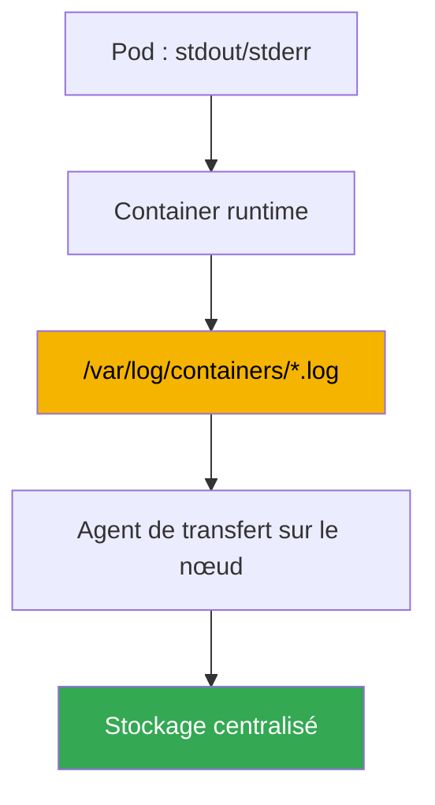
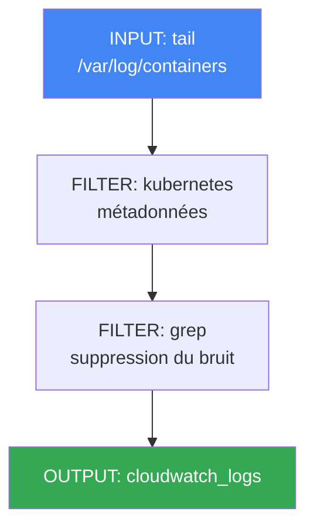

[Eng version](en.md) · [Русская версия](ru.md) · [Versión en español](es.md) · [Deutsche Version](de.md) · [ქართული ვერსია](ge.md) · [繁體中文版](tw.md) · [日本語版](jp.md)

# Chapitre 34. Logs : Fluent Bit, CloudWatch Logs, OpenSearch, maîtrise des coûts

> **La suite.** Le chapitre 33 a couvert les métriques, des séries numériques sur l'utilisation des nœuds et des pods. Voici le second pilier de l'observabilité : les logs, c'est-à-dire les enregistrements textuels de ce que l'application a fait et des raisons de son échec. Les métriques répondent à la question « combien », les logs à « qu'est-ce qui s'est exactement passé ». Les sujets connexes sont traités dans d'autres chapitres : les métriques au chapitre 33 ; l'autoscaling par métriques (HPA, KEDA) au chapitre 35 ; le traçage distribué avec ADOT et X-Ray au chapitre 36 ; l'audit du control plane (`audit log`) comme outil de sécurité au chapitre 21 ; et la comptabilisation ainsi que l'optimisation globale des coûts au chapitre 43. Ici, une seule question : comment exporter les logs des nœuds et pods éphémères, où les stocker et comment ne pas se ruiner.

## 34.1. « Le pod a été recréé, les logs ont disparu »

Pendant la nuit, un pod tombe. L'ingénieur d'astreinte regarde ce qui s'est passé et lance la commande habituelle pour récupérer les logs :

```bash
kubectl logs my-app-7d9f8c6b5-x2k4p
# Error from server (NotFound): pods "my-app-7d9f8c6b5-x2k4p" not found
```

Le pod n'existe déjà plus. Le Deployment a recréé la réplique sous un nouveau nom, et l'ancien pod avec les logs de l'incident a été supprimé. Essayons d'accéder au lancement précédent d'un pod en cours d'exécution :

```bash
kubectl logs my-app-7d9f8c6b5-abcde --previous
# Error from server (BadRequest): previous terminated container not found
```

`kubectl logs` n'affiche les logs que d'un pod vivant et d'au plus deux lancements du conteneur : le courant et le précédent. Dès que le pod est supprimé, ses logs n'existent plus du tout. Or, dans EKS, les pods sont éphémères par définition : le Deployment les recrée lors des mises à jour, tandis que Karpenter (chapitre 12) retire les nœuds sous-utilisés et déplace les charges de travail. Avec le nœud disparaissent tous les logs présents sur son disque. Le retrait d'un nœud durant la consolidation est un comportement normal, non une panne, et il emporte silencieusement l'historique des logs.

Résultat : il n'y a rien pour analyser l'incident. Dans un EKS neuf, il n'existe pas d'emplacement centralisé où les logs survivent à la mort du pod et du nœud. Vous devez le construire, comme pour les métriques. Nous verrons ensuite, dans l'ordre : où résident les logs sur le nœud et pourquoi il faut les exporter à l'avance ; comment Fluent Bit s'en charge ; où les stocker ; les logs du control plane séparément ; et comment maîtriser les coûts, car les logs croissent plus vite que tout le reste.

## 34.2. Où résident les logs sur le nœud et pourquoi il faut les exporter

Par convention dans Kubernetes, l'application écrit ses logs dans stdout et stderr, et non dans des fichiers à l'intérieur du conteneur. Le mécanisme du nœud prend alors le relais : le container runtime intercepte ces flux et les place dans des fichiers sur le disque du nœud. Leur emplacement est prévisible :

- `/var/log/pods/<namespace>_<pod>_<uid>/<container>/` : fichiers de logs de chaque conteneur.
- `/var/log/containers/*.log` : liens symboliques vers les fichiers de `/var/log/pods`, dont les noms encodent le pod, le namespace et le conteneur. C'est le point depuis lequel le collecteur récupère les logs.

Les fichiers ne croissent pas indéfiniment : kubelet les fait tourner (rotation selon la taille) et les anciens segments sont supprimés au fil du temps pour ne pas saturer le disque du nœud. C'est là que se trouve la racine du problème de la section 34.1. Les logs sur le nœud sont un tampon temporaire, pas un stockage. Trois menaces pèsent sur leur existence :

- **le pod est supprimé** : son répertoire dans `/var/log/pods` est nettoyé ;
- **la rotation** : les anciens enregistrements sont écrasés par les nouveaux, l'historique d'hier disparaît ;
- **le nœud est retiré** : Karpenter ou un scale-down emporte le disque entier.

La conclusion est simple : les logs doivent être exportés en continu du nœud vers un stockage centralisé **avant** la disparition du pod ou du nœud. Il n'y a aucun endroit où les récupérer après coup. C'est précisément le rôle de l'agent qui s'exécute sur chaque nœud et transmet les nouvelles lignes en temps réel vers l'extérieur.



## 34.3. Fluent Bit en tant que DaemonSet

L'agent de transfert dans EKS est presque toujours **Fluent Bit**, exécuté en tant que DaemonSet : un pod par nœud pour lire ses fichiers de logs locaux. Il monte `/var/log` depuis le nœud, surveille les fichiers dans `/var/log/containers`, lit les nouvelles lignes et les envoie vers les destinations configurées.

Fluent Bit est un léger transférer de logs en C : il consomme peu de CPU et de mémoire, ce qui importe pour un agent qui s'exécute sur chaque nœud sans retirer de ressources aux charges de travail. Son parent plus ancien, **Fluentd**, est écrit en Ruby, possède davantage de plugins, mais consomme sensiblement plus de mémoire et est généralement excessif comme collecteur sur les nœuds. En pratique, Fluent Bit est le choix par défaut dans EKS ; Fluentd reste destiné à une agrégation complexe sur une couche dédiée, si elle est nécessaire.

AWS fournit une image prête à l'emploi, **aws-for-fluent-bit**. Il s'agit de Fluent Bit avec les plugins de sortie vers les services AWS (CloudWatch Logs, Amazon Data Firehose et d'autres) déjà intégrés, dans une version qu'AWS teste et met à jour. L'utiliser est pratique : il n'est pas nécessaire de construire soi-même une image avec les bons plugins.

La fonction clé du collecteur est l'**enrichissement en métadonnées Kubernetes**. Une ligne de log brute ne dit pas à qui elle appartient. Le filtre `kubernetes` de Fluent Bit utilise le nom de fichier et une requête à l'API du cluster pour ajouter à chaque enregistrement le namespace, le nom du pod, le nom du conteneur, les labels et les annotations. Sans cela, rechercher les logs d'un Deployment spécifique dans le flux général est impossible.

Fluent Bit s'installe de deux manières :

- Avec l'**add-on amazon-cloudwatch-observability** (le même qui active Container Insights, chapitre 33). Il déploie CloudWatch agent pour les métriques et Fluent Bit pour les logs, le tout géré : c'est le chemin le plus simple si vous utilisez déjà CloudWatch.
- Séparément, avec son propre Helm chart ou manifeste, lorsqu'un contrôle de la configuration de Fluent Bit est requis ou que la destination n'est pas CloudWatch (OpenSearch, backend interne).

L'agent obtient les autorisations d'écriture vers la destination via un rôle IAM lié à son ServiceAccount par IRSA ou Pod Identity (chapitres 16-17). Sans autorisations pour CloudWatch Logs ou OpenSearch, l'envoi ne fonctionnera pas silencieusement, et les logs s'accumuleront puis se perdront sur le nœud.

## 34.4. Où stocker les logs : destinations

Fluent Bit peut écrire vers diverses destinations grâce aux plugins OUTPUT. Dans l'écosystème AWS, le choix se fait généralement entre quatre possibilités.

- **CloudWatch Logs** : stockage de logs natif AWS. Les logs sont répartis en **log groups** (généralement un groupe par application ou namespace), puis en **log streams** (généralement un flux par pod ou conteneur). Les requêtes se font avec **CloudWatch Logs Insights** (son propre langage de requête), avec intégration directe aux alarmes et aux autres services AWS. Plugin : `cloudwatch_logs`.
- **Amazon OpenSearch Service** : OpenSearch géré (fork d'Elasticsearch), avec recherche en texte intégral, tableaux de bord flexibles (OpenSearch Dashboards) et analytique avancée. Plus puissant pour la recherche, mais il s'agit d'un cluster distinct à dimensionner et à payer par nœud : plus lourd et plus coûteux. Plugin : `opensearch`.
- **Amazon S3** : archive bon marché. Les logs sont envoyés comme objets dans un bucket ; la recherche n'est pas interactive (via Athena ou des exportations ponctuelles), mais le stockage est le moins cher et des transitions lifecycle vers des classes froides sont possibles. C'est un bon choix pour la conservation longue durée et la compliance. Plugin : `s3`.
- **Amazon Data Firehose** : ce n'est pas un stockage, mais un tampon et un routeur. Il reçoit le flux, le met en mémoire tampon et le livre aux destinations (S3, OpenSearch, récepteurs tiers), tout en pouvant le compresser en chemin. Il est choisi lorsqu'un pipeline géré unique vers plusieurs emplacements est nécessaire. Plugin : `kinesis_firehose`.

| Destination | Point fort | Point faible | Quand l'utiliser |
|---|---|---|---|
| CloudWatch Logs | natif AWS, Logs Insights, alarmes | recherche moins riche qu'OpenSearch | stockage et analyse de base dans AWS |
| OpenSearch Service | recherche en texte intégral, tableaux de bord | cluster distinct, plus cher | analyse intensive et recherche dans les logs |
| S3 | stockage et archivage les moins chers | aucune recherche interactive | archive longue durée, compliance |
| Data Firehose | tampon et routage vers plusieurs destinations | ne stocke pas lui-même | pipeline unique vers plusieurs emplacements |

Les destinations sont combinables : les logs chauds des derniers jours vont dans CloudWatch ou OpenSearch pour une analyse rapide, tandis qu'une copie complète est envoyée en parallèle vers S3 pour un stockage long terme bon marché.

### Votre propre pile de logs : Loki et VictoriaLogs

En dehors des services AWS, deux solutions sont souvent installées dans le cluster à côté de Grafana, en particulier lorsque les métriques y sont déjà visualisées (chapitre 33).

**Grafana Loki** repose sur une idée : n'indexer non pas le texte lui-même, mais uniquement les **labels** du flux, comme Prometheus. Les logs sont compressés en chunks et placés dans un stockage objet, donc dans S3, tandis que l'index reste petit : d'où un stockage peu coûteux. Les requêtes utilisent **LogQL**, dont la syntaxe rappelle celle des métriques. Cela introduit le principal piège, symétrique à la cardinalité du chapitre 33 : les labels doivent avoir une faible cardinalité (namespace, application, conteneur), tandis que `pod`, `request_id` ou `trace_id` dans les labels font exploser l'index et les performances ; les structured metadata sont prévues pour eux. Les logs peuvent être collectés par le même Fluent Bit, et l'agent Loki natif est désormais Grafana Alloy : Promtail y a été intégré et n'est plus pris en charge.

**VictoriaLogs** fait partie du même écosystème que VictoriaMetrics : c'est une base de logs monolithique sans dépendances, qui ne requiert ni schéma prédéfini ni configuration d'index. Elle stocke les données en colonnes sur disque, offre des requêtes **LogsQL** avec recherche en texte intégral, et accepte de nombreux protocoles, dont Elasticsearch bulk, Loki push, OTLP et syslog. Il n'est donc généralement pas nécessaire de changer d'agents lors d'une migration. Une version en cluster (`vlinsert`, `vlstorage`, `vlselect`) et un opérateur Kubernetes existent.

| Solution | Ce qui est indexé | Requêtes | Où résident les logs | Exploitation |
|---|---|---|---|---|
| CloudWatch Logs | tout, géré | Logs Insights | chez AWS | aucune |
| OpenSearch Service | index de texte intégral | DSL, Dashboards | cluster OpenSearch | dimensionnement et mises à niveau du cluster |
| Loki | uniquement les labels du flux | LogQL | stockage objet (S3) | composants Loki et discipline sur les labels |
| VictoriaLogs | aucun schéma nécessaire | LogsQL | disques de vos nœuds | composants minimaux, disques à votre charge |

Le choix se résume généralement à trois questions. Tout est dans AWS et vous voulez un minimum d'exploitation : CloudWatch, avec une archive dans S3. Vous avez besoin d'une recherche en texte intégral poussée et de tableaux de bord prêts à l'emploi : OpenSearch, en acceptant le coût d'un cluster distinct. Vos tableaux de bord sont déjà dans Grafana et vous souhaitez un stockage S3 peu coûteux : Loki, en restant attentif à la cardinalité des labels. Vous voulez la même chose, mais plus simple à exploiter et sans stockage objet : VictoriaLogs. Comme pour les métriques, votre propre pile n'est pas gratuite : vous payez en disques, en nœuds et en astreinte plutôt qu'en facture AWS (structure des coûts : section 34.6 et chapitre 43).

## 34.5. Les logs du control plane EKS sont séparés

Tout ce qui précède concerne les logs de vos charges de travail, qui résident sur les nœuds. La couche de gestion du cluster, fournie par AWS, possède ses propres logs, activés séparément. **EKS control plane logging** livre les logs de diagnostic et d'audit directement du control plane vers CloudWatch Logs dans votre compte. Les nœuds et Fluent Bit ne sont pas concernés : la source est le control plane géré lui-même.

Cinq types de logs sont disponibles, chacun correspondant à un composant du control plane :

| Type | Ce qui est enregistré |
|---|---|
| `api` | appels au Kubernetes API server, indicateurs de son lancement |
| `audit` | qui a fait quoi et sur quelle ressource dans le cluster : fondement de l'audit (chapitre 21) |
| `authenticator` | authentification IAM pour RBAC, spécifique à EKS |
| `controllerManager` | activité des boucles de contrôle (controller manager) |
| `scheduler` | décisions du scheduler sur le placement des pods |

Ils sont activés au cas par cas, pour chaque cluster individuellement, par la console, la CLI ou l'API. Les logs arrivent dans CloudWatch sous forme de log streams dans le groupe commun du cluster. Le type `audit` est la source utilisée pour déterminer « qui a supprimé le Deployment » et détecter une activité suspecte ; son utilisation est détaillée au chapitre 21. Retenez ici un point : ce sont les logs de la couche de gestion, pas des pods, et vous payez aussi leur ingestion et leur stockage dans CloudWatch. Il convient donc de les activer consciemment.

```bash
# activer les types de logs control plane nécessaires sur un cluster existant
aws eks update-cluster-config --name my-cluster \
  --logging '{"clusterLogging":[{"types":["api","audit","authenticator"],"enabled":true}]}'
```

## 34.6. Maîtrise des coûts des logs

Les logs sont le poste d'observabilité qui croît le plus rapidement et échappe le plus facilement au contrôle. Un seul service bavard au niveau DEBUG peut générer plus de données que toutes les métriques du cluster réunies. Le coût s'accumule de deux côtés, qu'il faut distinguer :

- **CloudWatch Logs** est facturé pour l'**ingestion** (volume de données reçues) et le **storage** (volume stocké). L'ingestion est généralement le poste principal : chaque gigaoctet reçu est facturé, quelle que soit sa durée de conservation ultérieure.
- **OpenSearch Service** est facturé autrement : pour le **cluster**, c'est-à-dire les nœuds de données, leur type et leur nombre, les disques et les nœuds maîtres. La dépense dépend peu du volume de requêtes et perdure tant que le cluster est vivant.

| Destination | Ce qui est facturé | Principal levier d'économie |
|---|---|---|
| CloudWatch Logs | ingestion + storage | réduire le volume à la source, retention |
| OpenSearch Service | nœuds et disques du cluster | dimensionnement du cluster, conservation courte |
| S3 | stockage par volume | lifecycle vers des classes froides |

Les techniques pratiques qui en découlent, de la plus efficace à la plus complémentaire :

- **Réduire le bruit avant l'envoi.** Le log le moins cher est celui qui n'est pas envoyé. Le filtre `grep` de Fluent Bit permet d'écarter ce qui est manifestement inutile (health-checks, lignes de debug) sur le nœud, avant l'ingestion. Cela agit sur le poste le plus coûteux : le volume reçu.
- **Configurer les niveaux de logs des applications.** Le niveau par défaut de Fluent Bit et de nombreuses applications est INFO, qui génère volontiers du volume ; en production, WARN ou ERROR suffisent souvent. Réduire le niveau dans l'application diminue gratuitement le flux de plusieurs fois.
- **Définir une retention sur les log groups.** Par défaut, les logs dans CloudWatch sont conservés indéfiniment (Never Expire) et le storage croît sans limite. Définissez une durée de conservation (retention policy) conforme aux besoins : les logs opérationnels pendant des semaines, les audits plus longtemps selon la compliance.
- **Échantillonner ce qui est très fréquent.** Pour les flux très bavards, conservez une fraction des enregistrements au lieu de tous : un échantillon suffit pour les tendances et le volume diminue fortement.
- **Séparer les logs chauds et froids.** Les logs chauds, qui exigent une recherche rapide, vont dans CloudWatch ou OpenSearch pendant une durée courte ; une copie complète va dans S3 pour une archive longue durée bon marché. Ne conservez pas tout dans un stockage chaud coûteux.

```bash
# limiter la conservation des logs du groupe à 14 jours au lieu d'« indéfiniment »
aws logs put-retention-policy \
  --log-group-name /aws/containerinsights/my-cluster/application \
  --retention-in-days 14
```

L'idée principale est la suivante : il est moins cher de maîtriser le volume à la source, au niveau de l'application et de Fluent Bit, que de gérer le stockage après coup. Un gigaoctet filtré ne coûte rien ; la retention ne fait que limiter une ingestion déjà payée.

## 34.7. Structure de la configuration Fluent Bit

La configuration Fluent Bit est un pipeline de trois types de sections. Il est utile de les comprendre même lors d'une installation par add-on afin de lire et modifier le comportement du collecteur. Le flux avance de gauche à droite : INPUT lit, FILTER traite, OUTPUT envoie.



- **INPUT** : la source. Le plugin `tail` surveille les fichiers `/var/log/containers/*.log` et lit les nouvelles lignes, en mémorisant sa position pour ne pas les envoyer à nouveau.
- **FILTER** : le traitement du flux. `kubernetes` enrichit les enregistrements de métadonnées (namespace, pod, labels) ; `grep` laisse passer ou écarte les enregistrements selon une expression régulière, ce qui permet de réduire le bruit avant l'envoi (section 34.6).
- **OUTPUT** : la destination. `cloudwatch_logs` écrit dans CloudWatch Logs, `opensearch` dans OpenSearch, `s3` et `kinesis_firehose` dans l'archive et le pipeline. Chacun dispose de ses propres champs : région, nom de log group, création automatique des groupes, etc.

Structurellement, un flux ressemble à ceci (les valeurs sont données à titre d'exemple) :

```text
[INPUT]
    Name              tail
    Path              /var/log/containers/*.log
    multiline.parser  cri, go
    Mem_Buf_Limit     50MB
    storage.type      filesystem
[FILTER]
    Name              kubernetes
    Match             kube.*
    Merge_Log         On
[FILTER]
    Name              grep
    Match             kube.*
    Exclude           log /healthz
[OUTPUT]
    Name              cloudwatch_logs
    Match             kube.*
    region            eu-central-1
    log_group_name    /aws/eks/my-cluster/application
```

Le champ `Match` relie les sections par tag : FILTER et OUTPUT s'appliquent aux enregistrements dont le tag correspond au motif. Ainsi, un même pipeline peut diriger différents logs vers différentes destinations.

Deux autres options INPUT protègent le collecteur lui-même lors du backpressure, lorsque la destination est indisponible ou applique un throttling (par exemple, lorsque l'API CloudWatch répond lentement ou renvoie une limite de requêtes). Sans elles, Fluent Bit accumule les enregistrements non acceptés en mémoire, grossit et finit OOMKilled, emportant avec lui tous les logs du nœud : exactement ce qu'il doit éviter. L'option `Mem_Buf_Limit` de INPUT `tail` limite la mémoire du tampon : lorsque la limite est atteinte, le plugin cesse de lire de nouveaux fichiers jusqu'à ce que la file soit vidée, plutôt que de croître jusqu'à l'OOM. L'option `storage.type filesystem` déporte le débordement du tampon sur le disque du nœud (un `storage.path` est nécessaire dans la section `SERVICE`) au lieu de tout conserver en RAM : un engorgement ponctuel est surmonté sans perte ni OOM. Ensemble, elles transforment l'échec d'envoi en ralentissement plutôt qu'en chute de l'agent et perte de logs.

Deux options du pipeline influencent directement l'utilité des logs pour l'analyse. L'option `multiline.parser` de INPUT `tail` regroupe les enregistrements multiligne en un seul : sans elle, une stack trace Java ou Python arriverait sous forme de dizaines de lignes distinctes impossibles à reconstituer dans le stockage. Les parseurs intégrés (`cri`, `docker`, `go`, `java`, `python`) couvrent les cas habituels ; `cri` assemble les lignes séparées par le container runtime lui-même, les parseurs applicatifs sont ajoutés ensuite. L'option `Merge_Log On` du filtre `kubernetes` analyse une ligne JSON du champ `log` en champs distincts de l'enregistrement : une application qui écrit ses logs au format JSON devient structurée. Vous pouvez alors filtrer et rechercher selon ses champs plutôt que dans le texte entier.

## 34.8. Application en production

- **Installez le collecteur de logs avec les métriques.** Déployez Fluent Bit sous forme de DaemonSet dans le cluster dès le départ, afin que les logs soient exportés dès le premier jour ; le plus souvent, avec l'unique add-on amazon-cloudwatch-observability et Container Insights.
- **Commencez à réduire le volume à la source.** Les niveaux de logs des applications et les filtres `grep` dans Fluent Bit constituent le premier levier de coût ; le filtrage a posteriori dans le stockage est déjà payé.
- **Définissez consciemment la retention sur chaque log group.** La conservation indéfinie par défaut est une cause fréquente de factures croissantes ; les logs opérationnels sont conservés quelques semaines et les audits, durant la période imposée par la compliance.
- **Séparez le chaud du froid.** La recherche rapide se fait dans CloudWatch ou OpenSearch à court terme, une copie complète va dans S3 comme archive bon marché ; tout conserver dans un stockage chaud est rare.
- **Choisissez OpenSearch lorsque la recherche le justifie.** C'est un cluster distinct à exploiter et à payer ; pour l'analyse de base, CloudWatch Logs Insights suffit.
- **Activez les logs du control plane de façon sélective.** `audit` et `authenticator` servent à la sécurité et à l'analyse des accès (chapitre 21), pas à activer « les cinq au cas où » : chaque type augmente l'ingestion.

## 34.9. Mini-glossaire

- **stdout/stderr** : flux de sortie standard du conteneur ; par convention Kubernetes, l'application y écrit ses logs, plutôt que dans des fichiers à l'intérieur du conteneur.
- **/var/log/containers** : répertoire du nœud contenant les liens vers les fichiers de logs des conteneurs ; point depuis lequel le collecteur récupère les logs.
- **Fluent Bit** : léger transférer de logs en C, exécuté comme DaemonSet sur chaque nœud ; il lit les fichiers de logs, les enrichit et les envoie vers des destinations.
- **aws-for-fluent-bit** : image Fluent Bit construite par AWS, avec des plugins intégrés de sortie vers les services AWS.
- **filtre kubernetes** : FILTER Fluent Bit qui ajoute aux enregistrements le namespace, le pod, le conteneur, les labels et les annotations.
- **CloudWatch Logs** : stockage de logs AWS ; log groups et log streams, requêtes via Logs Insights, facturation à l'ingestion et au storage.
- **log group / log stream** : groupe, généralement par application, et flux qu'il contient, généralement par pod, dans CloudWatch Logs.
- **OpenSearch Service** : OpenSearch géré pour la recherche en texte intégral et les tableaux de bord ; facturation au cluster (nœuds).
- **Data Firehose** : tampon et routeur de flux géré vers S3, OpenSearch et d'autres destinations.
- **control plane logging** : livraison dans CloudWatch Logs des logs de la couche de gestion EKS (`api`, `audit`, `authenticator`, `controllerManager`, `scheduler`).
- **retention policy** : durée de conservation des logs dans un log group, à l'issue de laquelle les enregistrements sont supprimés ; par défaut, les logs n'expirent pas.
- **INPUT / FILTER / OUTPUT** : les trois types de sections du pipeline Fluent Bit : lecture, traitement, envoi.
- **Grafana Loki** : stockage de logs qui n'indexe que les labels du flux ; les logs sont compressés en chunks dans un stockage objet, et les requêtes utilisent LogQL. Les labels doivent avoir une faible cardinalité ; les structured metadata servent pour une cardinalité élevée. L'agent natif est Grafana Alloy (Promtail y a été intégré).
- **VictoriaLogs** : base de logs sans dépendances, sans schéma ni configuration d'index ; stockage en colonnes sur disque, requêtes LogsQL, réception par les protocoles Elasticsearch bulk, Loki push, OTLP et syslog ; une variante en cluster existe (`vlinsert`, `vlstorage`, `vlselect`).

## 34.10. Bilan du chapitre

- `kubectl logs` ne fonctionne que pour un pod vivant et au plus pour le lancement courant et précédent ; après la suppression du pod ou le retrait du nœud, les logs disparaissent avec eux.
- Les logs des conteneurs résident sur le nœud dans `/var/log/pods` et `/var/log/containers`, sont soumis à une rotation par kubelet puis supprimés. Ils sont un tampon temporaire, pas un stockage, et doivent donc être exportés en continu.
- Fluent Bit exporte les logs : c'est un léger transférer, un DaemonSet sur chaque nœud ; l'image aws-for-fluent-bit comprend des plugins AWS, les métadonnées Kubernetes sont ajoutées par le filtre `kubernetes`, et les autorisations sont obtenues via IRSA ou Pod Identity.
- Fluent Bit s'installe via l'add-on amazon-cloudwatch-observability, avec Container Insights, ou séparément avec un Helm chart lorsqu'un contrôle ou une destination différente est nécessaire.
- Destinations : CloudWatch Logs (natif AWS, Logs Insights), OpenSearch Service (recherche et tableaux de bord, plus coûteux), S3 (archive bon marché), Data Firehose (tampon et routage).
- Les logs du control plane (`api`, `audit`, `authenticator`, `controllerManager`, `scheduler`) sont activés séparément et envoyés vers CloudWatch. Ce sont les logs de la couche de gestion, pas ceux des pods ; `audit` est le fondement de l'audit (chapitre 21).
- Maîtrise des coûts : réduire le bruit avec le filtre `grep` avant l'envoi, abaisser les niveaux de logs, définir une retention sur les log groups, échantillonner, séparer les logs chauds et froids. Il est moins coûteux de maîtriser le volume à la source.
- La configuration Fluent Bit est un pipeline INPUT (tail), FILTER (kubernetes, grep), OUTPUT (cloudwatch_logs, opensearch et autres), dont les sections sont reliées par le champ `Match` selon le tag.

## 34.11. Utilité dans le travail réel

En astreinte, les logs sont la seconde source de vérité après les métriques lors d'un incident : une métrique indique que le pod a subi OOMKilled, tandis que le log indique l'opération exacte qui en est la cause. La différence est qu'un log de pod en échec ne sera trouvé que s'il a été exporté à l'avance. Fluent Bit et au moins une destination doivent donc être en place avant le premier incident sérieux : il n'y a aucun endroit où récupérer les logs d'un pod supprimé. Savoir où les logs du cluster sont envoyés, dans CloudWatch, OpenSearch ou S3, indique immédiatement où les chercher à trois heures du matin, et le filtrage par namespace et pod permet de gagner de précieuses minutes.

Lors de la planification, les logs sont d'abord une question de coût et de volume. Tout collecter au niveau DEBUG et conserver indéfiniment est un moyen rapide de recevoir une facture où les logs coûtent plus cher que le cluster. Décidez donc à l'avance quoi collecter, à quel niveau, où et pendant combien de temps : le chaud va dans un stockage coûteux pour quelques semaines, l'archive dans S3, le bruit est supprimé dès le nœud. Cette décision se prend lors de la mise en place de la journalisation, puis se réexamine avec l'analyse des coûts (chapitre 43).

## 34.12. Questions d'auto-évaluation

1. Pourquoi `kubectl logs` ne peut-il pas afficher les logs d'un pod tombé puis recréé ?
2. Quel est le lien entre le retrait d'un nœud par Karpenter et la perte de logs, et pourquoi est-ce un comportement normal ?
3. Où le container runtime place-t-il stdout/stderr des conteneurs sur le nœud et qu'est-ce qui effectue leur rotation ?
4. Pourquoi faut-il exporter les logs du nœud en continu au lieu de les récupérer lors de l'analyse d'un incident ?
5. Pourquoi Fluent Bit est-il exécuté comme DaemonSet et que monte-t-il depuis le nœud ?
6. En quoi Fluent Bit diffère-t-il de Fluentd et pourquoi le premier est-il le choix par défaut dans EKS ?
7. Que fournit l'image aws-for-fluent-bit et que fait le filtre `kubernetes` ?
8. Par quels deux chemins Fluent Bit est-il installé et comment obtient-il les autorisations d'écriture vers une destination ?
9. En quoi CloudWatch Logs, OpenSearch Service, S3 et Data Firehose diffèrent-ils comme destinations ?
10. En quoi les logs du control plane diffèrent-ils des logs de pods et quels sont les cinq types disponibles ?
11. De quoi se compose le coût de CloudWatch Logs et en quoi le modèle OpenSearch est-il différent ?
12. Quelles techniques réduisent les dépenses de logs et pourquoi la réduction du volume à la source est-elle la plus avantageuse ?
13. De quelles sections se compose le pipeline Fluent Bit et comment le champ `Match` les relie-t-il ?
14. Qu'indexe Loki et pourquoi `pod` ou `request_id` dans les labels est-il une mauvaise idée ?
15. En quoi VictoriaLogs diffère-t-il de Loki en matière de stockage et d'exigences de configuration ?
16. Les logs sont consultés dans Grafana, mais doivent être stockés à bas coût et longtemps. Quelles sont les deux options et quel en est le coût ?

## Pratique

Le laboratoire du cours consacré à ce sujet est [laboratoire 115 : Journalisation : Fluent Bit vers CloudWatch Logs, filtrage et retention](../../labs/115/README_FR.MD). En outre, l'état de la journalisation peut facilement être relevé dans un cluster actif. Commencez par reproduire le problème initial et regardez ce que `kubectl logs` renvoie réellement :

```bash
# logs d'un pod vivant et du lancement précédent du conteneur
kubectl logs deploy/my-app
kubectl logs deploy/my-app --previous
```

Vérifiez si un collecteur de logs est présent dans le cluster : Fluent Bit comme DaemonSet :

```bash
# DaemonSet Fluent Bit et CloudWatch agent (add-on amazon-cloudwatch-observability)
kubectl get ds -n amazon-cloudwatch
kubectl get pods -n amazon-cloudwatch -o wide
```

Examinez les log groups déjà créés et leurs durées de conservation ; c'est un indicateur direct du volume et des coûts :

```bash
# groupes de logs et leur retention (colonne retentionInDays ; vide = conserver indéfiniment)
aws logs describe-log-groups \
  --query "logGroups[].[logGroupName,retentionInDays]" --output table
```

Enfin, vérifiez si les logs du control plane sont activés et quels types le sont :

```bash
# configuration de journalisation du control plane du cluster
aws eks describe-cluster --name my-cluster \
  --query "cluster.logging.clusterLogging" --output json
```

Comparez ces éléments : les logs des pods sont-ils exportés (Fluent Bit existe-t-il), vers où vont-ils, une retention est-elle définie sur les groupes, et des types superflus de logs du control plane sont-ils activés ? Les lacunes signifient des logs perdus, et une conservation « indéfinie » sans retention signifie une facture croissante ; les deux doivent être corrigés avant un incident et avant la prochaine analyse des coûts.

---
[Table des matières](../README_FR.md) · [Chapitre 33](../33/fr.md) · [Chapitre 35](../35/fr.md)
