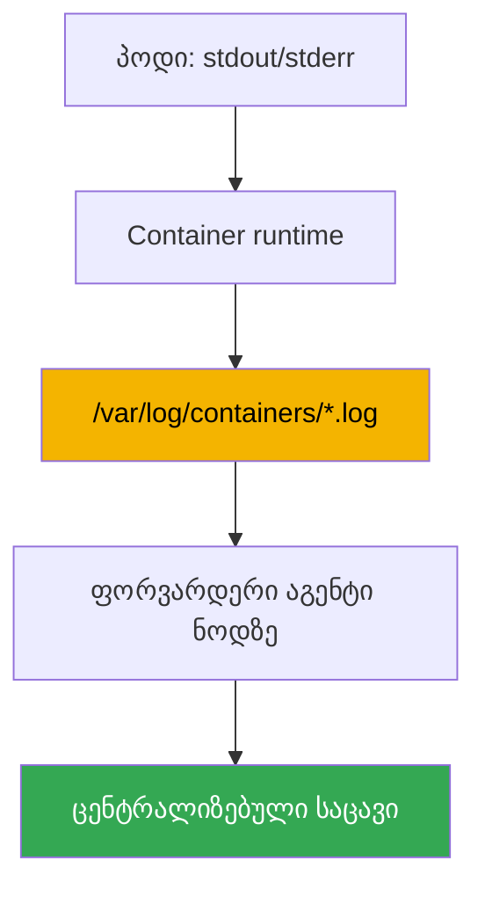
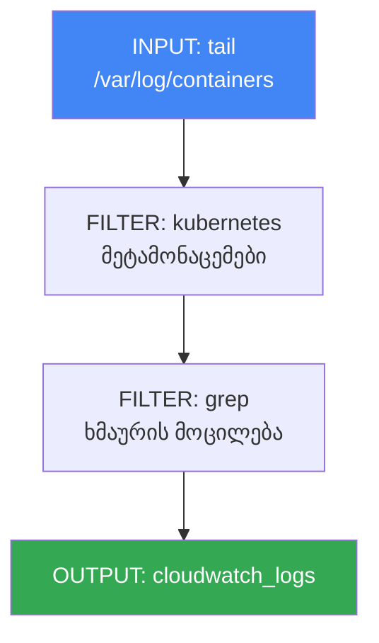

[Русская версия](ru.md) · [Eng version](en.md) · [Versión en español](es.md) · [Version française](fr.md) · [Deutsche Version](de.md) · [繁體中文版](tw.md) · [日本語版](jp.md)
# თავი 34. ლოგები: Fluent Bit, CloudWatch Logs, OpenSearch, ხარჯების კონტროლი

> **რა არის შემდეგ.** 33-ე თავში განხილული იყო მეტრიკები - ნოდებისა და პოდების დატვირთვის
> რიცხვითი მწკრივები. აქ დაკვირვებადობის მეორე საყრდენს განვიხილავთ: ლოგებს, ანუ ტექსტურ
> ჩანაწერებს იმის შესახებ, თუ რას აკეთებდა აპლიკაცია და რატომ გაითიშა. მეტრიკები პასუხობს
> კითხვას „რამდენი“, ლოგები კი - „კონკრეტულად რა მოხდა“. მომიჯნავე თემები სხვა თავებშია:
> მეტრიკები - თავი 33; მეტრიკების მიხედვით ავტომასშტაბირება (HPA, KEDA) - თავი 35;
> განაწილებული ტრეისინგი ADOT-ისა და X-Ray-ის მეშვეობით - თავი 36; control plane-ის აუდიტი
> (audit log), როგორც უსაფრთხოების ინსტრუმენტი - თავი 21; ზოგადად ხარჯების აღრიცხვა და
> ოპტიმიზაცია - თავი 43. აქ მხოლოდ ერთ საკითხს განვიხილავთ: როგორ გავიტანოთ ლოგები ეფემერული
> ნოდებიდან და პოდებიდან, სად შევინახოთ ისინი და როგორ არ გავკოტრდეთ ამის გამო.

## 34.1. „პოდი თავიდან შეიქმნა - ლოგები გაქრა“

ღამით პოდი გაითიშა, მორიგე ინჟინერი მომხდარის გარკვევას ცდილობს და ლოგების სანახავად ჩვეულ
ბრძანებას იყენებს:

```bash
kubectl logs my-app-7d9f8c6b5-x2k4p
# Error from server (NotFound): pods "my-app-7d9f8c6b5-x2k4p" not found
```

პოდი უკვე აღარ არსებობს. Deployment-მა რეპლიკა ახალი სახელით შექმნა, ხოლო ძველი პოდი,
რომელშიც გათიშვის ლოგები იყო, წაიშალა. ვცდილობთ, მოქმედი პოდის წინა გაშვების ლოგები ვნახოთ:

```bash
kubectl logs my-app-7d9f8c6b5-abcde --previous
# Error from server (BadRequest): previous terminated container not found
```

`kubectl logs` აჩვენებს მხოლოდ ცოცხალი პოდის ლოგებს და მაქსიმუმ კონტეინერის ორ გაშვებას:
მიმდინარესა და წინას. პოდის წაშლისთანავე ლოგები საერთოდ ქრება. EKS-ში კი პოდები განსაზღვრებით
ეფემერულია: Deployment მათ განახლებისას თავიდან ქმნის, Karpenter (თავი 12) არასაკმარისად
დატვირთულ ნოდებს კეცავს და დატვირთვები გადააქვს, ნოდთან ერთად კი მის დისკზე შენახული ყველა
ლოგიც ქრება. consolidation-ის დროს ნოდის შეკეცვა ნორმალური ქცევაა და არა გაუმართაობა, თუმცა
მას ლოგების ისტორიაც უხმაუროდ მიაქვს.

შედეგად, ინციდენტის გასარჩევად არაფერი გვაქვს. ახალ EKS-ში არ არის ცენტრალიზებული ადგილი,
სადაც ლოგები პოდისა და ნოდის განადგურებას გადაურჩება - მეტრიკების მსგავსად, ისიც თქვენ უნდა
ააწყოთ. შემდეგ თანმიმდევრულად განვიხილავთ: სად ინახება ლოგები ნოდზე და რატომ არის საჭირო მათი
წინასწარ გატანა; როგორ აკეთებს ამას Fluent Bit; სად უნდა შევინახოთ ისინი; ცალკე - თავად
control plane-ის ლოგები; და როგორ შევაკავოთ ხარჯები, რადგან ყველაზე სწრაფად სწორედ ლოგები
იზრდება.

## 34.2. სად ინახება ლოგები ნოდზე და რატომ არის საჭირო მათი გატანა

Kubernetes-ის კონვენციის თანახმად, აპლიკაცია ლოგებს კონტეინერის შიგნით არსებულ ფაილებში კი
არა, stdout-სა და stderr-ში წერს. შემდეგ ნოდის მექანიზმი მუშაობს: container runtime ამ
ნაკადებს იჭერს და ნოდის დისკზე ფაილებში ინახავს. ისინი პროგნოზირებადად არის განლაგებული:

- `/var/log/pods/<namespace>_<pod>_<uid>/<container>/` - თითოეული კონტეინერის ლოგის ფაილები.
- `/var/log/containers/*.log` - სიმბოლური ბმულები `/var/log/pods`-ის ფაილებზე, სახელებით,
  რომლებშიც pod, namespace და კონტეინერია კოდირებული. სწორედ აქედან იღებს ლოგებს შემგროვებელი.

ფაილები უსასრულოდ არ იზრდება: kubelet მათ როტაციას უკეთებს (ზომის მიხედვით), ძველი სეგმენტები
კი დროთა განმავლობაში იშლება, რათა ნოდის დისკი არ გაივსოს. სწორედ აქ არის 34.1 განყოფილებაში
აღწერილი პრობლემის საფუძველი. ნოდზე არსებული ლოგები დროებითი ბუფერია და არა საცავი. მათი
გაქრობის სამი საფრთხე არსებობს:

- **პოდი წაიშალა** - მისი კატალოგი `/var/log/pods`-იდან იწმინდება;
- **როტაცია** - ძველ ჩანაწერებს ახალი ჩანაწერები ანაცვლებს და გუშინდელი ისტორია ქრება;
- **ნოდი შეიკეცა** - Karpenter-ს ან scale-down-ს მთელი დისკი მიაქვს.

დასკვნა მარტივია: ლოგები ნოდიდან ცენტრალიზებულ საცავში უწყვეტად, პოდის ან ნოდის გაქრობამდე
**უნდა გავიტანოთ**. მათი მომხდარის შემდეგ აღება შეუძლებელია. სწორედ ამ ამოცანას წყვეტს აგენტი,
რომელიც თითოეულ ნოდზე მუშაობს და ახალ სტრიქონებს რეალურ დროში გარე საცავში აგზავნის.



## 34.3. Fluent Bit, როგორც DaemonSet

EKS-ში ფორვარდერი აგენტი თითქმის ყოველთვის **Fluent Bit**-ია, რომელიც DaemonSet-ის სახით
ეშვება: თითო პოდი თითოეულ ნოდზე, რათა მისი ლოკალური ლოგის ფაილები წაიკითხოს. ის ნოდიდან
`/var/log`-ს ამონტაჟებს, `/var/log/containers`-ში ფაილებს აკვირდება, ახალ სტრიქონებს კითხულობს
და მითითებულ დანიშნულებებში აგზავნის.

Fluent Bit არის C-ზე დაწერილი მსუბუქი ლოგების ფორვარდერი: ის ცოტა CPU-სა და მეხსიერებას
ხარჯავს, რაც მნიშვნელოვანია აგენტისთვის, რომელიც თითოეულ ნოდზე მუშაობს და დატვირთვებს
რესურსებს არ უნდა ართმევდეს. მისი უფროსი ნათესავი **Fluentd** Ruby-ზეა დაწერილი, უფრო მეტი
პლაგინი აქვს, მაგრამ მეხსიერების მხრივ საგრძნობლად მძიმეა და ნოდის შემგროვებლის როლისთვის
ჩვეულებრივ ზედმეტია. პრაქტიკაში EKS-ში ნაგულისხმევად Fluent Bit-ს იყენებენ, Fluentd კი, თუ
საერთოდ საჭიროა, გამოყოფილ შრეზე რთული აგრეგაციისთვის რჩება.

AWS მზა იმიჯს ქმნის - **aws-for-fluent-bit**. ეს არის Fluent Bit, რომელშიც AWS-ის სერვისებში
(CloudWatch Logs, Amazon Data Firehose და სხვა) გატანის პლაგინები უკვე ჩაშენებულია და რომლის
ვერსიასაც AWS ტესტავს და აახლებს. მოსახერხებელია სწორედ მისი გამოყენება: საჭირო პლაგინების
მქონე იმიჯის დამოუკიდებლად აწყობა არ არის საჭირო.

შემგროვებლის საკვანძო ფუნქცია **Kubernetes-ის მეტამონაცემებით გამდიდრებაა**. ლოგის ნედლი
სტრიქონი თავისთავად არ გვიჩვენებს, ვის ეკუთვნის ეს ლოგი. Fluent Bit-ის `kubernetes` ფილტრი
ფაილის სახელითა და კლასტერის API-ში მოთხოვნით თითოეულ ჩანაწერს namespace-ს, პოდის სახელს,
კონტეინერის სახელს, labels-სა და annotations-ს უმატებს. ამის გარეშე საერთო ნაკადში კონკრეტული
Deployment-ის ლოგების პოვნა შეუძლებელია.

Fluent Bit-ს ორი გზით აყენებენ:

- **amazon-cloudwatch-observability ადონით** (იგივე ადონი, რომელიც Container Insights-ს
  რთავს, თავი 33). ის მეტრიკებისთვის CloudWatch agent-ს, ლოგებისთვის კი Fluent Bit-ს შლის;
  ყველაფერი managed-ია - ეს ყველაზე მარტივი გზაა, თუ უკვე CloudWatch-ს იყენებთ.
- **ცალკე, საკუთარი Helm chart-ით ან მანიფესტით** - როდესაც Fluent Bit-ის კონფიგურაციაზე
  კონტროლია საჭირო ან დანიშნულება CloudWatch არ არის (OpenSearch, საკუთარი ბეკენდი).

დანიშნულებაში ჩაწერის უფლებებს აგენტი IRSA-ს ან Pod Identity-ის მეშვეობით მის ServiceAccount-
თან მიბმული IAM როლიდან იღებს (თავები 16-17): CloudWatch Logs-ში ან OpenSearch-ში უფლებების
გარეშე გაგზავნა უხმაუროდ შეწყდება, ლოგები კი ნოდზე დაგროვდება და დაიკარგება.

## 34.4. სად შევინახოთ ლოგები: დანიშნულებები

Fluent Bit-ს OUTPUT პლაგინების მეშვეობით სხვადასხვა დანიშნულებაში ჩაწერა შეუძლია. AWS-ის
ეკოსისტემაში არჩევანი ჩვეულებრივ ოთხ ვარიანტს შორის კეთდება.

- **CloudWatch Logs** - AWS-native ლოგების საცავი. ლოგები ნაწილდება **log groups**-ში
  (ჩვეულებრივ თითო ჯგუფი აპლიკაციაზე ან namespace-ზე), მათ შიგნით კი **log streams**-ში
  (ჩვეულებრივ თითო ნაკადი პოდზე ან კონტეინერზე). მოთხოვნები სრულდება **CloudWatch Logs
  Insights**-ში (საკუთარი მოთხოვნების ენა), ალარმებთან და AWS-ის სხვა სერვისებთან ინტეგრაცია
  კი მზაა. პლაგინი - `cloudwatch_logs`.
- **Amazon OpenSearch Service** - მართული OpenSearch (Elasticsearch-ის fork): სრულტექსტიანი
  ძიება, მოქნილი დაფები (OpenSearch Dashboards), რთული ანალიტიკა. ძიებისთვის უფრო მძლავრია,
  მაგრამ ცალკე კლასტერია, რომლის ზომების განსაზღვრა და ნოდების მიხედვით გადახდაა საჭირო -
  უფრო მძიმე და ძვირია. პლაგინი - `opensearch`.
- **Amazon S3** - იაფი არქივი. ლოგები ობიექტების სახით bucket-ში ჩაედინება; ძიება
  ინტერაქტიული არ არის (Athena-ს ან ერთჯერადი ამოტვირთვების მეშვეობით), სამაგიეროდ შენახვა
  ყველაზე იაფია და ცივ კლასებში lifecycle გადასვლებიც არსებობს. კარგია ხანგრძლივი შენახვისა
  და compliance-ისთვის. პლაგინი - `s3`.
- **Amazon Data Firehose** - არა საცავი, არამედ ბუფერი და მარშრუტიზატორი: იღებს ნაკადს,
  აბუფერებს და დანიშნულებებში (S3, OpenSearch, გარე მიმღებები) აწვდის, გზად კი შეკუმშვა და
  გარდაქმნა შეუძლია. მას იყენებენ, როდესაც რამდენიმე ადგილას ერთი მართული კონვეიერია საჭირო.
  პლაგინი - `kinesis_firehose`.

| დანიშნულება | ძლიერი მხარე | სუსტი მხარე | როდის გამოვიყენოთ |
|---|---|---|---|
| CloudWatch Logs | AWS-native, Logs Insights, ალარმები | ძიება OpenSearch-ზე სუსტია | საბაზისო შენახვა და გარჩევა AWS-ში |
| OpenSearch Service | სრულტექსტიანი ძიება, დაფები | ცალკე კლასტერი, უფრო ძვირი | ლოგების რთული ანალიზი და ძიება |
| S3 | ყველაზე იაფი შენახვა, არქივი | ინტერაქტიული ძიება არ აქვს | ხანგრძლივი არქივი, compliance |
| Data Firehose | ბუფერი და მარშრუტიზაცია სხვადასხვა ადგილას | თავად არ ინახავს | ერთიანი კონვეიერი რამდენიმე ადგილას |

დანიშნულებებს აერთიანებენ: ბოლო დღეების ცხელ ლოგებს სწრაფი გარჩევისთვის CloudWatch-ში ან
OpenSearch-ში ინახავენ, სრულ ასლს კი პარალელურად S3-ში აგზავნიან ხანგრძლივი და იაფი
შენახვისთვის.

### საკუთარი ლოგირების სტეკი: Loki და VictoriaLogs

AWS-ის სერვისების გარდა, არსებობს ორი გადაწყვეტა, რომლებსაც ხშირად Grafana-ს გვერდით
კლასტერში აყენებენ, განსაკუთრებით მაშინ, როდესაც მეტრიკებსაც იქვე უყურებენ (თავი 33).

**Grafana Loki** ერთ იდეაზეა აგებული: ტექსტის ნაცვლად მხოლოდ ნაკადის **ჭდეების** ინდექსირება,
როგორც Prometheus-ში. ლოგები chunk-ებად იკუმშება და ობიექტურ საცავში, ანუ S3-ში ინახება,
ინდექსი კი მცირე რჩება - აქედან მოდის იაფი შენახვა. მოთხოვნები სრულდება **LogQL**-ზე, რომლის
სინტაქსიც მეტრიკებიდან ნაცნობია. აქედანვე მოდის მთავარი ხაფანგი, რომელიც 33-ე თავში აღწერილი
კარდინალურობის სიმეტრიულია: ჭდეებს დაბალი კარდინალურობა უნდა ჰქონდეს (namespace, აპლიკაცია,
კონტეინერი), ხოლო `pod`, `request_id` ან `trace_id` ჭდეებში ინდექსსა და წარმადობას ანადგურებს;
მათთვის structured metadata არის განკუთვნილი. ლოგების შეგროვება იგივე Fluent Bit-ით შეიძლება,
Loki-ის მშობლიური აგენტი კი ახლა Grafana Alloy-ია: Promtail მასში გაერთიანდა და მხარდაჭერიდან
მოიხსნა.

**VictoriaLogs** იმავე ეკოსისტემიდანაა, რომლიდანაც VictoriaMetrics: ერთი დამოუკიდებელი ლოგების
მონაცემთა ბაზა, რომელსაც არც წინასწარ განსაზღვრული სქემა და არც ინდექსების გამართვა სჭირდება.
მონაცემებს დისკზე სვეტებად ინახავს, მოთხოვნები სრულდება **LogsQL**-ზე სრულტექსტიანი ძიებით,
მიღებას კი მრავალი პროტოკოლით ახორციელებს, მათ შორის Elasticsearch bulk, Loki push, OTLP და
syslog, ამიტომ მიგრაციისას აგენტების შეცვლა ჩვეულებრივ საჭირო არ არის. არსებობს კლასტერული
ვერსია (`vlinsert`, `vlstorage`, `vlselect`) და Kubernetes-ის ოპერატორი.

| გადაწყვეტა | რას უკეთებს ინდექსირებას | მოთხოვნები | სად ინახება ლოგები | ექსპლუატაცია |
|---|---|---|---|---|
| CloudWatch Logs | ყველაფერს, managed | Logs Insights | AWS-ში | არ არის |
| OpenSearch Service | სრულტექსტიან ინდექსს | DSL, Dashboards | OpenSearch კლასტერში | კლასტერის ზომების განსაზღვრა და განახლებები |
| Loki | მხოლოდ ნაკადის ჭდეებს | LogQL | ობიექტურ საცავში (S3) | Loki-ის კომპონენტები და ჭდეების დისციპლინა |
| VictoriaLogs | სქემა არ სჭირდება | LogsQL | თქვენი ნოდების დისკებზე | მინიმალური კომპონენტები, დისკები თქვენზეა |

არჩევანი ჩვეულებრივ სამ კითხვამდე დაიყვანება. ყველაფერი AWS-შია და მინიმალური ექსპლუატაციაა
საჭირო - CloudWatch, არქივი კი S3-ში. საჭიროა რთული სრულტექსტიანი ძიება და მზა დაფები -
OpenSearch, ცალკე კლასტერის ფასის გათვალისწინებით. დაფები უკვე Grafana-შია და S3-ში იაფი
შენახვა გსურთ - Loki, ჭდეების კარდინალურობის გათვალისწინებით. იგივე გსურთ, მაგრამ უფრო მარტივი
ექსპლუატაციითა და ობიექტური საცავის გარეშე - VictoriaLogs. მეტრიკების მსგავსად, საკუთარი
სტეკი უფასო არ არის: AWS-ის ანგარიშის ნაცვლად დისკებით, ნოდებითა და მორიგეობით იხდით
(ხარჯების სტრუქტურა - განყოფილება 34.6 და თავი 43).

## 34.5. EKS control plane-ის ლოგები ცალკე საკითხია

ზემოთ ყველაფერი ნოდებზე არსებული თქვენი დატვირთვების ლოგებს ეხებოდა. კლასტერის მმართველ შრეს,
რომელსაც AWS ემსახურება, საკუთარი ლოგები აქვს და ისინი ცალკე ირთვება. **EKS control plane
logging** დიაგნოსტიკურ და აუდიტის ლოგებს უშუალოდ control plane-იდან თქვენი ანგარიშის
CloudWatch Logs-ში აწვდის. ამას ნოდებთან და Fluent Bit-თან კავშირი არ აქვს: წყარო თავად
მართული control plane-ია.

ხელმისაწვდომია ხუთი ტიპის ლოგი, თითოეული control plane-ის კომპონენტს შეესაბამება:

| ტიპი | რას წერს |
|---|---|
| `api` | Kubernetes API server-ისადმი მიმართვები, მისი გაშვების ალმები |
| `audit` | ვინ, რა და რომელ ობიექტზე გააკეთა კლასტერში - აუდიტის საფუძველი (თავი 21) |
| `authenticator` | IAM-ის მეშვეობით RBAC-ისთვის ავთენტიკაცია, სპეციფიკურია EKS-ისთვის |
| `controllerManager` | მმართველი კონტურების მუშაობა (controller manager) |
| `scheduler` | დამგეგმავის გადაწყვეტილებები პოდების განთავსების შესახებ |

ისინი თითოეული კლასტერისთვის ცალ-ცალკე, თითო ალმის მიხედვით, კონსოლიდან, CLI-დან ან API-დან
ირთვება. ლოგები CloudWatch-ში კლასტერის საერთო ჯგუფში log streams-ის სახით ხვდება. `audit`
ტიპი სწორედ ის წყაროა, რომლითაც შეიძლება გაირკვეს, „ვინ წაშალა Deployment“, და საეჭვო
აქტივობა გამოვლინდეს; მისი გამოყენება დეტალურად 21-ე თავშია განხილული. აქ ერთი რამ უნდა
დავიმახსოვროთ: ეს მმართველი შრის და არა პოდების ლოგებია, მათ ingestion-სა და CloudWatch-ში
შენახვაშიც იხდით - ამიტომ გააზრებულად უნდა ჩართოთ.

```bash
# არსებულ კლასტერში control plane-ის ლოგების საჭირო ტიპების ჩართვა
aws eks update-cluster-config --name my-cluster \
  --logging '{"clusterLogging":[{"types":["api","audit","authenticator"],"enabled":true}]}'
```

## 34.6. ლოგების ხარჯების კონტროლი

ლოგები დაკვირვებადობის ყველაზე სწრაფად მზარდი და კონტროლიდან ადვილად გამომავალი ხარჯია.
DEBUG დონეზე მომუშავე ერთ ხმაურიან სერვისს კლასტერის ყველა მეტრიკაზე მეტი მონაცემის გენერირება
შეუძლია. ხარჯი ორი მხრიდან გროვდება და ისინი უნდა განვასხვაოთ:

- **CloudWatch Logs**-ში იხდით **ingestion**-ში (მიღებული მონაცემების მოცულობა) და
  **storage**-ში (შენახული მონაცემების მოცულობა). Ingestion ჩვეულებრივ მთავარი ხარჯია: ყოველი
  მიღებული გიგაბაიტისთვის იხდით, მიუხედავად იმისა, შემდეგ რამდენ ხანს შეინახავთ მას.
- **OpenSearch Service**-ში გადახდის მოდელი სხვაგვარია - იხდით **კლასტერში**: მონაცემთა
  ნოდებში, მათ ტიპსა და რაოდენობაში, დისკებსა და master ნოდებში. ხარჯი მოთხოვნების მოცულობაზე
  თითქმის არ არის დამოკიდებული და მანამდე გრძელდება, სანამ კლასტერი ცოცხალია.

| დანიშნულება | რისთვის იხდით | ეკონომიის მთავარი ბერკეტი |
|---|---|---|
| CloudWatch Logs | ingestion + storage | წყაროში მოცულობის შემცირება, retention |
| OpenSearch Service | კლასტერის ნოდები, დისკები | კლასტერის ზომების შერჩევა, შენახვის მოკლე ვადა |
| S3 | მოცულობის მიხედვით შენახვა | lifecycle ცივ კლასებში |

აქედან გამომდინარეობს პრაქტიკული მეთოდები, ყველაზე ეფექტურიდან დამხმარე მეთოდებამდე:

- **ხმაურის გაგზავნამდე შემცირება.** ყველაზე იაფია ლოგი, რომელიც არ გაგზავნილა. Fluent Bit-ის
  `grep` ფილტრით აშკარად არასაჭირო ჩანაწერებს (health-check-ები, debug სტრიქონები) ჯერ კიდევ
  ნოდზე, ingestion-მდე ყრიან. ეს ყველაზე ძვირ ხარჯს - მიღებულ მოცულობას - ამცირებს.
- **აპლიკაციების ლოგირების დონეების გამართვა.** Fluent Bit-ისა და მრავალი აპლიკაციის
  ნაგულისხმევი დონე INFO-ა და ის უხვ მოცულობას წარმოქმნის; production-ში ხშირად WARN ან ERROR
  საკმარისია. აპლიკაციაში დონის შემცირება ნაკადს უფასოდ, რამდენჯერმე ამცირებს.
- **log groups-ზე retention-ის დაყენება.** ნაგულისხმევად CloudWatch-ში ლოგები სამუდამოდ
  (Never Expire) ინახება და storage უსასრულოდ გროვდება. მოთხოვნების შესაბამისად შენახვის ვადას
  (retention policy) ადგენენ: ოპერატიული ლოგები - კვირებით, აუდიტი - compliance-ის მიხედვით
  უფრო დიდხანს.
- **მაღალი სიხშირის ნაკადების სემპლირება.** ძალიან ხმაურიანი ნაკადებიდან ყველა ჩანაწერის
  ნაცვლად ნაწილს ინახავენ: ტენდენციებისთვის შერჩევაც საკმარისია, მოცულობა კი რამდენჯერმე მცირდება.
- **ცხელი და ცივი ლოგების განცალკევება.** ცხელი ლოგები (საჭიროა სწრაფი ძიება) - CloudWatch-ში
  ან OpenSearch-ში მოკლე ვადით; სრული ასლი - S3-ში ხანგრძლივი და იაფი არქივისთვის. ყველაფერს
  ძვირადღირებულ ცხელ საცავში არ ინახავენ.

```bash
# ჯგუფის ლოგების შენახვის შეზღუდვა 14 დღით, „სამუდამოდ“ შენახვის ნაცვლად
aws logs put-retention-policy \
  --log-group-name /aws/containerinsights/my-cluster/application \
  --retention-in-days 14
```

მთავარი აზრი: ყველაზე იაფია მოცულობის მართვა წყაროში - აპლიკაციისა და Fluent Bit-ის დონეზე -
და არა შენახვის შემდეგ. გაფილტრული გიგაბაიტი არაფერი ღირს, retention კი მხოლოდ უკვე
გადახდილ ingestion-ს ზღუდავს.

## 34.7. როგორ არის მოწყობილი Fluent Bit-ის კონფიგურაცია

Fluent Bit-ის კონფიგურაცია სამი სახის სექციისგან შემდგარი კონვეიერია და მათი გაგება ადონის
მეშვეობით დაყენების შემთხვევაშიც სასარგებლოა, რათა შემგროვებლის ქცევა წაიკითხოთ და შეცვალოთ.
ნაკადი მარცხნიდან მარჯვნივ მიდის: INPUT კითხულობს - FILTER ამუშავებს - OUTPUT აგზავნის.



- **INPUT** - წყარო. `tail` პლაგინი `/var/log/containers/*.log` ფაილებს აკვირდება და ახალ
  სტრიქონებს კითხულობს, პოზიციას კი იმახსოვრებს, რათა ისინი განმეორებით არ გაგზავნოს.
- **FILTER** - ნაკადის დამუშავება. `kubernetes` ჩანაწერებს მეტამონაცემებით (namespace, pod,
  labels) ამდიდრებს; `grep` რეგულარული გამოსახულების მიხედვით ჩანაწერებს ატარებს ან ყრის -
  ამით გაგზავნამდე ხმაურს ამცირებენ (განყოფილება 34.6).
- **OUTPUT** - დანიშნულება. `cloudwatch_logs` CloudWatch Logs-ში წერს, `opensearch` -
  OpenSearch-ში, `s3` და `kinesis_firehose` კი - არქივსა და კონვეიერში. თითოეულს ველების
  საკუთარი ნაკრები აქვს: რეგიონი, log group-ის სახელი, ჯგუფების ავტომატური შექმნა და სხვა.

სტრუქტურულად ერთი ნაკადი ასე გამოიყურება (მნიშვნელობები მაგალითისთვისაა მოცემული):

```text
[INPUT]
    Name              tail
    Path              /var/log/containers/*.log
    multiline.parser  cri, go
    Mem_Buf_Limit     50MB
    storage.type      filesystem
[FILTER]
    Name              kubernetes
    Match             kube.*
    Merge_Log         On
[FILTER]
    Name              grep
    Match             kube.*
    Exclude           log /healthz
[OUTPUT]
    Name              cloudwatch_logs
    Match             kube.*
    region            eu-central-1
    log_group_name    /aws/eks/my-cluster/application
```

`Match` ველი სექციებს ჭდის მიხედვით აკავშირებს: FILTER და OUTPUT იმ ჩანაწერებზე გამოიყენება,
რომელთა ჭდე შაბლონს დაემთხვა. ასე ანაწილებს ერთი კონვეიერი სხვადასხვა ლოგს სხვადასხვა
დანიშნულებაში.

INPUT-ის კიდევ ორი პარამეტრი თავად შემგროვებელს backpressure-ის დროს იცავს - როდესაც
დანიშნულება მიუწვდომელია ან throttling-ს იყენებს (მაგალითად, CloudWatch API ნელა პასუხობს ან
მოთხოვნების ლიმიტს აბრუნებს). მათ გარეშე Fluent Bit მიუღებელ ჩანაწერებს მეხსიერებაში აგროვებს,
იზრდება და OOMKilled-ს იღებს, თან ნოდის ყველა ლოგიც მიაქვს - ზუსტად ის, რისგანაც თავად უნდა
იცავდეს. INPUT `tail`-ის `Mem_Buf_Limit` პარამეტრი ბუფერის მეხსიერებას ზღუდავს: ლიმიტის
მიღწევისას პლაგინი ახალი ფაილების კითხვას წყვეტს, სანამ რიგი არ განიტვირთება - OOM-მდე ზრდის
ნაცვლად. `storage.type filesystem` პარამეტრს ბუფერის ნამატი ნოდის დისკზე გადააქვს (საჭიროა
`storage.path` `SERVICE` სექციაში) და ყველაფერს RAM-ში არ ინახავს: პიკური შეფერხება დანაკარგისა
და OOM-ის გარეშე გადაიტანება. ერთად ისინი გაგზავნის შეფერხებას აგენტის გათიშვად და ლოგების
დაკარგვად კი არა, შენელებად აქცევს.

კონვეიერის ორი პარამეტრი პირდაპირ მოქმედებს ლოგების გარჩევისთვის გამოსადეგობაზე. INPUT
`tail`-ის `multiline.parser` პარამეტრი მრავალსტრიქონიან ჩანაწერებს ერთ ჩანაწერად აერთიანებს:
წინააღმდეგ შემთხვევაში Java-ს ან Python-ის stack trace საცავში ათობით ცალკე სტრიქონად მივა
და მათი უკან გაერთიანება შეუძლებელი იქნება. ჩაშენებული პარსერები (`cri`, `docker`, `go`,
`java`, `python`) ტიპურ შემთხვევებს ფარავს; `cri` თავად container runtime-ის მიერ გაყოფილ
სტრიქონებს აერთიანებს, აპლიკაციის პარსერებს კი მის შემდეგ აყენებენ. `kubernetes` ფილტრის
`Merge_Log On` პარამეტრი `log` ველიდან JSON სტრიქონს ჩანაწერის ცალკეულ ველებად შლის: აპლიკაცია,
რომელიც ლოგებს JSON-ში წერს, სტრუქტურირებული ხდება - შესაძლებელი ხდება მისი ველებით გაფილტვრა
და ძიება, მთლიანი ტექსტის ნაცვლად.

## 34.8. როგორ გამოიყენება ეს production-ში

- **ლოგების შემგროვებელს მეტრიკებთან ერთად აყენებენ.** Fluent Bit-ს, როგორც DaemonSet-ს,
  კლასტერში თავიდანვე აყენებენ, რათა ლოგები პირველივე დღიდან გავიდეს; ყველაზე ხშირად
  amazon-cloudwatch-observability ადონით, Container Insights-თან ერთად.
- **მოცულობის შემცირებას წყაროდან იწყებენ.** აპლიკაციების ლოგირების დონეები და Fluent Bit-ის
  `grep` ფილტრები ხარჯის მართვის პირველი ბერკეტია; საცავში მომხდარის შემდეგ გაფილტვრისას
  ღირებულება უკვე გადახდილია.
- **retention თითოეულ log group-ზე გააზრებულად დგინდება.** ნაგულისხმევი „სამუდამოდ შენახვა“
  მზარდი ანგარიშის ტიპური მიზეზია; ოპერატიული ლოგებისთვის კვირებს ადგენენ, აუდიტისთვის კი -
  compliance-ით მოთხოვნილ ვადას.
- **ცხელ და ცივ მონაცემებს აცალკევებენ.** სწრაფი ძიება - CloudWatch-ში ან OpenSearch-ში მოკლე
  ვადით, სრული ასლი - S3-ში იაფი არქივისთვის; ყველაფერს ცხელ საცავში იშვიათად ინახავენ.
- **OpenSearch-ს მაშინ იყენებენ, როდესაც ძიება ამად ღირს.** ეს ცალკე კლასტერი, საექსპლუატაციო
  და გადასახდელი რესურსია; საბაზისო გარჩევისთვის CloudWatch Logs Insights საკმარისია.
- **control plane-ის ლოგებს შერჩევით რთავენ.** `audit` და `authenticator` უსაფრთხოებისა და
  წვდომის გარჩევისთვისაა (თავი 21) და არა პრინციპით „ხუთივე ყოველი შემთხვევისთვის“: თითოეული
  ტიპი ingestion-ს ზრდის.

## 34.9. მინი-ლექსიკონი

- **stdout/stderr** - კონტეინერის გამომავალი სტანდარტული ნაკადები; Kubernetes-ის კონვენციის
  მიხედვით, აპლიკაცია ლოგებს იქ წერს და არა კონტეინერის შიგნით არსებულ ფაილებში.
- **/var/log/containers** - ნოდზე არსებული კატალოგი კონტეინერების ლოგის ფაილებზე ბმულებით;
  ადგილი, საიდანაც შემგროვებელი ლოგებს იღებს.
- **Fluent Bit** - C-ზე დაწერილი მსუბუქი ლოგების ფორვარდერი, რომელიც თითოეულ ნოდზე
  DaemonSet-ის სახით ეშვება; კითხულობს ლოგის ფაილებს, ამდიდრებს და დანიშნულებებში აგზავნის.
- **aws-for-fluent-bit** - AWS-ის მიერ აწყობილი Fluent Bit-ის იმიჯი, AWS-ის სერვისებში
  გატანის ჩაშენებული პლაგინებით.
- **kubernetes ფილტრი** - Fluent Bit-ის FILTER, რომელიც ჩანაწერებს namespace-ს, pod-ს,
  კონტეინერს, labels-სა და annotations-ს უმატებს.
- **CloudWatch Logs** - AWS-ის ლოგების საცავი; log groups და log streams, მოთხოვნები Logs
  Insights-ის მეშვეობით, გადახდა ingestion-სა და storage-ში.
- **log group / log stream** - CloudWatch Logs-ში ჯგუფი (ჩვეულებრივ აპლიკაციაზე) და მის
  შიგნით ნაკადი (ჩვეულებრივ პოდზე).
- **OpenSearch Service** - მართული OpenSearch სრულტექსტიანი ძიებისა და დაფებისთვის; გადახდა
  კლასტერში (ნოდებში).
- **Data Firehose** - მართული ბუფერი და ნაკადების მარშრუტიზატორი S3-ში, OpenSearch-სა და სხვა
  დანიშნულებებში.
- **control plane logging** - EKS-ის მმართველი შრის ლოგების (`api`, `audit`, `authenticator`,
  `controllerManager`, `scheduler`) CloudWatch Logs-ში მიწოდება.
- **retention policy** - log group-ში ლოგების შენახვის ვადა, რომლის გასვლის შემდეგ ჩანაწერები
  იშლება; ნაგულისხმევად ლოგების ვადა არ იწურება.
- **INPUT / FILTER / OUTPUT** - Fluent Bit-ის კონვეიერის სამი სახის სექცია: წაკითხვა,
  დამუშავება, გაგზავნა.
- **Grafana Loki** - ლოგების საცავი, რომელიც მხოლოდ ნაკადის ჭდეებს უკეთებს ინდექსირებას;
  ლოგები ობიექტურ საცავში chunk-ებად არის შეკუმშული, მოთხოვნები სრულდება LogQL-ზე. ჭდეებს
  დაბალი კარდინალურობა უნდა ჰქონდეს, მაღალი კარდინალურობისთვის structured metadata არსებობს;
  მშობლიური აგენტია Grafana Alloy (Promtail მასში გაერთიანდა).
- **VictoriaLogs** - დამოუკიდებელი ლოგების მონაცემთა ბაზა სქემისა და ინდექსების გამართვის
  გარეშე; დისკზე სვეტური შენახვა, მოთხოვნები LogsQL-ზე, მიღება Elasticsearch bulk, Loki push,
  OTLP და syslog პროტოკოლებით; არსებობს კლასტერული ვარიანტი (`vlinsert`, `vlstorage`,
  `vlselect`).

## 34.10. თავის შეჯამება

- `kubectl logs` მხოლოდ ცოცხალი პოდისთვის და მაქსიმუმ მიმდინარე და წინა გაშვებისთვის მუშაობს;
  პოდის წაშლის ან ნოდის შეკეცვის შემდეგ ლოგები მათთან ერთად ქრება.
- კონტეინერების ლოგები ნოდზე `/var/log/pods`-სა და `/var/log/containers`-ში ინახება, kubelet
  მათ როტაციას უკეთებს და შლის; ეს დროებითი ბუფერია და არა საცავი, ამიტომ ლოგები უწყვეტად უნდა
  გავიტანოთ.
- ლოგები გააქვს Fluent Bit-ს - მსუბუქ ფორვარდერს, რომელიც თითოეულ ნოდზე DaemonSet-ის სახით
  მუშაობს; aws-for-fluent-bit იმიჯს ჩაშენებული AWS პლაგინები აქვს, `kubernetes` ფილტრი
  Kubernetes-ის მეტამონაცემებით ამდიდრებს, უფლებები კი IRSA-ს ან Pod Identity-ის მეშვეობით
  გაიცემა.
- Fluent Bit ყენდება amazon-cloudwatch-observability ადონით (Container Insights-თან ერთად) ან
  ცალკე Helm chart-ით, როდესაც კონტროლი ან სხვა დანიშნულებაა საჭირო.
- დანიშნულებები: CloudWatch Logs (AWS-native, Logs Insights), OpenSearch Service (ძიება და
  დაფები, უფრო ძვირი), S3 (იაფი არქივი), Data Firehose (ბუფერი და მარშრუტიზაცია).
- control plane-ის ლოგები (`api`, `audit`, `authenticator`, `controllerManager`, `scheduler`)
  ცალკე ირთვება და CloudWatch-ში მიდის; ეს მმართველი შრის და არა პოდების ლოგებია, `audit` კი
  აუდიტის საფუძველია (თავი 21).
- ხარჯების კონტროლი: გაგზავნამდე ხმაურის შემცირება `grep` ფილტრით, ლოგირების დონეების დაწევა,
  log groups-ზე retention-ის დაყენება, სემპლირება, ცხელი და ცივი ლოგების განცალკევება. ყველაზე
  იაფია მოცულობის წყაროში მართვა.
- Fluent Bit-ის კონფიგურაცია არის INPUT (tail) - FILTER (kubernetes, grep) - OUTPUT
  (cloudwatch_logs, opensearch და სხვა) კონვეიერი, სექციებს კი ჭდის მიხედვით `Match` ველი
  აკავშირებს.

## 34.11. როგორ გამოგადგებათ ეს რეალურ მუშაობაში

მორიგეობისას ლოგები ინციდენტის დროს, მეტრიკების შემდეგ, სიმართლის მეორე წყაროა: მეტრიკა
გვიჩვენებს, რომ პოდმა OOMKilled მიიღო, ლოგი კი გვეტყვის, კონკრეტულად რომელ ოპერაციაზე მოხდა
ეს. განსხვავება ისაა, რომ გათიშული პოდის ლოგი მხოლოდ მაშინ მოიძებნება, თუ ის წინასწარ იყო
გატანილი. ამიტომ Fluent Bit და სულ მცირე ერთი დანიშნულება პირველ სერიოზულ ინციდენტამდე უნდა
იყოს გამართული: წაშლილი პოდიდან ლოგების ამოღება შეუძლებელია. ცოდნა იმისა, თუ სად მიედინება
ლოგები კლასტერში - CloudWatch-ში, OpenSearch-ში თუ S3-ში - ღამის სამ საათზე მაშინვე გიჩვენებთ,
სად ეძებოთ ისინი, namespace-ისა და pod-ის მიხედვით გაფილტვრა კი წუთებს ზოგავს.

დაგეგმვისას ლოგები უპირველესად ფულისა და მოცულობის საკითხია. DEBUG დონეზე ყველაფრის შეგროვება
და სამუდამოდ შენახვა სწრაფი გზაა ისეთი ანგარიშის მისაღებად, რომელშიც ლოგები თავად კლასტერზე
ძვირი ღირს. ამიტომ წინასწარ წყვეტენ, რა შეაგროვონ, რომელ დონეზე, სად და რამდენი ხნით: ცხელი
მონაცემები - ძვირ საცავში კვირებით, არქივი - S3-ში, ხმაური - ჯერ კიდევ ნოდზე იშლება. ეს
გადაწყვეტილება ლოგირების გამართვისას ერთხელ მიიღება, შემდეგ კი ხარჯების გარჩევასთან ერთად
გადაიხედება (თავი 43).

## 34.12. კითხვები თვითშემოწმებისთვის

1. რატომ ვერ აჩვენებს `kubectl logs` გათიშული და თავიდან შექმნილი პოდის ლოგებს?
2. როგორ უკავშირდება Karpenter-ის მიერ ნოდის შეკეცვა ლოგების დაკარგვას და რატომ არის ეს
   ნორმალური ქცევა?
3. სად ინახავს container runtime კონტეინერების stdout/stderr-ს ნოდზე და რა უკეთებს მათ
   როტაციას?
4. რატომ უნდა გავიტანოთ ლოგები ნოდიდან უწყვეტად და არა ინციდენტის გარჩევისას?
5. რატომ ეშვება Fluent Bit სწორედ DaemonSet-ის სახით და რას ამონტაჟებს ის ნოდიდან?
6. რით განსხვავდება Fluent Bit Fluentd-სგან და რატომ იყენებენ EKS-ში ნაგულისხმევად პირველს?
7. რას გვაძლევს aws-for-fluent-bit იმიჯი და რას აკეთებს `kubernetes` ფილტრი?
8. რა ორი გზით ყენდება Fluent Bit და როგორ იღებს ის დანიშნულებაში ჩაწერის უფლებებს?
9. რით განსხვავდება CloudWatch Logs, OpenSearch Service, S3 და Data Firehose, როგორც
   დანიშნულებები?
10. რით განსხვავდება control plane-ის ლოგები პოდების ლოგებისგან და რომელი ხუთი ტიპია
    ხელმისაწვდომი?
11. რისგან შედგება CloudWatch Logs-ის ღირებულება და რით განსხვავდება OpenSearch-ის მოდელი?
12. რომელი მეთოდები ამცირებს ლოგების ხარჯს და რატომ არის მოცულობის წყაროში შემცირება ყველაზე
    მომგებიანი?
13. რომელი სექციებისგან შედგება Fluent Bit-ის კონვეიერი და როგორ აკავშირებს მათ `Match` ველი?
14. რას უკეთებს Loki ინდექსირებას და რატომ არის `pod` ან `request_id` ჭდეებში ცუდი იდეა?
15. რით განსხვავდება VictoriaLogs Loki-ისგან შენახვისა და გამართვის მოთხოვნების მხრივ?
16. ლოგებს Grafana-ში უყურებთ, შენახვა კი იაფად და დიდხანს გჭირდებათ. რომელი ორი ვარიანტი
    არსებობს და რით იხდით?

## პრაქტიკა

ამ თემის შესაბამისი კურსის ლაბა: [ლაბა 115 - ლოგირება: Fluent Bit CloudWatch Logs-ში,
გაფილტვრა და retention](../../labs/115/README_GE.MD). გარდა ამისა, ლოგირების მდგომარეობის
შემოწმება ცოცხალ კლასტერშიც მარტივია. ჯერ გაიმეორეთ საწყისი პრობლემა და ნახეთ, საერთოდ რას
აბრუნებს `kubectl logs`:

```bash
# ცოცხალი პოდისა და კონტეინერის წინა გაშვების ლოგები
kubectl logs deploy/my-app
kubectl logs deploy/my-app --previous
```

შეამოწმეთ, არის თუ არა კლასტერში ლოგების შემგროვებელი - Fluent Bit, როგორც DaemonSet:

```bash
# Fluent Bit DaemonSet და CloudWatch agent (amazon-cloudwatch-observability ადონი)
kubectl get ds -n amazon-cloudwatch
kubectl get pods -n amazon-cloudwatch -o wide
```

ნახეთ, რომელი log groups არის უკვე შექმნილი და შენახვის რა ვადები აქვს მათ - ეს მოცულობისა და
ხარჯების პირდაპირი მაჩვენებელია:

```bash
# ლოგების ჯგუფები და მათი retention (სვეტი retentionInDays; ცარიელია = სამუდამოდ შენახვა)
aws logs describe-log-groups \
  --query "logGroups[].[logGroupName,retentionInDays]" --output table
```

ბოლოს შეამოწმეთ, ჩართულია თუ არა control plane-ის ლოგები და კონკრეტულად რომელი ტიპები:

```bash
# კლასტერის control plane-ის ლოგირების კონფიგურაცია
aws eks describe-cluster --name my-cluster \
  --query "cluster.logging.clusterLogging" --output json
```

შეაჯერეთ სურათი: გადის თუ არა პოდების ლოგები (არის თუ არა Fluent Bit), სად მიდის ისინი,
დაყენებულია თუ არა ჯგუფებზე retention და control plane-ის ზედმეტი ტიპები ხომ არ არის ჩართული.
ხარვეზები დაკარგულ ლოგებს ნიშნავს, ხოლო retention-ის გარეშე „სამუდამო“ შენახვა - მზარდ
ანგარიშს; ორივე ინციდენტამდე და ხარჯების მომდევნო გარჩევამდე უნდა გამოსწორდეს.

---
[სარჩევი](../README_GE.md) · [თავი 33](../33/ge.md) · [თავი 35](../35/ge.md)
