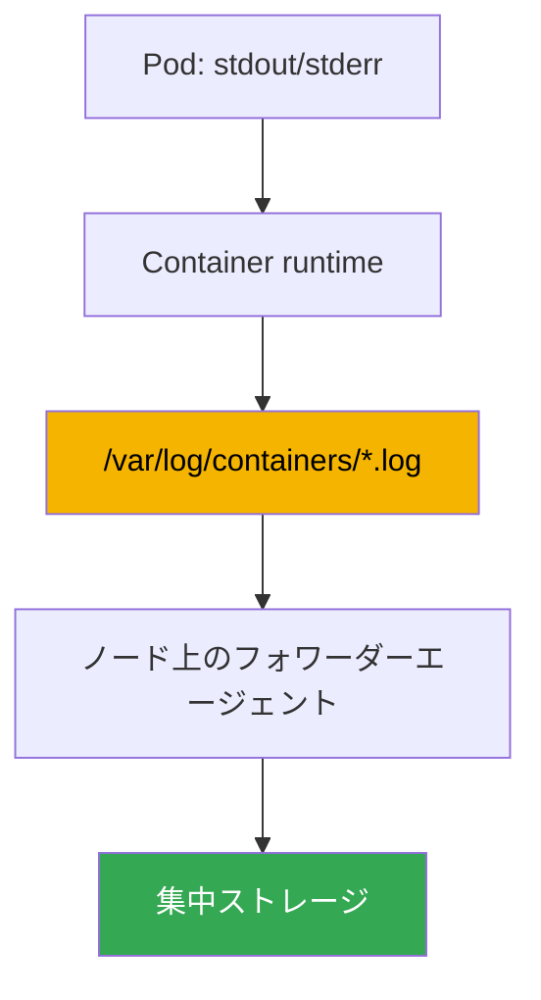
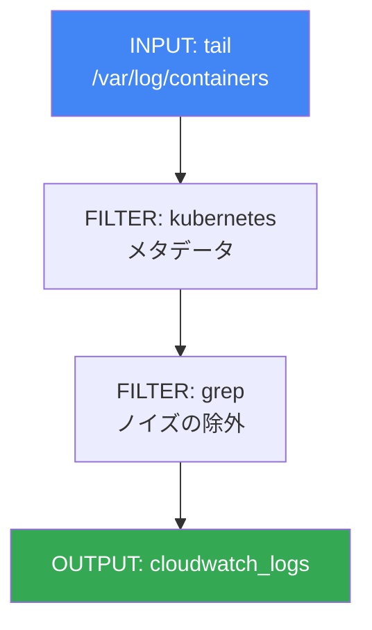

[Eng version](en.md) · [Versión en español](es.md) · [Version française](fr.md) · [Deutsche Version](de.md) · [Русская версия](ru.md) · [ქართული ვერსია](ge.md) · [繁體中文版](tw.md)
# 第34章. ログ: Fluent Bit、CloudWatch Logs、OpenSearch、コスト管理

> **次は何か。** 第33章では、ノードと Pod の負荷を表す数値時系列であるメトリクスを扱いました。ここではオブザーバビリティのもう一つの柱、すなわちアプリケーションが何を行い、なぜ停止したのかを示すテキスト記録であるログを扱います。メトリクスは「どれだけ」を、ログは「正確に何が起きたか」を答えます。関連する話題は別の章で扱います。メトリクスは第33章、メトリクスによるオートスケーリング（HPA、KEDA）は第35章、ADOT と X-Ray による分散トレーシングは第36章、セキュリティ手段としての control plane 監査（audit log）は第21章、全般的なコスト把握と最適化は第43章です。この章で扱うのは一つです。エフェメラルなノードと Pod からログを収集し、どこに保存し、コストをどう抑えるかです。

## 34.1. 「Pod は再作成され、ログは消えた」

夜間に Pod が停止しました。オンコール担当者は何が起きたかを確認しようとし、いつものコマンドでログを取得します。

```bash
kubectl logs my-app-7d9f8c6b5-x2k4p
# Error from server (NotFound): pods "my-app-7d9f8c6b5-x2k4p" not found
```

Pod はすでに存在しません。Deployment が新しい名前でレプリカを再作成し、障害時のログを持つ古い Pod は削除されました。稼働中の Pod の前回起動分を見ようとしても、次の結果になります。

```bash
kubectl logs my-app-7d9f8c6b5-abcde --previous
# Error from server (BadRequest): previous terminated container not found
```

`kubectl logs` が表示できるのは生存中の Pod のログだけで、コンテナの実行についても現在と直前の最大2回分です。Pod が削除されると、ログは完全になくなります。さらに EKS の Pod は定義上エフェメラルです。Deployment は更新時に再作成し、Karpenter（第12章）は低負荷のノードを縮退させてワークロードを移動します。ノードとともに、そのディスク上のすべてのログも消えます。consolidation によるノード縮退は障害ではなく通常の動作であり、ログ履歴を静かに持ち去ります。

結論として、インシデントを調査する材料がありません。新しい EKS には、Pod とノードの消滅後もログを残す集中管理場所はありません。メトリクスと同様に、自分で構築します。以降では順に、ログがノードのどこにありなぜ事前に収集すべきか、Fluent Bit が何を行うか、どこに保存するか、control plane 自体のログ、そしてログは特に速く増大するためコストをどう管理するかを説明します。

## 34.2. ノード上のログの場所と、収集が必要な理由

Kubernetes の慣例では、アプリケーションはコンテナ内のファイルではなく stdout と stderr にログを書き込みます。その後はノードの仕組みが動きます。container runtime がこれらのストリームを捕捉し、ノードのディスク上のファイルへ保存します。配置場所は予測可能です。

- `/var/log/pods/<namespace>_<pod>_<uid>/<container>/`: 各コンテナのログファイル。
- `/var/log/containers/*.log`: `/var/log/pods` のファイルへのシンボリックリンク。名前には Pod、namespace、コンテナがエンコードされています。収集ツールがログを取得する場所です。

ファイルは無限に増えません。kubelet はサイズに基づいてローテーションし、ノードのディスクを埋めないよう古いセグメントを時間とともに削除します。ここに 34.1 節の問題の根本があります。ノード上のログは一時バッファであり、ストレージではありません。消失する脅威は3つあります。

- **Pod が削除される**: `/var/log/pods` のそのディレクトリが消去される。
- **ローテーション**: 古い記録が新しい記録で上書きされ、前日の履歴が消える。
- **ノードが縮退される**: Karpenter または scale-down がディスク全体を持ち去る。

結論は単純です。Pod またはノードが消える**前に**、ログをノードから集中ストレージへ継続的に収集しなければなりません。事後に取得できる場所はありません。各ノードで動作し、最新行をリアルタイムに外部へストリーミングするエージェントが、この課題を解決します。



## 34.3. DaemonSet としての Fluent Bit

EKS のフォワーダーエージェントは、ほぼ常に DaemonSet として実行される **Fluent Bit** です。ノードごとに1つの Pod を実行し、そのノードのローカルログファイルを読み取ります。ノードの `/var/log` をマウントし、`/var/log/containers` のファイルを監視して新しい行を読み、設定された送信先へ送ります。

Fluent Bit は C で書かれた軽量ログフォワーダーです。各ノードで実行され、ワークロードのリソースを奪ってはならないエージェントにとって、CPU とメモリの消費が小さいことは重要です。兄貴分の **Fluentd** は Ruby 製でプラグインが豊富ですが、メモリ消費が著しく大きく、通常はノード収集ツールとして過剰です。実際には EKS では Fluent Bit を標準として選び、Fluentd は必要であれば専用レイヤーで複雑な集約を行う用途に残ります。

AWS はすぐに使える **aws-for-fluent-bit** イメージを提供しています。これは AWS サービスへの出力プラグイン（CloudWatch Logs、Amazon Data Firehose など）をすでに組み込んだ Fluent Bit であり、AWS がテストし更新するバージョンです。必要なプラグインを含むイメージを自分でビルドする必要がないため、これを使うと便利です。

収集ツールの重要な機能は、**Kubernetes メタデータによるエンリッチメント**です。生のログ行だけでは、誰のログかがわかりません。Fluent Bit の `kubernetes` フィルターは、ファイル名とクラスター API へのリクエストから、各レコードに namespace、Pod 名、コンテナ名、labels、annotations を追加します。これがなければ、共通ストリームから特定 Deployment のログを探すことはできません。

Fluent Bit の導入方法は2つあります。

- **amazon-cloudwatch-observability add-on**: Container Insights も有効にする同じ add-on（第33章）です。メトリクス用の CloudWatch agent とログ用の Fluent Bit をデプロイし、すべて managed です。すでに CloudWatch を使っている場合は最も簡単な経路です。
- **個別に、独自の Helm chart またはマニフェストで導入**: Fluent Bit 設定を制御したい場合や、送信先が CloudWatch ではない場合（OpenSearch、独自バックエンド）に使います。

エージェントは、IRSA または Pod Identity により ServiceAccount に紐付けた IAM ロールを通じて、送信先への書き込み権限を取得します（第16-17章）。CloudWatch Logs または OpenSearch への権限がなければ送信は静かに失敗し、ログはノード上に蓄積して失われます。

## 34.4. ログの保存先: 送信先

Fluent Bit は OUTPUT プラグインを通じて異なる送信先に書き込めます。AWS エコシステムでは、通常4つから選びます。

- **CloudWatch Logs**: AWS-native のログストレージです。ログは **log groups**（通常はアプリケーションまたは namespace ごとに1グループ）と、その内部の **log streams**（通常は Pod またはコンテナごとに1ストリーム）へ配置されます。クエリは独自のクエリ言語を持つ **CloudWatch Logs Insights** で実行し、alarms や他の AWS サービスともすぐに統合できます。プラグインは `cloudwatch_logs` です。
- **Amazon OpenSearch Service**: managed OpenSearch（Elasticsearch のフォーク）です。全文検索、柔軟なダッシュボード（OpenSearch Dashboards）、複雑な分析を提供します。検索にはより強力ですが、ノードのサイジングと料金支払いが必要な別クラスターであり、重く高価です。プラグインは `opensearch` です。
- **Amazon S3**: 低コストのアーカイブです。ログはバケットへオブジェクトとして送られます。検索は対話的ではなく、Athena または一時的なエクスポートで行いますが、ストレージは最も安価で、ライフサイクルによる低温ストレージクラスへの移行もできます。長期保存と compliance に適しています。プラグインは `s3` です。
- **Amazon Data Firehose**: ストレージではなく、バッファとルーターです。ストリームを受け取り、バッファリングして送信先（S3、OpenSearch、サードパーティの受信側）へ配信し、途中で圧縮できます。複数の場所へ向かう単一の managed パイプラインが必要なときに使います。プラグインは `kinesis_firehose` です。

| 送信先 | 強み | 弱み | 選ぶ場面 |
|---|---|---|---|
| CloudWatch Logs | AWS-native、Logs Insights、alarms | 検索は OpenSearch より弱い | AWS での基本保存と調査 |
| OpenSearch Service | 全文検索、ダッシュボード | 別クラスターで高価 | 高度な分析とログ検索 |
| S3 | 最も安いストレージ、アーカイブ | 対話的検索がない | 長期アーカイブ、compliance |
| Data Firehose | 複数先へのバッファとルーティング | 自身は保存しない | 複数の場所への単一パイプライン |

送信先は組み合わせられます。直近数日のホットログは迅速な調査のため CloudWatch または OpenSearch に置き、完全なコピーを並行して S3 に送って安価に長期保存します。

### 独自のログスタック: Loki と VictoriaLogs

AWS サービス以外では、特にメトリクスも Grafana で見ている場合（第33章）、Grafana とともにクラスターへ導入されることが多い2つのソリューションがあります。

**Grafana Loki** は、Prometheus と同じくストリームの**ラベル**だけをインデックス化し、ログ本文はインデックス化しないという考え方に基づきます。ログは chunk に圧縮されて S3 などのオブジェクトストレージに置かれ、インデックスは小さく保たれるため、安価に保存できます。クエリにはメトリクスの構文にも馴染みがある **LogQL** を使います。第33章の cardinality と対称的な主な落とし穴もあります。ラベルは低 cardinality（namespace、アプリケーション、コンテナ）にすべきであり、ラベルに `pod`、`request_id`、`trace_id` を入れるとインデックスと性能を損ないます。それらには structured metadata を使います。ログは同じ Fluent Bit で収集できます。Loki のネイティブエージェントは現在 Grafana Alloy であり、Promtail はそこへ統合されサポート終了となりました。

**VictoriaLogs** は VictoriaMetrics と同じエコシステムの製品です。事前定義スキーマもインデックス設定も不要な、依存関係のない単一のログデータベースです。データはディスクに列指向で保存され、全文検索を含む **LogsQL** でクエリします。Elasticsearch bulk、Loki push、OTLP、syslog を含む多くのプロトコルで受信できるため、移行時に通常はエージェントを変更する必要がありません。クラスター版（`vlinsert`、`vlstorage`、`vlselect`）と Kubernetes 用 operator があります。

| ソリューション | インデックス化する対象 | クエリ | ログの保存場所 | 運用 |
|---|---|---|---|---|
| CloudWatch Logs | すべて、managed | Logs Insights | AWS | 不要 |
| OpenSearch Service | 全文検索インデックス | DSL、Dashboards | OpenSearch クラスター | クラスターのサイジングとアップグレード |
| Loki | ストリームのラベルのみ | LogQL | オブジェクトストレージ（S3） | Loki コンポーネントとラベルの規律 |
| VictoriaLogs | スキーマ不要 | LogsQL | 自身のノードのディスク | 最小限のコンポーネント、ディスクは自分で管理 |

選択は通常3つの問いに集約されます。すべてを AWS 内に置き、運用を最小限にしたいなら CloudWatch と S3 アーカイブです。高度な全文検索と既成ダッシュボードが必要なら、別クラスターのコストを理解したうえで OpenSearch を選びます。ダッシュボードがすでに Grafana にあり、S3 で安価に保存したいなら Loki ですが、ラベルの cardinality に注意します。同じことをより簡単に運用し、オブジェクトストレージなしで行いたいなら VictoriaLogs です。メトリクスと同様に、独自スタックは無料ではありません。AWS への請求の代わりに、ディスク、ノード、オンコール対応で支払います（コスト構造は34.6節と第43章）。

## 34.5. EKS control plane のログは別物

ここまでの内容は、ノード上で動くワークロードのログについてです。AWS が運用するクラスターの管理層には独自のログがあり、別途有効化します。**EKS control plane logging** は、control plane からの診断ログと監査ログを、アカウントの CloudWatch Logs へ直接配信します。ノードや Fluent Bit は関係しません。ソースは managed control plane 自体です。

利用できるログは5種類で、それぞれが control plane のコンポーネントに対応します。

| 種類 | 記録する内容 |
|---|---|
| `api` | Kubernetes API server への呼び出し、起動フラグ |
| `audit` | クラスター上で誰が何を対象に何をしたか。監査の基礎（第21章） |
| `authenticator` | RBAC のための IAM 認証。EKS 固有 |
| `controllerManager` | 管理ループ（controller manager）の動作 |
| `scheduler` | Pod 配置に関する scheduler の判断 |

これはクラスターごとに個別に、コンソール、CLI、または API から種類単位で有効にします。ログはクラスター共通の group 内で log streams として CloudWatch に届きます。`audit` は「誰が Deployment を削除したか」を調べ、疑わしいアクティビティを検出するためのソースであり、その利用は第21章で詳しく扱います。ここで覚えるべき点は一つです。これは Pod ではなく管理層のログであり、その CloudWatch への ingestion と保存にも料金がかかるため、意識して有効化すべきです。

```bash
# 既存クラスターで必要な control plane ログ種別を有効化する
aws eks update-cluster-config --name my-cluster \
  --logging '{"clusterLogging":[{"types":["api","audit","authenticator"],"enabled":true}]}'
```

## 34.6. ログのコスト管理

ログは、最も急速に増えやすく、最も制御不能になりやすいオブザーバビリティの費目です。DEBUG レベルでおしゃべりなサービス1つが、クラスター全体のメトリクスを合わせたより多くのデータを生成することがあります。コストは2方向から発生するため、区別する必要があります。

- **CloudWatch Logs** は **ingestion**（受け入れたデータ量）と **storage**（保存データ量）に対して課金されます。通常、主な費目は ingestion です。後でどれだけ保存するかにかかわらず、受け入れた各ギガバイトに課金されます。
- **OpenSearch Service** は異なる方式で、**クラスター**に対して課金されます。データノード、その種類と数、ディスク、master ノードが対象です。コストはクエリ量にほぼ依存せず、クラスターが存在する間は継続します。

| 送信先 | 課金対象 | 主な節約手段 |
|---|---|---|
| CloudWatch Logs | ingestion + storage | ソースで量を削減、retention |
| OpenSearch Service | クラスターノード、ディスク | クラスターのサイジング、短い保存期間 |
| S3 | 容量による保存 | 低温クラスへの lifecycle |

実践的な手法を、最も効果的なものから補助的なものまで挙げます。

- **送信前にノイズを削減する。** 送られないログが最も安価です。Fluent Bit の `grep` フィルターで、health-check や debug 行など明らかに不要なものを、ingestion 前にノード上で捨てます。最も高価な費目である受信量を直接減らします。
- **アプリケーションのログレベルを設定する。** Fluent Bit と多くのアプリケーションのデフォルトは INFO であり、多くの量を生成します。production では WARN または ERROR で十分なことが多いです。アプリケーションのレベルを下げると、無料でストリームを何倍も減らせます。
- **log groups に retention を設定する。** デフォルトでは CloudWatch のログは永久（Never Expire）に保存され、storage が際限なく増加します。要件に合わせて保存期間（retention policy）を設定します。運用ログは数週間、監査ログは compliance に従ってより長くします。
- **高頻度のログをサンプリングする。** 非常に大量のストリームでは、すべてではなく一部のレコードを保存します。傾向にはサンプルで十分であり、量は大幅に減ります。
- **ホットログとコールドログを分ける。** 迅速な検索が必要なホットログは CloudWatch または OpenSearch に短期間置き、完全なコピーは S3 に長期の安価なアーカイブとして保存します。すべてを高価なホットストレージに置かないようにします。

```bash
# 「永久」ではなく、log group のログ保持を14日間に制限する
aws logs put-retention-policy \
  --log-group-name /aws/containerinsights/my-cluster/application \
  --retention-in-days 14
```

要点は、事後にストレージを管理するより、アプリケーションと Fluent Bit というソースレベルで量を管理する方が最も安いことです。フィルタリングされたギガバイトは何もコストがかかりません。一方 retention が制限するのは、すでに支払い済みの ingestion だけです。

## 34.7. Fluent Bit の設定の仕組み

Fluent Bit の設定は3種類のセクションからなるパイプラインです。add-on で導入する場合でも、収集ツールの動作を読み取り修正するために理解しておくと有用です。フローは左から右へ進みます。INPUT が読み、FILTER が処理し、OUTPUT が送信します。



- **INPUT**: ソースです。`tail` プラグインが `/var/log/containers/*.log` を監視し、再送しないよう位置を記憶しながら新しい行を読みます。
- **FILTER**: ストリームの処理です。`kubernetes` はレコードをメタデータ（namespace、Pod、labels）でエンリッチし、`grep` は正規表現によってレコードを通過または除外します。これにより送信前のノイズを減らします（34.6節）。
- **OUTPUT**: 送信先です。`cloudwatch_logs` は CloudWatch Logs に、`opensearch` は OpenSearch に、`s3` と `kinesis_firehose` はアーカイブとパイプラインに書き込みます。それぞれにリージョン、log group 名、group の自動作成など固有のフィールドがあります。

構造的には、1つのストリームは次のようになります（値は例です）。

```text
[INPUT]
    Name              tail
    Path              /var/log/containers/*.log
    multiline.parser  cri, go
    Mem_Buf_Limit     50MB
    storage.type      filesystem
[FILTER]
    Name              kubernetes
    Match             kube.*
    Merge_Log         On
[FILTER]
    Name              grep
    Match             kube.*
    Exclude           log /healthz
[OUTPUT]
    Name              cloudwatch_logs
    Match             kube.*
    region            eu-central-1
    log_group_name    /aws/eks/my-cluster/application
```

`Match` フィールドはタグでセクションを関連付けます。FILTER と OUTPUT は、タグがパターンに一致するレコードに適用されます。これにより、1つのパイプラインで異なるログを異なる送信先へ振り分けられます。

さらに INPUT の2つのオプションが、送信先が利用不能または throttling しているときの backpressure から収集ツール自身を守ります。たとえば CloudWatch API の応答が遅い、またはリクエスト制限を返す場合です。これらがないと Fluent Bit は未受理のレコードをメモリに蓄積して肥大化し、OOMKilled になります。すると保護すべきノードのすべてのログとともに消えます。INPUT `tail` の `Mem_Buf_Limit` はバッファ用メモリを制限します。上限に達すると、キューが解消されるまでプラグインは新しいファイルの読み取りを停止し、OOM まで増加するのを防ぎます。`storage.type filesystem` は、バッファのあふれを RAM に保持せずノードディスクへ移します。このためには `SERVICE` セクションの `storage.path` が必要です。ピーク時の滞留を、損失や OOM なしに乗り切れます。これらを併用すると、送信失敗はエージェントの停止とログ損失ではなく、処理の遅延になります。

パイプラインの2つのオプションは、ログを調査に使えるかどうかに直接影響します。INPUT `tail` の `multiline.parser` は複数行レコードを1つに結合します。Java または Python のスタックトレースは、これがなければ多数の別行として届き、ストレージ内で再構成できません。組み込みパーサー（`cri`、`docker`、`go`、`java`、`python`）が典型例をカバーします。`cri` は container runtime 自身が分割した行を結合し、アプリケーション用のパーサーはその後に設定します。`kubernetes` フィルターの `Merge_Log On` は、`log` フィールドの JSON 行をレコードの個別フィールドへ展開します。JSON でログを書くアプリケーションは構造化され、全文ではなくそのフィールドでフィルタリングと検索ができます。

## 34.8. production での適用方法

- **メトリクスと同時にログ収集ツールを導入する。** Fluent Bit を DaemonSet として最初からクラスターに導入し、初日からログを収集します。多くの場合、Container Insights とともに amazon-cloudwatch-observability add-on 1つで行います。
- **量の削減はソースから始める。** アプリケーションのログレベルと Fluent Bit 上の `grep` フィルターが、コストを下げる最初の手段です。ストレージ内で事後にフィルタリングしても、すでに支払い済みです。
- **各 log group の retention を意識して設定する。** デフォルトの「永久保存」は、請求額増加の典型的な原因です。運用ログは数週間、監査ログは compliance に応じた期間にします。
- **ホットとコールドを分離する。** 迅速な検索は短期間の CloudWatch または OpenSearch、完全なコピーは安価な S3 アーカイブに置きます。すべてをホットストレージに保持することは稀です。
- **OpenSearch は検索に見合う場合に選ぶ。** 運用と支払いが必要な独立クラスターです。基本的な調査には CloudWatch Logs Insights で十分です。
- **control plane ログは選択的に有効化する。** `audit` と `authenticator` は、セキュリティとアクセス調査（第21章）のために有効にします。「念のため5種類すべて」ではありません。各種類が ingestion を増やします。

## 34.9. ミニ用語集

- **stdout/stderr**: コンテナの標準出力と標準エラー出力。Kubernetes の慣例では、アプリケーションはコンテナ内のファイルではなくここにログを書きます。
- **/var/log/containers**: コンテナログファイルへのリンクを含むノード上のディレクトリ。収集ツールがログを取得する場所です。
- **Fluent Bit**: C で書かれた軽量ログフォワーダー。各ノードで DaemonSet として実行され、ログファイルを読み、エンリッチして送信先へ送ります。
- **aws-for-fluent-bit**: AWS サービスへ出力するプラグインを組み込んだ、AWS ビルドの Fluent Bit イメージ。
- **kubernetes フィルター**: Fluent Bit の FILTER。レコードに namespace、Pod、コンテナ、labels、annotations を追加します。
- **CloudWatch Logs**: AWS のログストレージ。log groups と log streams、Logs Insights によるクエリがあり、ingestion と storage に課金されます。
- **log group / log stream**: CloudWatch Logs のグループ（通常はアプリケーションごと）と、その内部のストリーム（通常は Pod ごと）。
- **OpenSearch Service**: 全文検索とダッシュボードのための managed OpenSearch。クラスター（ノード）に対して課金されます。
- **Data Firehose**: S3、OpenSearch、その他の送信先への managed バッファおよびストリームルーター。
- **control plane logging**: EKS の管理層ログ（`api`、`audit`、`authenticator`、`controllerManager`、`scheduler`）を CloudWatch Logs へ配信する機能。
- **retention policy**: log group 内のログを保存する期間。経過後にレコードは削除されます。デフォルトではログは失効しません。
- **INPUT / FILTER / OUTPUT**: Fluent Bit パイプラインの3種類のセクション。読み取り、処理、送信をそれぞれ担います。
- **Grafana Loki**: ストリームラベルだけをインデックス化するログストレージ。ログはオブジェクトストレージ内の chunk に圧縮され、LogQL でクエリします。ラベルは低 cardinality にすべきで、高 cardinality には structured metadata があります。ネイティブエージェントは Grafana Alloy であり、Promtail はそこへ統合されています。
- **VictoriaLogs**: スキーマもインデックス設定も不要な依存関係のないログデータベース。ディスクへ列指向で保存し、LogsQL でクエリします。Elasticsearch bulk、Loki push、OTLP、syslog プロトコルで受信でき、クラスター版（`vlinsert`、`vlstorage`、`vlselect`）もあります。

## 34.10. この章のまとめ

- `kubectl logs` が扱えるのは生存中の Pod と、現在および直前の最大2回の実行だけです。Pod の削除またはノードの縮退後、ログはそれらとともに消えます。
- コンテナログはノードの `/var/log/pods` と `/var/log/containers` にあり、kubelet がローテーションして削除します。これはストレージではなく一時バッファのため、ログを継続的に収集する必要があります。
- Fluent Bit は軽量フォワーダーで、各ノード上の DaemonSet としてログを収集します。AWS プラグイン内蔵の aws-for-fluent-bit イメージ、`kubernetes` フィルターによる Kubernetes メタデータのエンリッチメント、IRSA または Pod Identity による権限を使います。
- Fluent Bit は、amazon-cloudwatch-observability add-on（Container Insights と同時）で導入するか、制御や別の送信先が必要な場合は個別の Helm chart で導入します。
- 送信先は CloudWatch Logs（AWS-native、Logs Insights）、OpenSearch Service（検索とダッシュボード、高価）、S3（安価なアーカイブ）、Data Firehose（バッファとルーティング）です。
- control plane ログ（`api`、`audit`、`authenticator`、`controllerManager`、`scheduler`）は個別に有効化して CloudWatch へ送ります。これは Pod ではなく管理層のログであり、`audit` は監査の基礎です（第21章）。
- コスト管理では、送信前に `grep` フィルターでノイズを削り、ログレベルを下げ、log groups に retention を設定し、サンプリングし、ホットログとコールドログを分離します。ソースで量を管理するのが最も安価です。
- Fluent Bit の設定は INPUT（tail）、FILTER（kubernetes、grep）、OUTPUT（cloudwatch_logs、opensearch など）のパイプラインであり、セクションはタグに対する `Match` フィールドで結び付きます。

## 34.11. 実際の業務での役立ち方

オンコールでは、ログはインシデント時のメトリクスに次ぐ第2の事実源です。メトリクスは Pod が OOMKilled になったことを示し、ログはその Pod がどの操作でそうなったかを示します。違いは、停止した Pod のログは事前に収集されていた場合にしか見つからないことです。したがって、最初の重大なインシデントより前に Fluent Bit と少なくとも1つの送信先を導入しておく必要があります。削除済み Pod からログを取り出す場所はありません。クラスターのログが CloudWatch、OpenSearch、S3 のどこへ送られるかを知っていれば、深夜3時に探す場所がすぐにわかり、namespace と Pod によるフィルタリングで時間を節約できます。

計画時、ログはまずコストと量の問題です。DEBUG レベルですべてを収集し永久に保存するのは、ログがクラスター自体より高額な請求になる早道です。そのため事前に、何をどのレベルで、どこに、どの期間収集するかを決めます。ホットログは高価なストレージに数週間、アーカイブは S3、ノイズはノード上で除外します。この判断はログ基盤の導入時に一度行い、第43章のコストレビューとともに見直します。

## 34.12. 自己確認の質問

1. `kubectl logs` が停止し再作成された Pod のログを表示できないのはなぜですか。
2. Karpenter のノード縮退はログ損失とどのように関係し、なぜ通常の動作なのですか。
3. container runtime はコンテナの stdout/stderr をノード上のどこに保存し、何がそれをローテーションしますか。
4. なぜログはインシデント調査時に取得するのではなく、ノードから継続的に収集しなければならないのですか。
5. Fluent Bit を DaemonSet として実行する理由と、ノードから何をマウントするかを説明してください。
6. Fluent Bit と Fluentd はどう異なり、EKS ではなぜ前者を標準として選ぶのですか。
7. aws-for-fluent-bit イメージは何を提供し、`kubernetes` フィルターは何をしますか。
8. Fluent Bit の導入方法は2つありますか。また、送信先への書き込み権限はどのように取得しますか。
9. CloudWatch Logs、OpenSearch Service、S3、Data Firehose は送信先としてどのように異なりますか。
10. control plane のログは Pod ログと何が異なり、利用できる5種類は何ですか。
11. CloudWatch Logs のコストは何から構成され、OpenSearch のモデルはどのように異なりますか。
12. ログ費用を下げる手法には何があり、なぜソースで量を削減するのが最も有利ですか。
13. Fluent Bit のパイプラインはどのセクションで構成され、`Match` フィールドはそれらをどのように結び付けますか。
14. Loki は何をインデックス化し、ラベルに `pod` や `request_id` を入れるのが悪い考えなのはなぜですか。
15. VictoriaLogs は保存方法と設定要件において Loki とどう異なりますか。
16. ログを Grafana で見ながら、安価に長期保存する必要があります。どの2つの選択肢があり、何で支払いますか。

## Practice

このテーマのコースラボは、[ラボ115: ロギング: Fluent Bit を CloudWatch Logs に送信、フィルタリング、retention](../../labs/115/README_JP.MD) です。加えて、実行中のクラスターからログ基盤の状態を簡単に確認できます。まず元の問題を再現し、`kubectl logs` が実際に何を返すかを確認します。

```bash
# 生存中の Pod のログと、コンテナの前回実行分のログ
kubectl logs deploy/my-app
kubectl logs deploy/my-app --previous
```

クラスターにログ収集ツール、すなわち DaemonSet としての Fluent Bit があるかを確認します。

```bash
# Fluent Bit と CloudWatch agent の DaemonSet（amazon-cloudwatch-observability add-on）
kubectl get ds -n amazon-cloudwatch
kubectl get pods -n amazon-cloudwatch -o wide
```

すでに作成済みの log groups とそれぞれの保存期間を確認します。これは量とコストの直接的な指標です。

```bash
# log groups と retention（retentionInDays 列。空欄 = 永久保存）
aws logs describe-log-groups \
  --query "logGroups[].[logGroupName,retentionInDays]" --output table
```

最後に、control plane ログが有効か、またどの種類が有効かを確認します。

```bash
# クラスターの control plane ロギング設定
aws eks describe-cluster --name my-cluster \
  --query "cluster.logging.clusterLogging" --output json
```

全体像を照合してください。Pod ログは収集されていますか（Fluent Bit はありますか）。どこへ送られていますか。groups に retention は設定されていますか。不要な control plane ログ種別を有効にしていませんか。欠落はログ損失につながり、retention なしの「永久」保存は請求額を増やします。いずれもインシデントや次回のコストレビューより前に修正します。

---
[目次](../README_JP.md) · [第33章](../33/jp.md) · [第35章](../35/jp.md)
