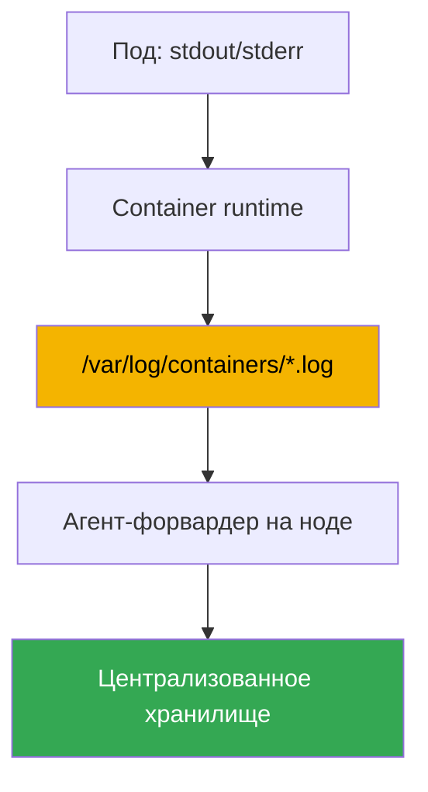
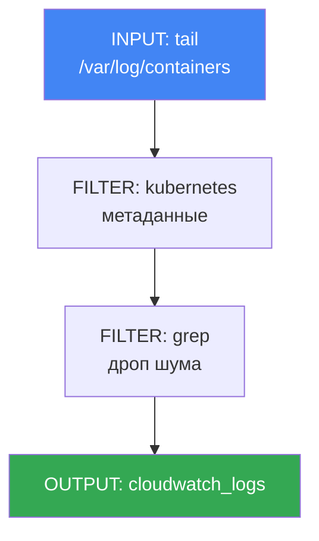

# Глава 34. Логи: Fluent Bit, CloudWatch Logs, OpenSearch, контроль расходов

> **Что дальше.** Глава 33 дала метрики - числовые ряды о загрузке нод и подов. Здесь вторая
> опора наблюдаемости: логи, то есть текстовые записи о том, что делало приложение и почему
> упало. Метрики отвечают «сколько», логи - «что именно случилось». Смежные темы отданы другим
> главам: метрики - глава 33; автомасштабирование по метрикам (HPA, KEDA) - глава 35;
> распределённый трейсинг через ADOT и X-Ray - глава 36; аудит control plane (audit log) как
> инструмент безопасности - глава 21; учёт и оптимизация стоимости в целом - глава 43. Здесь
> одно: как вывезти логи с эфемерных нод и подов, куда их сложить и как не разориться на этом.

## 34.1. «Под пересоздан - логи исчезли»

Ночью упал под, дежурный смотрит, что случилось, и тянется за логами привычной командой:

```bash
kubectl logs my-app-7d9f8c6b5-x2k4p
# Error from server (NotFound): pods "my-app-7d9f8c6b5-x2k4p" not found
```

Пода уже нет. Deployment пересоздал реплику под новым именем, а старый под с логами падения
удалён. Пробуем зайти с предыдущего запуска работающего пода:

```bash
kubectl logs my-app-7d9f8c6b5-abcde --previous
# Error from server (BadRequest): previous terminated container not found
```

`kubectl logs` показывает логи только живого пода и максимум два запуска контейнера: текущий и
предыдущий. Как только под удалён - логов нет вовсе. А в EKS поды эфемерны по определению:
Deployment пересоздаёт их при обновлении, а Karpenter (глава 12) сворачивает недогруженные ноды
и переносит нагрузки, и вместе с нодой исчезают все логи, что лежали на её диске. Сворачивание
ноды при consolidation - штатное поведение, а не сбой, и оно молча уносит историю логов.

Итог: разбирать инцидент нечем. Централизованного места, где логи переживают смерть пода и
ноды, в свежем EKS нет - его, как и метрики, строите вы. Дальше по порядку: где логи живут на
ноде и почему их надо вывозить заранее; чем это делает Fluent Bit; куда складывать; отдельно -
логи самого control plane; и как удержать расходы, потому что логи растут быстрее всего.

## 34.2. Где логи живут на ноде и почему их надо вывозить

Приложение в Kubernetes по конвенции пишет логи в stdout и stderr, а не в файлы внутри
контейнера. Дальше работает механика ноды: container runtime перехватывает эти потоки и
складывает их в файлы на диске ноды. Разложены они предсказуемо:

- `/var/log/pods/<namespace>_<pod>_<uid>/<container>/` - файлы логов по каждому контейнеру.
- `/var/log/containers/*.log` - символические ссылки на файлы из `/var/log/pods`, с именами,
  где закодированы pod, namespace и контейнер. Это и есть точка, откуда логи забирает сборщик.

Файлы не растут бесконечно: kubelet вращает их (ротация по размеру), а старые сегменты со
временем удаляются, чтобы не забить диск ноды. И тут корень проблемы из раздела 34.1. Логи на
ноде - это временный буфер, а не хранилище. У них три угрозы исчезнуть:

- **под удалён** - его каталог в `/var/log/pods` вычищается;
- **ротация** - старые записи затираются новыми, история за вчера пропадает;
- **нода свёрнута** - Karpenter или scale-down уносит весь диск целиком.

Вывод простой: логи надо непрерывно вывозить с ноды в централизованное хранилище **до того**,
как под или нода исчезнут. Забирать их постфактум неоткуда. Именно эту задачу решает агент, что
работает на каждой ноде и стримит свежие строки наружу в реальном времени.



## 34.3. Fluent Bit как DaemonSet

Агент-форвардер в EKS - это почти всегда **Fluent Bit**, запущенный как DaemonSet: по одному
поду на каждую ноду, чтобы читать её локальные файлы логов. Он монтирует `/var/log` с ноды,
следит за файлами в `/var/log/containers`, читает новые строки и отправляет их в заданные
назначения.

Fluent Bit - лёгкий форвардер логов на C: малый расход CPU и памяти, что важно для агента,
который крутится на каждой ноде и не должен отъедать ресурсы у нагрузок. Его старший
родственник **Fluentd** написан на Ruby, богаче плагинами, но заметно тяжелее по памяти и
обычно избыточен для роли нодового сборщика. На практике в EKS по умолчанию берут Fluent Bit, а
Fluentd остаётся для сложной агрегации на выделенном слое, если она вообще нужна.

AWS собирает готовый образ - **aws-for-fluent-bit**. Это Fluent Bit с уже встроенными
плагинами вывода в сервисы AWS (CloudWatch Logs, Amazon Data Firehose и другие) и с версией,
которую AWS тестирует и обновляет. Использовать именно его удобно: не надо самим собирать образ
с нужными плагинами.

Ключевая функция сборщика - **обогащение Kubernetes-метаданными**. Сырая строка лога сама по
себе не говорит, чей это лог. Фильтр `kubernetes` в Fluent Bit по имени файла и запросу к API
кластера добавляет к каждой записи namespace, имя пода, имя контейнера, labels и annotations.
Без этого искать логи конкретного Deployment в общем потоке невозможно.

Ставят Fluent Bit двумя путями:

- **Аддоном amazon-cloudwatch-observability** (тот же, что включает Container Insights, глава
  33). Он разворачивает CloudWatch agent для метрик и Fluent Bit для логов, всё managed - самый
  простой путь, если вы уже в CloudWatch.
- **Отдельно, своим Helm-чартом или манифестом** - когда нужен контроль над конфигурацией
  Fluent Bit или назначение не CloudWatch (OpenSearch, свой бэкенд).

Права на запись в назначение агент получает через роль IAM, привязанную к его ServiceAccount
по IRSA или Pod Identity (главы 16-17): без прав в CloudWatch Logs или OpenSearch отправка
молча не пойдёт, и логи будут копиться и теряться на ноде.

## 34.4. Куда складывать логи: назначения

Fluent Bit умеет писать в разные назначения через OUTPUT-плагины. В экосистеме AWS выбор
обычно между четырьмя.

- **CloudWatch Logs** - AWS-native хранилище логов. Логи раскладываются по **log groups**
  (обычно группа на приложение или namespace) и внутри по **log streams** (обычно поток на под
  или контейнер). Запросы - на **CloudWatch Logs Insights** (свой язык запросов), интеграция с
  алармами и остальными сервисами AWS из коробки. Плагин - `cloudwatch_logs`.
- **Amazon OpenSearch Service** - управляемый OpenSearch (форк Elasticsearch): полнотекстовый
  поиск, гибкие дашборды (OpenSearch Dashboards), сложная аналитика. Мощнее для поиска,
  но это отдельный кластер, который надо сайзить и оплачивать по нодам - тяжелее и дороже.
  Плагин - `opensearch`.
- **Amazon S3** - дешёвый архив. Логи льются объектами в бакет; поиск не интерактивный (через
  Athena или разовые выгрузки), зато хранение самое дешёвое и есть lifecycle-переходы в
  холодные классы. Хорош для долгого хранения и compliance. Плагин - `s3`.
- **Amazon Data Firehose** - не хранилище, а буфер и маршрутизатор: принимает поток, буферизует
  и доставляет в назначения (S3, OpenSearch, сторонние приёмники), по пути умеет сжимать
  и сжимать. Берут, когда нужен один управляемый конвейер в несколько мест. Плагин -
  `kinesis_firehose`.

| Назначение | Сильная сторона | Слабая сторона | Когда брать |
|---|---|---|---|
| CloudWatch Logs | AWS-native, Logs Insights, алармы | поиск слабее OpenSearch | базовое хранение и разбор в AWS |
| OpenSearch Service | полнотекстовый поиск, дашборды | отдельный кластер, дороже | тяжёлый анализ и поиск по логам |
| S3 | самое дешёвое хранение, архив | нет интерактивного поиска | долгий архив, compliance |
| Data Firehose | буфер и маршрутизация в разное | сам не хранит | единый конвейер в несколько мест |

Назначения комбинируют: горячие логи за последние дни - в CloudWatch или OpenSearch для
быстрого разбора, а полную копию параллельно льют в S3 на долгое дешёвое хранение.

## 34.5. Логи control plane EKS - это отдельно

Всё выше - про логи ваших нагрузок, живущие на нодах. У управляющего слоя кластера, который
обслуживает AWS, логи свои, и включаются они отдельно. **EKS control plane logging** доставляет
диагностические и аудит-логи прямо из control plane в CloudWatch Logs вашего аккаунта. Нод и
Fluent Bit это не касается: источник - сам управляемый control plane.

Доступно пять типов логов, каждый соответствует компоненту control plane:

| Тип | Что пишет |
|---|---|
| `api` | обращения к Kubernetes API server, флаги его запуска |
| `audit` | кто, что и над чем делал в кластере - основа аудита (глава 21) |
| `authenticator` | аутентификация по IAM для RBAC, специфична для EKS |
| `controllerManager` | работа управляющих контуров (controller manager) |
| `scheduler` | решения планировщика о размещении подов |

Включают их пофланогово, на каждый кластер отдельно, через консоль, CLI или API. Логи приходят
в CloudWatch как log streams в общую группу кластера. Тип `audit` - тот самый источник для
разбора «кто удалил Deployment» и для детекта подозрительной активности; подробно применение
разбирает глава 21. Здесь важно запомнить одно: это логи управляющего слоя, не подов, и за их
ingestion и хранение в CloudWatch вы тоже платите - включать стоит осознанно.

```bash
# включить нужные типы логов control plane на существующем кластере
aws eks update-cluster-config --name my-cluster \
  --logging '{"clusterLogging":[{"types":["api","audit","authenticator"],"enabled":true}]}'
```

## 34.6. Контроль расходов на логи

Логи - самая быстрорастущая и легко выходящая из-под контроля статья наблюдаемости. Один
болтливый сервис на уровне DEBUG способен генерировать больше данных, чем все метрики кластера
вместе. Стоимость набегает с двух сторон, и их надо различать:

- **CloudWatch Logs** платится за **ingestion** (объём принятых данных) и за **storage**
  (объём хранимых). Ingestion - обычно главная статья: платится за каждый принятый гигабайт,
  сколько бы его потом ни хранили.
- **OpenSearch Service** платится иначе - за **кластер**: за ноды данных, их тип и число, за
  диски и мастер-ноды. Расход почти не зависит от объёма запросов и идёт, пока кластер жив.

| Назначение | За что платится | Главный рычаг экономии |
|---|---|---|
| CloudWatch Logs | ingestion + storage | резать объём в источнике, retention |
| OpenSearch Service | ноды кластера, диски | сайзинг кластера, короткий срок хранения |
| S3 | хранение по объёму | lifecycle в холодные классы |

Отсюда практические приёмы, от самого действенного к вспомогательным:

- **Резать шум до отправки.** Меньше всего платит тот лог, который не отправлен. Фильтром
  `grep` в Fluent Bit отбрасывают заведомо ненужное (health-check'и, debug-строки) ещё на ноде,
  до ingestion. Это бьёт по самой дорогой статье - принятому объёму.
- **Настроить уровни логирования приложений.** Дефолтный уровень Fluent Bit и многих приложений
  - INFO, и он щедро генерирует объём; на проде часто достаточно WARN или ERROR. Снижение
  уровня в приложении сокращает поток в разы бесплатно.
- **Задать retention на log groups.** По умолчанию логи в CloudWatch хранятся вечно (Never
  Expire) и storage копится бесконечно. Ставят срок хранения (retention policy) под требования:
  оперативные логи - недели, аудит - дольше по compliance.
- **Сэмплировать высокочастотное.** Для очень болтливых потоков хранят долю записей, а не все:
  для трендов выборки достаточно, а объём падает кратно.
- **Разделять горячие и холодные логи.** Горячие (нужен быстрый поиск) - в CloudWatch или
  OpenSearch на короткий срок; полную копию - в S3 на долгий дешёвый архив. Не держать всё в
  дорогом горячем хранилище.

```bash
# ограничить хранение логов группы 14 днями вместо «вечно»
aws logs put-retention-policy \
  --log-group-name /aws/containerinsights/my-cluster/application \
  --retention-in-days 14
```

Главная мысль: дешевле всего управлять объёмом в источнике - на уровне приложения и на Fluent
Bit, - а не хранилищем постфактум. Отфильтрованный гигабайт не стоит ничего, retention лишь
ограничивает уже оплаченный ingestion.

## 34.7. Как устроен конфиг Fluent Bit

Конфигурация Fluent Bit - это конвейер из трёх видов секций, и понимать их полезно даже при
установке аддоном, чтобы читать и править поведение сборщика. Поток идёт слева направо: INPUT
читает - FILTER обрабатывает - OUTPUT отправляет.



- **INPUT** - источник. Плагин `tail` следит за файлами `/var/log/containers/*.log` и читает
  новые строки, запоминая позицию, чтобы не слать повторно.
- **FILTER** - обработка потока. `kubernetes` обогащает записи метаданными (namespace, pod,
  labels); `grep` пропускает или отбрасывает записи по регулярному выражению - им режут шум до
  отправки (раздел 34.6).
- **OUTPUT** - назначение. `cloudwatch_logs` пишет в CloudWatch Logs, `opensearch` - в
  OpenSearch, `s3` и `kinesis_firehose` - в архив и в конвейер. У каждого свой набор полей:
  регион, имя log group, автосоздание групп и так далее.

Структурно один поток выглядит так (значения даны для примера):

```text
[INPUT]
    Name              tail
    Path              /var/log/containers/*.log
[FILTER]
    Name              kubernetes
    Match             kube.*
[FILTER]
    Name              grep
    Match             kube.*
    Exclude           log /healthz
[OUTPUT]
    Name              cloudwatch_logs
    Match             kube.*
    region            eu-central-1
    log_group_name    /aws/eks/my-cluster/application
```

Поле `Match` связывает секции по тегу: FILTER и OUTPUT применяются к записям, чей тег совпал с
шаблоном. Так один конвейер разводит разные логи в разные назначения.

## 34.8. Как это применяют в продакшене

- **Сборщик логов ставят вместе с метриками.** Fluent Bit как DaemonSet заводят в кластер
  сразу, чтобы логи вывозились с первого дня; чаще всего одним аддоном
  amazon-cloudwatch-observability вместе с Container Insights.
- **Резать объём начинают в источнике.** Уровни логирования приложений и фильтры `grep` на
  Fluent Bit - первый рычаг стоимости; фильтрация постфактум в хранилище уже оплачена.
- **retention задают на каждой log group осознанно.** «Хранить вечно» по умолчанию - типовая
  причина растущего счёта; оперативным логам ставят недели, аудиту - срок по compliance.
- **Горячее и холодное разделяют.** Быстрый поиск - в CloudWatch или OpenSearch на короткий
  срок, полная копия - в S3 на дешёвый архив; всё в горячем хранилище держат редко.
- **OpenSearch берут, когда поиск того стоит.** Это отдельный кластер под эксплуатацию и
  оплату; для базового разбора хватает CloudWatch Logs Insights.
- **Логи control plane включают выборочно.** `audit` и `authenticator` - для безопасности и
  разбора доступа (глава 21), а не «все пять на всякий случай»: каждый тип добавляет ingestion.

## 34.9. Мини-глоссарий

- **stdout/stderr** - стандартные потоки вывода контейнера; по конвенции Kubernetes приложение
  пишет логи туда, а не в файлы внутри контейнера.
- **/var/log/containers** - каталог на ноде со ссылками на файлы логов контейнеров; точка, из
  которой сборщик забирает логи.
- **Fluent Bit** - лёгкий форвардер логов на C, запускается DaemonSet'ом на каждой ноде;
  читает файлы логов, обогащает и отправляет в назначения.
- **aws-for-fluent-bit** - собранный AWS образ Fluent Bit со встроенными плагинами вывода в
  сервисы AWS.
- **фильтр kubernetes** - FILTER Fluent Bit, добавляющий к записям namespace, pod, контейнер,
  labels и annotations.
- **CloudWatch Logs** - хранилище логов AWS; log groups и log streams, запросы через Logs
  Insights, оплата за ingestion и storage.
- **log group / log stream** - группа (обычно на приложение) и поток внутри неё (обычно на под)
  в CloudWatch Logs.
- **OpenSearch Service** - управляемый OpenSearch для полнотекстового поиска и дашбордов;
  оплата за кластер (ноды).
- **Data Firehose** - управляемый буфер и маршрутизатор потоков в S3, OpenSearch и другие
  назначения.
- **control plane logging** - доставка логов управляющего слоя EKS (`api`, `audit`,
  `authenticator`, `controllerManager`, `scheduler`) в CloudWatch Logs.
- **retention policy** - срок хранения логов в log group, по истечении которого записи
  удаляются; по умолчанию логи не истекают.
- **INPUT / FILTER / OUTPUT** - три вида секций конвейера Fluent Bit: чтение, обработка,
  отправка.

## 34.10. Итоги главы

- `kubectl logs` работает только для живого пода и максимум для текущего и предыдущего запуска;
  после удаления пода или сворачивания ноды логи исчезают вместе с ними.
- Логи контейнеров живут на ноде в `/var/log/pods` и `/var/log/containers`, вращаются kubelet и
  удаляются; это временный буфер, а не хранилище, поэтому логи надо вывозить непрерывно.
- Вывозит логи Fluent Bit - лёгкий форвардер, DaemonSet на каждой ноде; образ
  aws-for-fluent-bit со встроенными AWS-плагинами, обогащение Kubernetes-метаданными фильтром
  `kubernetes`, права через IRSA или Pod Identity.
- Ставится Fluent Bit аддоном amazon-cloudwatch-observability (вместе с Container Insights) или
  отдельно Helm-чартом, когда нужен контроль или иное назначение.
- Назначения: CloudWatch Logs (AWS-native, Logs Insights), OpenSearch Service (поиск и
  дашборды, дороже), S3 (дешёвый архив), Data Firehose (буфер и маршрутизация).
- Логи control plane (`api`, `audit`, `authenticator`, `controllerManager`, `scheduler`)
  включаются отдельно и идут в CloudWatch; это логи управляющего слоя, не подов, `audit` -
  основа аудита (глава 21).
- Контроль расходов: резать шум фильтром `grep` до отправки, снижать уровни логов, ставить
  retention на log groups, сэмплировать, разделять горячие и холодные логи. Дешевле всего
  управлять объёмом в источнике.
- Конфиг Fluent Bit - конвейер INPUT (tail) - FILTER (kubernetes, grep) - OUTPUT
  (cloudwatch_logs, opensearch и другие), секции связаны полем `Match` по тегу.

## 34.11. Как это пригодится в реальной работе

На дежурстве логи - второй после метрик источник правды при инциденте: метрика показывает, что
под словил OOMKilled, а лог говорит, на какой именно операции он это сделал. Разница в том, что
лог упавшего пода найдётся, только если он был вывезен заранее. Поэтому Fluent Bit и хотя бы
одно назначение должны стоять до первого серьёзного инцидента: доставать логи из удалённого
пода неоткуда. Знание, куда в кластере льются логи - в CloudWatch, OpenSearch или S3, - сразу
говорит, где их искать в три часа ночи, а фильтрация по namespace и pod экономит минуты.

При планировании логи - это в первую очередь вопрос денег и объёма. Собирать всё подряд на
уровне DEBUG и хранить вечно - быстрый способ получить счёт, где логи дороже самого кластера.
Поэтому заранее решают, что собирать, на каком уровне, куда и на сколько: горячее - в дорогое
хранилище на недели, архив - в S3, шум - в дроп ещё на ноде. Это решение принимают один раз при
постановке логирования, а пересматривают вместе с разбором стоимости (глава 43).

## 34.12. Вопросы для самопроверки

1. Почему `kubectl logs` не покажет логи упавшего и пересозданного пода?
2. Как сворачивание ноды Karpenter связано с потерей логов и почему это штатное поведение?
3. Куда container runtime складывает stdout/stderr контейнеров на ноде и что их вращает?
4. Почему логи надо вывозить с ноды непрерывно, а не забирать при разборе инцидента?
5. Почему Fluent Bit запускают именно DaemonSet'ом и что он монтирует с ноды?
6. Чем Fluent Bit отличается от Fluentd и почему в EKS по умолчанию берут первый?
7. Что даёт образ aws-for-fluent-bit и что делает фильтр `kubernetes`?
8. Какими двумя путями ставят Fluent Bit и как он получает права на запись в назначение?
9. Чем CloudWatch Logs, OpenSearch Service, S3 и Data Firehose различаются как назначения?
10. Чем логи control plane отличаются от логов подов и какие пять типов доступны?
11. Из чего складывается стоимость CloudWatch Logs и чем модель OpenSearch иначе устроена?
12. Какие приёмы снижают расходы на логи и почему резать объём в источнике выгоднее всего?
13. Из каких секций состоит конвейер Fluent Bit и как поле `Match` связывает их?

## Практика

Своей лабы у главы пока нет, но состояние логирования легко снять на живом кластере. Сначала
воспроизведите исходную боль и посмотрите, что вообще отдаёт `kubectl logs`:

```bash
# логи живого пода и предыдущего запуска контейнера
kubectl logs deploy/my-app
kubectl logs deploy/my-app --previous
```

Проверьте, есть ли в кластере сборщик логов - Fluent Bit как DaemonSet:

```bash
# DaemonSet Fluent Bit и CloudWatch agent (аддон amazon-cloudwatch-observability)
kubectl get ds -n amazon-cloudwatch
kubectl get pods -n amazon-cloudwatch -o wide
```

Посмотрите, какие log groups уже созданы и с какими сроками хранения, - это прямой индикатор
объёма и расходов:

```bash
# группы логов и их retention (столбец retentionInDays; пусто = хранить вечно)
aws logs describe-log-groups \
  --query "logGroups[].[logGroupName,retentionInDays]" --output table
```

Наконец, проверьте, включены ли логи control plane и какие именно типы:

```bash
# конфигурация логирования control plane кластера
aws eks describe-cluster --name my-cluster \
  --query "cluster.logging.clusterLogging" --output json
```

Сопоставьте картину: вывозятся ли логи подов (есть ли Fluent Bit), куда они идут, стоит ли
retention на группах и не включены ли лишние типы логов control plane. Пробелы - потерянные
логи, а «вечное» хранение без retention - растущий счёт; и то и другое чинят до инцидента и до
следующего разбора стоимости.

---
[Оглавление](../README_RU.md) · [Глава 33](../33/ru.md) · [Глава 35](../35/ru.md)
