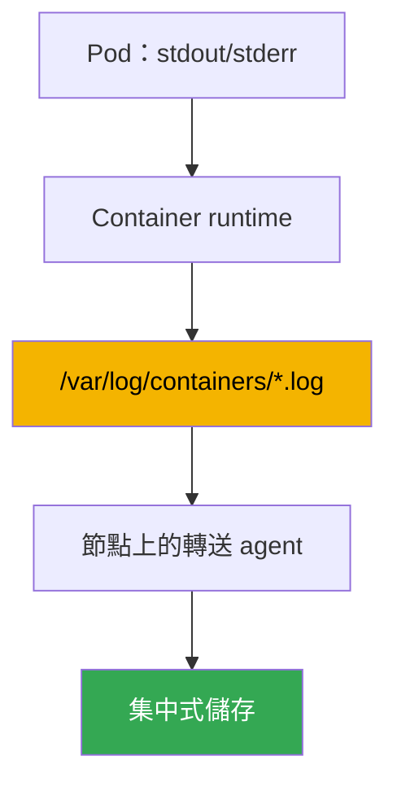
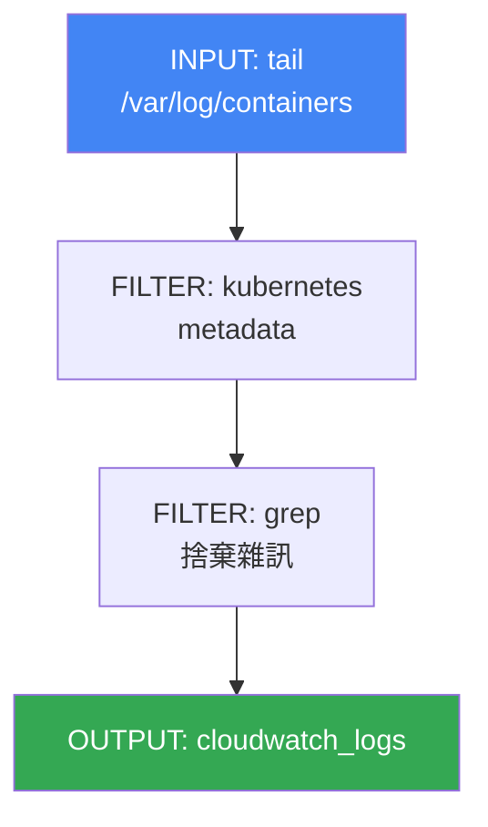

[Русская версия](ru.md) · [Eng version](en.md) · [Versión en español](es.md) · [Version française](fr.md) · [Deutsche Version](de.md) · [ქართული ვერსია](ge.md) · [日本語版](jp.md)
# 第 34 章。日誌：Fluent Bit、CloudWatch Logs、OpenSearch、成本控制

> **接下來。** 第 33 章介紹了指標，也就是節點與 Pod 使用量的數值時間序列。本章是可觀測性的第二個支柱：日誌，也就是應用程式做了什麼、為什麼失敗的文字記錄。指標回答「多少」，日誌回答「究竟發生了什麼」。相關主題由其他章節說明：指標見第 33 章；依指標自動擴展（HPA、KEDA）見第 35 章；透過 ADOT 和 X-Ray 的分散式追蹤見第 36 章；作為安全工具的 control plane 稽核（audit log）見第 21 章；整體成本核算與最佳化見第 43 章。本章只說明一件事：如何從短暫存在的節點與 Pod 匯出日誌、儲存到哪裡，以及如何避免為此付出高昂成本。

## 34.1.「Pod 重建了，日誌消失了」

夜間一個 Pod 失敗，值班人員查看發生了什麼，並用熟悉的指令取得日誌：

```bash
kubectl logs my-app-7d9f8c6b5-x2k4p
# Error from server (NotFound): pods "my-app-7d9f8c6b5-x2k4p" not found
```

Pod 已不存在。Deployment 以新名稱重建了副本，舊 Pod 及其失敗日誌已被刪除。我們嘗試取得目前運作中 Pod 先前執行的日誌：

```bash
kubectl logs my-app-7d9f8c6b5-abcde --previous
# Error from server (BadRequest): previous terminated container not found
```

`kubectl logs` 只會顯示仍存活 Pod 的日誌，且最多只能顯示容器的兩次執行：目前與前一次。Pod 一旦刪除，日誌就完全不存在了。而 EKS 中的 Pod 顧名思義是 ephemeral：Deployment 在更新時重建它們，Karpenter（第 12 章）會收縮負載不足的節點並遷移工作負載，節點消失時，其磁碟上的所有日誌也會一起消失。consolidation 時收縮節點是正常行為，不是故障，而且會悄無聲息地帶走日誌歷史。

結果是沒有任何東西可用於分析事件。新的 EKS 並沒有一個能在 Pod 與節點死亡後仍保留日誌的集中位置，如同指標一樣，必須由你自行建置。以下依序說明：日誌在節點上的位置與為何必須預先匯出；Fluent Bit 如何處理；可儲存到哪裡；control plane 本身的日誌；以及如何控制成本，因為日誌的成長速度最快。

## 34.2. 日誌位於節點何處，以及為何必須匯出

依 Kubernetes 慣例，應用程式將日誌寫入 stdout 與 stderr，而非容器內的檔案。接著由節點的機制處理：container runtime 攔截這些串流並將其寫入節點磁碟的檔案。其配置可預測如下：

- `/var/log/pods/<namespace>_<pod>_<uid>/<container>/`：每個容器的日誌檔案。
- `/var/log/containers/*.log`：指向 `/var/log/pods` 中檔案的 symbolic links，名稱編碼了 Pod、namespace 與容器。這正是收集器取得日誌的位置。

檔案不會無限成長：kubelet 會輪替它們（依大小 rotation），舊區段最後會被刪除，以免填滿節點磁碟。這正是 34.1 節問題的根源。節點上的日誌是暫存緩衝區，不是儲存庫。它們有三種消失威脅：

- **Pod 被刪除**：`/var/log/pods` 中的目錄會被清除；
- **rotation**：舊記錄被新記錄覆寫，昨天的歷史消失；
- **節點被收縮**：Karpenter 或 scale-down 會帶走整個磁碟。

結論很簡單：必須在 Pod 或節點消失**之前**，持續將日誌從節點匯出到集中式儲存。事後無處可取。這正是運行於每個節點、即時將新行送往外部的 agent 所解決的問題。



## 34.3. 作為 DaemonSet 的 Fluent Bit

EKS 中的轉送 agent 幾乎總是以 DaemonSet 啟動的 **Fluent Bit**：每個節點一個 Pod，以讀取其本機日誌檔案。它掛載節點的 `/var/log`，監控 `/var/log/containers` 內的檔案，讀取新行並傳送至指定目的地。

Fluent Bit 是以 C 撰寫的輕量日誌轉送器：CPU 與記憶體消耗很小，這對運行在每個節點且不應搶占工作負載資源的 agent 很重要。它的老大哥 **Fluentd** 以 Ruby 撰寫，外掛更豐富，但記憶體明顯較重，通常不適合僅作為節點收集器。實務上，EKS 預設使用 Fluent Bit；Fluentd 則保留給專用層中的複雜彙總，若確實需要的話。

AWS 提供現成映像檔 **aws-for-fluent-bit**。這是已內建輸出至 AWS 服務（CloudWatch Logs、Amazon Data Firehose 等）的 Fluent Bit，並使用 AWS 測試與更新的版本。使用它很方便：不必自行建置含所需外掛的映像檔。

收集器的關鍵功能是**以 Kubernetes 中繼資料擴充**。原始日誌行本身不會說明它屬於誰。Fluent Bit 的 `kubernetes` filter 透過檔名及對叢集 API 的請求，為每筆記錄新增 namespace、Pod 名稱、container 名稱、labels 與 annotations。沒有這些資料，無法在整個串流中搜尋特定 Deployment 的日誌。

Fluent Bit 有兩種安裝方式：

- **amazon-cloudwatch-observability add-on**（同樣啟用 Container Insights，見第 33 章）。它會部署用於指標的 CloudWatch agent 與用於日誌的 Fluent Bit，全部為 managed；若已使用 CloudWatch，這是最簡單的途徑。
- **獨立使用自己的 Helm chart 或 manifest**：當需要控制 Fluent Bit 設定，或目的地不是 CloudWatch（OpenSearch、自有 backend）時。

agent 透過以 IRSA 或 Pod Identity（第 16 至 17 章）綁定其 ServiceAccount 的 IAM role 取得寫入目的地的權限：若沒有 CloudWatch Logs 或 OpenSearch 權限，傳送不會成功，日誌會在節點上累積並遺失。

## 34.4. 日誌儲存目的地

Fluent Bit 可透過 OUTPUT plugins 寫入不同目的地。在 AWS 生態系中，通常在四種方案中選擇。

- **CloudWatch Logs**：AWS-native 日誌儲存。日誌會放入 **log groups**（通常每個應用程式或 namespace 一個 group），其中再分為 **log streams**（通常每個 Pod 或 container 一個 stream）。使用 **CloudWatch Logs Insights**（自有 query language）查詢，並可直接整合 alarms 與其他 AWS 服務。plugin 為 `cloudwatch_logs`。
- **Amazon OpenSearch Service**：managed OpenSearch（Elasticsearch 的 fork）：全文搜尋、彈性 dashboards（OpenSearch Dashboards）、複雜分析。它更適合搜尋，但這是必須 sizing 並按 nodes 付費的獨立 cluster，較重且較昂貴。plugin 為 `opensearch`。
- **Amazon S3**：低成本 archive。日誌以 objects 寫入 bucket；搜尋不具互動性（透過 Athena 或一次性匯出），但儲存最便宜，並具備移轉至 cold classes 的 lifecycle。適合長期保存與 compliance。plugin 為 `s3`。
- **Amazon Data Firehose**：不是儲存庫，而是 buffer 與 router：接收串流、buffer，並傳遞至目的地（S3、OpenSearch、第三方 receivers），途中可壓縮與轉換。需要一條 managed pipeline 到多個位置時使用。plugin 為 `kinesis_firehose`。

| 目的地 | 優點 | 缺點 | 適用時機 |
|---|---|---|---|
| CloudWatch Logs | AWS-native、Logs Insights、alarms | 搜尋能力弱於 OpenSearch | AWS 中的基本儲存與分析 |
| OpenSearch Service | 全文搜尋、dashboards | 獨立 cluster，較昂貴 | 大量分析與日誌搜尋 |
| S3 | 最低成本的儲存、archive | 沒有互動式搜尋 | 長期 archive、compliance |
| Data Firehose | buffer 與路由至多處 | 本身不儲存 | 通往多處的一條 pipeline |

目的地可以組合：最近數日的 hot logs 放在 CloudWatch 或 OpenSearch 以快速分析，同時將完整副本平行寫入 S3 進行長期低成本保存。

### 自建日誌堆疊：Loki 與 VictoriaLogs

在 AWS 服務之外，還有兩個常與 Grafana 一起部署於叢集的方案，特別是指標已在同一處查看時（第 33 章）。

**Grafana Loki** 的設計理念是：如同 Prometheus，不索引文字本身，只索引串流的 **labels**。日誌會壓縮為 chunks 並存放於 object storage，也就是 S3，索引因此保持很小，帶來低成本儲存。查詢使用語法類似指標的 **LogQL**。這也是與第 33 章 cardinality 相呼應的主要陷阱：labels 必須是低 cardinality（namespace、應用程式、container）；將 `pod`、`request_id` 或 `trace_id` 放在 labels 中會破壞索引與效能，應使用 structured metadata。仍可使用 Fluent Bit 收集日誌，而 Loki 的原生 agent 現為 Grafana Alloy：Promtail 已併入其中並停止支援。

**VictoriaLogs** 與 VictoriaMetrics 屬於同一生態系：一個沒有相依項目的日誌資料庫，無須預先定義 schema 或設定 indexes。它以 columnar 方式將資料儲存於磁碟，使用具全文搜尋功能的 **LogsQL** 查詢，並接受多種 protocols，包括 Elasticsearch bulk、Loki push、OTLP 與 syslog，因此遷移時通常不需要更換 agents。它有 cluster 版本（`vlinsert`、`vlstorage`、`vlselect`）及 Kubernetes operator。

| 解決方案 | 索引什麼 | 查詢 | 日誌位置 | 維運 |
|---|---|---|---|---|
| CloudWatch Logs | 全部，受管 | Logs Insights | AWS | 無 |
| OpenSearch Service | 全文索引 | DSL、Dashboards | OpenSearch 叢集 | 叢集容量規劃與升級 |
| Loki | 僅串流標籤 | LogQL | 物件儲存（S3） | Loki 元件與標籤紀律 |
| VictoriaLogs | 不需要 schema | LogsQL | 你的 nodes 磁碟 | 元件最少，磁碟由你負責 |

選擇通常歸結為三個問題。全部都在 AWS 且希望最少維運，選 CloudWatch，加上 S3 archive。需要高強度全文搜尋與現成 dashboards，選 OpenSearch，但要了解獨立 cluster 的成本。dashboards 已在 Grafana 且想在 S3 低成本儲存，選 Loki，同時注意 label cardinality。想要類似能力但更容易維運且不使用 object storage，選 VictoriaLogs。如同指標，自建堆疊不是免費的：你以磁碟、nodes 與值班取代 AWS 帳單（成本結構見 34.6 節與第 43 章）。

## 34.5. EKS control plane 日誌是獨立的

上述內容都是關於存在節點上的工作負載日誌。由 AWS 維運的叢集管理層有自己的日誌，且需另外啟用。**EKS control plane logging** 會將 control plane 的診斷與 audit logs 直接傳送到你帳戶中的 CloudWatch Logs。這與 nodes 和 Fluent Bit 無關：來源是 managed control plane 本身。

可取得五種類型日誌，各自對應一個 control plane 元件：

| 類型 | 記錄內容 |
|---|---|
| `api` | 對 Kubernetes API server 的呼叫及其啟動 flags |
| `audit` | 誰在叢集上對什麼做了什麼，是 audit 的基礎（第 21 章） |
| `authenticator` | RBAC 的 IAM authentication，EKS 特有 |
| `controllerManager` | 控制迴路（controller manager）的運作 |
| `scheduler` | scheduler 對 Pod placement 的決策 |

它們會針對每個 cluster 個別啟用，可透過 console、CLI 或 API 設定。日誌會以 log streams 送入該 cluster 的共用 CloudWatch group。`audit` 正是分析「誰刪除了 Deployment」及偵測可疑活動的來源；第 21 章會詳細說明其使用方式。本章重要的是記住：這些是管理層日誌，不是 Pod 日誌，而且 CloudWatch 的 ingestion 與儲存也需付費，因此應有意識地啟用。

```bash
# 在既有 cluster 啟用所需 control plane 日誌類型
aws eks update-cluster-config --name my-cluster \
  --logging '{"clusterLogging":[{"types":["api","audit","authenticator"],"enabled":true}]}'
```

## 34.6. 日誌成本控制

日誌是成長最快且最容易失控的可觀測性成本項目。一個以 DEBUG 等級喋喋不休的服務，產生的資料可能比整個叢集的所有指標還多。成本從兩方面累積，必須區分：

- **CloudWatch Logs** 針對 **ingestion**（接收資料量）與 **storage**（保存資料量）收費。Ingestion 通常是主要成本：每接收一 GB 都要付費，不論後續保存多久。
- **OpenSearch Service** 的收費方式不同：按 **cluster** 計費，包括 data nodes、其類型與數量、disks 及 master nodes。費用幾乎不依 query volume 而變，cluster 存在期間就會持續產生。

| 目的地 | 計費項目 | 主要省錢槓桿 |
|---|---|---|
| CloudWatch Logs | ingestion + storage | 在來源端減量、retention |
| OpenSearch Service | cluster nodes、disks | cluster sizing、較短保存期 |
| S3 | 依容量儲存 | lifecycle 移至 cold classes |

以下是從最有效到輔助的實務作法：

- **在傳送前去除雜訊。** 未傳送的日誌成本最低。使用 Fluent Bit 的 `grep` filter 在節點上、ingestion 之前，排除明確不需要的內容（health-checks、debug 行）。這直接減少最昂貴的接收量。
- **設定應用程式日誌等級。** Fluent Bit 與許多應用程式的預設等級是 INFO，會大量產生資料；production 通常只需 WARN 或 ERROR。降低應用程式等級可免費將串流減少數倍。
- **設定 log groups 的 retention。** CloudWatch 預設會永久保存日誌（Never Expire），storage 會無限累積。應依需求設定 retention policy：operation logs 保存數週，audit 依 compliance 要求保存更久。
- **抽樣高頻資料。** 對極度喧鬧的串流，只保存部分記錄而非全部：樣本已足以顯示趨勢，資料量則大幅下降。
- **區分 hot 與 cold logs。** hot logs（需要快速搜尋）短期放在 CloudWatch 或 OpenSearch；完整副本長期放在 S3 作為低成本 archive。不要將所有資料都留在昂貴的 hot storage。

```bash
# 將 group 日誌保存限制為 14 天，而非「永久」
aws logs put-retention-policy \
  --log-group-name /aws/containerinsights/my-cluster/application \
  --retention-in-days 14
```

核心概念是：在來源端，亦即應用程式與 Fluent Bit 層級，管理資料量最便宜，而不是事後依賴儲存。被 filter 掉的一 GB 不需任何費用；retention 只會限制已支付 ingestion 成本的資料。

## 34.7. Fluent Bit 設定的結構

Fluent Bit configuration 是由三種 sections 組成的 pipeline。即使使用 add-on 安裝，也應了解它們，以便讀取及調整收集器行為。串流從左到右：INPUT 讀取，FILTER 處理，OUTPUT 傳送。



- **INPUT**：來源。`tail` plugin 監控 `/var/log/containers/*.log`，讀取新行並記住位置，以免重複傳送。
- **FILTER**：串流處理。`kubernetes` 以 metadata 擴充記錄（namespace、Pod、labels）；`grep` 依 regular expression 允許或排除記錄，用於在傳送前去除雜訊（34.6 節）。
- **OUTPUT**：目的地。`cloudwatch_logs` 寫入 CloudWatch Logs，`opensearch` 寫入 OpenSearch，`s3` 與 `kinesis_firehose` 分別寫入 archive 與 pipeline。每種都有自己的欄位：region、log group 名稱、自動建立 groups 等。

一個串流在結構上如下（值僅為範例）：

```text
[INPUT]
    Name              tail
    Path              /var/log/containers/*.log
    multiline.parser  cri, go
    Mem_Buf_Limit     50MB
    storage.type      filesystem
[FILTER]
    Name              kubernetes
    Match             kube.*
    Merge_Log         On
[FILTER]
    Name              grep
    Match             kube.*
    Exclude           log /healthz
[OUTPUT]
    Name              cloudwatch_logs
    Match             kube.*
    region            eu-central-1
    log_group_name    /aws/eks/my-cluster/application
```

`Match` 欄位以 tag 連接 sections：FILTER 與 OUTPUT 會套用至 tag 符合 pattern 的記錄。因此一條 pipeline 能將不同日誌分流至不同目的地。

另有兩個 INPUT options 可在 backpressure 時保護收集器本身，例如目的地不可用或 throttling（CloudWatch API 回應緩慢或回傳 request limit）。若沒有它們，Fluent Bit 會將未接收記錄累積於記憶體、持續膨脹並遭 OOMKilled，連同節點上的所有日誌一起消失，這正是它應避免的情況。INPUT `tail` 的 `Mem_Buf_Limit` option 限制 buffer 記憶體：達到上限時，plugin 停止讀取新檔案直到 queue 釋放，以避免成長至 OOM。`storage.type filesystem` 則將 buffer overflow 移至節點磁碟（需要 `SERVICE` section 中的 `storage.path`），而非全部保留在 RAM：尖峰壅塞可在不遺失資料且不 OOM 的情況下度過。兩者共同將傳送失敗轉為減速，而非 agent 崩潰及日誌遺失。

pipeline 的兩個 options 直接影響日誌是否適合分析。INPUT `tail` 中的 `multiline.parser` 會將多行記錄合併為一筆：否則 Java 或 Python stack trace 會以十多個獨立行抵達，且無法在儲存庫中重新組合。內建 parsers（`cri`、`docker`、`go`、`java`、`python`）涵蓋常見情境；`cri` 組合被 container runtime 分割的行，應用程式 parsers 隨後套用。`kubernetes` filter 的 `Merge_Log On` option 會將 `log` 欄位的 JSON 行解析為獨立記錄欄位：以 JSON 寫入日誌的應用程式因而成為 structured，能以欄位 filter 與搜尋，而非搜尋整段文字。

## 34.8. 如何在 production 使用

- **日誌收集器與指標一同安裝。** 一開始就將 Fluent Bit 作為 DaemonSet 放入 cluster，讓第一天起就能匯出日誌；最常以 amazon-cloudwatch-observability add-on 與 Container Insights 一起部署。
- **從來源端開始減量。** 應用程式日誌等級及 Fluent Bit 的 `grep` filters 是成本的第一槓桿；在 storage 事後過濾時已支付費用。
- **有意識地為每個 log group 設定 retention。** 預設的「永久保存」是帳單增加的典型原因；operation logs 保存數週，audit 則依 compliance 所需期間保存。
- **區分 hot 與 cold。** 快速搜尋使用短期 CloudWatch 或 OpenSearch，完整副本使用 S3 的低成本 archive；很少會將所有資料都保留在 hot storage。
- **只有在搜尋值得時才選 OpenSearch。** 它是需維運與付費的獨立 cluster；基本分析使用 CloudWatch Logs Insights 已足夠。
- **選擇性啟用 control plane 日誌。** `audit` 與 `authenticator` 用於安全與存取分析（第 21 章），而不是「以防萬一全開五種」：每種類型都會增加 ingestion。

## 34.9. 迷你詞彙表

- **stdout/stderr**：container 的標準輸出串流；依 Kubernetes 慣例，應用程式將日誌寫入此處，而不是 container 內的檔案。
- **/var/log/containers**：節點上含有 container 日誌檔案連結的目錄；收集器由此取得日誌。
- **Fluent Bit**：以 C 撰寫的輕量日誌轉送器，以 DaemonSet 於每個 node 執行；讀取、擴充並將日誌檔案傳送至目的地。
- **aws-for-fluent-bit**：AWS 建置的 Fluent Bit 映像檔，內建輸出至 AWS 服務的 plugins。
- **kubernetes filter**：Fluent Bit FILTER，將 namespace、Pod、container、labels 及 annotations 新增至記錄。
- **CloudWatch Logs**：AWS 日誌儲存庫；log groups 與 log streams，透過 Logs Insights 查詢，針對 ingestion 與 storage 收費。
- **log group / log stream**：CloudWatch Logs 中的 group（通常每個應用程式一個）與其內的 stream（通常每個 Pod 一個）。
- **OpenSearch Service**：用於全文搜尋與 dashboards 的 managed OpenSearch；按 cluster（nodes）付費。
- **Data Firehose**：傳送至 S3、OpenSearch 與其他目的地的 managed buffer 與串流 router。
- **control plane logging**：將 EKS 管理層日誌（`api`、`audit`、`authenticator`、`controllerManager`、`scheduler`）傳送至 CloudWatch Logs。
- **retention policy**：log group 中日誌的保存期，記錄期滿後會刪除；預設日誌不會到期。
- **INPUT / FILTER / OUTPUT**：Fluent Bit pipeline 的三種 sections：讀取、處理、傳送。
- **Grafana Loki**：僅索引串流 labels 的日誌儲存；日誌壓縮為 chunks 並存於 object storage，以 LogQL 查詢。labels 應為低 cardinality，高 cardinality 使用 structured metadata；原生 agent 是 Grafana Alloy（Promtail 已併入其中）。
- **VictoriaLogs**：不含相依項目的日誌資料庫，不需要 schema 與 index 設定；在磁碟上 columnar 儲存、以 LogsQL 查詢，並支援 Elasticsearch bulk、Loki push、OTLP 與 syslog protocols；提供 cluster 版本（`vlinsert`、`vlstorage`、`vlselect`）。

## 34.10. 本章摘要

- `kubectl logs` 僅適用於存活中的 Pod，且最多顯示目前與前一次執行；刪除 Pod 或收縮 node 後，日誌會隨之消失。
- container 日誌位於 node 的 `/var/log/pods` 與 `/var/log/containers`，由 kubelet rotation 並刪除；它是暫存緩衝區而不是 storage，因此必須持續匯出日誌。
- Fluent Bit 是匯出日誌的輕量轉送器，每個 node 上一個 DaemonSet；使用內建 AWS plugins 的 aws-for-fluent-bit 映像檔、以 `kubernetes` filter 擴充 Kubernetes metadata，並透過 IRSA 或 Pod Identity 取得權限。
- 可透過 amazon-cloudwatch-observability add-on（與 Container Insights 一起）或獨立 Helm chart 安裝 Fluent Bit，後者適用於需要控制或不同目的地時。
- 目的地包括：CloudWatch Logs（AWS-native、Logs Insights）、OpenSearch Service（搜尋與 dashboards，成本較高）、S3（低成本 archive）、Data Firehose（buffer 與 routing）。
- control plane 日誌（`api`、`audit`、`authenticator`、`controllerManager`、`scheduler`）需獨立啟用並送至 CloudWatch；它們是管理層而不是 Pod 日誌，`audit` 是 audit 的基礎（第 21 章）。
- 成本控制方式：傳送前以 `grep` filter 去除雜訊、降低日誌等級、設定 log groups retention、抽樣，以及區分 hot 與 cold logs。在來源端控制資料量最便宜。
- Fluent Bit config 是 INPUT（tail）、FILTER（kubernetes、grep）、OUTPUT（cloudwatch_logs、opensearch 等）pipeline；sections 由 tag 的 `Match` 欄位連接。

## 34.11. 如何用於實際工作

值班時，日誌是事件的第二個真相來源，僅次於指標：指標顯示 Pod 遭遇 OOMKilled，而日誌說明它當時正進行哪一項操作。差異在於，只有預先匯出的日誌才能在已失敗 Pod 中找到。因此，在第一次重大事件之前，就必須部署 Fluent Bit 與至少一個目的地：已刪除的 Pod 沒有任何地方可取得日誌。了解 cluster 將日誌寫入 CloudWatch、OpenSearch 還是 S3，可立即知道凌晨三點該去哪裡找；依 namespace 與 Pod filter 可節省數分鐘。

規劃時，日誌首先是金錢與資料量的問題。以 DEBUG 收集所有內容並永久保存，很快就會得到一張日誌成本高於 cluster 本身的帳單。因此，應事先決定收集什麼、使用什麼等級、要送到哪裡以及保存多久：hot data 放在昂貴 storage 數週，archive 放在 S3，雜訊直接在 node 上捨棄。日誌設置時做出一次這項決策，並隨成本分析一同檢討（第 43 章）。

## 34.12. 自我檢查問題

1. 為什麼 `kubectl logs` 不會顯示已失敗並重建的 Pod 日誌？
2. Karpenter 收縮 node 與日誌遺失有何關係，為何這是正常行為？
3. container runtime 在 node 上將 container stdout/stderr 放到哪裡，是誰對它們進行 rotation？
4. 為什麼必須持續從 node 匯出日誌，而不是在事件分析時才取得？
5. 為什麼 Fluent Bit 必須以 DaemonSet 啟動，它從 node 掛載什麼？
6. Fluent Bit 與 Fluentd 有何不同，為何 EKS 預設選擇前者？
7. aws-for-fluent-bit 映像檔提供什麼，`kubernetes` filter 做什麼？
8. 安裝 Fluent Bit 的兩種途徑是什麼，它如何取得寫入目的地的權限？
9. 作為目的地時，CloudWatch Logs、OpenSearch Service、S3 與 Data Firehose 有何差異？
10. control plane 日誌與 Pod 日誌有何不同，可用的五種類型是什麼？
11. CloudWatch Logs 的成本由什麼組成，OpenSearch 的模式有何不同？
12. 什麼作法可降低日誌支出，為何在來源端減量最划算？
13. Fluent Bit pipeline 由哪些 sections 組成，`Match` 欄位如何將它們連接？
14. Loki 索引什麼，為何將 `pod` 或 `request_id` 放在 labels 是壞主意？
15. VictoriaLogs 與 Loki 在 storage 及設定需求方面有何差異？
16. 在 Grafana 查看日誌，且需低成本長期保存。有哪兩種選項，成本付在哪裡？

## 實作

本課程此主題的 lab：[lab 115，日誌記錄：Fluent Bit 至 CloudWatch Logs、filtering 與 retention](../../labs/115/README_TW.MD)。此外，也可以在執行中的 cluster 輕易取得日誌記錄狀態。首先重現原始痛點，並查看 `kubectl logs` 實際提供什麼：

```bash
# 存活 Pod 的日誌與 container 的前一次執行
kubectl logs deploy/my-app
kubectl logs deploy/my-app --previous
```

檢查 cluster 是否有日誌收集器，也就是作為 DaemonSet 的 Fluent Bit：

```bash
# Fluent Bit 與 CloudWatch agent DaemonSet（amazon-cloudwatch-observability add-on）
kubectl get ds -n amazon-cloudwatch
kubectl get pods -n amazon-cloudwatch -o wide
```

查看已建立哪些 log groups 及其保存期限，這是資料量與成本的直接指標：

```bash
# log groups 及其 retention（retentionInDays 欄位；空白 = 永久保存）
aws logs describe-log-groups \
  --query "logGroups[].[logGroupName,retentionInDays]" --output table
```

最後，確認 control plane 日誌是否啟用，以及啟用了哪些類型：

```bash
# cluster 的 control plane logging config
aws eks describe-cluster --name my-cluster \
  --query "cluster.logging.clusterLogging" --output json
```

綜合這些資訊：是否匯出 Pod 日誌（是否有 Fluent Bit）、它們送往哪裡、groups 是否已設定 retention，以及是否啟用了多餘的 control plane 日誌類型。缺口代表遺失的日誌，而未設定 retention 的「永久」保存代表持續增加的帳單；兩者都應在事件發生與下一次成本分析之前修正。

---
[目錄](../README_TW.md) · [第 33 章](../33/tw.md) · [第 35 章](../35/tw.md)
