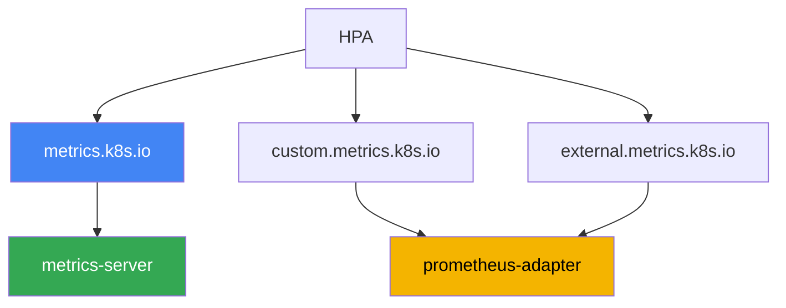
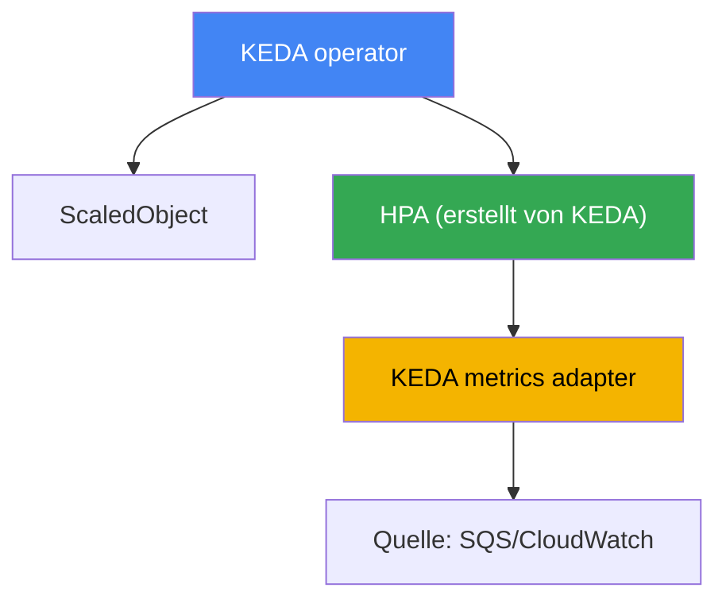

[Eng version](en.md) · [Versión en español](es.md) · [Version française](fr.md) · [Русская версия](ru.md) · [ქართული ვერსია](ge.md) · [繁體中文版](tw.md) · [日本語版](jp.md)
# Kapitel 35. Autoskalierung von Anwendungen: HPA, externe Metriken, KEDA

> **Wie es weitergeht.** Die Kapitel 33 und 34 lieferten Metriken und Logs, die zwei Säulen der Observability. Hier nutzen wir Metriken praktisch: Wir skalieren die Anwendungen selbst, also die Anzahl der Pod-Replikate entsprechend der Last. Verwandte Themen behandeln andere Kapitel: das Skalieren von Nodes für diese Pods (Cluster Autoscaler, Karpenter) in den Kapiteln 11 und 12; die Herkunft der Metriken (metrics-server, Prometheus) in Kapitel 33; das vertikale Sizing eines Pods (requests/limits, VPA) in Kapitel 14; Tracing zum Auffinden von Engpässen in Kapitel 36. Hier geht es um eines: Die Anzahl der Replikate soll der tatsächlichen Last folgen, auch Ereignissen, die ein CPU-basierter HPA nicht erkennt.

## 35.1. „Die Warteschlange wächst, aber die Pods schlafen“

Es gibt einen Warteschlangen-Worker: Pods lesen Nachrichten aus Amazon SQS und verarbeiten sie. Die Anzahl der Replikate ist auf drei festgelegt. Es kommt zu einem Spitzenwert: Producer haben Zehntausende Nachrichten eingestellt. Der Bereitschaftsdienst schaut auf die Warteschlange und die Pods:

```bash
# in der Warteschlange sammeln sich unverarbeitete Nachrichten
aws sqs get-queue-attributes --queue-url "$Q" \
  --attribute-names ApproximateNumberOfMessagesVisible
# "ApproximateNumberOfMessagesVisible": "48213"

kubectl get hpa worker
# NAME     REFERENCE           TARGETS       MINPODS  MAXPODS  REPLICAS
# worker   Deployment/worker   12%/70%       3        20       3
```

Die Warteschlange wächst, der Lag nimmt zu, doch der HPA hält drei Replikate und beabsichtigt nicht zu skalieren. Die Ursache steht in der Spalte `TARGETS`: Der HPA ist auf CPU eingestellt, die Auslastung liegt aber bei nur 12 % gegenüber dem Schwellenwert von 70 %. Die Pods warten die meiste Zeit auf Antworten vom Netzwerk und der Datenbank, es handelt sich um I/O-bound Last und die CPU ist nicht ausgelastet. Die Metrik, die eine tatsächliche Überlastung beschreibt, ist die Tiefe der Warteschlange, doch ein CPU-basierter HPA sieht sie überhaupt nicht.

Das umgekehrte Problem tritt nachts auf. Es gibt keine Nachrichten, aber die drei Replikate laufen weiter und verbrauchen Ressourcen: Ein gewöhnlicher HPA kann ein Deployment nicht auf null herunterfahren. Eine feste Anzahl von Replikaten verliert immer: Bei Spitzenlast kommt es zu Überlastung und Ausfällen, im Leerlauf wird Geld verschwendet. Im Folgenden der Reihe nach: wie HPA arbeitet und warum eine CPU-Metrik hinterherhinkt; welche Metriken er kennt; und warum man für ereignisgesteuerte Lasten KEDA verwendet, das nach Warteschlangentiefe skaliert und auf null geht.

## 35.2. HPA: Was er tut und wo seine Grenze liegt

HorizontalPodAutoscaler ist ein Controller in der Control Plane, der die Anzahl der Replikate eines Deployment (oder StatefulSet, ReplicaSet) periodisch an eine beobachtete Metrik anpasst. Die Formel ist einfach: gewünschte Replikate = aktuelle Replikate × (aktueller Metrikwert / Zielwert). Bei einer CPU-Zielvorgabe von 70 % und einem Istwert von 140 % verdoppelt der HPA die Anzahl der Pods. Den grundlegenden Mechanismus kennen Sie aus CKA, daher folgt hier nur das, was für den Betrieb spezifisch ist.

Ressourcenmetriken (CPU und Speicher) bezieht der HPA aus der Metrics API (`metrics.k8s.io`), die metrics-server bereitstellt (Kapitel 33). Ohne metrics-server zeigt `TARGETS` `<unknown>`, und der HPA nach CPU funktioniert überhaupt nicht. Das ist das Erste, was man prüft, wenn der HPA „schweigt“.

Damit der HPA die Replikate nicht bei jedem Rauschen anpasst, verfügt er über den Abschnitt `behavior` mit Stabilisierung:

- `stabilizationWindowSeconds` - ein Zeitfenster, über das die maximale gewünschte Replikatanzahl herangezogen wird; glättet Schwankungen und verhindert, dass Pods bei kurzen Lasteinbrüchen zusammengefahren werden. Standardmäßig beträgt das Fenster für scaleDown 300 Sekunden, für scaleUp 0.
- `policies` - Geschwindigkeitsbegrenzungen: um wie viele Pods oder Prozent die Größe innerhalb eines angegebenen Zeitraums verändert werden darf. Damit lässt sich „langsam abwärts, schnell aufwärts“ oder umgekehrt festlegen.

Die wichtigste Grenze ist in Abschnitt 35.1 sichtbar: **Eine CPU-Metrik hinkt bei I/O-bound Lasten hinterher oder schweigt**. Ein Warteschlangen-Worker, Proxy oder eine Anwendung, die auf die Datenbank wartet, kann durch Arbeit überlastet sein, ohne die CPU auszulasten. Eine Skalierung nach CPU ist dann sinnlos: Das Signal korreliert nicht mit der Last. Es wird eine andere Metrik benötigt: Anzahl der Anfragen, Warteschlangentiefe oder Consumer-Lag. Dann stellt sich die Frage, woher der HPA eine Metrik bezieht, die nicht in der Metrics API vorhanden ist.

## 35.3. Drei HPA-Metriktypen und die Adapterkette

Der HPA kann Metriken dreier Arten lesen, und die Unterscheidung ist wichtig: Hinter jeder steht eine eigene API und ein eigener Anbieter.

| Typ im HPA | API | Was sie beschreibt | Beispiel |
|---|---|---|---|
| Resource | `metrics.k8s.io` | CPU/Speicher der Ziel-Pods | durchschnittliche CPU 70 % |
| Pods / Object | `custom.metrics.k8s.io` | Metriken von Cluster-Objekten | requests-per-second eines Pods |
| External | `external.metrics.k8s.io` | Metriken von außerhalb des Clusters | SQS-Warteschlangentiefe |

- **Resource** - CPU und Speicher aus metrics-server. Dies ist der Standard und der einfachste Fall.
- **Pods** und **Object** - „benutzerdefinierte“ Metriken von Cluster-Objekten: Anfragen pro Sekunde je Pod, Länge einer internen Warteschlange, ein Wert aus Prometheus. Sie werden über `custom.metrics.k8s.io` bereitgestellt.
- **External** - Metriken, die überhaupt nicht an Cluster-Objekte gebunden sind: SQS-Warteschlangentiefe, Anzahl der Nachrichten in einem Kafka-Topic, ein Wert aus CloudWatch. Sie werden über `external.metrics.k8s.io` bereitgestellt.

Eine wichtige Besonderheit bei `Resource`, besonders in EKS, wo ein Pod selten nur aus einem Container besteht: Die Auslastung dieses Typs wird **für den gesamten Pod** berechnet, also die Summe des Verbrauchs aller Container im Verhältnis zur Summe ihrer requests. Ein Sidecar - Service-Mesh-Proxy, Log-Agent, Vault-Agent - verwässert daher die Metrik: Die Anwendung erstickt bereits, während der Durchschnitt des Pods noch weit vom Schwellenwert entfernt ist. Abhilfe schafft der Typ `ContainerResource`, der die Entscheidung an einen einzelnen Container bindet:

```yaml
metrics:
  - type: ContainerResource
    containerResource:
      name: cpu
      container: app          # nur den Anwendungscontainer berechnen
      target:
        type: Utilization
        averageUtilization: 70
```

Der entscheidende Punkt: Kubernetes selbst implementiert diese beiden erweiterten APIs nicht. Sie werden durch einen **Adapter** registriert, eine separate Komponente, die sich mit dem API-Aggregator verbindet und HPA-Anfragen beantwortet. Ein typischer Adapter ist **prometheus-adapter**: Er nimmt Daten aus Prometheus, wandelt sie in Metriken für `custom.metrics.k8s.io` um (und bei Bedarf für `external.metrics.k8s.io`) und stellt sie dem HPA anhand von Mapping-Regeln bereit. Die Kette sieht dann so aus: Die Anwendung stellt eine Metrik bereit, Prometheus sammelt sie, prometheus-adapter veröffentlicht sie in der Metrics API, der HPA liest sie und berechnet die Replikate.



Ehrlich zu den Kosten: Die Kombination „Prometheus + prometheus-adapter + Mapping-Regeln“ ist mühsam einzurichten. Man muss beschreiben, welche PromQL-Abfrage welcher HPA-Metrik entspricht, Namen und Labels überwachen und `<unknown>` in `TARGETS` debuggen. Für eine benutzerdefinierte Metrik ist das vertretbar, doch sobald die Quellen zahlreich werden und scale-to-zero gewünscht ist, wird ein manueller Adapter zur Last. Hier kommt KEDA ins Spiel.

## 35.4. KEDA: Ereignisgesteuerte Autoskalierung

KEDA (Kubernetes Event-Driven Autoscaling) ist eine Erweiterung des HPA für die Skalierung nach Ereignissen. Die Idee: Statt Adapter für externe Metriken manuell aufzusetzen, beschreiben Sie die Ereignisquelle deklarativ, und KEDA stellt die Metrik selbst im HPA bereit und verwaltet ihn. KEDA wird im Cluster installiert, üblicherweise über einen Helm-Chart, und bringt mehrere Komponenten sowie eigene CRDs mit.

Die zentrale Ressource ist **ScaledObject**: Sie verweist auf Ihr Deployment und beschreibt Skalierungs-Trigger. Für Hintergrundaufgaben gibt es **ScaledJob**: Es skaliert nicht die Replikate eines Deployment, sondern die Anzahl paralleler Job-Pods für Arbeitspakete. Die Metrikquelle wird über einen **scaler** festgelegt. KEDA hat Dutzende davon, darunter genau das, was in Abschnitt 35.1 fehlte:

- `aws-sqs-queue` - Tiefe einer Amazon-SQS-Warteschlange;
- `aws-cloudwatch` - eine beliebige Amazon-CloudWatch-Metrik;
- `prometheus` - das Ergebnis einer PromQL-Abfrage, auch aus Amazon Managed Prometheus (Kapitel 33);
- `kafka` - Consumer-Lag; `cron` - Zeitplan; sowie viele weitere.

Wie dies intern funktioniert, muss man verstehen, um es zu debuggen. KEDA **ersetzt** den HPA nicht, sondern arbeitet über ihn:



- Der **operator** überwacht ScaledObject und erstellt und verwaltet für jedes davon einen gewöhnlichen HPA.
- Der **metrics adapter** von KEDA registriert `external.metrics.k8s.io` und liefert dort die Werte, die der scaler bei der Quelle abfragt. Der HPA führt also weiterhin die gesamte Berechnung der Replikate durch, und KEDA liefert ihm nur die Metrik. Deshalb zeigt `kubectl get hpa` einen HPA namens `keda-hpa-...`.

Was der HPA selbst nicht kann und weshalb KEDA häufig verwendet wird, ist **scale-to-zero**. Wenn keine Ereignisse auftreten (die Warteschlange ist leer, Anfragen sind null), fährt KEDA das Deployment auf null Replikate herunter und hebt es beim ersten Ereignis wieder an. Ein gewöhnlicher HPA kann das in stabilen Versionen nicht: Er arbeitet ab einem Replikat aufwärts. Der Bereich wird durch die Felder `minReplicaCount` (kann 0 sein) und `maxReplicaCount` festgelegt.

Der AWS-Zugriff für SQS- und CloudWatch-scaler erfolgt nicht über Schlüssel, sondern über IAM. KEDA verwendet die Rolle seines operators oder, besser, eine eigene Rolle pro Trigger über die Ressource **TriggerAuthentication** mit dem Provider `aws`. Die Rolle wird per IRSA oder Pod Identity an einen ServiceAccount gebunden (Kapitel 16 und 17), also über denselben Mechanismus wie für alle anderen Workloads. So erhält ein scaler genau die benötigten Berechtigungen, etwa `sqs:GetQueueAttributes`, und keine gemeinsamen Schlüssel.

```yaml
# ScaledObject: Worker nach der Tiefe der SQS-Warteschlange skalieren, bis auf null
apiVersion: keda.sh/v1alpha1
kind: ScaledObject
metadata:
  name: worker
spec:
  scaleTargetRef:
    name: worker            # Name des Deployment
  minReplicaCount: 0        # scale-to-zero, wenn die Warteschlange leer ist
  maxReplicaCount: 20
  triggers:
  - type: aws-sqs-queue
    authenticationRef:
      name: keda-aws         # Verweis auf TriggerAuthentication
    metadata:
      queueURL: https://sqs.eu-central-1.amazonaws.com/111122223333/jobs
      queueLength: "10"      # Zielanzahl Nachrichten pro Pod
      awsRegion: eu-central-1
```

Zwei Felder von `ScaledObject` werden in Beispielen gewöhnlich ausgelassen, entscheiden aber in Produktion über viel. **`pollingInterval`** (standardmäßig 30 Sekunden) legt fest, wie oft KEDA die Quelle abfragt, solange die Replikatanzahl null ist; ab einem Replikat fragt der HPA die Metrik mit seiner eigenen Periodizität ab. **`cooldownPeriod`** (standardmäßig 300 Sekunden) legt fest, wie lange nach der letzten Trigger-Aktivität vor dem Herunterfahren auf null gewartet wird; es gilt **nur für scale-to-zero**, während das normale Herunterskalieren von N auf minReplicaCount der HPA übernimmt und über `behavior` mit Stabilisierungsfenstern gezähmt wird. Ein zu kurzer Cooldown bei Warteschlangen erzeugt ein Sägezahnmuster: Ein Pod startet, verarbeitet ein Paket, geht auf null, und eine Minute später folgt erneut ein Kaltstart.

Daraus ergibt sich auch eine Falle, die bei wachsender Zahl von ScaledObject auftritt: **Jeder Trigger verursacht API-Aufrufe an AWS**. Dutzende Objekte mit `aws-sqs-queue` und `aws-cloudwatch` im Standardintervall erzeugen einen Strom von `GetQueueAttributes` und `GetMetricData` und stoßen an die AWS-Anfragelimits. Das Symptom ist charakteristisch: `TARGETS` im HPA zeigt `<unknown>`, die Replikate bleiben stehen, und die Logs des KEDA-operators enthalten Throttling-Fehler. Es gibt drei Gegenmaßnahmen: `pollingInterval` für unkritische Trigger erhöhen, `useCachedMetrics: true` aktivieren, damit ein Wert innerhalb des Abfrageintervalls wiederverwendet wird, und den Abschnitt `fallback` festlegen. Dann hält KEDA bei einer nicht verfügbaren Quelle eine vorab angegebene Anzahl Replikate, statt die Metrik zu verlieren.

## 35.5. Wer skaliert was: Die drei Achsen nicht verwechseln

Autoskalierung in Kubernetes erfolgt entlang dreier unabhängiger Achsen, die ständig verwechselt werden. HPA und KEDA arbeiten nur auf der ersten.

| Werkzeug | Achse | Was es ändert | Kapitel |
|---|---|---|---|
| HPA, KEDA | horizontal, Pods | Anzahl der Deployment-Replikate | dieses |
| VPA | vertikal, Pod | requests/limits eines Pods | 14 |
| Cluster Autoscaler, Karpenter | Infrastruktur | Anzahl und Typ der Nodes | 11, 12 |

Die Verbindung zwischen den Achsen ist direkt, und es ist wichtig, sie vollständig zu sehen. HPA oder KEDA fügen entsprechend der Last Replikate hinzu, aber die neuen Pods müssen irgendwo platziert werden. Wenn keine freien Nodes vorhanden sind, bleiben Pods in `Pending`, und dann erkennen **Karpenter oder Cluster Autoscaler** (Kapitel 11 und 12) die nicht platzierbaren Pods und fügen Nodes für sie hinzu. Umgekehrt bei nachlassender Last: HPA/KEDA entfernen Replikate, Nodes werden leer, und Karpenter fährt sie per Consolidation zurück. Die Skalierung der Anwendungen und der Nodes arbeitet also zusammen: Die erste reagiert auf die Last, die zweite auf den dadurch verursachten Druck.

Ein Paar von Achsen lässt sich schlecht kombinieren, und das sollte man vor der Einführung wissen: **HPA und VPA dürfen nicht auf dieselbe Ressourcenmetrik angesetzt werden**. Der Mechanismus des Teufelskreises ist einfach. Der HPA erkennt hohe CPU-Auslastung und fügt Replikate hinzu; die durchschnittliche Auslastung pro Pod sinkt, VPA schließt daraus, dass die requests zu hoch sind, und reduziert sie. Nach der Reduzierung ergibt dieselbe Last einen deutlich höheren Prozentsatz der requests, und der HPA fügt erneut Replikate hinzu. Anzahl der Replikate und Pod-Größe treiben sich gegenseitig an.

Es gibt drei zulässige Kombinationen, die die Werkzeuge jeweils nach unterschiedlichen Signalen trennen: VPA im Modus `updateMode: "Off"`, in dem er nur Sizing-Empfehlungen berechnet und ein Mensch entscheidet (Kapitel 14); VPA und HPA für **verschiedene** Ressourcen, beispielsweise VPA für Speicher und HPA für CPU; und die in der Praxis bequemste Variante: VPA hält die requests, während HPA oder KEDA die Replikate nach benutzerdefinierten und externen Metriken skalieren, also nach RPS, Warteschlangentiefe oder Consumer-Lag.

Daraus folgt ein typischer Betriebsfehler: Der HPA ist konfiguriert und erzeugt ordnungsgemäß Replikate, doch Node-Autoskalierung fehlt. Die Pods sammeln sich in `Pending`, und wachsende Replikatzahlen bewirken nichts. Oder umgekehrt: KEDA fährt ein Deployment auf null, aber der Node darunter wird nicht zurückgefahren, weil ein anderer Pod ihn hält. Bei der Untersuchung von „warum nicht skaliert wird“ bestimmt man immer zuerst, auf welcher der drei Achsen der Engpass liegt.

## 35.6. Wann HPA, wann KEDA

Beide Werkzeuge verwenden letztlich denselben HPA-Mechanismus, daher geht es bei der Wahl um Metrikquelle und Bedarf an scale-to-zero, nicht darum, „was leistungsfähiger ist“.

| Situation | Werkzeug | Warum |
|---|---|---|
| Skalierung nach CPU oder Speicher | HPA | Ressourcenmetriken sind bereits in metrics-server vorhanden |
| Eine fertige benutzerdefinierte Metrik | HPA + prometheus-adapter | ein Adapter genügt |
| Ereignisgesteuerte Last, Warteschlangen | KEDA | fertige scaler für SQS, Kafka, CloudWatch |
| scale-to-zero erforderlich | KEDA | ein gewöhnlicher HPA fährt nicht auf null herunter |
| Viele verschiedene Quellen | KEDA | kein Adapter für jede Quelle notwendig |
| Einfacher Cluster, minimale CRDs | HPA | weniger Komponenten, weniger Betriebsaufwand |

Eine kurze Regel: Wenn CPU/Speicher oder eine fertige Metrik ausreichen, verwendet man reinen HPA, er ist einfacher und bringt keine überflüssigen Komponenten mit. Sobald Ereignisse, Warteschlangen, scale-to-zero oder mehrere externe Quellen hinzukommen, verwendet man KEDA: Genau dafür ist es gedacht und beseitigt die Arbeit mit manuellen Adaptern. KEDA nur für gewöhnliche Skalierung nach CPU einzusetzen, ist unnötige Komplexität.

## 35.7. Anwendung in der Produktion

- **Nach einer Metrik skalieren, die die Last beschreibt.** Für Webanwendungen sind das oft RPS oder Latenz, für Worker Warteschlangentiefe oder Consumer-Lag, nicht CPU. CPU wird dort verwendet, wo die Last tatsächlich am Prozessor hängt.
- **HPA als Standard verwenden, KEDA für Ereignisse.** KEDA wird nicht nur für CPU in den Cluster gebracht, sondern wenn Warteschlangen, externe Quellen oder scale-to-zero benötigt werden.
- **`behavior` konfigurieren, nicht nur den Schwellenwert.** Schnelles Hoch- und langsames Herunterskalieren (oder umgekehrt) über Stabilisierungsfenster und Policies verhindert das „Sägezahnmuster“, also das ständige Ändern der Replikatanzahl.
- **AWS-Zugriff für scaler über Rollen, nicht Schlüssel bereitstellen.** TriggerAuthentication mit Provider `aws` und IRSA oder Pod Identity (Kapitel 16 und 17), mit minimalen Berechtigungen für die Warteschlange oder Metrik.
- **scale-to-zero bewusst aktivieren.** Es spart Ressourcen im Leerlauf, fügt jedoch Kaltstartzeit hinzu: Das erste Ereignis nach einer Pause muss auf das Hochfahren des Pods warten. Für latenzsensitive APIs wird `minReplicaCount` oft über null gehalten.
- **Prüfen, dass Nodes mit den Pods Schritt halten.** HPA/KEDA sind ohne funktionierenden Karpenter oder Cluster Autoscaler darunter sinnlos, andernfalls bleiben neue Replikate in `Pending` hängen.
- **HPA und VPA nach unterschiedlichen Signalen trennen.** Dieselbe Ressource wird ihnen nicht überlassen: VPA läuft entweder mit `updateMode: "Off"` für Empfehlungen oder hält die requests, während die Replikate nach benutzerdefinierten Metriken und Warteschlangen skalieren (Kapitel 14).
- **In Pods mit Sidecar nach Container skalieren.** Den Typ `ContainerResource` auf dem Anwendungscontainer statt `Resource` für den gesamten Pod verwenden: Andernfalls verwässern Mesh-Proxys und Agenten die Metrik.
- **AWS-API vor Throttling schützen.** Bei Dutzenden ScaledObject `pollingInterval` erhöhen, `useCachedMetrics` aktivieren und `fallback` konfigurieren, damit eine nicht verfügbare Quelle den HPA nicht mit `<unknown>` statt einer Metrik zurücklässt.

## 35.8. Mini-Glossar

- **HPA (HorizontalPodAutoscaler)** - ein Controller, der die Anzahl der Deployment-Replikate anhand einer Metrik ändert.
- **Metrics API (`metrics.k8s.io`)** - API für Ressourcenmetriken (CPU/Speicher) von metrics-server.
- **custom.metrics.k8s.io** - API für benutzerdefinierte Metriken von Cluster-Objekten für HPA (Pods, Object).
- **external.metrics.k8s.io** - API für externe Metriken (Warteschlangen, Topics) für HPA (Typ External).
- **prometheus-adapter** - Adapter, der Prometheus-Metriken in der Custom/External API veröffentlicht.
- **behavior / stabilizationWindowSeconds** - HPA-Abschnitt, der Geschwindigkeit und Schwankungen der Skalierung über Stabilisierungsfenster und Policies glättet.
- **KEDA** - Erweiterung für ereignisgesteuerte Autoskalierung: Stellt Metriken im HPA bereit und verwaltet ihn.
- **ScaledObject** - KEDA-CRD, die Skalierungsziel und Trigger für ein Deployment beschreibt.
- **ScaledJob** - KEDA-CRD zum Skalieren der Anzahl paralleler Job-Pods für Arbeitspakete.
- **scaler** - KEDA-Metrikquelle: `aws-sqs-queue`, `aws-cloudwatch`, `prometheus`, `kafka`, `cron` und Dutzende weitere.
- **TriggerAuthentication** - KEDA-CRD mit Parametern für den Triggerzugriff, für AWS mit Provider `aws` über IRSA oder Pod Identity.
- **scale-to-zero** - Herunterfahren eines Deployment auf null Replikate im Leerlauf; KEDA kann es, HPA nicht.
- **ContainerResource** - HPA-Metriktyp, der die Auslastung für einen einzelnen Container eines Pods statt für die Summe aller berechnet; erforderlich, wenn ein Sidecar die Anwendungsmetrik verwässert.
- **`pollingInterval` und `cooldownPeriod`** - Intervall für die Abfrage einer KEDA-Quelle (standardmäßig 30 s) und Wartezeit vor dem Herunterfahren auf null (standardmäßig 300 s); Letzteres gilt nur für scale-to-zero.
- **`useCachedMetrics` und `fallback`** - Caching eines Werts innerhalb des Abfrageintervalls und Anzahl der Replikate bei nicht verfügbarer Quelle; zusammen verringern sie das Risiko von API-Throttling und `<unknown>` in `TARGETS`.

## 35.9. Zusammenfassung des Kapitels

- Eine feste Replikatanzahl verliert immer: Bei Spitzenlast kommt es zu Überlastung, im Leerlauf zu Geldverschwendung. Ein CPU-basierter HPA hilft I/O-bound Lasten nicht: Die Warteschlange wächst, die CPU ist niedrig, der HPA schweigt.
- HPA ändert Replikate nach der Formel „aktuelle × Ist/Ziel“; Ressourcenmetriken kommen von metrics-server, und `behavior` mit `stabilizationWindowSeconds` sowie Policies glättet Schwankungen.
- HPA liest Metriken dreier Typen: Resource (`metrics.k8s.io`), Pods/Object (`custom.metrics.k8s.io`) und External (`external.metrics.k8s.io`); ein Adapter, üblicherweise prometheus-adapter, implementiert die erweiterten APIs.
- Die manuelle Kombination aus Prometheus und prometheus-adapter ist mühsam einzurichten und skaliert schlecht auf viele Quellen und scale-to-zero.
- KEDA beschreibt eine Ereignisquelle deklarativ über ScaledObject/ScaledJob und scaler (`aws-sqs-queue`, `aws-cloudwatch`, `prometheus`, `kafka`, `cron` und weitere).
- Intern ersetzt KEDA den HPA nicht: Der operator erstellt einen HPA für jedes ScaledObject, und der KEDA-metrics adapter liefert ihm eine externe Metrik über `external.metrics.k8s.io`.
- KEDA kann scale-to-zero, was ein gewöhnlicher HPA nicht kann; Zugriff auf SQS und CloudWatch wird über TriggerAuthentication mit Provider `aws` per IRSA oder Pod Identity gewährt (Kapitel 16 und 17).
- Die drei Skalierungsachsen nicht verwechseln: HPA/KEDA für Pod-Replikate, VPA für Pod-Ressourcen (Kapitel 14), Cluster Autoscaler/Karpenter für Nodes (Kapitel 11 und 12); sie arbeiten zusammen.

## 35.10. Nutzen in der realen Arbeit

Im Bereitschaftsdienst ist Autoskalierung ein häufiger Verdächtiger, wenn ein Dienst „mal ausfällt, mal untätig ist“. Als Erstes prüft man `kubectl get hpa`: Die Spalte `TARGETS` zeigt sofort, ob der HPA die Last sieht oder ob dort `<unknown>` steht (kein metrics-server oder Adapter). Wenn die Metrik vorhanden ist, die Replikate aber nicht wachsen, prüft man, ob Pods wegen fehlender Nodes in `Pending` festhängen: Anwendungsskalierung funktioniert ohne Node-Skalierung nicht. Bei ereignisgesteuerten Diensten kommen `kubectl get scaledobject` und `kubectl describe` hinzu: Dort sieht man, ob der scaler antwortet und ob der von KEDA erstellte HPA hochgefahren ist.

Bei der Planung wird die Wahl einmal bewusst getroffen. Man bestimmt eine Metrik, die die Last des Dienstes ehrlich beschreibt, und das ist selten CPU. Man entscheidet, ob scale-to-zero benötigt wird und ob der Kaltstartpreis dafür akzeptabel ist. Für ereignisgesteuerte Lasten plant man KEDA und Zugriff auf AWS über Rollen statt Schlüssel ein. Und man prüft immer die zweite Achse: Unter dem wachsenden Replikatbestand muss funktionierender Karpenter oder Cluster Autoscaler stehen, sonst bleibt Autoskalierung eine schöne, aber nutzlose Einstellung.

## 35.11. Fragen zur Selbstkontrolle

1. Warum skaliert ein CPU-basierter HPA einen Warteschlangen-Worker nicht, obwohl die Warteschlange wächst?
2. Nach welcher Formel berechnet HPA die gewünschte Replikatanzahl, und woher bezieht er Ressourcenmetriken?
3. Was bedeutet `<unknown>` in der Spalte `TARGETS` bei `kubectl get hpa`, und womit beginnt die Untersuchung?
4. Wozu dient der Abschnitt `behavior`, und was macht `stabilizationWindowSeconds`?
5. Welche drei Metriktypen liest HPA, und welcher API entspricht jeder davon?
6. Worin unterscheiden sich custom.metrics.k8s.io und external.metrics.k8s.io, und wer implementiert sie?
7. Was macht prometheus-adapter, und warum skaliert die manuelle Kombination damit schlecht?
8. Was beschreiben ScaledObject und ScaledJob, und worin unterscheiden sie sich?
9. Wie arbeitet KEDA intern, und warum zeigt `kubectl get hpa` bei der Arbeit von KEDA einen HPA?
10. Was ist scale-to-zero, warum ist es bei KEDA erwünscht, und welchen Nachteil hat es bei latenzsensitiven Diensten?
11. Wie erhält ein KEDA-scaler Zugriff auf SQS oder CloudWatch ohne statische Schlüssel?
12. Wie unterscheiden sich die drei Skalierungsachsen (HPA/KEDA, VPA, Cluster Autoscaler/Karpenter)?
13. Wann genügt reiner HPA, und wann ist KEDA gerechtfertigt?
14. Warum dürfen HPA und VPA nicht auf dieselbe Ressourcenmetrik angesetzt werden, und welche drei Kombinationen sind zulässig?
15. Ein Pod besteht aus Anwendung und Service-Mesh-Proxy. Warum ergibt `Resource` ein falsches Bild, und was wird stattdessen verwendet?
16. In `TARGETS` eines von KEDA erstellten HPA erscheint `<unknown>`, während das ScaledObject korrekt ist. Was sollte auf AWS-API-Seite geprüft werden, und welche drei Einstellungen verringern das Risiko?

## Praxis

Die Kurslab zu diesem Thema: [Lab 124 - Autoskalierung von Anwendungen: HPA, KEDA,
Prometheus](../../labs/124/README_DE.MD). Darin installieren Sie kube-prometheus-stack und KEDA,
beschreiben ein `ScaledObject` mit dem scaler `prometheus`, sehen selbst, dass KEDA den HPA nicht ersetzt, sondern einen gewöhnlichen `keda-hpa-*` erstellt und verwaltet, skalieren anschließend eine Anwendung nach der Last fremder Pods und beobachten die Rückkehr zum Minimum über ein Stabilisierungsfenster; die Prüfung erfolgt mit dem Befehl `check_result`. Start: `TASK=124 make run_eks_task`.

Es ist auch nützlich, den Zustand der Autoskalierung in jedem Arbeitscluster erfassen zu können. Sehen Sie zunächst nach, was überhaupt konfiguriert ist und ob der HPA seine Metrik erkennt:

```bash
# alle HPA und ihre Ziele; Spalte TARGETS ansehen
kubectl get hpa -A
# Details zum konkreten HPA: Ereignisse, aktueller und Zielwert der Metrik
kubectl describe hpa worker
```

Prüfen Sie, ob der Cluster die erweiterten Metrics APIs bereitstellt: Ohne sie erhält der HPA keine Custom/External-Metriken:

```bash
# sind die APIs für benutzerdefinierte und externe Metriken registriert, und welcher Adapter bedient sie?
kubectl get apiservices | grep -E "custom.metrics|external.metrics"
```

Wenn KEDA im Cluster installiert ist, sehen Sie sich seine Ressourcen und die von ihm erstellten HPAs an:

```bash
# KEDA-Objekte und die HPA, die es intern erstellt hat (Namen wie keda-hpa-*)
kubectl get scaledobject -A
kubectl get hpa -A | grep keda-hpa
```

Ordnen Sie das Gesamtbild ein: Skaliert der Dienst nach einer Metrik, die seine Last beschreibt, oder aus Gewohnheit nach CPU; sieht der HPA die Metrik oder steht dort `<unknown>`; und bleiben neue Replikate wegen fehlender Nodes in `Pending` hängen? Neben der Kurslab gibt es im Repository ein separates, nicht zum Kurs gehörendes Lab zur Autoskalierung mit KEDA und Prometheus (`../../labs/03/README_RUS.MD`): Es installiert Prometheus, richtet KEDA ein und skaliert eine Anwendung nach tatsächlichen RPS. Das ist eine gute Möglichkeit, die gesamte Kette live zu sehen.

---
[Inhaltsverzeichnis](../README_DE.md) · [Kapitel 34](../34/de.md) · [Kapitel 36](../36/de.md)
