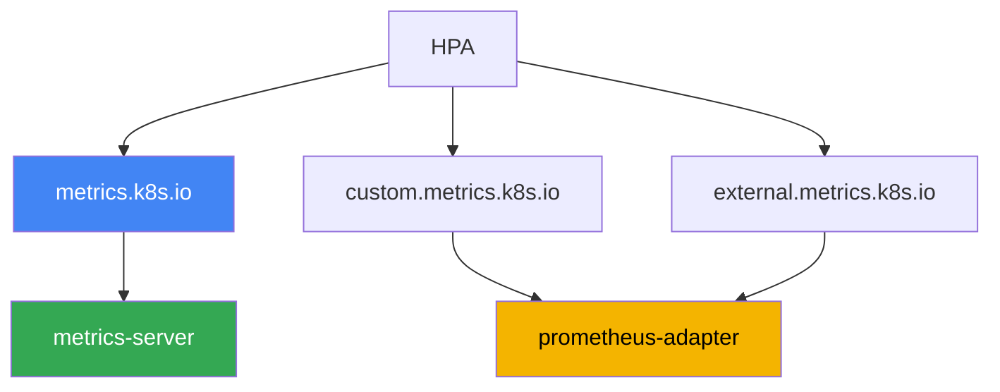
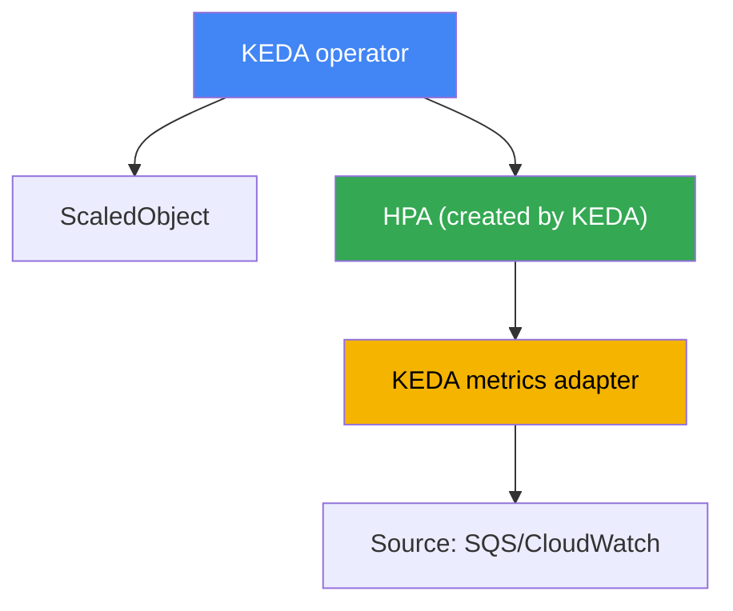

[Русская версия](ru.md) · [Versión en español](es.md) · [Version française](fr.md) · [Deutsche Version](de.md) · [ქართული ვერსია](ge.md) · [繁體中文版](tw.md) · [日本語版](jp.md)
# Chapter 35. Application autoscaling: HPA, external metrics, KEDA

> **What comes next.** Chapters 33 and 34 provided metrics and logs, the two pillars of observability. Here we put metrics to work: we scale the applications themselves, meaning we change the number of pod replicas according to load. Related topics are covered by other chapters: scaling nodes for those pods (Cluster Autoscaler, Karpenter), Chapters 11 and 12; where metrics come from (metrics-server, Prometheus), Chapter 33; vertical pod sizing (requests/limits, VPA), Chapter 14; and tracing to find bottlenecks, Chapter 36. This chapter has one focus: how to make the number of replicas follow real load, including events that a CPU-based HPA cannot see.

## 35.1. "The queue is growing, but the pods are sleeping"

There is a queue worker: pods read messages from Amazon SQS and process them. The replica count is fixed at three. A spike arrives, and producers flood the queue with tens of thousands of messages. The on-call engineer looks at the queue and the pods:

```bash
# unprocessed messages are accumulating in the queue
aws sqs get-queue-attributes --queue-url "$Q" \
  --attribute-names ApproximateNumberOfMessagesVisible
# "ApproximateNumberOfMessagesVisible": "48213"

kubectl get hpa worker
# NAME     REFERENCE           TARGETS       MINPODS  MAXPODS  REPLICAS
# worker   Deployment/worker   12%/70%       3        20       3
```

The queue grows, lag increases, but the HPA holds at three replicas and has no intention of scaling. The reason is in the `TARGETS` column: the HPA is configured for CPU, while utilization is only 12% against a 70% threshold. Most of the time, the pod waits for responses from the network and database, so this is I/O-bound work and does not occupy the CPU. The metric that actually describes overload is queue depth, and a CPU-based HPA cannot see it at all.

The opposite problem occurs at night. There are no messages, but the three replicas are still running and consuming resources: a regular HPA cannot reduce a Deployment to zero. A fixed replica count always loses: during a spike it causes overload and failures, while during idle time it wastes money. Next, in order: how HPA works and why the CPU metric lags; what metrics it can use; and why event-driven workloads use KEDA, which scales on queue depth and can scale to zero.

## 35.2. HPA: what it does and where its limit is

HorizontalPodAutoscaler is a control plane controller that periodically adjusts the number of replicas of a Deployment (or StatefulSet, ReplicaSet) to an observed metric. The formula is simple: desired replicas = current replicas × (current metric value / target). For CPU, with a 70% target and an actual value of 140%, HPA doubles the number of pods. You know the basic mechanism from CKA, so this chapter covers only what is specific to operations.

HPA gets resource metrics (CPU and memory) from the Metrics API (`metrics.k8s.io`), which is served by metrics-server (Chapter 33). Without metrics-server, `TARGETS` displays `<unknown>`, and CPU-based HPA does not work at all. That is the first thing to check when HPA is "silent."

To keep HPA from changing replicas for every bit of noise, it has a `behavior` section with stabilization:

- `stabilizationWindowSeconds` is the window over which the maximum desired number of replicas is chosen; it smooths fluctuations and prevents pods from being removed during short load drops. By default, the scaleDown window is 300 seconds and the scaleUp window is 0.
- `policies` are rate limits: how many pods or what percentage the size can change over a given period. They let you configure "slow down, fast up," or the reverse.

The main limit is visible in Section 35.1: **the CPU metric lags or remains silent for I/O-bound workloads**. A queue worker, proxy, or application waiting on a database can all be overloaded with work without loading the CPU. Scaling them by CPU is pointless: the signal does not correlate with load. You need another metric: request count, queue depth, or consumer lag. That raises the question of where HPA gets a metric that is absent from the Metrics API.

## 35.3. The three HPA metric types and the adapter chain

HPA can read three kinds of metrics, and distinguishing them matters because each has its own API and provider.

| Type in HPA | API | What it describes | Example |
|---|---|---|---|
| Resource | `metrics.k8s.io` | CPU/memory of target pods | average CPU 70% |
| Pods / Object | `custom.metrics.k8s.io` | metrics of cluster objects | requests per second of a pod |
| External | `external.metrics.k8s.io` | metrics outside the cluster | SQS queue depth |

- **Resource** means CPU and memory from metrics-server. This is the default and simplest case.
- **Pods** and **Object** are custom metrics of cluster objects: requests per second per pod, internal queue length, or a value based on Prometheus data. They are served through `custom.metrics.k8s.io`.
- **External** means metrics unrelated to cluster objects altogether: SQS queue depth, the number of messages in a Kafka topic, or a value from CloudWatch. They are served through `external.metrics.k8s.io`.

There is a separate nuance about `Resource` that matters in EKS, where a pod rarely consists of one container. Utilization for this type is calculated **for the entire pod**: the consumption of all containers divided by the sum of their requests. Thus, a sidecar such as a service mesh proxy, logging agent, or Vault agent dilutes the metric: the application is already struggling, while the pod average is still far from the threshold. The `ContainerResource` type fixes this by tying the decision to a single container:

```yaml
metrics:
  - type: ContainerResource
    containerResource:
      name: cpu
      container: app          # count only the application container
      target:
        type: Utilization
        averageUtilization: 70
```

The key point is that Kubernetes itself does not implement these two extended APIs. They are registered by an **adapter**, a separate component that connects to the API aggregator and answers HPA requests. A common adapter is **prometheus-adapter**: it takes data from Prometheus, turns it into `custom.metrics.k8s.io` metrics (and, if desired, `external.metrics.k8s.io` metrics), and exposes it to HPA according to mapping rules. The chain looks like this: the application exposes a metric, Prometheus collects it, prometheus-adapter publishes it through the metrics API, and HPA reads it and calculates replicas.



Honestly, the combination of Prometheus, prometheus-adapter, and mapping rules is tedious to configure. You need to describe which PromQL query corresponds to which HPA metric, track names and labels, and debug `<unknown>` in `TARGETS`. It is justified for one custom metric, but as soon as there are many sources and you want to scale to zero, a manual adapter becomes a burden. This is where KEDA enters the picture.

## 35.4. KEDA: event-driven autoscaling

KEDA (Kubernetes Event-Driven Autoscaling) is a layer on top of HPA for event-based scaling. The idea is that instead of manually deploying external-metrics adapters, you declaratively describe the event source, while KEDA supplies the metric to HPA and manages it. KEDA is installed in the cluster, usually through a Helm chart, and brings several components and its own CRDs.

The main resource is **ScaledObject**: it references your Deployment and describes scaling triggers. For background tasks, there is **ScaledJob**, which scales not Deployment replicas but the number of parallel Jobs for units of work. The metric source is configured through a **scaler**. KEDA has dozens of them, including exactly what was missing in Section 35.1:

- `aws-sqs-queue`: Amazon SQS queue depth;
- `aws-cloudwatch`: an arbitrary Amazon CloudWatch metric;
- `prometheus`: the result of a PromQL query, including from Amazon Managed Prometheus (Chapter 33);
- `kafka`: consumer lag; `cron`: a schedule; and many others.

Understanding how it works under the hood matters for troubleshooting. KEDA does **not replace** HPA; it works through it:



- The **operator** watches ScaledObjects and creates and maintains a regular HPA for each one.
- The KEDA **metrics adapter** registers `external.metrics.k8s.io` and exposes the values that a scaler polls from the source. In other words, HPA still performs all replica arithmetic, while KEDA only supplies the metric. Therefore, `kubectl get hpa` shows an HPA named `keda-hpa-...`.

What HPA cannot do on its own, and what often motivates choosing KEDA, is **scale-to-zero**. When there are no events (the queue is empty or there are no requests), KEDA reduces the Deployment to zero replicas and raises it again on the first event. A regular HPA on stable versions cannot do this: it works from one replica upward. The range is set by `minReplicaCount` (which can be 0) and `maxReplicaCount`.

AWS access for SQS and CloudWatch scalers is granted through IAM, not keys. KEDA uses either its operator role or, preferably, a separate role for each trigger through a **TriggerAuthentication** resource with the `aws` provider. The role is bound to a ServiceAccount through IRSA or Pod Identity (Chapters 16 and 17), the same mechanism used for other workloads. This gives each scaler exactly the permissions it needs, such as `sqs:GetQueueAttributes`, without shared keys.

```yaml
# ScaledObject: scale worker by SQS queue depth, down to zero
apiVersion: keda.sh/v1alpha1
kind: ScaledObject
metadata:
  name: worker
spec:
  scaleTargetRef:
    name: worker            # Deployment name
  minReplicaCount: 0        # scale-to-zero when the queue is empty
  maxReplicaCount: 20
  triggers:
  - type: aws-sqs-queue
    authenticationRef:
      name: keda-aws         # reference to TriggerAuthentication
    metadata:
      queueURL: https://sqs.eu-central-1.amazonaws.com/111122223333/jobs
      queueLength: "10"      # target number of messages per pod
      awsRegion: eu-central-1
```

Two `ScaledObject` fields that examples usually omit make a major difference in production. **`pollingInterval`** (30 seconds by default) is how often KEDA polls the source while the replica count is zero; from one replica upward, HPA itself requests the metric at its own interval. **`cooldownPeriod`** (300 seconds by default) is how long to wait after the last trigger activity before scaling to zero; it works **only for scale-to-zero**, while HPA handles the normal reduction from N to minReplicaCount, which is controlled through `behavior` and stabilization windows. A cooldown that is too short for queues creates a sawtooth pattern: a pod starts, processes a batch, scales to zero, then cold-starts again a minute later.

This also reveals a pitfall that appears as the number of ScaledObjects grows: **every trigger makes AWS API calls**. Dozens of `aws-sqs-queue` and `aws-cloudwatch` objects at the default interval generate a stream of `GetQueueAttributes` and `GetMetricData` requests and hit AWS request limits. The symptom is characteristic: HPA `TARGETS` displays `<unknown>`, replicas freeze, and KEDA operator logs show throttling errors. Mitigate it in three ways: increase `pollingInterval` for noncritical triggers, enable `useCachedMetrics: true` so a value is reused within the polling interval, and configure `fallback`, so when the source is unavailable KEDA maintains a predefined number of replicas rather than losing the metric.

## 35.5. Who scales what: do not confuse the three axes

Autoscaling in Kubernetes happens along three independent axes, and they are constantly confused. HPA and KEDA work only on the first.

| Tool | Axis | What it changes | Chapter |
|---|---|---|---|
| HPA, KEDA | horizontal, pods | number of Deployment replicas | this one |
| VPA | vertical, pod | requests/limits of one pod | 14 |
| Cluster Autoscaler, Karpenter | infrastructure | number and type of nodes | 11, 12 |

The relationship between the axes is direct, and it is important to see the complete picture. HPA or KEDA adds replicas based on load, but the new pods need somewhere to run. If there are no free nodes, pods remain in `Pending`, and **Karpenter or Cluster Autoscaler** (Chapters 11 and 12) then sees the unschedulable pods and adds nodes for them. Conversely, when load drops, HPA/KEDA removes replicas, nodes become empty, and Karpenter removes them through consolidation. Thus, application scaling and node scaling work together: the former reacts to load, while the latter reacts to pressure from the former.

One pair of axes works poorly together, and it is worth knowing before implementation: **HPA and VPA must not be aimed at the same resource metric**. The vicious cycle is simple. HPA sees high CPU and adds replicas, average utilization per pod falls, VPA concludes that requests are too high and reduces them; after the reduction, the same load becomes a much larger percentage of requests, and HPA adds replicas again. The replica count and pod size start driving each other.

There are three permitted combinations, all of which separate the tools by signal: VPA in `updateMode: "Off"`, where it only calculates sizing recommendations and a person makes the decision (Chapter 14); VPA and HPA on **different** resources, for example VPA on memory and HPA on CPU; and the most convenient setup in practice, where VPA maintains requests while HPA or KEDA scales replicas by custom and external metrics, such as RPS, queue depth, or consumer lag.

This leads to a typical operations error: HPA is configured and reliably creates replicas, but node autoscaling is absent, so pods accumulate in `Pending` and growing replicas has no effect. Or the opposite: KEDA reduces a Deployment to zero, but its node does not scale down because another pod keeps it in place. When investigating "why it does not scale," always identify which of the three axes is blocked.

## 35.6. When to use HPA and when to use KEDA

Both tools ultimately drive the same HPA mechanism, so the choice is about the metric source and the need for scale-to-zero, not about "which is more powerful."

| Situation | Tool | Why |
|---|---|---|
| Scale on CPU or memory | HPA | resource metrics already exist in metrics-server |
| One ready custom metric | HPA + prometheus-adapter | one adapter is sufficient |
| Event-driven workload, queues | KEDA | ready scalers for SQS, Kafka, CloudWatch |
| Scale-to-zero is required | KEDA | regular HPA does not scale down to zero |
| Many different sources | KEDA | no need to deploy an adapter for each one |
| Simple cluster, minimal CRDs | HPA | fewer components, less operational overhead |

A short rule: if CPU/memory or one ready metric is enough, use plain HPA; it is simpler and does not add unnecessary components. As soon as events, queues, scale-to-zero, or several external sources appear, use KEDA: it is designed exactly for that and removes the work of manual adapters. Installing KEDA just for ordinary CPU scaling adds unnecessary complexity.

## 35.7. How it is used in production

- **Scale on a metric that describes the load.** For web workloads this is often RPS or latency; for workers it is queue depth or consumer lag, not CPU. Keep CPU for workloads that genuinely bottleneck on the processor.
- **Use HPA by default and KEDA for events.** Do not bring KEDA into a cluster just for CPU; add it when queues, external sources, or scale-to-zero are needed.
- **Configure `behavior`, not just a threshold.** Fast up and slow down, or the reverse, through stabilization windows and policies prevents the sawtooth pattern of continuously changing replica counts.
- **Give scalers AWS access through roles, not keys.** Use TriggerAuthentication with the `aws` provider and IRSA or Pod Identity (Chapters 16 and 17), with the minimum permissions for the queue or metric.
- **Enable scale-to-zero deliberately.** It saves resources during idle time but adds a cold start: the first event after inactivity must wait for a pod to start. For latency-sensitive APIs, `minReplicaCount` is often kept above zero.
- **Check that nodes can keep up with pods.** HPA/KEDA are pointless without working Karpenter or Cluster Autoscaler below them; otherwise, new replicas remain in `Pending`.
- **Separate HPA and VPA by signal.** Do not give them the same resource: either use VPA with `updateMode: "Off"` for recommendations, or have it maintain requests while replicas scale on custom metrics and queues (Chapter 14).
- **Scale pods with sidecars by container.** Use `ContainerResource` for the application container instead of `Resource` for the whole pod; otherwise mesh proxies and agents dilute the metric.
- **Protect AWS APIs from throttling.** With dozens of ScaledObjects, increase `pollingInterval`, enable `useCachedMetrics`, and configure `fallback`, so an unavailable source does not leave HPA with `<unknown>` instead of a metric.

## 35.8. Mini-glossary

- **HPA (HorizontalPodAutoscaler)** is a controller that changes the number of Deployment replicas based on a metric.
- **Metrics API (`metrics.k8s.io`)** is the API for resource metrics (CPU/memory), served by metrics-server.
- **custom.metrics.k8s.io** is the API for custom metrics of cluster objects for HPA (Pods, Object).
- **external.metrics.k8s.io** is the API for external metrics (queues, topics) for HPA (External type).
- **prometheus-adapter** is an adapter that publishes Prometheus metrics through the custom/external APIs.
- **behavior / stabilizationWindowSeconds** is the HPA section that smooths scaling rate and fluctuations through stabilization windows and policies.
- **KEDA** is an event-driven autoscaling layer: it supplies metrics to HPA and manages it.
- **ScaledObject** is a KEDA CRD that describes a scaling target and triggers for a Deployment.
- **ScaledJob** is a KEDA CRD for scaling the number of parallel Jobs for units of work.
- **scaler** is a KEDA metric source: `aws-sqs-queue`, `aws-cloudwatch`, `prometheus`, `kafka`, `cron`, and dozens of others.
- **TriggerAuthentication** is a KEDA CRD with trigger access parameters; for AWS, it uses the `aws` provider through IRSA or Pod Identity.
- **scale-to-zero** means reducing a Deployment to zero replicas while idle; KEDA can do this, HPA cannot.
- **ContainerResource** is an HPA metric type that calculates utilization for one pod container rather than the sum of all containers; it is needed where a sidecar dilutes the application metric.
- **`pollingInterval` and `cooldownPeriod`** are the KEDA source polling interval (30 seconds by default) and the wait before scaling to zero (300 seconds by default); the latter applies only to scale-to-zero.
- **`useCachedMetrics` and `fallback`** are value caching within the polling interval and a replica count for an unavailable source; together they reduce the risk of API throttling and `<unknown>` in `TARGETS`.

## 35.9. Chapter summary

- A fixed replica count always loses: a spike causes overload, while idle time wastes money. CPU-based HPA does not save I/O-bound workloads: the queue grows, CPU remains low, and HPA stays silent.
- HPA changes replicas by the formula "current × actual/target"; it gets resource metrics from metrics-server, while `behavior` with `stabilizationWindowSeconds` and policies smooths fluctuations.
- HPA reads three metric types: Resource (`metrics.k8s.io`), Pods/Object (`custom.metrics.k8s.io`), and External (`external.metrics.k8s.io`); an adapter, usually prometheus-adapter, implements the extended APIs.
- The manual Prometheus plus prometheus-adapter combination is tedious to configure and does not scale well to many sources or scale-to-zero.
- KEDA declaratively describes an event source through ScaledObject/ScaledJob and scalers (`aws-sqs-queue`, `aws-cloudwatch`, `prometheus`, `kafka`, `cron`, and others).
- Under the hood, KEDA does not replace HPA: the operator creates an HPA for every ScaledObject, while the KEDA metrics adapter supplies it with an external metric through `external.metrics.k8s.io`.
- KEDA supports scale-to-zero, unlike regular HPA; access to SQS and CloudWatch is granted through TriggerAuthentication with the `aws` provider using IRSA or Pod Identity (Chapters 16 and 17).
- Do not confuse the three scaling axes: HPA/KEDA control pod replicas, VPA controls pod resources (Chapter 14), and Cluster Autoscaler/Karpenter control nodes (Chapters 11 and 12); they work together.

## 35.10. How this helps in real work

On call, autoscaling is a frequent suspect when a service "keeps failing or sitting idle." First, look at `kubectl get hpa`: the `TARGETS` column immediately tells you whether HPA sees the load or displays `<unknown>` (there is no metrics-server or adapter). If the metric exists but replicas do not grow, check whether pods are stuck in `Pending` because there are no nodes: application scaling does not work without node scaling. For event-driven services, also run `kubectl get scaledobject` and `kubectl describe` on it: they show whether the scaler responds and whether the HPA created by KEDA is up.

During planning, make the choice once and deliberately. Identify the metric that honestly describes the service load, which is rarely CPU. Decide whether scale-to-zero is needed and whether you are ready to pay for it with a cold start. For event-driven workloads, plan for KEDA and AWS access through roles, not keys. Always check the second axis too: working Karpenter or Cluster Autoscaler must support replica growth, or autoscaling will remain a beautiful but useless configuration.

## 35.11. Self-check questions

1. Why does CPU-based HPA not scale a queue worker even though the queue is growing?
2. What formula does HPA use to calculate the desired number of replicas, and where does it get resource metrics?
3. What does `<unknown>` in the `TARGETS` column of `kubectl get hpa` indicate, and where should the investigation start?
4. Why is the `behavior` section needed, and what does `stabilizationWindowSeconds` do?
5. What three metric types can HPA read, and which API corresponds to each?
6. How do custom.metrics.k8s.io and external.metrics.k8s.io differ, and who implements them?
7. What does prometheus-adapter do, and why does the manual combination with it scale poorly?
8. What do ScaledObject and ScaledJob describe, and how do they differ?
9. How does KEDA work under the hood, and why does `kubectl get hpa` show an HPA while KEDA is in use?
10. What is scale-to-zero, why is KEDA used for it, and what downside does it have for latency-sensitive services?
11. How does a KEDA scaler access SQS or CloudWatch without static keys?
12. How do the three scaling axes differ (HPA/KEDA, VPA, Cluster Autoscaler/Karpenter)?
13. When is plain HPA sufficient, and when is KEDA justified?
14. Why must HPA and VPA not be attached to the same resource metric, and which three combinations are allowed?
15. A pod consists of an application and a service mesh proxy. Why does `Resource` give an inaccurate picture, and what should be used instead?
16. `<unknown>` appeared in `TARGETS` for an HPA created by KEDA, while the ScaledObject is valid. What should you check on the AWS API side, and which three settings reduce the risk?

## Practice

The course lab for this topic is [Lab 124: application autoscaling with HPA, KEDA, and Prometheus](../../labs/124/README.MD). In it, you install kube-prometheus-stack and KEDA, define a `ScaledObject` with the `prometheus` scaler, see firsthand that KEDA does not replace HPA but creates and maintains a regular `keda-hpa-*`, then scale an application by the load of other pods and observe its return to the minimum through the stabilization window; verify it with the `check_result` command. Start it with `TASK=124 make run_eks_task`.

It is also useful to know how to capture autoscaling state on any working cluster. First, look at what is configured at all and whether HPA can see its metric:

```bash
# all HPAs and their targets; inspect the TARGETS column
kubectl get hpa -A
# details for a specific HPA: events and current and target metric values
kubectl describe hpa worker
```

Check whether the cluster exposes the extended metrics APIs. Without them, HPA cannot receive custom/external metrics:

```bash
# whether custom and external metrics APIs are registered, and which adapter serves them
kubectl get apiservices | grep -E "custom.metrics|external.metrics"
```

If KEDA is installed in the cluster, inspect its resources and the HPAs it created:

```bash
# KEDA objects and HPAs it created under the hood (names such as keda-hpa-*)
kubectl get scaledobject -A
kubectl get hpa -A | grep keda-hpa
```

Compare the picture: is the service scaling on a metric that describes its load, or on CPU "out of habit"; can HPA see the metric, or does it show `<unknown>`; and are new replicas stuck in `Pending` because of insufficient nodes? In addition to the course lab, the repository has a separate, non-course lab on autoscaling with KEDA and Prometheus (`../../labs/03/README_RUS.MD`): it deploys Prometheus, installs KEDA, and scales an application by real RPS, a good way to see the entire chain in action.

---
[Table of contents](../README.md) · [Chapter 34](../34/en.md) · [Chapter 36](../36/en.md)
