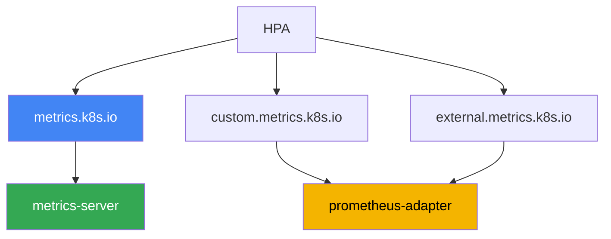
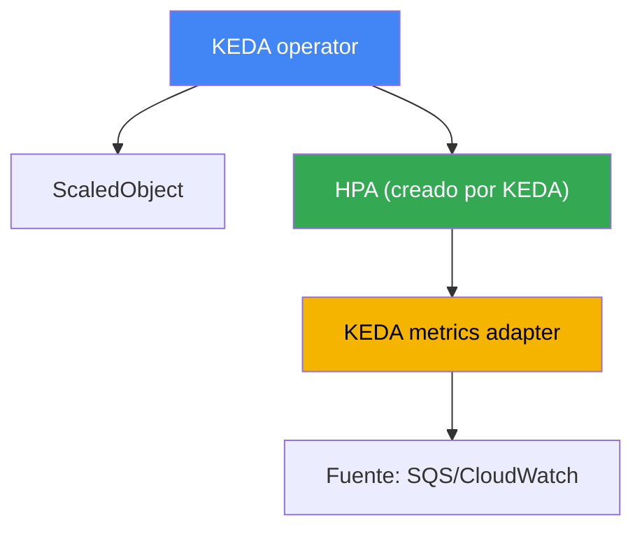

[Русская версия](ru.md) · [Eng version](en.md) · [Version française](fr.md) · [Deutsche Version](de.md) · [ქართული ვერსია](ge.md) · [繁體中文版](tw.md) · [日本語版](jp.md)

# Capítulo 35. Autoescalado de aplicaciones: HPA, métricas externas, KEDA

> **Qué sigue.** Los capítulos 33 y 34 aportaron las métricas y los logs, los dos pilares de la observabilidad. Aquí usamos las métricas para algo útil: escalamos las propias aplicaciones, es decir, cambiamos el número de réplicas de pods según la carga. Los temas relacionados se tratan en otros capítulos: escalar nodos para esos pods (Cluster Autoscaler, Karpenter), capítulos 11 y 12; de dónde proceden las métricas (metrics-server, Prometheus), capítulo 33; el dimensionamiento vertical de un pod (requests/limits, VPA), capítulo 14; y el tracing para encontrar cuellos de botella, capítulo 36. Aquí hay un solo tema: cómo hacer que el número de réplicas siga la carga real, incluidos eventos que HPA por CPU no ve.

## 35.1. «La cola crece, pero los pods duermen»

Hay un worker de cola: los pods leen mensajes de Amazon SQS y los procesan. El número de
réplicas está fijado en tres. Llega un pico: los productores han volcado decenas de miles de
mensajes. La persona de guardia mira la cola y los pods:

```bash
# se acumulan mensajes sin procesar en la cola
aws sqs get-queue-attributes --queue-url "$Q" \
  --attribute-names ApproximateNumberOfMessagesVisible
# "ApproximateNumberOfMessagesVisible": "48213"

kubectl get hpa worker
# NAME     REFERENCE           TARGETS       MINPODS  MAXPODS  REPLICAS
# worker   Deployment/worker   12%/70%       3        20       3
```

La cola crece, el lag aumenta, pero HPA mantiene tres réplicas y no piensa escalar. La razón
está en la columna `TARGETS`: HPA está configurado para CPU, mientras que la utilización es de
solo un 12% frente a un umbral del 70%. El pod pasa la mayor parte del tiempo esperando
respuestas de la red y de la base de datos: es una carga I/O-bound y no ocupa la CPU. La métrica
que realmente describe la sobrecarga es la profundidad de la cola, y HPA por CPU no la ve en
absoluto.

El problema contrario sucede por la noche. No hay mensajes, pero las tres réplicas siguen
funcionando y consumiendo recursos: un HPA normal no puede reducir un Deployment a cero. Un
número fijo de réplicas siempre pierde: durante un pico provoca sobrecarga y fallos, y durante
la inactividad desperdicia dinero. A continuación, en orden: cómo funciona HPA y por qué la
métrica de CPU llega tarde; qué métricas puede usar; y por qué para cargas event-driven se usa
KEDA, que escala por la profundidad de la cola y puede bajar a cero.

## 35.2. HPA: qué hace y dónde está su límite

HorizontalPodAutoscaler es un controlador del control plane que ajusta periódicamente el número
de réplicas de un Deployment (o StatefulSet, ReplicaSet) según una métrica observada. La fórmula
es sencilla: réplicas deseadas = réplicas actuales × (valor actual de la métrica / objetivo). Para
CPU, con un objetivo del 70% y un valor real del 140%, HPA duplicará el número de pods. Ya
conoces el mecanismo básico de CKA, así que aquí solo se cubre lo específico de la operación.

HPA obtiene las métricas de recursos (CPU y memoria) de Metrics API (`metrics.k8s.io`), que
sirve metrics-server (capítulo 33). Sin metrics-server, `TARGETS` muestra `<unknown>` y HPA por
CPU no funciona en absoluto. Eso es lo primero que se comprueba cuando HPA está «en silencio».

Para que HPA no cambie las réplicas con cada pequeño ruido, tiene una sección `behavior` con
estabilización:

- `stabilizationWindowSeconds`: ventana durante la que se toma el máximo número de réplicas
  deseadas; suaviza las fluctuaciones e impide eliminar pods ante caídas breves de carga. Por
  defecto, la ventana de scaleDown es de 300 segundos y la de scaleUp de 0.
- `policies`: límites de velocidad, es decir, cuántos pods o qué porcentaje puede cambiar el
  tamaño en un periodo dado. Permiten configurar «bajar lento, subir rápido» o lo contrario.

El límite principal se ve en la sección 35.1: **la métrica de CPU llega tarde o permanece en
silencio para cargas I/O-bound**. Un worker de cola, un proxy o una aplicación que espera a una
base de datos pueden estar sobrecargados de trabajo sin cargar la CPU. Escalarlos por CPU no
tiene sentido: la señal no se correlaciona con la carga. Hace falta otra métrica: número de
solicitudes, profundidad de la cola o lag del consumidor. Entonces surge la pregunta de dónde
obtendrá HPA una métrica ausente de Metrics API.

## 35.3. Los tres tipos de métricas de HPA y la cadena de adaptadores

HPA puede leer tres clases de métricas, y es importante distinguirlas porque cada una tiene su
propia API y proveedor.

| Tipo en HPA | API | Qué describe | Ejemplo |
|---|---|---|---|
| Resource | `metrics.k8s.io` | CPU/memoria de los pods objetivo | CPU medio del 70% |
| Pods / Object | `custom.metrics.k8s.io` | métricas de objetos del clúster | solicitudes por segundo de un pod |
| External | `external.metrics.k8s.io` | métricas externas al clúster | profundidad de cola SQS |

- **Resource**: CPU y memoria de metrics-server. Es el caso predeterminado y el más sencillo.
- **Pods** y **Object**: métricas «personalizadas» de objetos del clúster, como solicitudes por
  segundo por pod, longitud de una cola interna o un valor basado en datos de Prometheus. Se
  sirven mediante `custom.metrics.k8s.io`.
- **External**: métricas no vinculadas en absoluto a objetos del clúster, como profundidad de la
  cola SQS, número de mensajes de un tópico Kafka o un valor de CloudWatch. Se sirven mediante
  `external.metrics.k8s.io`.

Hay un matiz aparte sobre `Resource`, importante en EKS, donde un pod rara vez consta de un solo
contenedor. La utilización de este tipo se calcula **para el pod completo**: el consumo de todos
los contenedores frente a la suma de sus requests. Por tanto, un sidecar, como un proxy de
service mesh, un agente de logs o un agente Vault, diluye la métrica: la aplicación ya tiene
problemas, pero el promedio del pod sigue lejos del umbral. El tipo `ContainerResource` lo
soluciona al vincular la decisión a un solo contenedor:

```yaml
metrics:
  - type: ContainerResource
    containerResource:
      name: cpu
      container: app          # contamos solo el contenedor de la aplicación
      target:
        type: Utilization
        averageUtilization: 70
```

El punto clave es que Kubernetes no implementa por sí mismo esas dos API extendidas. Las
registra un **adaptador**, un componente separado que se conecta al agregador de API y responde
las solicitudes de HPA. Un adaptador habitual es **prometheus-adapter**: toma los datos de
Prometheus, los convierte en métricas de `custom.metrics.k8s.io` (y, si se desea, de
`external.metrics.k8s.io`) y las expone a HPA según reglas de mapeo. La cadena queda así: la
aplicación expone una métrica, Prometheus la recopila, prometheus-adapter la publica mediante
metrics API y HPA la lee y calcula las réplicas.



Hablando claramente del coste: la combinación «Prometheus + prometheus-adapter + reglas de
mapeo» es tediosa de configurar. Hay que describir qué consulta PromQL corresponde a cada
métrica de HPA, vigilar nombres y labels, y depurar `<unknown>` en `TARGETS`. Se justifica para
una métrica personalizada, pero en cuanto hay muchas fuentes y se quiere bajar a cero, un
adaptador manual se vuelve una carga. Ahí entra en escena KEDA.

## 35.4. KEDA: autoescalado basado en eventos

KEDA (Kubernetes Event-Driven Autoscaling) es una capa sobre HPA para escalar según eventos. La
idea es que, en vez de desplegar manualmente adaptadores de métricas externas, describes la
fuente del evento de forma declarativa y KEDA proporciona la métrica a HPA y lo gestiona. KEDA
se instala en el clúster, normalmente mediante un chart de Helm, y aporta varios componentes y
sus propios CRD.

El recurso principal es **ScaledObject**: hace referencia a tu Deployment y describe los
triggers de escalado. Para tareas en segundo plano existe **ScaledJob**, que no escala las
réplicas de un Deployment sino el número de Job paralelos para porciones de trabajo. La fuente
de métricas se configura mediante un **scaler**; KEDA tiene decenas de ellos, incluidos
exactamente los que faltaban en la sección 35.1:

- `aws-sqs-queue`: profundidad de una cola Amazon SQS;
- `aws-cloudwatch`: una métrica arbitraria de Amazon CloudWatch;
- `prometheus`: el resultado de una consulta PromQL, incluso de Amazon Managed Prometheus
  (capítulo 33);
- `kafka`: lag del consumidor; `cron`: una programación; y muchos más.

Es importante entender cómo funciona internamente para poder diagnosticar problemas. KEDA **no
sustituye** a HPA, sino que trabaja a través de él:



- El **operator** vigila ScaledObject y crea y mantiene un HPA normal para cada uno de ellos.
- El **metrics adapter** de KEDA registra `external.metrics.k8s.io` y entrega allí los valores
  que el scaler consulta de la fuente. Es decir, HPA sigue haciendo toda la aritmética de
  réplicas y KEDA solo le proporciona la métrica. Por eso `kubectl get hpa` mostrará un HPA con
  un nombre como `keda-hpa-...`.

Lo que HPA no puede hacer por sí mismo, y por lo que a menudo se usa KEDA, es **scale-to-zero**.
Cuando no hay eventos (la cola está vacía, hay cero solicitudes), KEDA reduce el Deployment a
cero réplicas y lo vuelve a levantar con el primer evento. HPA normal en versiones estables no
puede hacerlo: funciona desde una réplica en adelante. El intervalo se establece mediante los
campos `minReplicaCount` (puede ser 0) y `maxReplicaCount`.

El acceso de los scaler de SQS y CloudWatch a AWS no se concede con claves, sino mediante IAM.
KEDA usa el rol de su operator o, mejor aún, un rol separado para cada trigger a través del
recurso **TriggerAuthentication** con el proveedor `aws`. El rol se asocia a un ServiceAccount
mediante IRSA o Pod Identity (capítulos 16 y 17), el mismo mecanismo que para las demás cargas
de trabajo. Así, cada scaler recibe exactamente los permisos que necesita, por ejemplo
`sqs:GetQueueAttributes`, sin claves compartidas.

```yaml
# ScaledObject: escalar worker según la profundidad de la cola SQS, hasta cero
apiVersion: keda.sh/v1alpha1
kind: ScaledObject
metadata:
  name: worker
spec:
  scaleTargetRef:
    name: worker            # nombre del Deployment
  minReplicaCount: 0        # scale-to-zero cuando la cola está vacía
  maxReplicaCount: 20
  triggers:
  - type: aws-sqs-queue
    authenticationRef:
      name: keda-aws         # referencia a TriggerAuthentication
    metadata:
      queueURL: https://sqs.eu-central-1.amazonaws.com/111122223333/jobs
      queueLength: "10"      # número objetivo de mensajes por pod
      awsRegion: eu-central-1
```

Dos campos de `ScaledObject` que suelen omitirse en ejemplos, pero que en producción resuelven
mucho. **`pollingInterval`** (30 segundos por defecto) es la frecuencia con la que KEDA consulta
la fuente mientras hay cero réplicas; a partir de una réplica, la métrica la consulta el propio
HPA con su frecuencia. **`cooldownPeriod`** (300 segundos por defecto) es cuánto esperar tras la
última actividad del trigger antes de bajar a cero; funciona **solo para scale-to-zero**, mientras
que el descenso habitual de N a minReplicaCount lo gestiona HPA y se controla mediante
`behavior` con ventanas de estabilización. Un cooldown demasiado corto en colas genera un
«diente de sierra»: el pod se levanta, procesa un lote, baja a cero y un minuto después vuelve a
tener un arranque en frío.

De ahí viene también una trampa que aparece al crecer el número de ScaledObject: **cada trigger
hace llamadas a la API de AWS**. Decenas de objetos con `aws-sqs-queue` y `aws-cloudwatch`, con
el intervalo predeterminado, generan un flujo de `GetQueueAttributes` y `GetMetricData` y chocan
con los límites de solicitudes de AWS. El síntoma es característico: `TARGETS` del HPA muestra
`<unknown>`, las réplicas se congelan y en los logs del operator de KEDA aparecen errores de
throttling. Se mitiga de tres formas: aumentar `pollingInterval` para triggers no críticos,
activar `useCachedMetrics: true` para reutilizar el valor dentro del intervalo de consulta, y
definir la sección `fallback`; así, si la fuente no está disponible, KEDA mantiene un número de
réplicas predefinido en vez de perder la métrica.

## 35.5. Quién escala qué: no confundir los tres ejes

El autoescalado de Kubernetes ocurre en tres ejes independientes, y se confunden
constantemente. HPA y KEDA solo trabajan en el primero.

| Herramienta | Eje | Qué cambia | Capítulo |
|---|---|---|---|
| HPA, KEDA | horizontal, pods | número de réplicas del Deployment | este |
| VPA | vertical, pod | requests/limits de un pod | 14 |
| Cluster Autoscaler, Karpenter | infraestructura | número y tipo de nodos | 11, 12 |

La relación entre los ejes es directa y es importante verla completa. HPA o KEDA añaden
réplicas según la carga, pero los nuevos pods necesitan dónde colocarse. Si no hay nodos libres,
los pods quedan en `Pending`, y entonces **Karpenter o Cluster Autoscaler** (capítulos 11 y 12)
ven los pods no programados y añaden nodos para ellos. A la inversa, cuando la carga baja,
HPA/KEDA eliminan réplicas, los nodos se vacían y Karpenter los reduce mediante consolidation.
Es decir, el escalado de aplicaciones y el de nodos trabajan juntos: el primero responde a la
carga, y el segundo a la presión que genera el primero.

Una combinación de ejes encaja mal, y conviene saberlo antes de implantarla: **no se debe poner
HPA y VPA sobre la misma métrica de recursos**. El mecanismo del círculo vicioso es sencillo.
HPA detecta CPU alta y añade réplicas; baja la carga media por pod, VPA concluye que los requests
son excesivos y los reduce; tras la reducción, la misma carga representa un porcentaje mucho
mayor de los requests, y HPA vuelve a añadir réplicas. El número de réplicas y el tamaño del pod
empiezan a impulsarse mutuamente.

Hay tres combinaciones permitidas, y todas separan las herramientas por señales distintas: VPA
en modo `updateMode: "Off"`, cuando solo calcula recomendaciones de dimensionamiento y la
persona toma la decisión (capítulo 14); VPA y HPA sobre **recursos diferentes**, por ejemplo VPA
por memoria y HPA por CPU; y la más práctica, VPA mantiene los requests mientras HPA o KEDA
escalan las réplicas por métricas personalizadas y externas, es decir, por RPS, profundidad de
cola o lag del consumidor.

De aquí surge un error típico de operación: HPA está configurado y crea réplicas correctamente,
pero no hay escalado de nodos; los pods se acumulan en `Pending` y aumentar las réplicas no tiene
efecto. O al contrario: KEDA baja un Deployment a cero, pero el nodo que lo alojaba no se reduce
porque otro pod lo mantiene. Al investigar «por qué no escala», siempre se determina en cuál de
los tres ejes está el bloqueo.

## 35.6. Cuándo HPA y cuándo KEDA

Al final, ambas herramientas usan el mismo mecanismo de HPA, así que la elección trata sobre la
fuente de la métrica y la necesidad de scale-to-zero, no sobre «cuál es más potente».

| Situación | Herramienta | Por qué |
|---|---|---|
| Escalado por CPU o memoria | HPA | las métricas de recursos ya están en metrics-server |
| Una métrica personalizada lista | HPA + prometheus-adapter | un adaptador basta |
| Carga event-driven, colas | KEDA | scaler listos para SQS, Kafka, CloudWatch |
| Se necesita scale-to-zero | KEDA | un HPA normal no baja a cero |
| Muchas fuentes diferentes | KEDA | no hay que desplegar un adaptador para cada una |
| Clúster sencillo, mínimo de CRD | HPA | menos componentes, menos operación |

Regla corta: si basta con CPU/memoria o una métrica lista, se usa HPA puro, porque es más simple
y no añade componentes extra. En cuanto aparecen eventos, colas, scale-to-zero o varias fuentes
externas, se usa KEDA: es exactamente para eso y elimina el trabajo con adaptadores manuales.
Instalar KEDA para el escalado habitual por CPU es complejidad innecesaria.

## 35.7. Cómo se aplica en producción

- **Escalar según la métrica que describe la carga.** Para la web suele ser RPS o latencia; para
  workers, profundidad de cola o lag del consumidor, no CPU. La CPU se deja para donde la carga
  realmente está limitada por el procesador.
- **Usar HPA por defecto y KEDA para eventos.** No se lleva KEDA al clúster por CPU; se añade
  cuando aparecen colas, fuentes externas o se necesita scale-to-zero.
- **Configurar `behavior`, no solo el umbral.** Subir rápido y bajar suave, o al revés, mediante
  ventanas de estabilización y policies evita el «diente de sierra»: cambios constantes del
  número de réplicas.
- **Dar a los scaler acceso a AWS mediante roles, no claves.** TriggerAuthentication con el
  proveedor `aws` e IRSA o Pod Identity (capítulos 16 y 17), con permisos mínimos sobre la cola
  o métrica.
- **Activar scale-to-zero conscientemente.** Ahorra recursos durante la inactividad, pero añade
  un arranque en frío: el primer evento tras la inactividad tendrá que esperar a que suba el pod.
  Para API sensibles a la latencia, `minReplicaCount` suele mantenerse por encima de cero.
- **Comprobar que los nodos siguen el ritmo de los pods.** HPA/KEDA no sirven de nada sin un
  Karpenter o Cluster Autoscaler funcional por debajo; de lo contrario, las nuevas réplicas
  quedan bloqueadas en `Pending`.
- **Separar HPA y VPA por señales distintas.** No se les entrega el mismo recurso: VPA se usa en
  `updateMode: "Off"` para recomendaciones, o mantiene los requests mientras las réplicas se
  escalan por métricas personalizadas y colas (capítulo 14).
- **Escalar por contenedor en pods con sidecar.** Usar el tipo `ContainerResource` para el
  contenedor de la aplicación, en lugar de `Resource` para todo el pod: de otro modo los proxy
  de mesh y agentes diluyen la métrica.
- **Proteger la API de AWS del throttling.** Con decenas de ScaledObject, aumentar
  `pollingInterval`, activar `useCachedMetrics` y configurar `fallback`, para que una fuente no
  disponible no deje a HPA con `<unknown>` en vez de una métrica.

## 35.8. Miniglosario

- **HPA (HorizontalPodAutoscaler)**: controlador que cambia el número de réplicas de un
  Deployment según una métrica.
- **Metrics API (`metrics.k8s.io`)**: API de métricas de recursos (CPU/memoria), de
  metrics-server.
- **custom.metrics.k8s.io**: API de métricas personalizadas de objetos del clúster para HPA
  (Pods, Object).
- **external.metrics.k8s.io**: API de métricas externas (colas, tópicos) para HPA (tipo
  External).
- **prometheus-adapter**: adaptador que publica métricas de Prometheus en la API
  custom/external.
- **behavior / stabilizationWindowSeconds**: sección de HPA que suaviza la velocidad y las
  fluctuaciones del escalado mediante ventanas de estabilización y policies.
- **KEDA**: capa de autoescalado basado en eventos: proporciona métricas a HPA y lo gestiona.
- **ScaledObject**: CRD de KEDA que describe el objetivo de escalado y los triggers de un
  Deployment.
- **ScaledJob**: CRD de KEDA para escalar el número de Job paralelos para porciones de trabajo.
- **scaler**: fuente de métricas de KEDA: `aws-sqs-queue`, `aws-cloudwatch`, `prometheus`,
  `kafka`, `cron` y decenas de otras.
- **TriggerAuthentication**: CRD de KEDA con parámetros de acceso del trigger; para AWS, el
  proveedor `aws` mediante IRSA o Pod Identity.
- **scale-to-zero**: reducción de un Deployment a cero réplicas durante la inactividad; KEDA
  puede hacerlo, HPA no.
- **ContainerResource**: tipo de métrica de HPA que calcula la utilización de un solo
  contenedor del pod, no de la suma de todos; se necesita cuando un sidecar diluye la métrica de
  la aplicación.
- **`pollingInterval` y `cooldownPeriod`**: periodo de consulta de la fuente de KEDA (30 s por
  defecto) y espera antes de bajar a cero (300 s por defecto); el segundo solo actúa para
  scale-to-zero.
- **`useCachedMetrics` y `fallback`**: almacenamiento en caché del valor dentro del intervalo de
  consulta y número de réplicas ante una fuente no disponible; juntos reducen el riesgo de
  throttling de API y de `<unknown>` en `TARGETS`.

## 35.9. Resumen del capítulo

- Un número fijo de réplicas siempre pierde: durante un pico, sobrecarga; en inactividad,
  desperdicio de dinero. HPA por CPU no salva cargas I/O-bound: la cola crece, la CPU está baja y
  HPA no hace nada.
- HPA cambia las réplicas con la fórmula «actuales × valor real/objetivo»; toma las métricas de
  recursos de metrics-server, y `behavior` con `stabilizationWindowSeconds` y policies suaviza
  las fluctuaciones.
- HPA lee tres tipos de métricas: Resource (`metrics.k8s.io`), Pods/Object
  (`custom.metrics.k8s.io`) y External (`external.metrics.k8s.io`); las API extendidas las
  implementa un adaptador, normalmente prometheus-adapter.
- La combinación manual de Prometheus y prometheus-adapter es tediosa de configurar y escala mal
  para muchas fuentes y scale-to-zero.
- KEDA describe la fuente de un evento declarativamente mediante ScaledObject/ScaledJob y
  scaler (`aws-sqs-queue`, `aws-cloudwatch`, `prometheus`, `kafka`, `cron` y otros).
- Internamente, KEDA no sustituye a HPA: el operator crea un HPA para cada ScaledObject, y el
  metrics adapter de KEDA le proporciona una métrica externa mediante `external.metrics.k8s.io`.
- KEDA puede hacer scale-to-zero, cosa que HPA normal no hace; el acceso a SQS y CloudWatch se
  concede mediante TriggerAuthentication con el proveedor `aws`, IRSA o Pod Identity (capítulos
  16 y 17).
- No hay que confundir los tres ejes de escalado: HPA/KEDA son réplicas de pods, VPA son recursos
  del pod (capítulo 14), y Cluster Autoscaler/Karpenter son nodos (capítulos 11 y 12); trabajan
  en conjunto.

## 35.10. Cómo sirve esto en el trabajo real

Durante una guardia, el autoescalado es un sospechoso frecuente cuando un servicio «unas veces
falla y otras permanece inactivo». Lo primero es mirar `kubectl get hpa`: la columna `TARGETS`
dice enseguida si HPA ve la carga o si muestra `<unknown>` (falta metrics-server o el adaptador).
Si la métrica existe pero las réplicas no crecen, se comprueba si los pods quedaron en `Pending`
por falta de nodos: el escalado de aplicaciones sin escalado de nodos no funciona. En servicios
basados en eventos se añade `kubectl get scaledobject` y `kubectl describe` sobre él: ahí se ve
si el scaler responde y si se levantó el HPA creado por KEDA.

Al planificar, la elección se hace una vez y de forma consciente. Se determina la métrica que
describe honestamente la carga del servicio, y rara vez es CPU. Se decide si hace falta
scale-to-zero y si se acepta pagar su arranque en frío. Para cargas event-driven se planifican
KEDA y acceso a AWS mediante roles, no claves. Y siempre se comprueba el segundo eje: que bajo
el aumento de réplicas haya un Karpenter o Cluster Autoscaler funcional; de otro modo, el
autoescalado seguirá siendo una configuración bonita pero inútil.

## 35.11. Preguntas de autoevaluación

1. ¿Por qué HPA por CPU no escala un worker de cola aunque la cola crezca?
2. ¿Con qué fórmula calcula HPA el número deseado de réplicas y de dónde obtiene las métricas de
   recursos?
3. ¿Qué indica `<unknown>` en la columna `TARGETS` de `kubectl get hpa` y por dónde se debe
   empezar a investigar?
4. ¿Para qué sirve la sección `behavior` y qué hace `stabilizationWindowSeconds`?
5. ¿Qué tres tipos de métricas lee HPA y qué API corresponde a cada uno?
6. ¿En qué se diferencian custom.metrics.k8s.io y external.metrics.k8s.io, y quién las
   implementa?
7. ¿Qué hace prometheus-adapter y por qué la combinación manual con él escala mal?
8. ¿Qué describen ScaledObject y ScaledJob, y en qué se diferencian?
9. ¿Cómo funciona KEDA internamente y por qué `kubectl get hpa` muestra un HPA cuando KEDA está
   funcionando?
10. ¿Qué es scale-to-zero, por qué se usa KEDA para ello y qué inconveniente tiene para servicios
    sensibles a la latencia?
11. ¿Cómo obtiene un scaler de KEDA acceso a SQS o CloudWatch sin claves estáticas?
12. ¿En qué se diferencian los tres ejes de escalado (HPA/KEDA, VPA,
    Cluster Autoscaler/Karpenter)?
13. ¿Cuándo basta HPA puro y cuándo se justifica KEDA?
14. ¿Por qué no se deben aplicar HPA y VPA a la misma métrica de recursos, y qué tres
    combinaciones son aceptables?
15. Un pod consta de una aplicación y un proxy de service mesh. ¿Por qué `Resource` da una imagen
    incorrecta y qué se debe usar en su lugar?
16. El `TARGETS` de un HPA creado por KEDA muestra `<unknown>`, pero ScaledObject es correcto.
    ¿Qué hay que comprobar en la API de AWS y qué tres ajustes reducen el riesgo?

## Práctica

El laboratorio del curso para este tema es el [laboratorio 124: autoescalado de aplicaciones:
HPA, KEDA, Prometheus](../../labs/124/README_ES.MD). En él instalas kube-prometheus-stack y
KEDA, describes un `ScaledObject` con el scaler `prometheus`, ves directamente que KEDA no
sustituye a HPA sino que crea y mantiene un `keda-hpa-*` normal, luego escalas una aplicación
según la carga de pods ajenos y observas el regreso al mínimo mediante una ventana de
estabilización; se comprueba con el comando `check_result`. Se inicia con
`TASK=124 make run_eks_task`.

También es útil saber obtener el estado del autoescalado en cualquier clúster de trabajo.
Primero mira qué está configurado y si HPA ve su métrica:

```bash
# todos los HPA y sus objetivos; observamos la columna TARGETS
kubectl get hpa -A
# detalles de uno concreto: eventos y valor actual y objetivo de la métrica
kubectl describe hpa worker
```

Comprueba si el clúster ofrece las API de métricas extendidas: sin ellas HPA no recibirá métricas
custom/external:

```bash
# si las API de métricas personalizadas y externas están registradas y qué adaptador las sirve
kubectl get apiservices | grep -E "custom.metrics|external.metrics"
```

Si KEDA está instalado en el clúster, revisa sus recursos y los HPA que creó:

```bash
# objetos de KEDA y los HPA que creó internamente (nombres como keda-hpa-*)
kubectl get scaledobject -A
kubectl get hpa -A | grep keda-hpa
```

Relaciona la información: si el servicio escala según una métrica que describe su carga o según
CPU «por costumbre»; si HPA ve la métrica o muestra `<unknown>`; y si las réplicas nuevas no
quedan bloqueadas en `Pending` por falta de nodos. Además del laboratorio del curso, el
repositorio incluye un laboratorio independiente, no perteneciente al curso, sobre autoescalado
con KEDA y Prometheus [laboratorio 03](../../labs/03/README_ES.MD): despliega Prometheus, instala KEDA y
escala una aplicación por RPS real, una buena forma de ver toda la cadena en acción.

---
[Índice](../README_ES.md) · [Capítulo 34](../34/es.md) · [Capítulo 36](../36/es.md)
