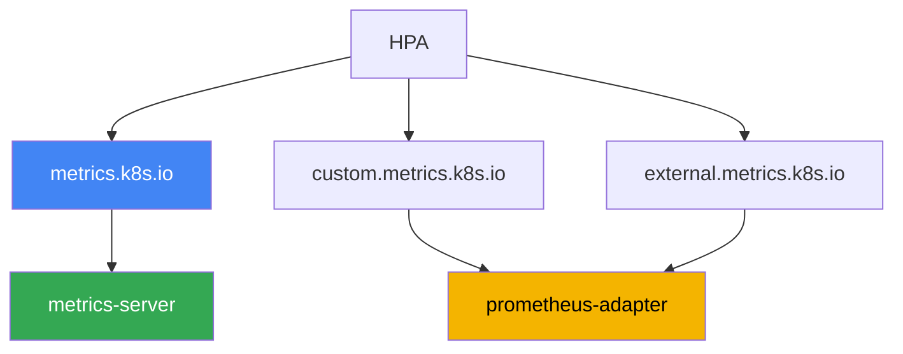
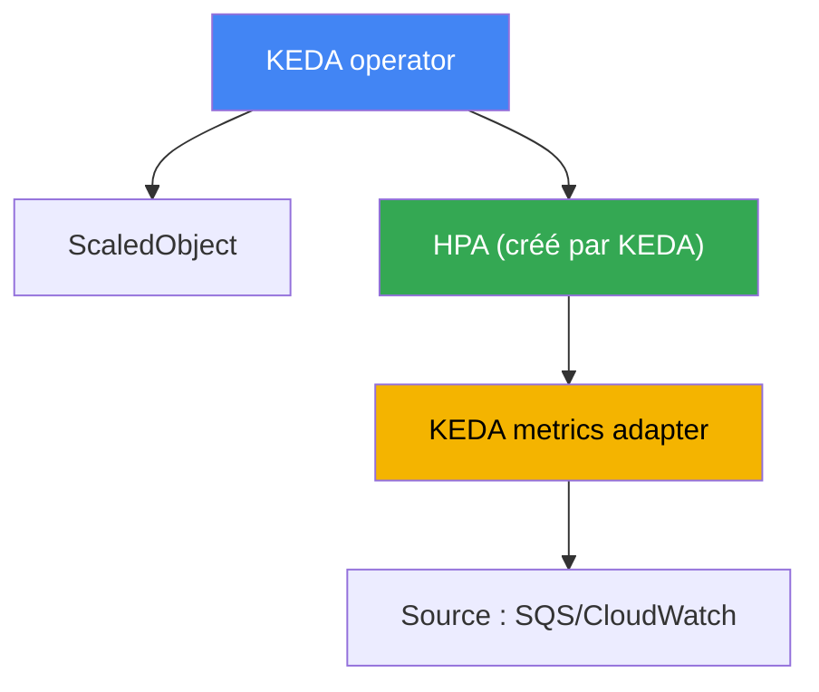

[Русская версия](ru.md) · [Eng version](en.md) · [Versión en español](es.md) · [Deutsche Version](de.md) · [ქართული ვერსია](ge.md) · [繁體中文版](tw.md) · [日本語版](jp.md)
# Chapitre 35. Autoscaling des applications : HPA, métriques externes, KEDA

> **La suite.** Les chapitres 33 et 34 ont fourni les métriques et les logs, les deux piliers de l’observabilité. Ici, nous utilisons les métriques concrètement : nous faisons évoluer les applications elles-mêmes, c’est-à-dire le nombre de réplicas de pods selon la charge. Les sujets connexes sont traités dans d’autres chapitres : le dimensionnement des nœuds pour ces pods (Cluster Autoscaler, Karpenter), chapitres 11 et 12 ; l’origine des métriques (metrics-server, Prometheus), chapitre 33 ; le dimensionnement vertical d’un pod (requests/limits, VPA), chapitre 14 ; le tracing pour trouver les goulots d’étranglement, chapitre 36. Un seul sujet ici : faire suivre au nombre de réplicas la charge réelle, y compris les événements que le HPA basé sur le CPU ne voit pas.

## 35.1. « La file grandit, mais les pods dorment »

Il y a un processeur de file : les pods lisent les messages d’Amazon SQS et les traitent. Le
nombre de réplicas est fixé à trois. Un pic arrive : les producteurs ont versé des dizaines de
milliers de messages. L’astreinte observe la file et les pods :

```bash
# des messages non traités s'accumulent dans la file
aws sqs get-queue-attributes --queue-url "$Q" \
  --attribute-names ApproximateNumberOfMessagesVisible
# "ApproximateNumberOfMessagesVisible": "48213"

kubectl get hpa worker
# NAME     REFERENCE           TARGETS       MINPODS  MAXPODS  REPLICAS
# worker   Deployment/worker   12%/70%       3        20       3
```

La file grandit, le retard augmente, mais le HPA maintient trois réplicas et ne compte pas en
automatiser davantage. La raison est dans la colonne `TARGETS` : le HPA est configuré sur le
CPU, alors que son utilisation n’est que de 12 % pour un seuil de 70 %. Le pod passe la plus
grande partie du temps à attendre la réponse du réseau et de la base de données : il s’agit
d’une charge I/O-bound, le CPU n’est pas occupé. La métrique qui décrit réellement la surcharge
est la profondeur de la file, et le HPA basé sur le CPU ne la voit pas du tout.

Le problème inverse apparaît la nuit. Il n’y a aucun message, mais trois réplicas tournent
toujours et consomment des ressources : un HPA classique ne sait pas descendre un Deployment à
zéro. Un nombre fixe de réplicas perd dans tous les cas : lors d’un pic, surcharge et échecs ;
en période d’inactivité, gaspillage d’argent. Nous verrons ensuite dans l’ordre : le
fonctionnement du HPA et pourquoi la métrique CPU arrive en retard ; les métriques qu’il sait
utiliser ; et pourquoi les charges événementielles utilisent KEDA, qui dimensionne selon la
profondeur de la file et peut descendre à zéro.

## 35.2. HPA : ce qu’il fait et où se trouve sa limite

HorizontalPodAutoscaler est un contrôleur du control plane qui ajuste périodiquement le nombre
de réplicas d’un Deployment (ou StatefulSet, ReplicaSet) à une métrique observée. La formule est
simple : réplicas souhaités = réplicas actuels × (valeur actuelle de la métrique / valeur cible).
Pour un CPU cible à 70 % et une valeur constatée à 140 %, le HPA doublera le nombre de pods. Vous
connaissez le mécanisme de base par CKA ; nous ne couvrons donc ici que les éléments propres à
l’exploitation.

Le HPA récupère les métriques de ressources (CPU et mémoire) dans l’API Metrics
(`metrics.k8s.io`), fournie par metrics-server (chapitre 33). Sans metrics-server, `TARGETS`
affiche `<unknown>` et le HPA par CPU ne fonctionne pas du tout. C’est la première chose à
vérifier quand le HPA « ne dit rien ».

Pour empêcher le HPA de modifier les réplicas à chaque bruit, il possède une section `behavior`
avec stabilisation :

- `stabilizationWindowSeconds` : fenêtre dans laquelle le maximum de réplicas souhaités est
  retenu ; elle lisse les variations et empêche de réduire les pods lors de courtes baisses de
  charge. Par défaut, la fenêtre de scaleDown est de 300 secondes, celle de scaleUp de 0.
- `policies` : limites de vitesse, soit le nombre de pods ou le pourcentage de taille qui peut
  évoluer pendant une période donnée. Elles permettent de configurer une « descente douce,
  montée brutale », ou l’inverse.

La principale limite est visible à la section 35.1 : **la métrique CPU arrive en retard ou reste
silencieuse pour les charges I/O-bound**. Un processeur de file, un proxy, une application qui
attend une base de données : tous peuvent être surchargés sans charger le CPU. Les dimensionner
sur le CPU n’a pas de sens : le signal ne corrèle pas avec la charge. Il faut une autre métrique,
comme le nombre de requêtes, la profondeur de la file ou le retard du consommateur. La question
est alors de savoir où le HPA récupérera une métrique absente de l’API Metrics.

## 35.3. Les trois types de métriques HPA et la chaîne d’adaptateurs

Le HPA sait lire trois types de métriques ; il est important de les distinguer, car chacun repose
sur son propre API et fournisseur.

| Type dans HPA | API | Ce qui est décrit | Exemple |
|---|---|---|---|
| Resource | `metrics.k8s.io` | CPU/mémoire des pods de la cible | CPU moyen 70 % |
| Pods / Object | `custom.metrics.k8s.io` | métriques d’objets du cluster | requests-per-second d’un pod |
| External | `external.metrics.k8s.io` | métriques externes au cluster | profondeur de la file SQS |

- **Resource** : CPU et mémoire, provenant de metrics-server. C’est le cas par défaut et le plus
  simple.
- **Pods** et **Object** : des métriques « personnalisées » d’objets du cluster : requêtes par
  seconde par pod, longueur d’une file interne, valeur issue de Prometheus. Elles sont fournies
  par `custom.metrics.k8s.io`.
- **External** : des métriques sans aucun lien avec les objets du cluster : profondeur d’une file
  SQS, nombre de messages dans un topic Kafka, valeur CloudWatch. Elles sont fournies par
  `external.metrics.k8s.io`.

Une subtilité distincte à propos de `Resource` est importante dans EKS, où un pod est rarement
composé d’un seul conteneur. L’utilisation de ce type est calculée **pour le pod entier** : la
somme de la consommation de tous les conteneurs par rapport à la somme de leurs requests. Un
sidecar, proxy de service mesh, agent de logs ou agent Vault, dilue donc la métrique :
l’application suffoque déjà, alors que la moyenne du pod est encore loin du seuil. Le type
`ContainerResource` résout cela en liant la décision à un seul conteneur :

```yaml
metrics:
  - type: ContainerResource
    containerResource:
      name: cpu
      container: app          # ne comptons que le conteneur de l'application
      target:
        type: Utilization
        averageUtilization: 70
```

Point essentiel : Kubernetes lui-même n’implémente pas ces deux API étendues. Elles sont
enregistrées par un **adaptateur**, composant distinct qui se raccorde à l’agrégateur d’API et
répond aux requêtes du HPA. L’adaptateur habituel est **prometheus-adapter** : il prend les
données de Prometheus, les transforme en métriques `custom.metrics.k8s.io` (et, au besoin,
`external.metrics.k8s.io`) et les fournit au HPA selon des règles de mappage. La chaîne est donc
la suivante : l’application expose une métrique, Prometheus la collecte, prometheus-adapter la
publie dans l’API de métriques, le HPA la lit et calcule les réplicas.



Soyons honnêtes sur le coût : le montage « Prometheus + prometheus-adapter + règles de mappage »
est fastidieux à configurer. Il faut décrire quelle requête PromQL correspond à quelle métrique
HPA, surveiller les noms et les labels, déboguer les `<unknown>` dans `TARGETS`. Cela se justifie
pour une métrique personnalisée, mais dès que les sources se multiplient et que l’on souhaite
descendre à zéro, l’adaptateur manuel devient une contrainte. C’est ici que KEDA entre en scène.

## 35.4. KEDA : autoscaling événementiel

KEDA (Kubernetes Event-Driven Autoscaling) est une surcouche du HPA pour le dimensionnement sur
événements. L’idée est la suivante : au lieu de déployer manuellement des adaptateurs de
métriques externes, vous décrivez déclarativement la source d’événement ; KEDA fournit lui-même
la métrique au HPA et le gère. KEDA s’installe dans le cluster, habituellement par un chart Helm,
et apporte plusieurs composants ainsi que ses propres CRD.

La ressource principale est **ScaledObject** : elle référence votre Deployment et décrit les
déclencheurs de dimensionnement. Pour les tâches en arrière-plan, il existe **ScaledJob** : il ne
dimensionne pas les réplicas d’un Deployment, mais le nombre de Job parallèles pour des lots de
travail. La source de métrique est définie par un **scaler** ; KEDA en possède des dizaines, dont
précisément ceux qui manquaient à la section 35.1 :

- `aws-sqs-queue` : profondeur de la file Amazon SQS ;
- `aws-cloudwatch` : une métrique Amazon CloudWatch arbitraire ;
- `prometheus` : résultat d’une requête PromQL, y compris depuis Amazon Managed Prometheus,
  chapitre 33 ;
- `kafka` : retard du consommateur ; `cron` : planification ; et bien d’autres.

Il est important de comprendre le fonctionnement interne pour pouvoir déboguer. KEDA **ne
remplace pas** le HPA, mais passe par lui :



- L’**operator** surveille les ScaledObject et, pour chacun, crée et gère un HPA classique.
- Le **metrics adapter** de KEDA enregistre `external.metrics.k8s.io` et y fournit les valeurs
  que le scaler interroge à la source. Le HPA réalise donc toujours toute l’arithmétique des
  réplicas ; KEDA ne fait que lui fournir la métrique. Ainsi, `kubectl get hpa` affichera un HPA
  nommé `keda-hpa-...`.

Ce que le HPA ne sait pas faire lui-même et la raison pour laquelle KEDA est souvent choisi, est
le **scale-to-zero**. Lorsqu’il n’y a pas d’événements (file vide, zéro requête), KEDA réduit le
Deployment à zéro réplicas puis le remonte au premier événement. Sur les versions stables, un HPA
classique ne le peut pas : il fonctionne à partir d’un réplica. La plage est définie par les
champs `minReplicaCount` (qui peut être 0) et `maxReplicaCount`.

L’accès AWS des scalers SQS et CloudWatch est accordé par IAM, non par des clés. KEDA utilise le
rôle de son operator ou, mieux, un rôle distinct par déclencheur au moyen de la ressource
**TriggerAuthentication** avec le fournisseur `aws`. Le rôle est lié à un ServiceAccount par
IRSA ou Pod Identity (chapitres 16 et 17), le même mécanisme que pour les autres charges. Ainsi,
un scaler ne reçoit que les autorisations dont il a besoin, par exemple `sqs:GetQueueAttributes`,
sans clés communes.

```yaml
# ScaledObject : dimensionner worker selon la profondeur de la file SQS, jusqu'à zéro
apiVersion: keda.sh/v1alpha1
kind: ScaledObject
metadata:
  name: worker
spec:
  scaleTargetRef:
    name: worker            # nom du Deployment
  minReplicaCount: 0        # scale-to-zero lorsque la file est vide
  maxReplicaCount: 20
  triggers:
  - type: aws-sqs-queue
    authenticationRef:
      name: keda-aws         # référence vers TriggerAuthentication
    metadata:
      queueURL: https://sqs.eu-central-1.amazonaws.com/111122223333/jobs
      queueLength: "10"      # nombre cible de messages par pod
      awsRegion: eu-central-1
```

Deux champs de `ScaledObject` sont souvent omis des exemples, alors qu’ils sont déterminants en
production. **`pollingInterval`** (30 secondes par défaut) indique à quelle fréquence KEDA
interroge la source tant que le nombre de réplicas est nul ; à partir d’un réplica, c’est le HPA
lui-même qui demande la métrique à sa propre fréquence. **`cooldownPeriod`** (300 secondes par
défaut) indique combien de temps attendre après la dernière activité du déclencheur avant de
revenir à zéro ; il s’applique **uniquement au scale-to-zero**. La descente habituelle de N à
minReplicaCount est gérée par le HPA et se contrôle par `behavior` avec des fenêtres de
stabilisation. Un cooldown trop court sur les files produit un effet « scie » : le pod monte,
traite un lot, revient à zéro, puis redémarre à froid une minute plus tard.

C’est aussi le piège qui apparaît lorsque le nombre de ScaledObject augmente : **chaque
trigger entraîne des appels aux API AWS**. Des dizaines d’objets utilisant `aws-sqs-queue` et
`aws-cloudwatch` avec l’intervalle par défaut créent un flux de `GetQueueAttributes` et
`GetMetricData`, qui atteint les limites de requêtes AWS. Le symptôme est caractéristique : le
`TARGETS` du HPA affiche `<unknown>`, les réplicas se figent et les logs de l’operator KEDA
montrent des erreurs de throttling. Trois mesures atténuent le problème : augmenter
`pollingInterval` pour les triggers non critiques, activer `useCachedMetrics: true` afin de
réutiliser la valeur pendant l’intervalle de polling, et définir la section `fallback` ; en cas
d’indisponibilité de la source, KEDA maintient alors un nombre de réplicas prédéfini au lieu de
perdre la métrique.

## 35.5. Qui dimensionne quoi : ne pas confondre les trois axes

L’autoscaling dans Kubernetes suit trois axes indépendants, fréquemment confondus. HPA et KEDA
ne fonctionnent que sur le premier.

| Outil | Axe | Ce qu’il modifie | Chapitre |
|---|---|---|---|
| HPA, KEDA | horizontal, pods | nombre de réplicas d’un Deployment | celui-ci |
| VPA | vertical, pod | requests/limits d’un pod | 14 |
| Cluster Autoscaler, Karpenter | infrastructure | nombre et type de nœuds | 11, 12 |

Le lien entre les axes est direct, et il est important de le voir dans son ensemble. Le HPA ou
KEDA ajoute des réplicas selon la charge, mais les nouveaux pods doivent pouvoir être placés. En
l’absence de nœuds libres, les pods restent en `Pending`, et **Karpenter ou Cluster Autoscaler**
(chapitres 11 et 12) voient les pods impossibles à placer et ajoutent des nœuds. À l’inverse, lors
d’une baisse : HPA/KEDA retirent les réplicas, les nœuds se vident, et Karpenter les réduit par
consolidation. L’autoscaling des applications et celui des nœuds fonctionnent donc en tandem : le
premier répond à la charge, le second à la pression exercée par le premier.

Une paire d’axes se combine mal ; il vaut mieux le savoir avant le déploiement : **il ne faut pas
faire travailler HPA et VPA sur la même métrique de ressource**. Le mécanisme du cercle vicieux
est simple. Le HPA voit un CPU élevé et ajoute des réplicas ; l’utilisation moyenne par pod
baisse, VPA conclut que les requests sont trop élevées et les réduit ; après cette réduction, la
même charge représente un pourcentage bien supérieur des requests, et HPA ajoute à nouveau des
réplicas. Le nombre de réplicas et la taille des pods se mettent à se poursuivre mutuellement.

Il existe trois combinaisons autorisées, toutes séparant les outils par signal : VPA en mode
`updateMode: "Off
`, lorsqu’il ne fait que calculer des recommandations de dimensionnement et qu’un humain décide (chapitre 14) ; VPA et HPA sur des ressources **différentes**, par exemple VPA sur la mémoire et HPA sur le CPU ; et la plus pratique dans la réalité : VPA maintient les requests tandis que HPA ou KEDA dimensionne les réplicas sur des métriques personnalisées et externes, donc les RPS, la profondeur de file ou le retard du consommateur.

Il en découle une erreur d’exploitation typique : le HPA est configuré et crée correctement des réplicas, mais l’autoscaling des nœuds est absent ; les pods s’accumulent en `Pending`, et le nombre accru de réplicas n’a aucun effet. Ou inversement, KEDA réduit un Deployment à zéro, mais le nœud sous-jacent ne se réduit pas parce qu’un autre pod le retient. Lorsqu’on analyse « pourquoi cela ne scale pas », il faut toujours déterminer sur lequel des trois axes se situe le blocage.

## 35.6. Quand choisir HPA, quand choisir KEDA

Les deux outils pilotent au final le même mécanisme HPA ; le choix porte donc sur la source de métrique et le besoin de scale-to-zero, non sur « lequel est le plus puissant ».

| Situation | Outil | Pourquoi |
|---|---|---|
| Dimensionnement sur CPU ou mémoire | HPA | les métriques de ressources existent déjà dans metrics-server |
| Une métrique personnalisée prête à l’emploi | HPA + prometheus-adapter | un seul adaptateur suffit |
| Charge événementielle, files | KEDA | scalers intégrés pour SQS, Kafka, CloudWatch |
| Besoin de scale-to-zero | KEDA | le HPA classique ne descend pas à zéro |
| De nombreuses sources différentes | KEDA | nul besoin d’installer un adaptateur par source |
| Cluster simple, minimum de CRD | HPA | moins de composants, moins d’exploitation |

Règle courte : si le CPU/la mémoire ou une métrique prête à l’emploi suffit, choisissez le HPA pur ; il est plus simple et n’ajoute pas de composants inutiles. Dès qu’il y a des événements, des files, le scale-to-zero ou plusieurs sources externes, choisissez KEDA : il est conçu pour cela et évite le travail avec des adaptateurs manuels. Installer KEDA pour un dimensionnement CPU ordinaire est une complexité superflue.

## 35.7. Application en production

- **Dimensionnez selon la métrique qui décrit la charge.** Pour le web, c’est souvent les RPS ou la latence ; pour les processeurs, la profondeur de la file ou le retard du consommateur, et non le CPU. Gardez le CPU pour les charges réellement limitées par le processeur.
- **Utilisez HPA par défaut, KEDA pour les événements.** N’ajoutez pas KEDA au cluster pour le seul CPU ; ajoutez-le lorsqu’il y a des files, des sources externes ou un besoin de scale-to-zero.
- **Configurez `behavior`, pas seulement le seuil.** Une montée brutale et une descente douce (ou l’inverse), grâce aux fenêtres de stabilisation et aux policies, évitent l’effet « scie », les changements continuels du nombre de réplicas.
- **Donnez l’accès AWS aux scalers par des rôles, non par des clés.** Utilisez TriggerAuthentication avec le fournisseur `aws` et IRSA ou Pod Identity (chapitres 16 et 17), avec les droits minimaux sur la file ou la métrique.
- **Activez scale-to-zero consciemment.** Cela économise des ressources lors de l’inactivité, mais ajoute un démarrage à froid : le premier événement après une période d’arrêt devra attendre la montée du pod. Pour les API sensibles à la latence, `minReplicaCount` est souvent maintenu au-dessus de zéro.
- **Vérifiez que les nœuds suivent les pods.** HPA/KEDA sont inutiles sans Karpenter ou Cluster Autoscaler fonctionnel sous eux ; sinon les nouveaux réplicas restent en `Pending`.
- **Séparez HPA et VPA par signaux différents.** Ne leur confiez pas la même ressource : VPA est soit en `updateMode: "Off"` pour les recommandations, soit maintient les requests pendant que les réplicas évoluent sur les métriques personnalisées et les files (chapitre 14).
- **Dans les pods avec sidecar, dimensionnez par conteneur.** Utilisez le type `ContainerResource` sur le conteneur applicatif au lieu de `Resource` sur l’ensemble du pod : sinon le proxy de mesh et les agents diluent la métrique.
- **Préservez les API AWS du throttling.** Avec des dizaines de ScaledObject, augmentez `pollingInterval`, activez `useCachedMetrics` et configurez `fallback`, pour qu’une source indisponible ne laisse pas le HPA avec `<unknown>` à la place d’une métrique.

## 35.8. Mini-glossaire

- **HPA (HorizontalPodAutoscaler)** : contrôleur qui modifie le nombre de réplicas d’un Deployment selon une métrique.
- **Metrics API (`metrics.k8s.io`)** : API des métriques de ressources (CPU/mémoire), fournie par metrics-server.
- **custom.metrics.k8s.io** : API des métriques personnalisées d’objets du cluster pour HPA (Pods, Object).
- **external.metrics.k8s.io** : API des métriques externes (files, topics) pour HPA (type External).
- **prometheus-adapter** : adaptateur qui publie les métriques Prometheus dans les API custom/external.
- **behavior / stabilizationWindowSeconds** : section HPA qui lisse la vitesse et les variations de dimensionnement grâce aux fenêtres de stabilisation et aux policies.
- **KEDA** : surcouche d’autoscaling événementiel qui fournit les métriques au HPA et le gère.
- **ScaledObject** : CRD KEDA qui décrit la cible de dimensionnement et les triggers d’un Deployment.
- **ScaledJob** : CRD KEDA qui dimensionne le nombre de Job parallèles pour des lots de travail.
- **scaler** : source de métrique KEDA : `aws-sqs-queue`, `aws-cloudwatch`, `prometheus`, `kafka`, `cron` et des dizaines d’autres.
- **TriggerAuthentication** : CRD KEDA avec les paramètres d’accès d’un trigger ; pour AWS, le fournisseur `aws` via IRSA ou Pod Identity.
- **scale-to-zero** : réduction d’un Deployment à zéro réplicas pendant l’inactivité ; KEDA le sait, HPA non.
- **ContainerResource** : type de métrique HPA qui calcule l’utilisation d’un seul conteneur du pod, et non de leur somme ; nécessaire lorsqu’un sidecar dilue la métrique applicative.
- **`pollingInterval` et `cooldownPeriod`** : période d’interrogation de la source KEDA (30 s par défaut) et attente avant le retour à zéro (300 s par défaut) ; le second s’applique uniquement au scale-to-zero.
- **`useCachedMetrics` et `fallback`** : mise en cache de la valeur pendant l’intervalle de polling et nombre de réplicas en cas d’indisponibilité de la source ; ensemble, ils réduisent le risque de throttling de l’API et de `<unknown>` dans `TARGETS`.

## 35.9. Récapitulatif du chapitre

- Un nombre fixe de réplicas perd dans tous les cas : lors d’un pic, surcharge ; en période d’inactivité, gaspillage d’argent. Le HPA sur CPU ne sauve pas les charges I/O-bound : la file grandit, le CPU reste faible, et le HPA ne réagit pas.
- Le HPA modifie les réplicas selon la formule « actuels × constat/cible » ; il prend les métriques de ressources de metrics-server, tandis que `behavior` avec `stabilizationWindowSeconds` et les policies lisse les variations.
- Le HPA lit trois types de métriques : Resource (`metrics.k8s.io`), Pods/Object (`custom.metrics.k8s.io`) et External (`external.metrics.k8s.io`) ; les API étendues sont implémentées par un adaptateur, habituellement prometheus-adapter.
- Le montage manuel Prometheus plus prometheus-adapter est fastidieux à configurer et s’adapte mal à de nombreuses sources et au scale-to-zero.
- KEDA décrit déclarativement une source d’événement avec ScaledObject/ScaledJob et des scalers (`aws-sqs-queue`, `aws-cloudwatch`, `prometheus`, `kafka`, `cron` et autres).
- En interne, KEDA ne remplace pas le HPA : l’operator crée un HPA pour chaque ScaledObject, et le metrics adapter de KEDA lui fournit la métrique externe par `external.metrics.k8s.io`.
- KEDA sait faire scale-to-zero, contrairement au HPA classique ; l’accès à SQS et CloudWatch est accordé via TriggerAuthentication avec le fournisseur `aws` par IRSA ou Pod Identity (chapitres 16 et 17).
- Ne confondez pas les trois axes de dimensionnement : HPA/KEDA pour les réplicas de pods, VPA pour les ressources du pod (chapitre 14), Cluster Autoscaler/Karpenter pour les nœuds (chapitres 11 et 12) ; ils fonctionnent ensemble.

## 35.10. Utilité dans le travail réel

En astreinte, l’autoscaling est un suspect fréquent lorsqu’un service « tombe parfois ou reste inactif ». Commencez par `kubectl get hpa` : la colonne `TARGETS` indique immédiatement si le HPA voit la charge ou si elle contient `<unknown>` (absence de metrics-server ou d’adaptateur). Si la métrique est présente mais que les réplicas n’augmentent pas, vérifiez si les pods ne sont pas bloqués en `Pending` faute de nœuds : l’autoscaling des applications sans autoscaling des nœuds ne fonctionne pas. Pour les services événementiels, ajoutez `kubectl get scaledobject` et `kubectl describe` sur cet objet : vous verrez ainsi si le scaler répond et si le HPA créé par KEDA est monté.

Lors de la planification, le choix est fait une fois et consciemment. Déterminez la métrique qui décrit honnêtement la charge du service, ce qui est rarement le CPU. Décidez si le scale-to-zero est nécessaire et si vous acceptez son coût en démarrage à froid. Pour les charges événementielles, prévoyez KEDA et l’accès AWS par rôles, non par clés. Et vérifiez toujours le second axe : qu’un Karpenter ou Cluster Autoscaler opérationnel accompagne la hausse des réplicas, sinon l’autoscaling restera une belle configuration, mais inutile.

## 35.11. Questions d’auto-évaluation

1. Pourquoi le HPA sur CPU ne dimensionne-t-il pas un processeur de file alors que la file grandit ?
2. Selon quelle formule le HPA calcule-t-il le nombre de réplicas souhaités, et où prend-il les métriques de ressources ?
3. Que signifie `<unknown>` dans la colonne `TARGETS` de `kubectl get hpa`, et par quoi commencer l’analyse ?
4. À quoi sert la section `behavior` et que fait `stabilizationWindowSeconds` ?
5. Quels sont les trois types de métriques lus par le HPA, et quel API correspond à chacun ?
6. Quelle est la différence entre custom.metrics.k8s.io et external.metrics.k8s.io, et qui les implémente ?
7. Que fait prometheus-adapter et pourquoi son montage manuel s’adapte-t-il mal à grande échelle ?
8. Que décrivent ScaledObject et ScaledJob, et en quoi diffèrent-ils ?
9. Comment KEDA fonctionne-t-il en interne et pourquoi `kubectl get hpa` affiche-t-il un HPA lorsque KEDA fonctionne ?
10. Qu’est-ce que scale-to-zero, pourquoi KEDA le souhaite-t-il, et quel est son inconvénient pour les services sensibles à la latence ?
11. Comment un scaler KEDA obtient-il l’accès à SQS ou CloudWatch sans clés statiques ?
12. En quoi diffèrent les trois axes de dimensionnement (HPA/KEDA, VPA, Cluster Autoscaler/Karpenter) ?
13. Quand un HPA pur suffit-il, et quand KEDA est-il justifié ?
14. Pourquoi HPA et VPA ne doivent-ils pas être reliés à la même métrique de ressource, et quelles sont les trois combinaisons admises ?
15. Un pod contient l’application et un proxy de service mesh. Pourquoi `Resource` donne-t-il une image erronée et que faut-il utiliser à la place ?
16. Le `TARGETS` d’un HPA créé par KEDA affiche `<unknown>`, alors que le ScaledObject est correct. Que vérifier côté API AWS et quels trois réglages réduisent le risque ?

## Pratique

Le laboratoire du cours sur ce sujet : [laboratoire 124 : autoscaling des applications : HPA, KEDA, Prometheus](../../labs/124/README_FR.MD). Vous y installez kube-prometheus-stack et KEDA, décrivez un `ScaledObject` avec le scaler `prometheus`, constatez que KEDA ne remplace pas le HPA mais crée et gère un `keda-hpa-*` classique, puis dimensionnez une application selon la charge des pods d’un autre service et observez le retour au minimum par la fenêtre de stabilisation ; vérification avec la commande `check_result`. Lancement : `TASK=124 make run_eks_task`.

Il est également utile de savoir relever l’état de l’autoscaling sur n’importe quel cluster de travail. Commencez par voir ce qui est configuré et si le HPA voit sa métrique :

```bash
# tous les HPA et leurs cibles ; observer la colonne TARGETS
kubectl get hpa -A
# détails d'un HPA précis : événements, valeur actuelle et cible de la métrique
kubectl describe hpa worker
```

Vérifiez que le cluster fournit les API de métriques étendues : sans elles, le HPA ne recevra pas les métriques custom/external :

```bash
# les API de métriques personnalisées et externes sont-elles enregistrées, et quel adaptateur les sert ?
kubectl get apiservices | grep -E "custom.metrics|external.metrics"
```

Si KEDA est installé dans le cluster, observez ses ressources et les HPA qu’il a créés :

```bash
# objets KEDA et HPA créés en interne (noms de la forme keda-hpa-*)
kubectl get scaledobject -A
kubectl get hpa -A | grep keda-hpa
```

Comparez la situation : le service se dimensionne-t-il selon une métrique décrivant sa charge, ou selon le CPU « par habitude » ; le HPA voit-il sa métrique, ou contient-elle `<unknown>` ; et les nouveaux réplicas ne restent-ils pas en `Pending` par manque de nœuds ? Outre le laboratoire du cours, le dépôt contient un laboratoire distinct, hors cours, consacré à l’autoscaling avec KEDA et Prometheus [laboratoire 03](../../labs/03/README_FR.MD) : il déploie Prometheus, installe KEDA et dimensionne une application selon les RPS réels, une bonne façon de voir toute la chaîne en action.

---
[Table des matières](../README_FR.md) · [Chapitre 34](../34/fr.md) · [Chapitre 36](../36/fr.md)