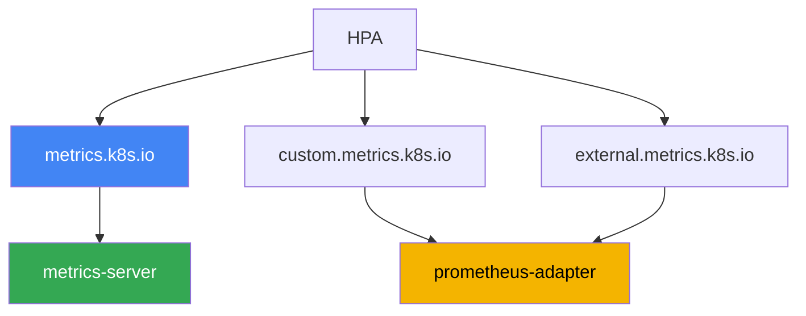
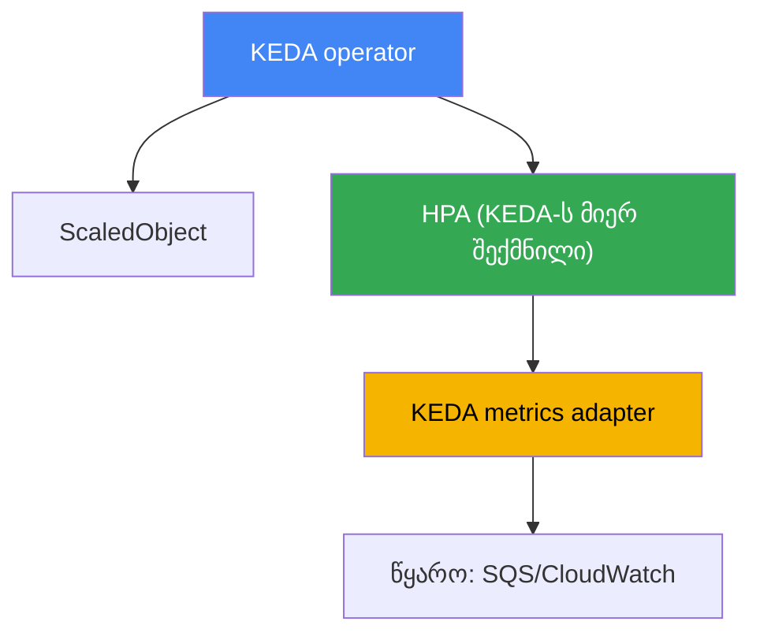

[Русская версия](ru.md) · [Eng version](en.md) · [Versión en español](es.md) · [Version française](fr.md) · [Deutsche Version](de.md) · [繁體中文版](tw.md) · [日本語版](jp.md)
# თავი 35. აპლიკაციების ავტომასშტაბირება: HPA, გარე მეტრიკები, KEDA

> **რა არის შემდეგ.** 33-ე და 34-ე თავებმა მოგვცა მეტრიკები და ლოგები, დაკვირვებადობის ორი
> საყრდენი. აქ მეტრიკებს პრაქტიკულად გამოვიყენებთ: თავად აპლიკაციებს დავამასშტაბირებთ, ანუ
> დატვირთვის მიხედვით პოდების რეპლიკების რაოდენობას შევცვლით. მომიჯნავე თემები სხვა თავებშია:
> ამ პოდებისთვის ნოდების მასშტაბირება (Cluster Autoscaler, Karpenter) - თავები 11 და 12;
> საიდან მოდის მეტრიკები (metrics-server, Prometheus) - თავი 33; პოდის ვერტიკალური ზომების
> შერჩევა (requests/limits, VPA) - თავი 14; ვიწრო ადგილების მოსაძებნად ტრეისინგი - თავი 36.
> აქ მხოლოდ ერთ საკითხს განვიხილავთ: როგორ ვაიძულოთ რეპლიკების რაოდენობა რეალურ დატვირთვას
> მიჰყვეს, მათ შორის ისეთ მოვლენებსაც, რომლებსაც CPU-ზე დაფუძნებული HPA ვერ ხედავს.

## 35.1. „რიგი იზრდება, პოდებს კი სძინავთ“

გვაქვს რიგის დამმუშავებელი: პოდები Amazon SQS-დან შეტყობინებებს კითხულობენ და მათზე გარკვეულ
სამუშაოს ასრულებენ. რეპლიკების რაოდენობა სამზეა დაფიქსირებული. იწყება დატვირთვის მკვეთრი ზრდა
და პროდიუსერები ათიათასობით შეტყობინებას აგზავნიან. მორიგე ინჟინერი რიგსა და პოდებს ამოწმებს:

```bash
# რიგში დაუმუშავებელი შეტყობინებები გროვდება
aws sqs get-queue-attributes --queue-url "$Q" \
  --attribute-names ApproximateNumberOfMessagesVisible
# "ApproximateNumberOfMessagesVisible": "48213"

kubectl get hpa worker
# NAME     REFERENCE           TARGETS       MINPODS  MAXPODS  REPLICAS
# worker   Deployment/worker   12%/70%       3        20       3
```

რიგი იზრდება, დაყოვნება მატულობს, HPA კი სამ რეპლიკას ინარჩუნებს და მასშტაბირებას არ აპირებს.
მიზეზი `TARGETS` სვეტში ჩანს: HPA CPU-ზეა მორგებული, მისი გამოყენება კი 70%-იანი ზღვრის
პირობებში მხოლოდ 12%-ია. პოდი დროის უმეტეს ნაწილს ქსელისა და მონაცემთა ბაზის პასუხს ელოდება,
ანუ ეს I/O-bound დატვირთვაა და CPU დაკავებული არ არის. მეტრიკა, რომელიც გადატვირთვას რეალურად
აღწერს, რიგის სიღრმეა, CPU-ზე დაფუძნებული HPA კი მას საერთოდ ვერ ხედავს.

ღამით საპირისპირო პრობლემა გვაქვს. შეტყობინებები არ არის, მაგრამ სამი რეპლიკა მაინც მუშაობს
და რესურსებს ხარჯავს: ჩვეულებრივ HPA-ს Deployment-ის ნულამდე შემცირება არ შეუძლია. რეპლიკების
ფიქსირებული რაოდენობა ყოველთვის წამგებიანია: დატვირთვის მკვეთრი ზრდისას გვაქვს გადატვირთვა და
შეფერხებები, უმოქმედობისას კი ფულის ფლანგვა. შემდეგ თანმიმდევრულად განვიხილავთ, როგორ მუშაობს
HPA და რატომ აგვიანებს CPU მეტრიკა; რა ტიპის მეტრიკების გამოყენება შეუძლია მას; და რატომ
იყენებენ მოვლენებზე დაფუძნებული დატვირთვებისთვის KEDA-ს, რომელიც რიგის სიღრმის მიხედვით
მასშტაბირდება და ნულამდე ჩამოდის.

## 35.2. HPA: რას აკეთებს და სად არის მისი ზღვარი

HorizontalPodAutoscaler არის control plane-ის კონტროლერი, რომელიც პერიოდულად არგებს
Deployment-ის (ან StatefulSet-ის, ReplicaSet-ის) რეპლიკების რაოდენობას დაკვირვებად მეტრიკას.
ფორმულა მარტივია: სასურველი რეპლიკები = მიმდინარე რეპლიკები × (მეტრიკის მიმდინარე მნიშვნელობა /
სამიზნე მნიშვნელობა). თუ CPU-ს სამიზნე 70%-ია, ფაქტობრივი მაჩვენებელი კი 140%, HPA პოდების
რაოდენობას გააორმაგებს. საბაზისო მექანიზმი CKA-დან უკვე იცით, ამიტომ აქ მხოლოდ ექსპლუატაციისთვის
სპეციფიკურ საკითხებს განვიხილავთ.

რესურსულ მეტრიკებს (CPU და მეხსიერება) HPA იღებს Metrics API-დან (`metrics.k8s.io`), რომელსაც
metrics-server აწვდის (თავი 33). თუ metrics-server არ არის, `TARGETS` აჩვენებს `<unknown>`-ს და
CPU-ზე დაფუძნებული HPA საერთოდ არ მუშაობს. როცა HPA „დუმს“, პირველად სწორედ ამას ამოწმებენ.

რეპლიკების ყოველი მცირე რყევისას ცვლილების თავიდან ასაცილებლად HPA-ს აქვს სტაბილიზაციის
`behavior` სექცია:

- `stabilizationWindowSeconds` - დროის ფანჯარა, რომლის განმავლობაშიც სასურველი რეპლიკების
  მაქსიმალური რაოდენობა აიღება; ის რყევებს ასწორებს და დატვირთვის ხანმოკლე ვარდნისას პოდების
  სწრაფად შემცირებას არ უშვებს. ნაგულისხმევად scaleDown-ის ფანჯარა 300 წამია, scaleUp-ის კი 0.
- `policies` - სიჩქარის შეზღუდვები: მოცემულ პერიოდში ზომა რამდენი პოდით ან რამდენი პროცენტით
  შეიძლება შეიცვალოს. ასე განისაზღვრება „ნელა ქვემოთ, სწრაფად ზემოთ“ ან პირიქით.

მთავარი შეზღუდვა 35.1 განყოფილებაში ჩანს: **I/O-bound დატვირთვებისთვის CPU მეტრიკა აგვიანებს
ან საერთოდ არაფერს გვატყობინებს**. რიგის დამმუშავებელი, პროქსი, მონაცემთა ბაზის მომლოდინე
აპლიკაცია შეიძლება სამუშაოთი გადატვირთული იყოს, მაგრამ CPU-ს არ ტვირთავდეს. მათი CPU-ს მიხედვით
მასშტაბირება უაზროა, რადგან სიგნალი დატვირთვასთან კორელაციაში არ არის. საჭიროა სხვა მეტრიკა:
მოთხოვნების რაოდენობა, რიგის სიღრმე ან მომხმარებლის lag. აქ ჩნდება კითხვა, საიდან მიიღებს HPA
მეტრიკას, რომელიც Metrics API-ში არ არის.

## 35.3. HPA-ს მეტრიკების სამი ტიპი და ადაპტერების ჯაჭვი

HPA-ს სამი ტიპის მეტრიკის წაკითხვა შეუძლია და მათი გარჩევა მნიშვნელოვანია: თითოეული ტიპის უკან
საკუთარი API და მომწოდებელი დგას.

| ტიპი HPA-ში | API | რას აღწერს | მაგალითი |
|---|---|---|---|
| Resource | `metrics.k8s.io` | სამიზნე პოდების CPU/მეხსიერება | საშუალო CPU 70% |
| Pods / Object | `custom.metrics.k8s.io` | კლასტერის ობიექტების მეტრიკები | პოდის requests-per-second |
| External | `external.metrics.k8s.io` | კლასტერის გარეთა მეტრიკები | SQS რიგის სიღრმე |

- **Resource** - CPU და მეხსიერება metrics-server-იდან. ეს ნაგულისხმევი და ყველაზე მარტივი
  შემთხვევაა.
- **Pods** და **Object** - კლასტერის ობიექტების „მორგებული“ მეტრიკები: მოთხოვნების რაოდენობა
  წამში თითო პოდზე, შიდა რიგის სიგრძე, Prometheus-ის მონაცემებით მიღებული მნიშვნელობა. ისინი
  `custom.metrics.k8s.io`-ის მეშვეობით გადაიცემა.
- **External** - მეტრიკები, რომლებიც კლასტერის ობიექტებთან საერთოდ არ არის დაკავშირებული:
  SQS რიგის სიღრმე, Kafka topic-ში შეტყობინებების რაოდენობა, CloudWatch-ის მნიშვნელობა. ისინი
  `external.metrics.k8s.io`-ის მეშვეობით გადაიცემა.

`Resource`-თან დაკავშირებული ერთი ნიუანსი განსაკუთრებით მნიშვნელოვანია EKS-ში, სადაც პოდი
იშვიათად შედგება მხოლოდ ერთი კონტეინერისგან. ამ ტიპში უტილიზაცია გამოითვლება **მთლიანი პოდის
მიხედვით**: ყველა კონტეინერის მოხმარების ჯამი მათი requests-ის ჯამის მიმართ. ამიტომ sidecar,
service mesh proxy, ლოგების აგენტი ან Vault agent მეტრიკას ბუნდოვანს ხდის: აპლიკაციას უკვე უჭირს,
მაგრამ პოდის საშუალო მაჩვენებელი ჯერ კიდევ შორსაა ზღვრისგან. ეს გვარდება `ContainerResource`
ტიპით, რომელიც გადაწყვეტილებას ერთ კონტეინერს უკავშირებს:

```yaml
metrics:
  - type: ContainerResource
    containerResource:
      name: cpu
      container: app          # ვითვლით მხოლოდ აპლიკაციის კონტეინერს
      target:
        type: Utilization
        averageUtilization: 70
```

მთავარი მომენტი: თავად Kubernetes ამ ორ გაფართოებულ API-ს არ ახორციელებს. მათ რეგისტრაციას
აკეთებს **ადაპტერი**, ცალკე კომპონენტი, რომელიც API აგრეგატორს უერთდება და HPA-ს მოთხოვნებს
პასუხობს. ტიპური ადაპტერია **prometheus-adapter**: ის Prometheus-იდან მონაცემებს იღებს,
`custom.metrics.k8s.io`-ის მეტრიკებად გარდაქმნის (და სურვილის შემთხვევაში
`external.metrics.k8s.io`-ის მეტრიკებადაც) და mapping-ის წესების მიხედვით HPA-ს გადასცემს.
ჯაჭვი ასეთია: აპლიკაცია გასცემს მეტრიკას, Prometheus აგროვებს მას, prometheus-adapter აქვეყნებს
metrics API-ში, ხოლო HPA კითხულობს და რეპლიკების რაოდენობას ითვლის.



სირთულეც გულწრფელად უნდა აღვნიშნოთ: „Prometheus + prometheus-adapter + mapping-ის წესები“
რთულად მოსაწყობი კომბინაციაა. საჭიროა განისაზღვროს, PromQL-ის რომელი არჩევანი შეესაბამება HPA-ს
რომელ მეტრიკას, გაკონტროლდეს სახელები და ჭდეები, გამოკვლეულ იქნას `TARGETS`-ში `<unknown>`.
ერთი მორგებული მეტრიკისთვის ეს გამართლებულია, მაგრამ როგორც კი წყაროები მრავლდება და ნულამდე
შემცირებაც გვჭირდება, ხელით მართული ადაპტერი ტვირთად იქცევა. სწორედ აქ გამოდის სცენაზე KEDA.

## 35.4. KEDA: მოვლენებზე დაფუძნებული ავტომასშტაბირება

KEDA (Kubernetes Event-Driven Autoscaling) არის HPA-ს თავზე აგებული ფენა მოვლენების მიხედვით
მასშტაბირებისთვის. იდეა ასეთია: გარე მეტრიკების ადაპტერების ხელით დაყენების ნაცვლად მოვლენის
წყაროს დეკლარაციულად აღწერთ, KEDA კი თავად აწვდის მეტრიკას HPA-ს და მართავს მას. KEDA
კლასტერში ყენდება, ჩვეულებრივ Helm chart-ის მეშვეობით, და რამდენიმე კომპონენტსა და საკუთარ
CRD-ებს ამატებს.

მთავარი რესურსია **ScaledObject**: ის თქვენს Deployment-ზე მიუთითებს და მასშტაბირების
ტრიგერებს აღწერს. ფონური ამოცანებისთვის არსებობს **ScaledJob**, რომელიც Deployment-ის
რეპლიკების ნაცვლად სამუშაოს ნაწილებისთვის პარალელური Job-ების რაოდენობას მასშტაბირებს.
მეტრიკის წყარო **scaler**-ის მეშვეობით განისაზღვრება; KEDA-ს ათეულობით scaler აქვს და მათ
შორის ზუსტად ისინიც არის, რომლებიც 35.1 განყოფილებაში გვაკლდა:

- `aws-sqs-queue` - Amazon SQS რიგის სიღრმე;
- `aws-cloudwatch` - Amazon CloudWatch-ის ნებისმიერი მეტრიკა;
- `prometheus` - PromQL არჩევანის შედეგი (მათ შორის Amazon Managed Prometheus-იდან, თავი 33);
- `kafka` - მომხმარებლის lag; `cron` - განრიგი; და მრავალი სხვა.

გამართვისთვის მნიშვნელოვანია გვესმოდეს, როგორ მუშაობს ეს შიგნიდან. KEDA HPA-ს **არ ცვლის**,
არამედ მისი მეშვეობით მუშაობს:



- **operator** აკვირდება ScaledObject-ს და თითოეული მათგანისთვის ჩვეულებრივ HPA-ს ქმნის და
  მართავს.
- KEDA-ს **metrics adapter** არეგისტრირებს `external.metrics.k8s.io`-ს და მასში გასცემს
  მნიშვნელობებს, რომლებსაც scaler წყაროდან ითხოვს. ამგვარად, რეპლიკების მთელ არითმეტიკას
  კვლავ HPA ასრულებს, KEDA კი მხოლოდ მეტრიკას აწვდის. ამიტომ `kubectl get hpa` აჩვენებს HPA-ს
  სახელით `keda-hpa-...`.

HPA-ს დამოუკიდებლად არ შეუძლია და KEDA-ს ხშირად სწორედ ამისთვის იყენებენ: **scale-to-zero**.
როცა მოვლენები არ არის, ანუ რიგი ცარიელია ან მოთხოვნების რაოდენობა ნულია, KEDA Deployment-ს
ნულ რეპლიკამდე ამცირებს, ხოლო პირველი მოვლენისას კვლავ ზრდის. სტაბილურ ვერსიებში ჩვეულებრივ
HPA-ს ეს არ შეუძლია: ის ერთი ან მეტი რეპლიკით მუშაობს. დიაპაზონი განისაზღვრება ველებით
`minReplicaCount` (შეიძლება იყოს 0) და `maxReplicaCount`.

SQS-ისა და CloudWatch-ის scaler-ებს AWS-ზე წვდომა გასაღებებით კი არა, IAM-ის მეშვეობით ეძლევა.
KEDA იყენებს საკუთარი ოპერატორის როლს ან, რაც უფრო სწორია, ცალკე როლს თითოეული ტრიგერისთვის
**TriggerAuthentication** რესურსისა და `aws` პროვაიდერის მეშვეობით. როლი ServiceAccount-ს
IRSA-ს ან Pod Identity-ს საშუალებით უკავშირდება (თავები 16 და 17), ისევე როგორც სხვა
დატვირთვებისთვის. ამგვარად, თითოეული scaler იღებს ზუსტად მისთვის საჭირო უფლებებს, მაგალითად
`sqs:GetQueueAttributes`-ს, საერთო გასაღებების გარეშე.

```yaml
# ScaledObject: worker-ის მასშტაბირება SQS რიგის სიღრმის მიხედვით, ნულამდე
apiVersion: keda.sh/v1alpha1
kind: ScaledObject
metadata:
  name: worker
spec:
  scaleTargetRef:
    name: worker            # Deployment-ის სახელი
  minReplicaCount: 0        # scale-to-zero, როცა რიგი ცარიელია
  maxReplicaCount: 20
  triggers:
  - type: aws-sqs-queue
    authenticationRef:
      name: keda-aws         # TriggerAuthentication-ზე მითითება
    metadata:
      queueURL: https://sqs.eu-central-1.amazonaws.com/111122223333/jobs
      queueLength: "10"      # თითო პოდზე შეტყობინებების სამიზნე რაოდენობა
      awsRegion: eu-central-1
```

`ScaledObject`-ის ორ ველს მაგალითებში ჩვეულებრივ გამოტოვებენ, თუმცა production-ში მათ დიდი
მნიშვნელობა აქვს. **`pollingInterval`** (ნაგულისხმევად 30 წამი) განსაზღვრავს, რამდენად ხშირად
კითხავს KEDA წყაროს, სანამ რეპლიკების რაოდენობა ნულია; ერთი ან მეტი რეპლიკის შემთხვევაში
მეტრიკას უკვე თავად HPA ითხოვს საკუთარი პერიოდულობით. **`cooldownPeriod`** (ნაგულისხმევად
300 წამი) განსაზღვრავს, რამდენ ხანს უნდა დაველოდოთ ტრიგერის ბოლო აქტივობის შემდეგ ნულამდე
შემცირებამდე; ის მოქმედებს **მხოლოდ scale-to-zero-სთვის**, ხოლო N-დან minReplicaCount-მდე
ჩვეულებრივ შემცირებას HPA მართავს და მის დასარეგულირებლად `behavior`-ში სტაბილიზაციის ფანჯრებს
იყენებენ. რიგებისთვის ზედმეტად მოკლე cooldown „ხერხის კბილებს“ ქმნის: პოდი გაეშვა, დაამუშავა
პაკეტი, ნულამდე შემცირდა და ერთი წუთის შემდეგ ისევ ცივი გაშვება დასჭირდა.

აქედანვე მოდის პრობლემა, რომელიც ScaledObject-ების რაოდენობის ზრდისას ჩნდება: **თითოეული
ტრიგერი AWS API-ის გამოძახებებს ნიშნავს**. ნაგულისხმევი ინტერვალით ათეულობით `aws-sqs-queue`
და `aws-cloudwatch` ობიექტი `GetQueueAttributes`-ისა და `GetMetricData`-ს გამოძახებების ნაკადს
ქმნის და AWS-ის მოთხოვნების ლიმიტს აღწევს. სიმპტომი დამახასიათებელია: HPA-ს `TARGETS` აჩვენებს
`<unknown>`-ს, რეპლიკები აღარ იცვლება, KEDA operator-ის ლოგებში კი throttling-ის შეცდომები ჩანს.
პრობლემას სამი გზით ამსუბუქებენ: არაკრიტიკული ტრიგერებისთვის ზრდიან `pollingInterval`-ს,
რთავენ `useCachedMetrics: true`-ს, რათა მნიშვნელობა polling interval-ის ფარგლებში ხელახლა
გამოიყენონ, და ადგენენ `fallback` სექციას. ამ შემთხვევაში წყაროს მიუწვდომლობისას KEDA მეტრიკის
დაკარგვის ნაცვლად რეპლიკების წინასწარ განსაზღვრულ რაოდენობას ინარჩუნებს.

## 35.5. ვინ რას მასშტაბირებს: არ აურიოთ სამი ღერძი

Kubernetes-ში ავტომასშტაბირება სამ დამოუკიდებელ ღერძზე მიმდინარეობს და მათ ხშირად ურევენ.
HPA და KEDA მხოლოდ პირველ ღერძზე მუშაობენ.

| ინსტრუმენტი | ღერძი | რას ცვლის | თავი |
|---|---|---|---|
| HPA, KEDA | ჰორიზონტალურად, პოდები | Deployment-ის რეპლიკების რაოდენობა | ეს თავი |
| VPA | ვერტიკალურად, პოდი | ერთი პოდის requests/limits | 14 |
| Cluster Autoscaler, Karpenter | ინფრასტრუქტურა | ნოდების რაოდენობა და ტიპი | 11, 12 |

ღერძებს შორის კავშირი პირდაპირია და მისი მთლიანად დანახვა მნიშვნელოვანია. დატვირთვის მიხედვით
HPA ან KEDA რეპლიკებს ამატებს, მაგრამ ახალი პოდები სადღაც უნდა განთავსდეს. თუ თავისუფალი ნოდები
არ არის, პოდები `Pending` მდგომარეობაში რჩება, შემდეგ კი **Karpenter ან Cluster Autoscaler**
(თავები 11 და 12) ხედავს განუთავსებელ პოდებს და მათთვის ნოდებს ამატებს. დატვირთვის შემცირებისას
პირიქით ხდება: HPA/KEDA რეპლიკებს შლის, ნოდები თავისუფლდება და Karpenter მათ consolidation-ის
მეშვეობით ამცირებს. აპლიკაციებისა და ნოდების მასშტაბირება წყვილად მუშაობს: პირველი
დატვირთვაზე რეაგირებს, მეორე კი პირველის მიერ შექმნილ ზეწოლაზე.

ერთი წყვილი ღერძი ცუდად ეწყობა ერთმანეთს და ამის ცოდნა დანერგვამდეა საჭირო: **HPA და VPA არ
შეიძლება ერთსა და იმავე რესურსულ მეტრიკაზე მიმართოთ**. მანკიერი წრის მექანიზმი მარტივია. HPA
ხედავს მაღალ CPU-ს და რეპლიკებს ამატებს, თითო პოდზე საშუალო დატვირთვა ეცემა, VPA ასკვნის, რომ
requests ზედმეტად მაღალია და ამცირებს მას; შემცირების შემდეგ იგივე დატვირთვა requests-ისგან
გაცილებით დიდ პროცენტს შეადგენს და HPA კვლავ რეპლიკებს ამატებს. რეპლიკების რაოდენობა და პოდის
ზომა ერთმანეთს გაუთავებლად ცვლის.

დაშვებულია სამი კომბინაცია და ყველა მათგანი ინსტრუმენტებს სხვადასხვა სიგნალზე ანაწილებს: VPA
`updateMode: "Off"` რეჟიმში, როცა ის მხოლოდ ზომების რეკომენდაციებს ითვლის, გადაწყვეტილებას კი
ადამიანი იღებს (თავი 14); VPA და HPA **სხვადასხვა** რესურსზე, მაგალითად VPA მეხსიერებაზე და HPA
CPU-ზე; და პრაქტიკაში ყველაზე მოსახერხებელი ვარიანტი, როცა VPA requests-ს მართავს, HPA ან KEDA
კი რეპლიკებს მორგებული და გარე მეტრიკების, ანუ RPS-ის, რიგის სიღრმის ან მომხმარებლის lag-ის
მიხედვით მასშტაბირებს.

აქედან გამომდინარეობს ექსპლუატაციის ტიპური შეცდომა: HPA გამართულია და რეპლიკებს სწორად ამატებს,
მაგრამ ნოდების მასშტაბირება არ არსებობს. პოდები `Pending` მდგომარეობაში გროვდება და რეპლიკების
ზრდას შედეგი არ მოაქვს. ან პირიქით: KEDA Deployment-ს ნულამდე ამცირებს, მისი ნოდი კი არ
იკეცება, რადგან მას სხვა პოდი იკავებს. კითხვაზე „რატომ არ მასშტაბირდება?“ პასუხის ძებნისას
ყოველთვის უნდა განისაზღვროს, სამი ღერძიდან რომელზეა შეფერხება.

## 35.6. როდის HPA და როდის KEDA

საბოლოოდ ორივე ინსტრუმენტი ერთსა და იმავე HPA მექანიზმს მართავს, ამიტომ არჩევანი მეტრიკის
წყაროსა და scale-to-zero-ს საჭიროებას ეხება და არა იმას, „რომელი უფრო ძლიერია“.

| სიტუაცია | ინსტრუმენტი | რატომ |
|---|---|---|
| მასშტაბირება CPU-ს ან მეხსიერების მიხედვით | HPA | რესურსული მეტრიკები metrics-server-ში უკვე არის |
| ერთი მზა მორგებული მეტრიკა | HPA + prometheus-adapter | ერთი ადაპტერი საკმარისია |
| მოვლენებზე დაფუძნებული დატვირთვა, რიგები | KEDA | მზა scaler-ები SQS-ის, Kafka-სა და CloudWatch-ისთვის |
| საჭიროა scale-to-zero | KEDA | ჩვეულებრივი HPA ნულამდე არ ჩამოდის |
| ბევრი სხვადასხვა წყარო | KEDA | თითოეულისთვის ცალკე ადაპტერის გაშვება არ არის საჭირო |
| მარტივი კლასტერი, მინიმალური CRD | HPA | ნაკლები კომპონენტი და ნაკლები საექსპლუატაციო სამუშაო |

მოკლე წესი: თუ CPU/მეხსიერება ან ერთი მზა მეტრიკა საკმარისია, სუფთა HPA გამოიყენეთ. ის უფრო
მარტივია და ზედმეტ კომპონენტებს არ მოითხოვს. როგორც კი ჩნდება მოვლენები, რიგები, scale-to-zero
ან რამდენიმე გარე წყარო, გამოიყენეთ KEDA, რადგან სწორედ ამისთვისაა შექმნილი და ხელით სამართავი
ადაპტერების სირთულეს გვაშორებს. CPU-ს მიხედვით ჩვეულებრივი მასშტაბირებისთვის KEDA-ს დაყენება
ზედმეტი სირთულეა.

## 35.7. როგორ იყენებენ ამას production-ში

- **მასშტაბირებისთვის იყენებენ მეტრიკას, რომელიც დატვირთვას აღწერს.** ვებაპლიკაციისთვის ეს
  ხშირად RPS ან დაყოვნებაა, დამმუშავებლებისთვის კი რიგის სიღრმე ან მომხმარებლის lag და არა CPU.
  CPU-ს ტოვებენ იქ, სადაც დატვირთვის შეზღუდვა მართლაც პროცესორია.
- **ნაგულისხმევად HPA-ს იყენებენ, მოვლენებისთვის კი KEDA-ს.** მხოლოდ CPU-ს გამო KEDA
  კლასტერში არ შეაქვთ; მას ამატებენ, როცა ჩნდება რიგები, გარე წყაროები ან საჭიროა scale-to-zero.
- **აწყობენ `behavior`-ს და არა მხოლოდ ზღვარს.** სტაბილიზაციის ფანჯრებისა და policies-ის
  მეშვეობით სწრაფი ზრდა და ნელი შემცირება, ან პირიქით, გვიცავს „ხერხის კბილებისგან“, ანუ
  რეპლიკების რაოდენობის მუდმივი ცვლილებისგან.
- **scaler-ებს AWS-ზე წვდომას როლებით აძლევენ და არა გასაღებებით.** TriggerAuthentication
  `aws` პროვაიდერით და IRSA ან Pod Identity (თავები 16 და 17), რიგზე ან მეტრიკაზე მინიმალური
  უფლებებით.
- **scale-to-zero-ს გააზრებულად რთავენ.** უმოქმედობისას ის რესურსებს ზოგავს, მაგრამ ცივ
  გაშვებას ამატებს: უმოქმედობის შემდეგ პირველ მოვლენას პოდის გაშვებისთვის ლოდინი მოუწევს.
  დაყოვნებისადმი მგრძნობიარე API-ებისთვის `minReplicaCount` ხშირად ნულზე მეტია.
- **ამოწმებენ, რომ ნოდები პოდებს ეწევა.** HPA/KEDA უსარგებლოა, თუ მის ქვეშ Karpenter ან
  Cluster Autoscaler არ მუშაობს; წინააღმდეგ შემთხვევაში ახალი რეპლიკები `Pending`-ში რჩება.
- **HPA-სა და VPA-ს სხვადასხვა სიგნალზე ანაწილებენ.** ერთსა და იმავე რესურსს ორივეს არ
  აძლევენ: VPA ან რეკომენდაციებისთვის `updateMode: "Off"` რეჟიმშია, ან requests-ს მართავს,
  ხოლო რეპლიკები მორგებული მეტრიკებისა და რიგების მიხედვით მასშტაბირდება (თავი 14).
- **sidecar-ის მქონე პოდებში კონტეინერის მიხედვით მასშტაბირებენ.** მთელი პოდის `Resource`-ის
  ნაცვლად აპლიკაციის კონტეინერისთვის `ContainerResource` ტიპს იყენებენ, რადგან mesh proxy და
  აგენტები მეტრიკას ბუნდოვანს ხდის.
- **AWS API-ს throttling-ისგან იცავენ.** ათეულობით ScaledObject-ის შემთხვევაში ზრდიან
  `pollingInterval`-ს, რთავენ `useCachedMetrics`-ს და აწყობენ `fallback`-ს, რათა მიუწვდომელმა
  წყარომ HPA მეტრიკის ნაცვლად `<unknown>`-ით არ დატოვოს.

## 35.8. მინი-ლექსიკონი

- **HPA (HorizontalPodAutoscaler)** - კონტროლერი, რომელიც მეტრიკის მიხედვით Deployment-ის
  რეპლიკების რაოდენობას ცვლის.
- **Metrics API (`metrics.k8s.io`)** - რესურსული მეტრიკების (CPU/მეხსიერება) API,
  metrics-server-იდან.
- **custom.metrics.k8s.io** - HPA-სთვის კლასტერის ობიექტების მორგებული მეტრიკების API
  (Pods, Object).
- **external.metrics.k8s.io** - HPA-სთვის გარე მეტრიკების (რიგები, topic-ები) API
  (ტიპი External).
- **prometheus-adapter** - ადაპტერი, რომელიც Prometheus-ის მეტრიკებს custom/external API-ში
  აქვეყნებს.
- **behavior / stabilizationWindowSeconds** - HPA-ს სექცია, რომელიც სტაბილიზაციის ფანჯრებისა
  და policies-ის მეშვეობით მასშტაბირების სიჩქარესა და რყევებს ასწორებს.
- **KEDA** - მოვლენებზე დაფუძნებული ავტომასშტაბირების ზედნაშენი: HPA-ს მეტრიკებს აწვდის და
  მართავს მას.
- **ScaledObject** - KEDA-ს CRD, რომელიც Deployment-ის მასშტაბირების მიზანსა და ტრიგერებს
  აღწერს.
- **ScaledJob** - KEDA-ს CRD სამუშაოს ნაწილებისთვის პარალელური Job-ების რაოდენობის
  მასშტაბირებისთვის.
- **scaler** - KEDA-ს მეტრიკის წყარო: `aws-sqs-queue`, `aws-cloudwatch`, `prometheus`,
  `kafka`, `cron` და ათეულობით სხვა.
- **TriggerAuthentication** - KEDA-ს CRD ტრიგერის წვდომის პარამეტრებით; AWS-ისთვის `aws`
  პროვაიდერი IRSA-ს ან Pod Identity-ს მეშვეობით.
- **scale-to-zero** - უმოქმედობისას Deployment-ის ნულ რეპლიკამდე შემცირება; KEDA-ს შეუძლია,
  HPA-ს კი არა.
- **ContainerResource** - HPA-ს მეტრიკის ტიპი, რომელიც უტილიზაციას პოდის ყველა კონტეინერის
  ჯამის ნაცვლად ერთი კონტეინერის მიხედვით ითვლის; საჭიროა იქ, სადაც sidecar აპლიკაციის მეტრიკას
  ბუნდოვანს ხდის.
- **`pollingInterval` და `cooldownPeriod`** - KEDA-ს წყაროს გამოკითხვის პერიოდი (ნაგულისხმევად
  30 წამი) და ნულამდე შემცირებამდე ლოდინი (ნაგულისხმევად 300 წამი); მეორე მხოლოდ
  scale-to-zero-სთვის მოქმედებს.
- **`useCachedMetrics` და `fallback`** - მნიშვნელობის polling interval-ის ფარგლებში
  კეშირება და წყაროს მიუწვდომლობის შემთხვევაში რეპლიკების რაოდენობა; ერთად ამცირებს API-ის
  throttling-ისა და `TARGETS`-ში `<unknown>`-ის რისკს.

## 35.9. თავის შეჯამება

- რეპლიკების ფიქსირებული რაოდენობა ყოველთვის წამგებიანია: დატვირთვის მკვეთრი ზრდისას გვაქვს
  გადატვირთვა, უმოქმედობისას კი ფულის ფლანგვა. CPU-ზე დაფუძნებული HPA I/O-bound დატვირთვას ვერ
  შველის: რიგი იზრდება, CPU დაბალია, HPA კი დუმს.
- HPA რეპლიკებს ფორმულით „მიმდინარე × ფაქტობრივი/სამიზნე“ ცვლის; რესურსულ მეტრიკებს
  metrics-server-იდან იღებს, ხოლო `behavior`, `stabilizationWindowSeconds` და policies
  რყევებს ასწორებს.
- HPA სამი ტიპის მეტრიკას კითხულობს: Resource (`metrics.k8s.io`), Pods/Object
  (`custom.metrics.k8s.io`) და External (`external.metrics.k8s.io`); გაფართოებულ API-ებს
  ადაპტერი, ჩვეულებრივ prometheus-adapter, ახორციელებს.
- Prometheus-ისა და prometheus-adapter-ის ხელით აწყობილი კომბინაცია რთულად სამართავია და ბევრ
  წყაროსა და scale-to-zero-ზე ცუდად მასშტაბირდება.
- KEDA მოვლენის წყაროს ScaledObject/ScaledJob-ისა და scaler-ების მეშვეობით დეკლარაციულად
  აღწერს (`aws-sqs-queue`, `aws-cloudwatch`, `prometheus`, `kafka`, `cron` და სხვა).
- შიგნიდან KEDA HPA-ს არ ცვლის: operator თითოეული ScaledObject-ისთვის HPA-ს ქმნის, ხოლო KEDA-ს
  metrics adapter გარე მეტრიკას `external.metrics.k8s.io`-ის მეშვეობით აწვდის.
- KEDA-ს შეუძლია scale-to-zero, რაც ჩვეულებრივ HPA-ს არ შეუძლია; SQS-სა და CloudWatch-ზე
  წვდომა გაიცემა TriggerAuthentication-ის `aws` პროვაიდერით, IRSA-ს ან Pod Identity-ს
  მეშვეობით (თავები 16 და 17).
- მასშტაბირების სამი ღერძი არ აურიოთ: HPA/KEDA პოდების რეპლიკებია, VPA პოდის რესურსები
  (თავი 14), Cluster Autoscaler/Karpenter კი ნოდები (თავები 11 და 12); ისინი წყვილად მუშაობს.

## 35.10. როგორ გამოგადგებათ ეს რეალურ სამუშაოში

მორიგეობისას ავტომასშტაბირება ხშირად პირველი ეჭვმიტანილია, როცა სერვისი „ხან ითიშება, ხან
უმოქმედოდაა“. ჯერ ამოწმებენ `kubectl get hpa`-ს: `TARGETS` სვეტი დაუყოვნებლივ გვიჩვენებს,
ხედავს თუ არა HPA დატვირთვას ან წერია თუ არა `<unknown>` (metrics-server ან ადაპტერი არ არის).
თუ მეტრიკა არსებობს, მაგრამ რეპლიკები არ იზრდება, ამოწმებენ, ნოდების არარსებობის გამო პოდები
`Pending` მდგომარეობაში ხომ არ დარჩა: ნოდების მასშტაბირების გარეშე აპლიკაციების მასშტაბირება
არ მუშაობს. მოვლენებზე დაფუძნებული სერვისებისთვის ამას ემატება `kubectl get scaledobject` და
მისთვის `kubectl describe`: აქ ჩანს, პასუხობს თუ არა scaler და შეიქმნა თუ არა KEDA-ს მიერ
მართული HPA.

დაგეგმვისას არჩევანი ერთხელ და გააზრებულად კეთდება. განსაზღვრეთ მეტრიკა, რომელიც სერვისის
დატვირთვას რეალურად აღწერს, და ეს იშვიათად არის CPU. გადაწყვიტეთ, საჭიროა თუ არა scale-to-zero
და მზად ხართ თუ არა ცივი გაშვების ფასის გადასახდელად. მოვლენებზე დაფუძნებული დატვირთვებისთვის
დაგეგმეთ KEDA და AWS-ზე წვდომა როლებით, არა გასაღებებით. ყოველთვის შეამოწმეთ მეორე ღერძიც:
რეპლიკების ზრდას სამუშაო Karpenter ან Cluster Autoscaler უნდა ედგას საფუძვლად, წინააღმდეგ
შემთხვევაში ავტომასშტაბირება ლამაზი, მაგრამ უსარგებლო კონფიგურაცია დარჩება.

## 35.11. თვითშემოწმების კითხვები

1. რატომ არ მასშტაბირებს CPU-ზე დაფუძნებული HPA რიგის დამმუშავებელს, როცა რიგი იზრდება?
2. რა ფორმულით ითვლის HPA რეპლიკების სასურველ რაოდენობას და საიდან იღებს რესურსულ მეტრიკებს?
3. რას ნიშნავს `kubectl get hpa`-ს `TARGETS` სვეტში `<unknown>` და საიდან უნდა დაიწყოს
   პრობლემის გამოკვლევა?
4. რისთვის არის საჭირო `behavior` სექცია და რას აკეთებს `stabilizationWindowSeconds`?
5. რა სამი ტიპის მეტრიკას კითხულობს HPA და რომელ API-ს შეესაბამება თითოეული?
6. რით განსხვავდება custom.metrics.k8s.io და external.metrics.k8s.io და ვინ ახორციელებს მათ?
7. რას აკეთებს prometheus-adapter და რატომ მასშტაბირდება მასთან ხელით აწყობილი კომბინაცია
   ცუდად?
8. რას აღწერს ScaledObject და ScaledJob და რით განსხვავდება ისინი?
9. როგორ მუშაობს KEDA შიგნიდან და რატომ აჩვენებს `kubectl get hpa` HPA-ს KEDA-ს მუშაობისას?
10. რა არის scale-to-zero, რატომ არის მისთვის საჭირო KEDA და რა მინუსი აქვს მას დაყოვნებისადმი
    მგრძნობიარე სერვისებისთვის?
11. როგორ იღებს KEDA-ს scaler წვდომას SQS-ზე ან CloudWatch-ზე სტატიკური გასაღებების გარეშე?
12. რით განსხვავდება მასშტაბირების სამი ღერძი (HPA/KEDA, VPA, Cluster Autoscaler/Karpenter)?
13. როდის არის საკმარისი სუფთა HPA და როდის არის გამართლებული KEDA?
14. რატომ არ შეიძლება HPA-სა და VPA-ს ერთ რესურსულ მეტრიკაზე მიბმა და რომელი სამი კომბინაციაა
    დასაშვები?
15. პოდი აპლიკაციისა და service mesh proxy-სგან შედგება. რატომ გვაძლევს `Resource` არასწორ
    სურათს და რა უნდა გამოვიყენოთ მის ნაცვლად?
16. KEDA-ს მიერ შექმნილი HPA-ს `TARGETS`-ში გამოჩნდა `<unknown>`, ScaledObject კი სწორია.
    რა უნდა შემოწმდეს AWS API-ის მხარეს და რომელი სამი პარამეტრი ამცირებს რისკს?

## პრაქტიკა

ამ თემის საკურსო ლაბა: [ლაბა 124 - აპლიკაციების ავტომასშტაბირება: HPA, KEDA,
Prometheus](../../labs/124/README_GE.MD). მასში დააყენებთ kube-prometheus-stack-სა და KEDA-ს,
აღწერთ `ScaledObject`-ს `prometheus` scaler-ით, საკუთარი თვალით ნახავთ, რომ KEDA HPA-ს არ
ცვლის, არამედ ქმნის და მართავს ჩვეულებრივ `keda-hpa-*`-ს, შემდეგ აპლიკაციას სხვა პოდების
დატვირთვის მიხედვით დაასქეილებთ და სტაბილიზაციის ფანჯრის შემდეგ მინიმუმზე დაბრუნებას
დააკვირდებით; შემოწმება ხდება `check_result` ბრძანებით. გაშვება: `TASK=124 make run_eks_task`.

ავტომასშტაბირების მდგომარეობის შემოწმება ნებისმიერ სამუშაო კლასტერშიც სასარგებლოა. ჯერ ნახეთ,
რა არის საერთოდ კონფიგურირებული და ხედავს თუ არა HPA საკუთარ მეტრიკას:

```bash
# ყველა HPA და მათი მიზნები; ვუყურებთ TARGETS სვეტს
kubectl get hpa -A
# კონკრეტული HPA-ს დეტალები: მოვლენები, მეტრიკის მიმდინარე და სამიზნე მნიშვნელობა
kubectl describe hpa worker
```

შეამოწმეთ, გასცემს თუ არა კლასტერი გაფართოებულ metrics API-ებს. მათ გარეშე HPA custom/external
მეტრიკებს ვერ მიიღებს:

```bash
# რეგისტრირებულია თუ არა custom და external metrics API და რომელი adapter ემსახურება მათ
kubectl get apiservices | grep -E "custom.metrics|external.metrics"
```

თუ კლასტერში KEDA არის დაყენებული, ნახეთ მისი რესურსები და მის მიერ შექმნილი HPA-ები:

```bash
# KEDA-ს ობიექტები და მის მიერ შექმნილი HPA-ები (სახელები keda-hpa-* ფორმატით)
kubectl get scaledobject -A
kubectl get hpa -A | grep keda-hpa
```

შეადარეთ სრული სურათი: მასშტაბირდება თუ არა სერვისი იმ მეტრიკის მიხედვით, რომელიც მის
დატვირთვას აღწერს, თუ CPU-ს მიხედვით „ჩვევის გამო“; ხედავს თუ არა HPA მეტრიკას, თუ იქ
`<unknown>` წერია; და ნოდების ნაკლებობის გამო ახალი რეპლიკები `Pending` მდგომარეობაში ხომ არ
რჩება. საკურსო ლაბის გარდა, რეპოზიტორიაში არის KEDA-სა და Prometheus-ით ავტომასშტაბირების
ცალკე, არასაკურსო ლაბაც [ლაბორატორია 03](../../labs/03/README_GE.MD): ის განათავსებს Prometheus-ს, აყენებს KEDA-ს
და აპლიკაციას რეალური RPS-ის მიხედვით მასშტაბირებს, რაც მთელი ჯაჭვის პრაქტიკაში სანახავად
კარგი გზაა.

---
[სარჩევი](../README_GE.md) · [თავი 34](../34/ge.md) · [თავი 36](../36/ge.md)
