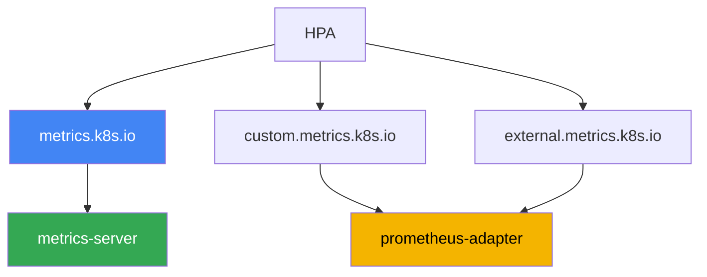
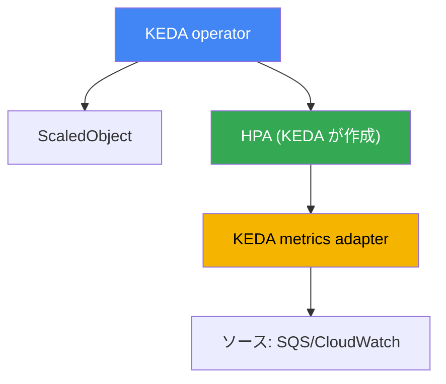

[ロシア語版](ru.md) · [英語版](en.md) · [スペイン語版](es.md) · [フランス語版](fr.md) · [ドイツ語版](de.md) · [ジョージア語版](ge.md) · [繁体字中国語版](tw.md)
# 第35章. アプリケーションの自動スケーリング: HPA、外部メトリクス、KEDA

> **次は何か。** 第33章と第34章では、オブザーバビリティの2本柱であるメトリクスとログを扱いました。ここではメトリクスを実際に利用します。すなわち、負荷に応じて Pod レプリカ数を変える、アプリケーション自体のスケーリングです。関連する話題は別の章で扱います。これらの Pod を配置するノードのスケーリング（Cluster Autoscaler、Karpenter）は第11章と第12章、メトリクスの取得元（metrics-server、Prometheus）は第33章、Pod の垂直サイジング（requests/limits、VPA）は第14章、ボトルネックを探すためのトレーシングは第36章です。ここで扱うのは一つです。実際の負荷、さらに CPU ベースの HPA では見えないイベントにもレプリカ数を追従させる方法です。

## 35.1. 「キューは増えているのに Pod は眠っている」

キュー処理プログラムがあります。Pod は Amazon SQS からメッセージを読み取り、何らかの処理を行います。レプリカ数は3に固定されています。急増が発生し、プロデューサーが数万件のメッセージを投入しました。オンコール担当者はキューと Pod を確認します。

```bash
# キューに未処理メッセージが蓄積している
aws sqs get-queue-attributes --queue-url "$Q" \
  --attribute-names ApproximateNumberOfMessagesVisible
# "ApproximateNumberOfMessagesVisible": "48213"

kubectl get hpa worker
# NAME     REFERENCE           TARGETS       MINPODS  MAXPODS  REPLICAS
# worker   Deployment/worker   12%/70%       3        20       3
```

キューは増え、ラグも大きくなっているのに、HPA は3レプリカを維持し、スケールする気配がありません。理由は `TARGETS` 列にあります。HPA は CPU に設定されており、閾値70%に対して負荷はわずか12%です。Pod は大半の時間をネットワークとデータベースからの応答待ちに費やすため、これは I/O-bound な負荷であり CPU は使用されません。実際に過負荷を表すメトリクスはキューの深さですが、CPU ベースの HPA にはまったく見えません。

逆の問題は夜間に起こります。メッセージがなくても3レプリカは動作し続け、リソースを消費します。通常の HPA は Deployment をゼロまで下げられません。レプリカ数の固定は常に不利です。急増時は過負荷と障害を招き、アイドル時は費用を浪費します。以降では順に、HPA の仕組みと CPU メトリクスが遅れる理由、HPA が扱えるメトリクス、そしてイベント駆動の負荷ではキューの深さに基づいてスケールしゼロまで下げられる KEDA を使う理由を説明します。

## 35.2. HPA: 何を行い、どこに限界があるか

HorizontalPodAutoscaler は control plane のコントローラーであり、観測対象のメトリクスに合わせて Deployment（または StatefulSet、ReplicaSet）のレプリカ数を定期的に調整します。式は単純です。希望レプリカ数 = 現在のレプリカ数 ×（現在のメトリクス値 / 目標値）。CPU の目標が70%、実測が140%なら、HPA は Pod 数を2倍にします。基本的な仕組みは CKA で学んでいるため、ここでは運用に固有の点だけを扱います。

HPA はリソースメトリクス（CPU とメモリ）を metrics-server が提供する Metrics API（`metrics.k8s.io`）から取得します（第33章）。metrics-server がなければ `TARGETS` は `<unknown>` を示し、CPU ベースの HPA はまったく機能しません。HPA が「沈黙」しているときに最初に確認する項目です。

HPA がノイズのたびにレプリカを変更しないよう、安定化のための `behavior` セクションがあります。

- `stabilizationWindowSeconds`: 希望レプリカ数の最大値を取る時間枠です。変動を平滑化し、短時間の負荷低下で Pod を縮退させないようにします。デフォルトでは scaleDown の枠は300秒、scaleUp は0です。
- `policies`: 指定期間に Pod 数または割合をどこまで変更できるかという速度制限です。「ゆっくり縮小、素早く拡大」またはその逆を設定できます。

主な限界は35.1節で見たとおりです。**CPU メトリクスは I/O-bound な負荷に対して遅れるか、何も示しません**。キュー処理プログラム、プロキシ、データベースを待つアプリケーションは、CPU を使用しなくても作業で過負荷になることがあります。CPU に基づくスケーリングは意味がありません。シグナルが負荷と相関しないためです。リクエスト数、キューの深さ、コンシューマーラグといった別のメトリクスが必要です。そこで、Metrics API に存在しないメトリクスを HPA がどこから得るのか、という疑問が生じます。

## 35.3. HPA の3種類のメトリクスとアダプターの連鎖

HPA は3種類のメトリクスを読み取れます。それぞれの背後には異なる API とプロバイダーがあるため、区別することが重要です。

| HPA の種類 | API | 表すもの | 例 |
|---|---|---|---|
| Resource | `metrics.k8s.io` | 対象 Pod の CPU/メモリ | 平均 CPU 70% |
| Pods / Object | `custom.metrics.k8s.io` | クラスターオブジェクトのメトリクス | Pod ごとの requests-per-second |
| External | `external.metrics.k8s.io` | クラスター外部のメトリクス | SQS のキューの深さ |

- **Resource**: metrics-server から得る CPU とメモリです。デフォルトで最も単純なケースです。
- **Pods** と **Object**: クラスターオブジェクトの「カスタム」メトリクスです。Pod ごとの毎秒リクエスト数、内部キューの長さ、Prometheus のデータに基づく値などです。`custom.metrics.k8s.io` を通じて提供されます。
- **External**: クラスターオブジェクトとはまったく結び付かないメトリクスです。SQS のキューの深さ、Kafka トピックのメッセージ数、CloudWatch の値などです。`external.metrics.k8s.io` を通じて提供されます。

`Resource` に関するもう一つの細部は、複数コンテナからなる Pod が少なくない EKS では重要です。この種類の使用率は**Pod 全体**で算出されます。すべてのコンテナの消費量の合計を requests の合計と比較します。そのため sidecar、service mesh のプロキシ、ログエージェント、Vault agent がメトリクスを薄めます。アプリケーションがすでに苦しんでいても、Pod 全体の平均はまだ閾値を大きく下回ることがあります。`ContainerResource` 型を使用し、判断を単一コンテナに結び付けることで解決できます。

```yaml
metrics:
  - type: ContainerResource
    containerResource:
      name: cpu
      container: app          # アプリケーションコンテナだけを計算する
      target:
        type: Utilization
        averageUtilization: 70
```

重要な点として、Kubernetes 自体はこの2つの拡張 API を実装していません。**アダプター**、すなわち API アグリゲーターへ接続し HPA からの要求に応答する別コンポーネントが登録します。典型的なアダプターは **prometheus-adapter** です。これは Prometheus からデータを取得し、`custom.metrics.k8s.io` のメトリクス（必要に応じて `external.metrics.k8s.io` も）に変換して、マッピングルールに従い HPA に提供します。連鎖は次のようになります。アプリケーションがメトリクスを公開し、Prometheus が収集し、prometheus-adapter がそれを metrics API に公開し、HPA が読み取ってレプリカ数を計算します。



率直に言えば、「Prometheus + prometheus-adapter + マッピングルール」という組み合わせの設定は面倒です。どの PromQL クエリーがどの HPA メトリクスに対応するかを記述し、名前とラベルを追跡し、`TARGETS` の `<unknown>` をデバッグする必要があります。カスタムメトリクスが一つなら正当化できますが、ソースが増えゼロまで下げたくなると、手動のアダプターは負担になります。ここで KEDA の出番です。

## 35.4. KEDA: イベント駆動型オートスケーリング

KEDA（Kubernetes Event-Driven Autoscaling）は、イベントに基づくスケーリングのための HPA の拡張です。外部メトリクスアダプターを手動で構築する代わりに、イベントソースを宣言的に記述すれば、KEDA が自ら HPA にメトリクスを提供して管理します。KEDA はクラスターにインストールされ（通常は Helm チャート）、いくつかのコンポーネントと独自の CRD を追加します。

主要なリソースは **ScaledObject** です。これは Deployment を参照し、スケーリングトリガーを記述します。バックグラウンドタスクには **ScaledJob** があり、Deployment のレプリカではなく、作業単位ごとの並列 Job 数をスケールします。メトリクスソースは **scaler** で指定します。KEDA には数十種類あり、その中には35.1節で不足していたものがまさに含まれます。

- `aws-sqs-queue`: Amazon SQS のキューの深さ
- `aws-cloudwatch`: 任意の Amazon CloudWatch メトリクス
- `prometheus`: PromQL クエリーの結果（Amazon Managed Prometheus を含む、第33章）
- `kafka`: コンシューマーラグ、`cron`: スケジュール、その他多数

トラブルシューティングのため、内部でどのように動作するかを理解することが重要です。KEDA は HPA を**置き換えるのではなく**、HPA を介して動作します。



- **operator** は ScaledObject を監視し、それぞれに対して通常の HPA を作成・管理します。
- KEDA の **metrics adapter** は `external.metrics.k8s.io` を登録し、scaler がソースからポーリングした値をそこへ提供します。つまり HPA は引き続きレプリカ数の算出をすべて行い、KEDA はメトリクスを提供するだけです。そのため `kubectl get hpa` には `keda-hpa-...` という名前の HPA が表示されます。

HPA 単体ではできず、KEDA がよく採用される理由は **scale-to-zero** です。イベントがないとき（キューが空、リクエストがゼロ）に、KEDA は Deployment をゼロレプリカまで下げ、最初のイベントで再び引き上げます。安定版の通常の HPA にはこれはできません。1レプリカ以上で動作します。範囲は `minReplicaCount`（0にできます）と `maxReplicaCount` フィールドで指定します。

SQS および CloudWatch scaler の AWS へのアクセスは、キーではなく IAM 経由で付与します。KEDA は operator のロールを使用するか、より適切には、`aws` プロバイダーを持つ **TriggerAuthentication** リソースを通じてトリガーごとに個別のロールを使用します。ロールは IRSA または Pod Identity（第16章と第17章）で ServiceAccount に関連付けられます。これは他のワークロードと同じ仕組みです。こうして各 scaler には、共有キーなしで必要な権限だけ（たとえば `sqs:GetQueueAttributes`）を与えられます。

```yaml
# ScaledObject: SQS キューの深さに応じて worker をゼロまでスケールする
apiVersion: keda.sh/v1alpha1
kind: ScaledObject
metadata:
  name: worker
spec:
  scaleTargetRef:
    name: worker            # Deployment の名前
  minReplicaCount: 0        # キューが空のときに scale-to-zero
  maxReplicaCount: 20
  triggers:
  - type: aws-sqs-queue
    authenticationRef:
      name: keda-aws         # TriggerAuthentication への参照
    metadata:
      queueURL: https://sqs.eu-central-1.amazonaws.com/111122223333/jobs
      queueLength: "10"      # Pod あたりの目標メッセージ数
      awsRegion: eu-central-1
```

`ScaledObject` には、例では省かれがちですが本番では大きく影響するフィールドが2つあります。**`pollingInterval`**（デフォルト30秒）は、レプリカがゼロの間に KEDA がソースをポーリングする間隔です。1レプリカ以上になると、メトリクスは HPA 自身がその周期で取得します。**`cooldownPeriod`**（デフォルト300秒）は、最後にトリガーが有効だった後でゼロに下げるまでの待機時間です。これは **scale-to-zero だけ**で機能します。N から minReplicaCount への通常の縮小は HPA が処理し、安定化ウィンドウを持つ `behavior` によって抑制します。キューに対する cooldown が短すぎると「のこぎり波」が生まれます。Pod が起動して一連のメッセージを処理し、ゼロになり、1分後に再びコールドスタートします。

ここには、ScaledObject の数が増えると顕在化する問題もあります。**各トリガーは AWS API 呼び出しです**。デフォルト間隔で `aws-sqs-queue` と `aws-cloudwatch` のオブジェクトが数十あると、`GetQueueAttributes` と `GetMetricData` の呼び出しが流れ、AWS のリクエスト制限に達します。症状は特徴的です。HPA の `TARGETS` は `<unknown>` を示し、レプリカは停止し、KEDA operator のログには throttling エラーが現れます。緩和策は3つです。重要度の低いトリガーでは `pollingInterval` を増やす、`useCachedMetrics: true` を有効にしてポーリング間隔内で値を再利用する、`fallback` セクションを設定してソースが利用できない場合にメトリクス喪失ではなく指定済みのレプリカ数を KEDA が維持するようにする、です。

## 35.5. 誰が何をスケールするか: 3つの軸を混同しない

Kubernetes のオートスケーリングは、独立した3つの軸で行われ、これらは常に混同されます。HPA と KEDA が扱うのは最初の軸だけです。

| ツール | 軸 | 変更するもの | 章 |
|---|---|---|---|
| HPA、KEDA | 水平、Pod | Deployment のレプリカ数 | 本章 |
| VPA | 垂直、Pod | 1つの Pod の requests/limits | 14 |
| Cluster Autoscaler、Karpenter | インフラストラクチャ | ノード数と種類 | 11、12 |

軸同士の関係は直接的であり、全体を見ることが重要です。HPA または KEDA は負荷に応じてレプリカを追加しますが、新しい Pod はどこかに配置される必要があります。空きノードがなければ、Pod は `Pending` となります。そのとき **Karpenter または Cluster Autoscaler**（第11章と第12章）が未配置の Pod を検知し、それら用のノードを追加します。負荷低下時には逆になります。HPA/KEDA がレプリカを削減し、ノードが空き、Karpenter が consolidation を通じてノードを縮退させます。つまりアプリケーションのスケーリングとノードのスケーリングは組で動作します。前者は負荷に反応し、後者は前者による圧力に反応します。

この軸の組み合わせには相性が悪いものがあり、導入前に知っておくべきです。**HPA と VPA を同じリソースメトリクスに向けることはできません**。悪循環の仕組みは単純です。HPA は CPU の高さを見てレプリカを追加し、Pod あたりの平均使用率が下がります。VPA は requests が過大だと判断して削減します。削減後は同じ負荷でも requests に対する割合が大幅に上がり、HPA が再びレプリカを追加します。レプリカ数と Pod サイズが互いを追い回し始めます。

許容される組み合わせは3つあり、いずれもツールを異なるシグナルに分離します。VPA を `updateMode: "Off"` にしてサイジング推奨だけを計算させ、人が決定する方法（第14章）。VPA と HPA を**異なる**リソース、たとえば VPA はメモリ、HPA は CPU に使う方法。そして実務で最も便利なのは、VPA が requests を維持し、HPA または KEDA が RPS、キューの深さ、コンシューマーラグのようなカスタム・外部メトリクスに基づきレプリカをスケールする方法です。

ここから典型的な運用ミスも生じます。HPA は設定済みで正常にレプリカを増やしているのにノードスケーリングがなく、Pod が `Pending` に蓄積し、レプリカを増やしても効果がない場合です。または逆に、KEDA が Deployment をゼロまで下げても、別の Pod が保持しているため、その下のノードは縮退しません。「なぜスケールしないのか」を調査するときは常に、3つの軸のどこが詰まっているかを特定します。

## 35.6. HPA を使うとき、KEDA を使うとき

両ツールは最終的に同じ HPA の仕組みを動かします。したがって選択は「どちらが強力か」ではなく、メトリクスソースと scale-to-zero の必要性に関するものです。

| 状況 | ツール | 理由 |
|---|---|---|
| CPU またはメモリによりスケールする | HPA | リソースメトリクスは metrics-server にすでにある |
| 用意済みのカスタムメトリクスが一つ | HPA + prometheus-adapter | アダプター一つで十分 |
| イベント駆動の負荷、キュー | KEDA | SQS、Kafka、CloudWatch 用の用意済み scaler |
| scale-to-zero が必要 | KEDA | 通常の HPA はゼロまで下げない |
| 異なるソースが多数ある | KEDA | ソースごとにアダプターを構築する必要がない |
| 単純なクラスター、最小限の CRD | HPA | コンポーネントが少なく、運用も少ない |

短いルールです。CPU/メモリまたは用意済みのメトリクス一つで足りるなら、より単純で余分なコンポーネントを持たない純粋な HPA を使います。イベント、キュー、scale-to-zero、複数の外部ソースが現れたら、それらのために作られ手動アダプターの手間をなくす KEDA を使います。通常の CPU ベースのスケーリングのために KEDA を導入するのは、不要な複雑さです。

## 35.7. 本番での適用方法

- **負荷を表すメトリクスでスケールする。** Web では多くの場合 RPS またはレイテンシー、処理プログラムでは CPU ではなくキューの深さまたはコンシューマーラグです。CPU は負荷が本当にプロセッサーを使い切る場合に用います。
- **デフォルトでは HPA、イベントには KEDA を使う。** CPU のためだけに KEDA をクラスターへ持ち込まず、キュー、外部ソース、または scale-to-zero が必要になったときに追加します。
- **閾値だけでなく `behavior` を設定する。** 安定化ウィンドウと policies により、急速な拡大と緩やかな縮小（またはその逆）を設定すると、レプリカ数が絶えず変動する「のこぎり波」を防げます。
- **scaler の AWS へのアクセスはキーではなくロールで与える。** `aws` プロバイダーを持つ TriggerAuthentication と IRSA または Pod Identity（第16章と第17章）を使用し、キューまたはメトリクスに対する最小権限を与えます。
- **scale-to-zero は意識して有効にする。** アイドル時のリソースを節約しますが、コールドスタートを追加します。アイドル後の最初のイベントは Pod の起動を待つ必要があります。レイテンシーが重要な API では、`minReplicaCount` をゼロより大きく保つことがよくあります。
- **ノードが Pod の増加に追従することを確認する。** HPA/KEDA の下に正常な Karpenter または Cluster Autoscaler がなければ意味がありません。なければ新しいレプリカは `Pending` のままです。
- **HPA と VPA を異なるシグナルに分離する。** 同じリソースを両者に渡しません。VPA は推奨用の `updateMode: "Off"` にするか、レプリカをカスタムメトリクスとキューでスケールしている間に requests を維持させます（第14章）。
- **sidecar を含む Pod ではコンテナ単位でスケールする。** Pod 全体の `Resource` ではなく、アプリケーションコンテナに対する `ContainerResource` 型を使います。そうしないと mesh のプロキシやエージェントがメトリクスを薄めます。
- **AWS API をスロットリングから守る。** ScaledObject が数十ある場合は `pollingInterval` を増やし、`useCachedMetrics` を有効にし、`fallback` を設定します。これによりソースが利用できず HPA がメトリクスの代わりに `<unknown>` を示すリスクを低減します。

## 35.8. ミニ用語集

- **HPA（HorizontalPodAutoscaler）**: メトリクスにより Deployment のレプリカ数を変更するコントローラー。
- **Metrics API（`metrics.k8s.io`）**: metrics-server が提供するリソースメトリクス（CPU/メモリ）の API。
- **custom.metrics.k8s.io**: HPA 用のクラスターオブジェクトのカスタムメトリクス（Pods、Object）の API。
- **external.metrics.k8s.io**: HPA 用の外部メトリクス（キュー、トピック、External 型）の API。
- **prometheus-adapter**: Prometheus メトリクスを custom/external API に公開するアダプター。
- **behavior / stabilizationWindowSeconds**: 安定化ウィンドウと policies により、スケーリングの速度と変動を平滑化する HPA セクション。
- **KEDA**: イベント駆動オートスケーリングの拡張。HPA にメトリクスを提供して管理する。
- **ScaledObject**: Deployment のスケール対象とトリガーを記述する KEDA CRD。
- **ScaledJob**: 作業単位ごとの並列 Job 数をスケールするための KEDA CRD。
- **scaler**: `aws-sqs-queue`、`aws-cloudwatch`、`prometheus`、`kafka`、`cron` など数十種類の KEDA メトリクスソース。
- **TriggerAuthentication**: トリガーのアクセスパラメーターを持つ KEDA CRD。AWS では IRSA または Pod Identity を通じた `aws` プロバイダーを使う。
- **scale-to-zero**: アイドル時に Deployment をゼロレプリカまで下げること。KEDA はできるが、HPA はできない。
- **ContainerResource**: 全コンテナの合計ではなく、Pod 内の1コンテナの使用率を計算する HPA メトリクス型。sidecar がアプリケーションメトリクスを薄める場所で必要。
- **`pollingInterval` と `cooldownPeriod`**: KEDA のソースポーリング周期（デフォルト30秒）とゼロに下げるまでの待機時間（デフォルト300秒）。後者は scale-to-zero にのみ適用される。
- **`useCachedMetrics` と `fallback`**: ポーリング間隔内の値のキャッシュと、ソースが利用できない場合のレプリカ数。合わせて API のスロットリングと `TARGETS` の `<unknown>` のリスクを下げる。

## 35.9. 章のまとめ

- レプリカ数の固定は常に不利です。急増時は過負荷、アイドル時は費用の浪費です。CPU ベースの HPA は I/O-bound な負荷を救えません。キューは増えても CPU は低く、HPA は沈黙します。
- HPA は「現在数 × 実測/目標」の式でレプリカを変更します。リソースメトリクスは metrics-server から得て、`stabilizationWindowSeconds` と policies を持つ `behavior` が変動を平滑化します。
- HPA は3種類のメトリクスを読み取ります。Resource（`metrics.k8s.io`）、Pods/Object（`custom.metrics.k8s.io`）、External（`external.metrics.k8s.io`）です。拡張 API は、通常 prometheus-adapter であるアダプターが実装します。
- Prometheus と prometheus-adapter の手動連携は設定が面倒で、多数のソースや scale-to-zero には適していません。
- KEDA は ScaledObject/ScaledJob と scaler（`aws-sqs-queue`、`aws-cloudwatch`、`prometheus`、`kafka`、`cron` など）を通じ、イベントソースを宣言的に記述します。
- 内部では KEDA は HPA を置き換えません。operator が各 ScaledObject に HPA を作成し、KEDA metrics adapter が `external.metrics.k8s.io` を通じて外部メトリクスを提供します。
- KEDA は通常の HPA にはない scale-to-zero ができます。SQS と CloudWatch へのアクセスは、IRSA または Pod Identity による `aws` プロバイダーを持つ TriggerAuthentication で付与します（第16章と第17章）。
- 3つのスケーリング軸を混同しないでください。HPA/KEDA は Pod レプリカ、VPA は Pod リソース（第14章）、Cluster Autoscaler/Karpenter はノード（第11章と第12章）を扱い、組で動作します。

## 35.10. 実際の業務での役立て方

オンコールでは、サービスが「落ちたり遊休になったりする」とき、オートスケーリングがよく疑われます。まず `kubectl get hpa` を見ます。`TARGETS` 列ですぐに、HPA が負荷を認識しているのか、それとも `<unknown>` なのか（metrics-server またはアダプターがない）が分かります。メトリクスがあるのにレプリカが増えない場合は、ノード不足で Pod が `Pending` になっていないかを確認します。ノードスケーリングなしのアプリケーションスケーリングは機能しません。イベント駆動のサービスでは `kubectl get scaledobject` とその `kubectl describe` も追加します。そこでは scaler が応答しているか、KEDA が作成した HPA が立ち上がったかを確認できます。

計画時には一度、意識して選択します。サービスの負荷を正直に表すメトリクスを決定します。それが CPU であることはまれです。scale-to-zero が必要か、コールドスタートという代償を払う準備があるかを決めます。イベント駆動の負荷には KEDA と、キーではなくロールによる AWS へのアクセスを組み込みます。そして常に第2の軸を確認します。レプリカ増加の下に動作する Karpenter または Cluster Autoscaler があることです。そうでなければオートスケーリングは見栄えがよいだけで役に立たない設定のままです。

## 35.11. 自己確認の質問

1. キューが増えているのに、CPU ベースの HPA がキュー処理プログラムをスケールしないのはなぜですか？
2. HPA はどの式で希望レプリカ数を計算し、リソースメトリクスをどこから取得しますか？
3. `kubectl get hpa` の `TARGETS` 列にある `<unknown>` は何を示し、調査はどこから始めますか？
4. `behavior` セクションはなぜ必要で、`stabilizationWindowSeconds` は何を行いますか？
5. HPA が読み取る3種類のメトリクスと、それぞれに対応する API は何ですか？
6. custom.metrics.k8s.io と external.metrics.k8s.io はどう異なり、誰が実装しますか？
7. prometheus-adapter は何を行い、手動連携がスケールしにくいのはなぜですか？
8. ScaledObject と ScaledJob は何を記述し、どう異なりますか？
9. KEDA は内部でどのように動作し、KEDA 使用時にも `kubectl get hpa` が HPA を示すのはなぜですか？
10. scale-to-zero とは何ですか？ なぜ KEDA で必要とされ、レイテンシーが重要なサービスではどのような欠点がありますか？
11. KEDA の scaler は静的キーなしで SQS または CloudWatch へのアクセスをどのように得ますか？
12. 3つのスケーリング軸（HPA/KEDA、VPA、Cluster Autoscaler/Karpenter）はどう異なりますか？
13. 純粋な HPA で十分なのはいつで、KEDA が正当化されるのはいつですか？
14. HPA と VPA を同じリソースメトリクスに設定できないのはなぜですか？ 許容される3つの組み合わせは何ですか？
15. Pod はアプリケーションと proxy service mesh から成ります。`Resource` が不正確な見方を与えるのはなぜで、代わりに何を使いますか？
16. KEDA が作成した HPA の `TARGETS` に `<unknown>` が現れ、ScaledObject は正しい状態です。AWS API 側で何を確認し、どの3つの設定がリスクを下げますか？

## 実践

このテーマのコースラボ: [ラボ124 - アプリケーションの自動スケーリング: HPA、KEDA、Prometheus](../../labs/124/README_JP.MD)。このラボでは kube-prometheus-stack と KEDA をインストールし、`prometheus` scaler を持つ `ScaledObject` を記述します。KEDA が HPA を置き換えるのではなく、通常の `keda-hpa-*` を作成して管理することを実際に確認します。次に、別の Pod の負荷を基にアプリケーションをスケールし、安定化ウィンドウを介して最小値へ戻る様子を観察します。検証は `check_result` コマンドで行います。起動は `TASK=124 make run_eks_task` です。

オートスケーリングの状態は、どの作業中クラスターでも取得できるようにしておくと便利です。まず、何が設定されているか、HPA が自身のメトリクスを認識しているかを確認します。

```bash
# すべての HPA とその目標。TARGETS 列を確認する
kubectl get hpa -A
# 特定の HPA の詳細: イベント、現在の値、メトリクスの目標値
kubectl describe hpa worker
```

クラスターが拡張 metrics API を提供しているか確認してください。これらがなければ、HPA は custom/external メトリクスを取得できません。

```bash
# カスタムおよび外部メトリクス API が登録済みか、どのアダプターが処理するか
kubectl get apiservices | grep -E "custom.metrics|external.metrics"
```

クラスターに KEDA がある場合は、そのリソースと作成した HPA を確認します。

```bash
# KEDA オブジェクトと、内部で作成した HPA（名前は keda-hpa-* 形式）
kubectl get scaledobject -A
kubectl get hpa -A | grep keda-hpa
```

状況を対応付けてください。サービスはその負荷を表すメトリクスでスケールしているか、それとも「慣習で」CPU に基づいているか。HPA はメトリクスを認識しているか、それとも `<unknown>` か。そして新しいレプリカはノード不足で `Pending` に留まっていないか。コースラボのほか、リポジトリには KEDA と Prometheus によるオートスケーリングのコース外ラボ（[ラボ 03](../../labs/03/README_JP.MD)）があります。これは Prometheus をデプロイし、KEDA をインストールし、実際の RPS に従ってアプリケーションをスケールします。チェーン全体を実際に見る良い方法です。

---
[目次](../README_JP.md) · [第34章](../34/jp.md) · [第36章](../36/jp.md)
