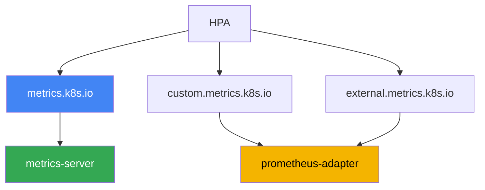
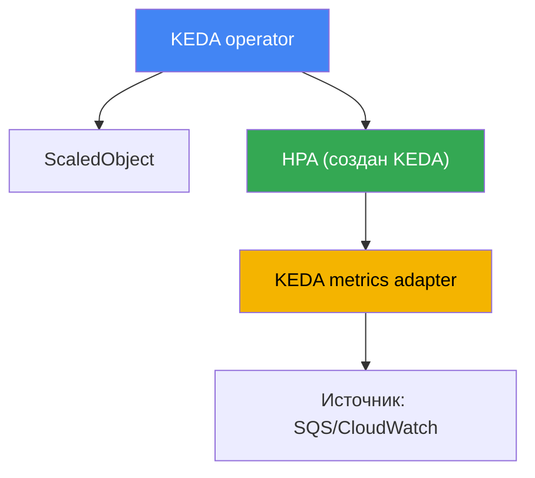

# Глава 35. Автомасштабирование приложений: HPA, внешние метрики, KEDA

> **Что дальше.** Главы 33 и 34 дали метрики и логи - две опоры наблюдаемости. Здесь мы
> используем метрики для дела: масштабируем сами приложения, то есть меняем число реплик
> подов под нагрузку. Смежное отдано другим главам: масштабирование нод под эти поды
> (Cluster Autoscaler, Karpenter) - главы 11 и 12; откуда берутся метрики (metrics-server,
> Prometheus) - глава 33; вертикальный сайзинг пода (requests/limits, VPA) - глава 14;
> трейсинг для поиска узких мест - глава 36. Здесь одно: как заставить число реплик
> следовать за реальной нагрузкой, в том числе за событиями, которых HPA по CPU не видит.

## 35.1. «Очередь растёт, а поды спят»

Есть обработчик очереди: поды читают сообщения из Amazon SQS и что-то с ними делают. Реплик
зафиксировано три. Приходит всплеск - продьюсеры залили десятки тысяч сообщений. Дежурный
смотрит на очередь и на поды:

```bash
# в очереди копятся необработанные сообщения
aws sqs get-queue-attributes --queue-url "$Q" \
  --attribute-names ApproximateNumberOfMessagesVisible
# "ApproximateNumberOfMessagesVisible": "48213"

kubectl get hpa worker
# NAME     REFERENCE           TARGETS       MINPODS  MAXPODS  REPLICAS
# worker   Deployment/worker   12%/70%       3        20       3
```

Очередь растёт, лаг увеличивается, а HPA держит три реплики и масштабировать не собирается.
Причина в колонке `TARGETS`: HPA настроен на CPU, а загрузка всего 12% при пороге 70%. Под
большую часть времени ждёт ответа от сети и базы - это I/O-bound нагрузка, CPU ей не занят.
Метрика, что реально описывает перегруз, - глубина очереди, а её HPA по CPU не видит вовсе.

Обратная беда - ночью. Сообщений нет, но три реплики всё равно крутятся и жгут ресурсы:
обычный HPA не умеет опускать Deployment до нуля. Фиксированное число реплик проигрывает
всегда: при всплеске - перегруз и отказы, в простое - трата денег. Дальше по порядку: как
работает HPA и почему CPU-метрика запаздывает; какие метрики он умеет; и почему для
событийных нагрузок берут KEDA, который масштабирует по глубине очереди и уходит в ноль.

## 35.2. HPA: что он делает и где у него предел

HorizontalPodAutoscaler - контроллер в control plane, который периодически подгоняет число
реплик у Deployment (или StatefulSet, ReplicaSet) под наблюдаемую метрику. Формула простая:
желаемые реплики = текущие × (текущее значение метрики / целевое). Для CPU при цели 70% и
факте 140% HPA удвоит число подов. Базовый механизм вы знаете по CKA, поэтому здесь только
то, что специфично для эксплуатации.

Ресурсные метрики (CPU и память) HPA берёт из Metrics API (`metrics.k8s.io`), который отдаёт
metrics-server (глава 33). Нет metrics-server - `TARGETS` показывает `<unknown>`, и HPA по
CPU не работает вовсе. Это первое, что проверяют, когда HPA «молчит».

Чтобы HPA не дёргал реплики на каждом шуме, у него есть секция `behavior` со стабилизацией:

- `stabilizationWindowSeconds` - окно, за которое берётся максимум желаемых реплик;
  сглаживает колебания и не даёт схлопывать поды на коротких провалах нагрузки. По умолчанию
  для scaleDown окно 300 секунд, для scaleUp - 0.
- `policies` - ограничения скорости: на сколько подов или процентов можно менять размер за
  заданный период. Так задают «плавный вниз, резкий вверх» или наоборот.

Главный предел виден в разделе 35.1: **CPU-метрика запаздывает или молчит для I/O-bound
нагрузок**. Обработчик очереди, прокси, приложение, ждущее базу, - все они бывают перегружены
работой, не нагружая CPU. Масштабировать их по CPU бессмысленно: сигнал не коррелирует с
нагрузкой. Нужна другая метрика - число запросов, глубина очереди, лаг консьюмера. И тут
возникает вопрос, откуда HPA возьмёт метрику, которой нет в Metrics API.

## 35.3. Три типа метрик HPA и цепочка адаптеров

HPA умеет читать метрики трёх видов, и различать их важно: за каждым стоит свой API и свой
поставщик.

| Тип в HPA | API | Что описывает | Пример |
|---|---|---|---|
| Resource | `metrics.k8s.io` | CPU/память подов цели | средний CPU 70% |
| Pods / Object | `custom.metrics.k8s.io` | метрики объектов кластера | requests-per-second пода |
| External | `external.metrics.k8s.io` | метрики извне кластера | глубина очереди SQS |

- **Resource** - CPU и память, из metrics-server. Это дефолтный и самый простой случай.
- **Pods** и **Object** - «кастомные» метрики объектов кластера: запросов в секунду на под,
  длина внутренней очереди, значение по данным Prometheus. Отдаются через
  `custom.metrics.k8s.io`.
- **External** - метрики, не связанные с объектами кластера вообще: глубина очереди SQS,
  число сообщений в топике Kafka, значение из CloudWatch. Отдаются через
  `external.metrics.k8s.io`.

Отдельная тонкость про `Resource`, важная в EKS, где под редко состоит из одного контейнера.
Утилизация в этом типе считается **по поду целиком**: сумма потребления всех контейнеров против
суммы их requests. Значит sidecar - proxy service mesh, агент логов, Vault agent - размывает
метрику: приложение уже задыхается, а средняя по поду ещё далеко от порога. Лечится типом
`ContainerResource`, который привязывает решение к одному контейнеру:

```yaml
metrics:
  - type: ContainerResource
    containerResource:
      name: cpu
      container: app          # считаем только контейнер приложения
      target:
        type: Utilization
        averageUtilization: 70
```

Ключевой момент: сам Kubernetes эти два расширенных API не реализует. Их регистрирует
**адаптер** - отдельный компонент, что подключается к API-агрегатору и отвечает на запросы
HPA. Типовой адаптер - **prometheus-adapter**: он берёт данные из Prometheus, превращает их в
метрики `custom.metrics.k8s.io` (и при желании `external.metrics.k8s.io`) и по правилам
маппинга отдаёт HPA. Цепочка получается такая: приложение отдаёт метрику - Prometheus её
собирает - prometheus-adapter публикует её в metrics API - HPA читает и считает реплики.



Честно про цену вопроса: связка «Prometheus + prometheus-adapter + правила маппинга»
настраивается муторно. Надо описать, какая PromQL-выборка какой метрике HPA соответствует,
следить за именами и метками, отлаживать `<unknown>` в `TARGETS`. Для одной кастомной метрики
это оправданно, но как только источников много и хочется уходить в ноль, ручной адаптер
становится обузой. Здесь и выходит на сцену KEDA.

## 35.4. KEDA: событийное автомасштабирование

KEDA (Kubernetes Event-Driven Autoscaling) - надстройка над HPA для масштабирования по
событиям. Идея: вместо того чтобы вручную поднимать адаптеры внешних метрик, вы описываете
источник события декларативно, а KEDA сам поставляет метрику в HPA и управляет им. KEDA
ставится в кластер (обычно Helm-чартом) и приносит несколько компонентов и свои CRD.

Главный ресурс - **ScaledObject**: он ссылается на ваш Deployment и описывает триггеры
масштабирования. Для фоновых задач есть **ScaledJob** - он масштабирует не реплики Deployment,
а число параллельных Job под порции работы. Источник метрики задаётся через **scaler**; их у
KEDA десятки, и среди них ровно то, чего не хватало в разделе 35.1:

- `aws-sqs-queue` - глубина очереди Amazon SQS;
- `aws-cloudwatch` - произвольная метрика Amazon CloudWatch;
- `prometheus` - результат PromQL-выборки (в том числе из Amazon Managed Prometheus, глава 33);
- `kafka` - лаг консьюмера; `cron` - расписание; и многие другие.

Как это устроено под капотом - важно понимать, чтобы отлаживать. KEDA **не заменяет** HPA, а
работает через него:



- **operator** следит за ScaledObject и на каждый из них создаёт и ведёт обычный HPA.
- **metrics adapter** KEDA регистрирует `external.metrics.k8s.io` и отдаёт туда значения,
  которые scaler опрашивает у источника. То есть HPA по-прежнему делает всю арифметику реплик,
  а KEDA лишь поставляет ему метрику. Поэтому `kubectl get hpa` покажет HPA с именем
  `keda-hpa-...`.

Чего HPA сам не умеет и ради чего часто берут KEDA - **scale-to-zero**. Когда событий нет
(очередь пуста, запросов ноль), KEDA опускает Deployment до нуля реплик, а при первом событии
поднимает обратно. Обычный HPA на стабильных версиях так не умеет: он работает от одной реплики
и выше. Диапазон задаётся полями `minReplicaCount` (может быть 0) и `maxReplicaCount`.

Доступ к AWS для scaler'ов SQS и CloudWatch выдаётся не ключами, а через IAM. KEDA использует
роль своего оператора либо, что правильнее, отдельную роль на триггер через ресурс
**TriggerAuthentication** с провайдером `aws`. Роль привязывается к ServiceAccount по IRSA или
Pod Identity (главы 16 и 17) - тот же механизм, что и для остальных нагрузок. Так один scaler
получает ровно те права, что ему нужны (например, `sqs:GetQueueAttributes`), без общих ключей.

```yaml
# ScaledObject: масштабировать worker по глубине очереди SQS, вплоть до нуля
apiVersion: keda.sh/v1alpha1
kind: ScaledObject
metadata:
  name: worker
spec:
  scaleTargetRef:
    name: worker            # имя Deployment
  minReplicaCount: 0        # scale-to-zero, когда очередь пуста
  maxReplicaCount: 20
  triggers:
  - type: aws-sqs-queue
    authenticationRef:
      name: keda-aws         # ссылка на TriggerAuthentication
    metadata:
      queueURL: https://sqs.eu-central-1.amazonaws.com/111122223333/jobs
      queueLength: "10"      # целевое число сообщений на под
      awsRegion: eu-central-1
```

Два поля `ScaledObject`, которые в примерах обычно опускают, а в продакшене они решают многое.
**`pollingInterval`** (по умолчанию 30 секунд) - как часто KEDA опрашивает источник, пока
реплик ноль; дальше, от одной реплики и выше, метрику запрашивает уже сам HPA со своей
периодичностью. **`cooldownPeriod`** (по умолчанию 300 секунд) - сколько ждать после последней
активности триггера перед уходом в ноль; он работает **только для scale-to-zero**, а обычный
спуск от N к minReplicaCount ведёт HPA, и укрощают его через `behavior` с окнами стабилизации.
Слишком короткий cooldown на очередях даёт «пилу»: под поднялся, разобрал пачку, ушёл в ноль,
через минуту снова холодный старт.

Отсюда же засада, которая всплывает при росте числа ScaledObject: **каждый триггер - это
вызовы API AWS**. Десятки объектов с `aws-sqs-queue` и `aws-cloudwatch` при дефолтном интервале
дают поток `GetQueueAttributes` и `GetMetricData` и упираются в лимиты запросов AWS. Симптом
характерный: `TARGETS` у HPA показывает `<unknown>`, реплики замирают, а в логах оператора KEDA
видны ошибки throttling. Смягчают тремя способами: увеличивают `pollingInterval` для
некритичных триггеров, включают `useCachedMetrics: true`, чтобы значение переиспользовалось в
пределах интервала опроса, и задают секцию `fallback` - тогда при недоступном источнике KEDA
держит заранее заданное число реплик вместо потери метрики.

## 35.5. Кто что масштабирует: не путать три оси

Автомасштабирование в Kubernetes идёт по трём независимым осям, и их постоянно путают. HPA и
KEDA работают только по первой.

| Инструмент | Ось | Что меняет | Глава |
|---|---|---|---|
| HPA, KEDA | горизонтально, поды | число реплик Deployment | эта |
| VPA | вертикально, под | requests/limits одного пода | 14 |
| Cluster Autoscaler, Karpenter | инфраструктура | число и тип нод | 11, 12 |

Связь между осями прямая, и её важно видеть целиком. HPA или KEDA по нагрузке добавляют
реплики - но новым подам нужно куда-то встать. Если свободных нод нет, поды повисают в
`Pending`, и тогда уже **Karpenter или Cluster Autoscaler** (главы 11 и 12) видят
неразмещённые поды и добавляют ноды под них. Обратно при спаде: HPA/KEDA убирают реплики,
ноды пустеют, и Karpenter сворачивает их через consolidation. То есть масштабирование
приложений и масштабирование нод работают в паре: первое реагирует на нагрузку, второе - на
давление первого.

Одна пара осей плохо совмещается, и об этом стоит знать до внедрения: **HPA и VPA нельзя
натравливать на одну и ту же ресурсную метрику**. Механизм порочного круга простой. HPA видит
высокий CPU и добавляет реплики, средняя загрузка на под падает, VPA делает вывод, что requests
завышены, и урезает их; после урезания та же нагрузка даёт куда больший процент от requests, и
HPA снова добавляет реплики. Число реплик и размер пода начинают гонять друг друга.

Разрешённых сочетаний три, и все они разводят инструменты по разным сигналам: VPA в режиме
`updateMode: "Off"`, когда он только считает рекомендации по сайзингу, а решение принимает
человек (глава 14); VPA и HPA на **разных** ресурсах, например VPA по памяти и HPA по CPU; и
самый удобный на практике - VPA держит requests, а HPA или KEDA масштабируют реплики по
кастомным и внешним метрикам, то есть по RPS, глубине очереди или лагу консьюмера.

Отсюда типовая ошибка эксплуатации: HPA настроен и исправно плодит реплики, а масштабирования
нод нет - поды копятся в `Pending`, и рост реплик не даёт эффекта. Или наоборот: KEDA уводит
Deployment в ноль, а нода под ним не сворачивается, потому что её держит другой под. Разбирая
«почему не масштабируется», всегда определяют, на какой из трёх осей затык.

## 35.6. Когда HPA, когда KEDA

Оба инструмента в итоге крутят один и тот же HPA-механизм, поэтому выбор - про источник
метрики и про потребность в scale-to-zero, а не про «что мощнее».

| Ситуация | Инструмент | Почему |
|---|---|---|
| Масштаб по CPU или памяти | HPA | ресурсные метрики уже есть в metrics-server |
| Одна готовая кастомная метрика | HPA + prometheus-adapter | одного адаптера достаточно |
| Событийная нагрузка, очереди | KEDA | готовые scaler'ы под SQS, Kafka, CloudWatch |
| Нужен scale-to-zero | KEDA | обычный HPA до нуля не опускает |
| Много разных источников | KEDA | не надо поднимать адаптер на каждый |
| Простой кластер, минимум CRD | HPA | меньше компонентов, меньше эксплуатации |

Короткое правило: если хватает CPU/памяти или одной готовой метрики - берут чистый HPA, он
проще и не тянет лишних компонентов. Как только появляются события, очереди, scale-to-zero или
несколько внешних источников - берут KEDA, он ровно для этого и снимает возню с ручными
адаптерами. Ставить KEDA ради обычного масштабирования по CPU - лишняя сложность.

## 35.7. Как это применяют в продакшене

- **Масштабируют по метрике, которая описывает нагрузку.** Для веба это часто RPS или
  задержка, для обработчиков - глубина очереди или лаг консьюмера, а не CPU. CPU оставляют
  там, где нагрузка действительно упирается в процессор.
- **HPA берут по умолчанию, KEDA - под события.** Не тащат KEDA в кластер ради CPU;
  добавляют его, когда появляются очереди, внешние источники или нужен scale-to-zero.
- **Настраивают `behavior`, а не только порог.** Резкий вверх и плавный вниз (или наоборот)
  через окна стабилизации и policies спасают от «пилы» - постоянного дёрганья числа реплик.
- **Доступ scaler'ов к AWS дают через роли, не ключи.** TriggerAuthentication с провайдером
  `aws` и IRSA или Pod Identity (главы 16 и 17), с минимальными правами на очередь или метрику.
- **scale-to-zero включают осознанно.** Экономит ресурсы на простое, но добавляет холодный
  старт: первому событию после простоя придётся ждать подъёма пода. Для латентных API
  `minReplicaCount` часто держат выше нуля.
- **Проверяют, что ноды успевают за подами.** HPA/KEDA бессмысленны без работающего Karpenter
  или Cluster Autoscaler под ними; иначе новые реплики зависают в `Pending`.
- **Разводят HPA и VPA по разным сигналам.** Один и тот же ресурс им не отдают: VPA либо в
  `updateMode: "Off"` для рекомендаций, либо держит requests, пока реплики масштабируются по
  кастомным метрикам и очередям (глава 14).
- **В подах с sidecar масштабируют по контейнеру.** Тип `ContainerResource` на контейнер
  приложения вместо `Resource` по всему поду: иначе proxy меша и агенты размывают метрику.
- **Берегут API AWS от троттлинга.** При десятках ScaledObject поднимают `pollingInterval`,
  включают `useCachedMetrics` и настраивают `fallback`, чтобы недоступный источник не оставил
  HPA с `<unknown>` вместо метрики.

## 35.8. Мини-глоссарий

- **HPA (HorizontalPodAutoscaler)** - контроллер, меняющий число реплик Deployment по метрике.
- **Metrics API (`metrics.k8s.io`)** - API ресурсных метрик (CPU/память), от metrics-server.
- **custom.metrics.k8s.io** - API кастомных метрик объектов кластера для HPA (Pods, Object).
- **external.metrics.k8s.io** - API внешних метрик (очереди, топики) для HPA (тип External).
- **prometheus-adapter** - адаптер, публикующий метрики Prometheus в custom/external API.
- **behavior / stabilizationWindowSeconds** - секция HPA, сглаживающая скорость и колебания
  масштабирования через окна стабилизации и policies.
- **KEDA** - надстройка событийного автомасштабирования: ставит метрики в HPA и управляет им.
- **ScaledObject** - CRD KEDA, описывающий цель масштабирования и триггеры для Deployment.
- **ScaledJob** - CRD KEDA для масштабирования числа параллельных Job под порции работы.
- **scaler** - источник метрики KEDA: `aws-sqs-queue`, `aws-cloudwatch`, `prometheus`,
  `kafka`, `cron` и десятки других.
- **TriggerAuthentication** - CRD KEDA с параметрами доступа триггера, для AWS - провайдер
  `aws` через IRSA или Pod Identity.
- **scale-to-zero** - опускание Deployment до нуля реплик в простое; умеет KEDA, HPA нет.
- **ContainerResource** - тип метрики HPA, считающий утилизацию по одному контейнеру пода, а не
  по сумме всех; нужен там, где sidecar размывает метрику приложения.
- **`pollingInterval` и `cooldownPeriod`** - период опроса источника KEDA (по умолчанию 30 с) и
  ожидание перед уходом в ноль (по умолчанию 300 с); второй действует только для scale-to-zero.
- **`useCachedMetrics` и `fallback`** - кэширование значения в пределах интервала опроса и
  число реплик на случай недоступного источника; вместе снижают риск троттлинга API и
  `<unknown>` в `TARGETS`.

## 35.9. Итоги главы

- Фиксированное число реплик проигрывает всегда: при всплеске - перегруз, в простое - трата
  денег. HPA по CPU не спасает I/O-bound нагрузки: очередь растёт, а CPU низкий, HPA молчит.
- HPA меняет реплики по формуле «текущие × факт/цель»; ресурсные метрики берёт из
  metrics-server, а `behavior` со `stabilizationWindowSeconds` и policies сглаживает колебания.
- HPA читает метрики трёх типов: Resource (`metrics.k8s.io`), Pods/Object
  (`custom.metrics.k8s.io`) и External (`external.metrics.k8s.io`); расширенные API реализует
  адаптер, обычно prometheus-adapter.
- Ручная связка Prometheus плюс prometheus-adapter настраивается муторно и плохо масштабируется
  на много источников и на scale-to-zero.
- KEDA описывает источник события декларативно через ScaledObject/ScaledJob и scaler'ы
  (`aws-sqs-queue`, `aws-cloudwatch`, `prometheus`, `kafka`, `cron` и другие).
- Под капотом KEDA не заменяет HPA: operator создаёт HPA на каждый ScaledObject, а metrics
  adapter KEDA поставляет ему внешнюю метрику через `external.metrics.k8s.io`.
- KEDA умеет scale-to-zero, чего обычный HPA не делает; доступ к SQS и CloudWatch выдаётся
  через TriggerAuthentication с провайдером `aws` по IRSA или Pod Identity (главы 16 и 17).
- Три оси масштабирования не путать: HPA/KEDA - реплики подов, VPA - ресурсы пода (глава 14),
  Cluster Autoscaler/Karpenter - ноды (главы 11 и 12); они работают в паре.

## 35.10. Как это пригодится в реальной работе

На дежурстве автомасштабирование - частый подозреваемый, когда сервис «то падает, то
простаивает». Первым делом смотрят `kubectl get hpa`: колонка `TARGETS` сразу говорит, видит
ли HPA нагрузку или там `<unknown>` (нет metrics-server или адаптера). Если метрика есть, а
реплики не растут - проверяют, не упёрлись ли поды в `Pending` из-за отсутствия нод:
масштабирование приложений без масштабирования нод не работает. Для событийных сервисов
добавляется `kubectl get scaledobject` и `kubectl describe` по нему: там видно, отвечает ли
scaler и поднялся ли HPA, который создала KEDA.

При планировании выбор делают один раз и осознанно. Определяют метрику, которая честно
описывает нагрузку сервиса, - и это редко CPU. Решают, нужен ли scale-to-zero, и готовы ли
платить за него холодным стартом. Для событийных нагрузок закладывают KEDA и доступ к AWS
через роли, а не ключи. И всегда проверяют вторую ось: что под ростом реплик стоит рабочий
Karpenter или Cluster Autoscaler, иначе автомасштабирование останется красивой, но бесполезной
настройкой.

## 35.11. Вопросы для самопроверки

1. Почему HPA по CPU не масштабирует обработчик очереди, хотя очередь растёт?
2. По какой формуле HPA вычисляет желаемое число реплик и откуда берёт ресурсные метрики?
3. Что показывает `<unknown>` в колонке `TARGETS` у `kubectl get hpa` и с чего начать разбор?
4. Зачем нужна секция `behavior` и что делает `stabilizationWindowSeconds`?
5. Какие три типа метрик читает HPA и какому API соответствует каждый?
6. Чем отличаются custom.metrics.k8s.io и external.metrics.k8s.io и кто их реализует?
7. Что делает prometheus-adapter и почему ручная связка с ним плохо масштабируется?
8. Что описывают ScaledObject и ScaledJob и чем они отличаются?
9. Как KEDA работает под капотом и почему `kubectl get hpa` показывает HPA при работе KEDA?
10. Что такое scale-to-zero, почему его хочет KEDA и какой минус у него на латентных сервисах?
11. Как scaler KEDA получает доступ к SQS или CloudWatch без статических ключей?
12. Чем различаются три оси масштабирования (HPA/KEDA, VPA, Cluster Autoscaler/Karpenter)?
13. Когда достаточно чистого HPA, а когда оправдан KEDA?
14. Почему HPA и VPA нельзя вешать на одну ресурсную метрику и какие три сочетания допустимы?
15. Под состоит из приложения и proxy service mesh. Почему `Resource` даёт неверную картину и
    что использовать вместо него?
16. У HPA, созданного KEDA, в `TARGETS` появилось `<unknown>`, а ScaledObject корректен. Что
    проверить со стороны API AWS и какие три настройки снижают риск?

## Практика

Своей лабы у главы пока нет, но состояние автомасштабирования легко снять на живом кластере.
Сначала посмотрите, что вообще настроено и видит ли HPA свою метрику:

```bash
# все HPA и их цели; смотрим колонку TARGETS
kubectl get hpa -A
# подробности по конкретному: события, текущее и целевое значение метрики
kubectl describe hpa worker
```

Проверьте, отдаёт ли кластер расширенные metrics API - без них custom/external метрики HPA не
получит:

```bash
# зарегистрированы ли API кастомных и внешних метрик и какой адаптер их обслуживает
kubectl get apiservices | grep -E "custom.metrics|external.metrics"
```

Если в кластере стоит KEDA, посмотрите её ресурсы и созданные ею HPA:

```bash
# объекты KEDA и HPA, которые она создала под капотом (имена вида keda-hpa-*)
kubectl get scaledobject -A
kubectl get hpa -A | grep keda-hpa
```

Сопоставьте картину: масштабируется ли сервис по метрике, которая описывает его нагрузку, или
по CPU «по привычке»; видит ли HPA метрику или там `<unknown>`; и не зависают ли новые реплики
в `Pending` из-за нехватки нод. Для более глубокой практики в репозитории есть отдельная, не
курсовая лаба по автомасштабированию с KEDA и Prometheus (`../../labs/03/README_RUS.MD`): она
разворачивает Prometheus, ставит KEDA и масштабирует приложение по реальному RPS - хороший
способ увидеть всю цепочку вживую.

---
[Оглавление](../README_RU.md) · [Глава 34](../34/ru.md) · [Глава 36](../36/ru.md)
