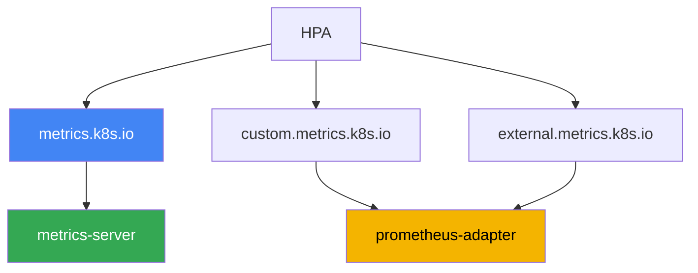
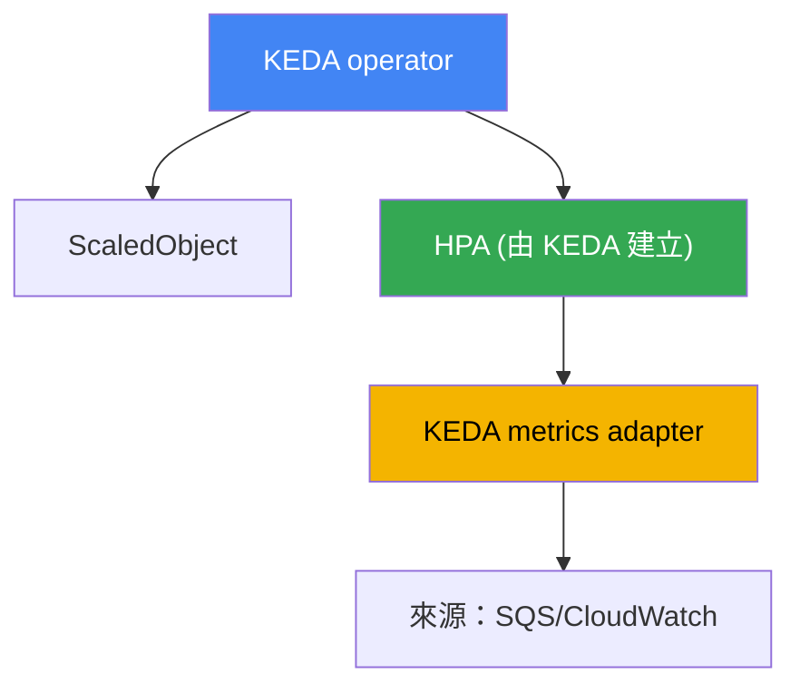

[Eng version](en.md) · [Versión en español](es.md) · [Version française](fr.md) · [Deutsche Version](de.md) · [ქართული ვერსია](ge.md) · [Русская версия](ru.md) · [日本語版](jp.md)
# 第 35 章。應用程式自動擴展：HPA、外部指標、KEDA

> **接下來。** 第 33 與 34 章提供了指標與日誌，這是可觀測性的兩根支柱。本章將指標用於實務：自動擴展應用程式本身，也就是依負載改變 Pod 副本數。相關內容交由其他章節說明：為這些 Pod 擴展節點（Cluster Autoscaler、Karpenter）見第 11 與 12 章；指標來源（metrics-server、Prometheus）見第 33 章；Pod 的垂直調整（requests/limits、VPA）見第 14 章；用於尋找瓶頸的追蹤見第 36 章。本章只聚焦一事：如何讓副本數跟隨真實負載，包括 HPA 以 CPU 看不見的事件。

## 35.1.「佇列持續成長，Pod 卻在休眠」

有一個佇列處理器：Pod 從 Amazon SQS 讀取訊息並進行處理。副本數固定為三個。突發流量來了，生產者灌入數萬則訊息。值班人員查看佇列與 Pod：

```bash
# 佇列中累積未處理訊息
aws sqs get-queue-attributes --queue-url "$Q" \
  --attribute-names ApproximateNumberOfMessagesVisible
# "ApproximateNumberOfMessagesVisible": "48213"

kubectl get hpa worker
# NAME     REFERENCE           TARGETS       MINPODS  MAXPODS  REPLICAS
# worker   Deployment/worker   12%/70%       3        20       3
```

佇列持續成長，延遲增加，但 HPA 維持三個副本，完全不打算擴展。原因在 `TARGETS` 欄位：HPA 設定依 CPU 擴展，但使用率只有 12%，門檻是 70%。Pod 大多時間在等待網路與資料庫回應，這是 I/O-bound 負載，CPU 並未繁忙。真正描述過載的指標是佇列深度，而依 CPU 的 HPA 完全看不見它。

反過來的問題發生在夜間。沒有訊息，三個副本仍持續運行並消耗資源：一般 HPA 無法把 Deployment 降至零。固定副本數總是輸：突發時過載和失敗，閒置時浪費金錢。以下依序說明：HPA 如何運作以及為何 CPU 指標會延遲；它能使用哪些指標；以及為何事件驅動負載採用能按佇列深度擴展並降至零的 KEDA。

## 35.2. HPA：它做什麼，以及它的極限

HorizontalPodAutoscaler 是 control plane 中的控制器，會定期依觀測指標調整 Deployment（或 StatefulSet、ReplicaSet）的副本數。公式很簡單：期望副本數 = 目前副本數 ×（目前指標值／目標值）。若 CPU 目標為 70%，實際為 140%，HPA 會將 Pod 數加倍。CKA 已介紹基本機制，因此本章只討論與營運相關的部分。

HPA 從 Metrics API（`metrics.k8s.io`）取得資源指標（CPU 與記憶體），此 API 由 metrics-server 提供（第 33 章）。若沒有 metrics-server，`TARGETS` 會顯示 `<unknown>`，且依 CPU 的 HPA 完全無法運作。當 HPA「沉默」時，這是第一個要檢查的項目。

為了避免 HPA 每逢雜訊就調整副本，它提供含有穩定化設定的 `behavior` 區段：

- `stabilizationWindowSeconds`：在此時間窗內取期望副本數的最大值；可平滑波動，避免在負載短暫下降時縮減 Pod。scaleDown 預設時間窗為 300 秒，scaleUp 為 0。
- `policies`：速率限制，定義在指定期間內可依 Pod 數或百分比調整的幅度。可設定「緩慢向下、快速向上」，反之亦然。

主要極限可見於 35.1 節：**對 I/O-bound 負載而言，CPU 指標會延遲或保持沉默**。佇列處理器、代理、等待資料庫的應用程式，都可能工作過載卻不消耗 CPU。按 CPU 擴展沒有意義，因為訊號和負載不相關。需要另一種指標：請求數、佇列深度、消費者延遲。問題隨即變成 HPA 要從何處取得 Metrics API 中不存在的指標。

## 35.3. HPA 的三種指標類型與 adapter 鏈

HPA 可讀取三種類型的指標，必須加以區分，因為各自對應不同 API 與供應者。

| HPA 中的類型 | API | 描述內容 | 範例 |
|---|---|---|---|
| Resource | `metrics.k8s.io` | 目標 Pod 的 CPU/記憶體 | 平均 CPU 70% |
| Pods / Object | `custom.metrics.k8s.io` | 叢集物件的指標 | 每個 Pod 每秒請求數 |
| External | `external.metrics.k8s.io` | 叢集外部的指標 | SQS 佇列深度 |

- **Resource**：來自 metrics-server 的 CPU 與記憶體。這是預設且最簡單的情況。
- **Pods** 與 **Object**：叢集物件的「自訂」指標，例如每個 Pod 每秒請求數、內部佇列長度、Prometheus 資料中的值。透過 `custom.metrics.k8s.io` 提供。
- **External**：完全不與叢集物件相關的指標，例如 SQS 佇列深度、Kafka topic 中的訊息數、CloudWatch 的值。透過 `external.metrics.k8s.io` 提供。

關於 `Resource` 還有一項重要細節，特別適用於 Pod 很少只有一個容器的 EKS。這種類型的使用率是**以整個 Pod**計算：所有容器用量總和相對於其 requests 總和。因此 sidecar，例如 service mesh proxy、日誌代理、Vault agent，會稀釋指標：應用程式已經吃緊，但整個 Pod 的平均值仍遠低於門檻。使用將決策繫結至單一容器的 `ContainerResource` 類型即可解決：

```yaml
metrics:
  - type: ContainerResource
    containerResource:
      name: cpu
      container: app          # 僅計算應用程式容器
      target:
        type: Utilization
        averageUtilization: 70
```

關鍵是 Kubernetes 本身不實作這兩個延伸 API。它們由 **adapter** 註冊，adapter 是接入 API aggregator 並回應 HPA 請求的獨立元件。常見 adapter 是 **prometheus-adapter**：它從 Prometheus 取得資料，將其轉換為 `custom.metrics.k8s.io` 指標（需要時也可轉為 `external.metrics.k8s.io`），並依 mapping 規則提供給 HPA。鏈路如下：應用程式輸出指標，Prometheus 蒐集，prometheus-adapter 將其發布至 metrics API，HPA 讀取後計算副本數。



坦白說，這套「Prometheus + prometheus-adapter + mapping 規則」的組合設定很繁瑣。必須描述哪個 PromQL 查詢對應哪個 HPA 指標、留意名稱與標籤，並除錯 `TARGETS` 中的 `<unknown>`。一個自訂指標還算值得，但來源一多且希望降至零時，手動 adapter 就成了負擔。這就是 KEDA 登場之處。

## 35.4. KEDA：事件驅動自動擴展

KEDA（Kubernetes Event-Driven Autoscaling）是 HPA 之上、用於依事件擴展的層。概念是：不必手動建立外部指標 adapter，而是以宣告式方式描述事件來源，KEDA 會自行將指標提供給 HPA 並管理它。KEDA 安裝於叢集內（通常使用 Helm chart），帶來數個元件及其 CRD。

主要資源是 **ScaledObject**：它參照您的 Deployment 並描述擴展 trigger。背景工作可用 **ScaledJob**，它擴展的不是 Deployment 副本，而是處理工作批次的平行 Job 數。指標來源透過 **scaler** 指定；KEDA 有數十種 scaler，其中就包括 35.1 節缺少的功能：

- `aws-sqs-queue`：Amazon SQS 佇列深度；
- `aws-cloudwatch`：任意 Amazon CloudWatch 指標；
- `prometheus`：PromQL 查詢結果（包括 Amazon Managed Prometheus，第 33 章）；
- `kafka`：消費者延遲；`cron`：排程；以及許多其他來源。

理解其內部運作很重要，因為除錯時需要它。KEDA **不會取代** HPA，而是透過它運作：



- **operator** 監控 ScaledObject，並為每個物件建立及管理一般 HPA。
- KEDA 的 **metrics adapter** 註冊 `external.metrics.k8s.io`，並將 scaler 從來源輪詢的值提供至該 API。換言之，HPA 仍進行全部副本計算，KEDA 僅提供指標。因此 `kubectl get hpa` 會顯示名為 `keda-hpa-...` 的 HPA。

HPA 自身無法做到、也是人們常採用 KEDA 的原因，是 **scale-to-zero**。無事件時（佇列為空、請求為零），KEDA 將 Deployment 降至零副本；第一個事件到來時則重新升起。一般 HPA 在穩定版本中無法如此運作：它從一個副本以上運作。範圍由 `minReplicaCount`（可為 0）和 `maxReplicaCount` 欄位設定。

SQS 與 CloudWatch scaler 的 AWS 存取權不以金鑰授予，而是透過 IAM。KEDA 使用其 operator 的角色，或者較正確的做法是使用帶有 `aws` provider 的 **TriggerAuthentication** 資源，為每個 trigger 指派獨立角色。角色透過 IRSA 或 Pod Identity（第 16 與 17 章）繫結至 ServiceAccount，這與其他工作負載採用相同機制。如此單一 scaler 僅獲得所需權限，例如 `sqs:GetQueueAttributes`，而不使用共用金鑰。

```yaml
# ScaledObject：按 SQS 佇列深度擴展 worker，最低可至零
apiVersion: keda.sh/v1alpha1
kind: ScaledObject
metadata:
  name: worker
spec:
  scaleTargetRef:
    name: worker            # Deployment 名稱
  minReplicaCount: 0        # 佇列為空時 scale-to-zero
  maxReplicaCount: 20
  triggers:
  - type: aws-sqs-queue
    authenticationRef:
      name: keda-aws         # 對 TriggerAuthentication 的參照
    metadata:
      queueURL: https://sqs.eu-central-1.amazonaws.com/111122223333/jobs
      queueLength: "10"      # 每個 Pod 的目標訊息數
      awsRegion: eu-central-1
```

範例通常省略但在正式環境非常重要的兩個 `ScaledObject` 欄位。**`pollingInterval`**（預設 30 秒）是在副本數為零時 KEDA 輪詢來源的頻率；從一個副本以上，指標則由 HPA 依自己的週期請求。**`cooldownPeriod`**（預設 300 秒）是 trigger 最後一次活動後、降至零前的等待時間；它**僅適用於 scale-to-zero**。從 N 縮至 minReplicaCount 的一般縮減由 HPA 處理，並以含穩定化時間窗的 `behavior` 控制。佇列的 cooldown 過短會造成「鋸齒」：Pod 啟動、處理一批工作、降至零，一分鐘後再次冷啟動。

這也引出 ScaledObject 數量增加時的陷阱：**每個 trigger 都會呼叫 AWS API**。數十個含 `aws-sqs-queue` 與 `aws-cloudwatch` 的物件使用預設間隔時，會產生一串 `GetQueueAttributes` 與 `GetMetricData` 請求，並碰到 AWS 請求限制。症狀很典型：HPA 的 `TARGETS` 顯示 `<unknown>`，副本停滯，而 KEDA operator 日誌中出現 throttling 錯誤。可透過三種方式緩解：增加非關鍵 trigger 的 `pollingInterval`、啟用 `useCachedMetrics: true` 以在輪詢間隔內重用值，以及設定 `fallback` 區段，讓 KEDA 在來源無法使用時維持預先設定的副本數，而不是遺失指標。

## 35.5. 誰擴展什麼：不要混淆三個軸向

Kubernetes 的自動擴展沿三個獨立軸向運作，且人們經常混淆它們。HPA 與 KEDA 僅處理第一個。

| 工具 | 軸向 | 變更內容 | 章節 |
|---|---|---|---|
| HPA、KEDA | 水平，Pod | Deployment 副本數 | 本章 |
| VPA | 垂直，Pod | 單一 Pod 的 requests/limits | 14 |
| Cluster Autoscaler、Karpenter | 基礎設施 | 節點數與類型 | 11、12 |

這些軸向直接相連，必須整體理解。HPA 或 KEDA 依負載新增副本，但新 Pod 必須有地方排程。若沒有可用節點，Pod 會卡在 `Pending`，此時 **Karpenter 或 Cluster Autoscaler**（第 11 與 12 章）會看見無法排程的 Pod，並為它們新增節點。負載下降時則相反：HPA/KEDA 移除副本，節點變空，Karpenter 透過 consolidation 將其縮減。因此應用程式擴展與節點擴展是成對運作的：前者回應負載，後者回應前者造成的壓力。

有一對軸向難以共存，部署前必須知道：**不可讓 HPA 與 VPA 針對同一資源指標相互作用**。惡性循環的機制很簡單。HPA 看見高 CPU 後增加副本，每個 Pod 的平均使用率下降；VPA 推論 requests 過高並將其降低；降低後，相同負載占 requests 的百分比大幅提高，HPA 又再次增加副本。副本數與 Pod 大小開始彼此推動。

可接受的組合有三種，且都讓工具使用不同訊號：VPA 使用 `updateMode: "Off"`，只計算 sizing 建議而由人做決定（第 14 章）；VPA 和 HPA 使用**不同**資源，例如 VPA 針對記憶體、HPA 針對 CPU；以及實務上最方便的方式：VPA 維持 requests，而 HPA 或 KEDA 按自訂與外部指標擴展副本，例如 RPS、佇列深度或消費者延遲。

由此產生典型營運錯誤：HPA 已設定且正常產生副本，但沒有節點擴展，Pod 因而累積在 `Pending`，增加副本毫無效果。或者反過來，KEDA 將 Deployment 降至零，但其節點沒有縮減，因為另一個 Pod 仍在保留它。分析「為何沒有擴展」時，應始終先判斷問題卡在哪個軸向。

## 35.6. 何時使用 HPA，何時使用 KEDA

兩種工具最終都使用同一個 HPA 機制，因此選擇取決於指標來源及是否需要 scale-to-zero，而非「哪個更強大」。

| 情境 | 工具 | 原因 |
|---|---|---|
| 依 CPU 或記憶體擴展 | HPA | metrics-server 已提供資源指標 |
| 一個現成的自訂指標 | HPA + prometheus-adapter | 一個 adapter 即足夠 |
| 事件驅動負載、佇列 | KEDA | 有適用於 SQS、Kafka、CloudWatch 的現成 scaler |
| 需要 scale-to-zero | KEDA | 一般 HPA 不會降至零 |
| 有多種不同來源 | KEDA | 不必為每個來源建立 adapter |
| 簡單叢集、最少 CRD | HPA | 元件較少，營運較少 |

簡要規則是：若 CPU/記憶體或一個現成指標已足夠，採用純 HPA，它較簡單且不會引入額外元件。一旦出現事件、佇列、scale-to-zero 或數個外部來源，就採用 KEDA，它正是為此設計，能消除手動 adapter 的麻煩。為一般 CPU 擴展而安裝 KEDA 是不必要的複雜性。

## 35.7. 正式環境中的使用方式

- **依描述負載的指標擴展。** 對網站而言通常是 RPS 或延遲；對處理器則是佇列深度或消費者延遲，而非 CPU。只有當負載確實受限於處理器時才保留 CPU。
- **預設使用 HPA，事件才使用 KEDA。** 不會僅為 CPU 將 KEDA 帶入叢集；有佇列、外部來源或需要 scale-to-zero 時才加入。
- **設定 `behavior`，而不僅是門檻。** 透過穩定化時間窗和 policies 實現快速向上、緩慢向下（或反之），避免副本數持續震盪的「鋸齒」。
- **透過角色而非金鑰授予 scaler 的 AWS 存取權。** 使用帶有 `aws` provider 的 TriggerAuthentication，以及 IRSA 或 Pod Identity（第 16 與 17 章），對佇列或指標授予最小權限。
- **有意識地啟用 scale-to-zero。** 它在閒置時節省資源，但會增加冷啟動：閒置後的第一個事件必須等待 Pod 啟動。對延遲敏感的 API，`minReplicaCount` 通常維持大於零。
- **確認節點跟得上 Pod。** 下方沒有可用的 Karpenter 或 Cluster Autoscaler 時，HPA/KEDA 沒有意義；否則新副本會停在 `Pending`。
- **讓 HPA 和 VPA 使用不同訊號。** 不要交給兩者同一資源：VPA 要麼以 `updateMode: "Off"` 提供建議，要麼維持 requests，而副本按自訂指標與佇列擴展（第 14 章）。
- **有 sidecar 的 Pod 按容器擴展。** 對應用程式容器使用 `ContainerResource`，而非整個 Pod 的 `Resource`：否則 mesh proxy 與 agent 會稀釋指標。
- **保護 AWS API 免於 throttling。** 有數十個 ScaledObject 時，提高 `pollingInterval`、啟用 `useCachedMetrics` 並設定 `fallback`，避免來源無法使用時 HPA 以 `<unknown>` 代替指標。

## 35.8. 迷你詞彙表

- **HPA（HorizontalPodAutoscaler）**：依指標變更 Deployment 副本數的控制器。
- **Metrics API（`metrics.k8s.io`）**：由 metrics-server 提供的資源指標（CPU/記憶體）API。
- **custom.metrics.k8s.io**：供 HPA（Pods、Object）使用的叢集物件自訂指標 API。
- **external.metrics.k8s.io**：供 HPA（External 類型）使用的外部指標（佇列、topic）API。
- **prometheus-adapter**：將 Prometheus 指標發布至 custom/external API 的 adapter。
- **behavior / stabilizationWindowSeconds**：HPA 區段，透過穩定化時間窗與 policies 平滑擴展速度和波動。
- **KEDA**：事件驅動自動擴展層，將指標供給 HPA 並管理 HPA。
- **ScaledObject**：KEDA CRD，描述 Deployment 的擴展目標與 trigger。
- **ScaledJob**：KEDA CRD，用於擴展處理工作批次的平行 Job 數。
- **scaler**：KEDA 指標來源：`aws-sqs-queue`、`aws-cloudwatch`、`prometheus`、`kafka`、`cron` 及數十種其他來源。
- **TriggerAuthentication**：含 trigger 存取參數的 KEDA CRD；對 AWS 而言，使用 IRSA 或 Pod Identity 的 `aws` provider。
- **scale-to-zero**：在閒置時將 Deployment 降至零副本；KEDA 能做到，HPA 不能。
- **ContainerResource**：HPA 指標類型，按 Pod 中一個容器而非所有容器總和計算使用率；當 sidecar 稀釋應用程式指標時需要它。
- **`pollingInterval` 與 `cooldownPeriod`**：KEDA 輪詢來源的時間週期（預設 30 秒）及降至零前的等待時間（預設 300 秒）；後者僅適用於 scale-to-zero。
- **`useCachedMetrics` 與 `fallback`**：在輪詢間隔內快取值，以及來源無法使用時維持的副本數；兩者一同降低 API throttling 與 `TARGETS` 顯示 `<unknown>` 的風險。

## 35.9. 本章總結

- 固定副本數總是輸：突發時過載，閒置時浪費金錢。依 CPU 的 HPA 無法拯救 I/O-bound 負載：佇列成長但 CPU 偏低，HPA 保持沉默。
- HPA 依「目前副本數 × 實際值／目標值」的公式變更副本；它從 metrics-server 取得資源指標，而含 `stabilizationWindowSeconds` 和 policies 的 `behavior` 可平滑波動。
- HPA 讀取三種類型的指標：Resource（`metrics.k8s.io`）、Pods/Object（`custom.metrics.k8s.io`）與 External（`external.metrics.k8s.io`）；延伸 API 通常由 prometheus-adapter 實作。
- 手動設定 Prometheus 加 prometheus-adapter 的組合很繁瑣，且無法良好擴展至許多來源和 scale-to-zero。
- KEDA 透過 ScaledObject/ScaledJob 和 scaler（`aws-sqs-queue`、`aws-cloudwatch`、`prometheus`、`kafka`、`cron` 等）以宣告式方式描述事件來源。
- 在內部 KEDA 不會取代 HPA：operator 為每個 ScaledObject 建立 HPA，而 KEDA metrics adapter 透過 `external.metrics.k8s.io` 供給外部指標。
- KEDA 能做到一般 HPA 無法做到的 scale-to-zero；SQS 與 CloudWatch 存取透過帶有 `aws` provider 的 TriggerAuthentication，以 IRSA 或 Pod Identity（第 16 與 17 章）授予。
- 不要混淆三個擴展軸向：HPA/KEDA 是 Pod 副本，VPA 是 Pod 資源（第 14 章），Cluster Autoscaler/Karpenter 是節點（第 11 與 12 章）；它們成對運作。

## 35.10. 這在實際工作中的用途

值班時，當服務「忽好忽壞」或長期閒置時，自動擴展經常是嫌疑對象。首先查看 `kubectl get hpa`：`TARGETS` 欄位立刻顯示 HPA 是否看見負載，或顯示 `<unknown>`（缺少 metrics-server 或 adapter）。若有指標但副本沒有增加，檢查 Pod 是否因缺少節點而卡在 `Pending`：沒有節點擴展，應用程式擴展無法運作。事件驅動服務還要執行 `kubectl get scaledobject` 和對其 `kubectl describe`：可從中看出 scaler 是否回應，以及 KEDA 建立的 HPA 是否已啟動。

規劃時應一次做出有意識的選擇。確定能誠實描述服務負載的指標，而這很少是 CPU。決定是否需要 scale-to-zero，及是否願意以冷啟動作為代價。對事件驅動負載，規劃 KEDA 和透過角色而非金鑰取得 AWS 存取權。並始終檢查第二個軸向：副本增加時是否有正常運作的 Karpenter 或 Cluster Autoscaler 支援，否則自動擴展只會是一個漂亮但無用的設定。

## 35.11. 自我檢查問題

1. 為何依 CPU 的 HPA 不會擴展佇列處理器，即使佇列正在成長？
2. HPA 依什麼公式計算期望副本數，又從何處取得資源指標？
3. `kubectl get hpa` 的 `TARGETS` 欄中 `<unknown>` 表示什麼，應從何處開始排查？
4. `behavior` 區段用途為何，`stabilizationWindowSeconds` 做什麼？
5. HPA 讀取哪三種指標，各自對應什麼 API？
6. custom.metrics.k8s.io 與 external.metrics.k8s.io 有何差異，由誰實作？
7. prometheus-adapter 做什麼，為何與它的手動組合無法良好擴展？
8. ScaledObject 和 ScaledJob 描述什麼，它們有何不同？
9. KEDA 在內部如何運作，為何 KEDA 運作時 `kubectl get hpa` 仍會顯示 HPA？
10. 什麼是 scale-to-zero，為何 KEDA 需要它，以及它對延遲敏感服務有何缺點？
11. KEDA scaler 如何在沒有靜態金鑰的情況下存取 SQS 或 CloudWatch？
12. 三個擴展軸向（HPA/KEDA、VPA、Cluster Autoscaler/Karpenter）有何不同？
13. 何時純 HPA 已足夠，何時使用 KEDA 是合理的？
14. 為何不能讓 HPA 和 VPA 針對同一資源指標運作，哪些三種組合可接受？
15. Pod 由應用程式與 proxy service mesh 組成。為何 `Resource` 提供錯誤圖像，應改用什麼？
16. 由 KEDA 建立的 HPA 在 `TARGETS` 出現 `<unknown>`，但 ScaledObject 正確。應檢查 AWS API 哪一面，以及哪三種設定能降低風險？

## 實作練習

本課程此主題的實驗：[實驗 124，應用程式自動擴展：HPA、KEDA、Prometheus](../../labs/124/README_TW.MD)。在此實驗中，您將安裝 kube-prometheus-stack 與 KEDA，使用 `prometheus` scaler 描述 `ScaledObject`，親眼看見 KEDA 不會取代 HPA，而是建立和管理一般的 `keda-hpa-*`，接著依其他 Pod 的負載擴展應用程式，並透過穩定化時間窗觀察它回到最低值；以 `check_result` 指令驗證。啟動方式為 `TASK=124 make run_eks_task`。

也應能在任何工作叢集中擷取自動擴展狀態。先查看已設定的內容，以及 HPA 是否看見其指標：

```bash
# 所有 HPA 和其目標；查看 TARGETS 欄位
kubectl get hpa -A
# 指定 HPA 的詳細資料：事件、目前及目標指標值
kubectl describe hpa worker
```

檢查叢集是否提供延伸 metrics API，沒有它們 HPA 就無法取得 custom/external 指標：

```bash
# custom 與 external metrics API 是否已註冊，以及由哪個 adapter 服務
kubectl get apiservices | grep -E "custom.metrics|external.metrics"
```

若叢集安裝 KEDA，查看其資源及它建立的 HPA：

```bash
# KEDA 物件及其在內部建立的 HPA（名稱形式為 keda-hpa-*）
kubectl get scaledobject -A
kubectl get hpa -A | grep keda-hpa
```

將結果相互對照：服務是按描述自身負載的指標擴展，還是「習慣性地」按 CPU；HPA 是否看見指標，還是顯示 `<unknown>`；以及新副本是否因節點不足而卡在 `Pending`。除了課程實驗外，儲存庫還有一個關於 KEDA 和 Prometheus 自動擴展的獨立非課程實驗（`../../labs/03/README_RUS.MD`）：它部署 Prometheus、安裝 KEDA，並按真實 RPS 擴展應用程式，是親眼看見整條鏈路的好方法。

---
[目錄](../README_TW.md) · [第 34 章](../34/tw.md) · [第 36 章](../36/tw.md)
