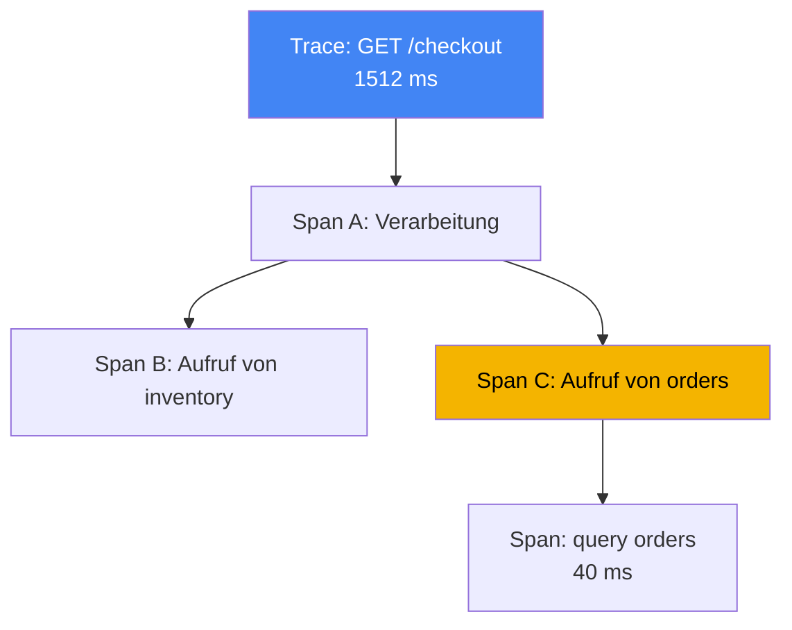
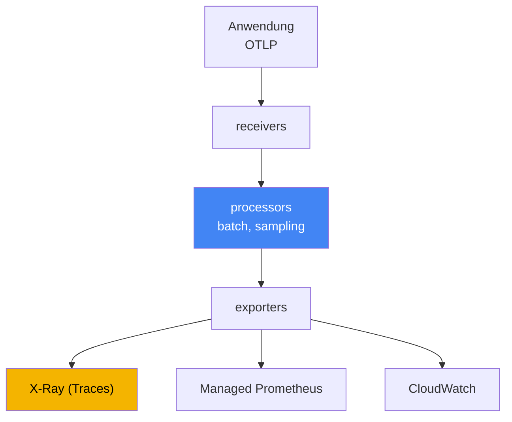

[Русская версия](ru.md) · [Eng version](en.md) · [Versión en español](es.md) · [Version française](fr.md) · [ქართული ვერსია](ge.md) · [繁體中文版](tw.md) · [日本語版](jp.md)
# Kapitel 36. Tracing und Profiling: ADOT und X-Ray

> **Wie es weitergeht.** Die Kapitel 33 und 34 lieferten Metriken und Logs, zwei der drei Säulen der Observability. Hier folgt die dritte: verteiltes Tracing, das eine Anfrage zu einem gemeinsamen Pfad durch eine Kette von Services verbindet, sowie kurz Profiling. Verwandte Themen behandeln andere Kapitel: Metriken, einschließlich ADOT als Metriksammler in Amazon Managed Prometheus, Kapitel 33; Logs Kapitel 34; Rollen für den Export von Telemetrie zu AWS über IRSA und Pod Identity die Kapitel 16 und 17. Dieses Kapitel schließt Teil 6 ab. Danach folgt Teil 7: Betrieb mit Add-ons, Upgrades, Zuverlässigkeit, Backups und Kosten.

## 36.1. „p99 ist gestiegen, aber der Verantwortliche ist unklar“

Ein Benutzer beschwert sich, dass eine Seite langsam lädt. Der Bereitschaftsdienst öffnet das Dashboard und sieht eine höhere Latenz im eingehenden Service: p99 ist von 200 ms auf eineinhalb Sekunden gestiegen. Die Metriken zeigen ehrlich, dass „Service A Probleme hat“, aber nicht warum. Die Anfrage an A geht intern weiter: A ruft B auf, B ruft C auf, C greift auf die Datenbank zu. Wo genau sich die Latenz angesammelt hat, ob in A selbst, im Netzwerk zu B oder in einer langsamen Datenbankabfrage von C, ist anhand von Metriken nicht zu erkennen.

Der Engineer geht zu den Logs (Kapitel 34) und findet Zeilen aus jedem Pod:

```
# Log von Pod A
level=info msg="GET /checkout 1512ms" 
# Log von Pod C (anderer Pod, anderer Namespace)
level=info msg="query orders 40ms"
```

Die Zeilen existieren, sind aber unverbunden. Es gibt keine Möglichkeit zu sagen, dass diese Zeile in A und jene in C dieselbe Benutzeranfrage betreffen. Tausende Anfragen pro Sekunde, durcheinanderliegende Logs, und den Pfad einer Anfrage manuell daraus zusammenzustellen, ist unmöglich. Metriken beantworten die Frage „was“ (die Latenz steigt), Logs das „warum“ an einem Punkt (ein Fehler in einem bestimmten Pod), aber weder die einen noch die anderen beantworten, „wo in der Kette“ die Latenz liegt. Fünf Aufrufe in einer Kette, aber welcher davon verantwortlich ist, bleibt ein Rätsel.

Genau dieses Rätsel löst verteiltes Tracing. Es weist jeder Anfrage eine durchgängige Kennung zu und zeichnet die Dauer jeder Operation auf ihrem Weg auf, sodass sich p99 in Summanden zerlegen lässt: so viel in A, so viel im Aufruf von B, so viel in der Datenbank. Der Reihe nach: Woraus ein Trace besteht, was OpenTelemetry damit zu tun hat, wie ADOT ihn sammelt und wo X-Ray ihn ablegt.

## 36.2. Was ist verteiltes Tracing?

Tracing beschreibt den Weg einer einzelnen Anfrage durch alle Services, die sie berührt hat. Zwei Begriffe genügen, um jeden Trace zu lesen:

- **Trace** - der gesamte Weg einer Anfrage vom Eingang bis zur Antwort mit allen verschachtelten Aufrufen. Ein Trace hat eine gemeinsame `trace id`, die für alle Services auf dem Weg gleich ist.
- **Span** - eine einzelne Operation innerhalb eines Trace: Verarbeitung in einem Service, Aufruf eines Nachbarn, Datenbankabfrage. Ein Span hat einen Namen, Startzeit und Dauer, eine Referenz auf den übergeordneten Span sowie Attribute (HTTP-Code, URL, Tabellenname). Verschachtelte Spans bilden einen Baum, der zeigt, wo die Zeit verbraucht wurde.

Damit die `trace id` beim Übergang von einem Service zum nächsten nicht verloren geht, gibt es **context propagation**: Der eingehende Service legt die Trace-Kennung in die Header der ausgehenden Anfrage, der nächste Service liest sie und setzt denselben Trace fort. Das branchenübliche Headerformat ist W3C Trace Context (`traceparent`). X-Ray transportiert den Kontext historisch in seinem Header `X-Amzn-Trace-Id`, und ADOT SDKs beherrschen beide Formate. Das ist wichtig, wenn die Kette AWS-Services (ALB, API Gateway, Lambda) enthält, die gerade `X-Amzn-Trace-Id` setzen. Im `X-Amzn-Trace-Id` liegt der Kontext in den Feldern `Root` (Trace-ID), `Parent` (übergeordneter Span) und `Sampled` (Entscheidung über die Aufzeichnung). Der X-Ray propagator aus ADOT übersetzt diese Felder nach `traceparent` und zurück, und ein `Root` der Form `1-<epoch>-<id>` enthält dieselben 32 Hex-Zeichen wie die `trace id` in W3C. So werden die durchgängige `trace id` und eine einheitliche Sampling-Entscheidung an den Grenzen von AWS-Services nicht unterbrochen. Ohne Kontextweitergabe reißt die Kette ab, und statt eines Baums entstehen einzelne, nicht verbundene Fragmente.



Separat sollte man sich merken, wo diese Mechanik nicht mehr automatisch funktioniert. Header existieren bei HTTP und gRPC, aber **eine asynchrone Grenze transportiert sie nicht**: Eine Nachricht wird in SQS, Kafka oder EventBridge abgelegt, und die Auto-Instrumentierung bricht ab, denn niemand überträgt den Kontext für Sie durch den Nachrichteninhalt. Der Producer muss den Kontext in die Nachrichtenattribute schreiben, und der Verarbeiter, also der Worker aus Kapitel 35, muss ihn auslesen und den Trace fortsetzen. Es gibt zwei Varianten: W3C-`traceparent` in normalen message attributes, wenn beide Seiten Ihnen gehören, sowie das reservierte SQS-Systemattribut `AWSTraceHeader` mit dem X-Ray-Header. Dieses verstehen AWS-Services selbst, weshalb für Ketten wie SNS, SQS, Lambda gerade dieses Attribut funktioniert. Überspringen Sie diesen Schritt, zerfällt der Trace in „Anfrage eingetroffen“ und „etwas wurde verarbeitet“ ohne Verbindung dazwischen.

Das Aufzeichnen eines vollständigen Trace für jede Anfrage ist teuer: Bei Tausenden Anfragen pro Sekunde entstehen Datenberge und nennenswerter Overhead. Daher verwendet man **sampling**: Nicht alle Traces, sondern nur ein Anteil werden aufgezeichnet. Die Entscheidung „speichern oder nicht“ wird einmal am Eingang getroffen und über den Kontext weitergegeben, damit ein Trace nicht nur zur Hälfte aufgezeichnet wird. Das ist der Head-based-Ansatz; seine Alternative, Tail-based am Gateway, wird in Abschnitt 36.4 behandelt, X-Ray-Regeln in 36.5.

## 36.3. OpenTelemetry: Standard statt Anbieterbindung

Früher kam jedes Tracing-Backend mit seinem eigenen Agenten und SDK: Der Code wurde für einen bestimmten Anbieter instrumentiert, und ein Wechsel des Backends bedeutete, die Instrumentierung umzuschreiben. **OpenTelemetry** (OTel), ein CNCF-Projekt und branchenweiter Standard, löst diese Bindung. Es definiert einen einheitlichen Satz von APIs, SDKs und Protokollen, während das Backend austauschbar wird.

Die Kernidee von OTel ist die Trennung zweier Dinge, die Anbieter vermischten:

- **Instrumentierung** - wie eine Anwendung Spans und Metriken erzeugt. Sie erfolgt über das OTel SDK im Code oder durch Auto-Instrumentierung ohne Codeänderung (Abschnitt 36.6). Sie ist unabhängig davon gleich, wohin die Daten später gehen.
- **Backend** - wo Telemetrie gespeichert und analysiert wird: X-Ray, CloudWatch, Prometheus oder Systeme anderer Anbieter. Es wird durch die Exportkonfiguration geändert, ohne den Anwendungscode anzupassen.

Beides verbindet **OTLP** (OpenTelemetry Protocol), das Standardprotokoll für die Telemetrieübertragung von der Anwendung zum Sammler und zwischen Sammlern. Die Anwendung spricht OTLP und weiß nicht, welches Backend dahintersteht. Die praktische Bedeutung für den Betrieb ist unmittelbar: einmal instrumentieren, dann in der Sammlerkonfiguration entscheiden, wohin Traces und Metriken gesendet werden, und dies ohne Anwendungsrelease ändern. Es gibt keine Bindung an einen Anbieter.

## 36.4. ADOT: OpenTelemetry Collector von AWS

**ADOT** (AWS Distro for OpenTelemetry) ist eine von AWS zusammengestellte, getestete und unterstützte Distribution von OpenTelemetry-Komponenten: SDKs, Agenten zur Auto-Instrumentierung und, für uns besonders wichtig, der **OpenTelemetry Collector**. Der Collector ist das Zwischenglied zwischen Anwendungen und Backends: Er nimmt Telemetrie an, verarbeitet sie und exportiert sie in ein oder mehrere Systeme.

In EKS wird ADOT als **verwaltetes Add-on** (`adot`) installiert: Das Add-on stellt den ADOT Operator bereit, der Collector über die Ressource `OpenTelemetryCollector` verwaltet. Die Collector-Pipeline besteht aus drei Stufen:

- **receivers** - Datenannahme, gewöhnlich über OTLP von Anwendungen (gRPC- und HTTP-Ports);
- **processors** - Verarbeitung: Batching (`batch`), Speicherbegrenzung, Sampling, Hinzufügen von Attributen;
- **exporters** - Export in Backends: `awsxray` für Traces nach X-Ray, Metrikexport nach Amazon Managed Prometheus (Kapitel 33), Exporter nach CloudWatch.



Zwei Processor sollte man beim Namen nennen, denn ohne sie überlebt die Pipeline keinen ersten Lastanstieg. An erster Stelle der Kette steht **`memory_limiter`**: Er überwacht den Speicherverbrauch und verweigert beim Erreichen eines Grenzwerts die Annahme, wobei er Fehler an die Sender zurückgibt, statt Daten anzuhäufen und in `OOMKilled` zu geraten. Die Sender führen dann Retries durch; damit geht ein Teil der Telemetrie verloren, nicht aber der Collector selbst.

Der zweite ist **`tail_sampling`**, und er verändert die Logik des Sampling selbst. Was in Abschnitt 36.2 beschrieben ist, ist **head-based**: Der Anteil wird am Eingang bestimmt, bevor der Ausgang der Anfrage bekannt ist. Bei wenigen Prozent Anteil verlieren Sie genau das, wonach Sie suchen: 5xx-Antworten und Latenzspitzen. **Tail-based** entscheidet anders: Der Collector sammelt im Gateway-Modus die Spans eines Trace, wartet auf dessen Abschluss und wendet erst dann Richtlinien an: alle Traces mit Fehlern und mit Latenz über dem Grenzwert speichern, von erfolgreichen nur einen kleinen Anteil behalten. So wird das X-Ray-Budget für Anomalien statt für Rauschen ausgegeben.

Für Tail-based gelten zwei Bedingungen, die meist erst beim Debugging auffallen. Erstens: **Alle Spans eines Trace müssen dieselbe Collector-Instanz erreichen**, sonst fällt die Entscheidung anhand eines Trace-Fragments. Bei mehreren Gateway-Replikas wird davor eine Schicht mit dem `loadbalancing`-Exporter eingesetzt, die Spans anhand der `trace id` routet. Zweitens: Das Sammeln der Traces erfolgt innerhalb des Wartefensters im Speicher, daher benötigt das Gateway RAM-Reserve, und Traces, die nicht rechtzeitig abgeschlossen werden, werden unvollständig bewertet. Daraus folgt die Reihenfolge: `memory_limiter` zuerst, danach `tail_sampling`, anschließend `batch`.

Ein Collector kann gleichzeitig Traces an X-Ray und Metriken an Prometheus senden. Daraus folgt „eine Instrumentierung, mehrere Backends“. Der Collector wird in einem der folgenden Modi bereitgestellt, und die Wahl beeinflusst Isolierung und Overhead:

| Modus | Bereitstellung | Wann verwendet |
|---|---|---|
| Sidecar | Container neben der Anwendung im Pod | geringe Annahmelatenz, Isolierung pro Pod |
| DaemonSet | ein Agent pro Node | Sammlung vom Node, ein einheitlicher Agent für alle Pods |
| Deployment (Gateway) | separater Replikapool, gemeinsames Gateway | Zentralisierung, Batching und Sampling an einer Stelle |

Das typische Muster ist ein Agent nahe an der Anwendung (Sidecar oder DaemonSet) plus ein gemeinsames Gateway (Deployment), das vor dem Versand an das Backend batcht und sampled. Berechtigungen für den Export zu AWS werden nicht mit Schlüsseln, sondern über eine Rolle erteilt: Der ServiceAccount des Collector ist über IRSA oder Pod Identity (Kapitel 16 und 17) mit einer IAM-Rolle verbunden, mit dem kleinsten erforderlichen Berechtigungssatz. Für X-Ray sind das `xray:PutTraceSegments` und `xray:PutTelemetryRecords`.

## 36.5. AWS X-Ray: Backend für Traces

**AWS X-Ray** ist ein verwaltetes Tracing-Backend: Es nimmt Spans entgegen, in der Terminologie von X-Ray Segmente und Subsegmente, speichert Traces und stellt Analysen bereit. Die wichtigsten Gründe, es zu verwenden:

- **service map** - eine aus Traces gebildete Karte der Services und ihrer Beziehungen. Sie zeigt, wer wen aufruft, die durchschnittliche Latenz und den Fehleranteil auf jeder Kante. Daran erkennt man den Knoten, an dem sich Latenz oder Fehler häufen.
- **Aufschlüsselung der Latenz nach Segmenten** - für einen bestimmten Trace ist sichtbar, wie viel Zeit in jedem Service und für jeden Aufruf verbraucht wurde. Genau das fehlte in Abschnitt 36.1: p99 wird in Summanden zerlegt.
- **Trace-Suche** - Auswahl langsamer oder fehlerhafter Anfragen über Filter (Antwortcode, Service, Dauer), damit nicht zufällige, sondern problematische Traces betrachtet werden.

Historisch wurden Traces von einem **X-Ray daemon** an X-Ray gesendet, einem separaten Agenten neben der Anwendung. Heute macht AWS OpenTelemetry zum primären Standard für Instrumentierung mit X-Ray, und der bevorzugte Weg ist der **ADOT Collector mit X-Ray-Exporter** statt des daemon. In der Zuordnungstabelle von OpenTelemetry übernimmt der OpenTelemetry Collector die Rolle des X-Ray daemon, und X-Ray sampling rules entsprechen dem OTel-Sampling. Für neue Workloads in EKS wird ADOT und nicht der daemon eingesetzt.

**Sampling rules** in X-Ray legen fest, welcher Anteil der Anfragen aufgezeichnet wird, und werden zentral ohne Codeänderung konfiguriert. Eine Regel besteht aus zwei Teilen: **reservoir**, einer festen Anzahl passender Anfragen pro Sekunde, die garantiert geschrieben werden, und **fixed rate**, einem Anteil des Rests oberhalb des Reservoirs. Regeln werden anhand von Attributen abgeglichen (Service-Name, Pfad, Methode), sodass alle Traces für Zahlungen, aber nur ein Anteil für Health Checks geschrieben werden können. Das ist der wichtigste Hebel für Umfang und Kosten von Traces: Je kleiner der Anteil, desto günstiger und leichter, aber desto höher die Chance, ein seltenes Problem nicht zu erfassen.

## 36.6. Instrumentierung: SDK gegenüber Auto-Instrumentierung

Damit eine Anwendung überhaupt Spans erzeugt, muss sie instrumentiert werden. Es gibt zwei Wege:

- **OTel SDK im Code** - der Entwickler bindet OpenTelemetry-Bibliotheken ein und erstellt bei Bedarf manuell Spans um wichtige Operationen. Das bietet mehr Kontrolle und Genauigkeit, etwa zum Markieren von Geschäftsschritten, erfordert aber Codeänderungen in jeder Sprache.
- **Auto-Instrumentierung** - OTel-Bibliotheken werden automatisch eingebunden und umschließen gängige Frameworks (HTTP-Clients, Server, Datenbanktreiber), ohne den Code zu ändern. In Kubernetes übernimmt dies der **OpenTelemetry Operator**: Über die Ressource `Instrumentation` und eine Annotation am Pod fügt er beim Start durch Injection eines Init-Containers einen Agenten in den Pod ein. Das ermöglicht einen schnellen Start, deckt aber nur ab, was fertige Bibliotheken beherrschen.

In der Praxis beginnt man oft mit Auto-Instrumentierung, um schnell Traces für HTTP und Datenbankaufrufe zu erhalten, und fügt später gezielt manuelle Spans für wichtige Geschäftslogik im Code hinzu. Beide Wege liefern OTLP als Ausgabe, daher hängen Collector und Backend nicht von der Wahl ab.

## 36.7. CloudWatch Application Signals: APM auf OTel

Wenn CloudWatch bereits das Observability-Backend ist (Kapitel 33), kann Tracing nicht über eine separate X-Ray-Pipeline, sondern über **CloudWatch Application Signals** erfolgen, eine APM-Schicht auf OpenTelemetry. Sie erkennt Services und Operationen automatisch aus Telemetrie und berechnet dafür die „goldenen Signale“: Latenz, Fehler- und Anfragerate. Außerdem können SLOs festgelegt und deren Budget überwacht werden.

Ein für den Betrieb wichtiger Zusammenhang: Application Signals wird durch dasselbe Add-on **`amazon-cloudwatch-observability`** aktiviert wie Container Insights aus Kapitel 33. Das Add-on installiert den CloudWatch-Agenten und aktiviert standardmäßig den Empfang von Metriken und Traces aus auto-instrumentierten Anwendungen. Ein Add-on deckt damit sowohl Containermetriken als auch APM mit Tracing ab; eine separate ADOT-Pipeline für X-Ray muss dafür nicht zwingend bereitgestellt werden. Die Wahl zwischen „ADOT plus X-Ray“ und „Application Signals“ ist die Wahl eines Backends und des fertigen Funktionsumfangs, nicht unterschiedlicher Methoden zur Instrumentierung des Codes: Beide basieren auf OpenTelemetry.

## 36.8. Profiling: Was CPU innerhalb eines Prozesses verbraucht

Tracing zeigt, wo Zeit zwischen Services verloren geht. Es beantwortet keine andere Frage: Wenn Zeit innerhalb eines Prozesses verloren geht, welcher Code ist dann dafür verantwortlich? Das ist der Bereich des **Profiling**.

Kontinuierliches Profiling (continuous profiling) erfasst fortlaufend mit geringem Overhead, wofür ein Prozess CPU und Speicher aufwendet, und zeigt Hotspots, also Funktionen und Codeabschnitte, die die meisten Ressourcen verbrauchen. Der Unterschied zu Tracing ist klar:

| Instrument | Welche Frage beantwortet es? | Granularität |
|---|---|---|
| Tracing (X-Ray) | wo in der Servicekette die Latenz liegt | Services und Aufrufe |
| Profiling | welcher Code innerhalb des Prozesses CPU/Speicher verbraucht | Funktionen und Codezeilen |

In AWS ist **Amazon CodeGuru Profiler** die Variante für kontinuierliches Profiling. Es sammelt das Profil einer laufenden Anwendung und hebt die teuersten Stellen bezüglich CPU und Speicher hervor. Daneben werden in Kubernetes häufig eBPF-Profiler eingesetzt: **Pyroscope** und **Parca**. Sie erfassen CPU- und Speicherprofile auf Kernel-Ebene, ohne die Anwendung zu ändern oder erneut zu instrumentieren, und funktionieren für jede Sprache. Sie werden als DaemonSet auf jedem Node bereitgestellt. Das Ergebnis sind Flame Graphs nach Funktionen und die zeitliche Speicherung der Profile, sodass CPU- und Speicherregressionen zwischen Releases sichtbar werden. Hier gehen wir nicht tiefer darauf ein: Im typischen EKS-Betrieb beantwortet Tracing die meisten Fragen nach „wo langsam“, und Profiling wird gezielt eingesetzt, wenn ein Trace gezeigt hat, dass der Engpass innerhalb eines bestimmten Service und nicht in dessen Aufrufen liegt.

## 36.9. Die drei Säulen der Observability zusammen

Metriken, Logs und Traces sind keine Konkurrenten, sondern drei Antworten auf drei unterschiedliche Fragen zu einem Incident. Die Analyse aus Abschnitt 36.1 wird gerade durch die Verbindung aller drei vollständig.

| Säule | Frage | Instrumente (Kapitel) |
|---|---|---|
| Metriken | was geschieht: p99 steigt, mehr Fehler | Container Insights, Managed Prometheus (Kapitel 33) |
| Logs | warum an einem konkreten Punkt: Fehlertext | Fluent Bit, CloudWatch Logs, OpenSearch (Kapitel 34) |
| Traces | wo in der Kette Latenz oder Ausfall liegt | ADOT, X-Ray, Application Signals (dieses Kapitel) |

Der Arbeitszyklus des Bereitschaftsdienstes: Eine Metrik zeigt, dass die Latenz gestiegen ist (was); ein Trace in X-Ray zeigt, bei welchem der fünf Aufrufe sie sich angesammelt hat (wo); das Log dieses Service erklärt im selben Zeitraum die Ursache, etwa Timeout, Retries oder Abfragefehler (warum). Jede Säule allein liefert nur einen Teil des Bildes; zusammen machen sie aus „Service A hat Probleme“ die Aussage „C greift wegen dieser Abfrage langsam auf die Datenbank zu“. Daher werden sie in der Produktion gemeinsam erfasst, statt eine davon auszuwählen.

## 36.10. Anwendung in der Produktion

- **ADOT als Add-on installieren, nicht den Collector manuell erstellen.** Das verwaltete Add-on `adot` liefert den ADOT Operator und wird zusammen mit anderen Add-ons aktualisiert (Kapitel 37), ohne manuelle Arbeit an Collector-Manifests.
- **Einmal mit OpenTelemetry instrumentieren, das Backend per Konfiguration auswählen.** Der Code spricht OTLP, und der Collector entscheidet, ob an X-Ray, Application Signals oder ein Fremdsystem gesendet wird. Ein Backendwechsel benötigt kein Anwendungsrelease.
- **Berechtigungen für Export über Rollen und nicht über Schlüssel gewähren.** Der ServiceAccount des Collector wird über IRSA oder Pod Identity (Kapitel 16 und 17) mit einer IAM-Rolle und minimalen Rechten verbunden (`xray:PutTraceSegments`).
- **Sampling bewusst konfigurieren.** Vollständige Traces für kritische Pfade (Zahlung, Anmeldung), niedriger Anteil für rauschende und technische Anfragen. X-Ray sampling rules werden zentral und ohne Release angepasst.
- **Mit Auto-Instrumentierung beginnen, manuelle Spans gezielt ergänzen.** So entstehen schnell Traces für HTTP und Datenbanken; wichtige Geschäftslogik wird dort manuell markiert, wo es erforderlich ist.
- **Backends nicht ohne Grund duplizieren.** Wenn Observability bereits auf CloudWatch basiert, deckt Application Signals über `amazon-cloudwatch-observability` APM oft ohne separate X-Ray-Pipeline ab.
- **`memory_limiter` als ersten Processor platzieren.** Sonst kann eine OTLP-Lastspitze den Collector selbst in `OOMKilled` bringen, und die Observability verschwindet genau während des Incidents.
- **Anomalien mit Tail-based Sampling behalten.** Am Gateway wird `tail_sampling` aktiviert: Alle Traces mit Fehlern und hoher Latenz werden vollständig aufgezeichnet, von erfolgreichen bleibt nur ein kleiner Anteil. Bei mehreren Gateway-Replikas kommt Routing nach `trace id` hinzu, sonst werden Entscheidungen anhand unvollständiger Traces getroffen.
- **Kontext an asynchronen Grenzen prüfen.** Für SQS und Kafka wird der Kontext in Nachrichtenattribute geschrieben (`traceparent` oder `AWSTraceHeader`), statt sich auf Auto-Instrumentierung zu verlassen.

## 36.11. Mini-Glossar

- **Trace** - der gesamte Weg einer Anfrage durch Services mit einer gemeinsamen `trace id`.
- **Span** - eine einzelne Operation innerhalb eines Trace (Verarbeitung, Aufruf, Datenbankabfrage) mit Zeit und Attributen; Spans bilden den Trace-Baum.
- **context propagation** - die Übertragung der `trace id` zwischen Services über Header (W3C Trace Context), damit der Trace nicht abreißt.
- **X-Amzn-Trace-Id** - X-Ray-Header mit den Feldern `Root`, `Parent`, `Sampled`; der ADOT X-Ray propagator ordnet ihn W3C-`traceparent` zu und bewahrt die durchgängige `trace id`.
- **sampling** - nicht alle Traces, sondern einen Anteil aufzeichnen, um Umfang und Kosten zu steuern.
- **head-based und tail-based sampling** - Entscheidung über die Aufzeichnung am Eingang vor dem Ausgang der Anfrage gegenüber einer Entscheidung am Gateway nach dem Zusammenstellen des Trace (Richtlinien nach Fehlern und Latenz). Tail-based verlangt, dass alle Spans eines Trace bei derselben Collector-Instanz eintreffen.
- **`memory_limiter`** - ein Collector-Processor, der den Speicherverbrauch begrenzt: Am Grenzwert verweigert er die Datenannahme, statt in `OOMKilled` zu geraten; er wird an erster Stelle platziert.
- **`AWSTraceHeader`** - SQS-Systemattribut für den X-Ray-Trace-Header; ermöglicht die Kontextübertragung über eine asynchrone Grenze ohne Header.
- **OpenTelemetry (OTel)** - CNCF-Standard mit einheitlichen APIs, SDKs und Protokoll; trennt Instrumentierung und Backend.
- **OTLP** - Protokoll zur Übertragung von Telemetrie von der Anwendung zum Collector und zwischen Collectors.
- **ADOT** - AWS Distro for OpenTelemetry: AWS-Distribution von OTel (SDKs, Agenten, Collector).
- **OpenTelemetry Collector** - Sammler: receivers nehmen an, processors verarbeiten, exporters exportieren Telemetrie in Backends.
- **Add-on `adot`** - verwaltetes EKS-Add-on, das den ADOT Operator zur Verwaltung von Collectors bereitstellt.
- **AWS X-Ray** - verwaltetes Trace-Backend: Speicherung, service map, Latenzaufschlüsselung, Trace-Suche.
- **service map** - Karte der Services und Beziehungen mit Latenz und Fehleranteil auf den Kanten.
- **sampling rules** - X-Ray-Regeln, die über reservoir und fixed rate den Anteil aufgezeichneter Anfragen festlegen.
- **OpenTelemetry Operator** - Operator, der Auto-Instrumentierung durch Injection eines Agenten in den Pod ermöglicht.
- **CloudWatch Application Signals** - APM auf OTel (SLO, Latenz, Fehler), aktiviert durch das Add-on `amazon-cloudwatch-observability`.
- **continuous profiling** - kontinuierliche Erfassung von CPU- und Speicher-Hotspots im Code; in AWS Amazon CodeGuru Profiler, unter den eBPF-Profilern Pyroscope und Parca.

## 36.12. Zusammenfassung des Kapitels

- Metriken sagen „was“, Logs „warum an einem Punkt“, verbinden aber nicht eine Anfrage zu einer Servicekette. Die Frage „wo genau liegt die Latenz“ beantwortet verteiltes Tracing.
- Ein Trace ist der Anfrageweg mit gemeinsamer `trace id`; ein Span ist eine einzelne Operation; context propagation transportiert die `trace id` zwischen Services; sampling zeichnet nur einen Anteil der Traces auf.
- OpenTelemetry ist der Branchenstandard: einheitliche APIs, SDKs und das OTLP-Protokoll, Trennung von Instrumentierung und Backend, keine Anbieterbindung.
- ADOT ist die OTel-Distribution von AWS; in EKS wird sie über das Add-on `adot` installiert, das den ADOT Operator bereitstellt und den OpenTelemetry Collector verwaltet.
- Der Collector nimmt OTLP entgegen, verarbeitet es (`batch`, sampling) und exportiert in mehrere Backends: X-Ray für Traces, Managed Prometheus für Metriken, CloudWatch; die Modi sind Sidecar, DaemonSet und Deployment (Gateway).
- X-Ray speichert Traces und stellt service map, Latenzaufschlüsselung sowie die Suche nach problematischen Traces bereit; für neue Workloads wird der ADOT Collector mit X-Ray-Exporter statt des X-Ray daemon verwendet.
- Instrumentierung erfolgt über das OTel SDK im Code oder per Auto-Instrumentierung durch den OpenTelemetry Operator; Berechtigungen für den AWS-Export werden per Rolle durch IRSA oder Pod Identity (Kapitel 16 und 17) erteilt.
- CloudWatch Application Signals ist APM auf OTel und wird mit dem Add-on `amazon-cloudwatch-observability` (Kapitel 33) aktiviert; Profiling (CodeGuru Profiler) findet Hotspots im Code und ergänzt Tracing.

## 36.13. Nutzen in der praktischen Arbeit

Im Bereitschaftsdienst macht Tracing aus dem vagen „langsam“ einen konkreten Knoten. Nach einem Anstieg von p99 in den Metriken wird die service map in X-Ray geöffnet und anhand der Latenz auf den Kanten der verantwortliche Service gefunden. Anschließend geht man in einen bestimmten langsamen Trace und sieht die Aufschlüsselung der Aufrufe. Danach werden die Logs dieses Service für denselben Zeitraum geprüft und die Ursache gefunden. Ohne Tracing bedeutet dieser Weg, Logs aus einem Dutzend Pods manuell abzugleichen, was bei Live-Traffic praktisch aussichtslos ist.

Bei der Planung werden drei Dinge entschieden. Erstens das Backend: eine separate X-Ray-Pipeline auf ADOT oder APM über Application Signals auf dem vorhandenen CloudWatch. Zweitens die Instrumentierung: automatisch für eine schnelle Abdeckung plus manuelle Spans für Geschäftslogik. Drittens sampling: Welche Pfade werden vollständig aufgezeichnet, und wo genügt ein Anteil, um nicht für Rauschen zu zahlen und seltene Probleme nicht zu verlieren? Und überall gilt: AWS-Zugriff über Rollen statt Schlüssel, mit demselben Mechanismus IRSA oder Pod Identity wie für andere Workloads.

## 36.14. Fragen zur Selbstkontrolle

1. Warum beantworten Metriken und Logs nicht, bei welchem Aufruf in einer Kette die Latenz gestiegen ist?
2. Wodurch unterscheidet sich ein Trace von einem Span, und was ist eine `trace id`?
3. Was leistet context propagation, und was geschieht mit einem Trace, wenn der Kontext nicht weitergegeben wird?
4. Warum wird sampling benötigt, und warum wird die Entscheidung „Trace aufzeichnen oder nicht“ einmal am Eingang getroffen?
5. Welchen Nutzen bietet OpenTelemetry als Standard, und warum ist die Trennung von Instrumentierung und Backend wichtig?
6. Was ist OTLP, und wie hilft es, das Backend ohne Anwendungsrelease zu wechseln?
7. Was ist ADOT, und wie wird es in EKS installiert?
8. Aus welchen drei Stufen besteht die Pipeline des OpenTelemetry Collector, und was macht jede davon?
9. Worin unterscheiden sich die Collector-Modi Sidecar, DaemonSet und Deployment (Gateway)?
10. Was zeigt die service map in X-Ray, und warum wird für neue Workloads ADOT statt des daemon verwendet?
11. Wie ist eine sampling rule in X-Ray aufgebaut (reservoir und fixed rate), und warum ist sie für die Kostenkontrolle wichtig?
12. Wodurch unterscheidet sich das OTel SDK im Code von der Auto-Instrumentierung durch den OpenTelemetry Operator?
13. Worin unterscheiden sich Tracing und Profiling, und welche Frage beantwortet jeweils welches?
14. Warum ist Tail-based Sampling bei einem Anteil von wenigen Prozent besser als Head-based Sampling, und welche zwei Bedingungen müssen für die korrekte Funktionsweise erfüllt sein?
15. Warum wird `memory_limiter` als erster Processor eingesetzt, und was macht er beim Erreichen des Grenzwerts?
16. Ein Trace bricht beim Senden nach SQS ab. Warum, und auf welche zwei Arten wird der Kontext transportiert?

## Praxis

Für dieses Kapitel gibt es kein eigenes Lab, aber der Zustand des Tracing lässt sich leicht in einem laufenden Cluster prüfen. Prüfen Sie zunächst, ob das ADOT-Add-on installiert ist und seine Komponenten gestartet sind:

```bash
# ist das verwaltete Add-on adot installiert?
aws eks describe-addon --cluster-name my-cluster --addon-name adot \
  --query 'addon.status'
# Pods des ADOT Operator und der Collectors (Namespace hängt von der Installation ab)
kubectl get pods -A | grep -Ei "adot|opentelemetry|otel"
```

Wenn Anwendungen instrumentiert sind und Traces an X-Ray senden, betrachten Sie die Servicekarte und Sampling-Regeln über die X-Ray-API:

```bash
# Servicekarte und Beziehungen der letzten Minuten (Zeit in Epoch-Sekunden)
aws xray get-service-graph --start-time 1700000000 --end-time 1700000600
# gültige Sampling-Regeln
aws xray get-sampling-rules
```

Gleichen Sie das Bild mit den drei Säulen ab: Erkennt der Collector die Anwendungen, gibt es also überhaupt Traces in X-Ray? Wird eine service map erstellt? Stimmt der Knoten mit der höchsten Latenz auf der Karte mit dem Service überein, auf den die Metriken hinweisen? Wenn Ihre Observability auf CloudWatch läuft, kann Application Signals über das Add-on `amazon-cloudwatch-observability` (Kapitel 33) dieselbe Tracing- und APM-Rolle übernehmen. Dann ist möglicherweise keine separate ADOT-Pipeline für Traces erforderlich.

---
[Inhaltsverzeichnis](../README_DE.md) · [Kapitel 35](../35/de.md) · [Kapitel 37](../37/de.md)
