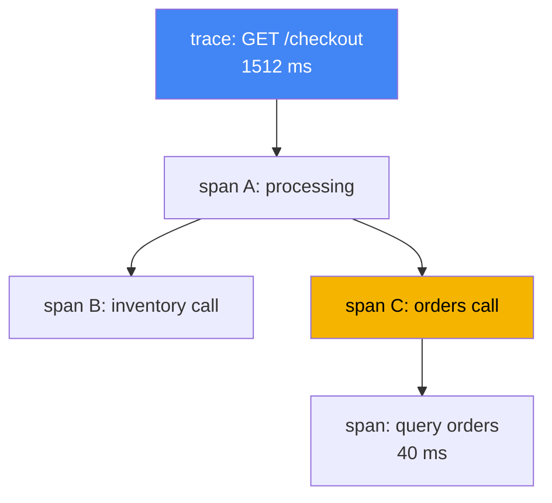
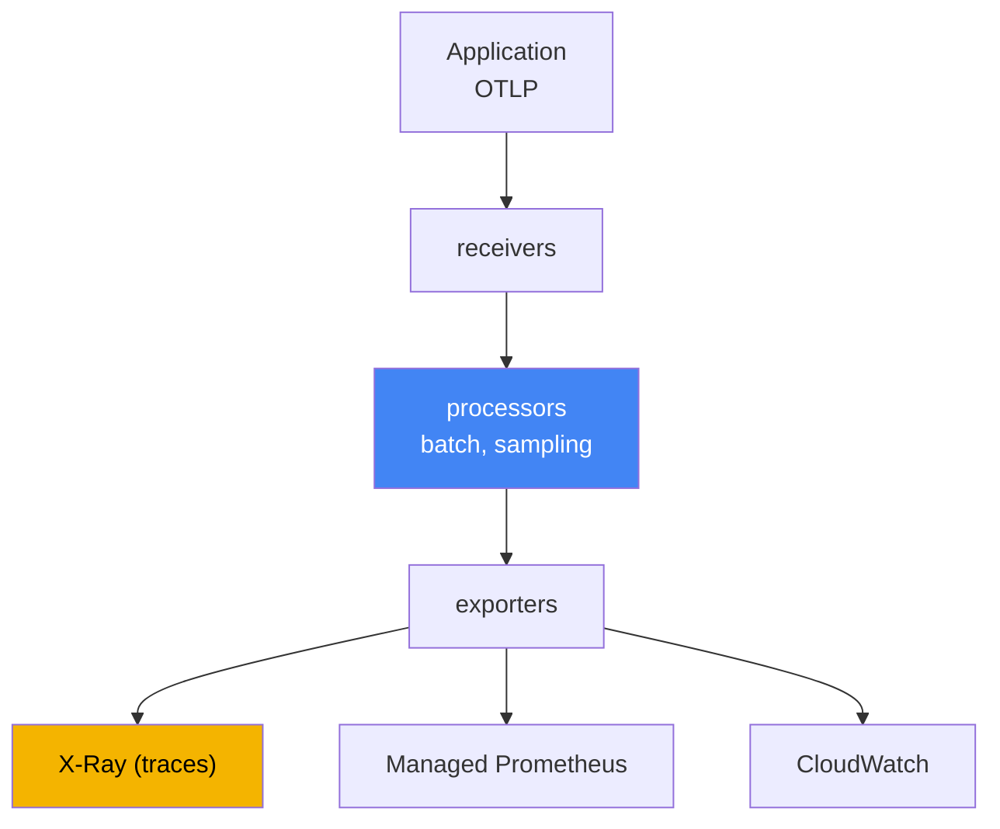

[Русская версия](ru.md) · [Versión en español](es.md) · [Version française](fr.md) · [Deutsche Version](de.md) · [ქართული ვერსია](ge.md) · [繁體中文版](tw.md) · [日本語版](jp.md)
# Chapter 36. Tracing and profiling: ADOT and X-Ray

> **What comes next.** Chapters 33 and 34 provided metrics and logs, two of the three pillars
> of observability. Here is the third: distributed tracing, which connects one request into a
> single path through a chain of services, plus a brief look at profiling. Related topics belong
> to other chapters: metrics, including ADOT as a metrics collector for Amazon Managed Prometheus,
> Chapter 33; logs, Chapter 34; and roles for exporting telemetry to AWS through IRSA and Pod
> Identity, Chapters 16 and 17. This chapter closes Part 6. Part 7, operations, comes next:
> add-ons, upgrades, reliability, backups, and cost.

## 36.1. "p99 increased, but it is unclear who is at fault"

A user complains that a page loads slowly. The on-call engineer opens a dashboard and sees
increased latency in the entry service: p99 jumped from 200 ms to one and a half seconds.
Metrics honestly show that "service A is unhealthy," but do not say why. The request to A then
continues: A calls B, B calls C, and C accesses the database. Metrics do not reveal where the
latency accumulated: in A itself, on the network path to B, or in C's slow database query.

The engineer goes to the logs (Chapter 34) and finds lines from each pod:

```
# log from pod A
level=info msg="GET /checkout 1512ms" 
# log from pod C (a different pod, a different namespace)
level=info msg="query orders 40ms"
```

The lines exist, but they are disconnected. There is no way to tell that this line in A and that
line in C refer to the same user request. Thousands of requests arrive each second, logs are
intermixed, and manually assembling the path of one request from them is impossible. Metrics
answer "what" is happening (latency is rising), and logs answer "why" at one point (an error in a
specific pod), but neither answers where in the chain the latency is. There are five calls in the
chain, but which one is responsible remains a mystery.

Distributed tracing solves precisely this mystery. It gives every request an end-to-end identifier
and records the duration of every operation on its path, so p99 can be broken into components:
this much in A, this much in the call to B, and this much in the database. Next, in order: what a
trace consists of, how OpenTelemetry fits in, how ADOT collects it, and where X-Ray stores it.

## 36.2. What distributed tracing is

Tracing describes the path of one request through every service it touches. Two concepts are enough
to read any trace:

- **trace**: the complete request path from entry to response, with every nested call. A trace has
  a shared `trace id`, the same for every service on the path.
- **span**: one operation within a trace: processing in a service, a call to a neighbor, or a
  database query. A span has a name, start time and duration, a link to its parent span, and
  attributes (HTTP status, URL, table name). Nested spans form a tree, which shows where time went.

To prevent a `trace id` from being lost as the request moves between services, **context
propagation** operates: the entry service puts the trace identifier into outbound request headers,
and the next service reads them and continues the same trace. The industry header format is W3C
Trace Context (`traceparent`). Historically, X-Ray carries context in its `X-Amzn-Trace-Id`
header, and ADOT SDKs support both formats. This matters when the chain includes AWS services
(ALB, API Gateway, Lambda) that set `X-Amzn-Trace-Id`. In `X-Amzn-Trace-Id`, context is held in
the `Root` (trace ID), `Parent` (parent span), and `Sampled` (recording decision) fields. The ADOT
X-Ray propagator translates these fields to and from `traceparent`, and a `Root` in the form
`1-<epoch>-<id>` contains the same 32 hex characters as the W3C `trace id`. Thus, the end-to-end
`trace id` and a single sampling decision do not break at the AWS-service boundary. Without
context propagation, the chain breaks and one tree becomes separate, unconnected fragments.



It is worth remembering separately where this mechanism stops working on its own. HTTP and gRPC
have headers, but an **asynchronous boundary does not carry them**: put a message into SQS, Kafka,
or EventBridge, and auto-instrumentation stops because nobody carries context through the message
body for you. The producer must put context into message attributes, and the consumer (the worker
from Chapter 35) must retrieve it and continue the trace. There are two options: W3C `traceparent`
in ordinary message attributes when you own both sides, and the reserved SQS system attribute
`AWSTraceHeader` containing the X-Ray header. AWS services understand the latter themselves, so it
is the practical option for chains such as SNS, SQS, and Lambda. Skip this step, and the trace
falls apart into "a request arrived" and "something was processed" with no connection between them.

Recording a complete trace for every request is expensive: at thousands of requests per second, it
produces huge volumes of data and noticeable overhead. Therefore, **sampling** is used: record not
all traces, but a fraction of them. The decision to keep or discard is made once at entry and is
propagated in context, so that a trace is not recorded only halfway. This is a head-based approach;
its tail-based alternative at the gateway is covered in Section 36.4, and X-Ray rules in 36.5.

## 36.3. OpenTelemetry: a standard instead of vendor lock-in

Previously, every tracing backend came with its own agent and SDK: code was instrumented for a
specific vendor, and changing the backend meant rewriting the instrumentation. **OpenTelemetry**
(OTel), a CNCF project that became an industry standard, breaks this connection. It defines a
common set of APIs, SDKs, and a protocol, while the backend becomes interchangeable.

The central OTel idea is to separate two things that vendors used to combine:

- **Instrumentation**: how an application produces spans and metrics. It is implemented through
  the OTel SDK in code or through auto-instrumentation without code changes (Section 36.6). It is
  the same regardless of where the data will later go.
- **Backend**: where telemetry is stored and analyzed: X-Ray, CloudWatch, Prometheus, or third-
  party systems. It changes by configuring export, without changing application code.

**OTLP** (OpenTelemetry Protocol) connects them. It is the standard protocol for transmitting
telemetry from an application to a collector and between collectors. The application speaks OTLP
and does not know which backend is behind it. The operational benefit is direct: instrument once,
then decide where to send traces and metrics in collector configuration, changing it without an
application release. You are not tied to one vendor.

## 36.4. ADOT: AWS's OpenTelemetry collector

**ADOT** (AWS Distro for OpenTelemetry) is a distribution of OpenTelemetry components assembled,
tested, and supported by AWS: SDKs, auto-instrumentation agents, and, most importantly here, the
**OpenTelemetry Collector**. The Collector is an intermediary between applications and backends:
it receives telemetry, processes it, and exports it to one or more systems.

In EKS, ADOT is installed as the managed **add-on** (`adot`): the add-on deploys the ADOT Operator,
which manages collectors through the `OpenTelemetryCollector` resource. A collector pipeline has
three stages:

- **receivers**: receive data, usually via OTLP from applications (gRPC and HTTP ports);
- **processors**: process data: batching (`batch`), memory limiting, sampling, and adding
  attributes;
- **exporters**: export to backends: `awsxray` for traces in X-Ray, metrics export to Amazon
  Managed Prometheus (Chapter 33), and exporters to CloudWatch.



Two processors are worth naming because a pipeline without them survives only until its first
spike. Put **`memory_limiter`** first in the chain: it monitors memory use and, when it reaches a
threshold, starts rejecting intake and returns errors to senders instead of accumulating data and
ending in `OOMKilled`. Senders then retry, meaning that some telemetry is lost rather than the
collector itself.

The second is **`tail_sampling`**, which changes the sampling logic itself. The approach described
in Section 36.2 is **head-based**: the fraction is decided at entry, before the request outcome is
known. At a fraction of a few percent, you lose exactly what you were seeking: 5xx responses and
latency spikes. **Tail-based** sampling makes the decision differently: a collector in gateway mode
accumulates the spans of a trace, waits for it to finish, and only then applies policies: preserve
all error traces and traces whose latency exceeds a threshold, while keeping only a small fraction
of successful ones. This spends the X-Ray budget on anomalies rather than noise.

Tail-based sampling has two conditions that tend to emerge during debugging. First, **all spans of
one trace must reach the same collector instance**, or the decision is made from a fragment of the
trace. With multiple gateway replicas, place a layer with the `loadbalancing` exporter ahead of
them, which routes spans by `trace id`. Second, traces accumulate in memory within a waiting
window, so the gateway needs spare RAM, and traces that do not finish within that window are
evaluated incomplete. This gives the order: `memory_limiter` first, `tail_sampling` after it, and
`batch` afterward.

One collector can simultaneously send traces to X-Ray and metrics to Prometheus, hence "one
instrumentation, multiple backends." Deploy the collector in one of these modes; the choice affects
isolation and overhead:

| Mode | Placement | When to use it |
|---|---|---|
| Sidecar | a container beside the application in a pod | low ingestion latency, pod-level isolation |
| DaemonSet | one agent on every node | node collection, one agent for all pods |
| Deployment (gateway) | a separate replica pool, a shared gateway | centralization, batching, and sampling in one place |

A common pattern is an agent close to the application (a sidecar or DaemonSet) plus a shared
gateway (Deployment) that batches and samples before sending to a backend. AWS export permissions
are granted not with keys but with a role: the collector ServiceAccount is bound to an IAM role
through IRSA or Pod Identity (Chapters 16 and 17), with the minimum permissions. For X-Ray, these
are `xray:PutTraceSegments` and `xray:PutTelemetryRecords`.

## 36.5. AWS X-Ray: a backend for traces

**AWS X-Ray** is a managed tracing backend: it receives spans (called segments and subsegments in
X-Ray terminology), stores traces, and provides analytics for them. Its main benefits are:

- **service map**: a map of services and their relationships, built from traces. It shows who calls
  whom, average latency, and the error share on every edge. It reveals the node where latency or
  errors accumulate.
- **latency breakdown by segment**: for a specific trace, you can see how much time was spent in
  every service and every call. This is exactly what was missing in Section 36.1: p99 is broken
  into components.
- **trace search**: select slow or failed requests using filters (response code, service,
  duration), so you inspect problematic traces rather than random ones.

Historically, traces were sent to X-Ray by the **X-Ray daemon**, a separate agent beside the
application. AWS now positions OpenTelemetry as the primary instrumentation standard for X-Ray,
and the preferred path is an **ADOT Collector with the X-Ray exporter** instead of the daemon. In
the OpenTelemetry mapping table, the OpenTelemetry Collector fills the role of the X-Ray daemon,
and X-Ray sampling rules correspond to OTel sampling. For new EKS workloads, install ADOT, not the
daemon.

**Sampling rules** in X-Ray define what fraction of requests to record and can be configured
centrally without changing code. A rule has two parts: a **reservoir**, a fixed number of matching
requests per second that are always recorded, and a **fixed rate**, a fraction of the remainder
above the reservoir. Rules match attributes (service name, path, method), so you can record every
trace for payments and only a fraction for health checks. This is the main control for trace volume
and cost: the lower the fraction, the cheaper and lighter it is, but the higher the chance of
missing a rare problem.

## 36.6. Instrumentation: SDK versus auto-instrumentation

For an application to produce spans at all, it must be instrumented. There are two paths:

- **OTel SDK in code**: a developer adds OpenTelemetry libraries and manually creates spans around
  important operations where needed. This gives more control and precision (you can mark business
  steps), but requires code changes in every language.
- **Auto-instrumentation**: OTel libraries are attached automatically and wrap common frameworks
  (HTTP clients, servers, database drivers) without changing code. In Kubernetes, the
  **OpenTelemetry Operator** does this: based on the `Instrumentation` resource and a pod
  annotation, it adds an agent to a pod at startup by injecting an init container. It is a quick
  start, but covers only what the available libraries support.

In practice, teams often start with auto-instrumentation to quickly obtain traces for HTTP and
database calls, then selectively add manual spans in code for important business logic. Both paths
produce OTLP, so the collector and backend do not depend on that choice.

## 36.7. CloudWatch Application Signals: APM on top of OTel

If CloudWatch is already the observability backend (Chapter 33), tracing can be obtained not
through a separate X-Ray pipeline, but through **CloudWatch Application Signals**, an APM layer on
top of OpenTelemetry. It automatically identifies services and operations from telemetry and
calculates their "golden signals": latency, error rate, and request rate. It also lets you define
SLOs and track their budget.

An important operational connection is that Application Signals is enabled by the same
**`amazon-cloudwatch-observability`** add-on as Container Insights from Chapter 33. The add-on
installs the CloudWatch agent and, by default, enables receipt of metrics and traces from auto-
instrumented applications. Thus, one add-on covers both container metrics and APM with tracing; a
separate ADOT X-Ray pipeline is not required for that. Choosing between "ADOT plus X-Ray" and
"Application Signals" is a choice of backend and out-of-the-box readiness, not different ways to
instrument code: both rest on OpenTelemetry.

## 36.8. Profiling: what consumes CPU inside the process

Tracing shows where time went between services. It does not answer another question: if the time
was spent inside one process, which code spent it? That is the domain of **profiling**.

Continuous profiling continuously captures, with low overhead, what a process spends CPU and
memory on, and shows hotspots: functions and areas of code that consume the most resources. The
difference from tracing is clear:

| Tool | Question it answers | Granularity |
|---|---|---|
| Tracing (X-Ray) | where latency is in a service chain | services and calls |
| Profiling | which code inside a process consumes CPU/memory | functions and lines of code |

In AWS, the continuous-profiling option is **Amazon CodeGuru Profiler**. It collects a profile of
a running application and highlights the most CPU- and memory-expensive locations. In Kubernetes,
eBPF profilers are also often used: **Pyroscope** and **Parca**. They collect CPU and memory
profiles at kernel level, without modifying or reinstrumenting the application, and work for any
language. Deploy them as a DaemonSet on every node; the result is a flame graph by function and
profile storage over time, which makes CPU and memory regressions between releases visible. We do
not go deeply into them here: for typical EKS operations, tracing answers most "where is it slow"
questions, while profiling is added selectively when a trace shows that the bottleneck is inside a
specific service rather than its calls.

## 36.9. The three pillars of observability together

Metrics, logs, and traces are not competitors, but three answers to three different questions about
the same incident. The analysis from Section 36.1 comes together specifically through all three.

| Pillar | Question | Tools (chapters) |
|---|---|---|
| Metrics | what is happening: p99 increased, more errors | Container Insights, Managed Prometheus (Chapter 33) |
| Logs | why at a specific point: error text | Fluent Bit, CloudWatch Logs, OpenSearch (Chapter 34) |
| Traces | where in the chain latency or failure occurs | ADOT, X-Ray, Application Signals (this chapter) |

The on-call workflow is: a metric shows latency grew (what); a trace in X-Ray shows in which of the
five calls it accumulated (where); the log for that service at the same time explains the cause: a
timeout, retries, or a query error (why). Separately, each pillar provides only part of the picture;
together they turn "service A is unhealthy" into "C accesses the database slowly because of this
query." That is why production systems collect them together rather than choosing only one.

## 36.10. How this is used in production

- **Install ADOT as an add-on instead of building the collector manually.** The managed `adot`
  add-on brings the ADOT Operator and is upgraded along with other add-ons (Chapter 37), without
  manually managing collector manifests.
- **Instrument once with OpenTelemetry and choose the backend by configuration.** Code speaks
  OTLP, while the collector decides whether to send to X-Ray, Application Signals, or a third-
  party system. Switching backends requires no application release.
- **Grant export access with a role, not keys.** Bind the collector ServiceAccount to an IAM role
  through IRSA or Pod Identity (Chapters 16 and 17) with minimum permissions
  (`xray:PutTraceSegments`).
- **Configure sampling deliberately.** Keep complete traces for critical paths (payments, login),
  and a low fraction for noisy and operational requests. X-Ray sampling rules can be changed
  centrally without a release.
- **Start with auto-instrumentation; add manual spans selectively.** Quickly obtain traces for
  HTTP and databases, then mark important business logic manually where needed.
- **Do not duplicate backends without a need.** If observability already uses CloudWatch,
  Application Signals through `amazon-cloudwatch-observability` often provides APM without a
  separate X-Ray pipeline.
- **Make `memory_limiter` the first processor.** Otherwise, an OTLP flow spike sends the collector
  itself to `OOMKilled`, and observability disappears at the very moment of the incident.
- **Keep anomalies with tail-based sampling.** Enable `tail_sampling` at the gateway: all traces
  with errors and high latency are recorded completely, while only a small fraction of successful
  ones remains. With multiple gateway replicas, add routing by `trace id`; otherwise, decisions
  are made from incomplete traces.
- **Check context at asynchronous boundaries.** For SQS and Kafka, put context into message
  attributes (`traceparent` or `AWSTraceHeader`) instead of relying on auto-instrumentation.

## 36.11. Mini-glossary

- **trace**: the complete path of one request through services, with a shared `trace id`.
- **span**: an individual operation within a trace (processing, a call, a database query), with
  time and attributes; spans form a trace tree.
- **context propagation**: transfer of a `trace id` between services through headers (W3C Trace
  Context), so a trace does not break.
- **X-Amzn-Trace-Id**: the X-Ray header with `Root`, `Parent`, and `Sampled` fields; the ADOT
  X-Ray propagator maps it to W3C `traceparent`, preserving the end-to-end `trace id`.
- **sampling**: recording a fraction, rather than all, of traces to control volume and cost.
- **head-based and tail-based sampling**: deciding to record at entry, before the request outcome,
  versus deciding at the gateway after assembling the trace (policies for errors and latency).
  Tail-based sampling requires all trace spans to arrive at one collector instance.
- **`memory_limiter`**: a Collector processor that limits memory use: at its threshold, it rejects
  data intake rather than ending in `OOMKilled`; it is placed first.
- **`AWSTraceHeader`**: an SQS system message attribute for the X-Ray trace header; a way to carry
  context across an asynchronous boundary where headers do not exist.
- **OpenTelemetry (OTel)**: a CNCF standard of common APIs, SDKs, and protocol; it separates
  instrumentation from the backend.
- **OTLP**: the protocol for sending telemetry from an application to a collector and between
  collectors.
- **ADOT**: AWS Distro for OpenTelemetry, AWS's OTel distribution (SDKs, agents, Collector).
- **OpenTelemetry Collector**: a collector where receivers accept, processors process, and
  exporters send telemetry to backends.
- **`adot` add-on**: a managed EKS add-on that deploys the ADOT Operator to manage collectors.
- **AWS X-Ray**: a managed trace backend for storage, service maps, latency breakdowns, and trace
  search.
- **service map**: a map of services and relationships with latency and error share on edges.
- **sampling rules**: X-Ray rules that define the recorded request fraction through a reservoir and
  fixed rate.
- **OpenTelemetry Operator**: an operator that provides auto-instrumentation by injecting an agent
  into a pod.
- **CloudWatch Application Signals**: APM on top of OTel (SLOs, latency, errors), enabled by the
  `amazon-cloudwatch-observability` add-on.
- **continuous profiling**: continuous collection of CPU and memory hotspots in code; on AWS,
  Amazon CodeGuru Profiler; eBPF profilers include Pyroscope and Parca.

## 36.12. Chapter summary

- Metrics answer "what" and logs answer "why at one point," but they do not connect one request
  into a chain of services. Distributed tracing answers "where exactly is the latency."
- A trace is a request path with a shared `trace id`; a span is one operation; context propagation
  carries the `trace id` between services; sampling records only a fraction of traces.
- OpenTelemetry is the industry standard: common APIs, SDKs, and the OTLP protocol, separation of
  instrumentation and backend, and no vendor lock-in.
- ADOT is AWS's OTel distribution. In EKS, it is installed through the `adot` add-on, which brings
  the ADOT Operator and manages the OpenTelemetry Collector.
- The Collector receives OTLP, processes it (`batch`, sampling), and exports to multiple backends:
  X-Ray for traces, Managed Prometheus for metrics, and CloudWatch; its modes are sidecar,
  DaemonSet, and Deployment (gateway).
- X-Ray stores traces and provides a service map, latency breakdown, and problem-trace search. For
  new workloads, use an ADOT Collector with the X-Ray exporter instead of the X-Ray daemon.
- Instrument through the OTel SDK in code or auto-instrumentation with the OpenTelemetry Operator;
  grant AWS export permissions with a role through IRSA or Pod Identity (Chapters 16 and 17).
- CloudWatch Application Signals is APM on top of OTel, enabled through the
  `amazon-cloudwatch-observability` add-on (Chapter 33). Profiling (CodeGuru Profiler) finds code
  hotspots and complements tracing.

## 36.13. How this helps in real work

During an incident, tracing turns the vague statement "it is slow" into a specific node. After
seeing p99 grow in metrics, engineers open the X-Ray service map and find the responsible service
by latency on the edges, then drill into one slow trace to see the breakdown by call. They then go
to that service's logs for the same time and find the cause. Without tracing, this path requires
manually correlating logs from a dozen pods, which is practically hopeless under live traffic.

During planning, decide three things. First, the backend: a separate ADOT X-Ray pipeline or APM
through Application Signals on existing CloudWatch. Second, how to instrument: automatic coverage
for speed plus manual spans for business logic. Third, sampling: which paths to record completely
and where a fraction is enough, so you do not pay for noise or lose rare problems. Everywhere, use
an AWS role rather than keys, through the same IRSA or Pod Identity mechanism as other workloads.

## 36.14. Self-check questions

1. Why do metrics and logs not answer which call in a chain experienced increased latency?
2. How does a trace differ from a span, and what is a `trace id`?
3. What does context propagation do, and what happens to a trace when context is not propagated?
4. Why is sampling needed, and why is the decision to record a trace made once at entry?
5. What does OpenTelemetry provide as a standard, and why does separating instrumentation and the
   backend matter?
6. What is OTLP, and how does it allow changing the backend without an application release?
7. What is ADOT, and how is it installed in EKS?
8. What are the three stages of an OpenTelemetry Collector pipeline, and what does each do?
9. How do sidecar, DaemonSet, and Deployment (gateway) collector modes differ?
10. What does the X-Ray service map show, and why is ADOT used instead of the daemon for new
    workloads?
11. How does an X-Ray sampling rule work (reservoir and fixed rate), and why is this needed for
    cost control?
12. How does the OTel SDK in code differ from auto-instrumentation through the OpenTelemetry
    Operator?
13. How does tracing differ from profiling, and which question does each answer?
14. Why is tail-based sampling better than head-based sampling at a fraction of a few percent, and
    which two conditions must be met for it to work correctly?
15. Why is `memory_limiter` placed first, and what does it do when it reaches its threshold?
16. A trace breaks when a message is sent to SQS. Why, and which two methods carry its context?

## Practice

This chapter does not yet have its own lab, but tracing status is easy to inspect on a live
cluster. First, check whether the ADOT add-on is installed and whether its components are running:

```bash
# is the managed adot add-on installed?
aws eks describe-addon --cluster-name my-cluster --addon-name adot \
  --query 'addon.status'
# ADOT Operator and collector pods (namespace depends on the installation)
kubectl get pods -A | grep -Ei "adot|opentelemetry|otel"
```

If applications are instrumented and send traces to X-Ray, inspect the service map and sampling
rules through the X-Ray API:

```bash
# service map and relationships for the last few minutes (times are epoch seconds)
aws xray get-service-graph --start-time 1700000000 --end-time 1700000600
# current sampling rules
aws xray get-sampling-rules
```

Compare the result with the three pillars: does the collector see applications (are there any
traces in X-Ray at all), is a service map built, and does the node with the highest latency on the
map match the service that metrics identify as unhealthy? If your observability is in CloudWatch,
Application Signals through the `amazon-cloudwatch-observability` add-on (Chapter 33) can provide
the same tracing and APM role, in which case a separate ADOT trace pipeline may not be needed.

---
[Table of contents](../README.md) · [Chapter 35](../35/en.md) · [Chapter 37](../37/en.md)
