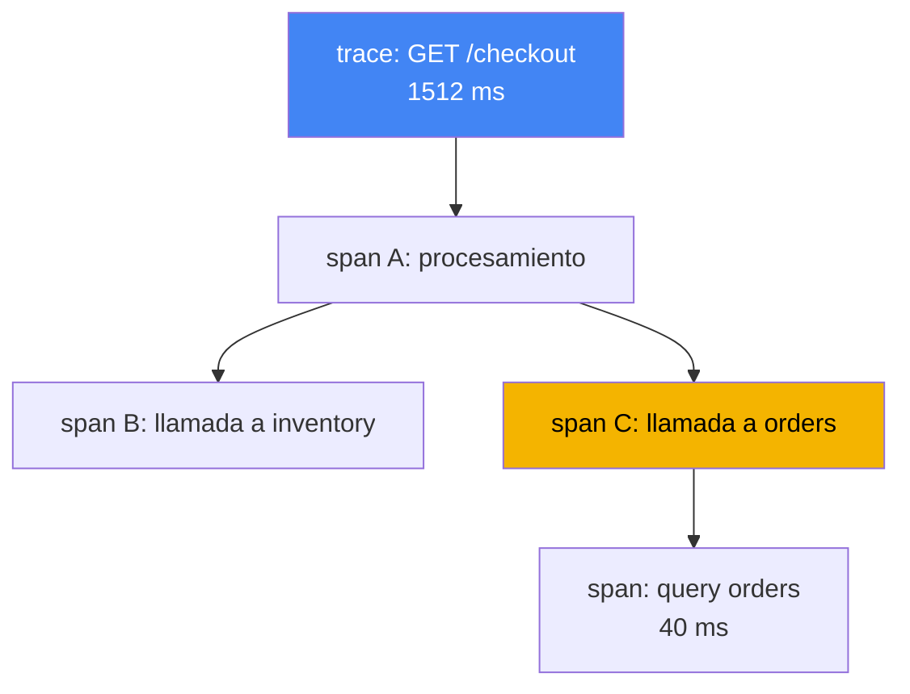
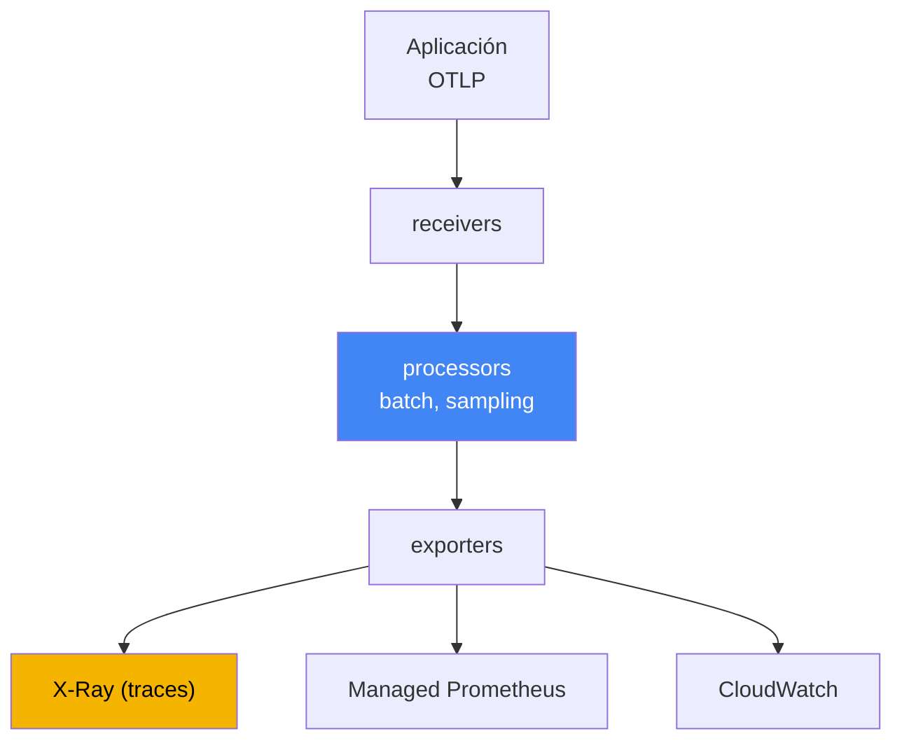

[Eng version](en.md) · [Русская версия](ru.md) · [Version française](fr.md) · [Deutsche Version](de.md) · [ქართული ვერსია](ge.md) · [繁體中文版](tw.md) · [日本語版](jp.md)
# Capítulo 36. Trazado y perfilado: ADOT y X-Ray

> **Qué sigue.** Los capítulos 33 y 34 aportaron métricas y logs, dos de los tres pilares de la observabilidad. Aquí está el tercero: el trazado distribuido, que une una solicitud en una única ruta a través de una cadena de servicios, y una breve introducción al perfilado. Los temas relacionados se tratan en otros capítulos: métricas, incluido ADOT como recopilador de métricas para Amazon Managed Prometheus, capítulo 33; logs, capítulo 34; y roles para exportar telemetría a AWS mediante IRSA y Pod Identity, capítulos 16 y 17. Este capítulo cierra la parte 6. A continuación viene la parte 7, operaciones: complementos, actualizaciones, fiabilidad, copias de seguridad y coste.

## 36.1. «El p99 aumentó, pero no está claro quién tiene la culpa»

Un usuario se queja de que una página carga lentamente. La persona de guardia abre un panel y ve un aumento de latencia en el servicio de entrada: el p99 saltó de 200 ms a un segundo y medio. Las métricas muestran fielmente que «el servicio A está mal», pero no dicen por qué. La solicitud a A continúa internamente: A llama a B, B llama a C y C accede a la base de datos. Las métricas no muestran dónde se acumuló la latencia: en A mismo, en la red hacia B o en una consulta lenta de C a la base de datos.

El ingeniero va a los logs (capítulo 34) y encuentra líneas de cada pod:

```
# log del pod A
level=info msg="GET /checkout 1512ms" 
# log del pod C (otro pod, otro namespace)
level=info msg="query orders 40ms"
```

Las líneas existen, pero están desconectadas. No hay manera de saber que esta línea en A y aquella en C se refieren a la misma solicitud de usuario. Hay miles de solicitudes por segundo, los logs están mezclados y es imposible reconstruir manualmente la ruta de una solicitud. Las métricas responden al «qué» (la latencia crece), los logs al «por qué» en un punto (un error en un pod concreto), pero ninguno responde a «dónde en la cadena» está la latencia. Hay cinco llamadas en la cadena, pero cuál de ellas es la culpable sigue siendo un misterio.

El trazado distribuido resuelve precisamente este misterio. Asigna a cada solicitud un identificador de extremo a extremo y registra el tiempo de cada operación en su ruta, de modo que el p99 se descompone: tanto en A, tanto en la llamada a B y tanto en la base de datos. A continuación, en orden: de qué se compone un trace, qué papel tiene OpenTelemetry, cómo lo recopila ADOT y dónde lo almacena X-Ray.

## 36.2. Qué es el trazado distribuido

El trazado describe la ruta de una solicitud por todos los servicios que toca. Dos conceptos bastan para leer cualquier trace:

- **trace**: toda la ruta de la solicitud, desde la entrada hasta la respuesta, con todas las llamadas anidadas. Un trace tiene un `trace id` común, igual para todos los servicios de la ruta.
- **span**: una operación dentro de un trace: procesamiento en un servicio, llamada a un vecino o consulta a una base de datos. Un span tiene nombre, hora de inicio y duración, un vínculo con su span padre y atributos (código HTTP, URL, nombre de tabla). Los span anidados forman un árbol, que muestra dónde se fue el tiempo.

Para que el `trace id` no se pierda al pasar de un servicio a otro, funciona la **propagación de contexto**: el servicio de entrada coloca el identificador del trace en las cabeceras de la solicitud saliente, el siguiente servicio las lee y continúa el mismo trace. El formato estándar de cabeceras es W3C Trace Context (`traceparent`). Históricamente, X-Ray transporta el contexto en su cabecera `X-Amzn-Trace-Id`, y los SDK de ADOT admiten ambos formatos. Esto es importante cuando la cadena incluye servicios de AWS (ALB, API Gateway, Lambda) que establecen precisamente `X-Amzn-Trace-Id`. En `X-Amzn-Trace-Id`, el contexto está en los campos `Root` (id del trace), `Parent` (span padre) y `Sampled` (decisión de registro). El propagador X-Ray de ADOT convierte estos campos hacia y desde `traceparent`, y un `Root` de la forma `1-<epoch>-<id>` contiene los mismos 32 caracteres hex que el `trace id` de W3C. Así, el `trace id` de extremo a extremo y una única decisión de muestreo no se rompen en el límite de los servicios AWS. Sin propagación de contexto, la cadena se rompe y, en lugar de un árbol, se obtienen fragmentos separados sin conexión.



Conviene recordar por separado dónde este mecanismo deja de funcionar por sí solo. HTTP y gRPC tienen cabeceras, pero **un límite asíncrono no las transporta**: se coloca un mensaje en SQS, Kafka o EventBridge, y la instrumentación automática se interrumpe porque nadie llevará el contexto por el cuerpo del mensaje por usted. El productor debe colocar el contexto en los atributos del mensaje, y el consumidor (el mismo worker del capítulo 35) debe extraerlo y continuar el trace. Hay dos opciones: `traceparent` de W3C en atributos normales del mensaje si ambos lados son propios, y el atributo de sistema reservado de SQS `AWSTraceHeader` con la cabecera de X-Ray. Los propios servicios AWS entienden este último, por lo que para cadenas como SNS, SQS y Lambda es el que funciona. Si omite este paso, el trace se descompone en «la solicitud llegó» y «algo se procesó», sin vínculo entre ambos.

Registrar un trace completo para cada solicitud es caro: con miles de solicitudes por segundo, supone montañas de datos y una sobrecarga considerable. Por ello se aplica **sampling**: no se registran todos los traces, sino una fracción. La decisión de «guardar o no» se toma una vez en la entrada y se propaga por el contexto, para que el trace no quede registrado solo a medias. Este es el enfoque head-based; su alternativa tail-based en la pasarela se explica en la sección 36.4, y las reglas de X-Ray en la 36.5.

## 36.3. OpenTelemetry: un estándar en lugar de dependencia del proveedor

Antes, cada backend de trazado venía con su propio agente y SDK: el código se instrumentaba para un proveedor concreto y cambiar el backend significaba reescribir la instrumentación. **OpenTelemetry** (OTel), un proyecto de CNCF que se convirtió en estándar de la industria, rompe esta dependencia. Define un conjunto común de API, SDK y protocolo, mientras que el backend pasa a ser intercambiable.

La idea clave de OTel es separar dos cosas que los proveedores mezclaban:

- **Instrumentación**: cómo una aplicación produce span y métricas. Se realiza mediante el SDK de OTel en el código o mediante instrumentación automática sin cambiar el código (sección 36.6). Es igual independientemente de dónde se envíen los datos después.
- **Backend**: dónde se almacena y analiza la telemetría: X-Ray, CloudWatch, Prometheus o sistemas de terceros. Se cambia configurando la exportación, sin modificar el código de la aplicación.

Los conecta **OTLP** (OpenTelemetry Protocol), el protocolo estándar para transmitir telemetría desde la aplicación al collector y entre collectors. La aplicación habla OTLP y no sabe qué backend hay detrás. El significado práctico para las operaciones es directo: se instrumenta una vez, y se decide dónde enviar traces y métricas en la configuración del collector, que puede cambiarse sin publicar la aplicación. No hay dependencia de un único proveedor.

## 36.4. ADOT: el collector OpenTelemetry de AWS

**ADOT** (AWS Distro for OpenTelemetry) es una distribución de componentes de OpenTelemetry compilada, probada y respaldada por AWS: SDK, agentes de instrumentación automática y, lo más importante aquí, el **OpenTelemetry Collector**. El Collector es un intermediario entre las aplicaciones y los backends: recibe telemetría, la procesa y la exporta a uno o varios sistemas.

En EKS, ADOT se instala como **complemento administrado** (`adot`): el complemento despliega ADOT Operator, que administra collectors mediante el recurso `OpenTelemetryCollector`. Un pipeline de collector consta de tres etapas:

- **receivers**: reciben datos, habitualmente por OTLP desde las aplicaciones (puertos gRPC y HTTP);
- **processors**: procesan datos: agrupación (`batch`), limitación de memoria, sampling y adición de atributos;
- **exporters**: exportan a backends: `awsxray` para traces en X-Ray, exportación de métricas a Amazon Managed Prometheus (capítulo 33) y exportadores a CloudWatch.



Conviene mencionar dos processors por nombre, porque sin ellos un pipeline solo sobrevive hasta el primer pico. El primero de la cadena es **`memory_limiter`**: vigila el consumo de memoria y, al alcanzar el umbral, empieza a rechazar la recepción y devuelve un error a los remitentes, en lugar de acumular datos y terminar en `OOMKilled`. Los remitentes entonces reintentan, es decir, se pierde parte de la telemetría, no el propio collector.

El segundo es **`tail_sampling`**, y cambia la propia lógica del sampling. Lo descrito en la sección 36.2 es **head-based**: la fracción se decide en la entrada, antes de conocer el resultado de la solicitud. Con una fracción de unos pocos por ciento se pierde justo lo que se buscaba: respuestas 5xx y picos de latencia. **Tail-based** decide de otro modo: un collector en modo gateway acumula los span de un trace, espera a que finalice y solo entonces aplica las políticas: conserva todos los traces con errores y con latencia por encima del umbral, y de los exitosos deja una pequeña fracción. Así, el presupuesto de X-Ray se gasta en anomalías, no en ruido.

El tail-based tiene dos condiciones que suelen descubrirse al depurar. Primera: **todos los span de un trace deben llegar a la misma instancia del collector**, de lo contrario la decisión se toma a partir de un fragmento del trace; con varias réplicas de gateway, se coloca delante una capa con el exportador `loadbalancing`, que enruta los span por `trace id`. Segunda: los traces se acumulan en memoria dentro de una ventana de espera, por lo que la pasarela necesita RAM de sobra y los traces que no terminan dentro de la ventana se evalúan incompletos. De ahí el orden: primero `memory_limiter`, después `tail_sampling` y luego `batch`.

Un collector puede enviar al mismo tiempo traces a X-Ray y métricas a Prometheus, de ahí «una instrumentación, varios backends». El collector se despliega en uno de los modos siguientes, y la elección afecta al aislamiento y a la sobrecarga:

| Modo | Cómo se coloca | Cuándo se usa |
|---|---|---|
| Sidecar | contenedor junto a la aplicación en un pod | baja latencia de recepción, aislamiento por pod |
| DaemonSet | un agente por nodo | recopilación desde el nodo, un agente para todos los pods |
| Deployment (gateway) | pool independiente de réplicas, pasarela compartida | centralización, agrupación y sampling en un lugar |

El patrón típico es un agente cerca de la aplicación (sidecar o DaemonSet) más un gateway común (Deployment), que agrupa y aplica sampling antes de enviarlo al backend. Los permisos de exportación a AWS no se conceden con claves, sino con un rol: el ServiceAccount del collector se vincula a un rol IAM mediante IRSA o Pod Identity (capítulos 16 y 17), con el conjunto mínimo de permisos. Para X-Ray son `xray:PutTraceSegments` y `xray:PutTelemetryRecords`.

## 36.5. AWS X-Ray: backend para traces

**AWS X-Ray** es un backend de trazado administrado: recibe span (segmentos y subsegmentos en la terminología de X-Ray), almacena traces y proporciona análisis sobre ellos. Las principales razones para usarlo son:

- **service map**: mapa de servicios y relaciones entre ellos, construido a partir de traces. Muestra quién llama a quién, la latencia media y la proporción de errores en cada arista. Permite ver el nodo donde se acumulan latencia o errores.
- **desglose de latencia por segmentos**: para un trace concreto se ve cuánto tiempo se dedicó a cada servicio y cada llamada. Es exactamente lo que faltaba en la sección 36.1: el p99 se descompone en componentes.
- **búsqueda de traces**: selección de solicitudes lentas o con errores mediante filtros (código de respuesta, servicio, duración), para examinar traces problemáticos y no aleatorios.

Históricamente, los traces se enviaban a X-Ray mediante el **daemon de X-Ray**, un agente independiente junto a la aplicación. Ahora AWS sitúa OpenTelemetry como el estándar principal de instrumentación para X-Ray, y la vía preferida es un **ADOT Collector con el exportador de X-Ray** en lugar del daemon. En la tabla de equivalencias de OpenTelemetry, el OpenTelemetry Collector ocupa el rol del daemon de X-Ray, y las reglas de sampling de X-Ray corresponden al sampling de OTel. Para nuevas cargas de trabajo en EKS se instala ADOT, no el daemon.

Las **sampling rules** de X-Ray determinan qué fracción de solicitudes se registra y se configuran centralmente sin cambiar el código. Una regla consta de dos partes: **reservoir**, un número fijo de solicitudes coincidentes por segundo que se registran de forma garantizada, y **fixed rate**, una fracción del resto por encima del reservorio. Las reglas coinciden con atributos (nombre del servicio, ruta, método), por lo que pueden registrarse todos los traces de pagos y solo una fracción de los health checks. Es la palanca principal para controlar el volumen y coste de los traces: cuanto menor sea la fracción, más barato y ligero será, pero mayor será la probabilidad de no detectar un problema infrecuente.

## 36.6. Instrumentación: SDK frente a instrumentación automática

Para que una aplicación produzca span, hay que instrumentarla. Hay dos caminos:

- **SDK de OTel en el código**: el desarrollador incorpora bibliotecas de OpenTelemetry y, cuando es necesario, crea manualmente span alrededor de operaciones importantes. Ofrece más control y precisión (se pueden marcar pasos de negocio), pero requiere cambios de código en cada lenguaje.
- **Instrumentación automática**: las bibliotecas de OTel se conectan automáticamente y envuelven frameworks populares (clientes HTTP, servidores, controladores de bases de datos) sin modificar el código. En Kubernetes, esto lo realiza **OpenTelemetry Operator**: según el recurso `Instrumentation` y una anotación en el pod, agrega un agente al pod al inicio mediante la inyección de un init container. Es un inicio rápido, pero cubre solo lo que admiten las bibliotecas disponibles.

En la práctica, se suele empezar con instrumentación automática para obtener rápidamente traces de HTTP y llamadas a bases de datos; después se añaden de forma selectiva span manuales en el código para la lógica de negocio importante. Ambas vías producen OTLP a la salida, por lo que el collector y el backend no dependen de la elección.

## 36.7. CloudWatch Application Signals: APM sobre OTel

Si el backend de observabilidad ya es CloudWatch (capítulo 33), el trazado puede obtenerse no mediante un pipeline de X-Ray independiente, sino mediante **CloudWatch Application Signals**, una capa de APM sobre OpenTelemetry. Identifica automáticamente servicios y operaciones a partir de la telemetría y calcula sus «señales doradas»: latencia, frecuencia de errores y de solicitudes; además permite definir SLO y controlar su presupuesto.

Una relación importante para las operaciones es que Application Signals se habilita con el mismo complemento **`amazon-cloudwatch-observability`** que Container Insights del capítulo 33. El complemento instala el agente de CloudWatch y, de forma predeterminada, habilita la recepción de métricas y traces de aplicaciones instrumentadas automáticamente. Así, un complemento cubre tanto las métricas de contenedores como APM con trazado; no es obligatorio montar un pipeline de X-Ray independiente con ADOT para ello. Elegir entre «ADOT más X-Ray» y «Application Signals» es una elección de backend y de nivel de preparación inicial, no de formas distintas de instrumentar el código: ambos se basan en OpenTelemetry.

## 36.8. Perfilado: qué consume CPU dentro del proceso

El trazado muestra dónde se fue el tiempo entre servicios. No responde a otra pregunta: si el tiempo se fue dentro de un proceso, ¿en qué código concreto? Ese es el ámbito del **perfilado**.

El perfilado continuo (continuous profiling) recopila constantemente, con baja sobrecarga, en qué consume CPU y memoria un proceso, y muestra hotspots: funciones y zonas de código que gastan más recursos. La diferencia con el trazado es clara:

| Herramienta | Pregunta que responde | Granularidad |
|---|---|---|
| Trazado (X-Ray) | dónde está la latencia en la cadena de servicios | servicios y llamadas |
| Perfilado | qué código dentro del proceso consume CPU/memoria | funciones y líneas de código |

En AWS, la opción de perfilado continuo es **Amazon CodeGuru Profiler**. Recopila el perfil de una aplicación en ejecución y resalta las ubicaciones más costosas en CPU y memoria. Junto a él, en Kubernetes se usan con frecuencia perfiladores eBPF: **Pyroscope** y **Parca**. Recopilan perfiles de CPU y memoria a nivel del kernel, sin modificar ni reinstrumentar la aplicación, y funcionan con cualquier lenguaje. Se despliegan como DaemonSet en cada nodo; el resultado es un flame graph por funciones y almacenamiento de perfiles a lo largo del tiempo, de modo que las regresiones de CPU y memoria entre lanzamientos se hacen visibles. No profundizamos aquí: para la operación típica de EKS, el trazado responde a la mayoría de las preguntas de «dónde es lento», y el perfilado se añade de forma específica cuando el trace muestra que el cuello de botella está dentro de un servicio concreto, no en sus llamadas.

## 36.9. Los tres pilares de la observabilidad juntos

Métricas, logs y traces no son competidores, sino tres respuestas a tres preguntas distintas sobre el mismo incidente. El análisis de la sección 36.1 se completa precisamente con la combinación de los tres.

| Pilar | Pregunta | Herramientas (capítulos) |
|---|---|---|
| Métricas | qué sucede: aumentó el p99, hay más errores | Container Insights, Managed Prometheus (capítulo 33) |
| Logs | por qué en un punto concreto: texto del error | Fluent Bit, CloudWatch Logs, OpenSearch (capítulo 34) |
| Traces | dónde está la latencia o el fallo en la cadena | ADOT, X-Ray, Application Signals (este capítulo) |

El ciclo de trabajo de guardia es el siguiente: una métrica muestra que aumentó la latencia (qué); un trace en X-Ray muestra en cuál de las cinco llamadas se acumuló (dónde); el log de ese servicio en ese momento explica la causa: un timeout, reintentos o un error de consulta (por qué). Por separado, cada pilar ofrece solo parte de la imagen; juntos convierten «el servicio A está mal» en «C accede lentamente a la base de datos por esta consulta». Por eso en producción se recopilan juntos, en vez de elegir uno solo.

## 36.10. Cómo se aplica en producción

- **Se instala ADOT como complemento, no se construye el collector manualmente.** El complemento administrado `adot` incluye ADOT Operator y se actualiza junto con los demás complementos (capítulo 37), sin gestionar manualmente manifiestos del collector.
- **Se instrumenta una vez con OpenTelemetry y el backend se elige por configuración.** El código habla OTLP, y el collector decide si enviar a X-Ray, Application Signals o un sistema de terceros. Cambiar de backend no requiere publicar la aplicación.
- **El acceso de exportación se concede con un rol, no con claves.** El ServiceAccount del collector se vincula a un rol IAM mediante IRSA o Pod Identity (capítulos 16 y 17) con permisos mínimos (`xray:PutTraceSegments`).
- **Se configura el sampling de forma consciente.** Traces completos para rutas críticas (pagos, inicio de sesión), y una fracción baja para solicitudes ruidosas y operativas. Las sampling rules de X-Ray se modifican centralmente, sin publicación.
- **Se comienza con instrumentación automática; los span manuales se añaden selectivamente.** Se obtienen rápido traces de HTTP y bases de datos, y después se marca manualmente la lógica de negocio importante donde sea necesario.
- **No se duplican backends sin necesidad.** Si la observabilidad ya está en CloudWatch, Application Signals mediante `amazon-cloudwatch-observability` a menudo cubre APM sin un pipeline de X-Ray independiente.
- **Se coloca `memory_limiter` como primer processor.** De otro modo, un pico de flujo OTLP lleva al propio collector a `OOMKilled`, y la observabilidad desaparece justo durante el incidente.
- **Las anomalías se conservan con sampling tail-based.** En la pasarela se habilita `tail_sampling`: todos los traces con errores y alta latencia se registran completos, y de los exitosos queda una pequeña fracción. Con varias réplicas de gateway se añade enrutamiento por `trace id`; de otro modo, las decisiones se toman a partir de traces incompletos.
- **Se comprueba el contexto en los límites asíncronos.** Para SQS y Kafka, el contexto se coloca en atributos del mensaje (`traceparent` o `AWSTraceHeader`), sin confiar en la instrumentación automática.

## 36.11. Miniglosario

- **trace**: toda la ruta de una solicitud por los servicios, con un `trace id` común.
- **span**: una operación individual dentro de un trace (procesamiento, llamada, consulta a base de datos), con tiempo y atributos; los span forman un árbol de trace.
- **propagación de contexto**: transmisión de un `trace id` entre servicios mediante cabeceras (W3C Trace Context), para que el trace no se rompa.
- **X-Amzn-Trace-Id**: cabecera de X-Ray con los campos `Root`, `Parent` y `Sampled`; el propagador X-Ray de ADOT la asigna a `traceparent` de W3C y conserva el `trace id` de extremo a extremo.
- **sampling**: registro de una fracción, no de todos los traces, para controlar volumen y coste.
- **sampling head-based y tail-based**: decisión de registrar en la entrada, antes de conocer el resultado de la solicitud, frente a una decisión en la pasarela después de ensamblar el trace (políticas por errores y latencia). Tail-based requiere que todos los span del trace lleguen a una instancia del collector.
- **`memory_limiter`**: processor de Collector que limita el uso de memoria: en el umbral rechaza la recepción de datos en vez de terminar en `OOMKilled`; se coloca primero.
- **`AWSTraceHeader`**: atributo de mensaje de sistema de SQS para la cabecera de trace de X-Ray; una forma de transportar el contexto por un límite asíncrono donde no hay cabeceras.
- **OpenTelemetry (OTel)**: estándar de CNCF con API, SDK y protocolo comunes; separa la instrumentación del backend.
- **OTLP**: protocolo para enviar telemetría desde una aplicación a un collector y entre collectors.
- **ADOT**: AWS Distro for OpenTelemetry, distribución OTel de AWS (SDK, agentes, Collector).
- **OpenTelemetry Collector**: recopilador donde los receivers reciben, los processors procesan y los exporters envían telemetría a los backends.
- **complemento `adot`**: complemento administrado de EKS que despliega ADOT Operator para gestionar collectors.
- **AWS X-Ray**: backend administrado de traces: almacenamiento, service map, desglose de latencia y búsqueda de traces.
- **service map**: mapa de servicios y relaciones con latencia y proporción de errores en las aristas.
- **sampling rules**: reglas de X-Ray que definen la fracción de solicitudes registradas mediante reservoir y fixed rate.
- **OpenTelemetry Operator**: operador que realiza la instrumentación automática inyectando un agente en un pod.
- **CloudWatch Application Signals**: APM sobre OTel (SLO, latencia, errores), habilitado por el complemento `amazon-cloudwatch-observability`.
- **continuous profiling**: recopilación continua de hotspots de CPU y memoria en código; en AWS, Amazon CodeGuru Profiler; entre los perfiladores eBPF, Pyroscope y Parca.

## 36.12. Resumen del capítulo

- Las métricas dicen «qué» y los logs «por qué en un punto», pero no conectan una solicitud en una cadena de servicios; el trazado distribuido responde «dónde está exactamente la latencia».
- Un trace es la ruta de una solicitud con un `trace id` común; un span es una operación individual; la propagación de contexto lleva el `trace id` entre servicios; el sampling registra solo una fracción de los traces.
- OpenTelemetry es el estándar de la industria: API, SDK y protocolo OTLP comunes, separación entre instrumentación y backend, y ausencia de dependencia del proveedor.
- ADOT es la distribución OTel de AWS; en EKS se instala mediante el complemento `adot`, que incluye ADOT Operator y gestiona OpenTelemetry Collector.
- Collector recibe OTLP, lo procesa (`batch`, sampling) y lo exporta a varios backends: X-Ray para traces, Managed Prometheus para métricas y CloudWatch; los modos son sidecar, DaemonSet y Deployment (gateway).
- X-Ray almacena traces y ofrece service map, desglose de latencia y búsqueda de traces problemáticos; para cargas de trabajo nuevas se usa ADOT Collector con el exportador de X-Ray en lugar del daemon de X-Ray.
- Se instrumenta mediante el SDK de OTel en código o mediante instrumentación automática con OpenTelemetry Operator; los permisos de exportación a AWS se conceden con un rol mediante IRSA o Pod Identity (capítulos 16 y 17).
- CloudWatch Application Signals es APM sobre OTel y se habilita mediante el complemento `amazon-cloudwatch-observability` (capítulo 33); el perfilado (CodeGuru Profiler) busca hotspots en el código y complementa el trazado.

## 36.13. Cómo resulta útil en el trabajo real

Durante una guardia, el trazado convierte el difuso «va lento» en un nodo concreto. Al ver que aumenta el p99 en las métricas, se abre el service map de X-Ray y se encuentra el servicio responsable por la latencia en las aristas; después se profundiza en un trace lento concreto y se ve el desglose por llamadas. A continuación se va a los logs de ese servicio para el mismo momento y se encuentra la causa. Sin trazado, esta ruta requiere correlacionar manualmente logs de una decena de pods, algo prácticamente irrealizable con tráfico activo.

Al planificar se deciden tres cosas. Primera, el backend: un pipeline de X-Ray independiente con ADOT o APM mediante Application Signals sobre el CloudWatch ya existente. Segunda, cómo instrumentar: automático para cobertura rápida más span manuales para lógica de negocio. Tercera, sampling: qué rutas registrar por completo y dónde basta una fracción, para no pagar por ruido ni perder problemas infrecuentes. En todos los casos, el acceso a AWS se hace mediante un rol, no claves, con el mismo mecanismo IRSA o Pod Identity que para las demás cargas de trabajo.

## 36.14. Preguntas de autoevaluación

1. ¿Por qué las métricas y los logs no responden en cuál de las llamadas de una cadena aumentó la latencia?
2. ¿En qué se diferencia un trace de un span y qué es un `trace id`?
3. ¿Qué hace la propagación de contexto y qué sucede con el trace si el contexto no se transmite?
4. ¿Para qué se necesita sampling y por qué la decisión de «registrar o no un trace» se toma una vez en la entrada?
5. ¿Qué aporta OpenTelemetry como estándar y por qué es importante separar instrumentación y backend?
6. ¿Qué es OTLP y cómo permite cambiar de backend sin publicar la aplicación?
7. ¿Qué es ADOT y cómo se instala en EKS?
8. ¿De qué tres etapas consta el pipeline de OpenTelemetry Collector y qué hace cada una?
9. ¿En qué se diferencian los modos sidecar, DaemonSet y Deployment (gateway) de collector?
10. ¿Qué muestra el service map de X-Ray y por qué se usa ADOT en lugar del daemon para nuevas cargas de trabajo?
11. ¿Cómo funciona una sampling rule en X-Ray (reservoir y fixed rate) y por qué sirve para controlar el coste?
12. ¿En qué se diferencia el SDK de OTel en código de la instrumentación automática con OpenTelemetry Operator?
13. ¿En qué se diferencia el trazado del perfilado y qué pregunta responde cada uno?
14. ¿Por qué el sampling tail-based es mejor que head-based con una fracción de unos pocos por ciento y qué dos condiciones deben cumplirse para que funcione correctamente?
15. ¿Por qué se coloca `memory_limiter` como primer processor y qué hace al alcanzar su umbral?
16. Un trace se rompe al enviar un mensaje a SQS. ¿Por qué y de qué dos formas se transporta el contexto?

## Práctica

Este capítulo todavía no tiene laboratorio propio, pero es fácil inspeccionar el estado del trazado en un clúster activo. Primero compruebe si el complemento ADOT está instalado y si sus componentes se han iniciado:

```bash
# ¿está instalado el complemento administrado adot?
aws eks describe-addon --cluster-name my-cluster --addon-name adot \
  --query 'addon.status'
# pods de ADOT Operator y collectors (el namespace depende de la instalación)
kubectl get pods -A | grep -Ei "adot|opentelemetry|otel"
```

Si las aplicaciones están instrumentadas y envían traces a X-Ray, examine el mapa de servicios y las reglas de sampling mediante la API de X-Ray:

```bash
# mapa de servicios y relaciones de los últimos minutos (tiempos en segundos epoch)
aws xray get-service-graph --start-time 1700000000 --end-time 1700000600
# reglas de sampling vigentes
aws xray get-sampling-rules
```

Compare el resultado con los tres pilares: ¿el collector ve las aplicaciones (hay traces en X-Ray siquiera), se construye un service map y coincide el nodo con mayor latencia del mapa con el servicio que las métricas señalan como problemático? Si su observabilidad está en CloudWatch, Application Signals mediante el complemento `amazon-cloudwatch-observability` (capítulo 33) puede desempeñar el mismo papel de trazado y APM; entonces puede que no sea necesario un pipeline ADOT separado para traces.

---
[Índice](../README_ES.md) · [Capítulo 35](../35/es.md) · [Capítulo 37](../37/es.md)
