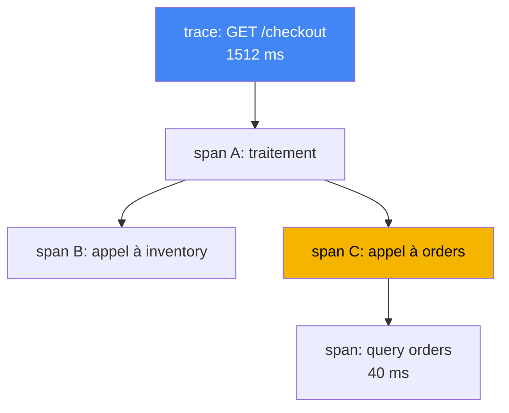
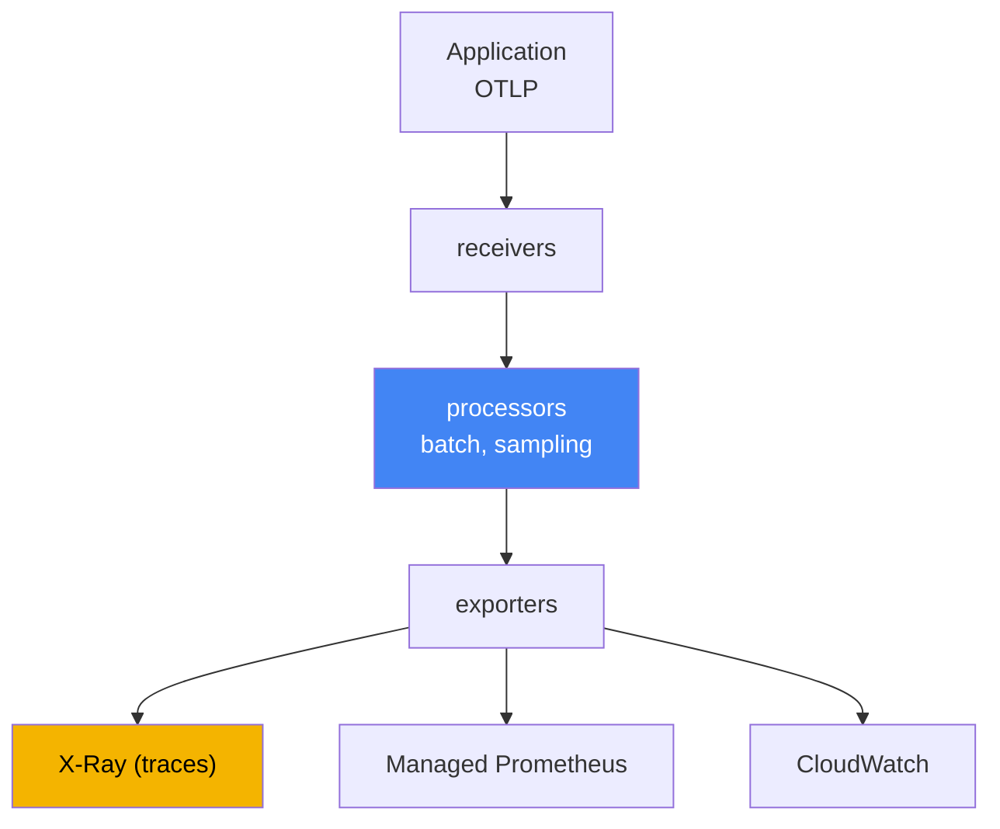

[Eng version](en.md) · [Versión en español](es.md) · [Русская версия](ru.md) · [Deutsche Version](de.md) · [ქართული ვერსია](ge.md) · [繁體中文版](tw.md) · [日本語版](jp.md)
# Chapitre 36. Tracing et profilage : ADOT et X-Ray

> **La suite.** Les chapitres 33 et 34 ont fourni les métriques et les logs, deux des trois piliers de l’observabilité. Voici le troisième : le tracing distribué, qui relie une requête en un chemin unique à travers une chaîne de services, et, brièvement, le profilage. Les sujets connexes sont traités dans d’autres chapitres : les métriques (dont ADOT comme collecteur de métriques dans Amazon Managed Prometheus), chapitre 33 ; les logs, chapitre 34 ; les rôles permettant d’exporter la télémétrie vers AWS via IRSA et Pod Identity, chapitres 16 et 17. Ce chapitre clôt la partie 6. La partie 7 aborde ensuite l’exploitation : add-ons, mises à jour, fiabilité, sauvegardes et coût.

## 36.1. « Le p99 augmente, mais on ignore qui est responsable »

Un utilisateur se plaint : la page se charge lentement. L’astreinte ouvre le tableau de bord et constate une hausse de latence sur le service d’entrée : le p99 est passé de 200 ms à une seconde et demie. Les métriques montrent honnêtement que « le service A va mal », mais n’expliquent pas pourquoi. La requête adressée à A continue en interne : A appelle B, B appelle C, C interroge une base de données. Les métriques ne permettent pas de voir où la latence s’est accumulée : dans A lui-même, sur le réseau vers B, ou dans la requête lente de C vers la base.

L’ingénieur consulte les logs (chapitre 34) et trouve des lignes provenant de chaque pod :

```
# log du pod A
level=info msg="GET /checkout 1512ms" 
# log du pod C (autre pod, autre namespace)
level=info msg="query orders 40ms"
```

Les lignes existent, mais elles sont isolées. Rien ne permet d’affirmer que cette ligne dans A et celle dans C concernent une même requête utilisateur. Il y a des milliers de requêtes par seconde, les logs sont mélangés, et reconstruire manuellement le chemin d’une requête est impossible. Les métriques répondent à la question « quoi » (la latence augmente), les logs au « pourquoi » en un point (une erreur dans un pod précis), mais ni les unes ni les autres ne répondent à « où dans la chaîne » se situe la latence. Cinq appels dans la chaîne, mais lequel est responsable reste un mystère.

C’est précisément ce mystère que résout le tracing distribué. Il attribue à chaque requête un identifiant de bout en bout et enregistre la durée de chaque opération sur son chemin ; le p99 se décompose alors : tant de temps dans A, tant pour l’appel à B, tant dans la base. Nous verrons dans l’ordre de quoi se compose un trace, quel est le rôle d’OpenTelemetry, comment ADOT le collecte et où X-Ray le stocke.

## 36.2. Qu’est-ce que le tracing distribué

Le tracing décrit le chemin d’une requête à travers tous les services qu’elle touche. Deux notions suffisent pour lire n’importe quel trace :

- **trace** : le chemin complet d’une requête, de son entrée à sa réponse, avec tous les appels imbriqués. Un trace possède un `trace id` commun, identique pour tous les services sur le chemin.
- **span** : une opération au sein d’un trace : traitement dans un service, appel à un voisin, requête vers une base. Un span a un nom, une heure de début et une durée, une référence à son span parent et des attributs (code HTTP, URL, nom de table). Les span imbriqués forment un arbre, qui indique où le temps a été dépensé.

Pour que le `trace id` ne se perde pas lors du passage d’un service à l’autre, le mécanisme de **context propagation** fonctionne ainsi : le service entrant place l’identifiant du trace dans les en-têtes de la requête sortante, le service suivant les lit et poursuit le même trace. Le format d’en-tête industriel est W3C Trace Context (`traceparent`). Historiquement, X-Ray transporte le contexte dans son en-tête `X-Amzn-Trace-Id`, et les SDK ADOT connaissent les deux formats. C’est important lorsqu’une chaîne contient des services AWS (ALB, API Gateway, Lambda) qui définissent précisément `X-Amzn-Trace-Id`. Dans `X-Amzn-Trace-Id`, le contexte est porté par les champs `Root` (id du trace), `Parent` (span parent) et `Sampled` (décision d’enregistrement). Le propagator X-Ray d’ADOT convertit ces champs vers `traceparent` et inversement, et un `Root` de la forme `1-<epoch>-<id>` correspond aux mêmes 32 hex que le `trace id` W3C. Ainsi, le `trace id` de bout en bout et une décision d’échantillonnage unique ne sont pas rompus à la frontière des services AWS. Sans propagation du contexte, la chaîne est rompue et produit des fragments distincts non reliés au lieu d’un seul arbre.



Il faut retenir séparément où ce mécanisme cesse de fonctionner seul. Les en-têtes existent avec HTTP et gRPC, mais **une frontière asynchrone ne les transporte pas** : vous placez un message dans SQS, Kafka ou EventBridge, et l’auto-instrumentation s’interrompt, car personne ne transportera le contexte dans le corps du message à votre place. Le producteur doit placer le contexte dans les attributs du message, et le consommateur (le worker du chapitre 35) doit l’extraire et poursuivre le trace. Deux options existent : le `traceparent` W3C dans des attributs de message ordinaires si les deux parties vous appartiennent, et l’attribut système SQS réservé `AWSTraceHeader`, qui contient l’en-tête X-Ray. Les services AWS le comprennent eux-mêmes, donc, pour des chaînes de type SNS, SQS, Lambda, c’est lui qui fonctionne. Omettez cette étape et le trace se désagrège en « la requête est arrivée » et « quelque chose a été traité », sans lien entre les deux.

Enregistrer un trace complet pour chaque requête est coûteux : avec des milliers de requêtes par seconde, cela représente des montagnes de données et un surcoût notable. On utilise donc le **sampling** : tous les traces ne sont pas enregistrés, seulement une fraction. La décision « conserver ou non » est prise une fois à l’entrée puis propagée dans le contexte, afin qu’un trace ne soit pas enregistré à moitié. Il s’agit d’une approche head-based ; son alternative, tail-based sur une passerelle, est expliquée à la section 36.4, et les règles X-Ray à la section 36.5.

## 36.3. OpenTelemetry : un standard plutôt qu’un lien à un fournisseur

Auparavant, chaque backend de tracing était livré avec son propre agent et son propre SDK : le code était instrumenté pour un fournisseur précis, et changer de backend signifiait réécrire l’instrumentation. **OpenTelemetry** (OTel), projet CNCF devenu un standard industriel, rompt ce lien. Il définit un ensemble commun d’API, de SDK et de protocole, et rend le backend interchangeable.

L’idée clé d’OTel est de séparer deux éléments que les fournisseurs mélangeaient :

- **Instrumentation** : la façon dont l’application produit les span et les métriques. Elle se fait via le SDK OTel dans le code ou par auto-instrumentation sans modification du code (section 36.6). Elle est identique, indépendamment de la destination ultérieure des données.
- **Backend** : l’endroit où la télémétrie est stockée et analysée : X-Ray, CloudWatch, Prometheus, systèmes tiers. Il change en configurant l’export, sans modifier le code de l’application.

Ils sont reliés par **OTLP** (OpenTelemetry Protocol), le protocole standard de transmission de la télémétrie de l’application au collecteur et entre collecteurs. L’application parle OTLP et ignore quel backend se trouve derrière. Le sens pratique pour l’exploitation est direct : on instrumente une fois, puis on décide dans la configuration du collecteur où envoyer les traces et les métriques, et on peut changer cette destination sans publier une nouvelle version de l’application. On n’est pas lié à un fournisseur.

## 36.4. ADOT : le collecteur OpenTelemetry d’AWS

**ADOT** (AWS Distro for OpenTelemetry) est une distribution de composants OpenTelemetry assemblée, testée et prise en charge par AWS : SDK, agents d’auto-instrumentation et, surtout pour nous, **OpenTelemetry Collector**. Le Collector est l’intermédiaire entre les applications et les backends : il reçoit la télémétrie, la traite et l’exporte vers un ou plusieurs systèmes.

Dans EKS, ADOT s’installe comme **add-on géré** (`adot`) : l’add-on déploie l’ADOT Operator, qui gère les collector via la ressource `OpenTelemetryCollector`. Un pipeline de collector comporte trois étapes :

- **receivers** : réception des données, généralement via OTLP depuis les applications (ports gRPC et HTTP) ;
- **processors** : traitement : regroupement (`batch`), limitation de mémoire, échantillonnage, ajout d’attributs ;
- **exporters** : export vers les backends : `awsxray` pour les traces dans X-Ray, export des métriques vers Amazon Managed Prometheus (chapitre 33), exportateurs vers CloudWatch.



Deux processors méritent d’être nommés, car sans eux le pipeline tient seulement jusqu’au premier pic. Le premier de la chaîne est **`memory_limiter`** : il surveille la consommation de mémoire et, lorsque le seuil est atteint, commence à refuser la réception en renvoyant une erreur aux expéditeurs, au lieu d’accumuler les données et de finir en `OOMKilled`. Les expéditeurs réessaient alors ; une partie de la télémétrie est perdue, mais pas le collecteur lui-même.

Le second est **`tail_sampling`**, qui modifie la logique même de l’échantillonnage. Ce qui est décrit à la section 36.2 est **head-based** : la fraction est décidée à l’entrée, avant que l’issue de la requête soit connue. Avec une fraction de quelques pour cent, vous perdez précisément ce que vous cherchez : les réponses 5xx et les pics de latence. **Tail-based** décide autrement : un collecteur en mode gateway accumule les span du trace, attend qu’il se termine et applique alors des politiques : conserver tous les traces présentant une erreur ou une latence au-delà du seuil, et seulement une faible fraction des traces réussis. Le budget X-Ray est ainsi consacré aux anomalies plutôt qu’au bruit.

Le tail-based comporte deux conditions qui se découvrent lors du débogage. Premièrement, **tous les span d’un même trace doivent atteindre une même instance de collecteur**, sinon la décision se prend sur un fragment de trace ; avec plusieurs réplicas de gateway, on place devant eux une couche avec un exportateur `loadbalancing`, qui route les span selon le `trace id`. Deuxièmement, l’accumulation des traces a lieu en mémoire pendant une fenêtre d’attente ; la gateway a donc besoin de RAM disponible, et les traces qui ne se terminent pas pendant la fenêtre sont évalués incomplets. D’où l’ordre suivant : `memory_limiter` en premier, `tail_sampling` derrière, puis `batch`.

Un même collector peut envoyer simultanément les traces vers X-Ray et les métriques vers Prometheus ; c’est le principe « une instrumentation, plusieurs backends ». Le collector est déployé dans l’un de ces modes, dont le choix influence l’isolation et le surcoût :

| Mode | Placement | Cas d’utilisation |
|---|---|---|
| Sidecar | conteneur à côté de l’application dans le pod | faible latence de réception, isolation par pod |
| DaemonSet | un agent par nœud | collecte depuis le nœud, agent commun à tous les pods |
| Deployment (gateway) | pool distinct de réplicas, passerelle partagée | centralisation, regroupement et échantillonnage au même endroit |

Le modèle habituel est un agent proche de l’application (sidecar ou DaemonSet) plus une gateway commune (Deployment), qui regroupe et échantillonne avant l’envoi vers le backend. Les droits d’export vers AWS ne sont pas accordés avec des clés, mais par un rôle : le ServiceAccount du collector est lié à un rôle IAM par IRSA ou Pod Identity (chapitres 16 et 17), avec le minimum de droits, soit pour X-Ray `xray:PutTraceSegments` et `xray:PutTelemetryRecords`.

## 36.5. AWS X-Ray : le backend de traces

**AWS X-Ray** est un backend de tracing géré : il reçoit les span (appelés segments et sous-segments dans la terminologie X-Ray), stocke les traces et fournit des analyses. Voici les éléments principaux qui justifient de l’utiliser :

- **service map** : une carte des services et de leurs relations, construite à partir des traces. Elle montre qui appelle qui, la latence moyenne et la part d’erreurs sur chaque arête. Elle révèle le nœud où s’accumulent la latence ou les erreurs.
- **décomposition de la latence par segment** : pour un trace précis, on voit le temps consacré à chaque service et à chaque appel. C’est exactement ce qui manquait à la section 36.1 : le p99 se décompose.
- **recherche de traces** : sélection de requêtes lentes ou en erreur par filtres (code de réponse, service, durée), afin d’examiner les traces problématiques plutôt que des traces aléatoires.

Historiquement, les traces étaient envoyés à X-Ray par le **démon X-Ray**, un agent distinct à côté de l’application. AWS fait maintenant d’OpenTelemetry le standard principal d’instrumentation de X-Ray, et le chemin recommandé est **ADOT Collector avec l’exportateur X-Ray** plutôt que le démon. Dans la table de correspondance OpenTelemetry, OpenTelemetry Collector remplace le démon X-Ray, et les règles d’échantillonnage X-Ray correspondent à l’échantillonnage OTel. Pour les nouvelles charges EKS, on installe ADOT, pas le démon.

Les **sampling rules** de X-Ray définissent quelle fraction de requêtes enregistrer et se configurent de façon centralisée, sans modification du code. Une règle se compose de deux parties : le **reservoir**, nombre fixe de requêtes correspondantes par seconde qui sont garanties d’être enregistrées, et le **fixed rate**, fraction du reste au-delà du réservoir. Les règles correspondent à des attributs (nom de service, chemin, méthode), ce qui permet d’enregistrer tous les traces de paiement et seulement une fraction des vérifications de santé. C’est le levier principal de contrôle du volume et du coût des traces : plus la fraction est faible, moins c’est cher et lourd, mais plus le risque de manquer un problème rare augmente.

## 36.6. Instrumentation : SDK ou auto-instrumentation

Pour qu’une application produise des span, elle doit être instrumentée. Deux voies existent :

- **SDK OTel dans le code** : le développeur intègre les bibliothèques OpenTelemetry et crée manuellement des span autour des opérations importantes lorsque nécessaire. Cette voie offre davantage de contrôle et de précision (elle permet de marquer les étapes métier), mais requiert de modifier le code dans chaque langage.
- **Auto-instrumentation** : les bibliothèques OTel sont ajoutées automatiquement et enveloppent les frameworks courants (clients HTTP, serveurs, pilotes de base de données) sans modifier le code. Dans Kubernetes, l’**OpenTelemetry Operator** s’en charge : à partir d’une ressource `Instrumentation` et d’une annotation sur le pod, il ajoute l’agent au pod au démarrage par injection d’un init-container. Le démarrage est rapide, mais seuls les éléments pris en charge par les bibliothèques prêtes à l’emploi sont couverts.

En pratique, on commence souvent par l’auto-instrumentation pour obtenir rapidement des traces HTTP et d’appels aux bases, puis on ajoute de manière ciblée des span manuels dans le code pour la logique métier importante. Les deux voies produisent OTLP à la sortie ; le collecteur et le backend ne dépendent donc pas de ce choix.

## 36.7. CloudWatch Application Signals : APM au-dessus d’OTel

Si le backend d’observabilité est déjà CloudWatch (chapitre 33), le tracing peut être obtenu non par un pipeline X-Ray séparé, mais par **CloudWatch Application Signals**, une couche APM au-dessus d’OpenTelemetry. Elle extrait automatiquement les services et les opérations de la télémétrie et calcule leurs « signaux d’or » : latence, fréquence d’erreurs et de requêtes ; elle permet aussi de définir des SLO et de suivre leur budget.

Un lien important pour l’exploitation : Application Signals s’active avec le même add-on **`amazon-cloudwatch-observability`** que Container Insights au chapitre 33. L’add-on installe l’agent CloudWatch et active par défaut la réception de métriques et de traces provenant d’applications auto-instrumentées. Ainsi, un seul add-on couvre à la fois les métriques des conteneurs et l’APM avec tracing ; il n’est pas indispensable de monter un pipeline X-Ray distinct sur ADOT pour cela. Le choix entre « ADOT plus X-Ray » et « Application Signals » est un choix de backend et de niveau de préparation clé en main, pas de méthodes différentes pour instrumenter le code : les deux reposent sur OpenTelemetry.

## 36.8. Profilage : ce qui consomme le CPU dans le processus

Le tracing indique où le temps a été dépensé entre les services. Il ne répond pas à une autre question : si le temps est passé dans un seul processus, quel code précis en est responsable ? C’est le domaine du **profilage**.

Le profilage continu (continuous profiling) mesure en continu, avec un faible surcoût, ce à quoi un processus consacre son CPU et sa mémoire, et révèle les hotspots, fonctions et zones de code consommant le plus de ressources. La différence avec le tracing est nette :

| Outil | Question à laquelle il répond | Granularité |
|---|---|---|
| Tracing (X-Ray) | où se situe la latence dans la chaîne de services | services et appels |
| Profilage | quel code, dans le processus, consomme CPU/mémoire | fonctions et lignes de code |

Dans AWS, l’option de profilage continu est **Amazon CodeGuru Profiler**. Il collecte le profil de l’application en cours d’exécution et met en évidence les emplacements les plus coûteux en CPU et mémoire. À ses côtés, dans Kubernetes, on utilise souvent des profileurs eBPF, **Pyroscope** et **Parca** : ils prélèvent le profil CPU et mémoire au niveau du noyau, sans modifier ni réinstrumenter l’application, et fonctionnent dans tout langage. Ils sont déployés comme DaemonSet sur chaque nœud ; le résultat est un flame graph par fonction et la conservation des profils dans le temps, ce qui rend visibles les régressions de CPU et mémoire entre les versions. Nous n’entrons pas ici dans leur détail : pour l’exploitation EKS typique, le tracing répond à la plupart des questions « où est-ce lent », et le profilage est ajouté de façon ciblée lorsque le trace a montré que le goulot se trouve dans un service précis, et non dans ses appels.

## 36.9. Les trois piliers de l’observabilité réunis

Les métriques, les logs et les traces ne sont pas des concurrents : ce sont trois réponses à trois questions différentes à propos d’un même incident. L’analyse de la section 36.1 se rassemble justement grâce aux trois.

| Pilier | Question | Outils (chapitres) |
|---|---|---|
| Métriques | ce qui se passe : le p99 augmente, il y a plus d’erreurs | Container Insights, Managed Prometheus (chapitre 33) |
| Logs | pourquoi à un point précis : le texte de l’erreur | Fluent Bit, CloudWatch Logs, OpenSearch (chapitre 34) |
| Traces | où se situe la latence ou l’échec dans la chaîne | ADOT, X-Ray, Application Signals (ce chapitre) |

Le cycle de travail de l’astreinte est le suivant : une métrique montre que la latence a augmenté (quoi) ; un trace dans X-Ray montre dans lequel des cinq appels elle s’est accumulée (où) ; le log de ce service au même instant explique la cause, délai d’expiration, tentatives ou erreur de requête (pourquoi). Pris isolément, chaque pilier ne donne qu’une partie de l’image ; ensemble, ils transforment « le service A va mal » en « C interroge lentement la base à cause de cette requête ». C’est pourquoi on les collecte ensemble en production, plutôt que d’en choisir un seul.

## 36.10. Utilisation en production

- **Installer ADOT comme add-on plutôt que d’assembler le collector manuellement.** L’add-on géré `adot` apporte l’ADOT Operator et est mis à jour avec les autres add-ons (chapitre 37), sans manipulation manuelle des manifestes du collector.
- **Instrumenter une fois avec OpenTelemetry, puis choisir le backend par configuration.** Le code parle OTLP et le collector décide où envoyer les données, X-Ray, Application Signals ou système tiers. Changer de backend ne nécessite pas de publier l’application.
- **Accorder les droits d’export par rôle, et non par clés.** Le ServiceAccount du collector est associé à un rôle IAM via IRSA ou Pod Identity (chapitres 16 et 17), avec le minimum de droits (`xray:PutTraceSegments`).
- **Configurer l’échantillonnage consciemment.** Traces complets pour les chemins critiques (paiement, connexion), faible fraction pour les requêtes bruyantes et techniques. Les sampling rules X-Ray se modifient de manière centralisée, sans publication.
- **Commencer par l’auto-instrumentation, puis ajouter des span manuels de façon ciblée.** On obtient vite les traces HTTP et bases, puis on marque manuellement la logique métier importante là où c’est nécessaire.
- **Ne pas dupliquer les backends sans nécessité.** Si l’observabilité utilise déjà CloudWatch, Application Signals via `amazon-cloudwatch-observability` couvre souvent l’APM sans pipeline X-Ray séparé.
- **Placer `memory_limiter` comme premier processor.** Sinon, un pic de flux OTLP fait tomber le collecteur lui-même en `OOMKilled`, et l’observabilité disparaît précisément pendant l’incident.
- **Conserver les anomalies avec l’échantillonnage tail-based.** Activer `tail_sampling` sur la gateway : tous les traces avec erreurs et latence élevée sont enregistrés intégralement, et une petite fraction des réussis reste conservée. Avec plusieurs réplicas de gateway, ajouter le routage par `trace id`, sinon les décisions portent sur des traces incomplets.
- **Vérifier le contexte aux frontières asynchrones.** Pour SQS et Kafka, placer le contexte dans les attributs du message (`traceparent` ou `AWSTraceHeader`) plutôt que de compter sur l’auto-instrumentation.

## 36.11. Mini-glossaire

- **trace** : le chemin complet d’une requête à travers les services, avec un `trace id` commun.
- **span** : une opération distincte dans le trace (traitement, appel, requête vers une base), avec une durée et des attributs ; les span forment l’arbre du trace.
- **context propagation** : transmission du `trace id` entre services via des en-têtes (W3C Trace Context), afin que le trace ne soit pas rompu.
- **X-Amzn-Trace-Id** : en-tête X-Ray avec les champs `Root`, `Parent`, `Sampled` ; le propagator X-Ray ADOT le met en correspondance avec le `traceparent` W3C, en conservant le `trace id` de bout en bout.
- **sampling** : enregistrement non de tous les traces, mais d’une fraction, afin de contrôler le volume et le coût.
- **sampling head-based et tail-based** : décision d’enregistrement à l’entrée, avant l’issue de la requête, contre décision sur la gateway après assemblage du trace (politiques selon les erreurs et la latence). Le tail-based exige que tous les span du trace arrivent à une même instance de collecteur.
- **`memory_limiter`** : processor Collector qui limite la consommation de mémoire : au seuil, il refuse de recevoir les données au lieu de finir en `OOMKilled` ; il est placé en premier.
- **`AWSTraceHeader`** : attribut système de message SQS destiné à l’en-tête de trace X-Ray ; il permet de transporter le contexte à travers une frontière asynchrone où les en-têtes n’existent pas.
- **OpenTelemetry (OTel)** : standard CNCF : API, SDK et protocole communs ; il sépare l’instrumentation du backend.
- **OTLP** : protocole de transmission de la télémétrie de l’application au collector et entre collector.
- **ADOT** : AWS Distro for OpenTelemetry, distribution OTel AWS (SDK, agents, Collector).
- **OpenTelemetry Collector** : collecteur : les receivers reçoivent, les processors traitent, les exporters exportent la télémétrie vers les backends.
- **add-on `adot`** : add-on EKS géré qui déploie l’ADOT Operator pour gérer les collector.
- **AWS X-Ray** : backend de traces géré : stockage, service map, décomposition de la latence et recherche de traces.
- **service map** : carte des services et de leurs relations avec latence et part d’erreurs sur les arêtes.
- **sampling rules** : règles X-Ray qui fixent la fraction de requêtes enregistrées au moyen d’un reservoir et d’un fixed rate.
- **OpenTelemetry Operator** : opérateur qui réalise l’auto-instrumentation par injection d’un agent dans le pod.
- **CloudWatch Application Signals** : APM sur OTel (SLO, latence, erreurs), activé par l’add-on `amazon-cloudwatch-observability`.
- **continuous profiling** : collecte continue des hotspots CPU et mémoire dans le code ; dans AWS, Amazon CodeGuru Profiler ; parmi les profileurs eBPF, Pyroscope et Parca.

## 36.12. Bilan du chapitre

- Les métriques disent « quoi » et les logs « pourquoi à un point donné », mais ils ne relient pas une requête dans une chaîne de services ; le tracing distribué répond à « où exactement est la latence ».
- Un trace est le chemin d’une requête avec un `trace id` commun ; un span est une opération individuelle ; la context propagation transporte le `trace id` entre services ; le sampling n’enregistre qu’une fraction des traces.
- OpenTelemetry est le standard industriel : API, SDK et protocole OTLP communs, séparation de l’instrumentation et du backend, absence de lien à un fournisseur.
- ADOT est la distribution OTel AWS ; dans EKS, il s’installe par l’add-on `adot`, qui apporte l’ADOT Operator et gère OpenTelemetry Collector.
- Le Collector reçoit OTLP, traite les données (`batch`, sampling) et les exporte vers plusieurs backends : X-Ray pour les traces, Managed Prometheus pour les métriques, CloudWatch ; ses modes sont sidecar, DaemonSet et Deployment (gateway).
- X-Ray stocke les traces et fournit une service map, la décomposition de la latence et la recherche de traces problématiques ; pour les nouvelles charges, on utilise ADOT Collector avec l’exportateur X-Ray au lieu du démon X-Ray.
- L’instrumentation se fait avec le SDK OTel dans le code ou par auto-instrumentation via OpenTelemetry Operator ; les droits d’export AWS sont attribués par rôle avec IRSA ou Pod Identity (chapitres 16 et 17).
- CloudWatch Application Signals est un APM sur OTel, activé par l’add-on `amazon-cloudwatch-observability` (chapitre 33) ; le profilage (CodeGuru Profiler) trouve les hotspots dans le code et complète le tracing.

## 36.13. Utilité dans le travail réel

En astreinte, le tracing transforme un vague « c’est lent » en nœud concret. Après avoir constaté une hausse du p99 dans les métriques, on ouvre la service map X-Ray et trouve, grâce à la latence des arêtes, le service responsable ; on ouvre ensuite un trace lent précis pour voir la décomposition des appels. On consulte alors les logs de ce service au même moment et on trouve la cause. Sans tracing, ce chemin nécessite de corréler manuellement les logs d’une dizaine de pods, ce qui est pratiquement sans espoir avec du trafic réel.

Lors de la planification, trois décisions sont à prendre. Premièrement, le backend : un pipeline X-Ray distinct sur ADOT, ou un APM via Application Signals sur le CloudWatch déjà en place. Deuxièmement, l’instrumentation : auto pour une couverture rapide, complétée par des span manuels pour la logique métier. Troisièmement, le sampling : quels chemins enregistrer entièrement et où une fraction suffit, afin de ne pas payer pour le bruit sans perdre les problèmes rares. Partout, l’accès à AWS se fait par rôle, et non par clés, via le même mécanisme IRSA ou Pod Identity que pour les autres charges.

## 36.14. Questions d’auto-évaluation

1. Pourquoi les métriques et les logs ne permettent-ils pas de savoir dans quel appel d’une chaîne la latence a augmenté ?
2. En quoi un trace diffère-t-il d’un span, et qu’est-ce qu’un `trace id` ?
3. Que fait la context propagation et que se passe-t-il pour le trace si le contexte n’est pas transmis ?
4. Pourquoi le sampling est-il nécessaire, et pourquoi la décision « enregistrer ou non un trace » est-elle prise une fois à l’entrée ?
5. Qu’apporte OpenTelemetry comme standard, et pourquoi la séparation entre instrumentation et backend est-elle importante ?
6. Qu’est-ce qu’OTLP et comment permet-il de changer de backend sans publier l’application ?
7. Qu’est-ce qu’ADOT et comment est-il installé dans EKS ?
8. De quelles trois étapes se compose le pipeline OpenTelemetry Collector et que fait chacune ?
9. Quelles différences entre les modes sidecar, DaemonSet et Deployment (gateway) d’un collector ?
10. Que montre une service map dans X-Ray et pourquoi les nouvelles charges utilisent-elles ADOT plutôt que le démon ?
11. Comment fonctionne une sampling rule dans X-Ray (reservoir et fixed rate), et pourquoi est-elle utile au contrôle du coût ?
12. Quelle différence entre le SDK OTel dans le code et l’auto-instrumentation avec OpenTelemetry Operator ?
13. Quelle différence entre tracing et profilage, et à quelle question répond chacun ?
14. En quoi l’échantillonnage tail-based est-il meilleur que le head-based avec une fraction de quelques pour cent, et quelles deux conditions faut-il remplir pour qu’il fonctionne correctement ?
15. Pourquoi `memory_limiter` est-il placé comme premier processor et que fait-il lorsque le seuil est atteint ?
16. Un trace est interrompu lors de l’envoi vers SQS. Pourquoi, et par quelles deux méthodes transporter le contexte ?

## Pratique

Ce chapitre ne possède pas encore de lab dédiée, mais l’état du tracing peut facilement être relevé sur un cluster actif. Commencez par vérifier si l’add-on ADOT est installé et si ses composants sont démarrés :

```bash
# l'add-on géré adot est-il installé ?
aws eks describe-addon --cluster-name my-cluster --addon-name adot \
  --query 'addon.status'
# pods ADOT Operator et collector (le namespace dépend de l'installation)
kubectl get pods -A | grep -Ei "adot|opentelemetry|otel"
```

Si les applications sont instrumentées et envoient des traces à X-Ray, examinez la carte des services et les règles d’échantillonnage via l’API X-Ray :

```bash
# carte des services et relations des dernières minutes (temps en secondes epoch)
aws xray get-service-graph --start-time 1700000000 --end-time 1700000600
# règles d'échantillonnage actives
aws xray get-sampling-rules
```

Comparez le résultat avec les trois piliers : le collector voit-il les applications (des traces existent-ils dans X-Ray), une service map est-elle construite, et le nœud ayant la latence la plus élevée sur la carte correspond-il au service signalé par les métriques ? Si votre observabilité est sur CloudWatch, Application Signals via l’add-on `amazon-cloudwatch-observability` (chapitre 33) peut jouer le même rôle de tracing et d’APM ; un pipeline ADOT distinct pour les traces peut alors ne pas être nécessaire.

---
[Table des matières](../README_FR.md) · [Chapitre 35](../35/fr.md) · [Chapitre 37](../37/fr.md)
