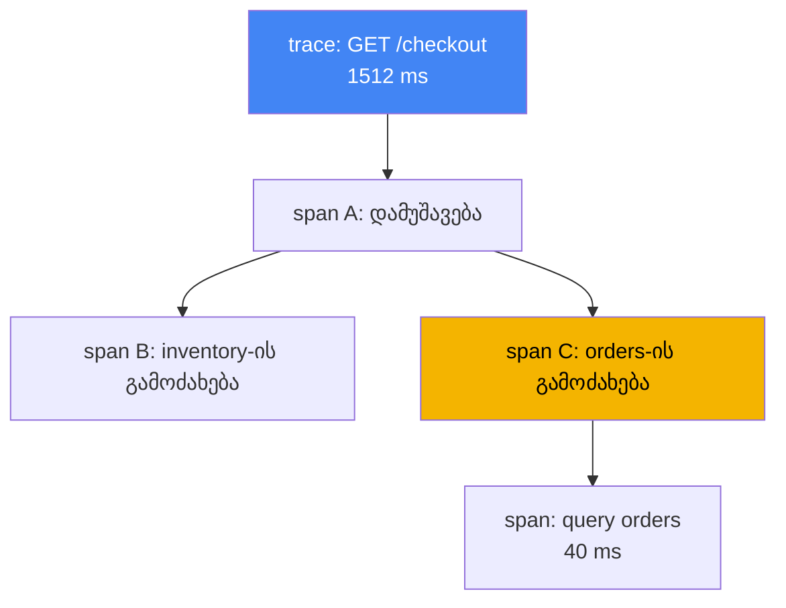
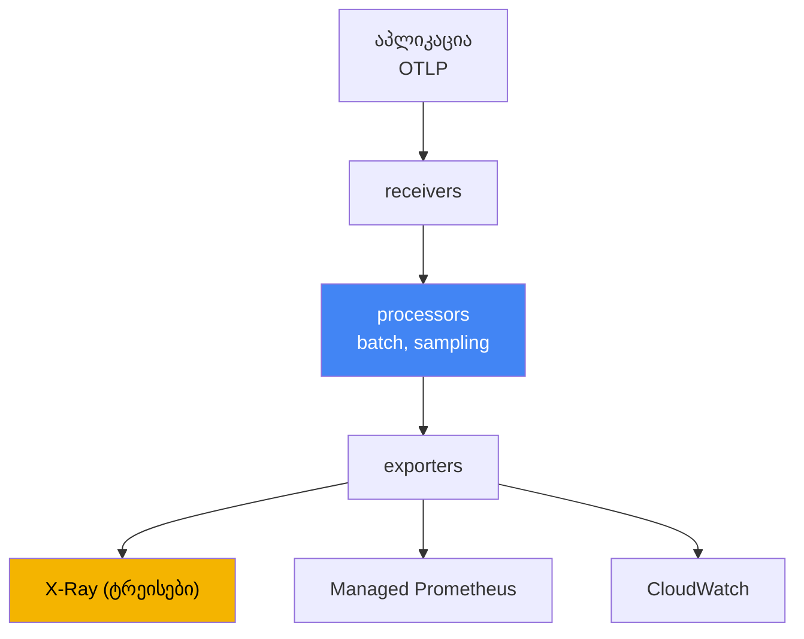

[რუსული ვერსია](ru.md) · [Eng version](en.md) · [Versión en español](es.md) · [Version française](fr.md) · [Deutsche Version](de.md) · [繁體中文版](tw.md) · [日本語版](jp.md)
# თავი 36. ტრეისინგი და პროფაილირება: ADOT და X-Ray

> **რა არის შემდეგ.** 33-ე და 34-ე თავებმა მოგვცა მეტრიკები და ლოგები, დაკვირვებადობის სამი
> საყრდენიდან ორი. აქ განვიხილავთ მესამეს: განაწილებულ ტრეისინგს, რომელიც ერთ მოთხოვნას
> სერვისების ჯაჭვში ერთიან მარშრუტად აკავშირებს, და მოკლედ პროფაილირებასაც. მომიჯნავე თემები
> სხვა თავებშია: მეტრიკები (მათ შორის ADOT, როგორც Amazon Managed Prometheus-ში მეტრიკების
> შემგროვებელი) - თავი 33; ლოგები - თავი 34; IRSA-სა და Pod Identity-ის საშუალებით AWS-ში
> ტელემეტრიის ექსპორტის როლები - თავები 16 და 17. ამ თავით მე-6 ნაწილი სრულდება. შემდეგ მოდის
> მე-7 ნაწილი - ექსპლუატაცია: ადონები, განახლებები, საიმედოობა, სარეზერვო ასლები და ღირებულება.

## 36.1. „p99 გაიზარდა, დამნაშავე კი გაურკვეველია“

მომხმარებელი ჩივის: გვერდი ნელა იტვირთება. მორიგე ხსნის დეშბორდს და შემავალ სერვისზე დაყოვნების
ზრდას ხედავს: p99 200 მწმ-დან წამ-ნახევრამდე გაიზარდა. მეტრიკები გულწრფელად აჩვენებს, რომ
„სერვის A-ს უჭირს“, მაგრამ მიზეზს არ გვიჩვენებს. A-ში შესული მოთხოვნა შემდეგ გზას აგრძელებს: A
იძახებს B-ს, B იძახებს C-ს, C კი მონაცემთა ბაზას მიმართავს. ზუსტად სად დაგროვდა დაყოვნება -
თავად A-ში, B-მდე ქსელში თუ C-ის ნელ მოთხოვნაში მონაცემთა ბაზისადმი - მეტრიკებიდან არ ჩანს.

ინჟინერი ლოგებში გადადის (თავი 34) და თითოეული პოდიდან სტრიქონებს პოულობს:

```
# A პოდის ლოგი
level=info msg="GET /checkout 1512ms" 
# C პოდის ლოგი (სხვა პოდი, სხვა namespace)
level=info msg="query orders 40ms"
```

სტრიქონები არსებობს, მაგრამ ერთმანეთისგან განცალკევებულია. ვერ ვიტყვით, რომ A-ს ეს სტრიქონი და
C-ის ის სტრიქონი ერთი და იმავე მომხმარებლის მოთხოვნას ეხება. წამში ათასობით მოთხოვნა მოდის,
ლოგები ერთმანეთშია შერეული და მათგან ერთი მოთხოვნის მარშრუტის ხელით აწყობა შეუძლებელია.
მეტრიკები პასუხობს კითხვას „რა“ (დაყოვნება იზრდება), ლოგები - „რატომ“ ერთ კონკრეტულ წერტილში
(შეცდომა კონკრეტულ პოდში), მაგრამ ვერც ერთი პასუხობს კითხვას, ჯაჭვის „რომელ ადგილას“ გაჩნდა
დაყოვნება. ჯაჭვში ხუთი გამოძახებაა, მაგრამ რომელი მათგანია დამნაშავე, გამოცანად რჩება.

სწორედ ამ გამოცანას ხსნის განაწილებული ტრეისინგი. ის თითოეულ მოთხოვნას გამჭოლ იდენტიფიკატორს
ანიჭებს და მის მარშრუტზე თითოეული ოპერაციის დროს იწერს, ამიტომ p99 შემადგენელ ნაწილებად იშლება:
ამდენი დრო A-ში, ამდენი B-ს გამოძახებაზე, ამდენი მონაცემთა ბაზაში. შემდეგ თანმიმდევრულად
განვიხილავთ, რისგან შედგება ტრეისი, რა შუაშია OpenTelemetry, როგორ აგროვებს ამას ADOT და სად
ინახავს X-Ray.

## 36.2. რა არის განაწილებული ტრეისინგი

ტრეისინგი აღწერს ერთი მოთხოვნის მარშრუტს ყველა იმ სერვისში, რომელსაც ის შეეხო. ნებისმიერი
ტრეისის წასაკითხად ორი ცნება საკმარისია:

- **trace** - მოთხოვნის მთელი მარშრუტი შესვლიდან პასუხამდე, ყველა ჩადგმული გამოძახებით. ტრეისს
  აქვს საერთო `trace id`, რომელიც მარშრუტის ყველა სერვისისთვის ერთია.
- **span** - ერთი ოპერაცია ტრეისის შიგნით: სერვისში დამუშავება, მეზობელი სერვისის გამოძახება,
  მოთხოვნა მონაცემთა ბაზისადმი. span-ს აქვს სახელი, დაწყების დრო და ხანგრძლივობა, მშობელ span-ზე
  მითითება და ატრიბუტები (HTTP-კოდი, URL, ცხრილის სახელი). ჩადგმული span-ებისგან ხე იქმნება და
  სწორედ ის გვიჩვენებს, სად დაიხარჯა დრო.

იმისთვის, რომ `trace id` სერვისიდან სერვისზე გადასვლისას არ დაიკარგოს, მუშაობს **context
propagation**: შემავალი სერვისი ტრეისის იდენტიფიკატორს გამავალი მოთხოვნის სათაურებში ათავსებს,
შემდეგი სერვისი კი მათ კითხულობს და იმავე ტრეისს აგრძელებს. სათაურების ინდუსტრიული ფორმატია W3C
Trace Context (`traceparent`). X-Ray ისტორიულად კონტექსტს საკუთარ სათაურში,
`X-Amzn-Trace-Id`-ში ატარებს, ADOT SDK-ებს კი ორივე ფორმატის მხარდაჭერა აქვს. ეს მნიშვნელოვანია,
როცა ჯაჭვში არის AWS-ის სერვისები (ALB, API Gateway, Lambda), რომლებიც სწორედ
`X-Amzn-Trace-Id`-ს ამატებს. `X-Amzn-Trace-Id`-ში კონტექსტი ინახება ველებად `Root` (ტრეისის id),
`Parent` (მშობელი span) და `Sampled` (ჩაწერის გადაწყვეტილება). ADOT-ის X-Ray propagator ამ
ველებს `traceparent`-ში და უკან გარდაქმნის, ხოლო `Root` ფორმატით `1-<epoch>-<id>` იგივე 32 hex-ია,
რაც W3C-ის `trace id`. ასე გამჭოლი `trace id` და სემპლირების ერთიანი გადაწყვეტილება AWS-ის
სერვისების საზღვარზე არ წყდება. კონტექსტის გავრცელების გარეშე ჯაჭვი წყდება და ერთი ხის ნაცვლად
ცალკეული, დაუკავშირებელი ნაწილები მიიღება.



ცალკე უნდა დავიმახსოვროთ, სად წყვეტს ეს მექანიზმი ავტომატურად მუშაობას. HTTP-სა და gRPC-ს
სათაურები აქვს, **ასინქრონულ საზღვარს კი ისინი არ გადააქვს**: შეტყობინება SQS-ში, Kafka-ში ან
EventBridge-ში მოათავსეთ და ავტოინსტრუმენტირება წყდება, რადგან შეტყობინების სხეულით კონტექსტს
თქვენ ნაცვლად არავინ გადაიტანს. პროდიუსერმა კონტექსტი შეტყობინების ატრიბუტებში უნდა ჩადოს,
დამმუშავებელმა კი (თავი 35-ის იმავე ვორკერმა) უნდა ამოიღოს და ტრეისი გააგრძელოს. ორი ვარიანტია:
W3C `traceparent` ჩვეულებრივ message attributes-ში, თუ ორივე მხარე თქვენია, და SQS-ის
რეზერვირებული სისტემური ატრიბუტი `AWSTraceHeader` X-Ray-ის სათაურით. ამ უკანასკნელს თავად AWS-ის
სერვისებიც აღიქვამს, ამიტომ SNS, SQS, Lambda ტიპის ჯაჭვებისთვის სწორედ ის მუშაობს. თუ ამ ნაბიჯს
გამოტოვებთ, ტრეისი დაიშლება ნაწილებად „მოთხოვნა მოვიდა“ და „რაღაც დამუშავდა“, მათ შორის კავშირის
გარეშე.

ყოველი მოთხოვნის სრული ტრეისის ჩაწერა ძვირია: წამში ათასობით მოთხოვნისას ეს მონაცემების მთებსა
და შესამჩნევ ზედნადებ ხარჯს წარმოქმნის. ამიტომ იყენებენ **sampling**-ს - ყველა ტრეისის ნაცვლად
მათ გარკვეულ წილს იწერენ. გადაწყვეტილება „შევინახოთ თუ არა“ შესვლისას ერთხელ მიიღება და
კონტექსტთან ერთად ვრცელდება, რათა ტრეისი ნახევრად ჩაწერილი არ აღმოჩნდეს. ეს head-based მიდგომაა;
მისი ალტერნატივა, gateway-ზე tail-based მიდგომა, განხილულია 36.4 განყოფილებაში, X-Ray-ის წესები
კი 36.5-ში.

## 36.3. OpenTelemetry: სტანდარტი მომწოდებელზე მიბმის ნაცვლად

ადრე ტრეისინგის თითოეულ ბექენდს თავისი აგენტი და SDK მოჰქონდა: კოდს კონკრეტული მომწოდებლისთვის
აინსტრუმენტირებდნენ, ბექენდის შეცვლა კი ინსტრუმენტირების თავიდან დაწერას ნიშნავდა.
**OpenTelemetry** (OTel) - CNCF-ის პროექტი, რომელიც ინდუსტრიულ სტანდარტად იქცა - ამ კავშირს
წყვეტს. ის API-ების, SDK-ებისა და პროტოკოლის ერთიან ნაკრებს განსაზღვრავს, ბექენდი კი შეცვლადი
ხდება.

OTel-ის მთავარი იდეა ორი რამის განცალკევებაა, რომლებსაც მომწოდებლები ერთმანეთში ურევდნენ:

- **ინსტრუმენტირება** - როგორ წარმოქმნის აპლიკაცია span-ებსა და მეტრიკებს. კეთდება კოდში OTel
  SDK-ის მეშვეობით ან კოდის შეუცვლელად ავტოინსტრუმენტირებით (განყოფილება 36.6). ის ერთნაირია იმის
  მიუხედავად, შემდეგ მონაცემები სად გაიგზავნება.
- **ბექენდი** - სად ინახება და ანალიზდება ტელემეტრია: X-Ray, CloudWatch, Prometheus, მესამე მხარის
  სისტემები. ის ექსპორტის პარამეტრით, აპლიკაციის კოდის შეუცვლელად იცვლება.

მათ ერთმანეთთან აკავშირებს **OTLP** (OpenTelemetry Protocol) - აპლიკაციიდან შემგროვებელში და
შემგროვებლებს შორის ტელემეტრიის გადაცემის სტანდარტული პროტოკოლი. აპლიკაცია OTLP-ზე საუბრობს და
არ იცის, მის უკან რომელი ბექენდი დგას. ექსპლუატაციისთვის პრაქტიკული აზრი პირდაპირია: ერთხელ
ვაინსტრუმენტირებთ, ტრეისებისა და მეტრიკების გაგზავნის ადგილს კი შემგროვებლის კონფიგურაციაში
ვწყვეტთ და აპლიკაციის რელიზის გარეშე ვცვლით. ერთ მომწოდებელზე მიბმული არ ვრჩებით.

## 36.4. ADOT: AWS-ის OpenTelemetry შემგროვებელი

**ADOT** (AWS Distro for OpenTelemetry) არის AWS-ის მიერ აწყობილი, გამოცდილი და მხარდაჭერილი
OpenTelemetry კომპონენტების დისტრიბუტივი: SDK-ები, ავტოინსტრუმენტირების აგენტები და, რაც ჩვენთვის
მთავარია, **OpenTelemetry Collector**. Collector აპლიკაციებსა და ბექენდებს შორის შუალედური რგოლია:
ის ტელემეტრიას იღებს, ამუშავებს და ერთ ან რამდენიმე სისტემაში ექსპორტს აკეთებს.

EKS-ში ADOT ყენდება, როგორც **მართული ადონი** (`adot`): ადონი განათავსებს ADOT Operator-ს, რომელიც
collector-ებს `OpenTelemetryCollector` რესურსის მეშვეობით მართავს. collector-ის კონვეიერი სამი
ეტაპისგან შედგება:

- **receivers** - მონაცემების მიღება, ჩვეულებრივ აპლიკაციებიდან OTLP-ის მეშვეობით (gRPC და HTTP
  პორტები);
- **processors** - დამუშავება: პაკეტებად გაერთიანება (`batch`), მეხსიერების შეზღუდვა,
  სემპლირება, ატრიბუტების დამატება;
- **exporters** - ბექენდებში ატვირთვა: `awsxray` X-Ray-ში ტრეისებისთვის, მეტრიკების ექსპორტი
  Amazon Managed Prometheus-ში (თავი 33), ექსპორტერები CloudWatch-ში.



ორი პროცესორი სახელებით უნდა მოვიხსენიოთ, რადგან მათ გარეშე კონვეიერი მხოლოდ პირველ მკვეთრ
ზრდამდე ძლებს. ჯაჭვში პირველად ათავსებენ **`memory_limiter`**-ს: ის მეხსიერების მოხმარებას
აკვირდება და ზღვრის მიღწევისას მონაცემების დაგროვებისა და `OOMKilled` მდგომარეობაში გადასვლის
ნაცვლად მიღებაზე უარის თქმას იწყებს და გამომგზავნებს შეცდომას უბრუნებს. გამომგზავნები ამ დროს
ხელახლა ცდიან, ანუ ტელემეტრიის ნაწილი იკარგება და არა თავად collector.

მეორეა **`tail_sampling`**, რომელიც თავად სემპლირების ლოგიკას ცვლის. 36.2 განყოფილებაში აღწერილი
მიდგომა **head-based** არის: წილის შესახებ გადაწყვეტილება შესვლისას, მოთხოვნის შედეგის
ცნობამდე მიიღება. რამდენიმე პროცენტიანი წილისას ზუსტად იმას კარგავთ, რასაც ეძებდით: 5xx პასუხებსა
და დაყოვნების მკვეთრ ზრდას. **Tail-based** სხვაგვარად წყვეტს: gateway რეჟიმში collector ტრეისის
span-ებს აგროვებს, მის დასრულებას ელოდება და მხოლოდ ამის შემდეგ იყენებს პოლიტიკებს - შეცდომიანი
და ზღვარზე მეტი დაყოვნების მქონე ყველა ტრეისი შეინახოს, წარმატებულებიდან კი მცირე წილი დატოვოს.
ასე X-Ray-ის ბიუჯეტი ანომალიებზე იხარჯება და არა ხმაურზე.

Tail-based მიდგომას ორი პირობა აქვს, რომლებსაც ხშირად მხოლოდ გამართვისას აღმოაჩენენ. პირველი:
**ერთი ტრეისის ყველა span collector-ის ერთ ეგზემპლარში უნდა მოხვდეს**, წინააღმდეგ შემთხვევაში
გადაწყვეტილება ტრეისის ფრაგმენტის მიხედვით მიიღება; gateway-ის რამდენიმე რეპლიკისას მის წინ
ათავსებენ ფენას `loadbalancing` exporter-ით, რომელიც span-ებს `trace id`-ის მიხედვით
მარშრუტიზებს. მეორე: ტრეისები მოლოდინის ფანჯრის ფარგლებში მეხსიერებაში გროვდება, ამიტომ gateway-ს
RAM-ის მარაგი სჭირდება, ხოლო ტრეისები, რომლებმაც ფანჯრის განმავლობაში დასრულება ვერ მოასწრეს,
არასრულად ფასდება. აქედან მოდის თანმიმდევრობა: ჯერ `memory_limiter`, მის შემდეგ `tail_sampling`,
ხოლო მერე `batch`.

ერთ collector-ს შეუძლია ტრეისები ერთდროულად X-Ray-ში, მეტრიკები კი Prometheus-ში გაგზავნოს.
აქედან მოდის „ერთი ინსტრუმენტირება, რამდენიმე ბექენდი“. collector ერთ-ერთ რეჟიმში იშლება და
არჩევანი იზოლაციასა და ზედნადებ ხარჯზე მოქმედებს:

| რეჟიმი | როგორ განთავსდება | როდის იყენებენ |
|---|---|---|
| Sidecar | კონტეინერი აპლიკაციის გვერდით პოდში | მიღების დაბალი დაყოვნება, იზოლაცია პოდის მიხედვით |
| DaemonSet | თითო აგენტი თითო ნოდზე | ნოდიდან შეგროვება, ერთიანი აგენტი ყველა პოდისთვის |
| Deployment (gateway) | რეპლიკების ცალკე პული, საერთო gateway | ცენტრალიზაცია, პაკეტებად გაერთიანება და სემპლირება ერთ ადგილას |

ტიპური პატერნია აგენტი აპლიკაციასთან ახლოს (sidecar ან DaemonSet) და დამატებით საერთო gateway
(Deployment), რომელიც ბექენდში გაგზავნამდე მონაცემებს პაკეტებად აერთიანებს და სემპლირებას
აკეთებს. AWS-ში ექსპორტის უფლებებს გასაღებებით კი არა, როლით ანიჭებენ: collector-ის
ServiceAccount IAM-როლს IRSA-ს ან Pod Identity-ის მეშვეობით უკავშირდება (თავები 16 და 17),
უფლებების მინიმალური ნაკრებით. X-Ray-ისთვის ეს არის `xray:PutTraceSegments` და
`xray:PutTelemetryRecords`.

## 36.5. AWS X-Ray: ტრეისების ბექენდი

**AWS X-Ray** არის ტრეისინგის მართული ბექენდი: ის იღებს span-ებს (X-Ray-ის ტერმინოლოგიით,
სეგმენტებსა და ქვესეგმენტებს), ინახავს ტრეისებს და მათ ანალიზს გვთავაზობს. მთავარი მიზეზები,
რისთვისაც მას იყენებენ:

- **service map** - ტრეისებიდან აგებული სერვისებისა და მათ შორის კავშირების რუკა. გვიჩვენებს,
  ვინ ვის იძახებს, თითოეულ წიბოზე საშუალო დაყოვნებასა და შეცდომების წილს. მისი საშუალებით ჩანს
  კვანძი, სადაც დაყოვნება გროვდება ან შეცდომები იზრდება.
- **დაყოვნების სეგმენტების მიხედვით დაყოფა** - კონკრეტული ტრეისისთვის ჩანს, რამდენი დრო დაიხარჯა
  თითოეულ სერვისსა და გამოძახებაზე. ზუსტად ის, რაც 36.1 განყოფილებაში გვაკლდა: p99 შემადგენელ
  ნაწილებად იშლება.
- **ტრეისების ძიება** - ნელი ან შეცდომიანი მოთხოვნების არჩევა ფილტრებით (პასუხის კოდი, სერვისი,
  ხანგრძლივობა), რათა შემთხვევითი ტრეისების ნაცვლად უშუალოდ პრობლემურები ვნახოთ.

ისტორიულად ტრეისებს X-Ray-ში **X-Ray daemon** აგზავნიდა, ცალკე აგენტი აპლიკაციის გვერდით. ახლა
AWS X-Ray-ს ინსტრუმენტირების ძირითად სტანდარტად OpenTelemetry-ზე გადაჰყავს და სასურველი გზაა
**ADOT Collector X-Ray exporter-ით** daemon-ის ნაცვლად. OpenTelemetry-ის შესაბამისობათა ცხრილში
X-Ray daemon-ის როლს სწორედ OpenTelemetry Collector ასრულებს, X-Ray sampling rules კი OTel-ის
სემპლირებას შეესაბამება. EKS-ში ახალი დატვირთვებისთვის ADOT-ს აყენებენ და არა daemon-ს.

X-Ray-ის **Sampling rules** განსაზღვრავს, მოთხოვნების რა წილი ჩაიწეროს, და კოდის შეუცვლელად,
ცენტრალიზებულად იმართება. წესი ორი ნაწილისგან შედგება: **reservoir** - წამში დამთხვევილი
მოთხოვნების ფიქსირებული რაოდენობა, რომელიც გარანტირებულად ჩაიწერება, და **fixed rate** -
რეზერვუარის ზემოთ დარჩენილი მოთხოვნების წილი. წესები ატრიბუტების მიხედვით ემთხვევა (სერვისის
სახელი, მარშრუტი, მეთოდი), ამიტომ გადახდისთვის ყველა ტრეისი შეიძლება ჩაიწეროს, health check-ებისთვის
კი მხოლოდ ნაწილი. ეს ტრეისების მოცულობისა და ღირებულების მართვის მთავარი ბერკეტია: რაც ნაკლებია
წილი, მით იაფი და მსუბუქია სისტემა, მაგრამ მით მეტია იშვიათი პრობლემის გამოტოვების ალბათობა.

## 36.6. ინსტრუმენტირება: SDK ავტოინსტრუმენტირების წინააღმდეგ

აპლიკაციამ span-ები რომ წარმოქმნას, მისი ინსტრუმენტირებაა საჭირო. არსებობს ორი გზა:

- **OTel SDK კოდში** - დეველოპერი OpenTelemetry-ის ბიბლიოთეკებს აერთებს და საჭირო ადგილებში
  მნიშვნელოვანი ოპერაციების გარშემო span-ებს ხელით ქმნის. ეს მეტ კონტროლსა და სიზუსტეს იძლევა
  (შეიძლება ბიზნეს-ნაბიჯების მონიშვნა), მაგრამ თითოეულ ენაზე კოდის შეცვლას მოითხოვს.
- **ავტოინსტრუმენტირება** - OTel-ის ბიბლიოთეკები ავტომატურად ერთდება და პოპულარულ ფრეიმვორკებს
  (HTTP-კლიენტებს, სერვერებს, მონაცემთა ბაზის დრაივერებს) კოდის შეუცვლელად ეხვევა. Kubernetes-ში
  ამას **OpenTelemetry Operator** აკეთებს: `Instrumentation` რესურსისა და პოდზე ანოტაციის
  მიხედვით ის init-კონტეინერის ინექციით გაშვებისას პოდს აგენტს ამატებს. ეს სწრაფი დასაწყისია,
  მაგრამ მხოლოდ იმას ფარავს, რაც მზა ბიბლიოთეკებს შეუძლია.

პრაქტიკაში ხშირად ავტოინსტრუმენტირებით იწყებენ, რათა HTTP-სა და მონაცემთა ბაზის გამოძახებების
ტრეისები სწრაფად მიიღონ, შემდეგ კი მნიშვნელოვან ბიზნეს-ლოგიკას კოდში ხელით შექმნილი span-ებით
წერტილოვნად ავსებენ. ორივე გზის გამომავალი OTLP-ია, ამიტომ collector და ბექენდი ამ არჩევანზე
დამოკიდებული არ არის.

## 36.7. CloudWatch Application Signals: APM OTel-ის ზემოთ

თუ დაკვირვებადობის ბექენდი უკვე CloudWatch-ია (თავი 33), ტრეისინგის მიღება ცალკე X-Ray
კონვეიერის ნაცვლად **CloudWatch Application Signals**-ით შეიძლება. ეს არის APM ფენა
OpenTelemetry-ის ზემოთ. ის ტელემეტრიიდან ავტომატურად გამოყოფს სერვისებსა და ოპერაციებს, მათთვის
„ოქროს სიგნალებს“ ითვლის: დაყოვნებას, შეცდომებისა და მოთხოვნების სიხშირეს, ასევე SLO-ების
განსაზღვრისა და მათი ბიუჯეტის კონტროლის საშუალებას იძლევა.

ექსპლუატაციისთვის მნიშვნელოვანი კავშირი ასეთია: Application Signals ირთვება იმავე
**`amazon-cloudwatch-observability`** ადონით, რომლითაც 33-ე თავში Container Insights. ადონი
CloudWatch-ის აგენტს აყენებს და ნაგულისხმევად რთავს ავტოინსტრუმენტირებული აპლიკაციებისგან
მეტრიკებისა და ტრეისების მიღებას. ანუ ერთი ადონი ფარავს კონტეინერების მეტრიკებსაც და APM-საც
ტრეისინგით, ამიტომ ამისთვის ADOT-ზე ცალკე X-Ray კონვეიერის გაშლა აუცილებელი არ არის. არჩევანი
„ADOT პლუს X-Ray“-სა და „Application Signals“-ს შორის ბექენდისა და მზა შესაძლებლობების დონის
არჩევანია და არა კოდის ინსტრუმენტირების განსხვავებული გზა: ორივე OpenTelemetry-ზეა აგებული.

## 36.8. პროფაილირება: რა ხარჯავს CPU-ს პროცესის შიგნით

ტრეისინგი გვიჩვენებს, სად დაიხარჯა დრო სერვისებს შორის. ის სხვა კითხვას არ პასუხობს: თუ დრო
ერთი პროცესის შიგნით დაიხარჯა, კონკრეტულად რომელ კოდზე წავიდა. ეს **პროფაილირების** სფეროა.

უწყვეტი პროფაილირება (continuous profiling) მცირე ზედნადები ხარჯით მუდმივად ზომავს, რაზე
ხარჯავს პროცესი CPU-სა და მეხსიერებას, და hotspot-ებს გვიჩვენებს - ფუნქციებსა და კოდის უბნებს,
სადაც ყველაზე მეტი რესურსი იხარჯება. ტრეისინგთან განსხვავება მკაფიოა:

| ინსტრუმენტი | რომელ კითხვას პასუხობს | დეტალიზაცია |
|---|---|---|
| ტრეისინგი (X-Ray) | სერვისების ჯაჭვის რომელ ადგილასაა დაყოვნება | სერვისები და გამოძახებები |
| პროფაილირება | პროცესის შიგნით რომელი კოდი ხარჯავს CPU-ს/მეხსიერებას | ფუნქციები და კოდის სტრიქონები |

AWS-ში უწყვეტი პროფაილირების ვარიანტია **Amazon CodeGuru Profiler**. ის გაშვებული აპლიკაციის
პროფილს აგროვებს და CPU-სა და მეხსიერების მხრივ ყველაზე ძვირ ადგილებს გამოყოფს. Kubernetes-ში
მის გვერდით ხშირად იყენებენ eBPF-პროფაილერებს, **Pyroscope**-სა და **Parca**-ს: ისინი CPU-სა და
მეხსიერების პროფილს ბირთვის დონეზე იღებს, აპლიკაციის შეცვლისა და ხელახალი ინსტრუმენტირების გარეშე,
და ნებისმიერ ენასთან მუშაობს. მათ თითოეულ ნოდზე DaemonSet-ად შლიან; შედეგია ფუნქციების მიხედვით
flame graph და პროფილების დროში შენახვა, რაც რელიზებს შორის CPU-სა და მეხსიერების რეგრესიებს
აჩენს. აქ მათ სიღრმისეულად არ განვიხილავთ: EKS-ის ტიპურ ექსპლუატაციაში კითხვების უმეტესობას
„სად არის ნელი“ ტრეისინგი პასუხობს, პროფაილირებას კი წერტილოვნად რთავენ, როცა ტრეისმა აჩვენა,
რომ შეფერხება კონკრეტული სერვისის შიგნითაა და არა მის გამოძახებებში.

## 36.9. დაკვირვებადობის სამი საყრდენი ერთად

მეტრიკები, ლოგები და ტრეისები კონკურენტები კი არა, ერთი ინციდენტის შესახებ სამ განსხვავებულ
კითხვაზე პასუხებია. 36.1 განყოფილების შემთხვევა მხოლოდ სამივეს გაერთიანებით იკვრება.

| საყრდენი | კითხვა | ინსტრუმენტები (თავები) |
|---|---|---|
| მეტრიკები | რა ხდება: p99 გაიზარდა, შეცდომები გახშირდა | Container Insights, Managed Prometheus (თავი 33) |
| ლოგები | რატომ მოხდა კონკრეტულ წერტილში: შეცდომის ტექსტი | Fluent Bit, CloudWatch Logs, OpenSearch (თავი 34) |
| ტრეისები | ჯაჭვის რომელ ადგილასაა დაყოვნება ან მარცხი | ADOT, X-Ray, Application Signals (ეს თავი) |

მორიგის სამუშაო ციკლი ასეთია: მეტრიკა გვიჩვენებს, რომ დაყოვნება გაიზარდა (რა); X-Ray-ის ტრეისი
გვიჩვენებს, ხუთი გამოძახებიდან რომელზე დაგროვდა ის (სად); ამ სერვისის იმავე დროის ლოგი კი მიზეზს
ხსნის - timeout, განმეორებითი ცდები, მოთხოვნის შეცდომა (რატომ). ცალ-ცალკე თითოეული საყრდენი
სურათის მხოლოდ ნაწილს გვაძლევს; ერთად ისინი ბუნდოვან „სერვის A-ს უჭირს“-ს გარდაქმნის
კონკრეტულ პასუხად „C მონაცემთა ბაზას ნელა მიმართავს ასეთი მოთხოვნის გამო“. ამიტომ production-ში
მათ ერთად აგროვებენ და ერთ-ერთს არ ირჩევენ.

## 36.10. როგორ იყენებენ ამას production-ში

- **ADOT-ს ადონად აყენებენ და collector-ს ხელით არ აწყობენ.** მართული ადონი `adot` გვაძლევს
  ADOT Operator-ს და სხვა ადონებთან ერთად ახლდება (თავი 37), collector-ის მანიფესტების ხელით
  მართვის გარეშე.
- **OpenTelemetry-ზე ერთხელ აინსტრუმენტირებენ, ბექენდს კი კონფიგურაციით ირჩევენ.** კოდი OTLP-ზე
  საუბრობს, ხოლო სად გაიგზავნოს მონაცემები - X-Ray-ში, Application Signals-ში თუ მესამე მხარის
  სისტემაში - collector წყვეტს. ბექენდის შეცვლა აპლიკაციის რელიზს არ მოითხოვს.
- **ექსპორტის უფლებებს როლით ანიჭებენ და არა გასაღებებით.** collector-ის ServiceAccount-ს
  IAM-როლს IRSA-ს ან Pod Identity-ის მეშვეობით უკავშირებენ (თავები 16 და 17), უფლებების მინიმუმით
  (`xray:PutTraceSegments`).
- **sampling-ს გააზრებულად აწყობენ.** კრიტიკული მარშრუტებისთვის (გადახდა, შესვლა) სრულ ტრეისებს
  წერენ, ხმაურიანი და სამსახურებრივი მოთხოვნებისთვის კი დაბალ წილს. X-Ray-ის Sampling rules
  ცენტრალიზებულად, რელიზის გარეშე იცვლება.
- **იწყებენ ავტოინსტრუმენტირებით, ხელით შექმნილ span-ებს კი წერტილოვნად ამატებენ.** HTTP-სა და
  მონაცემთა ბაზებისთვის ტრეისებს სწრაფად იღებენ, შემდეგ კი საჭირო ადგილებში მნიშვნელოვან
  ბიზნეს-ლოგიკას ხელით ნიშნავენ.
- **ბექენდებს საჭიროების გარეშე არ იმეორებენ.** თუ დაკვირვებადობა უკვე CloudWatch-ზეა,
  `amazon-cloudwatch-observability`-ის მეშვეობით Application Signals ხშირად APM-ს ცალკე X-Ray
  კონვეიერის გარეშე ფარავს.
- **`memory_limiter`-ს პირველ პროცესორად აყენებენ.** წინააღმდეგ შემთხვევაში OTLP ნაკადის მკვეთრი
  ზრდა თავად collector-ს გადაიყვანს `OOMKilled` მდგომარეობაში და დაკვირვებადობა ზუსტად
  ინციდენტის დროს გაქრება.
- **ანომალიებს tail-based სემპლირებით ინახავენ.** gateway-ზე რთავენ `tail_sampling`-ს: შეცდომიანი
  და მაღალი დაყოვნების მქონე ყველა ტრეისი სრულად იწერება, წარმატებულებიდან კი მცირე წილი რჩება.
  gateway-ის რამდენიმე რეპლიკისას `trace id`-ის მიხედვით მარშრუტიზებას ამატებენ, წინააღმდეგ
  შემთხვევაში გადაწყვეტილებები არასრული ტრეისებით მიიღება.
- **კონტექსტს ასინქრონულ საზღვრებზე ამოწმებენ.** SQS-ისა და Kafka-სთვის კონტექსტს შეტყობინების
  ატრიბუტებში (`traceparent` ან `AWSTraceHeader`) ათავსებენ და ავტოინსტრუმენტირებაზე არ ამყარებენ
  იმედს.

## 36.11. მინი-ლექსიკონი

- **trace** - ერთი მოთხოვნის მთელი მარშრუტი სერვისებში, საერთო `trace id`-ით.
- **span** - ცალკე ოპერაცია ტრეისის შიგნით (დამუშავება, გამოძახება, მოთხოვნა მონაცემთა ბაზისადმი),
  დროითა და ატრიბუტებით; span-ებისგან ტრეისის ხე იქმნება.
- **context propagation** - `trace id`-ის სერვისებს შორის სათაურებით (W3C Trace Context)
  გადაცემა, რათა ტრეისი არ გაწყდეს.
- **X-Amzn-Trace-Id** - X-Ray-ის სათაური ველებით `Root`, `Parent`, `Sampled`; ADOT X-Ray
  propagator მას W3C `traceparent`-ს უსადაგებს და გამჭოლ `trace id`-ს ინარჩუნებს.
- **sampling** - მოცულობისა და ღირებულების სამართავად ყველა ტრეისის ნაცვლად მათი ნაწილის ჩაწერა.
- **head-based და tail-based sampling** - ჩაწერის გადაწყვეტილება მოთხოვნის შედეგის გაგებამდე,
  შესვლისას, ან ტრეისის აწყობის შემდეგ gateway-ზე (პოლიტიკები შეცდომებისა და დაყოვნების მიხედვით).
  Tail-based მოითხოვს, რომ ტრეისის ყველა span collector-ის ერთ ეგზემპლარში მოხვდეს.
- **`memory_limiter`** - Collector-ის პროცესორი, რომელიც მეხსიერების ხარჯვას ზღუდავს: ზღვართან
  მონაცემების მიღებაზე უარს ამბობს, რათა `OOMKilled` მდგომარეობაში არ გადავიდეს; ის პირველი
  უნდა განთავსდეს.
- **`AWSTraceHeader`** - SQS შეტყობინების სისტემური ატრიბუტი X-Ray-ის ტრეისის სათაურისთვის;
  კონტექსტის ასინქრონულ საზღვარზე გადატანის გზა, სადაც სათაურები არ არსებობს.
- **OpenTelemetry (OTel)** - CNCF-ის სტანდარტი: ერთიანი API-ები, SDK-ები და პროტოკოლი;
  ინსტრუმენტირებასა და ბექენდს ერთმანეთისგან აცალკევებს.
- **OTLP** - აპლიკაციიდან collector-ში და collector-ებს შორის ტელემეტრიის გადაცემის პროტოკოლი.
- **ADOT** - AWS Distro for OpenTelemetry: AWS-ის OTel დისტრიბუტივი (SDK-ები, აგენტები,
  Collector).
- **OpenTelemetry Collector** - შემგროვებელი: receivers იღებს, processors ამუშავებს, exporters
  კი ტელემეტრიას ბექენდებში ატვირთავს.
- **ადონი `adot`** - EKS-ის მართული ადონი, რომელიც collector-ების სამართავად ADOT Operator-ს
  შლის.
- **AWS X-Ray** - ტრეისების მართული ბექენდი: შენახვა, service map, დაყოვნების დაყოფა, ტრეისების
  ძიება.
- **service map** - სერვისებისა და კავშირების რუკა წიბოებზე დაყოვნებითა და შეცდომების წილით.
- **sampling rules** - X-Ray-ის წესები, რომლებიც ჩასაწერი მოთხოვნების წილს reservoir-ისა და
  fixed rate-ის მეშვეობით განსაზღვრავს.
- **OpenTelemetry Operator** - ოპერატორი, რომელიც აგენტის პოდში ინექციით ავტოინსტრუმენტირებას
  აკეთებს.
- **CloudWatch Application Signals** - APM OTel-ის ზემოთ (SLO, დაყოვნება, შეცდომები), რომელიც
  `amazon-cloudwatch-observability` ადონით ირთვება.
- **continuous profiling** - კოდში CPU-სა და მეხსიერების hotspot-ების უწყვეტი შეგროვება; AWS-ში
  Amazon CodeGuru Profiler, eBPF-პროფაილერებიდან კი Pyroscope და Parca.

## 36.12. თავის შეჯამება

- მეტრიკები გვეუბნება „რას“, ლოგები კი „რატომ კონკრეტულ წერტილში“, მაგრამ ერთი მოთხოვნის
  სერვისების ჯაჭვში დაკავშირება არ შეუძლია; კითხვას „ზუსტად სად არის დაყოვნება“ განაწილებული
  ტრეისინგი პასუხობს.
- ტრეისი არის მოთხოვნის მარშრუტი საერთო `trace id`-ით; span ცალკე ოპერაციაა; context propagation
  `trace id`-ს სერვისებს შორის ატარებს; sampling კი ტრეისების მხოლოდ ნაწილს იწერს.
- OpenTelemetry ინდუსტრიული სტანდარტია: ერთიანი API-ები, SDK-ები და OTLP პროტოკოლი,
  ინსტრუმენტირებისა და ბექენდის განცალკევება, მომწოდებელზე მიბმის არარსებობა.
- ADOT AWS-ის OTel დისტრიბუტივია; EKS-ში ყენდება `adot` ადონით, რომელსაც ADOT Operator მოაქვს და
  OpenTelemetry Collector-ს მართავს.
- Collector იღებს OTLP-ს, ამუშავებს (batch, sampling) და რამდენიმე ბექენდში ექსპორტს აკეთებს:
  X-Ray ტრეისებისთვის, Managed Prometheus მეტრიკებისთვის, CloudWatch; რეჟიმებია sidecar,
  DaemonSet, Deployment (gateway).
- X-Ray ინახავს ტრეისებს და გვაძლევს service map-ს, დაყოვნების დაყოფასა და პრობლემური ტრეისების
  ძიებას; ახალი დატვირთვებისთვის X-Ray daemon-ის ნაცვლად იყენებენ ADOT Collector-ს X-Ray
  exporter-ით.
- ინსტრუმენტირება კეთდება კოდში OTel SDK-ით ან OpenTelemetry Operator-ის მეშვეობით
  ავტოინსტრუმენტირებით; AWS-ში ექსპორტის უფლებები როლით, IRSA-ს ან Pod Identity-ის მეშვეობით
  გაიცემა (თავები 16 და 17).
- CloudWatch Application Signals არის APM OTel-ის ზემოთ, რომელიც
  `amazon-cloudwatch-observability` ადონით ირთვება (თავი 33); პროფაილირება (CodeGuru Profiler)
  კოდში hotspot-ებს ეძებს და ტრეისინგს ავსებს.

## 36.13. როგორ გამოგადგებათ ეს რეალურ სამუშაოში

მორიგეობისას ტრეისინგი ბუნდოვან „ნელია“-ს კონკრეტულ კვანძად გარდაქმნის. მეტრიკებში p99-ის ზრდის
შემჩნევის შემდეგ X-Ray-ში service map-ს ხსნიან, წიბოებზე დაყოვნების მიხედვით დამნაშავე სერვისს
პოულობენ, შემდეგ კონკრეტულ ნელ ტრეისში გადადიან და გამოძახებების მიხედვით დაყოფას ხედავენ.
ამის შემდეგ იმავე დროის მონაკვეთში ამ სერვისის ლოგებს ამოწმებენ და მიზეზს პოულობენ. ტრეისინგის
გარეშე ეს გზა ათობით პოდის ლოგების ხელით შეჯერებაა, რაც ცოცხალი ტრაფიკისას პრაქტიკულად უიმედოა.

დაგეგმვისას სამ საკითხს წყვეტენ. პირველი ბექენდია: ცალკე X-Ray კონვეიერი ADOT-ზე თუ APM უკვე
არსებულ CloudWatch-ზე Application Signals-ის მეშვეობით. მეორე ინსტრუმენტირების გზაა: სწრაფი
დაფარვისთვის ავტოინსტრუმენტირება და ბიზნეს-ლოგიკისთვის ხელით შექმნილი span-ები. მესამე sampling-ია:
რომელი მარშრუტები ჩაიწეროს სრულად და სად არის ნაწილი საკმარისი, რათა ხმაურში ფული არ დაიხარჯოს
და იშვიათი პრობლემები არ დაიკარგოს. ყველგან AWS-ზე წვდომა როლით გაიცემა და არა გასაღებებით, იმავე
IRSA ან Pod Identity მექანიზმით, რომლითაც სხვა დატვირთვებისთვის.

## 36.14. თვითშემოწმების კითხვები

1. რატომ ვერ პასუხობს მეტრიკები და ლოგები, ჯაჭვის რომელ გამოძახებაზე გაიზარდა დაყოვნება?
2. რით განსხვავდება trace span-ისგან და რა არის `trace id`?
3. რას აკეთებს context propagation და რა მოსდის ტრეისს, თუ კონტექსტი არ გადაიცემა?
4. რისთვის არის საჭირო sampling და რატომ მიიღება გადაწყვეტილება „ჩაიწეროს ტრეისი თუ არა“
   შესვლისას ერთხელ?
5. რას გვაძლევს OpenTelemetry, როგორც სტანდარტი, და რატომ არის მნიშვნელოვანი ინსტრუმენტირებისა და
   ბექენდის განცალკევება?
6. რა არის OTLP და როგორ გვეხმარება ის აპლიკაციის რელიზის გარეშე ბექენდის შეცვლაში?
7. რა არის ADOT და როგორ ყენდება ის EKS-ში?
8. რა სამი ეტაპისგან შედგება OpenTelemetry Collector-ის კონვეიერი და რას აკეთებს თითოეული?
9. რით განსხვავდება collector-ის sidecar, DaemonSet და Deployment (gateway) რეჟიმები?
10. რას გვიჩვენებს X-Ray-ის service map და რატომ იყენებენ ახალი დატვირთვებისთვის daemon-ის
    ნაცვლად ADOT-ს?
11. როგორ არის მოწყობილი X-Ray-ის sampling rule (reservoir და fixed rate) და რატომ არის ეს
    ღირებულების მართვისთვის საჭირო?
12. რით განსხვავდება კოდში OTel SDK OpenTelemetry Operator-ის მეშვეობით ავტოინსტრუმენტირებისგან?
13. რით განსხვავდება ტრეისინგი პროფაილირებისგან და რომელ კითხვას პასუხობს თითოეული?
14. რამდენიმე პროცენტიანი წილისას რატომ სჯობს tail-based სემპლირება head-based-ს და რომელი ორი
    პირობა უნდა შესრულდეს მისი სწორად მუშაობისთვის?
15. რატომ აყენებენ `memory_limiter`-ს პირველ პროცესორად და რას აკეთებს ის ზღვრის მიღწევისას?
16. SQS-ში გაგზავნისას ტრეისი წყდება. რატომ და რომელი ორი გზით გადააქვთ კონტექსტი?

## პრაქტიკა

ამ თავს ჯერჯერობით საკუთარი ლაბა არ აქვს, მაგრამ ტრეისინგის მდგომარეობა ცოცხალ კლასტერზე
ადვილად შეგიძლიათ შეამოწმოთ. ჯერ ნახეთ, დაყენებულია თუ არა ADOT ადონი და გაეშვა თუ არა მისი
კომპონენტები:

```bash
# დაყენებულია თუ არა მართული ადონი adot
aws eks describe-addon --cluster-name my-cluster --addon-name adot \
  --query 'addon.status'
# ADOT Operator-ისა და collector-ების პოდები (namespace ინსტალაციაზეა დამოკიდებული)
kubectl get pods -A | grep -Ei "adot|opentelemetry|otel"
```

თუ აპლიკაციები ინსტრუმენტირებულია და ტრეისებს X-Ray-ში აგზავნის, X-Ray API-ის მეშვეობით ნახეთ
სერვისების რუკა და სემპლირების წესები:

```bash
# სერვისებისა და კავშირების რუკა ბოლო წუთებისთვის (დრო epoch-წამებში)
aws xray get-service-graph --start-time 1700000000 --end-time 1700000600
# მოქმედი სემპლირების წესები
aws xray get-sampling-rules
```

სურათი სამ საყრდენს შეადარეთ: ხედავს თუ არა collector აპლიკაციებს (საერთოდ არის თუ არა ტრეისები
X-Ray-ში), იგება თუ არა service map და ემთხვევა თუ არა რუკაზე ყველაზე დიდი დაყოვნების მქონე
კვანძი იმ სერვისს, რომელზეც მეტრიკები მიუთითებს. თუ დაკვირვებადობა CloudWatch-ზე გაქვთ,
ტრეისინგისა და APM-ის იგივე როლი `amazon-cloudwatch-observability` ადონის მეშვეობით Application
Signals-ს შეუძლია შეასრულოს (თავი 33). ამ შემთხვევაში ტრეისებისთვის ცალკე ADOT კონვეიერი შეიძლება
არც დაგჭირდეთ.

---
[სარჩევი](../README_GE.md) · [თავი 35](../35/ge.md) · [თავი 37](../37/ge.md)
