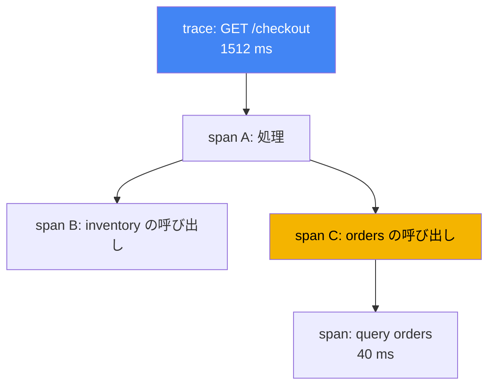
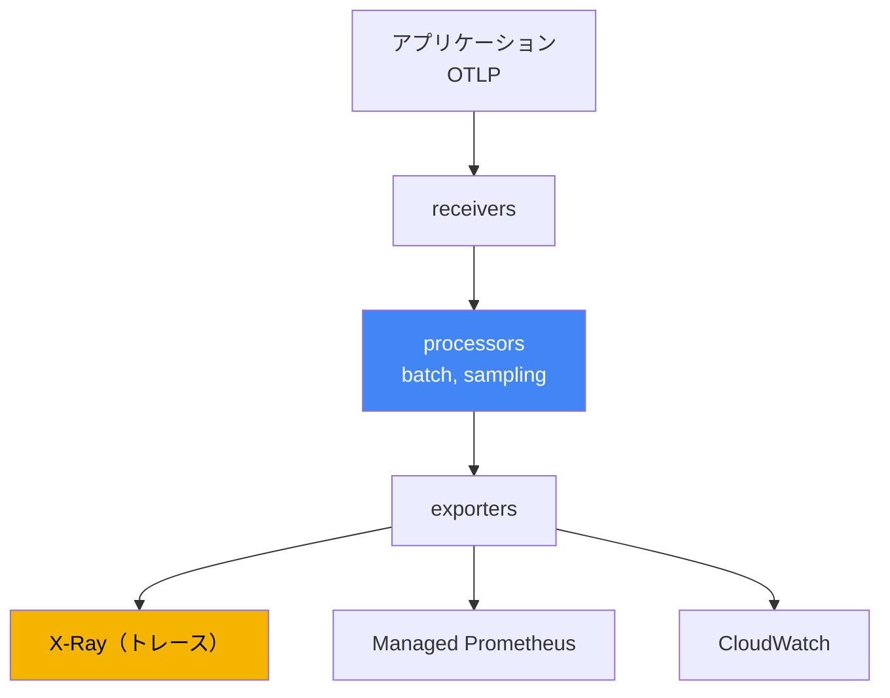

[ロシア語版](ru.md) · [英語版](en.md) · [スペイン語版](es.md) · [フランス語版](fr.md) · [ドイツ語版](de.md) · [ジョージア語版](ge.md) · [繁体字中国語版](tw.md)
# 第36章. トレーシングとプロファイリング: ADOT と X-Ray

> **次は何か。** 第33章と第34章では、オブザーバビリティを支える3本の柱のうち、メトリクスとログという2本を扱いました。ここでは3本目、すなわち1つのリクエストをサービスの連鎖全体にわたる単一の経路として結び付ける分散トレーシングと、プロファイリングを簡潔に扱います。関連する内容は別の章で扱います。メトリクス（Amazon Managed Prometheus のメトリクスコレクターとしての ADOT を含む）は第33章、ログは第34章、IRSA と Pod Identity を通じて AWS にテレメトリをエクスポートするためのロールは第16章と第17章です。この章で第6部は終わりです。次は第7部、アドオン、アップグレード、信頼性、バックアップ、コストという運用です。

## 36.1. 「p99 は上がったが、誰が原因なのか分からない」

ユーザーから、ページの読み込みが遅いという連絡があります。オンコール担当者がダッシュボードを開くと、入口サービスのレイテンシーが増加しています。p99 は 200 ms から 1.5 秒に跳ね上がりました。メトリクスは「サービス A の調子が悪い」ことを正確に示しますが、その理由は分かりません。A へのリクエストは内部でさらに進みます。A は B を呼び、B は C を呼び、C はデータベースにアクセスします。遅延がどこで蓄積したのか、A 自身なのか、B までのネットワークなのか、C からデータベースへの遅いクエリなのかは、メトリクスからは見えません。

エンジニアはログ（第34章）に進み、各 Pod の行を見つけます。

```
# Pod A のログ
level=info msg="GET /checkout 1512ms" 
# Pod C のログ（別の Pod、別の namespace）
level=info msg="query orders 40ms"
```

行はありますが、ばらばらです。A のこの行と C のあの行が、同じユーザーリクエストに関するものだと判断する方法はありません。毎秒数千のリクエストがあり、ログは混在しているため、そこから単一リクエストの経路を手作業で組み立てることは不可能です。メトリクスは「何が起きているか」（レイテンシーが増えている）に、ログは1点における「なぜ」（特定 Pod のエラー）に答えます。しかし、いずれも連鎖の「どこで」遅延しているかには答えません。連鎖には5つの呼び出しがあるのに、どれが原因かは謎のままです。

まさにこの謎を分散トレーシングが解決します。各リクエストにエンドツーエンドの識別子を割り当て、その経路上の各操作の時間を記録します。これにより p99 は要素に分解されます。A でこれだけ、B の呼び出しでこれだけ、データベースでこれだけ、という形です。以下では順に、トレースの構成要素、OpenTelemetry との関係、ADOT がどう収集するか、X-Ray がどこへ格納するかを説明します。

## 36.2. 分散トレーシングとは

トレーシングは、1つのリクエストが接触したすべてのサービスを通る経路を記述します。どのトレースも、次の2つの概念だけで読み取れます。

- **trace**: 入力から応答までのリクエスト全体の経路であり、入れ子の呼び出しをすべて含みます。trace には、経路上のすべてのサービスで共通の `trace id` があります。
- **span**: トレース内の1つの操作です。サービスでの処理、隣接サービスの呼び出し、データベースへのクエリなどです。span には名前、開始時刻と継続時間、親 span への参照、属性（HTTP コード、URL、テーブル名）があります。入れ子の span からツリーが構成され、時間がどこで費やされたかを示します。

サービス間の移動時に `trace id` が失われないよう、**context propagation** が機能します。入口サービスがトレース識別子を送信リクエストのヘッダーに入れ、次のサービスがそれを読み取って同じトレースを継続します。業界標準のヘッダー形式は W3C Trace Context（`traceparent`）です。X-Ray は歴史的に独自の `X-Amzn-Trace-Id` ヘッダーでコンテキストを伝え、ADOT SDK は両方の形式を扱えます。これは、`X-Amzn-Trace-Id` を設定する AWS サービス（ALB、API Gateway、Lambda）が連鎖内にある場合に重要です。`X-Amzn-Trace-Id` では、コンテキストは `Root`（トレース ID）、`Parent`（親 span）、`Sampled`（記録の決定）というフィールドにあります。ADOT の X-Ray propagator はこれらのフィールドを `traceparent` に、またその逆に変換します。`1-<epoch>-<id>` という形式の `Root` は、W3C の `trace id` と同じ 32 桁の hex です。これにより、エンドツーエンドの `trace id` と統一されたサンプリング決定が AWS サービスの境界で途切れません。コンテキスト伝播がなければ連鎖は切れ、1つのツリーではなく、互いに関連しない断片ができます。



この仕組みが自動では機能しなくなる場所も、別途覚えておく必要があります。HTTP と gRPC にはヘッダーがありますが、**非同期の境界はそれを運びません**。SQS、Kafka、EventBridge にメッセージを送ると、自動インストルメンテーションはそこで切れます。メッセージ本文を通じてコンテキストを運ぶ処理を、誰かが自動で行ってくれるわけではないためです。プロデューサーがコンテキストをメッセージ属性に入れ、コンシューマー（第35章のワーカー）がそれを取り出してトレースを継続しなければなりません。方法は2つあります。両側とも自分たちが管理する場合は通常の message attributes に W3C `traceparent` を入れる方法、もう1つは X-Ray ヘッダーを持つ予約済みの SQS システム属性 `AWSTraceHeader` を使う方法です。後者は AWS サービス自身が理解するため、SNS、SQS、Lambda のような連鎖ではこちらが実用的です。この手順を飛ばすと、トレースは関連のない「リクエストが到着した」と「何かが処理された」に分解されます。

すべてのリクエストの完全なトレースを記録することは高価です。毎秒数千のリクエストなら、膨大なデータと無視できないオーバーヘッドになります。そのため **sampling** を用い、すべてではなく一部のトレースを記録します。「保存するかどうか」の決定は入口で一度だけ行われ、コンテキストとともに伝播されます。これにより、トレースが半分だけ記録されることを防ぎます。これは head-based のアプローチです。その代替であるゲートウェイ上の tail-based は36.4節で、X-Ray のルールは36.5節で扱います。

## 36.3. OpenTelemetry: ベンダーへの固定化ではなく標準を使う

以前は、各トレーシングバックエンドが独自のエージェントと SDK を提供していました。コードは特定のベンダー向けにインストルメントされ、バックエンドの切り替えはインストルメンテーションの書き換えを意味しました。CNCF プロジェクトであり業界標準となった **OpenTelemetry**（OTel）は、この結び付きを断ち切ります。単一の API、SDK、プロトコルを定め、バックエンドを交換可能にします。

OTel の中心となる考え方は、ベンダーが混在させていた2つを分離することです。

- **インストルメンテーション**: アプリケーションが span とメトリクスをどのように生成するかです。コード内の OTel SDK、またはコードを変更しない自動インストルメンテーション（36.6節）で実現します。その後データがどこへ送られるかには依存しません。
- **バックエンド**: テレメトリを格納し分析する場所です。X-Ray、CloudWatch、Prometheus、サードパーティーのシステムなどが該当します。アプリケーションコードを変更せず、エクスポート設定で切り替えられます。

この2つをつなぐのが **OTLP**（OpenTelemetry Protocol）です。アプリケーションから collector へ、また collector 間でテレメトリを送る標準プロトコルです。アプリケーションは OTLP を使い、その背後のバックエンドを知りません。運用上の意味は直接的です。インストルメンテーションは1回行い、トレースとメトリクスの送信先は collector の設定で決め、アプリケーションをリリースせずに変更できます。単一ベンダーに固定されません。

## 36.4. ADOT: AWS の OpenTelemetry collector

**ADOT**（AWS Distro for OpenTelemetry）は、AWS がビルド、テスト、サポートする OpenTelemetry コンポーネントのディストリビューションです。SDK、自動インストルメンテーションエージェント、そしてここで最も重要な **OpenTelemetry Collector** が含まれます。Collector はアプリケーションとバックエンドの中間にあり、テレメトリを受信、処理し、1つ以上のシステムへエクスポートします。

EKS では ADOT は **managed addon**（`adot`）としてインストールされます。このアドオンは ADOT Operator をデプロイし、Operator が `OpenTelemetryCollector` リソースを通じて collector を管理します。collector のパイプラインは3つの段階から成ります。

- **receivers**: データを受信します。通常はアプリケーションから gRPC および HTTP ポート経由で届く OTLP です。
- **processors**: バッチ処理（`batch`）、メモリー制限、サンプリング、属性追加などの処理を行います。
- **exporters**: バックエンドに送信します。X-Ray にトレースを送る `awsxray`、Amazon Managed Prometheus へのメトリクスエクスポート（第33章）、CloudWatch エクスポーターがあります。



このパイプラインは、最初の急増までしか動かない状態にしないために、2つの processor を名前で知っておくべきです。先頭には **`memory_limiter`** を置きます。これはメモリー使用量を監視し、しきい値に達するとデータを蓄積して `OOMKilled` になる代わりに、受信を拒否して送信者にエラーを返し始めます。送信者は再試行するため、collector 自体ではなく一部のテレメトリが失われます。

もう1つは **`tail_sampling`** であり、サンプリングの論理そのものを変えます。36.2節で説明したものは **head-based** です。リクエストの結果が分かる前、入口で割合を決めます。数パーセントの割合では、探していたもの、すなわち 5xx 応答とレイテンシーの急増をちょうど失うことになります。**Tail-based** は異なります。gateway モードの collector がトレースの span を蓄積して完了を待ち、その後にポリシーを適用します。すべてのエラートレースとしきい値を超えたレイテンシーのトレースを保存し、成功したものは少数だけ残します。このように、X-Ray の予算はノイズではなく異常に使われます。

Tail-based には、デバッグ時に初めて気付く2つの条件があります。第1に、**同一トレースのすべての span が同じ collector インスタンスに到達しなければなりません**。そうでなければ、判断はトレースの断片に基づくことになります。gateway のレプリカが複数ある場合は、その前段に `loadbalancing` exporter を置き、`trace id` によって span をルーティングします。第2に、トレースは待機ウィンドウ内でメモリーに蓄積されるため、gateway には十分な RAM が必要で、ウィンドウ内に完了しなかったトレースは不完全な状態で評価されます。これが `memory_limiter`、`tail_sampling`、`batch` の順序になる理由です。

1つの collector は、トレースを X-Ray に、メトリクスを Prometheus に同時送信できます。これが「1回のインストルメンテーション、複数のバックエンド」です。collector は次のいずれかのモードでデプロイされ、その選択は分離とオーバーヘッドに影響します。

| モード | 配置方法 | 使用する場合 |
|---|---|---|
| Sidecar | Pod 内でアプリケーションの隣に置くコンテナ | 低い受信レイテンシー、Pod ごとの分離 |
| DaemonSet | ノードごとに1つのエージェント | ノードからの収集、全 Pod 共通のエージェント |
| Deployment (gateway) | 個別のレプリカプール、共有 gateway | 一元化、バッチ処理、1か所でのサンプリング |

典型的なパターンは、アプリケーション近くのエージェント（sidecar または DaemonSet）に加え、バックエンドへ送信する前にバッチ処理とサンプリングを行う共通 gateway（Deployment）です。AWS へのエクスポート権限はキーではなくロールで与えます。collector の ServiceAccount を IRSA または Pod Identity 経由で IAM ロールに関連付け（第16章と第17章）、最小限の権限を付与します。X-Ray の場合は `xray:PutTraceSegments` と `xray:PutTelemetryRecords` です。

## 36.5. AWS X-Ray: トレースのバックエンド

**AWS X-Ray** はマネージドトレーシングバックエンドです。span（X-Ray の用語では segment と subsegment）を受信し、トレースを保存して分析機能を提供します。主に注目する理由は次のとおりです。

- **service map**: トレースから構築されるサービスとその接続のマップです。誰が誰を呼ぶか、各エッジの平均レイテンシーとエラー割合を示します。遅延が蓄積する、またはエラーが増えているノードを確認できます。
- **segment ごとのレイテンシー内訳**: 特定のトレースについて、各サービスと各呼び出しに費やされた時間を確認できます。まさに36.1節で欠けていたものです。p99 が要素に分解されます。
- **トレース検索**: フィルター（応答コード、サービス、継続時間）で遅いリクエストやエラーリクエストを抽出し、ランダムなものではなく、問題のあるトレースを確認できます。

歴史的には、**X-Ray daemon** というアプリケーションの隣に置く別エージェントが X-Ray にトレースを送信していました。現在 AWS は、主要なインストルメンテーション標準として X-Ray を OpenTelemetry へ移行しており、推奨経路は daemon ではなく **X-Ray exporter を持つ ADOT Collector** です。OpenTelemetry の対応表では、OpenTelemetry Collector が X-Ray daemon の役割を担い、X-Ray sampling rules は OTel のサンプリングに対応します。EKS の新しいワークロードでは、daemon ではなく ADOT を導入します。

X-Ray の **Sampling rules** は、記録するリクエストの割合を設定し、コードを変更せず一元的に構成できます。ルールは2つの部分で構成されます。**reservoir** は一致したリクエストのうち、1秒あたりに必ず記録する固定数です。**fixed rate** は reservoir を超える残りの割合です。ルールは属性（サービス名、パス、メソッド）に一致するため、支払いのすべてのトレースを記録し、ヘルスチェックは一部だけ記録できます。これはトレース量とコストを制御する主な手段です。割合が低いほど安価で軽量ですが、まれな問題を捉えられない可能性は高くなります。

## 36.6. インストルメンテーション: SDK と自動インストルメンテーション

アプリケーションが span を生成するには、インストルメントする必要があります。方法は2つです。

- **コード内の OTel SDK**: 開発者が OpenTelemetry ライブラリを追加し、必要な場所で重要な操作を囲む span を手動で作成します。制御と精度が高く、ビジネス上のステップもマークできますが、各言語のコードを変更する必要があります。
- **自動インストルメンテーション**: OTel ライブラリを自動的に接続し、一般的なフレームワーク（HTTP クライアント、サーバー、データベースドライバー）をコード変更なしでラップします。Kubernetes では **OpenTelemetry Operator** が実行します。`Instrumentation` リソースと Pod のアノテーションに基づき、起動時に init コンテナを注入してエージェントを Pod に追加します。すばやく開始できますが、対応するのは既製ライブラリが扱える範囲だけです。

実際には、まず自動インストルメンテーションで HTTP とデータベース呼び出しのトレースを迅速に得てから、重要なビジネスロジックへ手動 span を狙って追加することがよくあります。どちらの方法も出力は OTLP であるため、collector とバックエンドは選択に依存しません。

## 36.7. CloudWatch Application Signals: OTel 上の APM

オブザーバビリティのバックエンドがすでに CloudWatch（第33章）である場合、別個の X-Ray パイプラインではなく、OpenTelemetry 上の APM レイヤーである **CloudWatch Application Signals** を通じてトレーシングを得られます。テレメトリからサービスと操作を自動的に抽出し、レイテンシー、エラー率、リクエスト数という「ゴールデンシグナル」を算出します。また、SLO を設定し、その予算を追跡できます。

運用上重要な関係として、Application Signals は第33章の Container Insights と同じ **`amazon-cloudwatch-observability`** アドオンによって有効化されます。このアドオンは CloudWatch Agent を導入し、デフォルトで自動インストルメント済みアプリケーションからのメトリクスとトレースの受信を有効にします。つまり1つのアドオンでコンテナメトリクスと、トレーシングを伴う APM の両方をカバーします。そのため、これだけのために ADOT 上の個別の X-Ray パイプラインを構築する必要はありません。「ADOT と X-Ray」か「Application Signals」かの選択は、コードをインストルメントする異なる手法の選択ではなく、バックエンドとすぐに使える機能の成熟度の選択です。どちらも OpenTelemetry 上にあります。

## 36.8. プロファイリング: プロセス内で CPU を消費しているもの

トレーシングは、サービス間で時間がどこに費やされたかを示します。別の問い、すなわち時間が単一プロセス内で費やされた場合に具体的にどのコードなのかには答えません。これは **プロファイリング** の領域です。

継続的プロファイリング（continuous profiling）は、プロセスが CPU とメモリーを何に費やしているかを低いオーバーヘッドで常時取得し、最も多くのリソースを消費する関数とコード箇所である hotspot を示します。トレーシングとの違いは明確です。

| ツール | 答える問い | 粒度 |
|---|---|---|
| トレーシング（X-Ray） | サービスの連鎖のどこに遅延があるか | サービスと呼び出し |
| プロファイリング | プロセス内のどのコードが CPU/メモリーを消費しているか | 関数とコード行 |

AWS における継続的プロファイリングの選択肢は **Amazon CodeGuru Profiler** です。実行中のアプリケーションのプロファイルを収集し、CPU とメモリーに最もコストがかかる箇所を強調表示します。Kubernetes ではそのほかに、eBPF プロファイラーである **Pyroscope** と **Parca** がよく使われます。これらはアプリケーションのコード変更や再インストルメンテーションなしにカーネルレベルで CPU とメモリーのプロファイルを取得し、あらゆる言語で動作します。各ノードに DaemonSet としてデプロイします。その結果、関数ごとの flame graph と時間経過に伴うプロファイル保存が得られ、リリース間の CPU とメモリーのリグレッションが見えるようになります。ここでは深く扱いません。典型的な EKS 運用ではトレーシングが「どこが遅いか」という問いの大半を解決し、トレースがボトルネックが呼び出しではなく特定サービスの内部にあることを示したとき、プロファイリングを目的を絞って追加します。

## 36.9. 3本のオブザーバビリティの柱を組み合わせる

メトリクス、ログ、トレースは競合するものではありません。1つのインシデントについて、3つの異なる問いに答えるものです。36.1節の分析は、3つすべてを組み合わせることで完成します。

| 柱 | 問い | ツール（章） |
|---|---|---|
| メトリクス | 何が起きているか: p99 の増加、エラーの増加 | Container Insights、Managed Prometheus（第33章） |
| ログ | 特定の箇所でなぜ起きたか: エラーテキスト | Fluent Bit、CloudWatch Logs、OpenSearch（第34章） |
| トレース | 連鎖のどこで遅延または障害があるか | ADOT、X-Ray、Application Signals（本章） |

オンコール担当者の実際のサイクルは次のとおりです。メトリクスはレイテンシーが増えたことを示します（何が起きているか）。X-Ray のトレースは、5つの呼び出しのどこでそれが蓄積したかを示します（どこか）。その時間におけるそのサービスのログが、タイムアウト、再試行、クエリのエラーという原因を説明します（なぜか）。個別には各柱が示すのは全体像の一部だけです。組み合わせることで、「サービス A の調子が悪い」は「C がこのクエリのためにデータベースへ遅くアクセスしている」に変わります。したがって、本番環境では1つを選ぶのではなく、まとめて収集します。

## 36.10. 本番環境での適用方法

- **collector を手作業で構築せず、アドオンとして ADOT を導入します。** Managed addon の `adot` は ADOT Operator を提供し、collector のマニフェストを手作業で扱わずに、ほかのアドオンとともに更新されます（第37章）。
- **OpenTelemetry で1度インストルメントし、バックエンドは設定で選びます。** コードは OTLP を話し、送信先が X-Ray、Application Signals、サードパーティーシステムのどれかは collector が決めます。バックエンド変更にアプリケーションのリリースは不要です。
- **エクスポート権限はキーではなくロールで与えます。** collector の ServiceAccount を IRSA または Pod Identity により IAM ロールへ関連付け（第16章と第17章）、最小限の権限（`xray:PutTraceSegments`）を付与します。
- **sampling は意図的に設定します。** 重要な経路（支払い、ログイン）は完全なトレースを取り、ノイズが多いサービスリクエストは低い割合にします。X-Ray の sampling rules はリリースなしで一元的に変更できます。
- **自動インストルメンテーションから始め、手動 span は狙って追加します。** HTTP とデータベースのトレースを素早く得てから、必要な重要ビジネスロジックを手作業でマークします。
- **必要なくバックエンドを重複させません。** オブザーバビリティがすでに CloudWatch 上にある場合、`amazon-cloudwatch-observability` を通じた Application Signals は、多くの場合、個別の X-Ray パイプラインなしで APM をカバーします。
- **`memory_limiter` を最初の processor に置きます。** これをしないと、OTLP ストリームの急増により collector 自体が `OOMKilled` となり、まさにインシデント発生時にオブザーバビリティが失われます。
- **tail-based sampling で異常を保存します。** gateway で `tail_sampling` を有効にします。エラーと高レイテンシーのトレースはすべて完全に記録され、成功したものは少数だけ残ります。gateway のレプリカが複数ある場合、`trace id` によるルーティングを追加します。そうしないと、不完全なトレースに基づいて判断されます。
- **非同期境界でコンテキストを確認します。** SQS と Kafka では、自動インストルメンテーションに期待するのではなく、コンテキストをメッセージ属性（`traceparent` または `AWSTraceHeader`）に入れます。

## 36.11. ミニ用語集

- **trace**: 共通の `trace id` を持つ、サービスを通る1つのリクエストの全経路。
- **span**: 時間と属性を持つトレース内の個別操作（処理、呼び出し、データベースクエリ）。span からトレースツリーが構成されます。
- **context propagation**: トレースが途切れないよう、ヘッダー（W3C Trace Context）を通じてサービス間で `trace id` を伝達すること。
- **X-Amzn-Trace-Id**: `Root`、`Parent`、`Sampled` フィールドを持つ X-Ray ヘッダー。ADOT X-Ray propagator はこれを W3C `traceparent` に対応付け、エンドツーエンドの `trace id` を維持します。
- **sampling**: 量とコストを制御するため、すべてではなく一部のトレースを記録すること。
- **head-based と tail-based sampling**: リクエストの結果前に入口で記録を決める方式と、トレースを組み立てた後に gateway で決める方式（エラーとレイテンシーのポリシー）の対比。Tail-based では、トレースのすべての span が同じ collector インスタンスに到達する必要があります。
- **`memory_limiter`**: メモリー使用量を制限する Collector processor。しきい値では `OOMKilled` になる代わりにデータ受信を拒否します。先頭に置きます。
- **`AWSTraceHeader`**: X-Ray トレースヘッダー用の SQS システムメッセージ属性。ヘッダーのない非同期境界を越えてコンテキストを運ぶ方法です。
- **OpenTelemetry（OTel）**: 統一された API、SDK、プロトコルを提供する CNCF 標準。インストルメンテーションとバックエンドを分離します。
- **OTLP**: アプリケーションから collector へ、また collector 間でテレメトリを送るプロトコル。
- **ADOT**: AWS Distro for OpenTelemetry。AWS の OTel ディストリビューション（SDK、エージェント、Collector）。
- **OpenTelemetry Collector**: 収集コンポーネント。receivers が受信し、processors が処理し、exporters がテレメトリをバックエンドへ送ります。
- **アドオン `adot`**: collector を管理する ADOT Operator をデプロイする EKS managed addon。
- **AWS X-Ray**: ストレージ、service map、レイテンシー内訳、トレース検索を提供するマネージドトレースバックエンド。
- **service map**: エッジのレイテンシーとエラー割合を伴う、サービスと接続のマップ。
- **sampling rules**: reservoir と fixed rate を通じて記録するリクエストの割合を定める X-Ray ルール。
- **OpenTelemetry Operator**: Pod へのエージェント注入により自動インストルメンテーションを行う Operator。
- **CloudWatch Application Signals**: OTel 上の APM（SLO、レイテンシー、エラー）。`amazon-cloudwatch-observability` アドオンで有効になります。
- **continuous profiling**: コード中の CPU とメモリーの hotspot を継続的に収集すること。AWS では Amazon CodeGuru Profiler、eBPF プロファイラーでは Pyroscope と Parca があります。

## 36.12. 章のまとめ

- メトリクスは「何が起きているか」、ログは「その箇所でなぜ」を示しますが、1つのリクエストをサービスの連鎖として結び付けません。「具体的にどこで遅延しているか」には分散トレーシングが答えます。
- trace は共通の `trace id` を持つリクエストの経路、span は個別操作です。context propagation がサービス間で `trace id` を運び、sampling はトレースの一部だけを記録します。
- OpenTelemetry は業界標準です。統一された API、SDK、OTLP プロトコル、インストルメンテーションとバックエンドの分離を提供し、ベンダーへの固定化を避けます。
- ADOT は AWS の OTel ディストリビューションです。EKS では ADOT Operator を提供する `adot` アドオンとして導入し、OpenTelemetry Collector を管理します。
- Collector は OTLP を受信し、処理し（batch、sampling）、複数のバックエンドへエクスポートします。トレースは X-Ray、メトリクスは Managed Prometheus と CloudWatch に送ります。モードは sidecar、DaemonSet、Deployment（gateway）です。
- X-Ray はトレースを保存し、service map、レイテンシー内訳、問題トレースの検索を提供します。新しいワークロードでは X-Ray daemon ではなく、X-Ray exporter を持つ ADOT Collector を使用します。
- インストルメンテーションは、コード内の OTel SDK または OpenTelemetry Operator による自動インストルメンテーションで行います。AWS へのエクスポート権限は、IRSA または Pod Identity（第16章と第17章）を通じたロールで与えます。
- CloudWatch Application Signals は OTel 上の APM であり、`amazon-cloudwatch-observability` アドオン（第33章）で有効になります。プロファイリング（CodeGuru Profiler）はコード内の hotspot を見つけ、トレーシングを補完します。

## 36.13. 実際の作業でどう役立つか

オンコールでは、トレーシングによって曖昧な「遅い」が具体的なノードに変わります。メトリクスで p99 の増加を見つけたら、X-Ray の service map を開き、エッジのレイテンシーから原因サービスを特定します。次に特定の遅いトレースを掘り下げ、呼び出しごとの内訳を確認します。その後、同じ時間帯の当該サービスのログへ進み、原因を見つけます。トレーシングなしでは、この経路は数十の Pod のログを手作業で突き合わせることになり、実トラフィック下ではほぼ絶望的です。

計画時には3つを決めます。第1にバックエンドです。ADOT 上の独立した X-Ray パイプラインにするか、既存の CloudWatch 上の Application Signals による APM にするかです。第2にインストルメンテーション方法です。迅速なカバレッジのための自動化に、ビジネスロジック用の手動 span を組み合わせます。第3に sampling です。どの経路を完全に記録し、どこは一部で十分かを決め、ノイズに費用を払わず、まれな問題を失わないようにします。そしてすべてで、AWS へのアクセスはキーではなく、他のワークロードと同じ IRSA または Pod Identity の仕組みによるロールを使います。

## 36.14. 自己確認問題

1. メトリクスとログは、連鎖中のどの呼び出しでレイテンシーが増加したかに、なぜ答えられないのですか。
2. trace と span はどう異なり、`trace id` とは何ですか。
3. context propagation は何を行い、コンテキストが伝達されないとトレースはどうなりますか。
4. sampling が必要な理由は何であり、「トレースを記録するかどうか」の決定を入口で一度だけ行うのはなぜですか。
5. OpenTelemetry は標準として何を提供し、インストルメンテーションとバックエンドの分離が重要なのはなぜですか。
6. OTLP とは何であり、アプリケーションをリリースせずにバックエンドを変更するためにどう役立ちますか。
7. ADOT とは何であり、EKS ではどのようにインストールしますか。
8. OpenTelemetry Collector パイプラインはどの3段階から成り、それぞれは何をしますか。
9. collector の sidecar、DaemonSet、Deployment（gateway）モードはどう異なりますか。
10. X-Ray の service map は何を示し、新しいワークロードで daemon ではなく ADOT を使うのはなぜですか。
11. X-Ray の sampling rule（reservoir と fixed rate）はどのように動作し、コスト制御になぜ必要ですか。
12. コード内の OTel SDK と OpenTelemetry Operator による自動インストルメンテーションはどう異なりますか。
13. トレーシングとプロファイリングはどう異なり、それぞれどの問いに答えますか。
14. 数パーセントの割合では、tail-based sampling が head-based より優れる理由は何ですか。また、正しく動かすにはどの2条件を満たす必要がありますか。
15. `memory_limiter` を最初の processor に置くのはなぜで、しきい値に達すると何をしますか。
16. SQS への送信でトレースが切れます。なぜですか。また、コンテキストを運ぶ2つの方法は何ですか。

## 実践

この章には専用のラボはまだありませんが、実行中のクラスターでトレーシングの状態を簡単に確認できます。まず、ADOT アドオンがインストールされ、そのコンポーネントが起動しているかを確認します。

```bash
# managed addon adot がインストールされているか
aws eks describe-addon --cluster-name my-cluster --addon-name adot \
  --query 'addon.status'
# ADOT Operator と collector の Pod（namespace はインストールによって異なる）
kubectl get pods -A | grep -Ei "adot|opentelemetry|otel"
```

アプリケーションがインストルメント済みで X-Ray へトレースを送信している場合は、X-Ray API により service map と sampling rules を確認します。

```bash
# 直近数分のサービスと接続のマップ（時刻は epoch 秒）
aws xray get-service-graph --start-time 1700000000 --end-time 1700000600
# 有効な sampling rules
aws xray get-sampling-rules
```

この結果を3本の柱と照らし合わせます。collector はアプリケーションを見ているか（X-Ray にトレースがあるか）、service map は構築されているか、マップ上で最もレイテンシーが大きいノードはメトリクスが問題を示すサービスと一致するかを確認します。オブザーバビリティが CloudWatch 上にある場合、`amazon-cloudwatch-observability` アドオン（第33章）を通じた Application Signals がトレーシングと APM で同じ役割を果たせます。その場合、トレース専用の ADOT パイプラインは不要かもしれません。

---
[目次](../README_JP.md) · [第35章](../35/jp.md) · [第37章](../37/jp.md)
