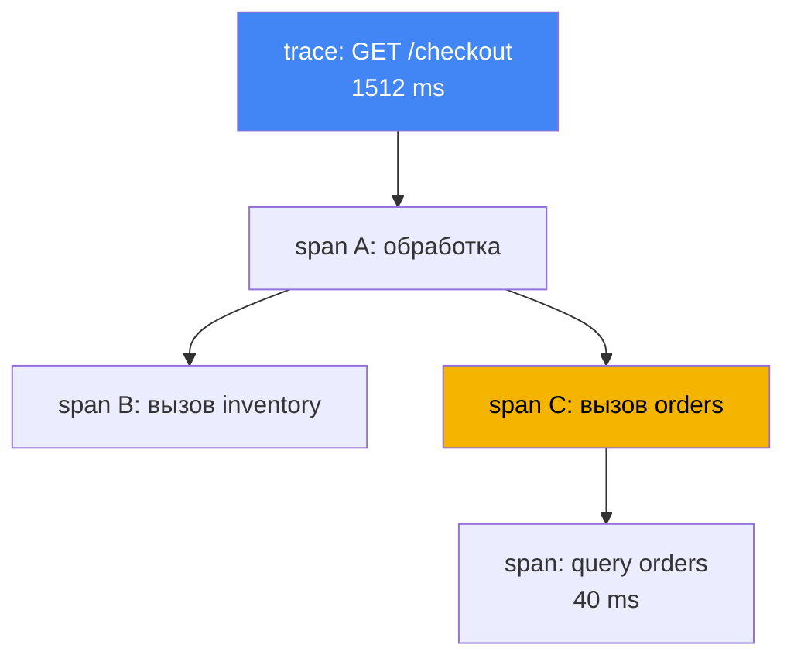
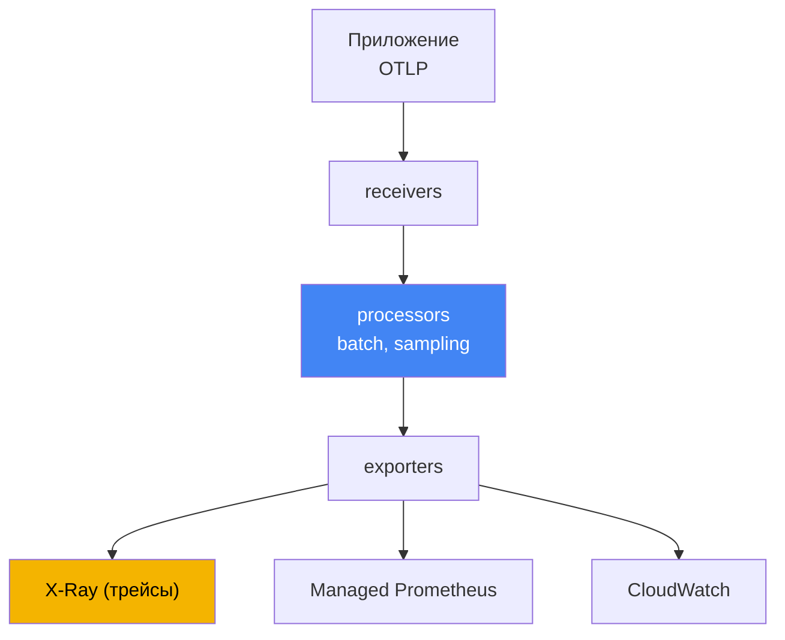

[Eng version](en.md) · [Versión en español](es.md) · [Version française](fr.md) · [Deutsche Version](de.md) · [ქართული ვერსია](ge.md) · [繁體中文版](tw.md) · [日本語版](jp.md)
# Глава 36. Трейсинг и профилирование: ADOT и X-Ray

> **Что дальше.** Главы 33 и 34 дали метрики и логи - две из трёх опор наблюдаемости. Здесь
> третья: распределённый трейсинг, который связывает один запрос в единый путь через цепочку
> сервисов, и кратко - профилирование. Смежное отдано другим главам: метрики (в том числе
> ADOT как сборщик метрик в Amazon Managed Prometheus) - глава 33; логи - глава 34; роли для
> экспорта телеметрии в AWS через IRSA и Pod Identity - главы 16 и 17. Этой главой
> закрывается Часть 6. Дальше Часть 7 - эксплуатация: аддоны, обновления, надёжность, бэкапы
> и стоимость.

## 36.1. «p99 вырос, а кто виноват - непонятно»

Пользователь жалуется: страница грузится медленно. Дежурный открывает дашборд и видит рост
задержки на входном сервисе: p99 подскочил с 200 мс до полутора секунд. Метрики честно
показывают, что «сервису A плохо», но не говорят почему. Запрос к A внутри идёт дальше: A
зовёт B, B зовёт C, C ходит в базу. Где именно накопилась задержка - в самом A, в сети до B,
в медленном запросе C к базе - по метрикам не видно.

Инженер идёт в логи (глава 34) и находит строки от каждого пода:

```
# лог пода A
level=info msg="GET /checkout 1512ms" 
# лог пода C (другой под, другой namespace)
level=info msg="query orders 40ms"
```

Строки есть, но они разрозненные. Нет способа сказать, что вот эта строка в A и вон та в C -
про один и тот же пользовательский запрос. Тысячи запросов в секунду, логи вперемешку, и
собрать из них путь одного запроса вручную невозможно. Метрики отвечают на вопрос «что»
(задержка растёт), логи - «почему» в одной точке (ошибка в конкретном поде), но ни те, ни
другие не отвечают на «где в цепочке» задержка. Пять вызовов в цепочке, а какой из них
виноват - загадка.

Именно эту загадку решает распределённый трейсинг. Он присваивает каждому запросу сквозной
идентификатор и записывает время каждой операции на его пути, так что p99 раскладывается на
слагаемые: столько-то в A, столько-то на вызов B, столько-то в базе. Дальше по порядку: из
чего состоит трейс, при чём тут OpenTelemetry, как это собирает ADOT и куда складывает X-Ray.

## 36.2. Что такое распределённый трейсинг

Трейсинг описывает путь одного запроса через все сервисы, которых он коснулся. Двух понятий
достаточно, чтобы читать любой трейс:

- **trace** - весь путь запроса от входа до ответа, со всеми вложенными вызовами. У трейса есть
  общий `trace id`, единый для всех сервисов на пути.
- **span** - одна операция внутри трейса: обработка в сервисе, вызов соседа, запрос в базу. У
  span есть имя, время начала и длительность, ссылка на родительский span и атрибуты
  (HTTP-код, URL, имя таблицы). Из вложенных span складывается дерево - оно и показывает, где
  ушло время.

Чтобы `trace id` не терялся при переходе от сервиса к сервису, работает **context
propagation**: входной сервис кладёт идентификатор трейса в заголовки исходящего запроса,
следующий сервис их читает и продолжает тот же трейс. Индустриальный формат заголовков - W3C
Trace Context (`traceparent`). X-Ray исторически несёт контекст в своём заголовке
`X-Amzn-Trace-Id`, и ADOT SDK умеют оба формата - это важно, когда в цепочке есть сервисы AWS
(ALB, API Gateway, Lambda), проставляющие именно `X-Amzn-Trace-Id`. В `X-Amzn-Trace-Id`
контекст лежит полями `Root` (id трейса), `Parent` (родительский span) и `Sampled` (решение о
записи). X-Ray propagator из ADOT переводит эти поля в `traceparent` и обратно, а `Root` вида
`1-<epoch>-<id>` - это те же 32 hex, что и `trace id` в W3C. Так сквозной `trace id` и единое
решение о сэмплировании не рвутся на границе AWS-сервисов. Без распространения контекста
цепочка рвётся, и вместо одного дерева получаются отдельные несвязанные куски.



Отдельно стоит запомнить, где эта механика перестаёт работать сама. Заголовки есть у HTTP и
gRPC, а **асинхронная граница их не переносит**: положили сообщение в SQS, Kafka или
EventBridge - и авто-инструментирование обрывается, потому что переносить контекст через тело
сообщения никто за вас не будет. Продьюсер должен положить контекст в атрибуты сообщения, а
обработчик (тот самый воркер из главы 35) - достать его и продолжить трейс. Вариантов два: W3C
`traceparent` в обычных message attributes, если обе стороны ваши, и зарезервированный SQS
системный атрибут `AWSTraceHeader` с заголовком X-Ray - его понимают сами сервисы AWS, поэтому
для цепочек вида SNS, SQS, Lambda рабочим оказывается именно он. Пропустите этот шаг - и трейс
развалится на «запрос пришёл» и «что-то обработалось» без связи между ними.

Записывать полный трейс для каждого запроса дорого: при тысячах запросов в секунду это горы
данных и заметный оверхед. Поэтому применяют **sampling** - записывают не все трейсы, а долю.
Решение «сохранять или нет» принимается один раз на входе и распространяется по контексту,
чтобы трейс не оказался наполовину записан. Это head-based подход; его альтернатива,
tail-based на шлюзе, разбирается в разделе 36.4, а правила X-Ray - в 36.5.

## 36.3. OpenTelemetry: стандарт вместо привязки к вендору

Раньше каждый бэкенд трейсинга приходил со своим агентом и своим SDK: код инструментировали
под конкретного вендора, и сменить бэкенд означало переписать инструментирование.
**OpenTelemetry** (OTel) - проект CNCF, ставший индустриальным стандартом, - разрывает эту
связь. Он задаёт единый набор API, SDK и протокол, а бэкенд становится сменным.

Ключевая идея OTel - разделение двух вещей, которые вендоры смешивали:

- **Инструментирование** - как приложение порождает span и метрики. Делается через OTel SDK в
  коде либо авто-инструментированием без правки кода (раздел 36.6). Оно одинаковое независимо
  от того, куда потом уйдут данные.
- **Бэкенд** - где телеметрия хранится и анализируется: X-Ray, CloudWatch, Prometheus,
  сторонние системы. Меняется настройкой экспорта, без изменения кода приложения.

Связывает их **OTLP** (OpenTelemetry Protocol) - стандартный протокол передачи телеметрии от
приложения к сборщику и между сборщиками. Приложение говорит на OTLP и не знает, какой бэкенд
за ним стоит. Практический смысл для эксплуатации прямой: инструментируем один раз, а куда
слать трейсы и метрики - решаем в конфигурации сборщика и меняем без релиза приложения. Не
привязываемся к одному вендору.

## 36.4. ADOT: сборщик OpenTelemetry от AWS

**ADOT** (AWS Distro for OpenTelemetry) - это дистрибутив компонентов OpenTelemetry,
собранный, протестированный и поддерживаемый AWS: SDK, агенты авто-инструментирования и,
главное для нас, **OpenTelemetry Collector**. Collector - промежуточное звено между
приложениями и бэкендами: он принимает телеметрию, обрабатывает её и экспортирует в одну или
несколько систем.

В EKS ADOT ставится как **управляемый аддон** (`adot`): аддон разворачивает ADOT Operator, а
тот управляет collector'ами через ресурс `OpenTelemetryCollector`. Конвейер collector состоит
из трёх стадий:

- **receivers** - приём данных, обычно по OTLP от приложений (порты gRPC и HTTP);
- **processors** - обработка: батчинг (`batch`), ограничение памяти, сэмплирование, добавление
  атрибутов;
- **exporters** - выгрузка в бэкенды: `awsxray` для трейсов в X-Ray, экспорт метрик в Amazon
  Managed Prometheus (глава 33), экспортёры в CloudWatch.



Два процессора стоит назвать по именам, потому что без них конвейер живёт до первого всплеска.
Первым в цепочке ставят **`memory_limiter`**: он следит за расходом памяти и при достижении
порога начинает отказывать в приёме, возвращая ошибку отправителям, вместо того чтобы копить
данные и уйти в `OOMKilled`. Отправители при этом ретраят, то есть теряется часть телеметрии, а
не сам коллектор.

Второй - **`tail_sampling`**, и он меняет саму логику сэмплирования. То, что описано в разделе
36.2, - это **head-based**: доля решается на входе, до того как известен исход запроса. При
доле в несколько процентов вы теряете ровно то, что искали: ответы 5xx и всплески задержки.
**Tail-based** решает иначе: коллектор в режиме gateway накапливает спаны трейса, ждёт его
завершения и только потом применяет политики - сохранить все трейсы с ошибками и с задержкой
выше порога, а из успешных оставить небольшую долю. Так бюджет X-Ray тратится на аномалии, а не
на шум.

У tail-based есть два условия, о которых узнают на отладке. Первое: **все спаны одного трейса
должны попасть в один экземпляр коллектора**, иначе решение принимается по огрызку трейса; при
нескольких репликах шлюза перед ним ставят слой с `loadbalancing`-экспортёром, который
маршрутизирует спаны по `trace id`. Второе: накопление трейсов идёт в памяти в пределах окна
ожидания, поэтому шлюзу нужен запас RAM, а трейсы, которые не успели завершиться за окно,
оцениваются неполными. Отсюда и порядок: `memory_limiter` первым, `tail_sampling` за ним,
`batch` после него.

Один collector умеет одновременно слать трейсы в X-Ray и метрики в Prometheus - отсюда «одно
инструментирование, несколько бэкендов». Разворачивают collector в одном из режимов, и выбор
влияет на изоляцию и накладные расходы:

| Режим | Как размещается | Когда берут |
|---|---|---|
| Sidecar | контейнер рядом с приложением в поде | низкая задержка приёма, изоляция по поду |
| DaemonSet | по одному агенту на ноду | сбор с ноды, единый агент для всех подов |
| Deployment (gateway) | отдельный пул реплик, общий шлюз | централизация, батчинг и сэмплирование в одном месте |

Типовой паттерн - агент близко к приложению (sidecar или DaemonSet) плюс общий gateway
(Deployment), который батчит и сэмплирует перед отправкой в бэкенд. Права на экспорт в AWS
дают не ключами, а ролью: ServiceAccount collector'а привязан к IAM-роли через IRSA или Pod
Identity (главы 16 и 17), с минимальным набором прав - для X-Ray это `xray:PutTraceSegments`
и `xray:PutTelemetryRecords`.

## 36.5. AWS X-Ray: бэкенд для трейсов

**AWS X-Ray** - управляемый бэкенд трейсинга: он принимает span (в терминах X-Ray - сегменты
и подсегменты), хранит трейсы и даёт по ним аналитику. Главные вещи, ради которых на него
смотрят:

- **service map** - карта сервисов и связей между ними, построенная из трейсов. Показывает, кто
  кого зовёт, среднюю задержку и долю ошибок на каждом ребре. По ней видно узел, где копится
  задержка или растут ошибки.
- **разбивка задержки по сегментам** - для конкретного трейса видно, сколько времени ушло в
  каждом сервисе и на каждый вызов. Ровно то, чего не хватало в разделе 36.1: p99
  раскладывается на слагаемые.
- **поиск трейсов** - выборка медленных или ошибочных запросов по фильтрам (код ответа, сервис,
  длительность), чтобы смотреть не случайные, а именно проблемные трейсы.

Исторически трейсы в X-Ray слал **X-Ray daemon** - отдельный агент рядом с приложением.
Сейчас AWS переводит X-Ray на OpenTelemetry как основной стандарт инструментирования, и
предпочтительный путь - **ADOT Collector с экспортёром X-Ray** вместо daemon. В таблице
соответствий OpenTelemetry роль X-Ray daemon занимает именно OpenTelemetry Collector, а X-Ray
sampling rules соответствуют сэмплированию OTel. Для новых нагрузок в EKS ставят ADOT, а не
daemon.

**Sampling rules** в X-Ray задают, какую долю запросов записывать, и настраиваются
централизованно без правки кода. Правило состоит из двух частей: **reservoir** -
фиксированное число совпавших запросов в секунду, которые пишутся гарантированно, и **fixed
rate** - доля от остального сверх резервуара. Правила матчатся по атрибутам (имя сервиса,
путь, метод), так что можно писать все трейсы для оплаты и лишь долю для здоровьечеков. Это
основной рычаг контроля объёма и стоимости трейсов: чем ниже доля, тем дешевле и легче, но
тем выше шанс не поймать редкую проблему.

## 36.6. Инструментирование: SDK против авто-инструментирования

Чтобы приложение вообще порождало span, его надо инструментировать. Два пути:

- **OTel SDK в коде** - разработчик подключает библиотеки OpenTelemetry и, где нужно, вручную
  создаёт span вокруг важных операций. Больше контроля и точности (можно размечать
  бизнес-шаги), но требует правки кода на каждом языке.
- **Авто-инструментирование** - библиотеки OTel подключаются автоматически и оборачивают
  популярные фреймворки (HTTP-клиенты, серверы, драйверы баз) без изменения кода. В
  Kubernetes это делает **OpenTelemetry Operator**: по ресурсу `Instrumentation` и аннотации
  на поде он инъекцией init-контейнера добавляет агент в под при старте. Быстрый старт, но
  покрывает только то, что умеют готовые библиотеки.

На практике часто начинают с авто-инструментирования, чтобы быстро получить трейсы по HTTP и
вызовам баз, а затем точечно добавляют ручные span в коде для важной бизнес-логики. Оба пути
дают OTLP на выходе, поэтому collector и бэкенд от выбора не зависят.

## 36.7. CloudWatch Application Signals: APM поверх OTel

Если бэкенд наблюдаемости уже CloudWatch (глава 33), трейсинг можно получить не через
отдельный X-Ray-конвейер, а через **CloudWatch Application Signals** - слой APM поверх
OpenTelemetry. Он автоматически выделяет из телеметрии сервисы и операции и считает по ним
«золотые сигналы»: задержку, частоту ошибок и запросов, а также позволяет задавать SLO и
следить за их бюджетом.

Важная для эксплуатации связь: Application Signals включается тем же аддоном
**`amazon-cloudwatch-observability`**, что и Container Insights из главы 33. Аддон ставит
CloudWatch-агент и по умолчанию включает приём метрик и трейсов от авто-инструментированных
приложений. То есть один аддон закрывает и метрики контейнеров, и APM с трейсингом -
отдельный X-Ray-конвейер на ADOT для этого поднимать не обязательно. Выбор между «ADOT плюс
X-Ray» и «Application Signals» - это выбор бэкенда и уровня готовности из коробки, а не
разных способов инструментировать код: и то и другое стоит на OpenTelemetry.

## 36.8. Профилирование: что жрёт CPU внутри процесса

Трейсинг показывает, где время ушло между сервисами. Он не отвечает на другой вопрос: если
время ушло внутри одного процесса, то на какой именно код. Это область **профилирования**.

Непрерывное профилирование (continuous profiling) постоянно с малым оверхедом снимает, на что
процесс тратит CPU и память, и показывает hotspot'ы - функции и участки кода, где расходуется
больше всего ресурсов. Отличие от трейсинга чёткое:

| Инструмент | На какой вопрос отвечает | Гранулярность |
|---|---|---|
| Трейсинг (X-Ray) | где в цепочке сервисов задержка | сервисы и вызовы |
| Профилирование | какой код внутри процесса жрёт CPU/память | функции и строки кода |

В AWS вариант непрерывного профилирования - **Amazon CodeGuru Profiler**. Он собирает профиль
работающего приложения и подсвечивает самые дорогие по CPU и памяти места. Рядом с ним в
Kubernetes часто берут eBPF-профайлеры - **Pyroscope** и **Parca**: они снимают профиль CPU и
памяти на уровне ядра, без правки и переинструментирования приложения, и работают для любого
языка. Разворачивают их как DaemonSet на каждой ноде; результат - flame graph по функциям и
хранение профилей во времени, так что заметны регрессии CPU и памяти между релизами. Глубоко
в них здесь не уходим: для типичной эксплуатации EKS трейсинг закрывает
большинство вопросов «где медленно», а профилирование подключают адресно, когда трейс
показал, что затык внутри конкретного сервиса, а не в его вызовах.

## 36.9. Три опоры наблюдаемости вместе

Метрики, логи и трейсы - не конкуренты, а три ответа на три разных вопроса про один инцидент.
Разбор из раздела 36.1 собирается воедино именно связкой всех трёх.

| Опора | Вопрос | Инструменты (главы) |
|---|---|---|
| Метрики | что происходит: p99 вырос, ошибок больше | Container Insights, Managed Prometheus (глава 33) |
| Логи | почему в конкретной точке: текст ошибки | Fluent Bit, CloudWatch Logs, OpenSearch (глава 34) |
| Трейсы | где в цепочке задержка или сбой | ADOT, X-Ray, Application Signals (эта глава) |

Рабочий цикл дежурного: метрика показывает, что задержка выросла (что); трейс в X-Ray
показывает, на каком из пяти вызовов она накопилась (где); лог этого сервиса за это время
объясняет причину - таймаут, ретраи, ошибка запроса (почему). По отдельности каждая опора
даёт лишь часть картины; вместе они превращают «сервису A плохо» в «C медленно ходит в базу
из-за вот такого запроса». Поэтому в продакшене их собирают вместе, а не выбирают одну.

## 36.10. Как это применяют в продакшене

- **Ставят ADOT как аддон, а не собирают collector вручную.** Управляемый аддон `adot` приносит
  ADOT Operator и обновляется вместе с прочими аддонами (глава 37), без ручной возни с
  манифестами collector'а.
- **Инструментируют один раз на OpenTelemetry, бэкенд выбирают конфигурацией.** Код говорит на
  OTLP, а куда слать - X-Ray, Application Signals, сторонняя система - решает collector.
  Смена бэкенда не требует релиза приложения.
- **Права на экспорт дают ролью, не ключами.** ServiceAccount collector'а привязывают к
  IAM-роли через IRSA или Pod Identity (главы 16 и 17) с минимумом прав
  (`xray:PutTraceSegments`).
- **Настраивают sampling осознанно.** Полные трейсы для критичных путей (оплата, вход), низкая
  доля для шумных и служебных запросов. Sampling rules X-Ray правятся централизованно, без
  релиза.
- **Начинают с авто-инструментирования, ручные span добавляют точечно.** Быстро получают трейсы
  по HTTP и базам, затем размечают важную бизнес-логику руками там, где это нужно.
- **Не дублируют бэкенды без нужды.** Если наблюдаемость уже на CloudWatch, Application Signals
  через `amazon-cloudwatch-observability` часто закрывает APM без отдельного X-Ray-конвейера.
- **Ставят `memory_limiter` первым процессором.** Иначе всплеск OTLP-потока укладывает сам
  коллектор в `OOMKilled`, и наблюдаемость исчезает ровно в момент инцидента.
- **Аномалии сохраняют tail-based сэмплированием.** На шлюзе включают `tail_sampling`: все
  трейсы с ошибками и высокой задержкой пишутся полностью, из успешных остаётся малая доля. При
  нескольких репликах шлюза добавляют маршрутизацию по `trace id`, иначе решения принимаются по
  неполным трейсам.
- **Проверяют контекст на асинхронных границах.** Для SQS и Kafka контекст кладут в атрибуты
  сообщения (`traceparent` или `AWSTraceHeader`), а не надеются на авто-инструментирование.

## 36.11. Мини-глоссарий

- **trace** - весь путь одного запроса через сервисы, с общим `trace id`.
- **span** - отдельная операция внутри трейса (обработка, вызов, запрос в базу) со временем и
  атрибутами; из span складывается дерево трейса.
- **context propagation** - передача `trace id` между сервисами через заголовки (W3C Trace
  Context), чтобы трейс не разрывался.
- **X-Amzn-Trace-Id** - заголовок X-Ray с полями `Root`, `Parent`, `Sampled`; ADOT X-Ray
  propagator сопоставляет его с W3C `traceparent`, сохраняя сквозной `trace id`.
- **sampling** - запись не всех трейсов, а доли, для контроля объёма и стоимости.
- **head-based и tail-based sampling** - решение о записи на входе, до исхода запроса, против
  решения на шлюзе после сборки трейса (политики по ошибкам и задержке). Tail-based требует,
  чтобы все спаны трейса пришли в один экземпляр коллектора.
- **`memory_limiter`** - процессор Collector, ограничивающий расход памяти: на пороге он
  отказывает в приёме данных вместо того, чтобы уйти в `OOMKilled`; ставится первым.
- **`AWSTraceHeader`** - системный атрибут сообщения SQS под заголовок трейса X-Ray; способ
  пронести контекст через асинхронную границу, где заголовков нет.
- **OpenTelemetry (OTel)** - стандарт CNCF: единые API, SDK и протокол; разделяет
  инструментирование и бэкенд.
- **OTLP** - протокол передачи телеметрии от приложения к collector и между collector'ами.
- **ADOT** - AWS Distro for OpenTelemetry: дистрибутив OTel от AWS (SDK, агенты, Collector).
- **OpenTelemetry Collector** - сборщик: receivers принимают, processors обрабатывают,
  exporters выгружают телеметрию в бэкенды.
- **аддон `adot`** - управляемый аддон EKS, разворачивающий ADOT Operator для управления
  collector'ами.
- **AWS X-Ray** - управляемый бэкенд трейсов: хранение, service map, разбивка задержки, поиск
  трейсов.
- **service map** - карта сервисов и связей с задержкой и долей ошибок на рёбрах.
- **sampling rules** - правила X-Ray, задающие долю записываемых запросов через reservoir и
  fixed rate.
- **OpenTelemetry Operator** - оператор, делающий авто-инструментирование инъекцией агента в
  под.
- **CloudWatch Application Signals** - APM поверх OTel (SLO, задержка, ошибки), включается
  аддоном `amazon-cloudwatch-observability`.
- **continuous profiling** - непрерывный сбор hotspot'ов CPU и памяти в коде; в AWS - Amazon
  CodeGuru Profiler, из eBPF-профайлеров - Pyroscope и Parca.

## 36.12. Итоги главы

- Метрики говорят «что» и логи «почему в точке», но не связывают один запрос в цепочку
  сервисов; «где именно задержка» отвечает распределённый трейсинг.
- Трейс - путь запроса с общим `trace id`; span - отдельная операция; context propagation несёт
  `trace id` между сервисами; sampling пишет лишь долю трейсов.
- OpenTelemetry - индустриальный стандарт: единые API, SDK и протокол OTLP, разделение
  инструментирования и бэкенда, отсутствие привязки к вендору.
- ADOT - дистрибутив OTel от AWS; в EKS ставится аддоном `adot`, который приносит ADOT Operator
  и управляет OpenTelemetry Collector.
- Collector принимает OTLP, обрабатывает (batch, sampling) и экспортирует в несколько бэкендов:
  X-Ray для трейсов, Managed Prometheus для метрик, CloudWatch; режимы - sidecar, DaemonSet,
  Deployment (gateway).
- X-Ray хранит трейсы и даёт service map, разбивку задержки и поиск проблемных трейсов; вместо
  X-Ray daemon для новых нагрузок берут ADOT Collector с экспортёром X-Ray.
- Инструментируют через OTel SDK в коде или авто-инструментированием через OpenTelemetry
  Operator; права на экспорт в AWS выдают ролью через IRSA или Pod Identity (главы 16 и 17).
- CloudWatch Application Signals - APM поверх OTel, включается аддоном
  `amazon-cloudwatch-observability` (глава 33); профилирование (CodeGuru Profiler) ищет
  hotspot'ы в коде и дополняет трейсинг.

## 36.13. Как это пригодится в реальной работе

На дежурстве трейсинг превращает расплывчатое «медленно» в конкретный узел. Увидев рост p99
по метрикам, открывают service map в X-Ray и по задержке на рёбрах находят сервис-виновник,
затем проваливаются в конкретный медленный трейс и видят разбивку по вызовам. Дальше идут в
логи этого сервиса за то же время и находят причину. Без трейсинга этот путь - ручное
сопоставление логов из десятка подов, что при живом трафике практически безнадёжно.

При планировании решают три вещи. Первое - бэкенд: отдельный X-Ray-конвейер на ADOT или APM
через Application Signals на уже имеющемся CloudWatch. Второе - как инструментировать: авто
для быстрого охвата плюс ручные span для бизнес-логики. Третье - sampling: какие пути писать
полностью, а где достаточно доли, чтобы не платить за шум и не терять редкие проблемы. И
везде - доступ к AWS ролью, а не ключами, тем же механизмом IRSA или Pod Identity, что и для
остальных нагрузок.

## 36.14. Вопросы для самопроверки

1. Почему метрики и логи не отвечают, на каком из вызовов в цепочке выросла задержка?
2. Чем trace отличается от span и что такое `trace id`?
3. Что делает context propagation и что происходит с трейсом, если контекст не передаётся?
4. Зачем нужен sampling и почему решение «писать трейс или нет» принимают один раз на входе?
5. Что даёт OpenTelemetry как стандарт и почему разделение инструментирования и бэкенда важно?
6. Что такое OTLP и как он помогает менять бэкенд без релиза приложения?
7. Что такое ADOT и как он ставится в EKS?
8. Из каких трёх стадий состоит конвейер OpenTelemetry Collector и что делает каждая?
9. Чем различаются режимы collector'а sidecar, DaemonSet и Deployment (gateway)?
10. Что показывает service map в X-Ray и почему для новых нагрузок берут ADOT вместо daemon?
11. Как устроено sampling rule в X-Ray (reservoir и fixed rate) и зачем это для контроля
    стоимости?
12. Чем отличается OTel SDK в коде от авто-инструментирования через OpenTelemetry Operator?
13. Чем трейсинг отличается от профилирования и на какой вопрос отвечает каждый?
14. Чем tail-based сэмплирование лучше head-based при доле в несколько процентов и какие два
    условия нужно выполнить, чтобы оно работало правильно?
15. Зачем `memory_limiter` ставят первым процессором и что он делает при достижении порога?
16. Трейс обрывается на отправке в SQS. Почему и какими двумя способами переносят контекст?

## Практика

Своей лабы у главы пока нет, но состояние трейсинга легко снять на живом кластере. Сначала
проверьте, стоит ли аддон ADOT и поднялись ли его компоненты:

```bash
# установлен ли управляемый аддон adot
aws eks describe-addon --cluster-name my-cluster --addon-name adot \
  --query 'addon.status'
# поды ADOT Operator и collector'ов (namespace зависит от установки)
kubectl get pods -A | grep -Ei "adot|opentelemetry|otel"
```

Если приложения инструментированы и шлют трейсы в X-Ray, посмотрите карту сервисов и правила
сэмплирования через API X-Ray:

```bash
# карта сервисов и связей за последние минуты (время в epoch-секундах)
aws xray get-service-graph --start-time 1700000000 --end-time 1700000600
# действующие правила сэмплирования
aws xray get-sampling-rules
```

Сопоставьте картину с тремя опорами: видит ли collector приложения (есть ли трейсы в X-Ray
вообще), строится ли service map, и совпадает ли узел с наибольшей задержкой на карте с
сервисом, на который жалуются метрики. Если наблюдаемость у вас на CloudWatch, ту же роль
трейсинга и APM может выполнять Application Signals через аддон
`amazon-cloudwatch-observability` (глава 33) - тогда отдельный конвейер ADOT для трейсов
может и не понадобиться.

---
[Оглавление](../README_RU.md) · [Глава 35](../35/ru.md) · [Глава 37](../37/ru.md)
