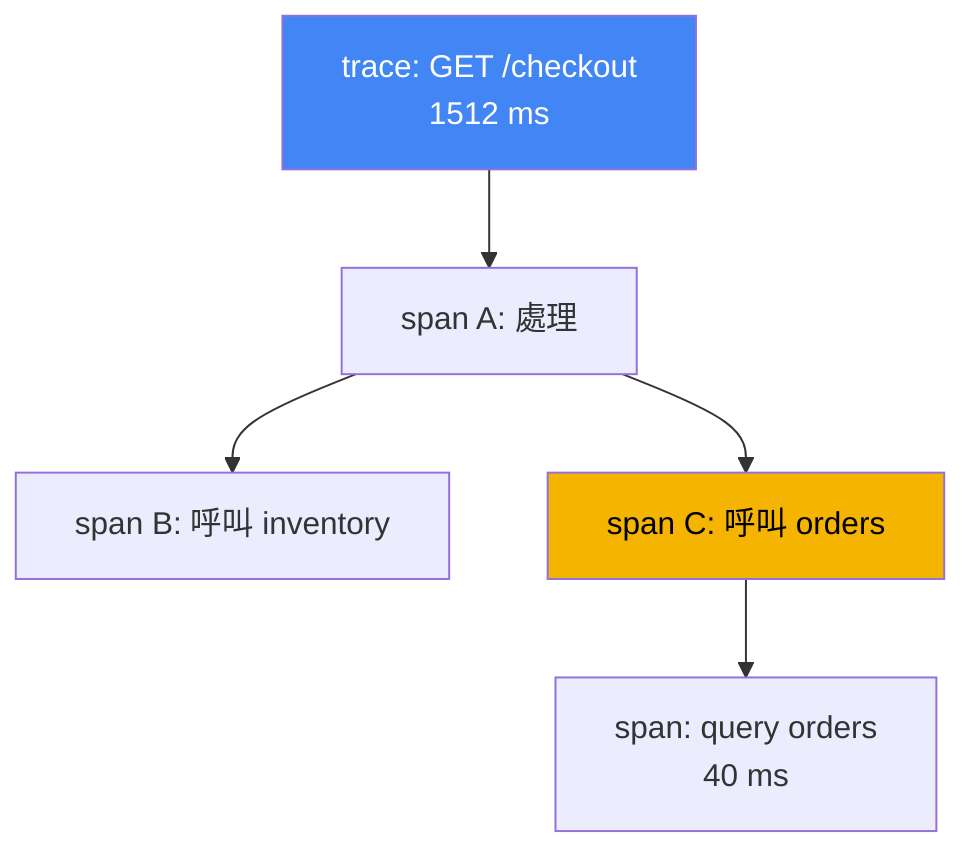
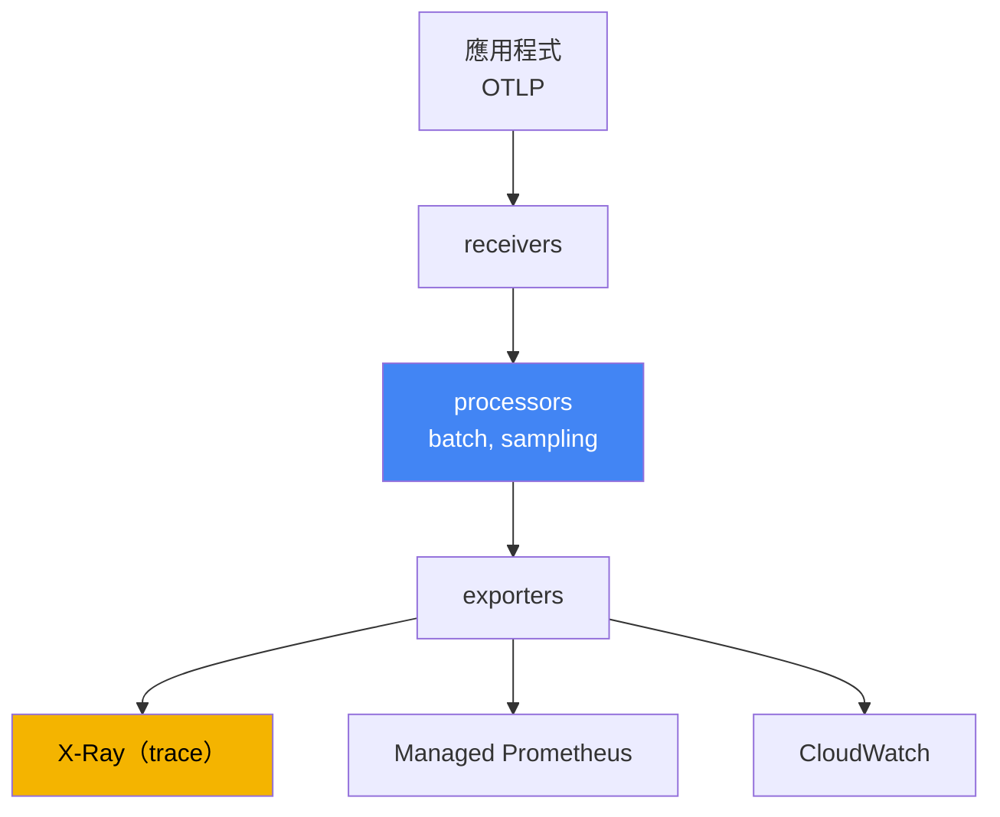

[Eng version](en.md) · [Versión en español](es.md) · [Version française](fr.md) · [Deutsche Version](de.md) · [ქართული ვერსია](ge.md) · [Русская версия](ru.md) · [日本語版](jp.md)
# 第 36 章。追蹤與剖析：ADOT 和 X-Ray

> **接下來。** 第 33 與 34 章提供了指標和日誌，這是可觀測性的三根支柱中的兩根。本章介紹第三根：將一個請求串連成穿越服務鏈之單一路徑的分散式追蹤，以及簡要介紹剖析。相關主題交由其他章節說明：指標，包括作為 Amazon Managed Prometheus 指標收集器的 ADOT，見第 33 章；日誌見第 34 章；透過 IRSA 與 Pod Identity 將遙測資料匯出至 AWS 的角色見第 16 與 17 章。本章結束第 6 部分。接下來是第 7 部分，即附加元件、升級、可靠性、備份與成本等營運內容。

## 36.1.「p99 升高，但不清楚是誰的錯」

使用者抱怨頁面載入很慢。值班工程師開啟儀表板，看到入口服務的延遲增加：p99 從 200 ms 躍升至一秒半。指標誠實地顯示「服務 A 狀況不佳」，卻沒有說明原因。對 A 的請求會在內部繼續傳遞：A 呼叫 B，B 呼叫 C，C 存取資料庫。從指標看不出延遲究竟累積在哪裡：是 A 本身、前往 B 的網路路徑，還是 C 對資料庫執行的慢速查詢。

工程師前往日誌（第 34 章），找到各個 Pod 的記錄行：

```
# Pod A 的日誌
level=info msg="GET /checkout 1512ms" 
# Pod C 的日誌（不同 Pod、不同 namespace）
level=info msg="query orders 40ms"
```

記錄行雖然存在，卻彼此斷裂。無法判斷 A 中的這一行和 C 中的那一行是否屬於同一個使用者請求。每秒有數千個請求，日誌混雜在一起，手動從中拼湊單一請求的路徑並不可能。指標回答「發生什麼事」（延遲正在升高），日誌回答單一位置的「為什麼」（特定 Pod 發生錯誤），但兩者都無法回答延遲位於鏈中的哪一處。鏈中有五次呼叫，卻不知道是哪一次造成問題。

分散式追蹤正是解決這個謎題。它為每個請求賦予端對端識別碼，並記錄其路徑上每項操作的耗時，因此可將 p99 拆解為組成部分：A 耗時多少、呼叫 B 耗時多少、資料庫耗時多少。以下依序說明：trace 的組成、OpenTelemetry 的角色、ADOT 如何收集，以及 X-Ray 儲存到哪裡。

## 36.2. 什麼是分散式追蹤

追蹤描述單一請求經過所有其接觸服務的路徑。閱讀任何 trace 只需理解兩個概念：

- **trace**：請求從進入到回應的完整路徑，含所有巢狀呼叫。trace 擁有共用的 `trace id`，路徑上所有服務都使用此識別碼。
- **span**：trace 中的一項操作，例如在服務中的處理、呼叫相鄰服務，或資料庫查詢。span 有名稱、開始時間和持續時間、指向父 span 的連結，以及屬性（HTTP 狀態碼、URL、資料表名稱）。巢狀 span 形成樹狀結構，顯示時間消耗的位置。

為避免 `trace id` 在請求於服務間移動時遺失，會進行 **context propagation**：入口服務將 trace 識別碼放入傳出請求標頭，下一個服務讀取它們並延續同一個 trace。業界標頭格式為 W3C Trace Context（`traceparent`）。X-Ray 傳統上會在自己的 `X-Amzn-Trace-Id` 標頭中傳遞 context，ADOT SDK 同時支援兩種格式。這在鏈中包含 AWS 服務（ALB、API Gateway、Lambda）並由它們設定 `X-Amzn-Trace-Id` 時很重要。在 `X-Amzn-Trace-Id` 中，context 包含 `Root`（trace ID）、`Parent`（父 span）與 `Sampled`（記錄決策）欄位。ADOT X-Ray propagator 在這些欄位與 `traceparent` 之間互相轉換，而格式為 `1-<epoch>-<id>` 的 `Root` 包含與 W3C `trace id` 相同的 32 個十六進位字元。如此一來，端對端 `trace id` 與單一取樣決策不會在 AWS 服務邊界中斷。沒有 context propagation，鏈路會斷裂，一棵樹會變成彼此無關的獨立片段。



另外值得記住，這個機制會在何處自行停止運作。HTTP 和 gRPC 有標頭，但**非同步邊界不會攜帶它們**：將訊息放入 SQS、Kafka 或 EventBridge 時，自動插樁就會停止，因為沒有人會替你透過訊息內容傳遞 context。生產者必須將 context 放入訊息屬性，消費者（第 35 章所述的 worker）必須取出它並延續 trace。有兩種選擇：若雙方都由你控制，則在一般 message attributes 中放入 W3C `traceparent`；或使用保留的 SQS 系統屬性 `AWSTraceHeader`，其中放入 X-Ray 標頭。AWS 服務本身理解後者，因此對 SNS、SQS、Lambda 等鏈路而言，這才是實用選項。略過此步驟，trace 就會拆成「請求到達」與「某些內容被處理」兩段，彼此沒有關聯。

記錄每個請求的完整 trace 成本很高：每秒數千個請求會產生大量資料和明顯額外負擔。因此會使用 **sampling**：並非記錄全部 trace，而是記錄其中一部分。保留或捨棄的決策會在入口處作出一次並透過 context 傳播，以免只記錄 trace 的一半。這是 head-based 方法；其在 gateway 上的 tail-based 替代方案會在 36.4 節說明，X-Ray 規則則在 36.5 節說明。

## 36.3. OpenTelemetry：避免受制於供應商的標準

過去每個追蹤 backend 都附帶自己的 agent 與 SDK：程式碼依特定供應商插樁，若更換 backend，就必須重寫插樁。**OpenTelemetry**（OTel）是已成為業界標準的 CNCF 專案，打破了這種關聯。它定義一組通用的 API、SDK 與協定，讓 backend 可替換。

OTel 的核心理念是分離供應商過去混在一起的兩件事：

- **插樁**：應用程式如何產生 span 和指標。可透過程式碼中的 OTel SDK，或不修改程式碼的自動插樁（36.6 節）來完成。無論資料最終傳送到哪裡，插樁都相同。
- **Backend**：遙測資料儲存與分析的位置，例如 X-Ray、CloudWatch、Prometheus 或第三方系統。只要變更匯出設定即可變更，不必修改應用程式程式碼。

連結兩者的是 **OTLP**（OpenTelemetry Protocol），這是從應用程式到 collector 及 collector 之間傳輸遙測資料的標準協定。應用程式使用 OTLP，且不知道背後是哪一個 backend。對營運的實際好處很直接：插樁一次，然後在 collector 設定中決定要將 trace 和指標傳送至何處，無須發布應用程式即可變更。不會受制於單一供應商。

## 36.4. ADOT：AWS 的 OpenTelemetry collector

**ADOT**（AWS Distro for OpenTelemetry）是 AWS 組裝、測試並支援的 OpenTelemetry 元件發行版：SDK、自動插樁 agent，以及對我們最重要的 **OpenTelemetry Collector**。Collector 是應用程式與 backend 之間的中介層：它接收遙測資料、進行處理，並匯出至一個或多個系統。

在 EKS 中，ADOT 安裝為 **受管附加元件**（`adot`）：附加元件部署 ADOT Operator，再由它透過 `OpenTelemetryCollector` 資源管理 collector。collector 管線包含三個階段：

- **receivers**：接收資料，通常透過應用程式的 OTLP（gRPC 和 HTTP 連接埠）；
- **processors**：處理資料：批次處理（`batch`）、記憶體限制、取樣、加入屬性；
- **exporters**：匯出至 backend：使用 `awsxray` 將 trace 匯出至 X-Ray、將指標匯出至 Amazon Managed Prometheus（第 33 章），以及匯出至 CloudWatch。



有兩個 processor 值得指名說明，因為沒有它們，管線在首次突發流量時就可能失效。鏈中的第一個應是 **`memory_limiter`**：它監控記憶體使用量，達到門檻時開始拒絕接收並向傳送端回傳錯誤，而不是累積資料直到發生 `OOMKilled`。傳送端會重試，因此損失的是部分遙測資料，而不是 collector 本身。

第二個是 **`tail_sampling`**，它改變了取樣的整個邏輯。36.2 節所述的是 **head-based**：在入口處、知道請求結果前就決定取樣比例。當比例只有幾個百分點時，恰好會遺失你正在尋找的內容：5xx 回應與延遲尖峰。**Tail-based** 的做法不同：gateway 模式的 collector 累積 trace 的 span、等待其完成，然後才套用策略：保留所有錯誤 trace 與延遲超過門檻的 trace，成功的 trace 則只保留少量比例。如此 X-Ray 預算會用於異常，而不是雜訊。

tail-based 有兩個通常在除錯時才會發現的條件。第一，**同一個 trace 的所有 span 都必須進入同一個 collector 執行個體**，否則決策會基於殘缺的 trace；gateway 有多個副本時，需在前方放置使用 `loadbalancing` exporter 的層，以 `trace id` 路由 span。第二，trace 在等待視窗中累積於記憶體，因此 gateway 需要足夠 RAM，而未在視窗內完成的 trace 會以不完整內容評估。這就是順序為何是：先 `memory_limiter`，接著 `tail_sampling`，然後 `batch`。

一個 collector 可以同時將 trace 傳送到 X-Ray，並將指標傳送到 Prometheus，這就是「一次插樁，多個 backend」。collector 可採下列其中一種模式部署，選擇會影響隔離性和額外負擔：

| 模式 | 如何部署 | 適用時機 |
|---|---|---|
| Sidecar | 與應用程式位於同一 Pod 的容器 | 接收延遲低、以 Pod 隔離 |
| DaemonSet | 每個節點一個 agent | 從節點收集、所有 Pod 共用一個 agent |
| Deployment（gateway） | 獨立副本集區、共用 gateway | 集中管理、在單一位置進行批次處理與取樣 |

典型模式是靠近應用程式的 agent（sidecar 或 DaemonSet），加上一個共用 gateway（Deployment），在傳送至 backend 前批次處理並取樣。匯出至 AWS 的權限不是透過金鑰授予，而是透過角色：collector 的 ServiceAccount 經由 IRSA 或 Pod Identity（第 16 與 17 章）連結至 IAM 角色，並擁有最小權限集，對 X-Ray 而言為 `xray:PutTraceSegments` 與 `xray:PutTelemetryRecords`。

## 36.5. AWS X-Ray：trace 的 backend

**AWS X-Ray** 是受管的追蹤 backend：它接收 span（在 X-Ray 術語中稱為 segment 與 subsegment）、儲存 trace 並提供分析。人們使用它的主要原因如下：

- **service map**：由 trace 建立的服務與關係地圖。它顯示誰呼叫誰、每個邊緣的平均延遲與錯誤比例。可由此看出延遲累積或錯誤增加的節點。
- **依 segment 拆分延遲**：對特定 trace，可看到每個服務及每次呼叫花費多少時間。這正是 36.1 節所缺少的資訊：p99 可拆解為組成部分。
- **搜尋 trace**：依篩選條件（回應碼、服務、持續時間）挑選慢速或失敗請求，查看真正有問題的 trace 而非隨機 trace。

過去由 **X-Ray daemon**，即靠近應用程式的獨立 agent，將 trace 傳送至 X-Ray。現在 AWS 將 OpenTelemetry 推為主要的插樁標準，建議路徑是使用帶有 X-Ray exporter 的 **ADOT Collector**，而不是 daemon。在 OpenTelemetry 對應表中，OpenTelemetry Collector 擔任 X-Ray daemon 的角色，X-Ray sampling rules 對應 OTel 取樣。新的 EKS 工作負載應安裝 ADOT，而非 daemon。

X-Ray 的 **Sampling rules** 定義要記錄哪一部分請求，且可集中設定而無須修改程式碼。一條規則由兩部分組成：**reservoir**，即每秒保證記錄的固定數量符合請求；以及 **fixed rate**，即超出 reservoir 的其餘請求中記錄的比例。規則依屬性（服務名稱、路徑、方法）比對，因此可記錄所有付款 trace，而僅記錄一部分健康檢查。這是控制 trace 資料量與成本的主要手段：比例越低，成本和負擔越小，但遺漏罕見問題的機率越高。

## 36.6. 插樁：SDK 與自動插樁

若要讓應用程式產生 span，必須對它進行插樁。有兩種方式：

- **程式碼中的 OTel SDK**：開發人員使用 OpenTelemetry 函式庫，並在需要處手動圍繞重要操作建立 span。控制力與精確度更高（可標記業務步驟），但每種語言都需要修改程式碼。
- **自動插樁**：自動連接 OTel 函式庫，並在不修改程式碼的情況下包裝常見 framework（HTTP client、server、資料庫 driver）。在 Kubernetes 中，這由 **OpenTelemetry Operator** 完成：它根據 `Instrumentation` 資源與 Pod 上的 annotation，透過注入 init container 在 Pod 啟動時將 agent 加入 Pod。可快速開始，但只涵蓋現成函式庫支援的內容。

實務上通常先採用自動插樁，以快速取得 HTTP 與資料庫呼叫的 trace，接著再在程式碼中針對重要業務邏輯精確加入手動 span。兩種方式輸出皆為 OTLP，因此 collector 和 backend 不受選擇影響。

## 36.7. CloudWatch Application Signals：OTel 之上的 APM

如果可觀測性 backend 已是 CloudWatch（第 33 章），就不必透過獨立的 X-Ray 管線取得追蹤，而可使用 **CloudWatch Application Signals**，這是 OpenTelemetry 之上的 APM 層。它會從遙測資料自動辨識服務與操作，並計算其「黃金訊號」：延遲、錯誤率和請求率，還能定義 SLO 並監控其預算。

一項對營運很重要的關聯是：Application Signals 由與第 33 章 Container Insights 相同的 **`amazon-cloudwatch-observability`** 附加元件啟用。此附加元件安裝 CloudWatch agent，並預設啟用從自動插樁應用程式接收指標和 trace。因此單一附加元件同時涵蓋容器指標與含追蹤的 APM，未必需要為此建立獨立的 X-Ray ADOT 管線。「ADOT 加 X-Ray」與「Application Signals」之間的選擇，是 backend 與開箱即用程度的選擇，而非不同的程式碼插樁方式：兩者都建立在 OpenTelemetry 之上。

## 36.8. 剖析：程序內部哪裡消耗 CPU

追蹤顯示時間花在服務之間的哪裡。它無法回答另一個問題：若時間花在單一程序內，究竟是哪段程式碼。這是 **剖析** 的領域。

持續剖析（continuous profiling）以低額外負擔持續擷取程序花費 CPU 與記憶體的方式，並顯示 hotspot，也就是消耗最多資源的函式與程式碼區段。它與追蹤的差異很清楚：

| 工具 | 回答的問題 | 細粒度 |
|---|---|---|
| 追蹤（X-Ray） | 服務鏈中的延遲位於何處 | 服務與呼叫 |
| 剖析 | 程序內哪段程式碼消耗 CPU/記憶體 | 函式與程式碼行 |

AWS 的持續剖析選項是 **Amazon CodeGuru Profiler**。它收集運行中應用程式的 profile，並標示 CPU 和記憶體成本最高的位置。在 Kubernetes 中，經常搭配使用 eBPF profiler，即 **Pyroscope** 與 **Parca**：它們從核心層級擷取 CPU 和記憶體 profile，不必修改或重新插樁應用程式，且適用於任何語言。它們以每個節點一個的 DaemonSet 部署；結果是依函式呈現的 flame graph，以及隨時間儲存的 profile，因此可發現版本之間的 CPU 和記憶體退化。這裡不深入探討：對典型 EKS 營運而言，追蹤能回答大部分「哪裡變慢」問題；當追蹤顯示瓶頸位於特定服務內部而非其呼叫時，才針對性加入剖析。

## 36.9. 三根可觀測性支柱的整合

指標、日誌和 trace 不是競爭者，而是對同一事件的三個不同問題的回答。36.1 節的分析正是透過三者的組合完成。

| 支柱 | 問題 | 工具（章節） |
|---|---|---|
| 指標 | 發生什麼事：p99 升高、錯誤增加 | Container Insights、Managed Prometheus（第 33 章） |
| 日誌 | 特定位置為何發生：錯誤文字 | Fluent Bit、CloudWatch Logs、OpenSearch（第 34 章） |
| Trace | 鏈中的延遲或故障位於何處 | ADOT、X-Ray、Application Signals（本章） |

值班人員的工作流程是：指標顯示延遲升高（發生什麼事）；X-Ray 中的 trace 顯示五次呼叫中的哪一次累積延遲（位於何處）；該服務在同一時間的日誌解釋原因，例如逾時、重試或查詢錯誤（為什麼）。單獨而言，每根支柱只提供部分畫面；一起使用時，能將「服務 A 狀況不佳」轉為「C 因這個查詢而緩慢存取資料庫」。因此在正式環境中會一起收集它們，而非只選擇其中之一。

## 36.10. 如何在正式環境中套用

- **將 ADOT 安裝為附加元件，而非手動組裝 collector。** 受管的 `adot` 附加元件提供 ADOT Operator，並與其他附加元件一起更新（第 37 章），不必手動處理 collector manifest。
- **在 OpenTelemetry 上插樁一次，並透過設定選擇 backend。** 程式碼使用 OTLP，而要傳送至 X-Ray、Application Signals 或第三方系統，則由 collector 決定。更換 backend 不需要發布應用程式。
- **透過角色而非金鑰授予匯出權限。** 將 collector 的 ServiceAccount 透過 IRSA 或 Pod Identity（第 16 與 17 章）連結至 IAM 角色，僅授予最小權限（`xray:PutTraceSegments`）。
- **有意識地設定 sampling。** 對關鍵路徑（付款、登入）記錄完整 trace，對雜訊多的服務請求保留低比例。X-Ray sampling rules 可集中修改，不必發布。
- **從自動插樁開始，再針對性加入手動 span。** 快速取得 HTTP 和資料庫 trace，然後在必要處手動標記重要業務邏輯。
- **不在沒有需要時重複 backend。** 若可觀測性已使用 CloudWatch，透過 `amazon-cloudwatch-observability` 的 Application Signals 通常可提供 APM，不需要獨立的 X-Ray 管線。
- **將 `memory_limiter` 作為第一個 processor。** 否則 OTLP 流量尖峰會使 collector 本身進入 `OOMKilled`，並使可觀測性恰好在事件發生時消失。
- **使用 tail-based sampling 保留異常。** 在 gateway 上啟用 `tail_sampling`：完整記錄所有錯誤和高延遲 trace，成功 trace 只保留小部分。gateway 有多個副本時，加入依 `trace id` 的路由，否則會依不完整 trace 作出決策。
- **檢查非同步邊界的 context。** 對 SQS 和 Kafka，將 context 放入訊息屬性（`traceparent` 或 `AWSTraceHeader`），而非依賴自動插樁。

## 36.11. 小型詞彙表

- **trace**：單一請求穿越服務的完整路徑，具有共用 `trace id`。
- **span**：trace 中的獨立操作（處理、呼叫、資料庫查詢），具備時間和屬性；span 組成 trace 樹。
- **context propagation**：透過標頭（W3C Trace Context）在服務間傳遞 `trace id`，避免 trace 中斷。
- **X-Amzn-Trace-Id**：具有 `Root`、`Parent`、`Sampled` 欄位的 X-Ray 標頭；ADOT X-Ray propagator 將其對應到 W3C `traceparent`，保留端對端 `trace id`。
- **sampling**：不記錄所有 trace，而是記錄其中一部分，以控制資料量與成本。
- **head-based 與 tail-based sampling**：分別是在入口處、請求結果出現前決定是否記錄，與在 gateway 收集完 trace 後再決定（依錯誤和延遲套用策略）。Tail-based 要求同一 trace 的所有 span 到達同一個 collector 執行個體。
- **`memory_limiter`**：限制記憶體使用量的 Collector processor：到達門檻時拒絕接收資料，而不是進入 `OOMKilled`；應置於第一位。
- **`AWSTraceHeader`**：用於放置 X-Ray trace 標頭的 SQS 系統訊息屬性；可將 context 穿越沒有標頭的非同步邊界。
- **OpenTelemetry（OTel）**：CNCF 標準：統一的 API、SDK 與協定；將插樁和 backend 分離。
- **OTLP**：從應用程式到 collector 及 collector 之間傳輸遙測資料的協定。
- **ADOT**：AWS Distro for OpenTelemetry：AWS 提供的 OTel 發行版（SDK、agent、Collector）。
- **OpenTelemetry Collector**：收集器：receivers 接收、processors 處理，exporters 將遙測資料匯出至 backend。
- **附加元件 `adot`**：部署 ADOT Operator 以管理 collector 的 EKS 受管附加元件。
- **AWS X-Ray**：受管 trace backend：儲存、service map、延遲拆分與 trace 搜尋。
- **service map**：顯示服務及其關係的地圖，包含邊緣上的延遲和錯誤比例。
- **sampling rules**：X-Ray 規則，透過 reservoir 與 fixed rate 定義記錄請求的比例。
- **OpenTelemetry Operator**：透過向 Pod 注入 agent 進行自動插樁的 operator。
- **CloudWatch Application Signals**：OTel 之上的 APM（SLO、延遲、錯誤），由 `amazon-cloudwatch-observability` 附加元件啟用。
- **continuous profiling**：持續收集程式碼中的 CPU 與記憶體 hotspot；AWS 中為 Amazon CodeGuru Profiler，eBPF profiler 則為 Pyroscope 和 Parca。

## 36.12. 本章總結

- 指標回答「什麼」，日誌回答「單一位置為什麼」，但無法將一個請求串連為服務鏈；分散式追蹤回答「延遲究竟位於何處」。
- Trace 是具有共用 `trace id` 的請求路徑；span 是單一操作；context propagation 在服務間傳遞 `trace id`；sampling 只記錄部分 trace。
- OpenTelemetry 是業界標準：統一的 API、SDK 與 OTLP 協定，分離插樁與 backend，不受制於供應商。
- ADOT 是 AWS 的 OTel 發行版；在 EKS 中以 `adot` 附加元件安裝，該元件提供 ADOT Operator 並管理 OpenTelemetry Collector。
- Collector 接收 OTLP、處理資料（batch、sampling），並匯出至多個 backend：trace 傳送至 X-Ray，指標傳送至 Managed Prometheus 與 CloudWatch；模式為 sidecar、DaemonSet、Deployment（gateway）。
- X-Ray 儲存 trace，並提供 service map、延遲拆分及有問題 trace 的搜尋；新的工作負載使用有 X-Ray exporter 的 ADOT Collector，而非 X-Ray daemon。
- 透過程式碼中的 OTel SDK 或透過 OpenTelemetry Operator 的自動插樁來插樁；經由 IRSA 或 Pod Identity（第 16 與 17 章）的角色授予 AWS 匯出權限。
- CloudWatch Application Signals 是 OTel 之上的 APM，透過 `amazon-cloudwatch-observability` 附加元件（第 33 章）啟用；剖析（CodeGuru Profiler）尋找程式碼 hotspot，並補足追蹤。

## 36.13. 這在實際工作中的用途

值班時，追蹤會將模糊的「變慢了」轉成具體節點。由指標發現 p99 升高後，在 X-Ray 中開啟 service map，根據邊緣延遲找出有問題的服務，然後深入特定慢速 trace，查看依呼叫拆分的資料。接著前往該服務在同一時段的日誌，找出原因。沒有追蹤時，這條路徑只能手動比對十多個 Pod 的日誌，在即時流量下幾乎無望。

規劃時要決定三件事。第一是 backend：在 ADOT 上建立獨立 X-Ray 管線，或透過既有 CloudWatch 的 Application Signals 使用 APM。第二是如何插樁：使用自動插樁以快速涵蓋範圍，並為業務邏輯加入手動 span。第三是 sampling：哪些路徑要完整記錄、哪些地方保留部分即可，以免為雜訊付費又不錯失罕見問題。而且所有情況下，都使用角色而非金鑰存取 AWS，與其他工作負載相同地透過 IRSA 或 Pod Identity。

## 36.14. 自我檢核問題

1. 為什麼指標和日誌無法回答服務鏈中哪一次呼叫的延遲升高？
2. trace 與 span 有何差異，`trace id` 是什麼？
3. context propagation 做什麼？若不傳遞 context，trace 會發生什麼事？
4. 為什麼需要 sampling，且為何「是否記錄 trace」的決策只在入口處作出一次？
5. OpenTelemetry 作為標準提供什麼，為何分離插樁和 backend 很重要？
6. OTLP 是什麼，它如何協助在不發布應用程式的情況下更換 backend？
7. ADOT 是什麼，如何在 EKS 中安裝？
8. OpenTelemetry Collector 管線由哪三個階段組成，各自做什麼？
9. collector 的 sidecar、DaemonSet 與 Deployment（gateway）模式有何差異？
10. X-Ray 中的 service map 顯示什麼，且為何新工作負載使用 ADOT 而非 daemon？
11. X-Ray 的 sampling rule（reservoir 與 fixed rate）如何運作，為何這有助於控制成本？
12. 程式碼中的 OTel SDK 與透過 OpenTelemetry Operator 的自動插樁有何差異？
13. 追蹤和剖析有何差異，各自回答什麼問題？
14. 在取樣比例只有幾個百分點時，tail-based sampling 為何優於 head-based，且要正確運作必須滿足哪兩個條件？
15. 為何將 `memory_limiter` 設為第一個 processor，且它在達到門檻時做什麼？
16. Trace 在傳送至 SQS 時中斷。原因是什麼，可以用哪兩種方式傳遞 context？

## 實作練習

本章目前沒有自己的 lab，但在實際執行中的叢集上很容易檢查追蹤狀態。先確認 ADOT 附加元件是否已安裝，以及其元件是否正在運行：

```bash
# 是否已安裝受管 adot 附加元件
aws eks describe-addon --cluster-name my-cluster --addon-name adot \
  --query 'addon.status'
# ADOT Operator 與 collector 的 Pod（namespace 視安裝方式而定）
kubectl get pods -A | grep -Ei "adot|opentelemetry|otel"
```

若應用程式已插樁且正將 trace 傳送到 X-Ray，可透過 X-Ray API 查看 service map 與 sampling rules：

```bash
# 過去數分鐘的服務與關係地圖（時間為 epoch 秒）
aws xray get-service-graph --start-time 1700000000 --end-time 1700000600
# 目前有效的 sampling rules
aws xray get-sampling-rules
```

將結果與三根支柱相互對照：collector 是否看得到應用程式（X-Ray 是否有 trace）、是否建立 service map，以及地圖上延遲最高的節點是否與指標所警示的服務相符。若你的可觀測性使用 CloudWatch，也可以透過 `amazon-cloudwatch-observability` 附加元件的 Application Signals 提供相同的追蹤與 APM 角色（第 33 章），那麼可能不需要獨立的 ADOT trace 管線。

---
[目錄](../README_TW.md) · [第 35 章](../35/tw.md) · [第 37 章](../37/tw.md)
