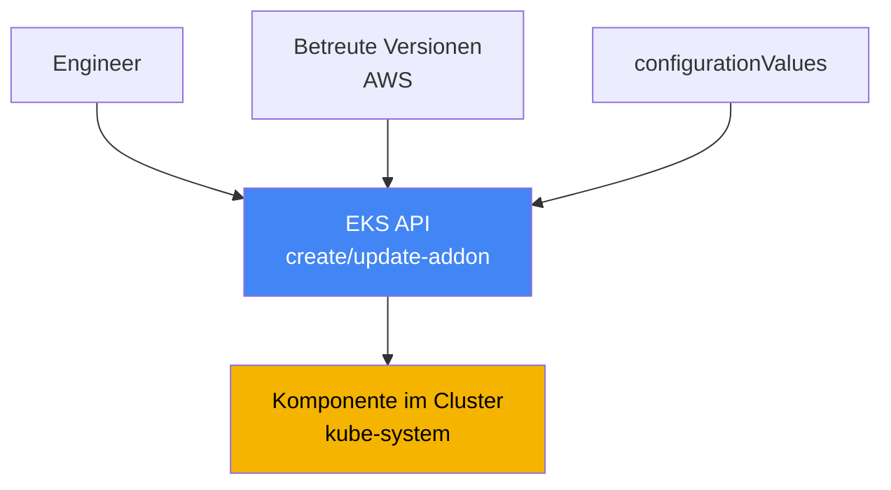
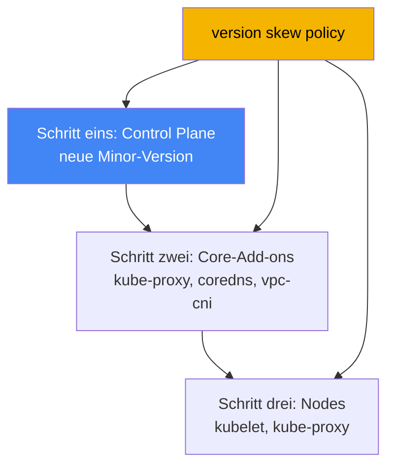

[Русская версия](ru.md) · [Eng version](en.md) · [Versión en español](es.md) · [Version française](fr.md) · [ქართული ვერსია](ge.md) · [繁體中文版](tw.md) · [日本語版](jp.md)
# Kapitel 37. EKS-Add-ons: Managed Add-ons versus Helm, Versionen und Aktualisierungsreihenfolge

> **Wie es weitergeht.** Dieses Kapitel eröffnet Teil 7 - den Betrieb eines Clusters, der bereits erstellt wurde und läuft. Die erste Betriebsfrage lautet: Wer besitzt den Lebenszyklus der Systemkomponenten und wie bleiben ihre Versionen mit der Cluster-Version abgestimmt? Hier geht es um die Verwaltung von Add-ons und ihrer Versionen. Verwandte Themen behandeln andere Kapitel: das vollständige Cluster-Upgrade über Versionen in Kapitel 38, das Zurücksetzen einer Version in Kapitel 39, konkrete Add-ons in ihren eigenen Kapiteln (VPC CNI in Kapitel 8, EBS CSI in Kapitel 23, Load Balancer Controller in Kapitel 26, Observability in den Kapiteln 33-36) sowie Rollen für Add-ons über IRSA und Pod Identity in den Kapiteln 16 und 17.

## 37.1. „Control Plane aktualisiert, aber CoreDNS blieb alt“

Ein Engineer hat die Cluster-Version aktualisiert: Die Control Plane wurde auf eine neue Minor-Version umgestellt, der Befehl lief ohne Fehler durch, und die Konsole zeigt die neue Version. Einen Tag später häufen sich Beschwerden: Einige Pods können Namen nicht auflösen, an anderen Stellen bricht die Verbindung zwischen Services ab. Der Bereitschaftsdienst prüft, was in `kube-system` läuft, und sieht eine nicht abgestimmte Situation:

```bash
kubectl get pods -n kube-system -o wide | grep -E "coredns|kube-proxy|aws-node"
# coredns    Image einer alten Version
# kube-proxy Image, das der Control Plane mehrere Minor-Versionen hinterherhinkt
# aws-node   (VPC CNI) ebenfalls in einer früheren Version
```

Die Control Plane ist weitergezogen, aber die Systemkomponenten auf den Nodes blieben auf den Versionen, mit denen der Cluster vor dem Upgrade lief. Das ist **version skew**: eine Versionsabweichung zwischen der Control Plane und Datenkomponenten. kube-proxy und CoreDNS werden nicht selbstständig nach der Control Plane aktualisiert. Ihre Versionen müssen separat und auf mit der neuen Minor-Version kompatible Stände angehoben werden. Bis das passiert, ist das Verhalten unvorhersehbar: DNS-Auflösung, Load Balancing über kube-proxy und das Pod-Netzwerk können teilweise und nicht sofort ausfallen.

Eine zweite Variante desselben Problems tritt sogar ohne Upgrade auf: ein Zoo verschiedener Installationsmethoden. VPC CNI wurde als Managed Add-on installiert, jemand hat CoreDNS als Helm-Chart neu installiert, kube-proxy per `kubectl edit` manuell verändert, der metrics-server kam als separates Manifest. Die Versionen laufen auseinander, und auf die Frage „Wer ist für das Upgrade genau dieser Komponente verantwortlich?“ kann im Team niemand sicher antworten. Beim nächsten Upgrade wird das zum Rätsel: Was wird mit einem AWS-Befehl aktualisiert, was per Helm, was manuell und in welcher Reihenfolge?

Beide Situationen betreffen dasselbe: Die Systemkomponenten eines Clusters brauchen einen klaren Besitzer ihres Lebenszyklus und eine vorhersehbare Aktualisierungsreihenfolge. Genau das bieten EKS Managed Add-ons. Der Reihe nach: Was ein Managed Add-on ist, welche es gibt, wie sie sich von einer Helm-Installation unterscheiden, wie Konfigurationskonflikte aufgelöst werden, wie ein Add-on Berechtigungen in AWS erhält und wie version skew die Upgrade-Reihenfolge vorgibt.

## 37.2. Was ist ein EKS Managed Add-on?

Ein **EKS Managed Add-on** (verwaltetes Add-on) ist eine von AWS betreute Systemkomponente des Clusters, deren Installation und Aktualisierung über die EKS API statt über Helm oder reine Manifeste verwaltet wird. AWS erstellt das Add-on, enthält aktuelle Sicherheits-Patches und Korrekturen darin, testet die Kompatibilität mit EKS-Versionen und veröffentlicht einen Satz von Versionen. Der Engineer lädt kein Chart und verfolgt nicht das Upstream-Projekt, sondern wählt eine Add-on-Version aus einer geprüften Liste.

Die Verwaltung erfolgt über eigene EKS-API-Operationen und deren CLI-Wrapper:

```bash
# Add-on in einer bestimmten Version installieren
aws eks create-addon --cluster-name my-cluster --addon-name coredns \
  --addon-version v1.11.1-eksbuild.4
# auf eine andere Version aktualisieren
aws eks update-addon --cluster-name my-cluster --addon-name coredns \
  --addon-version v1.11.3-eksbuild.1
# anzeigen, was installiert ist und welchen Status es hat
aws eks describe-addon --cluster-name my-cluster --addon-name coredns
```

Drei Eigenschaften sind zentral. Erstens sind **Versionen an die Cluster-Version gebunden**: Für jede Add-on-Version gibt AWS an, mit welchen Kubernetes-Minor-Versionen sie kompatibel ist. Ein Add-on-Upgrade bedeutet daher nicht „die neueste Version nehmen“, sondern „eine mit der aktuellen Minor-Version kompatible Version nehmen“. Zweitens wird ein **Add-on nicht automatisch aktualisiert**: EKS ändert die Add-on-Version weder beim Erscheinen neuer Releases noch beim Update des Clusters auf eine neue Minor-Version. Das Update wird immer vom Engineer initiiert. Drittens lässt sich die **Konfiguration deklarativ festlegen**, über das Feld `configurationValues`, ohne Manifeste manuell anzufassen:

```bash
# Add-on-Einstellungen als JSON übergeben (Struktur hängt vom Add-on ab)
aws eks update-addon --cluster-name my-cluster --addon-name coredns \
  --configuration-values '{"replicaCount":3}'
# welche Schlüssel diese Add-on-Version überhaupt annimmt
aws eks describe-addon-configuration --addon-name coredns \
  --addon-version v1.11.3-eksbuild.1
```



Die Bedeutung ist einfach: Zwischen dem Engineer und der Komponente im Cluster steht die EKS API, die Versionskompatibilität kennt, die gewählte Konfiguration speichert und sie vorhersehbar anwenden kann.

## 37.3. Welche Add-ons gibt es und was wird standardmäßig installiert?

Die Komponenten, die AWS als Managed Add-ons anbietet, sind nach ihrem Zweck gegliedert. Im Folgenden stehen die wichtigsten, mit den Namen, die `--addon-name` akzeptiert:

| Kategorie | Add-ons | Aufgabe |
|---|---|---|
| Netzwerk (Kern) | `vpc-cni`, `kube-proxy` | IP-Adressen für Pods über ENI; Service-Regeln auf Nodes |
| DNS (Kern) | `coredns` | DNS-Auflösung innerhalb des Clusters |
| Speicher | `aws-ebs-csi-driver`, `aws-efs-csi-driver`, `aws-mountpoint-s3-csi-driver` | EBS-, EFS- und S3-Volumes |
| Observability | `amazon-cloudwatch-observability`, `adot` | Metriken, Logs, Traces (Kapitel 33-36) |
| Identität | `eks-pod-identity-agent` | Pod-Identity-Agent (Kapitel 17) |
| Sonstiges | `metrics-server`, `snapshot-controller` | Metriken für HPA; CSI-Snapshots |

Die drei Komponenten `vpc-cni`, `kube-proxy` und `coredns` werden **Core-Add-ons** genannt: Ohne sie funktioniert der Cluster nicht als Cluster (kein Pod-Netzwerk, kein Service-Load-Balancing, kein DNS). EKS installiert sie für jeden Cluster. Die einzige Frage ist, ob sie managed oder self-managed sind.

Was beim Erstellen eines Clusters tatsächlich installiert wird, hängt vom Werkzeug ab. Über die AWS-Konsole wird der Kern (`kube-proxy`, `vpc-cni`, `coredns`) direkt als Managed Add-ons installiert. Über `eksctl` ohne Konfigurationsdatei werden ab Version 0.184.0 dieselben drei plus `metrics-server` ebenfalls als Managed Add-ons installiert. Mit anderen Werkzeugen oder älteren `eksctl`-Versionen werden dieselben drei Komponenten self-managed installiert. Sie können in eigener Verantwortung bleiben oder später in managed überführt werden. Im EKS Auto Mode ist ein Teil dieser Funktionen in die Plattform selbst eingebaut und wird nicht über gewöhnliche Add-ons verwaltet.

## 37.4. Managed Add-on versus self-managed (Helm oder Manifest)

Nicht alles wird als Managed Add-on installiert. Viele wichtige Komponenten sind nur als Helm-Chart oder Manifest verfügbar: **AWS Load Balancer Controller** (Kapitel 26), **external-dns** und **cert-manager** (Kapitel 29), **Karpenter** (Kapitel 12). Für sie liegt der gesamte Lebenszyklus bei Ihnen. Die Core-Add-ons und einige Treiber sind dagegen in beiden Formen verfügbar. Hier ist die Wahl bewusst zu treffen.

| Kriterium | Managed Add-on | Self-managed (Helm/Manifest) |
|---|---|---|
| Besitzer des Upgrades | Sie initiieren es, AWS wendet es an | vollständig Sie |
| Auswahl der Versionen | von AWS betreute Liste | jede Upstream-Version |
| Kompatibilität mit dem Cluster | von AWS geprüft und zugesichert | prüfen Sie selbst |
| Konfiguration | `configurationValues` + Cluster-Felder | Chart-Values, vollständige Kontrolle |
| Konfliktauflösung | `resolveConflicts` in der API | mit Helm-Mitteln |
| Flexibilität bei Feineinstellungen | auf verwaltete Felder begrenzt | maximal |
| Verfügbar für | Kern, CSI, Observability und weitere | beliebige Komponenten, einschließlich nur-Helm |

Die Wahlregel ist praktisch: Was als Managed Add-on verfügbar ist und keine exotische Konfiguration benötigt, wird als managed verwendet. Das bedeutet weniger Handarbeit, zugesicherte Kompatibilität und ein vorhersehbares Upgrade. Wo eine Version oder Konfiguration nötig ist, die im betreuten Satz fehlt, oder eine Komponente gar nicht als Add-on veröffentlicht wird, kommt Helm zum Einsatz und Sie übernehmen den Lebenszyklus. Beide Methoden für dieselbe Komponente zu mischen, ist genau der Zoo aus Abschnitt 37.1, den man vermeiden sollte.

## 37.5. Konfliktauflösung: resolveConflicts und Feldbesitz

Ein Managed Add-on wendet seine Konfiguration über server-side apply auf den Cluster an und erklärt einen Teil der Felder zu seinen eigenen (managed fields). Wenn dieselben Felder jemand manuell oder mit Helm verändert hat, entsteht bei create/update ein Konflikt. Das Feld **`resolveConflicts`** (Flag `--resolve-conflicts`) bestimmt, wie damit umgegangen wird:

| Wert | Verhalten | Wann geeignet |
|---|---|---|
| `NONE` | die Operation schlägt bei einem Konflikt fehl | sicherer Standard, manuell untersuchen |
| `OVERWRITE` | fremde Änderungen werden mit EKS-Standardwerten überschrieben | Add-on wieder auf den Referenzzustand zurücksetzen |
| `PRESERVE` | Ihre Feldänderungen bleiben erhalten | es gibt beabsichtigte Anpassungen |

Die Logik ist wie folgt. `NONE` beschädigt nicht stillschweigend etwas: Erkennt EKS einen Konflikt, gibt es einen Fehler mit Beschreibung zurück, und Sie entscheiden selbst. `OVERWRITE` bedeutet „EKS ist die Quelle der Wahrheit“: Alle Einstellungen werden auf die Standardwerte des Add-ons zurückgesetzt, Ihre manuellen Änderungen gehen verloren. `PRESERVE` bedeutet „Meine Änderungen sind beabsichtigt“: EKS verändert von Ihnen konfigurierte Felder nicht und wendet den Rest an.

Ein weiterer häufiger Fall ist die **Überführung von zuvor self-managed betriebenen Komponenten in managed**. Sie haben CoreDNS per Helm installiert und möchten es später über `create-addon` an EKS übergeben. Wenn Sie nicht `--resolve-conflicts OVERWRITE` angeben, schlägt die Installation wegen eines Konflikts mit bereits vorhandenen Objekten fehl. Mit `OVERWRITE` übernimmt EKS den Besitz und setzt die Konfiguration auf seine Standardwerte. Benutzerdefinierte Einstellungen, die Sie benötigen, müssen daher vorher in `configurationValues` übertragen werden, sonst gehen sie verloren. Welche Felder sich ändern lassen, ohne mit verwalteten Feldern in Konflikt zu geraten, beschreibt die Dokumentation zur Feldverwaltung für Add-ons.

## 37.6. Berechtigungen für Add-ons: IRSA oder Pod Identity

Einige Add-ons benötigen Berechtigungen in AWS: VPC CNI konfiguriert Netzwerkressourcen, EBS CSI erstellt und hängt Volumes an, ADOT sendet Telemetrie. Berechtigungen werden nicht per Schlüssel erteilt, sondern durch eine IAM-Rolle, die mit dem ServiceAccount des Add-ons verknüpft ist. Die zwei Mechanismen behandeln die Kapitel 16 und 17: **IRSA** (Rolle über den OIDC-Provider) und **EKS Pod Identity** (Verknüpfung über einen Agent). AWS empfiehlt Pod Identity für Add-ons, unterstützt aber auch IRSA.

Der Vorteil eines Managed Add-ons besteht darin, dass sich Rolle oder Zuordnung direkt in der Add-on-Operation mit einem Aufruf festlegen lassen, ohne separate manuelle Schritte:

```bash
# IRSA: ARN der Rolle für den Service Account des Add-ons angeben
aws eks update-addon --cluster-name my-cluster --addon-name aws-ebs-csi-driver \
  --service-account-role-arn arn:aws:iam::111122223333:role/ebs-csi-role
# Pod Identity: Zuordnung zusammen mit dem Add-on erstellen
aws eks update-addon --cluster-name my-cluster --addon-name aws-ebs-csi-driver \
  --pod-identity-associations 'serviceAccount=ebs-csi-controller-sa,roleArn=arn:aws:iam::111122223333:role/ebs-csi-role'
```

Mehrere Details sind wichtig. Ob ein Add-on überhaupt Berechtigungen benötigt, zeigt das Flag `requiresIamPermissions` in der Ausgabe von `describe-addon-versions`, während `describe-addon-configuration` die vorgeschlagene Richtlinie zeigt. Über die Add-on-API erzeugte Pod-Identity-Zuordnungen gehören dem Add-on: Löschen Sie das Add-on, wird auch die Zuordnung gelöscht. Das lässt sich mit einer Preserve-Option beim Löschen verhindern. Sind für ein Add-on sowohl `serviceAccountRoleArn` (IRSA) als auch Pod Identity gesetzt und ist der Pod-Identity-Agent installiert, verwendet EKS Pod Identity und ignoriert IRSA. Das Aktualisieren von Zuordnungen eines vorhandenen Add-ons löst einen Neustart seiner Pods aus.

## 37.7. Version skew und Aktualisierungsreihenfolge

Warum in Abschnitt 37.1 alles ausfiel, erklärt die **version skew policy** von Kubernetes selbst. Sie legt fest, wie stark Komponenten-Versionen von der Version des kube-apiserver (also der Control Plane) abweichen dürfen. Die Hauptregel lautet: Komponenten auf den Nodes dürfen nicht neuer als der API-Server sein und können nur eine begrenzte Zahl von Minor-Versionen zurückliegen.

| Komponente | Regel relativ zum kube-apiserver |
|---|---|
| kubelet | nicht neuer als der API-Server; bis zu 3 Minor-Versionen Rückstand (für 1.25+) |
| kube-proxy | nicht neuer als der API-Server; Rückstand in demselben Rahmen |
| CoreDNS | nicht Teil der version skew policy, die Version muss aber mit der Minor-Version kompatibel sein |

Daraus folgt unmittelbar für den Betrieb: Ein Cluster-Upgrade ist nicht ein einzelner Befehl, sondern eine Folge in der richtigen Reihenfolge. Zuerst wird die **Control Plane** auf eine neue Minor-Version angehoben. Danach werden die **Core-Add-ons** (`kube-proxy`, `coredns`, `vpc-cni`) auf mit dieser Minor-Version kompatible Versionen aktualisiert. Genau diesen Schritt hat Abschnitt 37.1 ausgelassen. Erst anschließend werden die **Nodes** (kubelet) aktualisiert. Diese Reihenfolge hält alle Versionen in jedem Schritt innerhalb der Policy-Grenzen. Den vollständigen Upgrade-Prozess beschreibt Kapitel 38.



Eine kompatible Add-on-Version wird nicht geraten, sondern über die API abgefragt. `describe-addon-versions` für eine bestimmte Kubernetes-Minor-Version gibt eine Liste von Add-on-Versionen zurück, das Feld `compatibilities` mit `clusterVersion` und das Kennzeichen `defaultVersion` - die standardmäßig empfohlene Version:

```bash
# welche coredns-Versionen mit Cluster 1.33 kompatibel sind
aws eks describe-addon-versions --addon-name coredns --kubernetes-version 1.33 \
  --query 'addons[].addonVersions[].{Version:addonVersion,Default:compatibilities[0].defaultVersion}'
```

Die Praxis beim Upgrade: Für die neue Minor-Version nehmen Sie aus dieser Ausgabe für jedes Core-Add-on eine kompatible Version, gewöhnlich `defaultVersion`, und aktualisieren es direkt nach der Control Plane, vor dem Rollout der Nodes. Dann bleibt version skew innerhalb der Grenzen, und die Symptome aus Abschnitt 37.1 treten nicht auf.

## 37.8. Anwendung in der Produktion

- **Den Kern als Managed Add-ons betreiben, nicht manuell.** `vpc-cni`, `kube-proxy` und `coredns` unter EKS-Verwaltung bieten zugesicherte Kompatibilität und ein vorhersehbares Upgrade. Manuelle Änderungen und paralleles Helm werden dafür nicht vermischt.
- **Add-on-Versionen explizit festlegen, nicht blind latest nehmen.** Vor dem Upgrade wird `describe-addon-versions` für die benötigte Minor-Version geprüft und eine kompatible, meist `defaultVersion`, ausgewählt.
- **Konfiguration in `configurationValues` halten, nicht in manuellen Änderungen.** Dann verhält sich `resolveConflicts` vorhersehbar, und die Überführung einer Komponente in managed verliert keine Anpassungen.
- **`resolveConflicts` bewusst wählen.** `PRESERVE` bei beabsichtigten Änderungen; `OVERWRITE` bei der Rückkehr zum Referenzzustand und bei der Übernahme einer self-managed Komponente; `NONE` als sicherer Standard, damit ein Konflikt als Fehler erscheint und nicht stillschweigend behandelt wird.
- **Add-ons Berechtigungen über Pod Identity oder IRSA geben (Kapitel 16 und 17)**, indem die Zuordnung direkt in der Add-on-Operation festgelegt wird, statt sie in getrennten manuellen Schritten anzulegen.
- **Dem Upgrade in version-skew-Reihenfolge folgen:** Control Plane, dann Core-Add-ons auf kompatible Versionen, dann Nodes (Kapitel 38). Add-ons nicht vergessen, sonst beschädigt die Abweichung Netzwerk und DNS.

## 37.9. Mini-Glossar

- **EKS Managed Add-on** - eine von AWS betreute Cluster-Komponente, die über die EKS API (`create-addon`, `update-addon`) mit zugesicherter Kompatibilität und AWS-Patches verwaltet wird.
- **self-managed Add-on** - eine mit Helm oder Manifest installierte Komponente; Lebenszyklus und Kompatibilität liegen vollständig beim Engineer.
- **Core-Add-ons** - `vpc-cni`, `kube-proxy`, `coredns`: der obligatorische Kern, der für jeden Cluster installiert wird.
- **configurationValues** - Add-on-Feld für deklarative Konfiguration ohne manuelle Änderung von Manifesten.
- **resolveConflicts** - wie ein Add-on mit Feldkonflikten umgeht: `NONE`, `OVERWRITE`, `PRESERVE`.
- **managed fields / server-side apply** - der Mechanismus, mit dem ein Add-on seine Felder deklariert und anwendet; darauf basiert die Konfliktauflösung.
- **version skew** - Versionsabweichung zwischen der Control Plane und Komponenten auf Nodes; begrenzt durch die version skew policy von Kubernetes.
- **describe-addon-versions** - EKS-API-Operation für Add-on-Versionen, ihre Kompatibilität mit einer Kubernetes-Minor-Version und `defaultVersion`.
- **Pod Identity association** - die Verknüpfung des ServiceAccount eines Add-ons mit einer IAM-Rolle; der für Add-ons empfohlene Weg zur Berechtigungserteilung (Kapitel 17).

## 37.10. Zusammenfassung des Kapitels

- Nach dem Upgrade der Control Plane aktualisieren sich die Core-Add-ons (`kube-proxy`, `coredns`, `vpc-cni`) nicht selbst. Der vergessene Schritt erzeugt version skew und beschädigt DNS sowie das Pod-Netzwerk.
- Ein EKS Managed Add-on ist eine von AWS betreute Komponente, die über die EKS API verwaltet wird. AWS stellt Patches bereit, testet die Kompatibilität und veröffentlicht eine Versionsliste.
- Ein Add-on aktualisiert sich nicht automatisch, weder bei neuen Releases noch beim Cluster-Upgrade. Das Update initiiert immer der Engineer; die Konfiguration wird über `configurationValues` festgelegt.
- Der Kern (`vpc-cni`, `kube-proxy`, `coredns`) wird für jeden Cluster installiert. Die Konsole und aktuelles `eksctl` installieren ihn managed, andere Werkzeuge self-managed.
- Ein Teil der Komponenten ist nur als Helm verfügbar (Load Balancer Controller, external-dns, cert-manager, Karpenter). Für sie liegt der Lebenszyklus vollständig bei Ihnen.
- `resolveConflicts` steuert Feldkonflikte: `NONE` (fehlschlagen), `OVERWRITE` (EKS-Standardwerte), `PRESERVE` (Ihre Änderungen erhalten). Beim Überführen von self-managed nach managed ist `OVERWRITE` erforderlich.
- Add-on-Berechtigungen werden per Rolle über Pod Identity oder IRSA (Kapitel 16 und 17) erteilt, indem die Zuordnung direkt in der Add-on-Operation angegeben wird. Sind beide Mechanismen konfiguriert und der Agent installiert, gewinnt Pod Identity.
- Die version skew policy bestimmt die Upgrade-Reihenfolge: Control Plane, dann Core-Add-ons auf kompatible Versionen (per `describe-addon-versions`), danach Nodes (Kapitel 38).

## 37.11. Nutzen in der Praxis

Beim Bereitschaftsdienst wird beim Symptom „Nach dem Upgrade sind DNS oder Netzwerk ausgefallen“ zuerst nicht in Anwendungen gesucht, sondern in `kube-system`: Die Versionen von `coredns`, `kube-proxy` und `aws-node` werden mit der Cluster-Version verglichen. Hängen die Add-ons der Control Plane hinterher, werden sie auf kompatible Versionen angehoben. In den meisten Fällen ist genau das die Lösung. Zu verstehen, dass Add-ons nicht automatisch mit der Control Plane aktualisiert werden, spart Stunden beim Rätselraten „Warum ist nach dem erfolgreichen Upgrade alles ausgefallen?“

Bei der Planung des Betriebs werden zwei Dinge entschieden. Erstens ein Besitzregister: Für jede Systemkomponente wird festgehalten, ob sie managed oder Helm ist und wer für ihre Version verantwortlich ist, damit kein Zoo entsteht. Zweitens eine Upgrade-Prozedur: Vor dem Aktualisieren einer Minor-Version werden per `describe-addon-versions` kompatible Versionen der Core-Add-ons zusammengestellt und ihr Upgrade in die Sequenz Control Plane - Add-ons - Nodes (Kapitel 38) eingebaut. So verlässt version skew nie die Grenzen, und Updates sind keine Quelle mehr für Überraschungen.

## 37.12. Fragen zur Selbstkontrolle

1. Warum können CoreDNS und kube-proxy nach dem Upgrade der Control Plane auf alten Versionen bleiben, und wozu führt das?
2. Was ist ein EKS Managed Add-on, und worin unterscheidet sich seine Verwaltung von einer Helm-Installation?
3. Wird ein Managed Add-on beim Cluster-Upgrade automatisch aktualisiert? Wer initiiert das Update?
4. Welche drei Komponenten heißen Core-Add-ons, und was wird beim Erstellen eines Clusters über die Konsole und über `eksctl` standardmäßig installiert?
5. Welche Komponenten sind nur über Helm verfügbar und warum lassen sie sich nicht als Managed Add-on verwenden?
6. Was bewirken die Werte `resolveConflicts` - `NONE`, `OVERWRITE`, `PRESERVE`?
7. Was passiert bei der Überführung von self-managed CoreDNS in managed ohne `--resolve-conflicts OVERWRITE`, und wie geht die benutzerdefinierte Konfiguration nicht verloren?
8. Wie werden einem Add-on Berechtigungen in AWS erteilt und was gewinnt, wenn sowohl IRSA als auch Pod Identity gesetzt sind?
9. Wem gehört eine über die Add-on-API erstellte Pod Identity association, und was geschieht mit ihr beim Löschen des Add-ons?
10. Was besagt die version skew policy über Komponenten auf Nodes relativ zum kube-apiserver?
11. In welcher Reihenfolge werden Control Plane, Core-Add-ons und Nodes aktualisiert, und warum gerade so?
12. Wie findet man eine Add-on-Version, die mit einer konkreten Kubernetes-Minor-Version kompatibel ist?

## Praxis

Die Kurs-Lab zu diesem Thema: [Lab 113 - Cluster-Upgrade und -Rollback: Control Plane, Add-ons, veraltete APIs](../../labs/113/README_DE.MD). Zusätzlich lässt sich der Zustand von Add-ons und ihren Versionen leicht auf einem laufenden Cluster erfassen. Prüfen Sie zuerst, was als Managed Add-on installiert ist und welchen Status es hat:

```bash
# Liste der Managed Add-ons des Clusters
aws eks list-addons --cluster-name my-cluster
# Status, Version und Rolle eines bestimmten Add-ons
aws eks describe-addon --cluster-name my-cluster --addon-name coredns \
  --query 'addon.{Version:addonVersion,Status:status,Role:serviceAccountRoleArn}'
```

Vergleichen Sie anschließend die Versionen der Core-Komponenten im Cluster mit der Cluster-Version selbst und mit den Add-on-Versionen, die mit Ihrer Minor-Version kompatibel sind:

```bash
# Cluster-Version
aws eks describe-cluster --cluster-name my-cluster --query 'cluster.version'
# tatsächlich in kube-system laufende Images der Core-Komponenten
kubectl get pods -n kube-system -o wide | grep -E "coredns|kube-proxy|aws-node"
# kompatible Add-on-Versionen für die Minor-Version des Clusters (eigene einsetzen)
aws eks describe-addon-versions --addon-name kube-proxy --kubernetes-version 1.33 \
  --query 'addons[].addonVersions[].{Version:addonVersion,Default:compatibilities[0].defaultVersion}'
```

Stellen Sie drei Dinge gegenüber: die Cluster-Version, die tatsächlichen Versionen von `coredns`, `kube-proxy` und `aws-node` in den Pods sowie den kompatiblen Satz aus `describe-addon-versions`. Bleiben die Core-Add-ons hinter der Control Plane zurück, handelt es sich um genau den version skew aus Abschnitt 37.1. Das Cluster-Upgrade in Kapitel 38 beginnt dann damit, die Add-ons auf kompatible Versionen zu bringen.

---
[Inhaltsverzeichnis](../README_DE.md) · [Kapitel 36](../36/de.md) · [Kapitel 38](../38/de.md)
