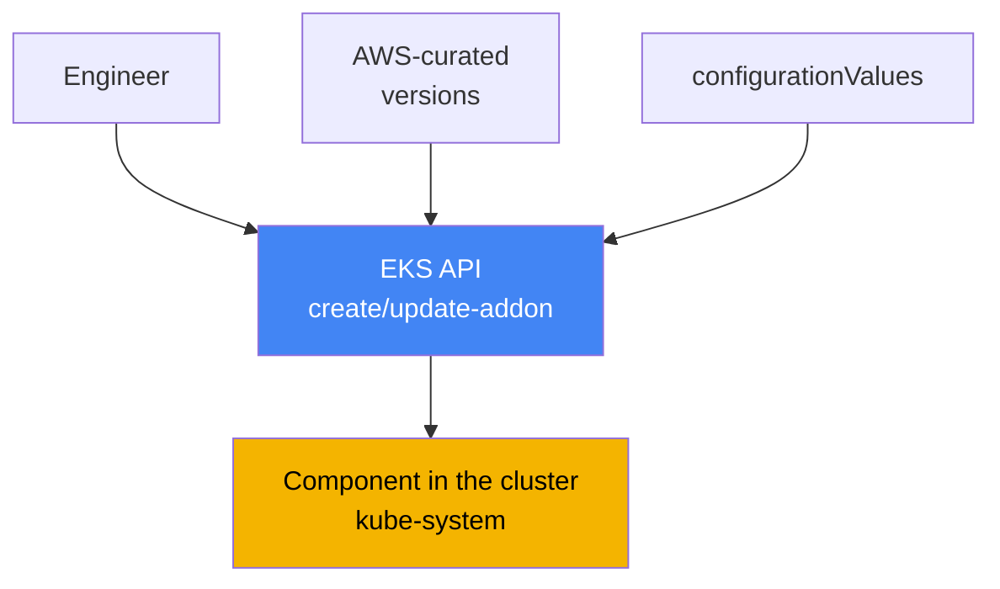
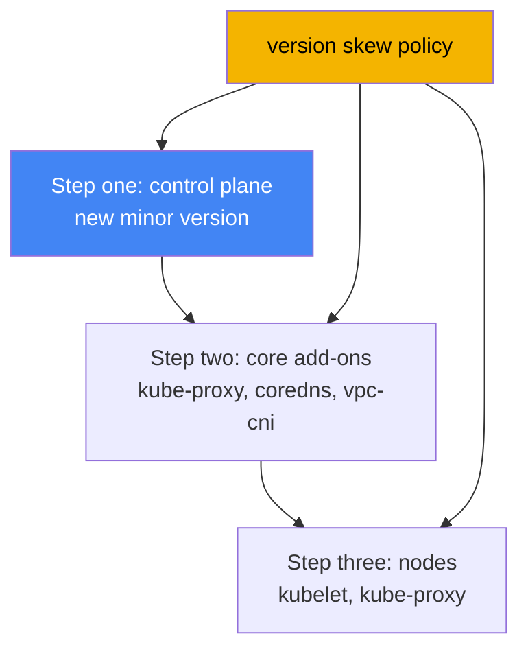

[Русская версия](ru.md) · [Versión en español](es.md) · [Version française](fr.md) · [Deutsche Version](de.md) · [ქართული ვერსია](ge.md) · [繁體中文版](tw.md) · [日本語版](jp.md)
# Chapter 37. EKS add-ons: managed add-ons versus Helm, versions, and upgrade order

> **What comes next.** This chapter opens Part 7, operating a cluster that has already been
> created and is running. The first operational question is who owns the lifecycle of system
> components and how to keep their versions aligned with the cluster version. This chapter covers
> add-ons and their versions. Related topics are covered in other chapters: the complete
> version-by-version cluster upgrade is Chapter 38, version rollback is Chapter 39, individual
> add-ons are covered in their respective chapters (VPC CNI, Chapter 8; EBS CSI, Chapter 23; Load
> Balancer Controller, Chapter 26; observability, Chapters 33-36), and add-on roles through IRSA
> and Pod Identity are Chapters 16 and 17.

## 37.1. "We upgraded the control plane, but CoreDNS stayed old"

An engineer upgraded the cluster version: the control plane moved to a new minor version, the
command completed without errors, and the console shows the new version. A day later, complaints
start arriving: some pods cannot resolve names, while network connectivity between Services is
breaking in some places. The on-call engineer checks what is running in `kube-system` and sees a
version mismatch:

```bash
kubectl get pods -n kube-system -o wide | grep -E "coredns|kube-proxy|aws-node"
# coredns    old-version image
# kube-proxy image, several minor versions behind the control plane
# aws-node   (VPC CNI) also at the previous version
```

The control plane moved ahead, while the system components on the nodes remained at the versions
with which the cluster lived before the upgrade. This is **version skew**: a version gap between
the control plane and data-plane components. kube-proxy and CoreDNS do not automatically follow
the control plane upgrade. Their versions must be upgraded separately to versions compatible with
the new minor release. Until that is done, behavior is unpredictable: DNS resolution, load
balancing through kube-proxy, and pod networking can fail partially and not immediately.

A second version of the same pain occurs even without an upgrade: a zoo of installation methods.
VPC CNI is installed as a managed add-on, someone reinstalled CoreDNS with a Helm chart,
kube-proxy was modified manually through `kubectl edit`, and metrics-server arrived as a separate
manifest. Versions drifted apart, and nobody on the team can confidently answer the question,
"who is responsible for updating this component?" During the next upgrade, this becomes a quest:
what to update with an AWS command, what through Helm, what manually, and in what order.

Both situations are about the same thing: cluster system components need a clear lifecycle owner
and a predictable upgrade order. This is exactly what EKS managed add-ons provide. Next, in
order: what a managed add-on is, which ones exist, how they differ from a Helm installation, how
configuration conflicts are resolved, how an add-on is granted AWS permissions, and how version
skew dictates the upgrade order.

## 37.2. What an EKS managed add-on is

An **EKS managed add-on** is an AWS-curated cluster system component whose installation and
upgrade are managed through the EKS API rather than Helm or raw manifests. AWS packages the
add-on, includes current security patches and fixes, tests it for compatibility with EKS
versions, and publishes a set of versions. The engineer does not pull a chart or track upstream;
they choose an add-on version from a validated list.

Management uses separate EKS API operations and their CLI wrappers:

```bash
# install an add-on at the required version
aws eks create-addon --cluster-name my-cluster --addon-name coredns \
  --addon-version v1.11.1-eksbuild.4
# upgrade to another version
aws eks update-addon --cluster-name my-cluster --addon-name coredns \
  --addon-version v1.11.3-eksbuild.1
# see what is installed and its status
aws eks describe-addon --cluster-name my-cluster --addon-name coredns
```

There are three key properties. First, **versions are tied to the cluster version**: AWS states
which Kubernetes minor releases each add-on version supports, so an add-on upgrade is not "take
the latest," but "take the version compatible with the current minor release." Second, **the
add-on is not upgraded automatically**: EKS does not change the add-on version when new releases
appear or when the cluster moves to a new minor version. An engineer always initiates the
upgrade. Third, **configuration can be declared declaratively** through the `configurationValues`
field, without editing manifests manually:

```bash
# provide add-on configuration as JSON (the structure depends on the add-on)
aws eks update-addon --cluster-name my-cluster --addon-name coredns \
  --configuration-values '{"replicaCount":3}'
# which keys this add-on version accepts
aws eks describe-addon-configuration --addon-name coredns \
  --addon-version v1.11.3-eksbuild.1
```



The idea is simple: the EKS API stands between the engineer and the component in the cluster. It
knows version compatibility, stores the selected configuration, and applies it predictably.

## 37.3. Which add-ons exist and what is installed by default

AWS-managed add-ons are divided by purpose. The main ones are below, with the names accepted by
`--addon-name`:

| Category | Add-ons | What it does |
|---|---|---|
| Networking (core) | `vpc-cni`, `kube-proxy` | Pod IP addresses through ENIs; Service rules on nodes |
| DNS (core) | `coredns` | in-cluster DNS resolution |
| Storage | `aws-ebs-csi-driver`, `aws-efs-csi-driver`, `aws-mountpoint-s3-csi-driver` | EBS, EFS, and S3 volumes |
| Observability | `amazon-cloudwatch-observability`, `adot` | metrics, logs, traces (Chapters 33-36) |
| Identity | `eks-pod-identity-agent` | Pod Identity agent (Chapter 17) |
| Other | `metrics-server`, `snapshot-controller` | metrics for HPA; CSI snapshots |

The three components `vpc-cni`, `kube-proxy`, and `coredns` are called **core add-ons**: without
them, the cluster does not function as a cluster (no pod network, no Service load balancing, no
DNS). EKS always installs them for every cluster; the only question is whether they are managed
or self-managed.

Exactly what arrives when a cluster is created depends on the tool. Through the AWS console, the
core components (`kube-proxy`, `vpc-cni`, `coredns`) are installed immediately as managed add-ons.
With `eksctl` without a configuration file (starting with version 0.184.0), the same three plus
`metrics-server` are installed, also as managed add-ons. With other tools or older `eksctl`, the
same three components are installed in self-managed form. You can keep managing them yourself or
move them to managed later. In EKS Auto Mode, some of these functions are built into the platform
itself and are not managed as ordinary add-ons.

## 37.4. Managed add-on versus self-managed (Helm or manifest)

Not everything is installed as a managed add-on. Many important components are available only as
a Helm chart or manifest: **AWS Load Balancer Controller** (Chapter 26), **external-dns** and
**cert-manager** (Chapter 29), and **Karpenter** (Chapter 12). You own their lifecycle entirely.
Core add-ons and several drivers, however, are available in both forms, and that choice should be
deliberate.

| Criterion | Managed add-on | Self-managed (Helm/manifest) |
|---|---|---|
| Upgrade owner | you initiate it, AWS applies it | entirely you |
| Version selection | AWS-curated list | any upstream version |
| Cluster compatibility | tested and stated by AWS | you verify it yourself |
| Configuration | `configurationValues` + cluster fields | chart values, full control |
| Conflict resolution | `resolveConflicts` in the API | Helm mechanisms |
| Fine-grained configuration flexibility | limited to managed fields | maximum |
| What is available | core, CSI, observability, and more | anything, including Helm-only components |

The practical selection rule is this: use what is available as a managed add-on and does not
require exotic configuration as managed. It means less manual work, stated compatibility, and a
predictable upgrade. Where you need a version or configuration absent from the curated set, or
the component is not released as an add-on at all, use Helm and take ownership of its lifecycle.
Mixing both methods for one component is precisely the zoo from Section 37.1 that should be
avoided.

## 37.5. Resolving conflicts: resolveConflicts and field ownership

A managed add-on applies configuration to the cluster through server-side apply and declares some
fields as its own (managed fields). If someone modified the same fields manually or through Helm,
a conflict occurs during create or update. The **`resolveConflicts`** field
(`--resolve-conflicts` flag) determines what happens next:

| Value | Behavior | When it is appropriate |
|---|---|---|
| `NONE` | the operation fails with an error on conflict | safe default; investigate manually |
| `OVERWRITE` | other changes are overwritten with EKS defaults | return the add-on to the reference state |
| `PRESERVE` | your field changes are retained | intentional customizations exist |

The logic is as follows. `NONE` does not silently break anything: on finding a conflict, EKS
returns an error with a description and you decide what to do. `OVERWRITE` says, "EKS is the
source of truth": all settings are returned to the add-on defaults and your manual changes are
lost. `PRESERVE` says, "my changes are intentional": EKS does not touch fields you configured
and applies everything else.

A common separate scenario is **moving something previously self-managed to managed**. You
installed CoreDNS with Helm, then decided to hand it to EKS through `create-addon`. Without
`--resolve-conflicts OVERWRITE`, installation fails on a conflict with existing objects. With
`OVERWRITE`, EKS takes ownership and returns configuration to its defaults. Therefore, custom
settings you need must be moved into `configurationValues` beforehand, or they will disappear.
The add-on field management documentation describes exactly which fields can be changed without
conflicting with managed fields.

## 37.6. Add-on permissions: IRSA or Pod Identity

Some add-ons need AWS permissions: VPC CNI configures network resources, EBS CSI creates and
attaches volumes, and ADOT sends telemetry. Permissions are granted not with keys, but with an
IAM role bound to the add-on ServiceAccount. The two mechanisms are covered in Chapters 16 and
17: **IRSA** (a role through an OIDC provider) and **EKS Pod Identity** (an association through
the agent). AWS recommends Pod Identity for add-ons, but IRSA is supported.

The convenience of a managed add-on is that the role or association can be specified directly in
the add-on operation, in one call, without separate manual steps:

```bash
# IRSA: specify the role ARN for the add-on service account
aws eks update-addon --cluster-name my-cluster --addon-name aws-ebs-csi-driver \
  --service-account-role-arn arn:aws:iam::111122223333:role/ebs-csi-role
# Pod Identity: create an association along with the add-on
aws eks update-addon --cluster-name my-cluster --addon-name aws-ebs-csi-driver \
  --pod-identity-associations 'serviceAccount=ebs-csi-controller-sa,roleArn=arn:aws:iam::111122223333:role/ebs-csi-role'
```

Several important details follow. The `requiresIamPermissions` flag in the output of
`describe-addon-versions` helps determine whether an add-on needs permissions at all, while
`describe-addon-configuration` shows the proposed policy. Pod Identity associations created
through the add-on API belong to the add-on: delete the add-on and its association is deleted too
(this can be prevented with the preserve option during deletion). If both
`serviceAccountRoleArn` (IRSA) and Pod Identity are configured for an add-on, and the Pod
Identity agent is installed, EKS uses Pod Identity and ignores IRSA. Updating associations on an
existing add-on restarts its pods.

## 37.7. Version skew and upgrade order

The Kubernetes **version skew policy** itself explains why everything broke in Section 37.1. It
sets how far component versions may diverge from the kube-apiserver version (that is, the control
plane). The main rule is that node components must not be newer than the API server and may lag by
only a limited number of minor versions.

| Component | Rule relative to kube-apiserver |
|---|---|
| kubelet | no newer than the API server; may lag by up to 3 minor versions (for 1.25+) |
| kube-proxy | no newer than the API server; may lag within the same limits |
| CoreDNS | not part of the version skew policy, but its version must be compatible with the minor release |

This has a direct operational consequence: upgrading a cluster is not one command, but a sequence
in the correct order. First, upgrade the **control plane** to the new minor version. Then upgrade
the **core add-ons** (`kube-proxy`, `coredns`, `vpc-cni`) to versions compatible with that minor
release. That is exactly the step forgotten in Section 37.1. Only then upgrade the **nodes**
(kubelet). This order keeps all versions within policy limits at every step. Chapter 38 covers
the complete upgrade process in detail.



Do not guess a compatible add-on version; ask the API. For a specified Kubernetes minor version,
`describe-addon-versions` returns the add-on version list, the `compatibilities` field with
`clusterVersion`, and the `defaultVersion` marker for the default recommendation:

```bash
# which coredns versions are compatible with cluster 1.33
aws eks describe-addon-versions --addon-name coredns --kubernetes-version 1.33 \
  --query 'addons[].addonVersions[].{Version:addonVersion,Default:compatibilities[0].defaultVersion}'
```

In practice during an upgrade, take a compatible version (usually `defaultVersion`) of every
core add-on from this output for the new minor version and upgrade them immediately after the
control plane, before rolling the nodes. Then version skew remains within limits and the symptoms
from Section 37.1 do not occur.

## 37.8. How this is used in production

- **Keep the core as managed add-ons, not manual installations.** `vpc-cni`, `kube-proxy`, and
  `coredns` under EKS management provide stated compatibility and predictable upgrades; do not
  create manual changes or parallel Helm installations for them.
- **Pin add-on versions explicitly; do not blindly take latest.** Before an upgrade, check
  `describe-addon-versions` for the required minor release and choose a compatible version,
  usually `defaultVersion`.
- **Keep configuration in `configurationValues`, not manual changes.** Then `resolveConflicts`
  is predictable, and moving a component to managed does not lose customizations.
- **Choose `resolveConflicts` deliberately.** Use `PRESERVE` where intentional changes exist;
  `OVERWRITE` when returning to the reference state or taking over a self-managed component; and
  `NONE` as the safe default so a conflict surfaces as an error rather than silently.
- **Grant add-ons permissions with a role through Pod Identity or IRSA (Chapters 16 and 17)**,
  specifying the association directly in the add-on operation rather than through separate manual
  steps.
- **Upgrade in version-skew order:** control plane, then core add-ons to compatible versions, then
  nodes (Chapter 38). Do not forget add-ons, or the mismatch will break networking and DNS.

## 37.9. Mini-glossary

- **EKS managed add-on**: an AWS-curated cluster component managed through the EKS API
  (`create-addon`, `update-addon`), with stated compatibility and AWS patches.
- **self-managed add-on**: a component installed with Helm or a manifest; its lifecycle and
  compatibility are entirely the engineer's responsibility.
- **core add-ons**: `vpc-cni`, `kube-proxy`, `coredns`, the required core installed for every
  cluster.
- **configurationValues**: an add-on field for declarative configuration without manually editing
  manifests.
- **resolveConflicts**: how an add-on handles field conflicts: `NONE`, `OVERWRITE`, or
  `PRESERVE`.
- **managed fields / server-side apply**: the mechanism by which an add-on declares and applies
  its fields; conflict resolution is based on it.
- **version skew**: a version gap between the control plane and node components, limited by the
  Kubernetes version skew policy.
- **describe-addon-versions**: an EKS API operation that returns add-on versions, their
  compatibility with a Kubernetes minor release, and `defaultVersion`.
- **Pod Identity association**: binding an add-on ServiceAccount to an IAM role; the recommended
  permission-granting method for add-ons (Chapter 17).

## 37.10. Chapter summary

- After a control plane upgrade, core add-ons (`kube-proxy`, `coredns`, `vpc-cni`) do not upgrade
  themselves; the missed step creates version skew and breaks DNS and pod networking.
- An EKS managed add-on is an AWS-curated component managed through the EKS API. AWS provides
  patches, tests compatibility, and publishes the version list.
- An add-on is not upgraded automatically (neither for new releases nor during a cluster
  upgrade). An engineer always initiates the upgrade; configuration is set through
  `configurationValues`.
- The core (`vpc-cni`, `kube-proxy`, `coredns`) is installed for every cluster; the console and
  current `eksctl` install it as managed, while other tools install it as self-managed.
- Some components are available only through Helm (Load Balancer Controller, external-dns,
  cert-manager, Karpenter); you own their lifecycle completely.
- `resolveConflicts` controls field conflicts: `NONE` (fail), `OVERWRITE` (EKS defaults), and
  `PRESERVE` (retain your changes). Moving self-managed to managed requires `OVERWRITE`.
- Add-on permissions are granted with a role through Pod Identity or IRSA (Chapters 16 and 17),
  specifying the association directly in the add-on operation. With both mechanisms configured
  and the agent installed, Pod Identity wins.
- The version skew policy dictates the upgrade order: control plane, then core add-ons to
  compatible versions (from `describe-addon-versions`), then nodes (Chapter 38).

## 37.11. How this helps in real work

When the symptom on call is "DNS or networking broke after an upgrade," first check not the
applications but `kube-system`: compare the versions of `coredns`, `kube-proxy`, and `aws-node`
with the cluster version. If the add-ons lag behind the control plane, upgrade them to compatible
versions. In most cases, that is the fix. Understanding that add-ons do not move with the control
plane automatically saves hours of guessing, "why did everything break after a successful
upgrade?"

When planning operations, decide two things. First, maintain an ownership registry: for every
system component, record whether it is managed or Helm and who owns its version, so the zoo does
not grow. Second, define an upgrade procedure: before upgrading a minor version, gather
compatible core add-on versions from `describe-addon-versions` and include their upgrade in the
control plane, add-ons, nodes sequence (Chapter 38). Then version skew never exceeds its limits,
and upgrades stop being a source of surprises.

## 37.12. Self-check questions

1. Why can CoreDNS and kube-proxy remain at old versions after a control plane upgrade, and what
   does that lead to?
2. What is an EKS managed add-on, and how does managing one differ from installing it with Helm?
3. Does a managed add-on upgrade automatically during a cluster upgrade? Who initiates the
   upgrade?
4. Which three components are called core add-ons, and what is installed by default when creating
   a cluster through the console and through `eksctl`?
5. Which components are available only through Helm, and why cannot they be used as managed
   add-ons?
6. What do the `resolveConflicts` values `NONE`, `OVERWRITE`, and `PRESERVE` do?
7. What happens when moving self-managed CoreDNS to managed without `--resolve-conflicts
   OVERWRITE`, and how can custom configuration be preserved?
8. How are AWS permissions granted to an add-on, and what wins if both IRSA and Pod Identity are
   configured?
9. Who owns a Pod Identity association created through the add-on API, and what happens to it
   when the add-on is deleted?
10. What does the version skew policy say about node components relative to kube-apiserver?
11. In what order are the control plane, core add-ons, and nodes upgraded, and why in that order?
12. How do you find an add-on version compatible with a specific Kubernetes minor release?

## Practice

The course lab for this topic: [Lab 113: Cluster upgrade and rollback: control plane, add-ons,
deprecated APIs](../../labs/113/README.MD). In addition, add-on state and versions are easy to
inspect on a live cluster. First, see what is installed as a managed add-on and its status:

```bash
# list the cluster's managed add-ons
aws eks list-addons --cluster-name my-cluster
# status, version, and role of a specific add-on
aws eks describe-addon --cluster-name my-cluster --addon-name coredns \
  --query 'addon.{Version:addonVersion,Status:status,Role:serviceAccountRoleArn}'
```

Then compare the versions of core components in the cluster with the cluster version itself and
with the add-on versions compatible with your minor release:

```bash
# cluster version
aws eks describe-cluster --cluster-name my-cluster --query 'cluster.version'
# images of core components actually running in kube-system
kubectl get pods -n kube-system -o wide | grep -E "coredns|kube-proxy|aws-node"
# compatible add-on versions for the cluster minor release (substitute yours)
aws eks describe-addon-versions --addon-name kube-proxy --kubernetes-version 1.33 \
  --query 'addons[].addonVersions[].{Version:addonVersion,Default:compatibilities[0].defaultVersion}'
```

Compare three things: the cluster version, the actual versions of `coredns`, `kube-proxy`, and
`aws-node` in pods, and the compatible set from `describe-addon-versions`. If core add-ons lag
behind the control plane, that is the version skew from Section 37.1, and the cluster upgrade in
Chapter 38 begins precisely by bringing add-ons to compatible versions.

---
[Table of contents](../README.md) · [Chapter 36](../36/en.md) · [Chapter 38](../38/en.md)
