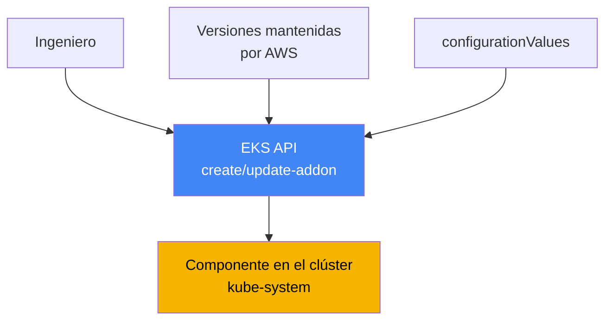
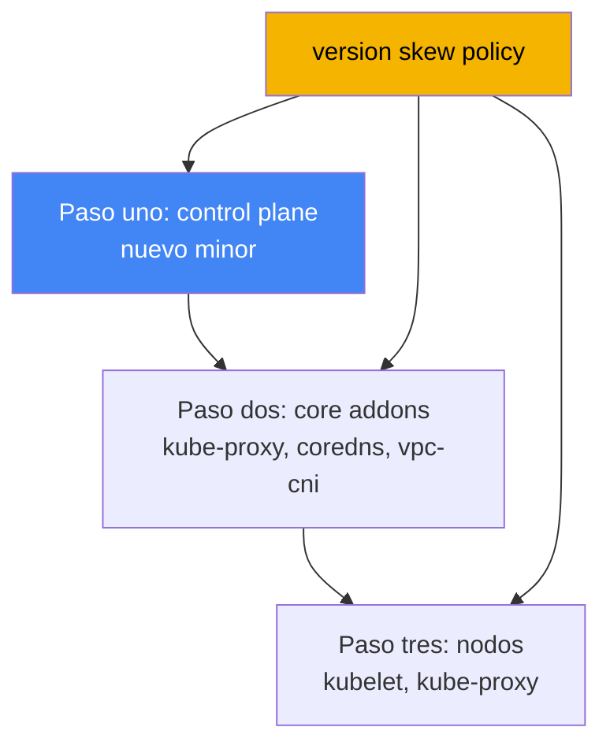

[Eng version](en.md) · [Русская версия](ru.md) · [Version française](fr.md) · [Deutsche Version](de.md) · [ქართული ვერსია](ge.md) · [繁體中文版](tw.md) · [日本語版](jp.md)
# Capítulo 37. Complementos de EKS: managed addons frente a Helm, versiones y orden de actualización

> **Qué sigue.** Este capítulo abre la parte 7: operar un clúster que ya está creado y en funcionamiento. La primera pregunta operativa es quién posee el ciclo de vida de los componentes del sistema y cómo mantener sus versiones alineadas con la versión del clúster. Aquí se aborda la gestión de complementos y sus versiones. Los temas relacionados se tratan en otros capítulos: la actualización completa del clúster por versiones, capítulo 38; la reversión de versión, capítulo 39; los complementos concretos se analizan en sus propios capítulos (VPC CNI, capítulo 8; EBS CSI, capítulo 23; Load Balancer Controller, capítulo 26; observabilidad, capítulos 33-36), y los roles para complementos mediante IRSA y Pod Identity, capítulos 16 y 17.

## 37.1. «Actualizamos el control plane, pero CoreDNS siguió siendo antiguo»

Un ingeniero actualizó la versión del clúster: el control plane pasó a un nuevo minor, el comando terminó sin errores y la consola muestra la nueva versión. Un día después empiezan las quejas: algunos pods no resuelven nombres, en otros lugares se rompe la red entre servicios. La persona de guardia mira qué hay en `kube-system` y encuentra un panorama desincronizado:

```bash
kubectl get pods -n kube-system -o wide | grep -E "coredns|kube-proxy|aws-node"
# coredns    imagen de una versión antigua
# kube-proxy imagen retrasada varios minors respecto al control plane
# aws-node   (VPC CNI) también en una versión anterior
```

El control plane avanzó, pero los componentes del sistema en los nodos se quedaron en las versiones con las que el clúster vivía antes de la actualización. Esto es **version skew**: una divergencia de versiones entre el control plane y los componentes de datos. kube-proxy y CoreDNS no se actualizan solos siguiendo al control plane: sus versiones deben elevarse por separado, y a versiones compatibles con el nuevo minor. Mientras no se haga, el comportamiento es impredecible: la resolución DNS, el balanceo mediante kube-proxy y la red de pods pueden fallar parcialmente y no de inmediato.

La segunda variante del mismo problema aparece incluso sin una actualización: un zoológico de métodos de instalación. VPC CNI se instaló como managed addon, alguien reinstaló CoreDNS con un chart de Helm, kube-proxy se modificó manualmente con `kubectl edit` y metrics-server llegó como un manifiesto independiente. Las versiones divergen y nadie en el equipo responde con seguridad a la pregunta «quién es responsable de actualizar este componente». En la siguiente actualización se convierte en una búsqueda: qué actualizar con un comando de AWS, qué mediante Helm, qué manualmente y en qué orden.

Ambas situaciones tratan de lo mismo: los componentes del sistema del clúster deben tener un propietario claro de su ciclo de vida y un orden de actualización predecible. Precisamente eso proporcionan los EKS managed addons. A continuación, en orden: qué es un managed addon, cuáles existen, en qué se diferencian de instalar con Helm, cómo se resuelven los conflictos de configuración, cómo se conceden permisos de AWS a un addon y cómo version skew dicta el orden de actualización.

## 37.2. Qué es un EKS managed addon

Un **EKS managed addon** (complemento administrado) es un componente del sistema del clúster mantenido por AWS cuya instalación y actualización se gestionan mediante la API de EKS, no mediante Helm o manifiestos sin procesar. AWS compila el addon, incluye parches de seguridad y correcciones recientes, prueba la compatibilidad con las versiones de EKS y publica un conjunto de versiones. El ingeniero no descarga un chart ni sigue el upstream: elige una versión del addon de una lista verificada.

La gestión se realiza mediante operaciones independientes de la API de EKS y sus envoltorios de CLI:

```bash
# instalar un addon de la versión requerida
aws eks create-addon --cluster-name my-cluster --addon-name coredns \
  --addon-version v1.11.1-eksbuild.4
# actualizar a otra versión
aws eks update-addon --cluster-name my-cluster --addon-name coredns \
  --addon-version v1.11.3-eksbuild.1
# ver qué está instalado y en qué estado
aws eks describe-addon --cluster-name my-cluster --addon-name coredns
```

Hay tres propiedades clave. La primera: las **versiones están vinculadas a la versión del clúster**. Para cada versión de addon, AWS indica con qué minors de Kubernetes es compatible; por eso actualizar un addon no es «tomar latest», sino «tomar la versión compatible con el minor actual». La segunda: el **addon no se actualiza automáticamente**. EKS no modifica la versión del addon ni cuando salen nuevos lanzamientos ni cuando se actualiza el clúster a un nuevo minor. La actualización siempre la inicia un ingeniero. La tercera: la **configuración se puede definir declarativamente** mediante el campo `configurationValues`, sin modificar manifiestos manualmente:

```bash
# pasar la configuración del addon como JSON (la estructura depende del addon)
aws eks update-addon --cluster-name my-cluster --addon-name coredns \
  --configuration-values '{"replicaCount":3}'
# qué claves acepta esta versión del addon
aws eks describe-addon-configuration --addon-name coredns \
  --addon-version v1.11.3-eksbuild.1
```



La idea es simple: entre el ingeniero y el componente del clúster se sitúa la API de EKS, que conoce la compatibilidad de versiones, almacena la configuración elegida y puede aplicarla de forma predecible.

## 37.3. Qué complementos hay y qué se instala de forma predeterminada

Los componentes que AWS ofrece como managed addons se dividen según su finalidad. A continuación se incluyen los principales, con los nombres que acepta `--addon-name`:

| Categoría | Addons | Qué hace |
|---|---|---|
| Red (core) | `vpc-cni`, `kube-proxy` | IP para pods mediante ENI; reglas de Service en los nodos |
| DNS (core) | `coredns` | resolución DNS dentro del clúster |
| Almacenamiento | `aws-ebs-csi-driver`, `aws-efs-csi-driver`, `aws-mountpoint-s3-csi-driver` | volúmenes EBS, EFS, S3 |
| Observabilidad | `amazon-cloudwatch-observability`, `adot` | métricas, logs, trazas (capítulos 33-36) |
| Identidad | `eks-pod-identity-agent` | agente Pod Identity (capítulo 17) |
| Otros | `metrics-server`, `snapshot-controller` | métricas para HPA; snapshots CSI |

Los tres componentes `vpc-cni`, `kube-proxy` y `coredns` se denominan **core addons**: sin ellos el clúster no funciona como un clúster (no hay red de pods, balanceo de Service ni DNS). EKS los instala siempre para cada clúster; la única cuestión es si serán managed o self-managed.

Lo que llega exactamente al crear el clúster depende de la herramienta. Mediante la consola de AWS, el núcleo (`kube-proxy`, `vpc-cni`, `coredns`) se instala de inmediato como managed addons. Con `eksctl` sin archivo de configuración (a partir de la versión 0.184.0), se instalan los mismos tres más `metrics-server`, también como managed. Con otras herramientas o con versiones más antiguas de `eksctl`, esos tres componentes se instalan como self-managed: puede mantenerlos usted mismo o pasarlos después a managed. En EKS Auto Mode, parte de estas funciones está integrada en la propia plataforma y no se gestiona como addons habituales.

## 37.4. Managed addon frente a self-managed (Helm o manifiesto)

No todo se instala como managed addon. Muchos componentes importantes solo están disponibles como chart de Helm o manifiesto: **AWS Load Balancer Controller** (capítulo 26), **external-dns** y **cert-manager** (capítulo 29), **Karpenter** (capítulo 12). Para ellos, el ciclo de vida recae por completo en usted. En cambio, los core addons y varios controladores están disponibles en ambas formas, y aquí la elección es deliberada.

| Criterio | Managed addon | Self-managed (Helm/manifiesto) |
|---|---|---|
| Propietario de la actualización | usted la inicia, AWS la aplica | completamente usted |
| Elección de versiones | lista mantenida por AWS | cualquier versión del upstream |
| Compatibilidad con el clúster | comprobada y declarada por AWS | la comprueba usted mismo |
| Configuración | `configurationValues` + campos del clúster | values del chart, control completo |
| Resolución de conflictos | `resolveConflicts` en la API | mecanismos de Helm |
| Flexibilidad de ajuste fino | limitada a campos administrados | máxima |
| Qué está disponible | núcleo, CSI, observabilidad y más | cualquier cosa, incluidos los que solo usan Helm |

La regla de elección es práctica: lo que existe como managed addon y no requiere una configuración exótica se toma como managed: menos trabajo manual, compatibilidad declarada y una actualización predecible. Cuando se necesita una versión o configuración que no existe en el conjunto mantenido, o el componente no se publica como addon, se usa Helm y se asume el ciclo de vida. Mezclar ambos métodos para el mismo componente es precisamente el zoológico de la sección 37.1 que se debe evitar.

## 37.5. Resolución de conflictos: resolveConflicts y propiedad de campos

Un managed addon aplica la configuración en el clúster mediante server-side apply y declara como propios algunos campos (managed fields). Si alguien modificó esos mismos campos manualmente o con Helm, se produce un conflicto durante create/update. El campo **`resolveConflicts`** (la opción `--resolve-conflicts`) define cómo tratarlo:

| Valor | Comportamiento | Cuándo conviene |
|---|---|---|
| `NONE` | la operación falla con un error ante un conflicto | valor predeterminado seguro, resolver manualmente |
| `OVERWRITE` | los cambios ajenos se sobrescriben con los valores predeterminados de EKS | devolver el addon al estándar |
| `PRESERVE` | se conservan sus cambios de campos | hay personalizaciones intencionales |

La lógica es la siguiente. `NONE` no rompe nada en silencio: al detectar un conflicto, EKS devuelve un error con una descripción, y usted decide. `OVERWRITE` dice «la fuente de verdad es EKS»: toda la configuración se lleva a los valores predeterminados del addon y se pierden sus cambios manuales. `PRESERVE` dice «mis cambios son intencionales»: EKS no modifica los campos que usted configuró y aplica el resto.

Un escenario independiente y frecuente es la **migración a managed de algo que antes era self-managed**. Instaló CoreDNS con Helm y luego decidió entregarlo a EKS mediante `create-addon`. Si no indica `--resolve-conflicts OVERWRITE`, la instalación fallará por un conflicto con los objetos existentes. Con `OVERWRITE`, EKS tomará la propiedad y llevará la configuración a sus valores predeterminados, por lo que las configuraciones personalizadas que necesite deben trasladarse de antemano a `configurationValues`; de lo contrario, se perderán. La documentación de field management para addons describe qué campos se pueden modificar sin entrar en conflicto con los administrados.

## 37.6. Permisos para el addon: IRSA o Pod Identity

Algunos addons necesitan permisos en AWS: VPC CNI configura recursos de red, EBS CSI crea y adjunta volúmenes, ADOT envía telemetría. Los permisos no se conceden con claves, sino con un rol de IAM vinculado al ServiceAccount del addon. Los dos mecanismos se analizan en los capítulos 16 y 17: **IRSA** (rol mediante proveedor OIDC) y **EKS Pod Identity** (asociación mediante agente). AWS recomienda Pod Identity para los addons, pero IRSA es compatible.

La comodidad del managed addon es que se puede especificar el rol o la asociación directamente en la operación del addon, en una sola llamada y sin pasos manuales independientes:

```bash
# IRSA: indicar el ARN del rol para el service account del addon
aws eks update-addon --cluster-name my-cluster --addon-name aws-ebs-csi-driver \
  --service-account-role-arn arn:aws:iam::111122223333:role/ebs-csi-role
# Pod Identity: crear una asociación junto con el addon
aws eks update-addon --cluster-name my-cluster --addon-name aws-ebs-csi-driver \
  --pod-identity-associations 'serviceAccount=ebs-csi-controller-sa,roleArn=arn:aws:iam::111122223333:role/ebs-csi-role'
```

Varios detalles importantes. El indicador `requiresIamPermissions` de la salida de `describe-addon-versions` ayuda a saber si un addon necesita permisos, y `describe-addon-configuration` muestra la política propuesta. Las asociaciones de Pod Identity creadas mediante la API del addon pertenecen al addon: si elimina el addon, también se elimina la asociación (esto se puede evitar con la opción preserve al eliminar). Si un addon tiene definidos `serviceAccountRoleArn` (IRSA) y Pod Identity, y el agente Pod Identity está instalado, EKS usa Pod Identity e ignora IRSA. Actualizar las asociaciones de un addon existente provoca el reinicio de sus pods.

## 37.7. Version skew y orden de actualización

Por qué todo falló en la sección 37.1 lo explica la propia **version skew policy** de Kubernetes. Define cuánto pueden diferir las versiones de los componentes respecto a la versión de kube-apiserver (es decir, el control plane). La regla principal es que los componentes de los nodos no deben ser más nuevos que el API server y solo pueden retrasarse un número limitado de minors.

| Componente | Regla respecto a kube-apiserver |
|---|---|
| kubelet | no más reciente que el API server; retraso de hasta 3 minors (para 1.25+) |
| kube-proxy | no más reciente que el API server; retraso dentro de los mismos límites |
| CoreDNS | no forma parte de version skew policy, pero su versión debe ser compatible con el minor |

De ello se desprende una consecuencia directa para las operaciones: actualizar el clúster no es un solo comando, sino una secuencia en el orden correcto. Primero se eleva el **control plane** al nuevo minor. Después se actualizan los **core addons** (`kube-proxy`, `coredns`, `vpc-cni`) a versiones compatibles con ese minor: precisamente este paso se olvidó en la sección 37.1. Solo entonces se actualizan los **nodos** (kubelet). Este orden mantiene todas las versiones dentro de los límites de la policy en cada paso. El proceso completo de actualización se detalla en el capítulo 38.



La versión compatible del addon no se adivina: se consulta a la API. `describe-addon-versions` para un minor de Kubernetes determinado devuelve la lista de versiones del addon, el campo `compatibilities` con `clusterVersion` y la marca `defaultVersion`, la recomendada de forma predeterminada:

```bash
# qué versiones de coredns son compatibles con el clúster 1.33
aws eks describe-addon-versions --addon-name coredns --kubernetes-version 1.33 \
  --query 'addons[].addonVersions[].{Version:addonVersion,Default:compatibilities[0].defaultVersion}'
```

La práctica durante una actualización es tomar, para el nuevo minor, una versión compatible (normalmente `defaultVersion`) de la salida para cada core addon y actualizarlos inmediatamente después del control plane, antes del recambio de nodos. Así, version skew no sale de los límites y no aparecen los síntomas de la sección 37.1.

## 37.8. Cómo se aplica en producción

- **Mantenga el núcleo como managed addons, no manualmente.** `vpc-cni`, `kube-proxy` y `coredns` bajo gestión de EKS proporcionan compatibilidad declarada y una actualización predecible; no se hacen cambios manuales ni se usa Helm en paralelo para ellos.
- **Fije explícitamente las versiones de addon; no tome latest a ciegas.** Antes de actualizar, compruebe `describe-addon-versions` para el minor requerido y elija una versión compatible, normalmente `defaultVersion`.
- **Mantenga la configuración en `configurationValues`, no en cambios manuales.** Así, `resolveConflicts` es predecible y migrar un componente a managed no pierde las personalizaciones.
- **Elija `resolveConflicts` conscientemente.** Use `PRESERVE` donde existan cambios intencionales; `OVERWRITE` al volver al estándar y al asumir un componente self-managed; `NONE` como valor predeterminado seguro para que el conflicto aparezca como error y no en silencio.
- **Conceda a los addons roles mediante Pod Identity o IRSA (capítulos 16 y 17)**, definiendo la asociación directamente en la operación del addon, no mediante pasos manuales independientes.
- **Siga el orden de actualización de version skew:** control plane, después core addons a versiones compatibles y luego nodos (capítulo 38). No olvide los addons: de lo contrario, la desincronización rompe la red y DNS.

## 37.9. Mini glosario

- **EKS managed addon**: componente del clúster mantenido por AWS, gestionado mediante la API de EKS (`create-addon`, `update-addon`) con compatibilidad declarada y parches de AWS.
- **self-managed addon**: componente instalado mediante Helm o manifiesto; el ciclo de vida y la compatibilidad recaen por completo en el ingeniero.
- **core addons**: `vpc-cni`, `kube-proxy`, `coredns`; el núcleo obligatorio que se instala para cada clúster.
- **configurationValues**: campo del addon para configuración declarativa sin modificar manualmente los manifiestos.
- **resolveConflicts**: cómo trata el addon los conflictos de campos: `NONE`, `OVERWRITE`, `PRESERVE`.
- **managed fields / server-side apply**: mecanismo por el que el addon declara y aplica sus campos; en él se basa la resolución de conflictos.
- **version skew**: divergencia de versiones entre el control plane y los componentes de los nodos; la limita la version skew policy de Kubernetes.
- **describe-addon-versions**: operación de la API de EKS: versiones del addon, su compatibilidad con el minor de Kubernetes y `defaultVersion`.
- **Pod Identity association**: vínculo entre el ServiceAccount del addon y un rol de IAM; para addons, la forma recomendada de conceder permisos (capítulo 17).

## 37.10. Resumen del capítulo

- Tras actualizar el control plane, los core addons (`kube-proxy`, `coredns`, `vpc-cni`) no se actualizan solos; olvidar este paso provoca version skew y rompe DNS y la red de pods.
- Un EKS managed addon es un componente mantenido por AWS, gestionado mediante la API de EKS; AWS proporciona parches, prueba la compatibilidad y publica la lista de versiones.
- El addon no se actualiza automáticamente (ni con nuevos lanzamientos ni con una actualización del clúster): un ingeniero siempre inicia la actualización; la configuración se define mediante `configurationValues`.
- El núcleo (`vpc-cni`, `kube-proxy`, `coredns`) se instala para cada clúster; la consola y `eksctl` reciente lo instalan como managed, mientras que otras herramientas lo hacen como self-managed.
- Algunos componentes solo están disponibles como Helm (Load Balancer Controller, external-dns, cert-manager, Karpenter); para ellos, el ciclo de vida recae por completo en usted.
- `resolveConflicts` gestiona los conflictos de campos: `NONE` (fallar), `OVERWRITE` (valores predeterminados de EKS), `PRESERVE` (conservar sus cambios); migrar de self-managed a managed requiere `OVERWRITE`.
- Los permisos de addon se conceden con un rol mediante Pod Identity o IRSA (capítulos 16 y 17), definiendo la asociación directamente en la operación del addon; si existen ambos métodos y el agente está instalado, gana Pod Identity.
- Version skew policy dicta el orden de actualización: control plane, después core addons a versiones compatibles (según `describe-addon-versions`) y luego nodos (capítulo 38).

## 37.11. Cómo será útil en el trabajo real

Durante una guardia, ante el síntoma «después de una actualización falló DNS o la red», lo primero que se comprueba no son las aplicaciones, sino `kube-system`: se comparan las versiones de `coredns`, `kube-proxy` y `aws-node` con la versión del clúster. Si los addons se retrasaron respecto al control plane, se elevan a versiones compatibles y, en la mayoría de los casos, esa es la solución. Entender que los addons no viajan automáticamente con el control plane ahorra horas de adivinar «por qué todo se rompió después de una actualización exitosa».

Al planificar las operaciones se deciden dos cosas. La primera es un registro de propiedad: para cada componente del sistema, dejar fijado si es managed o Helm y quién responde por su versión, para no crear un zoológico. La segunda es un procedimiento de actualización: antes de actualizar el minor, recopilar mediante `describe-addon-versions` las versiones compatibles de los core addons e integrar su actualización en la secuencia control plane, addons y nodos (capítulo 38). Así, version skew nunca sale de los límites y las actualizaciones dejan de ser una fuente de sorpresas.

## 37.12. Preguntas de autoevaluación

1. ¿Por qué CoreDNS y kube-proxy pueden permanecer en versiones antiguas tras actualizar el control plane y a qué conduce esto?
2. ¿Qué es un EKS managed addon y en qué se diferencia gestionarlo de instalarlo con Helm?
3. ¿Se actualiza automáticamente un managed addon al actualizar el clúster? ¿Quién inicia la actualización?
4. ¿Qué tres componentes se denominan core addons y qué se instala de forma predeterminada al crear un clúster mediante la consola y mediante `eksctl`?
5. ¿Qué componentes solo están disponibles como Helm y por qué no se pueden obtener como managed addon?
6. ¿Qué hacen los valores `resolveConflicts`: `NONE`, `OVERWRITE`, `PRESERVE`?
7. ¿Qué sucede al migrar un CoreDNS self-managed a managed sin `--resolve-conflicts OVERWRITE` y cómo se evita perder la configuración personalizada?
8. ¿Cómo se conceden permisos de AWS a un addon y qué gana si están definidos IRSA y Pod Identity?
9. ¿A quién pertenece una Pod Identity association creada mediante la API del addon y qué ocurre con ella al eliminar el addon?
10. ¿Qué dice version skew policy sobre los componentes de los nodos respecto a kube-apiserver?
11. ¿En qué orden se actualizan control plane, core addons y nodos, y por qué precisamente así?
12. ¿Cómo se conoce la versión de addon compatible con un minor concreto de Kubernetes?

## Práctica

El laboratorio del curso para este tema: [laboratorio 113: actualización y reversión del clúster: control plane, addons, API obsoletas](../../labs/113/README_ES.MD). Además, el estado de los addons y sus versiones se puede consultar fácilmente en un clúster activo. Primero observe qué está instalado como managed addon y en qué estado:

```bash
# lista de managed addons del clúster
aws eks list-addons --cluster-name my-cluster
# estado, versión y rol de un addon concreto
aws eks describe-addon --cluster-name my-cluster --addon-name coredns \
  --query 'addon.{Version:addonVersion,Status:status,Role:serviceAccountRoleArn}'
```

Después, compare las versiones de los componentes core del clúster con la versión del propio clúster y con qué versiones de addon son compatibles con su minor:

```bash
# versión del clúster
aws eks describe-cluster --cluster-name my-cluster --query 'cluster.version'
# imágenes de los componentes core que realmente se ejecutan en kube-system
kubectl get pods -n kube-system -o wide | grep -E "coredns|kube-proxy|aws-node"
# versiones de addon compatibles con el minor del clúster (sustituya por el suyo)
aws eks describe-addon-versions --addon-name kube-proxy --kubernetes-version 1.33 \
  --query 'addons[].addonVersions[].{Version:addonVersion,Default:compatibilities[0].defaultVersion}'
```

Compare tres cosas: la versión del clúster, las versiones reales de `coredns`, `kube-proxy` y `aws-node` en los pods, y el conjunto compatible de `describe-addon-versions`. Si los core addons se retrasaron respecto al control plane, se trata exactamente del version skew de la sección 37.1, y la actualización del clúster del capítulo 38 comenzará precisamente por llevar los addons a versiones compatibles.

---
[Índice](../README_ES.md) · [Capítulo 36](../36/es.md) · [Capítulo 38](../38/es.md)
