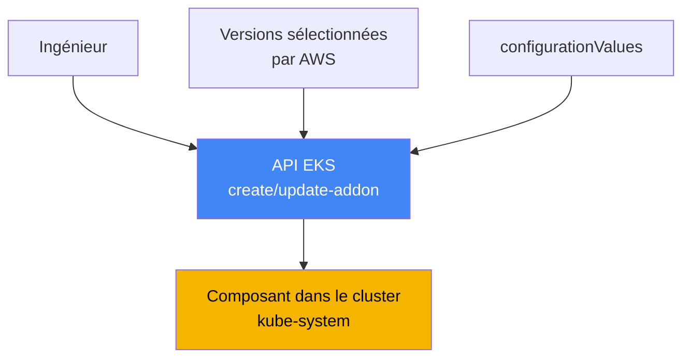
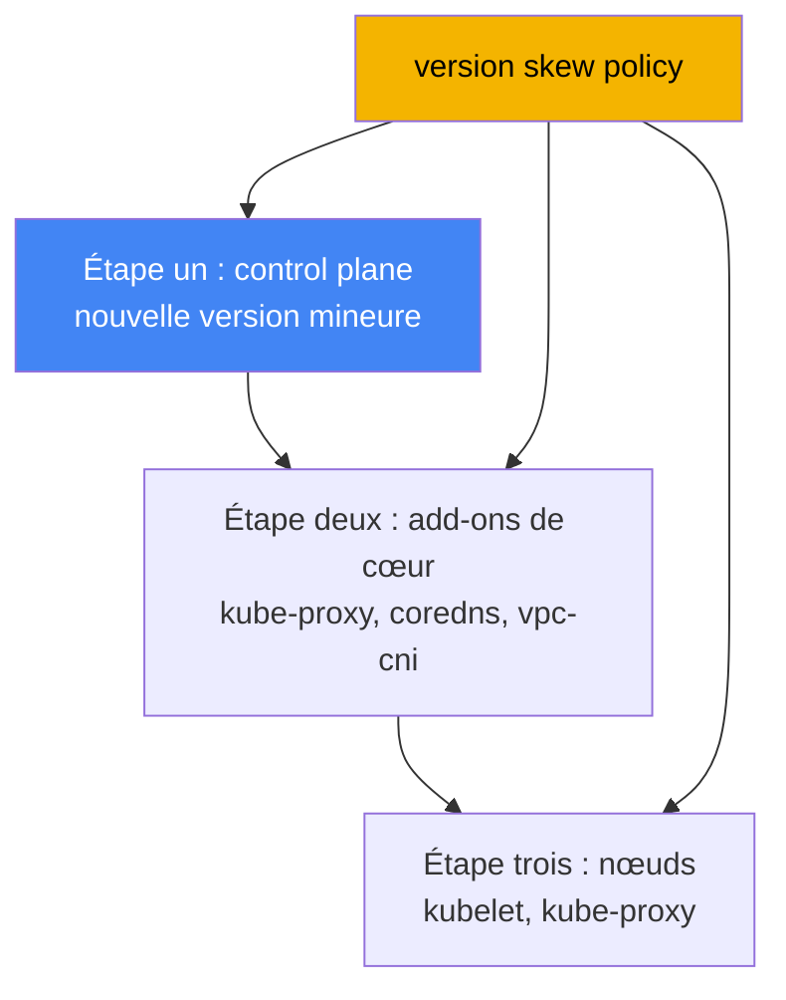

[Eng version](en.md) · [Versión en español](es.md) · [Русская версия](ru.md) · [Deutsche Version](de.md) · [ქართული ვერსია](ge.md) · [繁體中文版](tw.md) · [日本語版](jp.md)
# Chapitre 37. Add-ons EKS : add-ons gérés contre Helm, versions et ordre de mise à niveau

> **La suite.** Ce chapitre ouvre la partie 7, l’exploitation d’un cluster déjà créé et en cours
> d’exécution. La première question opérationnelle est de savoir qui possède le cycle de vie des
> composants système et comment aligner leurs versions sur celle du cluster. Ce chapitre traite
> des add-ons et de leurs versions. Les sujets connexes sont couverts dans d’autres chapitres : la
> mise à niveau complète du cluster, version par version, au chapitre 38, le retour à une version
> antérieure au chapitre 39, les add-ons individuels dans leurs chapitres respectifs (VPC CNI au
> chapitre 8, EBS CSI au chapitre 23, Load Balancer Controller au chapitre 26, l’observabilité aux
> chapitres 33 à 36), et les rôles d’add-ons via IRSA et Pod Identity aux chapitres 16 et 17.

## 37.1. « Nous avons mis à niveau le control plane, mais CoreDNS est resté ancien »

Un ingénieur a mis à niveau la version du cluster : le control plane est passé à une nouvelle
version mineure, la commande s’est terminée sans erreur et la console affiche la nouvelle
version. Un jour plus tard, les plaintes commencent à arriver : certains pods ne peuvent pas
résoudre les noms, tandis que la connectivité réseau entre les Services se rompt par endroits.
L’ingénieur d’astreinte examine ce qui s’exécute dans `kube-system` et constate un décalage de
versions :

```bash
kubectl get pods -n kube-system -o wide | grep -E "coredns|kube-proxy|aws-node"
# coredns    image d’une ancienne version
# kube-proxy image, plusieurs versions mineures de retard sur le control plane
# aws-node   (VPC CNI) également à la version précédente
```

Le control plane a progressé, tandis que les composants système sur les nœuds sont restés aux
versions avec lesquelles le cluster fonctionnait avant la mise à niveau. Il s’agit de **version
skew** : un écart de versions entre le control plane et les composants du plan de données.
kube-proxy et CoreDNS ne suivent pas automatiquement la mise à niveau du control plane. Leurs
versions doivent être mises à niveau séparément vers des versions compatibles avec la nouvelle
version mineure. Tant que cela n’est pas fait, le comportement est imprévisible : la résolution
DNS, l’équilibrage de charge via kube-proxy et le réseau des pods peuvent échouer partiellement
et pas immédiatement.

Une deuxième variante du même problème survient même sans mise à niveau : un zoo de méthodes
d’installation. VPC CNI est installé comme add-on géré, quelqu’un a réinstallé CoreDNS avec un
chart Helm, kube-proxy a été modifié manuellement avec `kubectl edit`, et metrics-server est
arrivé sous la forme d’un manifeste séparé. Les versions divergent et personne dans l’équipe ne
peut répondre avec assurance à la question : « qui est responsable de la mise à niveau de ce
composant ? » Lors de la prochaine mise à niveau, cela devient une quête : que mettre à niveau
avec une commande AWS, que faire via Helm, que faire manuellement, et dans quel ordre.

Les deux situations ont la même cause : les composants système du cluster ont besoin d’un
propriétaire clair de leur cycle de vie et d’un ordre de mise à niveau prévisible. C’est
exactement ce que fournissent les add-ons gérés EKS. Nous verrons ensuite, dans l’ordre, ce
qu’est un add-on géré, lesquels existent, en quoi ils diffèrent d’une installation avec Helm,
comment les conflits de configuration sont résolus, comment un add-on reçoit des autorisations
AWS et comment le version skew impose l’ordre de mise à niveau.

## 37.2. Qu’est-ce qu’un add-on géré EKS

Un **add-on géré EKS** est un composant système de cluster sélectionné par AWS, dont
l’installation et la mise à niveau sont gérées par l’API EKS plutôt que par Helm ou des
manifestes bruts. AWS empaquette l’add-on, y inclut les correctifs de sécurité et les corrections
récentes, teste sa compatibilité avec les versions d’EKS et publie un ensemble de versions.
L’ingénieur ne télécharge pas de chart et ne suit pas l’amont : il choisit une version d’add-on
dans une liste validée.

La gestion utilise des opérations distinctes de l’API EKS et leurs wrappers CLI :

```bash
# installer un add-on à la version requise
aws eks create-addon --cluster-name my-cluster --addon-name coredns \
  --addon-version v1.11.1-eksbuild.4
# mettre à niveau vers une autre version
aws eks update-addon --cluster-name my-cluster --addon-name coredns \
  --addon-version v1.11.3-eksbuild.1
# voir ce qui est installé et son statut
aws eks describe-addon --cluster-name my-cluster --addon-name coredns
```

Il existe trois propriétés clés. Premièrement, **les versions sont liées à la version du
cluster** : AWS indique les versions mineures de Kubernetes prises en charge par chaque version
d’add-on ; une mise à niveau d’add-on ne consiste donc pas à « prendre la dernière version »,
mais à « prendre la version compatible avec la version mineure actuelle ». Deuxièmement,
**l’add-on n’est pas mis à niveau automatiquement** : EKS ne modifie pas la version de l’add-on
lorsque de nouvelles versions paraissent ni lorsque le cluster passe à une nouvelle version
mineure. Un ingénieur initie toujours la mise à niveau. Troisièmement, **la configuration peut
être définie déclarativement** par le champ `configurationValues`, sans modifier les manifestes
manuellement :

```bash
# fournir la configuration de l’add-on en JSON (la structure dépend de l’add-on)
aws eks update-addon --cluster-name my-cluster --addon-name coredns \
  --configuration-values '{"replicaCount":3}'
# quelles clés cette version d’add-on accepte
aws eks describe-addon-configuration --addon-name coredns \
  --addon-version v1.11.3-eksbuild.1
```



L’idée est simple : l’API EKS se place entre l’ingénieur et le composant du cluster. Elle connaît
la compatibilité des versions, stocke la configuration sélectionnée et l’applique de manière
prévisible.

## 37.3. Quels add-ons existent et ce qui est installé par défaut

Les add-ons gérés par AWS sont répartis selon leur objectif. Les principaux sont ci-dessous,
avec les noms acceptés par `--addon-name` :

| Catégorie | Add-ons | Fonction |
|---|---|---|
| Réseau (cœur) | `vpc-cni`, `kube-proxy` | adresses IP des pods via les ENI ; règles Service sur les nœuds |
| DNS (cœur) | `coredns` | résolution DNS au sein du cluster |
| Stockage | `aws-ebs-csi-driver`, `aws-efs-csi-driver`, `aws-mountpoint-s3-csi-driver` | volumes EBS, EFS et S3 |
| Observabilité | `amazon-cloudwatch-observability`, `adot` | métriques, logs, traces (chapitres 33 à 36) |
| Identité | `eks-pod-identity-agent` | agent Pod Identity (chapitre 17) |
| Autres | `metrics-server`, `snapshot-controller` | métriques pour HPA ; snapshots CSI |

Les trois composants `vpc-cni`, `kube-proxy` et `coredns` sont appelés **add-ons de cœur** : sans
ces derniers, le cluster ne fonctionne pas comme un cluster (pas de réseau de pods, pas
d’équilibrage de charge Service, pas de DNS). EKS les installe toujours pour chaque cluster ; la
seule question est de savoir s’ils sont gérés ou autogérés.

Ce qui est installé exactement lors de la création d’un cluster dépend de l’outil. Dans la
console AWS, les composants de cœur (`kube-proxy`, `vpc-cni`, `coredns`) sont immédiatement
installés comme add-ons gérés. Avec `eksctl` sans fichier de configuration (à partir de la
version 0.184.0), les trois mêmes composants plus `metrics-server` sont installés, également
comme add-ons gérés. Avec d’autres outils ou une version plus ancienne de `eksctl`, les trois
mêmes composants sont installés sous forme autogérée. Vous pouvez continuer à les gérer
autonomement ou les passer ultérieurement au mode géré. Dans EKS Auto Mode, certaines de ces
fonctions sont intégrées à la plateforme elle-même et ne sont pas gérées comme des add-ons
ordinaires.

## 37.4. Add-on géré contre autogéré (Helm ou manifeste)

Tout n’est pas installé comme add-on géré. De nombreux composants importants sont disponibles
uniquement sous forme de chart Helm ou de manifeste : **AWS Load Balancer Controller** (chapitre
26), **external-dns** et **cert-manager** (chapitre 29), et **Karpenter** (chapitre 12). Vous
possédez entièrement leur cycle de vie. Les add-ons de cœur et plusieurs pilotes, en revanche,
sont disponibles sous les deux formes, et ce choix doit être délibéré.

| Critère | Add-on géré | Autogéré (Helm/manifeste) |
|---|---|---|
| Propriétaire de la mise à niveau | vous l’initiez, AWS l’applique | entièrement vous |
| Sélection des versions | liste sélectionnée par AWS | toute version amont |
| Compatibilité avec le cluster | testée et déclarée par AWS | vous la vérifiez vous-même |
| Configuration | `configurationValues` + champs du cluster | valeurs du chart, contrôle total |
| Résolution des conflits | `resolveConflicts` dans l’API | mécanismes Helm |
| Flexibilité de configuration fine | limitée aux champs gérés | maximale |
| Ce qui est disponible | cœur, CSI, observabilité, etc. | tout, y compris les composants exclusivement Helm |

La règle de sélection pratique est la suivante : utilisez en mode géré ce qui est disponible comme
add-on géré et ne requiert pas de configuration exotique. Cela implique moins de travail manuel,
une compatibilité déclarée et une mise à niveau prévisible. Lorsqu’une version ou une
configuration absente de l’ensemble sélectionné est nécessaire, ou que le composant n’est pas du
tout publié comme add-on, utilisez Helm et assumez la responsabilité de son cycle de vie. Mélanger
les deux méthodes pour un même composant est précisément le zoo de la section 37.1 qu’il faut
éviter.

## 37.5. Résoudre les conflits : resolveConflicts et propriété des champs

Un add-on géré applique sa configuration au cluster via server-side apply et déclare certains
champs comme siens (managed fields). Si quelqu’un a modifié les mêmes champs manuellement ou via
Helm, un conflit survient lors de la création ou de la mise à jour. Le champ
**`resolveConflicts`** (indicateur `--resolve-conflicts`) détermine alors ce qui se produit :

| Valeur | Comportement | Cas approprié |
|---|---|---|
| `NONE` | l’opération échoue avec une erreur en cas de conflit | valeur par défaut sûre ; examiner manuellement |
| `OVERWRITE` | les autres modifications sont écrasées par les valeurs par défaut EKS | remettre l’add-on dans l’état de référence |
| `PRESERVE` | vos modifications de champs sont conservées | des personnalisations intentionnelles existent |

La logique est la suivante. `NONE` ne casse rien silencieusement : lorsqu’EKS rencontre un
conflit, il renvoie une erreur avec une description et vous décidez quoi faire. `OVERWRITE`
affirme : « EKS est la source de vérité » ; tous les paramètres reviennent aux valeurs par défaut
de l’add-on et vos modifications manuelles sont perdues. `PRESERVE` affirme : « mes
modifications sont intentionnelles » ; EKS ne touche pas aux champs que vous avez configurés et
applique tout le reste.

Un scénario distinct courant consiste à **passer en mode géré un composant auparavant
autogéré**. Vous avez installé CoreDNS avec Helm, puis décidez de le confier à EKS via
`create-addon`. Sans `--resolve-conflicts OVERWRITE`, l’installation échoue en raison d’un
conflit avec les objets existants. Avec `OVERWRITE`, EKS prend possession du composant et remet
la configuration à ses valeurs par défaut. Les paramètres personnalisés dont vous avez besoin
doivent donc être déplacés au préalable vers `configurationValues`, sinon ils disparaîtront. La
documentation sur la gestion des champs des add-ons indique précisément quels champs peuvent être
modifiés sans entrer en conflit avec les champs gérés.

## 37.6. Autorisations de l’add-on : IRSA ou Pod Identity

Certains add-ons ont besoin d’autorisations AWS : VPC CNI configure des ressources réseau, EBS
CSI crée et attache des volumes, et ADOT envoie la télémétrie. Les autorisations ne sont pas
accordées avec des clés, mais avec un rôle IAM lié au ServiceAccount de l’add-on. Les deux
mécanismes sont traités aux chapitres 16 et 17 : **IRSA** (un rôle via un fournisseur OIDC) et
**EKS Pod Identity** (une association via l’agent). AWS recommande Pod Identity pour les
add-ons, mais IRSA est pris en charge.

L’avantage d’un add-on géré est que le rôle ou l’association peut être spécifié directement dans
l’opération d’add-on, en un seul appel, sans étapes manuelles distinctes :

```bash
# IRSA : indiquer l’ARN du rôle pour le service account de l’add-on
aws eks update-addon --cluster-name my-cluster --addon-name aws-ebs-csi-driver \
  --service-account-role-arn arn:aws:iam::111122223333:role/ebs-csi-role
# Pod Identity : créer une association avec l’add-on
aws eks update-addon --cluster-name my-cluster --addon-name aws-ebs-csi-driver \
  --pod-identity-associations 'serviceAccount=ebs-csi-controller-sa,roleArn=arn:aws:iam::111122223333:role/ebs-csi-role'
```

Plusieurs détails importants suivent. L’indicateur `requiresIamPermissions` dans la sortie de
`describe-addon-versions` aide à déterminer si un add-on a besoin d’autorisations, tandis que
`describe-addon-configuration` affiche la politique proposée. Les associations Pod Identity
créées via l’API d’add-on appartiennent à l’add-on : supprimer l’add-on supprime aussi son
association (cela peut être empêché avec l’option preserve lors de la suppression). Si
`serviceAccountRoleArn` (IRSA) et Pod Identity sont tous deux configurés pour un add-on, et que
l’agent Pod Identity est installé, EKS utilise Pod Identity et ignore IRSA. Mettre à jour les
associations d’un add-on existant redémarre ses pods.

## 37.7. Version skew et ordre de mise à niveau

La **version skew policy** de Kubernetes elle-même explique pourquoi tout s’est rompu dans la
section 37.1. Elle définit à quel point les versions des composants peuvent diverger de celle de
kube-apiserver (c’est-à-dire le control plane). La règle principale est que les composants des
nœuds ne doivent pas être plus récents que le serveur d’API et ne peuvent avoir qu’un nombre
limité de versions mineures de retard.

| Composant | Règle par rapport à kube-apiserver |
|---|---|
| kubelet | pas plus récent que le serveur d’API ; peut avoir jusqu’à 3 versions mineures de retard (pour 1.25+) |
| kube-proxy | pas plus récent que le serveur d’API ; peut avoir le même retard maximal |
| CoreDNS | ne fait pas partie de la version skew policy, mais sa version doit être compatible avec la version mineure |

La conséquence opérationnelle est directe : la mise à niveau d’un cluster n’est pas une seule
commande, mais une séquence dans le bon ordre. Mettez d’abord à niveau le **control plane** vers
la nouvelle version mineure. Mettez ensuite à niveau les **add-ons de cœur** (`kube-proxy`,
`coredns`, `vpc-cni`) vers des versions compatibles avec cette version mineure. C’est exactement
l’étape oubliée dans la section 37.1. Mettez seulement alors à niveau les **nœuds** (kubelet).
Cet ordre maintient toutes les versions dans les limites de la policy à chaque étape. Le chapitre
38 couvre en détail le processus complet de mise à niveau.



Ne devinez pas une version d’add-on compatible : interrogez l’API. Pour une version mineure
Kubernetes donnée, `describe-addon-versions` renvoie la liste des versions d’add-on, le champ
`compatibilities` avec `clusterVersion`, et le marqueur `defaultVersion` correspondant à la
recommandation par défaut :

```bash
# quelles versions de coredns sont compatibles avec le cluster 1.33
aws eks describe-addon-versions --addon-name coredns --kubernetes-version 1.33 \
  --query 'addons[].addonVersions[].{Version:addonVersion,Default:compatibilities[0].defaultVersion}'
```

En pratique, lors d’une mise à niveau, prenez dans cette sortie une version compatible
(généralement `defaultVersion`) de chaque add-on de cœur pour la nouvelle version mineure et
mettez-les à niveau immédiatement après le control plane, avant le roulement des nœuds. Le
version skew reste alors dans les limites et les symptômes de la section 37.1 n’apparaissent pas.

## 37.8. Utilisation en production

- **Conservez le cœur sous forme d’add-ons gérés, et non d’installations manuelles.** `vpc-cni`,
  `kube-proxy` et `coredns` sous gestion EKS fournissent une compatibilité déclarée et des mises
  à niveau prévisibles ; ne créez pas de modifications manuelles ni d’installations Helm
  parallèles pour ceux-ci.
- **Épinglez explicitement les versions d’add-ons ; ne prenez pas latest aveuglément.** Avant
  une mise à niveau, vérifiez `describe-addon-versions` pour la version mineure requise et
  choisissez une version compatible, généralement `defaultVersion`.
- **Conservez la configuration dans `configurationValues`, et non dans des modifications
  manuelles.** Ainsi, `resolveConflicts` est prévisible et le passage d’un composant au mode
  géré ne perd pas les personnalisations.
- **Choisissez `resolveConflicts` délibérément.** Utilisez `PRESERVE` lorsqu’il existe des
  modifications intentionnelles ; `OVERWRITE` pour revenir à l’état de référence ou reprendre
  un composant autogéré ; et `NONE` comme valeur par défaut sûre, afin qu’un conflit apparaisse
  comme une erreur plutôt que silencieusement.
- **Accordez aux add-ons des autorisations avec un rôle via Pod Identity ou IRSA (chapitres 16 et
  17)**, en spécifiant l’association directement dans l’opération d’add-on plutôt que par des
  étapes manuelles distinctes.
- **Mettez à niveau dans l’ordre du version skew :** control plane, puis add-ons de cœur vers des
  versions compatibles, puis nœuds (chapitre 38). N’oubliez pas les add-ons, sinon le décalage
  rompra le réseau et le DNS.

## 37.9. Mini-glossaire

- **add-on géré EKS** : composant de cluster sélectionné par AWS, géré via l’API EKS
  (`create-addon`, `update-addon`), avec compatibilité déclarée et correctifs AWS.
- **add-on autogéré** : composant installé avec Helm ou un manifeste ; son cycle de vie et sa
  compatibilité relèvent entièrement de l’ingénieur.
- **add-ons de cœur** : `vpc-cni`, `kube-proxy`, `coredns`, le cœur obligatoire installé pour
  chaque cluster.
- **configurationValues** : champ d’add-on permettant une configuration déclarative sans
  modifier manuellement les manifestes.
- **resolveConflicts** : manière dont un add-on traite les conflits de champs : `NONE`,
  `OVERWRITE` ou `PRESERVE`.
- **managed fields / server-side apply** : mécanisme par lequel un add-on déclare et applique ses
  champs ; la résolution des conflits s’appuie sur ce mécanisme.
- **version skew** : écart de versions entre le control plane et les composants des nœuds,
  limité par la version skew policy de Kubernetes.
- **describe-addon-versions** : opération de l’API EKS qui renvoie les versions d’add-on, leur
  compatibilité avec une version mineure Kubernetes et `defaultVersion`.
- **association Pod Identity** : liaison entre le ServiceAccount d’un add-on et un rôle IAM ;
  méthode recommandée pour accorder des autorisations aux add-ons (chapitre 17).

## 37.10. Résumé du chapitre

- Après une mise à niveau du control plane, les add-ons de cœur (`kube-proxy`, `coredns`,
  `vpc-cni`) ne se mettent pas à niveau eux-mêmes ; l’étape oubliée crée un version skew et
  rompt le DNS et le réseau des pods.
- Un add-on géré EKS est un composant sélectionné par AWS et géré via l’API EKS. AWS fournit les
  correctifs, teste la compatibilité et publie la liste des versions.
- Un add-on n’est pas mis à niveau automatiquement, ni lors de nouvelles versions ni lors d’une
  mise à niveau du cluster. Un ingénieur initie toujours la mise à niveau ; la configuration est
  définie via `configurationValues`.
- Le cœur (`vpc-cni`, `kube-proxy`, `coredns`) est installé pour chaque cluster ; la console et
  `eksctl` actuel l’installent en mode géré, tandis que les autres outils l’installent en mode
  autogéré.
- Certains composants sont disponibles uniquement via Helm (Load Balancer Controller,
  external-dns, cert-manager, Karpenter) ; vous possédez entièrement leur cycle de vie.
- `resolveConflicts` contrôle les conflits de champs : `NONE` (échec), `OVERWRITE` (valeurs par
  défaut EKS) et `PRESERVE` (conserver vos modifications). Passer du mode autogéré au mode géré
  requiert `OVERWRITE`.
- Les autorisations d’add-on sont accordées avec un rôle via Pod Identity ou IRSA (chapitres 16
  et 17), en spécifiant l’association directement dans l’opération d’add-on. Lorsque les deux
  mécanismes sont configurés et que l’agent est installé, Pod Identity l’emporte.
- La version skew policy impose l’ordre de mise à niveau : control plane, puis add-ons de cœur
  vers des versions compatibles (depuis `describe-addon-versions`), puis nœuds (chapitre 38).

## 37.11. Utilité dans le travail réel

Lorsqu’en astreinte le symptôme est « le DNS ou le réseau s’est rompu après une mise à niveau »,
vérifiez d’abord non pas les applications, mais `kube-system` : comparez les versions de
`coredns`, `kube-proxy` et `aws-node` avec la version du cluster. Si les add-ons sont en retard
sur le control plane, mettez-les à niveau vers des versions compatibles. Dans la plupart des cas,
c’est la correction. Comprendre que les add-ons ne suivent pas automatiquement le control plane
économise des heures à se demander : « pourquoi tout s’est-il rompu après une mise à niveau
réussie ? »

Lors de la planification de l’exploitation, décidez deux choses. Premièrement, maintenez un
registre de propriété : pour chaque composant système, consignez s’il est géré ou installé via
Helm, et qui possède sa version, afin que le zoo ne grandisse pas. Deuxièmement, définissez une
procédure de mise à niveau : avant de mettre à niveau une version mineure, collectez les versions
compatibles des add-ons de cœur à partir de `describe-addon-versions` et incluez leur mise à
niveau dans la séquence control plane, add-ons, nœuds (chapitre 38). Ainsi, le version skew ne
dépasse jamais ses limites et les mises à niveau cessent d’être une source de surprises.

## 37.12. Questions d’auto-évaluation

1. Pourquoi CoreDNS et kube-proxy peuvent-ils rester à d’anciennes versions après une mise à
   niveau du control plane, et à quoi cela conduit-il ?
2. Qu’est-ce qu’un add-on géré EKS, et en quoi sa gestion diffère-t-elle d’une installation avec
   Helm ?
3. Un add-on géré se met-il automatiquement à niveau lors d’une mise à niveau du cluster ? Qui
   initie la mise à niveau ?
4. Quels trois composants sont appelés add-ons de cœur, et qu’est-ce qui est installé par défaut
   lors de la création d’un cluster via la console et via `eksctl` ?
5. Quels composants sont disponibles uniquement via Helm, et pourquoi ne peuvent-ils pas être
   utilisés comme add-ons gérés ?
6. Que font les valeurs `resolveConflicts` `NONE`, `OVERWRITE` et `PRESERVE` ?
7. Que se passe-t-il lors du passage de CoreDNS autogéré au mode géré sans `--resolve-conflicts
   OVERWRITE`, et comment préserver la configuration personnalisée ?
8. Comment les autorisations AWS sont-elles accordées à un add-on, et quel mécanisme l’emporte
   si IRSA et Pod Identity sont tous deux configurés ?
9. À qui appartient une association Pod Identity créée par l’API d’add-on, et que lui arrive-t-il
   lorsque l’add-on est supprimé ?
10. Que dit la version skew policy sur les composants des nœuds par rapport à kube-apiserver ?
11. Dans quel ordre le control plane, les add-ons de cœur et les nœuds sont-ils mis à niveau, et
   pourquoi dans cet ordre ?
12. Comment trouver une version d’add-on compatible avec une version mineure Kubernetes donnée ?

## Pratique

Le laboratoire du cours pour ce sujet : [laboratoire 113 : mise à niveau et retour à une version
antérieure du cluster : control plane, add-ons, API obsolètes](../../labs/113/README_FR.MD). De
plus, l’état et les versions des add-ons sont faciles à inspecter sur un cluster actif. Examinez
d’abord ce qui est installé comme add-on géré et son statut :

```bash
# lister les add-ons gérés du cluster
aws eks list-addons --cluster-name my-cluster
# statut, version et rôle d’un add-on précis
aws eks describe-addon --cluster-name my-cluster --addon-name coredns \
  --query 'addon.{Version:addonVersion,Status:status,Role:serviceAccountRoleArn}'
```

Comparez ensuite les versions des composants de cœur du cluster avec la version du cluster
lui-même et avec les versions d’add-ons compatibles avec votre version mineure :

```bash
# version du cluster
aws eks describe-cluster --cluster-name my-cluster --query 'cluster.version'
# images des composants de cœur effectivement exécutés dans kube-system
kubectl get pods -n kube-system -o wide | grep -E "coredns|kube-proxy|aws-node"
# versions d’add-on compatibles avec la version mineure du cluster (remplacez par la vôtre)
aws eks describe-addon-versions --addon-name kube-proxy --kubernetes-version 1.33 \
  --query 'addons[].addonVersions[].{Version:addonVersion,Default:compatibilities[0].defaultVersion}'
```

Comparez trois éléments : la version du cluster, les versions réelles de `coredns`, `kube-proxy`
et `aws-node` dans les pods, et l’ensemble compatible fourni par `describe-addon-versions`. Si
les add-ons de cœur sont en retard sur le control plane, il s’agit du version skew de la section
37.1, et la mise à niveau du cluster au chapitre 38 commence précisément par ramener les
add-ons à des versions compatibles.

---
[Table des matières](../README_FR.md) · [Chapitre 36](../36/fr.md) · [Chapitre 38](../38/fr.md)
