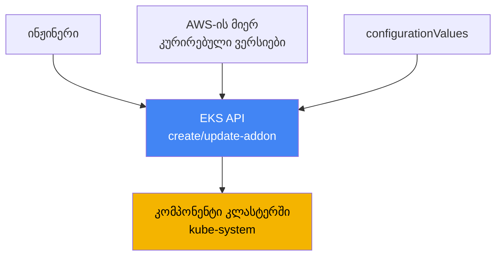
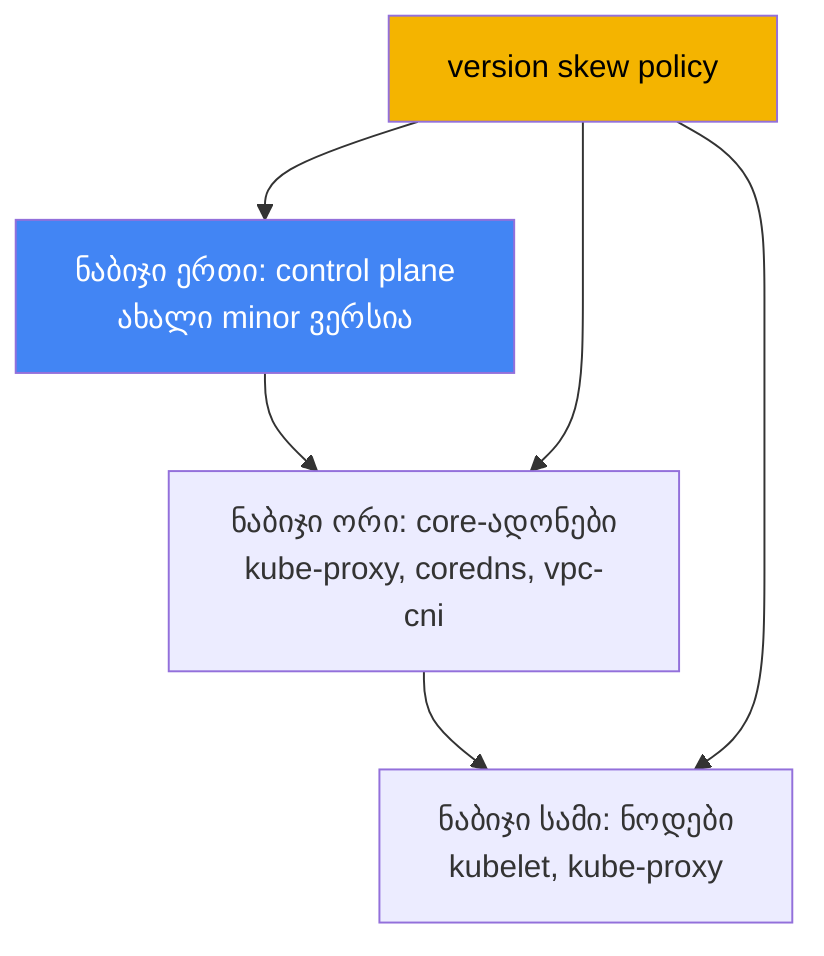

[Русская версия](ru.md) · [Eng version](en.md) · [Versión en español](es.md) · [Version française](fr.md) · [Deutsche Version](de.md) · [繁體中文版](tw.md) · [日本語版](jp.md)
# თავი 37. EKS-ის ადონები: managed addons და Helm, ვერსიები და განახლების თანმიმდევრობა

> **რა არის შემდეგ.** ამ თავით იწყება მე-7 ნაწილი - უკვე შექმნილი და მოქმედი კლასტერის
> ექსპლუატაცია. ექსპლუატაციის პირველი საკითხია: ვინ მართავს სისტემური კომპონენტების სასიცოცხლო
> ციკლს და როგორ შევინარჩუნოთ მათი ვერსიები კლასტერის ვერსიასთან თანხვედრაში. აქ განვიხილავთ
> ადონებისა და მათი ვერსიების მართვას. მომიჯნავე თემები სხვა თავებშია: კლასტერის სრული განახლება
> ვერსიების მიხედვით - თავი 38, ვერსიის უკან დაბრუნება - თავი 39, კონკრეტული ადონები კი საკუთარ
> თავებშია განხილული (VPC CNI - თავი 8, EBS CSI - თავი 23, Load Balancer Controller - თავი 26,
> დაკვირვებადობა - თავები 33-36), ხოლო ადონების როლები IRSA-სა და Pod Identity-ის საშუალებით -
> თავები 16 და 17.

## 37.1. „control plane განვაახლეთ, CoreDNS კი ძველ ვერსიაზე დარჩა“

ინჟინერმა კლასტერის ვერსია განაახლა: control plane ახალ minor ვერსიაზე გადავიდა, ბრძანება
შეცდომების გარეშე დასრულდა და კონსოლი ახალ ვერსიას აჩვენებს. ერთი დღის შემდეგ საჩივრები იწყება:
პოდების ნაწილი სახელებს ვერ არეზოლვებს, ზოგან სერვისებს შორის ქსელური კავშირი წყდება. მორიგე
ამოწმებს, რა მუშაობს `kube-system`-ში, და ვერსიების აცდენას ხედავს:

```bash
kubectl get pods -n kube-system -o wide | grep -E "coredns|kube-proxy|aws-node"
# coredns    ძველი ვერსიის image
# kube-proxy image, რომელიც control plane-ს რამდენიმე minor ვერსიით ჩამორჩება
# aws-node   (VPC CNI) ასევე ძველ ვერსიაზეა
```

Control plane წინ წავიდა, ნოდებზე არსებული სისტემური კომპონენტები კი იმ ვერსიებზე დარჩა,
რომლებზეც კლასტერი განახლებამდე მუშაობდა. ეს არის **version skew**: ვერსიების სხვაობა control
plane-სა და მონაცემთა სიბრტყის კომპონენტებს შორის. kube-proxy და CoreDNS control plane-თან ერთად
თავისით არ ახლდება - მათი ვერსიები ცალკე, ახალ minor ვერსიასთან თავსებად დონემდე უნდა განახლდეს.
სანამ ეს არ გაკეთდება, ქცევა არაპროგნოზირებადია: DNS-რეზოლვინგი, kube-proxy-ის საშუალებით
დაბალანსება და პოდების ქსელი შეიძლება ნაწილობრივ და დაგვიანებით გაფუჭდეს.

იმავე პრობლემის მეორე ვარიანტი განახლების გარეშეც გვხვდება - ინსტალაციის მეთოდების ზოოპარკი.
VPC CNI დაყენებულია როგორც managed addon, CoreDNS ვიღაცამ Helm chart-ით თავიდან დააყენა,
kube-proxy ხელით, `kubectl edit`-ით შეცვალეს, metrics-server კი ცალკე manifest-ით მოვიდა.
ვერსიები ერთმანეთს ასცდა, ხოლო კითხვაზე „ვინ აგებს პასუხს ამ კომპონენტის განახლებაზე“ გუნდში
დარწმუნებით ვერავინ პასუხობს. მომდევნო განახლებისას ეს თავსატეხად იქცევა: რა უნდა განახლდეს AWS-ის
ბრძანებით, რა Helm-ით, რა ხელით და რა თანმიმდევრობით.

ორივე სიტუაციის არსი ერთია: კლასტერის სისტემურ კომპონენტებს სასიცოცხლო ციკლის მკაფიო მფლობელი და
განახლების პროგნოზირებადი თანმიმდევრობა უნდა ჰქონდეს. სწორედ ამას გვაძლევს EKS managed addons.
შემდეგ თანმიმდევრულად განვიხილავთ, რა არის managed addon, რომელი ადონები არსებობს, რით განსხვავდება
ისინი Helm-ით ინსტალაციისგან, როგორ გვარდება კონფიგურაციის კონფლიქტები, როგორ იღებს ადონი AWS-ში
უფლებებს და როგორ განსაზღვრავს version skew განახლების თანმიმდევრობას.

## 37.2. რა არის EKS managed addon

**EKS managed addon** (მართული ადონი) არის AWS-ის მიერ კურირებული კლასტერის სისტემური კომპონენტი,
რომლის ინსტალაცია და განახლება EKS API-ის საშუალებით იმართება და არა Helm-ით ან შიშველი
manifest-ებით. AWS ადონს აწყობს, მასში უსაფრთხოების ახალ პატჩებსა და შესწორებებს რთავს, EKS-ის
ვერსიებთან თავსებადობას ამოწმებს და ვერსიების ნაკრებს აქვეყნებს. ინჟინერი chart-ს არ ჩამოტვირთავს
და upstream-ს არ ადევნებს თვალს - ის ადონის ვერსიას შემოწმებული სიიდან ირჩევს.

მართვა EKS API-ის ცალკე ოპერაციებითა და CLI-ში მათი გარსებით ხდება:

```bash
# საჭირო ვერსიის ადონის დაყენება
aws eks create-addon --cluster-name my-cluster --addon-name coredns \
  --addon-version v1.11.1-eksbuild.4
# სხვა ვერსიამდე განახლება
aws eks update-addon --cluster-name my-cluster --addon-name coredns \
  --addon-version v1.11.3-eksbuild.1
# დაყენებული ვერსიისა და სტატუსის ნახვა
aws eks describe-addon --cluster-name my-cluster --addon-name coredns
```

სამი ძირითადი თვისება არსებობს. პირველი - **ვერსიები კლასტერის ვერსიასთანაა მიბმული**: ადონის
თითოეული ვერსიისთვის AWS უთითებს, Kubernetes-ის რომელ minor ვერსიებთანაა ის თავსებადი, ამიტომ
ადონის განახლება ნიშნავს არა „latest-ის აღებას“, არამედ „მიმდინარე minor ვერსიასთან თავსებადი
ვერსიის აღებას“. მეორე - **ადონი ავტომატურად არ ახლდება**: EKS ადონის ვერსიას არც ახალი რელიზების
გამოსვლისას და არც კლასტერის ახალ minor ვერსიაზე განახლებისას ეხება. განახლებას ყოველთვის
ინჟინერი იწყებს. მესამე - **პარამეტრები შეიძლება დეკლარაციულად განისაზღვროს**
`configurationValues` ველის მეშვეობით, manifest-ების ხელით შეცვლის გარეშე:

```bash
# ადონის პარამეტრების JSON-ის სახით გადაცემა (სტრუქტურა ადონზეა დამოკიდებული)
aws eks update-addon --cluster-name my-cluster --addon-name coredns \
  --configuration-values '{"replicaCount":3}'
# მოცემული ვერსიის ადონის მიერ მხარდაჭერილი გასაღებები
aws eks describe-addon-configuration --addon-name coredns \
  --addon-version v1.11.3-eksbuild.1
```



აზრი მარტივია: ინჟინერსა და კლასტერში არსებულ კომპონენტს შორის დგება EKS API, რომელმაც იცის
ვერსიების თავსებადობა, ინახავს არჩეულ კონფიგურაციას და მისი პროგნოზირებადად გამოყენება შეუძლია.

## 37.3. რომელი ადონები არსებობს და რა ყენდება ნაგულისხმევად

კომპონენტები, რომლებსაც AWS managed addons-ის სახით გვთავაზობს, დანიშნულების მიხედვით იყოფა.
ქვემოთ ძირითადი ადონებია იმ სახელებით, რომლებსაც `--addon-name` იღებს:

| კატეგორია | ადონები | რას აკეთებს |
|---|---|---|
| ქსელი (core) | `vpc-cni`, `kube-proxy` | პოდებისთვის IP-ები ENI-ის საშუალებით; Service-ის წესები ნოდებზე |
| DNS (core) | `coredns` | კლასტერის შიდა DNS-რეზოლვინგი |
| საცავი | `aws-ebs-csi-driver`, `aws-efs-csi-driver`, `aws-mountpoint-s3-csi-driver` | EBS, EFS, S3 ტომები |
| დაკვირვებადობა | `amazon-cloudwatch-observability`, `adot` | მეტრიკები, ლოგები, ტრეისები (თავები 33-36) |
| იდენტობა | `eks-pod-identity-agent` | Pod Identity-ის აგენტი (თავი 17) |
| სხვა | `metrics-server`, `snapshot-controller` | მეტრიკები HPA-სთვის; CSI snapshot-ები |

სამ კომპონენტს - `vpc-cni`, `kube-proxy`, `coredns` - **core-ადონებს** უწოდებენ: მათ გარეშე
კლასტერი კლასტერივით ვერ მუშაობს (არ არის პოდების ქსელი, Service-ის დაბალანსება და DNS). EKS მათ
ყოველი კლასტერისთვის ყოველთვის აყენებს; საკითხავი მხოლოდ ისაა, managed იქნება ისინი თუ
self-managed.

კონკრეტულად რა მოჰყვება კლასტერის შექმნას, გამოყენებულ ხელსაწყოზეა დამოკიდებული. AWS-ის
კონსოლით შექმნისას ბირთვი (`kube-proxy`, `vpc-cni`, `coredns`) თავიდანვე managed addons-ის სახით
ყენდება. `eksctl`-ის კონფიგურაციის ფაილის გარეშე გამოყენებისას (0.184.0 ვერსიიდან მოყოლებული)
იგივე სამი კომპონენტი და დამატებით `metrics-server` ყენდება, ასევე managed სახით. სხვა
ხელსაწყოებით ან `eksctl`-ის უფრო ძველი ვერსიით იგივე სამი კომპონენტი self-managed სახით ყენდება -
შეგიძლიათ თავად მართოთ ან მოგვიანებით managed რეჟიმში გადაიყვანოთ. EKS Auto Mode-ში ამ
ფუნქციების ნაწილი უშუალოდ პლატფორმაშია ჩაშენებული და ჩვეულებრივი ადონების სახით არ იმართება.

## 37.4. Managed addon და self-managed (Helm ან manifest)

ყველაფერი managed addon-ის სახით არ ყენდება. ბევრი მნიშვნელოვანი კომპონენტი მხოლოდ Helm chart-ის
ან manifest-ის სახითაა ხელმისაწვდომი: **AWS Load Balancer Controller** (თავი 26),
**external-dns** და **cert-manager** (თავი 29), **Karpenter** (თავი 12). მათი სასიცოცხლო ციკლი
მთლიანად თქვენზეა. core-ადონებისა და ზოგიერთი დრაივერისთვის კი ორივე ვარიანტი არსებობს და არჩევანი
გააზრებულად უნდა გაკეთდეს.

| კრიტერიუმი | Managed addon | Self-managed (Helm/manifest) |
|---|---|---|
| განახლების მფლობელი | თქვენ იწყებთ, AWS იყენებს | მთლიანად თქვენ |
| ვერსიების არჩევა | AWS-ის კურირებული სია | ნებისმიერი upstream ვერსია |
| კლასტერთან თავსებადობა | AWS-ის მიერ შემოწმებული და დადასტურებული | თავად ამოწმებთ |
| კონფიგურაცია | `configurationValues` + ველები კლასტერში | chart-ის values, სრული კონტროლი |
| კონფლიქტების მოგვარება | `resolveConflicts` API-ში | Helm-ის საშუალებებით |
| დეტალური კონფიგურაციის მოქნილობა | მართული ველებით შეზღუდული | მაქსიმალური |
| რა არის ხელმისაწვდომი | ბირთვი, CSI, დაკვირვებადობა და სხვა | ყველაფერი, მათ შორის მხოლოდ Helm-ით ხელმისაწვდომი |

არჩევის პრაქტიკული წესი ასეთია: ის, რაც managed addon-ის სახით არსებობს და უჩვეულო
კონფიგურაციას არ მოითხოვს, managed სახით უნდა ავიღოთ - ნაკლები ხელით სამუშაო, დადასტურებული
თავსებადობა და პროგნოზირებადი განახლება. თუ საჭიროა ვერსია ან კონფიგურაცია, რომელიც კურირებულ
ნაკრებში არ არის, ან კომპონენტი საერთოდ არ გამოდის ადონის სახით, იყენებენ Helm-ს და სასიცოცხლო
ციკლს საკუთარ თავზე იღებენ. ერთი კომპონენტისთვის ორივე მეთოდის შერევა სწორედ 37.1 განყოფილებაში
აღწერილ ზოოპარკს ქმნის, რომელსაც უნდა მოვერიდოთ.

## 37.5. კონფლიქტების მოგვარება: resolveConflicts და ველების მფლობელობა

Managed addon კონფიგურაციას კლასტერში server-side apply მექანიზმით იყენებს და ველების ნაწილს
საკუთრად აცხადებს (managed fields). თუ ვინმემ იგივე ველები ხელით ან Helm-ით შეცვალა,
create/update ოპერაციისას კონფლიქტი წარმოიქმნება. ასეთ შემთხვევაში ქცევას
**`resolveConflicts`** ველი (`--resolve-conflicts` ალამი) განსაზღვრავს:

| მნიშვნელობა | ქცევა | როდის არის მიზანშეწონილი |
|---|---|---|
| `NONE` | კონფლიქტისას ოპერაცია შეცდომით სრულდება | უსაფრთხო ნაგულისხმევი ვარიანტი, ხელით გასარჩევად |
| `OVERWRITE` | სხვისი ცვლილებები EKS-ის ნაგულისხმევი მნიშვნელობებით გადაიწერება | ადონის ეტალონურ მდგომარეობაში დასაბრუნებლად |
| `PRESERVE` | ველებში თქვენი ცვლილებები შენარჩუნდება | განზრახული ინდივიდუალური პარამეტრების არსებობისას |

ლოგიკა ასეთია. `NONE` არაფერს აფუჭებს ჩუმად: კონფლიქტის აღმოჩენისას EKS აღწერილობით შეცდომას
აბრუნებს და გადაწყვეტილებას თავად იღებთ. `OVERWRITE` ამბობს „ჭეშმარიტების წყარო EKS-ია“: ყველა
პარამეტრი ადონის ნაგულისხმევ მნიშვნელობებზე გადადის და ხელით შეტანილი ცვლილებები იკარგება.
`PRESERVE` ამბობს „ჩემი ცვლილებები განზრახულია“: EKS თქვენ მიერ გამართულ ველებს არ ეხება და
დანარჩენს იყენებს.

ცალკე გავრცელებული სცენარია **ადრე self-managed სახით არსებული კომპონენტის managed რეჟიმში
გადაყვანა**. CoreDNS Helm-ით დააყენეთ, შემდეგ კი `create-addon`-ის საშუალებით EKS-ის მართვის ქვეშ
გადაცემა გადაწყვიტეთ. თუ `--resolve-conflicts OVERWRITE` არ მიუთითეთ, ინსტალაცია უკვე არსებულ
ობიექტებთან კონფლიქტის გამო დასრულდება შეცდომით. `OVERWRITE`-ის შემთხვევაში EKS მფლობელობას
აიღებს და კონფიგურაციას საკუთარ ნაგულისხმევ მნიშვნელობებზე გადაიყვანს - ამიტომ საჭირო
ინდივიდუალური პარამეტრები წინასწარ `configurationValues`-ში უნდა გადაიტანოთ, წინააღმდეგ
შემთხვევაში ისინი დაიკარგება. კონკრეტულად რომელი ველები შეიძლება მართულ ველებთან კონფლიქტის
გარეშე შეიცვალოს, ადონების field management-ის დოკუმენტაციაშია აღწერილი.

## 37.6. ადონის უფლებები: IRSA ან Pod Identity

ზოგიერთ ადონს AWS-ში უფლებები სჭირდება: VPC CNI ქსელურ რესურსებს მართავს, EBS CSI ტომებს ქმნის
და აერთებს, ADOT კი ტელემეტრიას აგზავნის. უფლებები გასაღებებით კი არა, ადონის ServiceAccount-თან
მიბმული IAM-როლით გაიცემა. თავებში 16 და 17 ორი მექანიზმია განხილული: **IRSA** (როლი
OIDC-პროვაიდერის საშუალებით) და **EKS Pod Identity** (ასოციაცია აგენტის საშუალებით). AWS
ადონებისთვის Pod Identity-ს გვირჩევს, თუმცა IRSA-ც მხარდაჭერილია.

Managed addon-ის მოხერხებულობა ისაა, რომ როლი ან ასოციაცია შეიძლება უშუალოდ ადონის ოპერაციაში,
ერთი გამოძახებით განისაზღვროს, ცალკე ხელით შესასრულებელი ნაბიჯების გარეშე:

```bash
# IRSA: ადონის service account-ისთვის როლის ARN-ის მითითება
aws eks update-addon --cluster-name my-cluster --addon-name aws-ebs-csi-driver \
  --service-account-role-arn arn:aws:iam::111122223333:role/ebs-csi-role
# Pod Identity: ასოციაციის შექმნა ადონთან ერთად
aws eks update-addon --cluster-name my-cluster --addon-name aws-ebs-csi-driver \
  --pod-identity-associations 'serviceAccount=ebs-csi-controller-sa,roleArn=arn:aws:iam::111122223333:role/ebs-csi-role'
```

რამდენიმე მნიშვნელოვანი დეტალი. სჭირდება თუ არა ადონს საერთოდ უფლებები, ამის გარკვევაში
`describe-addon-versions`-ის გამომავალში `requiresIamPermissions` ალამი გვეხმარება, ხოლო
შემოთავაზებულ policy-ს `describe-addon-configuration` აჩვენებს. ადონის API-ის საშუალებით შექმნილი
Pod Identity-ის ასოციაციები ადონს ეკუთვნის: თუ ადონს წაშლით, ასოციაციაც წაიშლება (ამის თავიდან
აცილება წაშლისას preserve ოფციით შეიძლება). თუ ადონისთვის `serviceAccountRoleArn` (IRSA) და Pod
Identity ორივე განსაზღვრულია და Pod Identity-ის აგენტი დაყენებულია, EKS Pod Identity-ს იყენებს,
IRSA-ს კი უგულებელყოფს. არსებული ადონის ასოციაციების განახლება მისი პოდების გადატვირთვას იწვევს.

## 37.7. Version skew და განახლების თანმიმდევრობა

37.1 განყოფილებაში აღწერილი გაუმართაობის მიზეზს თავად Kubernetes-ის **version skew policy**
ხსნის. ის განსაზღვრავს, რამდენად შეიძლება კომპონენტების ვერსიები kube-apiserver-ის (ანუ control
plane-ის) ვერსიას ასცდეს. მთავარი წესია: ნოდებზე არსებული კომპონენტები API-სერვერზე ახალი არ უნდა
იყოს და მას მხოლოდ შეზღუდული რაოდენობის minor ვერსიებით შეიძლება ჩამორჩეს.

| კომპონენტი | წესი kube-apiserver-თან მიმართებით |
|---|---|
| kubelet | API-სერვერზე ახალი არ უნდა იყოს; შეიძლება ჩამორჩეს მაქსიმუმ 3 minor ვერსიით (1.25+-ისთვის) |
| kube-proxy | API-სერვერზე ახალი არ უნდა იყოს; ჩამორჩენა იმავე ფარგლებში |
| CoreDNS | version skew policy-ის ნაწილი არ არის, მაგრამ ვერსია minor ვერსიასთან თავსებადი უნდა იყოს |

აქედან ექსპლუატაციისთვის პირდაპირი შედეგი გამომდინარეობს: კლასტერის განახლება ერთი ბრძანება კი
არა, სწორი თანმიმდევრობით შესასრულებელი პროცესია. ჯერ **control plane** გადაჰყავთ ახალ minor
ვერსიაზე. შემდეგ **core-ადონებს** (`kube-proxy`, `coredns`, `vpc-cni`) ამ minor ვერსიასთან
თავსებად ვერსიებამდე აახლებენ - სწორედ ეს ნაბიჯი გამოტოვეს 37.1 განყოფილებაში. მხოლოდ ამის შემდეგ
ახლდება **ნოდები** (kubelet). ასეთი თანმიმდევრობა ყოველ ნაბიჯზე ყველა ვერსიას policy-ის საზღვრებში
ტოვებს. განახლების სრული პროცესი დეტალურად 38-ე თავშია განხილული.



ადონის თავსებად ვერსიას არ გამოიცნობენ, მას API-ს ეკითხებიან. Kubernetes-ის მითითებული minor
ვერსიისთვის `describe-addon-versions` აბრუნებს ადონის ვერსიების სიას, `compatibilities` ველს
`clusterVersion`-ით და `defaultVersion` ნიშნულს - ნაგულისხმევად რეკომენდებულ ვერსიას:

```bash
# coredns-ის რომელი ვერსიებია თავსებადი კლასტერთან 1.33
aws eks describe-addon-versions --addon-name coredns --kubernetes-version 1.33 \
  --query 'addons[].addonVersions[].{Version:addonVersion,Default:compatibilities[0].defaultVersion}'
```

განახლების პრაქტიკა ასეთია: ახალი minor ვერსიისთვის ამ გამომავალიდან უნდა ავიღოთ თითოეული
core-ადონის თავსებადი (ჩვეულებრივ `defaultVersion`) ვერსია და ისინი control plane-ის შემდეგ,
ნოდების განახლებამდე დაუყოვნებლივ განვაახლოთ. მაშინ version skew საზღვრებს არ გასცდება და 37.1
განყოფილებაში აღწერილი სიმპტომები არ წარმოიქმნება.

## 37.8. როგორ იყენებენ ამას production-ში

- **ბირთვს managed addons-ის სახით მართავენ და არა ხელით.** EKS-ის მართვის ქვეშ არსებული
  `vpc-cni`, `kube-proxy`, `coredns` დადასტურებულ თავსებადობასა და პროგნოზირებად განახლებას
  გვაძლევს; მათთვის ხელით ცვლილებებსა და პარალელურ Helm ინსტალაციას არ იყენებენ.
- **ადონების ვერსიებს აშკარად აფიქსირებენ და latest-ს ბრმად არ იღებენ.** განახლებამდე საჭირო
  minor ვერსიისთვის `describe-addon-versions`-ს ამოწმებენ და თავსებად, ხშირად `defaultVersion`
  ვერსიას ირჩევენ.
- **პარამეტრებს `configurationValues`-ში ინახავენ და არა ხელით შეტანილ ცვლილებებში.** ამ გზით
  `resolveConflicts` პროგნოზირებადია, ხოლო კომპონენტის managed რეჟიმში გადაყვანისას ინდივიდუალური
  პარამეტრები არ იკარგება.
- **`resolveConflicts`-ს გააზრებულად ირჩევენ.** `PRESERVE` იქ, სადაც განზრახული ცვლილებებია;
  `OVERWRITE` ეტალონურ მდგომარეობაში დაბრუნებისა და self-managed კომპონენტის მართვის აღებისას;
  `NONE` უსაფრთხო ნაგულისხმევ ვარიანტად, რათა კონფლიქტი ჩუმად კი არა, შეცდომით გამოჩნდეს.
- **ადონებს უფლებებს როლით, Pod Identity-ის ან IRSA-ს საშუალებით აძლევენ (თავები 16 და 17)** და
  ასოციაციას ცალკე ხელით შესრულებული ნაბიჯების ნაცვლად პირდაპირ ადონის ოპერაციაში განსაზღვრავენ.
- **განახლებას version skew-ის თანმიმდევრობით ასრულებენ:** control plane, შემდეგ core-ადონები
  თავსებად ვერსიებამდე და ბოლოს ნოდები (თავი 38). ადონები არ უნდა დაგვავიწყდეს, წინააღმდეგ
  შემთხვევაში ვერსიების აცდენა ქსელსა და DNS-ს აფუჭებს.

## 37.9. მინი-ლექსიკონი

- **EKS managed addon** - AWS-ის მიერ კურირებული კლასტერის კომპონენტი, რომელიც EKS API-ის
  (`create-addon`, `update-addon`) საშუალებით იმართება და AWS-ის მიერ დადასტურებული თავსებადობა და
  პატჩები აქვს.
- **self-managed addon** - Helm-ით ან manifest-ით დაყენებული კომპონენტი; სასიცოცხლო ციკლი და
  თავსებადობა მთლიანად ინჟინერზეა.
- **core-ადონები** - `vpc-cni`, `kube-proxy`, `coredns`: აუცილებელი ბირთვი, რომელიც ყოველი
  კლასტერისთვის ყენდება.
- **configurationValues** - ადონის ველი manifest-ების ხელით შეცვლის გარეშე დეკლარაციული
  კონფიგურაციისთვის.
- **resolveConflicts** - როგორ იქცევა ადონი ველების კონფლიქტისას: `NONE`, `OVERWRITE`,
  `PRESERVE`.
- **managed fields / server-side apply** - მექანიზმი, რომლითაც ადონი საკუთარ ველებს აცხადებს და
  იყენებს; კონფლიქტების მოგვარება მას ეფუძნება.
- **version skew** - control plane-სა და ნოდებზე არსებულ კომპონენტებს შორის ვერსიების სხვაობა;
  შეზღუდულია Kubernetes-ის version skew policy-ით.
- **describe-addon-versions** - EKS API-ის ოპერაცია: ადონის ვერსიები, მათი თავსებადობა
  Kubernetes-ის minor ვერსიასთან და `defaultVersion`.
- **Pod Identity association** - ადონის ServiceAccount-ის IAM-როლთან მიბმა; ადონებისთვის
  უფლებების გაცემის რეკომენდებული გზა (თავი 17).

## 37.10. თავის შეჯამება

- control plane-ის განახლების შემდეგ core-ადონები (`kube-proxy`, `coredns`, `vpc-cni`) თავისით
  არ ახლდება; გამოტოვებული ნაბიჯი version skew-ს წარმოქმნის და DNS-სა და პოდების ქსელს აფუჭებს.
- EKS managed addon არის AWS-ის მიერ კურირებული კომპონენტი, რომელიც EKS API-ის საშუალებით
  იმართება; AWS პატჩებს გვაწვდის, თავსებადობას ამოწმებს და ვერსიების სიას აქვეყნებს.
- ადონი ავტომატურად არ ახლდება (არც ახალი რელიზებისას და არც კლასტერის განახლებისას) - განახლებას
  ყოველთვის ინჟინერი იწყებს; პარამეტრები `configurationValues`-ის საშუალებით განისაზღვრება.
- ბირთვი (`vpc-cni`, `kube-proxy`, `coredns`) ყოველი კლასტერისთვის ყენდება; კონსოლი და ახალი
  `eksctl` მას managed სახით აყენებს, სხვა ხელსაწყოები კი self-managed სახით.
- კომპონენტების ნაწილი მხოლოდ Helm-ის სახითაა ხელმისაწვდომი (Load Balancer Controller,
  external-dns, cert-manager, Karpenter); მათი სასიცოცხლო ციკლი მთლიანად თქვენზეა.
- `resolveConflicts` ველების კონფლიქტებს მართავს: `NONE` (შეცდომით დასრულება), `OVERWRITE`
  (EKS-ის ნაგულისხმევი მნიშვნელობები), `PRESERVE` (თქვენი ცვლილებების შენარჩუნება); self-managed
  რეჟიმიდან managed რეჟიმში გადასაყვანად `OVERWRITE` არის საჭირო.
- ადონს უფლებებს როლით, Pod Identity-ის ან IRSA-ს საშუალებით აძლევენ (თავები 16 და 17), ხოლო
  ასოციაციას პირდაპირ ადონის ოპერაციაში განსაზღვრავენ; ორივე მეთოდის არსებობისა და აგენტის
  დაყენებისას Pod Identity იმარჯვებს.
- Version skew policy განახლების თანმიმდევრობას განსაზღვრავს: control plane, შემდეგ core-ადონები
  თავსებად ვერსიებამდე (`describe-addon-versions`-ის მიხედვით) და ბოლოს ნოდები (თავი 38).

## 37.11. როგორ გამოგადგებათ ეს რეალურ სამუშაოში

მორიგეობისას სიმპტომის „განახლების შემდეგ DNS ან ქსელი გაითიშა“ შემოწმებას აპლიკაციებიდან კი არა,
`kube-system`-იდან იწყებენ: `coredns`, `kube-proxy`, `aws-node` ვერსიებს კლასტერის ვერსიას
ადარებენ. თუ ადონები control plane-ს ჩამორჩა, მათ თავსებად ვერსიებამდე აახლებენ და უმეტეს
შემთხვევაში პრობლემაც ამით გვარდება. იმის ცოდნა, რომ ადონები control plane-ს ავტომატურად არ
მიჰყვება, ზოგავს საათებს კითხვაზე „რატომ გაფუჭდა ყველაფერი წარმატებული განახლების შემდეგ“ პასუხის
ძებნისას.

ექსპლუატაციის დაგეგმვისას ორ რამეს წყვეტენ. პირველი მფლობელობის რეესტრია: თითოეული სისტემური
კომპონენტისთვის უნდა დაფიქსირდეს, managed არის ის თუ Helm და ვინ აგებს პასუხს მის ვერსიაზე, რათა
ზოოპარკი არ შეიქმნას. მეორე განახლების პროცედურაა: minor ვერსიის განახლებამდე
`describe-addon-versions`-ის საშუალებით core-ადონების თავსებადი ვერსიები უნდა შეგროვდეს და მათი
განახლება control plane - ადონები - ნოდები თანმიმდევრობაში ჩაჯდეს (თავი 38). მაშინ version skew
არასდროს გასცდება საზღვრებს და განახლებები მოულოდნელობების წყარო აღარ იქნება.

## 37.12. თვითშემოწმების კითხვები

1. რატომ შეიძლება control plane-ის განახლების შემდეგ CoreDNS და kube-proxy ძველ ვერსიებზე დარჩეს
   და რას იწვევს ეს?
2. რა არის EKS managed addon და რით განსხვავდება მისი მართვა Helm-ით ინსტალაციისგან?
3. ახლდება თუ არა managed addon ავტომატურად კლასტერის განახლებისას? ვინ იწყებს განახლებას?
4. რომელ სამ კომპონენტს უწოდებენ core-ადონებს და რა ყენდება ნაგულისხმევად კლასტერის კონსოლითა და
   `eksctl`-ით შექმნისას?
5. რომელი კომპონენტებია ხელმისაწვდომი მხოლოდ Helm-ის სახით და რატომ ვერ ავიღებთ მათ managed
   addon-ის სახით?
6. რას აკეთებს `resolveConflicts`-ის მნიშვნელობები - `NONE`, `OVERWRITE`, `PRESERVE`?
7. რა მოხდება self-managed CoreDNS-ის managed რეჟიმში `--resolve-conflicts OVERWRITE`-ის გარეშე
   გადაყვანისას და როგორ ავიცილოთ ინდივიდუალური კონფიგურაციის დაკარგვა?
8. როგორ აძლევენ ადონს AWS-ში უფლებებს და რომელი იმარჯვებს, თუ IRSA და Pod Identity ორივე
   განსაზღვრულია?
9. ვის ეკუთვნის ადონის API-ის საშუალებით შექმნილი Pod Identity association და რა მოსდის მას ადონის
   წაშლისას?
10. რას ამბობს version skew policy ნოდებზე არსებული კომპონენტების kube-apiserver-თან მიმართებაზე?
11. რა თანმიმდევრობით ახლდება control plane, core-ადონები და ნოდები და რატომ?
12. როგორ გავიგოთ Kubernetes-ის კონკრეტულ minor ვერსიასთან თავსებადი ადონის ვერსია?

## პრაქტიკა

ამ თემის კურსის ლაბა: [ლაბა 113 - კლასტერის განახლება და უკან დაბრუნება: control plane, ადონები,
მოძველებული API-ები](../../labs/113/README_GE.MD). ამის გარდა, ცოცხალ კლასტერზე ადონებისა და მათი
ვერსიების მდგომარეობის შემოწმებაც მარტივია. ჯერ ნახეთ, რა არის დაყენებული managed addon-ის სახით
და რა სტატუსშია:

```bash
# კლასტერის managed addons-ის სია
aws eks list-addons --cluster-name my-cluster
# კონკრეტული ადონის სტატუსი, ვერსია და როლი
aws eks describe-addon --cluster-name my-cluster --addon-name coredns \
  --query 'addon.{Version:addonVersion,Status:status,Role:serviceAccountRoleArn}'
```

შემდეგ კლასტერში არსებული core-კომპონენტების ვერსიები თავად კლასტერის ვერსიას და თქვენი minor
ვერსიისთვის თავსებადი ადონების ვერსიებს შეადარეთ:

```bash
# კლასტერის ვერსია
aws eks describe-cluster --cluster-name my-cluster --query 'cluster.version'
# kube-system-ში რეალურად გაშვებული core-კომპონენტების image-ები
kubectl get pods -n kube-system -o wide | grep -E "coredns|kube-proxy|aws-node"
# კლასტერის minor ვერსიისთვის ადონის თავსებადი ვერსიები (ჩასვით თქვენი ვერსია)
aws eks describe-addon-versions --addon-name kube-proxy --kubernetes-version 1.33 \
  --query 'addons[].addonVersions[].{Version:addonVersion,Default:compatibilities[0].defaultVersion}'
```

შეადარეთ სამი რამ: კლასტერის ვერსია, პოდებში არსებული `coredns`, `kube-proxy` და `aws-node`-ის
რეალური ვერსიები და `describe-addon-versions`-იდან მიღებული თავსებადი ნაკრები. თუ core-ადონები
control plane-ს ჩამორჩა, ეს სწორედ 37.1 განყოფილებაში აღწერილი version skew-ია, ხოლო 38-ე თავში
კლასტერის განახლება სწორედ ადონების თავსებად ვერსიებამდე მიყვანით დაიწყება.

---
[სარჩევი](../README_GE.md) · [თავი 36](../36/ge.md) · [თავი 38](../38/ge.md)
